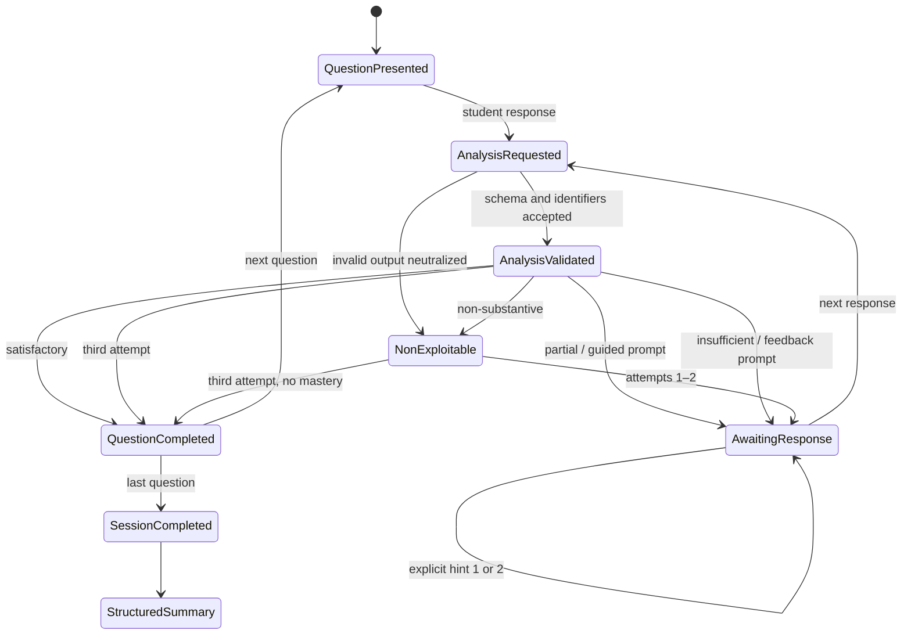

# Local Pedagogical Session Engine

> **Status:** Local demonstration — forbidden in production
> **Authority:** [`Socrato-Pedagogical-Framework.md`](./Socrato-Pedagogical-Framework.md)

## Purpose

The local engine demonstrates the complete pedagogical state flow without an AI provider, database, external service, or durable student data. It is a pure TypeScript domain under `lib/pedagogical-session-engine/`; React is only an adapter that presents transitions.

## State diagram

## Engine responsibilities

The engine owns session state, the maximum of three attempts (`PED-PROG-021`), explicit hint levels 0–2 (`PED-HINT-001`), transition authorization, identifier validation (`PED-AI-004`), result statuses, question completion and the structured summary. Level 0 means no explicit help requested; levels 1 and 2 are the only student-requested hints. Ordinary reformulation and follow-up prompts remain feedback and never increment the hint level. It never stores the submitted response in its state and never logs it (`PED-PRIV-003`).

The response validator rejects unknown knowledge, operation and document identifiers, forbidden fields and incompatible transitions. An invalid analyzer response is neutralized as non-exploitable with low confidence; it cannot alter progress or assign mastery.

## Future AI API responsibilities

A future API may analyze a response and propose a structured result. It must implement `ResponseAnalyzer`, return the exact contract, remain replaceable and never own session state. The engine validates every output before use. The API cannot add facts, identifiers, documents, pages or a complete student-facing answer.

## Question responsibilities

Each question supplies stable identifiers, its primary and secondary operations, targeted historical knowledge, authorized and required documents, and two explicit hints. Hint 1 directs attention to evidence without interpreting it. Hint 2 supplies a reasoning structure or approved optional workbook reference without completing the historical response. The primary operation is explicit and is never inferred from array order.

## Local analyzer limitations

`LocalDeterministicResponseAnalyzer` is deliberately conservative. It can recognize an empty or symbol-only input, but it does not claim to understand arbitrary prose. Exact reserved inputs under `[demo:…]` produce reproducible test scenarios; they are control commands, not language understanding. Any other interpretable text receives an explicitly unassessed, low-confidence demonstration response; keywords never produce mastery. Short answers and responses containing errors remain potentially substantive (`PED-RESP-010`, `PED-RESP-013`).

Both the analyzer and the in-memory repository throw in production. Their notices state that the demonstration is not a real pedagogical evaluation.

## Temporary data and summary reuse

The in-memory repositories are optional, process-local and lost at restart. They are not persistence substitutes. `PedagogicalOutcomeRepository` defines future summary recording, Page 2 lookup by activity and conversation deletion without coupling the domain to a database. The structured summary contains only worked identifiers and the three approved statuses; `not_assessed` is never emitted. It is shaped for Page 2 reuse without a second AI call. Durable summary storage remains the responsibility of a future persistent adapter.

Workbook references are optional. A provider returns only teacher-approved references with a verified edition and targeted knowledge; an empty result never blocks the session.

## Remaining decisions

The framework still defers exact assessment thresholds, retention durations, exceptional-safety operations, production AI providers and schemas, supported workbook editions, and approval workflows. The local analyzer must not resolve those decisions implicitly.

## PED-to-test correspondence

| Rules | Covered behavior |
|---|---|
| `PED-RESP-004`–`PED-RESP-013` | satisfactory, partial, insufficient, short, error-filled and invalid responses |
| `PED-FDBK-004`, `PED-FDBK-006`, `PED-FDBK-009` | ordered feedback, one priority prompt, no complete answer |
| `PED-HINT-001`–`PED-HINT-007` | monotonic levels 0–2, two explicit hints maximum, feedback excluded and optional resource direction |
| `PED-NONEXP-003`–`PED-NONEXP-018` | conservative recovery, repetition, inappropriate content and safety separation |
| `PED-ADAPT-010` | advanced mastery criteria excluding language quality |
| `PED-PROG-013`, `PED-PROG-014`, `PED-PROG-021`, `PED-PROG-022` | worked elements only, three attempts and approved result statuses |
| `PED-SUM-001`–`PED-SUM-011` | structured local summary and optional consolidation |
| `PED-WB-001`–`PED-WB-008` | approved, edition-bound, optional workbook references |
| `PED-AI-004`, `PED-AI-006`, `PED-AI-008`, `PED-AI-009` | engine authority, strict output validation and deterministic fallback |
| `PED-PRIV-002`–`PED-PRIV-006` | no response in URL or logs, no durable conversation |

The executable mapping is maintained in `tests/local-pedagogical-session-engine.test.ts`.
