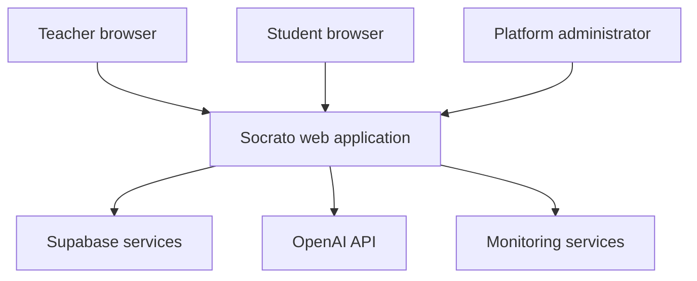
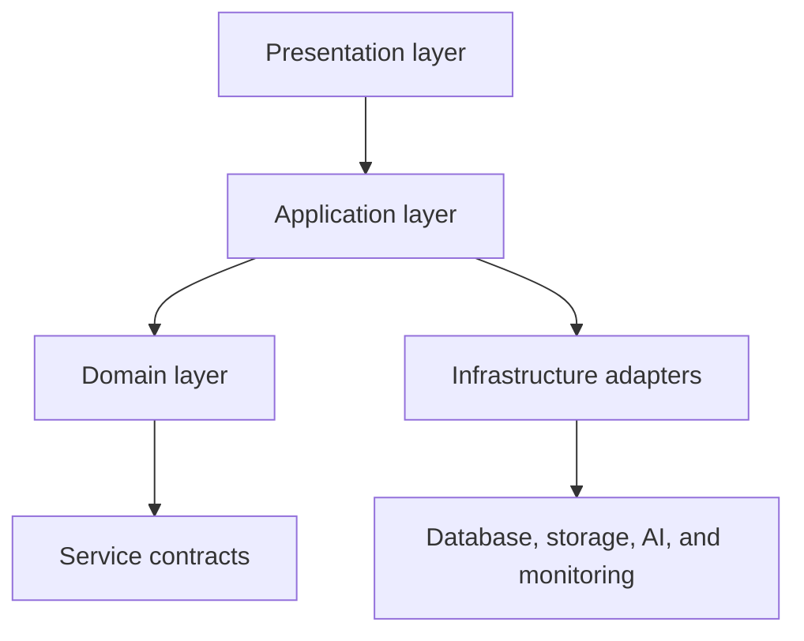
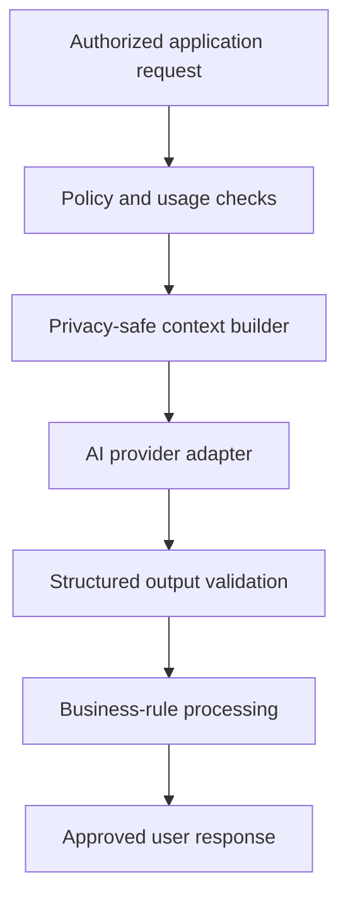
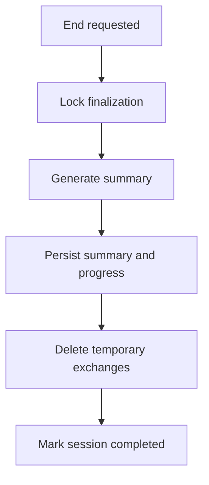
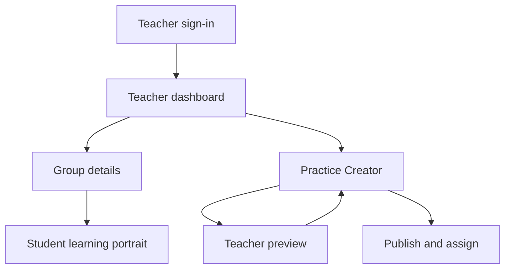
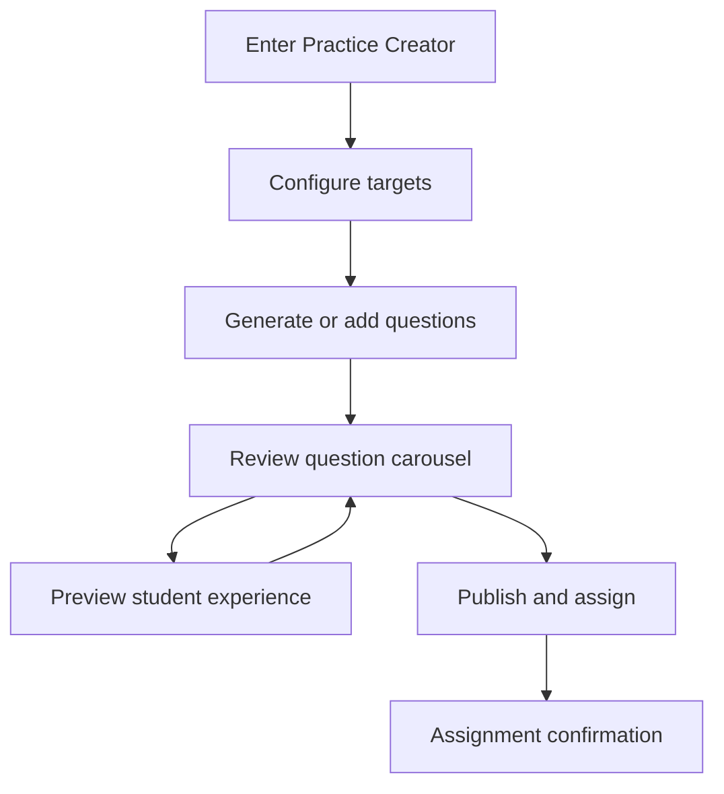
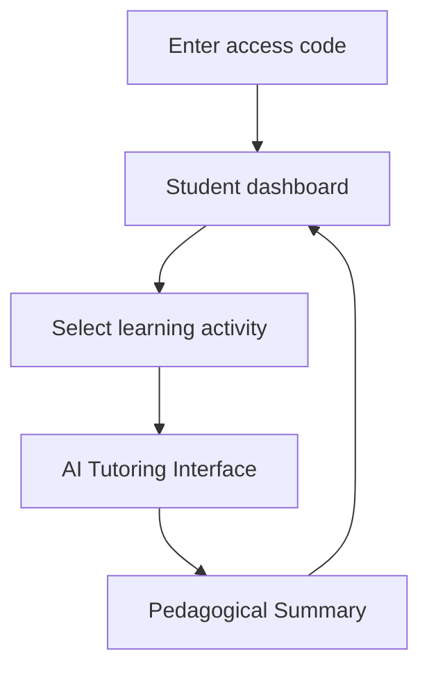

# Socrato Technical Specifications

> **Version:** 0.1.0  
> **Status:** Draft — Under Active Development  
> **Project:** Socrato  
> **Author:** David Hinse  
> **Last Updated:** July 2026  
> **Normative Reference:** `Engineering-Handbook.md`

---

# 1. Document Governance

## Purpose

The **Socrato Technical Specifications** are the authoritative implementation reference for the Socrato platform.

This document translates the permanent product, pedagogical, user experience, privacy, security, and engineering principles defined in the **Socrato Engineering Handbook** into concrete and testable implementation requirements.

It specifies:

- system boundaries and application architecture;
- user roles, permissions, and access rules;
- pages, components, states, and responsive behavior;
- navigation flows and business workflows;
- authentication and authorization mechanisms;
- database entities, relationships, and retention rules;
- internal and external API contracts;
- artificial intelligence orchestration and tutoring behavior;
- progress tracking and pedagogical summaries;
- privacy, security, moderation, and emergency safeguards;
- cost-control, resilience, observability, and deployment requirements;
- testing criteria and implementation sequencing.

The specifications are written for software engineers, designers, product contributors, reviewers, and AI coding agents working on Socrato.

## Authority and Precedence

The **Socrato Engineering Handbook** remains the highest-level engineering and product authority.

The following order of precedence applies:

1. the **Socrato Engineering Handbook**;
2. the **Socrato Technical Specifications**;
3. approved Architecture Decision Records;
4. approved design artifacts and interface prototypes;
5. implementation code and automated tests;
6. informal notes, discussions, and temporary development decisions.

If an implementation requirement conflicts with the Engineering Handbook, the Handbook takes precedence and the conflicting specification must be revised before development continues.

If implementation code conflicts with an approved requirement in this document, the code is considered non-compliant unless the specification has been formally updated.

Implementation convenience must never override student learning, student safety, teacher control, privacy, product simplicity, or long-term maintainability.

## Normative Language

The key words **MUST**, **MUST NOT**, **REQUIRED**, **SHOULD**, **SHOULD NOT**, and **MAY** are used as normative requirement terms:

- **MUST**, **MUST NOT**, and **REQUIRED** define mandatory implementation requirements.
- **SHOULD** and **SHOULD NOT** define strong recommendations that may be departed from only with a documented reason.
- **MAY** defines an optional capability or acceptable implementation choice.

Requirements that use normative language are expected to be verifiable through code review, automated testing, manual acceptance testing, or operational evidence.

## Requirement Identifiers

Every binding requirement SHOULD use a stable identifier with the following format:

```text
[DOMAIN]-[NUMBER]
```

Examples:

- authentication: `AUTH-001`;
- pages: `PAGE-006`;
- data: `DATA-014`;
- artificial intelligence: `AI-023`;
- privacy: `PRIV-009`;
- security: `SEC-012`.

Identifiers MUST remain stable after a requirement has been referenced by implementation code, tests, an issue, a pull request, or an Architecture Decision Record. A retired requirement MUST be marked as deprecated or superseded rather than silently reassigned.

## Specification Status

| Status | Meaning |
|---|---|
| `Draft` | The requirement is being defined and is not yet approved for implementation. |
| `Approved` | The requirement is ready for implementation. |
| `In Implementation` | Active implementation work exists. |
| `Implemented` | The requirement has been implemented but may still require final validation. |
| `Verified` | The implementation has passed its defined acceptance criteria. |
| `Blocked` | Progress is prevented by an identified dependency or unresolved decision. |
| `Deferred` | The requirement is intentionally excluded from the current release scope. |
| `Deprecated` | The requirement remains documented for traceability but must not be used for new development. |
| `Superseded` | A newer identified requirement or decision replaces the requirement. |
| `Rejected` | The requirement was considered and explicitly not adopted. |

The document-level status remains `Draft — Under Active Development` until all requirements necessary for the first production release have been approved.

## Change Management

Changes to these specifications MUST preserve traceability between the product decision, the requirement, the implementation, and its validation.

A material change MUST document:

- the requirement or section being changed;
- the reason for the change;
- the affected pages, workflows, data, APIs, or services;
- the privacy, security, pedagogical, cost, and migration impact;
- the acceptance criteria that must be added or updated.

A change affecting system boundaries, data ownership, privacy, security, authentication, authorization, AI behavior, or long-term architectural direction SHOULD be accompanied by an Architecture Decision Record.

## Definition of Implementation-Ready

A feature is implementation-ready only when:

- its objective and scope are explicit;
- its users and permissions are identified;
- its entry points, states, transitions, and exit conditions are defined;
- its business rules and exceptional cases are documented;
- its data inputs, outputs, storage, and retention rules are known;
- its API or service dependencies are identified;
- its privacy and security implications have been reviewed;
- its responsive and accessibility behavior is specified;
- its loading, empty, error, offline, and recovery states are defined where applicable;
- its acceptance criteria are testable;
- no unresolved decision would materially change the implementation.

Visual polish alone does not make a feature implementation-ready.

## Definition of Done

A requirement is complete only when:

- the implementation satisfies the approved specification;
- authorization and input validation are enforced server-side where applicable;
- automated tests cover critical business rules and failure paths;
- responsive behavior and accessibility have been validated;
- privacy, security, and data-retention requirements have been verified;
- observability is sufficient to diagnose failures without exposing sensitive data;
- user-facing error and recovery behavior has been validated;
- related documentation is current;
- the implementation is deployable and rollback-safe.

## Living Document Policy

This is a living implementation document.

It MUST evolve when approved implementation decisions change, but it MUST NOT be rewritten merely to match accidental implementation behavior. The specification should describe the intended system; the code should then be brought into compliance with that intent.

Historical decisions that materially influenced the architecture SHOULD remain traceable through version control and Architecture Decision Records.

---

# Table of Contents

## Part I — Product and System Definition

1. Document Governance
2. Product Scope and System Boundaries
3. User Roles and Permissions
4. Domain Model and Shared Terminology

## Part II — Application Experience

5. Application Architecture
6. Navigation and User Flows
7. Page Specifications
8. Component Specifications
9. Responsive Design and Accessibility

## Part III — Core Product Capabilities

10. Identity, Authentication, and Access
11. Group and Student Management
12. Practice Creation and Publication
13. AI Tutoring Engine
14. Learning Progress and Mastery Tracking
15. Pedagogical Summaries and Reporting
16. Content and Historical Document Management

## Part IV — Data and Integration

17. Data Architecture and Database Schema
18. API Architecture and Contracts
19. Background Jobs and Event Processing
20. Caching and Session State

## Part V — Trust, Safety, and Operations

21. Privacy and Data Retention
22. Security and Encryption
23. Student Safety and Emergency Moderation
24. Cost Control and Usage Limits
25. Reliability and Error Recovery
26. Observability, Analytics, and Auditability

## Part VI — Delivery and Verification

27. Environments and Configuration
28. Testing Strategy and Acceptance Criteria
29. Deployment and Rollback
30. Data Migration and Versioning
31. Implementation Roadmap
32. Requirement Traceability

## Appendices

- Appendix A — Requirement Identifier Registry
- Appendix B — Page and Route Registry
- Appendix C — API Endpoint Registry
- Appendix D — Database Entity Registry
- Appendix E — State and Status Registry
- Appendix F — Error Code Registry
- Appendix G — Architecture Decision Record Index
- Appendix H — Open Decisions and Deferred Capabilities

---

# Part I — Product and System Definition

# 2. Product Scope and System Boundaries

> **Purpose**
>
> This section defines what Socrato is responsible for, which capabilities belong within the platform, and which responsibilities remain outside the system.

---

## 2.1 Product Definition

Socrato is an AI-powered tutoring platform designed to help Québec secondary school students revise **History of Québec and Canada** through adaptive Socratic dialogue.

The platform supports two primary user groups:

- teachers, who create and assign revision practices and monitor student learning;
- students, who complete personalized revision sessions and review their learning progress.

Socrato complements classroom instruction. It does not replace the teacher, the official curriculum, classroom assessment, or professional pedagogical judgment.

The first production version focuses on **Secondary IV History of Québec and Canada**. Expansion to additional subjects, grade levels, or markets remains outside the initial implementation scope.

## 2.2 Primary Product Objectives

Socrato MUST:

- help students identify and address specific learning gaps;
- encourage reasoning before providing explanations;
- provide adaptive support through Socratic questioning;
- allow teachers to create, review, preview, and publish revision practices;
- provide students with clear access to assigned and self-directed revision activities;
- track lightweight progress by Historical Knowledge and Intellectual Operation;
- generate useful pedagogical summaries without retaining complete conversations;
- provide teachers with actionable learning insights;
- minimize the collection and storage of student information;
- protect student identity from external AI services;
- remain simple, reliable, maintainable, and financially sustainable.

## 2.3 Initial Production Scope

The initial production scope includes the following capabilities.

### 2.3.1 Teacher Experience

Teachers can:

- authenticate securely;
- create and manage teaching groups;
- add students to a group;
- generate anonymous student access codes;
- view a global teacher dashboard;
- view the learning portrait of an individual group;
- view the learning portrait of an individual student;
- identify students who may require additional support;
- create revision practices;
- select the Notions, Historical Knowledge, and Intellectual Operations to be practised;
- assemble compatible approved Questions and their associated Historical Documents from the Content Administrator bank;
- review, validate, or replace selected Questions;
- preview the complete student experience before publication;
- assign a practice to one or more groups;
- define applicable availability or usage limits;
- review pedagogical summaries and progress indicators.

### 2.3.2 Student Experience

Students can:

- access Socrato using an anonymous access code;
- view their personalized dashboard;
- access a teacher-assigned practice;
- continue an activity already in progress;
- revise a historical Notion;
- revise a specific Historical Knowledge item;
- retrain a specific intellectual operation;
- interact with Socrato through an adaptive tutoring interface;
- consult the historical documents associated with each question;
- request a page-based hint without receiving the answer;
- submit a written response;
- submit an oral response when voice functionality is available;
- receive immediate formative feedback;
- view an end-of-practice pedagogical summary;
- consult a lightweight portrait of their progress.

### 2.3.3 AI Tutoring

The AI tutoring system can:

- present approved or generated practice questions;
- analyze student responses;
- identify partial understanding and misconceptions;
- ask adaptive follow-up questions;
- guide the student toward an answer;
- explain vocabulary when necessary;
- provide page references as hints;
- maintain temporary session context;
- assess progress against defined Historical Knowledge and Intellectual Operations;
- produce a structured end-of-session pedagogical summary;
- detect exceptional high-severity safety situations.

## 2.4 Supported Learning Modes

Socrato supports the following learning modes:

| Mode | Description |
|---|---|
| Teacher-assigned practice | A structured revision activity created or approved by the teacher and assigned to one or more groups. |
| Weekly practice | The currently prioritized teacher-assigned practice displayed prominently on the student dashboard. |
| Notion review | A student-initiated revision session focused on a selected historical Notion. |
| Historical Knowledge review | A targeted revision session focused on a specific Historical Knowledge item. |
| Intellectual-operation review | A targeted session focused on a specific intellectual operation. |
| Continued practice | The resumption of an eligible activity that was previously started but not completed. |
| Teacher preview | A simulation of the student experience used by the teacher before or after publishing a practice. |

Every learning session MUST have an explicit mode. The active mode MUST remain identifiable throughout the session so that navigation, progress tracking, question selection, and summaries remain contextually accurate.

## 2.5 Core System Domains

The Socrato platform is divided into the following functional domains:

| Domain | Responsibility |
|---|---|
| Identity and Access | Teacher authentication, student access codes, sessions, roles, and permissions. |
| Group Management | Teaching groups, student membership, and group-level configuration. |
| Practice Management | Practice creation, question review, preview, publication, assignment, and lifecycle management. |
| Tutoring | Question delivery, adaptive dialogue, hints, feedback, and session orchestration. |
| Learning Progress | Mastery signals, Historical Knowledge, Intellectual Operations, session outcomes, and pedagogical summaries. |
| Historical Content | Notions, Historical Knowledge, Questions, documents, page references, sources, and educational metadata. |
| Teacher Insights | Group portraits, individual student portraits, priorities, and learning reports. |
| Privacy and Safety | Data minimization, retention, deletion, anonymization, emergency detection, and alerts. |
| Platform Operations | Usage limits, cost controls, monitoring, reliability, configuration, and deployment. |

Each domain SHOULD remain modular. User interface code MUST NOT become the sole location of critical business rules.

## 2.6 System Boundary

The Socrato system boundary includes:

- the student web application;
- the teacher web application;
- shared user interface components;
- server-side application services;
- authentication and authorization services;
- the operational database;
- temporary session-state mechanisms;
- historical content and document storage;
- AI orchestration services;
- progress-calculation services;
- pedagogical summary generation;
- privacy and retention enforcement;
- safety detection and emergency notification logic;
- monitoring, logging, and operational controls.

The system boundary excludes:

- school information systems unless a future approved integration is implemented;
- external classroom-management platforms;
- official government student records;
- teacher grading systems;
- permanent storage of complete tutoring conversations;
- general-purpose internet search performed by students;
- unrestricted communication between students;
- automated disciplinary decisions;
- autonomous high-stakes academic assessment.

## 2.7 External Service Boundary

Socrato may depend on approved external services for:

- artificial intelligence inference;
- application hosting;
- database hosting;
- authentication;
- file storage;
- email or notification delivery;
- monitoring and error reporting.

External services MUST receive only the minimum data required to perform their approved function.

Real student names and directly identifying student information MUST NOT be transmitted to the AI provider.

Requests sent to the AI provider MUST use:

- an anonymous internal student identifier;
- the minimum required pedagogical context;
- the current question and approved supporting content;
- the temporary conversational context required for the active session;
- no unnecessary teacher, student, school, or group information.

External service failures MUST NOT compromise stored data, expose sensitive information, or cause the platform to lose confirmed progress without a recoverable error state.

## 2.8 Data Boundary

Socrato stores only the information required to provide the approved learning experience.

The platform may retain:

- teacher accounts;
- teaching groups;
- anonymous student identifiers and access codes;
- group membership;
- practices and assignments;
- historical content and source metadata;
- lightweight progress indicators;
- mastery states by Historical Knowledge and Intellectual Operation;
- completed-session pedagogical summaries;
- operational usage data;
- exceptional safety records when legally and operationally necessary.

The platform MUST NOT use complete tutoring conversations as permanent student records.

During an active practice, the system MAY temporarily retain the conversational context required to operate the tutoring session.

After the end-of-session pedagogical summary has been generated and safely recorded:

1. the required progress indicators MUST be persisted;
2. the pedagogical summary MUST be persisted;
3. the temporary working conversation MUST be deleted according to the approved retention workflow;
4. only the minimum operational evidence necessary to confirm successful processing MAY remain.

Detailed retention periods and deletion mechanisms are defined in the **Privacy and Data Retention** section.

## 2.9 Human Responsibility Boundary

Teachers remain responsible for:

- selecting educational objectives;
- determining whether a practice is appropriate;
- validating generated educational content;
- deciding when and how practices are assigned;
- interpreting student progress information;
- making pedagogical and assessment decisions;
- responding to exceptional safety notifications.

Socrato is responsible for:

- presenting the approved learning experience;
- applying defined business rules consistently;
- guiding students without completing their work for them;
- generating formative learning signals;
- protecting student information;
- preserving system integrity;
- clearly communicating uncertainty and failure states.

Socrato MUST NOT:

- assign official grades autonomously;
- replace teacher judgment;
- diagnose a student;
- make disciplinary decisions;
- guarantee mastery based on a single interaction;
- treat AI-generated conclusions as unquestionable facts.

## 2.10 Product Boundaries and Non-Goals

The initial version of Socrato is not:

- a general-purpose chatbot;
- a search engine;
- a homework completion tool;
- a direct-answer generator;
- a social network;
- a student surveillance platform;
- a school information system;
- an official grading platform;
- a replacement for the teacher;
- a permanent conversation archive;
- a complete learning-management system;
- a platform for unrestricted user-generated content.

Features that move Socrato toward one of these excluded purposes MUST NOT be implemented without an explicit product decision and an update to both the Engineering Handbook and these specifications where required.

## 2.11 Deferred Capabilities

The following capabilities are outside the initial production scope but may be considered in future versions:

- direct parent or independent-student subscriptions;
- subjects other than History of Québec and Canada;
- grade levels other than the initial Secondary IV experience;
- school-board or publisher integrations;
- integrations with external learning-management systems;
- multilingual tutoring beyond the approved initial languages;
- advanced longitudinal analytics across multiple school years;
- automated content licensing and publisher marketplaces;
- native mobile applications;
- broader administrative portals;
- district-level reporting.

Deferred capabilities MUST NOT influence the initial architecture in ways that create unnecessary complexity. However, the architecture SHOULD avoid decisions that would make reasonable future expansion prohibitively difficult.

## 2.12 Operational Boundaries

The platform MUST enforce configurable operational limits, including where applicable:

- the number of active or assigned practices;
- the number of AI-assisted generations;
- the number of student tutoring exchanges;
- the maximum duration of an inactive session;
- the amount and type of temporary conversational context;
- the size and format of uploaded content;
- request frequency;
- retry behavior;
- provider-level spending limits.

Operational limits MUST be enforced server-side.

The user interface SHOULD communicate limits clearly before they interrupt an important workflow.

Limits MUST support cost predictability without unnecessarily preventing legitimate learning.

## 2.13 Scope Change Requirements

A proposed capability is considered a scope change when it:

- introduces a new user role;
- collects a new category of personal information;
- changes who can access student information;
- retains conversations or student data for a longer period;
- adds a new external service;
- changes the role of the AI;
- introduces official grading or assessment;
- allows communication between users;
- changes the platform's initial educational market;
- materially increases operational cost or security risk.

Every material scope change MUST be reviewed for:

- pedagogical value;
- student safety;
- teacher control;
- privacy impact;
- security impact;
- accessibility;
- operational cost;
- scalability;
- maintainability;
- compatibility with the Engineering Handbook.

## 2.14 Acceptance Criteria

The product scope is correctly implemented when:

- teacher and student capabilities remain clearly separated;
- every protected capability is limited to the appropriate role;
- students can access only the learning context associated with their anonymous code;
- the AI provider does not receive real student names;
- Socrato does not present itself as an official grading or diagnostic system;
- complete conversations are not retained as permanent student records;
- temporary conversation data is removed after summary processing;
- every tutoring session has a defined learning mode and pedagogical target;
- teachers retain control over practice publication and educational decisions;
- excluded capabilities cannot be accessed through undocumented routes or APIs;
- operational limits can be configured and enforced server-side;
- external-service failures produce safe and recoverable states;
- future capabilities remain disabled until explicitly approved.

## 2.15 Related Sections

This section is implemented in conjunction with:

- **User Roles and Permissions**;
- **Application Architecture**;
- **Navigation and User Flows**;
- **Identity, Authentication, and Access**;
- **Group and Student Management**;
- **Practice Creation and Publication**;
- **AI Tutoring Engine**;
- **Learning Progress and Mastery Tracking**;
- **Privacy and Data Retention**;
- **Security and Encryption**;
- **Student Safety and Emergency Moderation**;
- **Cost Control and Usage Limits**;
- **Data Architecture and Database Schema**;
- **API Architecture and Contracts**;
- **Observability, Analytics, and Auditability**.

---

# 3. User Roles and Permissions

> **Purpose**
>
> This section defines the human and system roles recognized by Socrato, the permissions assigned to each role, and the authorization boundaries that protect student learning data.

---

## 3.1 Authorization Principles

Socrato follows the principles of **least privilege**, **deny by default**, **server-side enforcement**, and **explicit ownership**.

The authorization model MUST satisfy the following requirements:

- `ROLE-001` — Every protected request MUST be associated with an authenticated or otherwise valid authorized session.
- `ROLE-002` — Access MUST be denied unless a rule explicitly grants it.
- `ROLE-003` — Authorization MUST be enforced on the server. Interface visibility alone MUST NOT be treated as an access-control mechanism.
- `ROLE-004` — Every protected resource MUST have an identifiable owner or authorization scope.
- `ROLE-005` — A user MUST receive only the permissions required for the active role and workflow.
- `ROLE-006` — A user MUST NOT gain access by changing a route, identifier, request body, query parameter, client state, or browser storage value.
- `ROLE-007` — Cross-teacher and cross-group access MUST be prevented unless an explicitly approved administrative workflow requires it.
- `ROLE-008` — Sensitive permission changes MUST be validated, logged, and attributable to an authorized actor.

## 3.2 Primary Roles

The initial Socrato authorization model includes three human roles:

| Role | Identifier | Description |
|---|---|---|
| Teacher | `teacher` | An authenticated educational professional who manages groups, creates practices, and reviews learning progress. |
| Student | `student` | A learner who accesses a limited, teacher-scoped learning environment using an anonymous access code. |
| Platform Administrator | `platform_admin` | A restricted internal operator responsible for platform configuration, system integrity, and authorized operational support. |

Roles MUST be represented by stable internal identifiers. Display labels MAY be localized without changing the internal role values.

The initial production version MUST NOT allow users to create custom roles or assign arbitrary permissions.

## 3.3 Teacher Role

### 3.3.1 Teacher Scope

A teacher's authorization scope includes only:

- the teacher's own account and preferences;
- groups owned by or explicitly assigned to the teacher;
- students belonging to those groups;
- practices created by or made available to the teacher;
- assignments created for those groups;
- learning progress and summaries belonging to students within those groups;
- approved historical content available to teachers generally.

A teacher MUST NOT access another teacher's private groups, student records, unpublished practices, or analytics through direct identifiers or undocumented routes.

### 3.3.2 Teacher Permissions

An authorized teacher MAY:

- view and update the teacher's own profile settings;
- create, rename, archive, and manage teaching groups;
- add or remove students within an authorized group;
- generate, view, regenerate, or deactivate student access codes according to the approved access-code workflow;
- view the teacher dashboard;
- view group-level learning portraits;
- view individual student learning portraits within authorized groups;
- view students identified as requiring additional pedagogical support;
- create and edit draft practices;
- assemble compatible approved Questions from the Content Administrator bank;
- review, modify, validate, or replace selected Questions;
- attach or select approved historical documents;
- preview the student experience;
- publish, assign, pause, close, archive, or duplicate an authorized practice;
- view practice completion and progress summaries;
- configure teacher-controlled settings exposed by the platform.

### 3.3.3 Teacher Restrictions

A teacher MUST NOT:

- access groups or students outside the teacher's authorization scope;
- obtain or inspect complete student–Socrato conversation transcripts;
- transmit real student names to the AI provider;
- modify platform-wide security, retention, moderation, or cost-control policies;
- access secrets, provider credentials, raw authentication data, or infrastructure settings;
- alter a student's historical progress without an approved correction workflow;
- publish AI-generated educational content without the validation required by the practice workflow;
- impersonate a student in a way that writes to the student's real progress record.

## 3.4 Student Role

### 3.4.1 Student Scope

A student session is scoped to:

- one valid anonymous student identity;
- the teacher context associated with that identity;
- the student's current group membership;
- practices assigned or otherwise made available to that student;
- the student's own permitted progress information;
- the student's active temporary tutoring session.

Student access MUST remain limited even when the student knows or guesses another resource identifier.

### 3.4.2 Student Permissions

An authorized student MAY:

- access the student dashboard;
- view the active or weekly teacher-assigned practice;
- view other practices made available to the student;
- begin, continue, or complete an eligible learning session;
- select an available Notion, Historical Knowledge item, or Intellectual Operation for revision;
- view questions and their approved supporting historical documents;
- submit written responses;
- submit oral responses when voice functionality is enabled;
- request approved hints or page references;
- receive adaptive tutoring feedback;
- view the student's own pedagogical summary;
- view the student's own permitted progress indicators;
- return safely to the student dashboard.

### 3.4.3 Student Restrictions

A student MUST NOT:

- access the teacher application or teacher-only APIs;
- view another student's identity, access code, progress, summary, or active session;
- view group-level analytics or teacher notes;
- create, modify, publish, or assign practices;
- change mastery values or pedagogical summaries directly;
- access platform administration capabilities;
- retrieve system prompts, private answer keys, hidden evaluation criteria, or provider credentials;
- use Socrato as a general-purpose chatbot or unrestricted search engine;
- bypass usage, session, content, or safety limits through client-side manipulation.

## 3.5 Platform Administrator Role

### 3.5.1 Administrative Purpose

The `platform_admin` role exists only for authorized platform operation, configuration, security, and support.

Administrative access MUST NOT be used for routine observation of student learning activity.

### 3.5.2 Administrative Permissions

An authorized platform administrator MAY, when operationally necessary:

- manage approved platform configuration;
- manage system-wide content catalogs and controlled feature flags;
- review service health, usage totals, failures, and security events;
- manage provider limits and platform-level cost controls;
- investigate technical incidents using privacy-preserving operational data;
- manage authorized teacher-account support workflows;
- execute approved data correction, export, retention, or deletion procedures;
- review exceptional emergency records when explicitly required by the approved safety procedure;
- perform other documented operational actions required to maintain the platform.

### 3.5.3 Administrative Restrictions

A platform administrator MUST NOT:

- browse student learning records without a legitimate documented operational purpose;
- access complete tutoring conversations as a routine support capability;
- use student data for unrelated analytics, profiling, or surveillance;
- change educational outcomes or summaries without an authorized correction procedure;
- disclose student, teacher, or school information to unauthorized persons;
- use a shared administrative account;
- bypass audit logging for sensitive actions.

Administrative access SHOULD require stronger authentication than standard user access and MUST be reviewed periodically.

## 3.6 Teacher Preview Context

Teacher preview is an authorization context, not a separate user role.

While using preview mode, the teacher remains authenticated as `teacher`, but the interface simulates the student experience.

The preview context MUST satisfy the following requirements:

- `ROLE-009` — Preview mode MUST be clearly identified as a simulation.
- `ROLE-010` — Preview activity MUST NOT modify any real student's progress, mastery, summary, activity status, or completion record.
- `ROLE-011` — Preview activity MUST NOT consume or invalidate a student's assignment attempt.
- `ROLE-012` — Preview mode MUST NOT create a real student session.
- `ROLE-013` — Preview-generated safety detections MUST NOT notify a real teacher or create a real student emergency record.
- `ROLE-014` — Preview mode MAY consume AI usage and MUST therefore remain subject to configured cost and rate limits.
- `ROLE-015` — A teacher MUST be authorized to access the practice before previewing it.

## 3.7 System Actors

Internal services may perform actions without representing a human-facing role. These actors include:

| System actor | Responsibility |
|---|---|
| AI orchestration service | Builds approved AI requests, validates outputs, and coordinates tutoring responses. |
| Progress service | Converts eligible learning evidence into lightweight progress updates. |
| Summary service | Produces and persists structured end-of-session pedagogical summaries. |
| Retention service | Deletes temporary conversations and expired data according to policy. |
| Safety service | Detects exceptional high-severity situations and initiates the approved response workflow. |
| Background worker | Executes authorized asynchronous and retryable operations. |

System actors MUST:

- use dedicated service identities or explicitly scoped internal credentials;
- receive only the permissions required for their function;
- validate the scope of every resource they process;
- produce privacy-safe operational evidence where traceability is required;
- remain inaccessible as interactive user accounts.

## 3.8 Permission Matrix

The following matrix defines the high-level permission baseline:

| Capability | Student | Teacher | Platform administrator |
|---|:---:|:---:|:---:|
| Access own permitted profile context | Yes | Yes | Support only |
| Manage teacher account settings | No | Own account | Support only |
| Manage groups | No | Authorized groups | Support only |
| Manage student membership | No | Authorized groups | Support only |
| Manage student access codes | No | Authorized groups | Support only |
| View own student dashboard | Yes | Preview only | No routine access |
| View individual progress | Own only | Authorized students | Restricted support only |
| View group analytics | No | Authorized groups | No routine access |
| Create and edit practices | No | Yes | Content operations only |
| Publish and assign practices | No | Authorized groups | No routine access |
| Complete a real practice | Yes | No | No |
| Preview a practice | No | Yes | No routine access |
| Modify platform configuration | No | No | Yes |
| View operational monitoring | No | No | Yes |
| View complete conversation transcripts | No | No | No routine capability |
| Access provider secrets | No | No | Restricted operational process only |

Detailed resource-level rules take precedence over this summary matrix.

## 3.9 Resource Ownership and Isolation

Every protected resource MUST include or resolve to an authorization scope.

At minimum:

- a group MUST resolve to its authorized teacher ownership or assignment;
- a student identity MUST resolve to its permitted teacher and group context;
- a practice MUST resolve to its creator, visibility, and lifecycle state;
- an assignment MUST resolve to both an authorized practice and an authorized target group;
- a progress record MUST resolve to exactly one anonymous student identity and its permitted educational context;
- a tutoring session MUST resolve to one authorized student or one isolated preview context;
- a pedagogical summary MUST resolve to the student and session from which it was generated.

Authorization checks SHOULD be performed as close as possible to the data-access boundary.

Client-provided ownership values MUST NOT be trusted without server-side verification.

## 3.10 Group Membership Changes

When a student is added to, moved between, or removed from a group, the system MUST apply an explicit membership workflow.

The workflow MUST define:

- which teacher is authorized to perform the change;
- whether assigned practices remain accessible;
- whether existing progress remains associated with the student;
- whether an access code must be regenerated or deactivated;
- whether historical summaries remain visible to the former or new teacher;
- how accidental cross-teacher disclosure is prevented.

Removing a student from a group MUST revoke access to group-scoped practices that are no longer authorized. It MUST NOT silently delete learning records that remain subject to an approved retention requirement.

Cross-teacher transfers MUST NOT be implemented as a simple client-side group identifier change.

## 3.11 Session and Role Transitions

Socrato MUST NOT permit an active session to change roles merely by navigating to a different interface.

The following rules apply:

- a teacher entering preview mode remains a teacher in an isolated preview context;
- a student cannot become a teacher without completing the teacher authentication workflow;
- an administrator using an approved support workflow remains identifiable as the administrator;
- signing out or invalidating a session MUST remove access to protected resources;
- changes to a user's role or authorization scope SHOULD invalidate or refresh existing sessions promptly;
- expired, revoked, malformed, or mismatched sessions MUST fail safely.

## 3.12 Sensitive Actions

Sensitive actions include:

- changing a role or administrative permission;
- generating or deactivating access codes;
- exporting, correcting, or deleting user data;
- accessing exceptional emergency records;
- changing privacy, retention, safety, security, or cost-control configuration;
- changing ownership of a group or educational record;
- disabling a teacher account;
- rotating or replacing operational credentials.

Sensitive actions MUST:

- require explicit authorization;
- be validated server-side;
- produce an audit event containing the actor, action, target category, result, and timestamp;
- avoid recording secrets or unnecessary personal information in the audit event;
- fail without partial unauthorized changes.

The system MAY require recent authentication or an additional verification step for particularly sensitive actions.

## 3.13 Unauthorized Access Behavior

When access is denied, Socrato MUST:

- avoid revealing whether an inaccessible student, group, practice, or record exists;
- return a consistent authorization error appropriate to the interface or API;
- avoid including sensitive details in the error response;
- record suspicious or repeated authorization failures when operationally appropriate;
- provide a safe navigation path when the denial occurs in the user interface.

The application MUST NOT redirect an unauthorized student into a teacher interface or expose protected content briefly while authorization is being resolved.

## 3.14 Authorization Acceptance Criteria

The authorization model is correctly implemented when:

- `ROLE-016` — A student can access only the student's own permitted dashboard, practices, progress, summaries, and active sessions.
- `ROLE-017` — A teacher can access only authorized groups, students, practices, assignments, and analytics.
- `ROLE-018` — Changing a resource identifier does not grant access to another user's data.
- `ROLE-019` — Teacher-only and administrator-only operations reject student sessions server-side.
- `ROLE-020` — Hidden interface controls do not replace API authorization checks.
- `ROLE-021` — Preview activity never modifies real student data.
- `ROLE-022` — No standard role provides routine access to complete tutoring conversations.
- `ROLE-023` — Removed or revoked access stops working within the defined invalidation period.
- `ROLE-024` — Sensitive administrative actions are attributable to an individual authorized administrator.
- `ROLE-025` — Background services cannot access resources beyond their documented scope.
- `ROLE-026` — Unauthorized responses do not disclose the existence or contents of protected resources.
- `ROLE-027` — Cross-teacher and cross-group isolation is covered by automated authorization tests.

## 3.15 Related Sections

This section is implemented in conjunction with:

- **Product Scope and System Boundaries**;
- **Domain Model and Shared Terminology**;
- **Application Architecture**;
- **Navigation and User Flows**;
- **Identity, Authentication, and Access**;
- **Group and Student Management**;
- **Practice Creation and Publication**;
- **Learning Progress and Mastery Tracking**;
- **Privacy and Data Retention**;
- **Security and Encryption**;
- **Student Safety and Emergency Moderation**;
- **Observability, Analytics, and Auditability**.


---

# 4. Domain Model and Shared Terminology

> **Purpose**
>
> This section defines the canonical concepts and vocabulary used throughout Socrato. The same meanings MUST be preserved across product interfaces, source code, APIs, database schemas, analytics, tests, and documentation.

---

## 4.1 Terminology Principles

The domain language MUST satisfy the following requirements:

- `TERM-001` — Every core concept MUST have one canonical English name and one stable internal identifier.
- `TERM-002` — User-facing translations MAY vary by locale, but MUST preserve the canonical meaning.
- `TERM-003` — Two concepts with different lifecycles, ownership, or authorization rules MUST NOT share the same internal entity merely because their interface labels are similar.
- `TERM-004` — Database tables, API resources, events, types, and tests SHOULD use the terminology defined in this section.
- `TERM-005` — New domain terms MUST be added here before they become dependencies across multiple features.
- `TERM-006` — Ambiguous generic terms such as `item`, `data`, `activity`, `result`, or `record` SHOULD NOT replace a defined domain term.

Canonical terms are written in English. Approved French interface labels are documented where they materially clarify the user experience.

## 4.2 Core Relationship Model

The primary domain relationships are:

```text
Teacher
  └── manages Group
        ├── contains Student Identity
        └── receives Practice Assignment

Practice
  ├── targets Notion, Historical Knowledge, and/or Intellectual Operation
  ├── contains ordered Practice Questions
  └── may be assigned through Practice Assignment

Student Identity
  └── starts Learning Session
        ├── presents Practice Questions
        ├── produces temporary Tutoring Exchanges
        ├── produces Learning Evidence
        └── ends with Pedagogical Summary and Progress Updates
```

This model is conceptual. Physical database design is defined in **Data Architecture and Database Schema**.

## 4.3 Actor Terms

### 4.3.1 Teacher

A **Teacher** is an authenticated user who manages authorized groups, creates and assigns practices, and reviews permitted student learning information.

Canonical identifier:

```text
teacher
```

The term **Teacher** describes an application role. It does not by itself establish ownership of every educational resource.

### 4.3.2 Student Identity

A **Student Identity** is the platform's anonymous internal representation of one learner within an authorized educational context.

Canonical identifier:

```text
student_identity
```

A Student Identity:

- MUST have a stable internal identifier;
- MUST be separate from the student's access credential;
- MUST NOT expose a real student name to the AI provider;
- MAY be associated with teacher-visible identification data according to the approved privacy model;
- MUST remain subject to group, teacher, retention, and access rules.

The terms `student`, `student identity`, `student account`, and `student code` MUST NOT be treated as interchangeable in technical implementation.

### 4.3.3 Platform Administrator

A **Platform Administrator** is a restricted internal operator authorized to perform approved platform-level operational actions.

Canonical identifier:

```text
platform_admin
```

This role is distinct from a teacher and MUST NOT be used as a general-purpose bypass for resource authorization.

## 4.4 Organizational Terms

### 4.4.1 Group

A **Group** is a teacher-scoped collection of Student Identities used to organize practice assignments and learning insights.

Canonical identifier:

```text
group
```

Approved French interface label:

```text
Groupe
```

A Group has:

- an internal identifier;
- an authorized teacher ownership or assignment scope;
- a display name;
- a lifecycle status;
- zero or more Student Memberships;
- zero or more Practice Assignments.

A Group is not a school, course catalog, official class record, or permanent student identity source.

### 4.4.2 Student Membership

A **Student Membership** is the relationship connecting one Student Identity to one Group for a defined period and authorization context.

Canonical identifier:

```text
student_membership
```

Membership MUST be modeled separately from Student Identity so that group changes do not require rewriting the student's identity or learning history.

### 4.4.3 School or Organization

An **Organization** is an optional future boundary representing a school, school service centre, district, publisher, or other approved institutional tenant.

Canonical identifier:

```text
organization
```

Organization-level multi-tenancy is deferred unless explicitly introduced by an approved architectural decision. Code MUST NOT assume that all teachers belong to one shared organization.

## 4.5 Identity and Access Terms

### 4.5.1 Teacher Account

A **Teacher Account** is the authenticated account used by one Teacher to access protected teacher capabilities.

Canonical identifier:

```text
teacher_account
```

A Teacher Account is distinct from the Teacher's profile, preferences, group ownership, and authentication session.

### 4.5.2 Student Access Code

A **Student Access Code** is a revocable credential used to establish an authorized Student Session without sending the student's real identity to the AI provider.

Canonical identifier:

```text
student_access_code
```

Approved French interface label:

```text
Code d'accès
```

A Student Access Code:

- is a credential, not a student identifier;
- MUST be associated server-side with exactly one valid access context;
- MUST be revocable or regenerable;
- MUST NOT be used as a database primary key;
- MUST NOT be sent to the AI provider;
- MUST be protected from unauthorized disclosure.

### 4.5.3 Authentication Session

An **Authentication Session** is the time-bounded server-recognized authorization context created after successful teacher authentication or student code validation.

Canonical identifier:

```text
auth_session
```

An Authentication Session is distinct from a Learning Session.

## 4.6 Curriculum Terms

### 4.6.1 Historical Period

A **Historical Period** is a high-level curriculum interval used to organize Notions, content, practices, and interface context.

Canonical identifier:

```text
historical_period
```

Approved French interface label:

```text
Période historique
```

### 4.6.2 Notion

A **Notion** is a coherent curriculum topic within a Historical Period that groups related Historical Knowledge, sources, and learning objectives.

Canonical identifier:

```text
notion
```

Approved French interface label:

```text
Notion
```

A Notion is broader than a Historical Knowledge and may be addressed by multiple Practices.

### 4.6.3 Lesson

A **Lesson** is an instructional subdivision defined by the approved teaching sequence or source material.

Canonical identifier:

```text
lesson
```

A Lesson MAY reference one or more Notions and Historical Knowledge. A Lesson MUST NOT be treated as equivalent to a Notion unless the approved content model explicitly establishes that relationship.

### 4.6.4 Historical Knowledge

A **Historical Knowledge** is a specific item of historical knowledge or understanding that can be taught, practised, and tracked.

Canonical identifier:

```text
historical_knowledge
```

Approved French interface label:

```text
Connaissance
```

A Historical Knowledge SHOULD be sufficiently precise to support targeted revision and meaningful progress evidence.

### 4.6.5 Intellectual Operation

An **Intellectual Operation** is a historical thinking process that a student applies to evidence, facts, chronology, or relationships.

Canonical identifier:

```text
intellectual_operation
```

Approved French interface label:

```text
Opération intellectuelle
```

The initial operation registry includes:

| Canonical key | Approved French label |
|---|---|
| `establish_facts` | Établir des faits |
| `causes_and_consequences` | Déterminer des causes et des conséquences |
| `time_and_space` | Situer dans le temps et l'espace |
| `relationships_between_facts` | Mettre en relation des faits |
| `changes_and_continuities` | Déterminer des changements et des continuités |
| `differences_and_similarities` | Déterminer des différences et des similitudes |
| `causal_connections` | Établir des liens de causalité |

The definitive curriculum mapping, wording, and assessment rules MUST be validated before these values become a production database enum or irreversible migration dependency.

### 4.6.5A Disciplinary Competencies

The disciplinary competencies **Caractériser une période de l'histoire du Québec et du Canada** (`C1`) and **Interpréter une réalité sociale** (`C2`) are distinct from Intellectual Operations. Questions and Socratic exchanges contribute to developing these competencies, but `C1` and `C2` MUST NOT become additional Intellectual Operation values, Progress Record targets, Mastery State indicators, or Student Dashboard indicators.

### 4.6.6 Learning Objective

A **Learning Objective** is a teacher-defined or curriculum-defined statement describing what a student should understand or be able to do.

Canonical identifier:

```text
learning_objective
```

A Learning Objective may reference one or more Notions, Historical Knowledge, and Intellectual Operations.

## 4.7 Practice Terms

### 4.7.1 Practice

A **Practice** is a reusable, versioned educational activity definition containing pedagogical targets, ordered questions, supporting documents, configuration, and lifecycle state.

Canonical identifier:

```text
practice
```

Approved French interface label:

```text
Pratique de révision
```

A Practice is not a student's attempt, session, assignment, or summary.

### 4.7.2 Practice Draft

A **Practice Draft** is an editable Practice version that has not yet been published.

Canonical identifier:

```text
practice_draft
```

Draft content MUST NOT become available to students through normal student workflows.

### 4.7.3 Published Practice

A **Published Practice** is an immutable or controlled-version Practice release that is eligible for assignment or preview.

Canonical identifier:

```text
published_practice
```

Editing a published Practice MUST follow the versioning rules defined in **Practice Creation and Publication**.

### 4.7.4 Practice Assignment

A **Practice Assignment** is the relationship that makes one Published Practice available to a defined target, normally a Group, within an optional availability window.

Canonical identifier:

```text
practice_assignment
```

Approved French interface concept:

```text
Pratique assignée
```

A Practice Assignment may define:

- the target Group;
- availability dates;
- priority or weekly-practice status;
- completion policy;
- applicable usage limits;
- lifecycle status.

Publishing a Practice and assigning a Practice are separate actions.

### 4.7.5 Practice Question

A **Practice Question** is a versioned question definition included in a Practice.

Canonical identifier:

```text
practice_question
```

A Practice Question MUST reference:

- exactly one Historical Period;
- exactly one Notion;
- one or more Historical Knowledge targets;
- one or more Intellectual Operations.

The Question-to-Intellectual-Operation relationship is many-to-many: one Question may target one or more Intellectual Operations, and one Intellectual Operation may be targeted by many Questions.

A Practice Question may contain:

- an approved prompt;
- pedagogical targets;
- expected evidence or answer criteria;
- Socratic guidance rules;
- hints and page references;
- supporting Historical Documents;
- an explicit position within the Practice;
- teacher validation metadata.

A Practice Question MAY reference zero, one, or many Historical Documents. A Historical Document MAY support many Practice Questions. This Question-to-Document relationship is many-to-many. A Question with no Historical Document is a **Knowledge Question** (`Question de connaissances`) and is valid, not an error.

The initial scope does not add a **Quiz éclair** Learning Mode, Practice type, or dashboard element.

### 4.7.6 Question Attempt

A **Question Attempt** is the student's interaction state and learning evidence associated with one Practice Question during one Learning Session.

Canonical identifier:

```text
question_attempt
```

A Question Attempt is not the Practice Question itself and MUST NOT modify the published question definition.

### 4.7.7 Teacher Preview

A **Teacher Preview** is an isolated simulation of a Published Practice or eligible Practice version using the student interface without creating real student learning records.

Canonical identifier:

```text
teacher_preview
```

## 4.8 Tutoring Terms

### 4.8.1 Learning Session

A **Learning Session** is one bounded instance of a student or preview interaction with Socrato for a defined learning mode and pedagogical target.

Canonical identifier:

```text
learning_session
```

A Learning Session has:

- exactly one student or isolated preview context;
- one explicit Learning Mode;
- one primary pedagogical target;
- a lifecycle state;
- temporary tutoring context;
- zero or more Question Attempts;
- at most one final Pedagogical Summary.

### 4.8.2 Learning Mode

A **Learning Mode** identifies why a Learning Session was started and how its content was selected.

Canonical identifier:

```text
learning_mode
```

Initial canonical values are:

| Canonical value | Meaning |
|---|---|
| `teacher_assigned` | Session created from a teacher-assigned Practice. |
| `weekly_practice` | Session created from the currently prioritized weekly Practice. |
| `notion_review` | Student-selected review of a Notion. |
| `historical_knowledge_review` | Targeted review of Historical Knowledge. |
| `intellectual_operation_review` | Targeted review of an Intellectual Operation. |
| `continued_practice` | Resumption of an eligible incomplete session. |
| `teacher_preview` | Isolated teacher simulation of the student experience. |

### 4.8.3 Tutoring Exchange

A **Tutoring Exchange** is one temporary conversational unit consisting of a system prompt, question, student response, tutor response, tool result, or related session message.

Canonical identifier:

```text
tutoring_exchange
```

Tutoring Exchanges are temporary working data. They are not permanent pedagogical records and MUST follow the conversation-deletion workflow.

### 4.8.4 Hint

A **Hint** is limited guidance intended to help the student continue reasoning without revealing the answer.

Canonical identifier:

```text
hint
```

For the initial History experience, a student-requested Hint SHOULD provide an approved page reference or equivalent bounded guidance according to the Practice configuration.

### 4.8.5 Learning Evidence

**Learning Evidence** is structured evidence derived from eligible student interaction and used to support a progress update or pedagogical summary.

Canonical identifier:

```text
learning_evidence
```

Learning Evidence MAY indicate:

- demonstrated understanding;
- partial understanding;
- misconception;
- successful use of an Intellectual Operation;
- need for additional guidance;
- insufficient evidence.

Learning Evidence MUST remain distinct from a permanent mastery judgment.

## 4.9 Progress Terms

### 4.9.1 Progress Record

A **Progress Record** is a lightweight, persisted representation of a student's accumulated learning state for a defined pedagogical target.

Canonical identifier:

```text
progress_record
```

A Progress Record may be associated with a Notion, Historical Knowledge, Intellectual Operation, Practice, or approved reporting period.

### 4.9.2 Mastery State

A **Mastery State** is a controlled pedagogical status derived from sufficient eligible Learning Evidence.

Canonical identifier:

```text
mastery_state
```

The initial user-facing registry is:

| Canonical value | Approved French label | Meaning |
|---|---|---|
| `mastered` | Maîtrisée | Current evidence indicates reliable understanding. |
| `consolidate` | À consolider | Understanding is present but requires reinforcement. |
| `needs_work` | À travailler | Current evidence indicates a meaningful learning gap. |
| `not_assessed` | Non travaillée | No sufficient eligible evidence is available. |

A Mastery State is a formative indicator, not an official grade or permanent judgment of student ability.

Thresholds and transition rules MUST be defined in **Learning Progress and Mastery Tracking** and MUST NOT be inferred from interface colors alone.

### 4.9.3 Completion State

A **Completion State** describes the lifecycle progress of a Practice Assignment, Learning Session, or other completable workflow.

Canonical identifier:

```text
completion_state
```

Completion and mastery are distinct. Completing a Practice MUST NOT automatically imply mastery.

### 4.9.4 Pedagogical Summary

A **Pedagogical Summary** is the structured end-of-session record containing the minimum useful learning conclusions retained after temporary Tutoring Exchanges are deleted.

Canonical identifier:

```text
pedagogical_summary
```

A Pedagogical Summary may contain:

- demonstrated strengths;
- Historical Knowledge or Intellectual Operations to consolidate;
- Historical Knowledge or Intellectual Operations requiring additional work;
- approved pages to consult;
- completion metadata;
- references to resulting Progress Updates;
- a student-facing representation;
- a teacher-facing representation.

A Pedagogical Summary MUST NOT reproduce the complete conversation.

### 4.9.5 Progress Update

A **Progress Update** is an auditable change applied to a Progress Record using eligible Learning Evidence from a defined source.

Canonical identifier:

```text
progress_update
```

The Progress Update SHOULD preserve enough provenance to explain which session and pedagogical target caused the change without retaining the complete conversation.

### 4.9.6 Student Learning Portrait

A **Student Learning Portrait** is a derived presentation of one student's permitted Progress Records and Pedagogical Summaries.

Canonical identifier:

```text
student_learning_portrait
```

Approved French interface concept:

```text
Portrait de progression de l'élève
```

The portrait is a view or projection, not the authoritative source of progress data.

### 4.9.7 Group Learning Portrait

A **Group Learning Portrait** is an authorized aggregate presentation of learning information for Student Identities within one Group.

Canonical identifier:

```text
group_learning_portrait
```

Approved French interface concept:

```text
Portrait global du groupe
```

## 4.10 Historical Content Terms

### 4.10.1 Historical Document

A **Historical Document** is an approved primary or secondary source presented to support a Practice Question.

Canonical identifier:

```text
historical_document
```

A Historical Document may contain or reference:

- an image, excerpt, map, chart, or other approved media;
- a title and document number;
- a description or legend;
- source attribution;
- rights or licensing metadata;
- curriculum relationships;
- accessibility text;
- version information.

### 4.10.2 Source Attribution

**Source Attribution** is the structured citation and rights information associated with a Historical Document or educational content item.

Canonical identifier:

```text
source_attribution
```

Source Attribution MUST remain attached to the content wherever the source is displayed or reused.

### 4.10.3 Page Reference

A **Page Reference** is an approved reference to a specific page or page range in an authorized student resource.

Canonical identifier:

```text
page_reference
```

A Page Reference is not necessarily a public URL and MUST identify the applicable resource edition when page numbering could differ.

### 4.10.4 Content Item

A **Content Item** is a generic parent concept used only when a workflow legitimately handles multiple defined content types such as questions, documents, or excerpts.

Canonical identifier:

```text
content_item
```

Implementation SHOULD prefer the specific domain type whenever it is known.

## 4.11 Safety and Operational Terms

### 4.11.1 Safety Detection

A **Safety Detection** is the internal classification result produced when content is evaluated against the approved high-severity emergency policy.

Canonical identifier:

```text
safety_detection
```

A Safety Detection does not automatically prove that an emergency exists.

### 4.11.2 Emergency Alert

An **Emergency Alert** is the single high-severity notification record created only when the approved exceptional intervention threshold is met.

Canonical identifier:

```text
emergency_alert
```

Socrato does not use routine low- or medium-severity teacher alerts for ordinary tutoring conversations.

### 4.11.3 Audit Event

An **Audit Event** is a privacy-minimized record of a security-sensitive or administratively significant action.

Canonical identifier:

```text
audit_event
```

An Audit Event is distinct from application logging and MUST NOT contain secrets or complete tutoring conversations.

### 4.11.4 Usage Record

A **Usage Record** is an operational measurement used for cost control, rate limiting, capacity planning, or provider reconciliation.

Canonical identifier:

```text
usage_record
```

Usage Records SHOULD use anonymous or aggregated identifiers wherever detailed attribution is unnecessary.

### 4.11.5 Feature Flag

A **Feature Flag** is a controlled configuration value used to enable, disable, or gradually release an approved capability.

Canonical identifier:

```text
feature_flag
```

A Feature Flag MUST NOT be used as the only authorization control for protected data or actions.

## 4.12 Lifecycle Vocabulary

Where applicable, domain entities SHOULD use explicit lifecycle terminology:

| Term | Meaning |
|---|---|
| `draft` | Editable and not available through the normal published workflow. |
| `published` | Released and eligible for its approved use. |
| `active` | Currently usable within its authorization and availability rules. |
| `paused` | Temporarily unavailable without being completed or archived. |
| `completed` | Finished according to the applicable completion rule. |
| `closed` | No longer accepting new activity. |
| `archived` | Retained for approved historical or operational reasons but removed from normal active views. |
| `revoked` | Explicitly invalidated and no longer authorized. |
| `expired` | No longer valid because its approved time boundary has passed. |
| `deleted` | Removed according to an approved deletion workflow. |

These values MUST NOT be applied indiscriminately to every entity. Each entity's allowed transitions are defined in its owning specification.

## 4.13 Prohibited Ambiguities

The following distinctions MUST be preserved:

| Do not confuse | With | Reason |
|---|---|---|
| Student Identity | Student Access Code | One represents the learner; the other is a revocable credential. |
| Authentication Session | Learning Session | One authorizes access; the other represents tutoring activity. |
| Practice | Practice Assignment | One defines content; the other makes it available to a target. |
| Published Practice | Question Attempt | One is an approved definition; the other is student interaction state. |
| Completion State | Mastery State | Finishing an activity does not prove understanding. |
| Learning Evidence | Mastery State | Evidence is an input; mastery is a derived pedagogical status. |
| Tutoring Exchange | Pedagogical Summary | Exchanges are temporary; summaries are minimized retained outcomes. |
| Group | Organization | A teaching group is not an institutional tenant. |
| Teacher Preview | Student Session | Preview must not create real student records. |
| Application Log | Audit Event | Operational diagnostics and security traceability have different requirements. |

## 4.14 Naming Conventions

Unless a later implementation section defines a more specific convention:

- canonical identifiers MUST use lowercase `snake_case` values;
- TypeScript types and domain classes SHOULD use singular `PascalCase` names;
- variables and functions SHOULD use descriptive `camelCase` names;
- API resource names SHOULD use consistent plural nouns;
- database naming MUST remain consistent within the selected database convention;
- event names SHOULD describe completed facts rather than commands;
- boolean names SHOULD describe a true condition clearly;
- user-facing French labels MUST remain separate from internal identifiers.

Example:

```text
Canonical term:     Practice Assignment
TypeScript type:    PracticeAssignment
Variable:           practiceAssignment
API resource:       practice-assignments
Canonical key:      practice_assignment
French label:       Pratique assignée
```

## 4.15 Terminology Acceptance Criteria

The shared domain model is correctly applied when:

- `TERM-007` — The same canonical term has the same meaning across the database, API, application, tests, and documentation.
- `TERM-008` — Student Access Codes are not used as Student Identity primary keys.
- `TERM-009` — Authentication Sessions and Learning Sessions have separate lifecycles.
- `TERM-010` — Practices and Practice Assignments can be managed independently.
- `TERM-011` — Teacher Preview data cannot be mistaken for real student learning data.
- `TERM-012` — Completion does not automatically produce a mastered status.
- `TERM-013` — Temporary Tutoring Exchanges are not stored as Pedagogical Summaries.
- `TERM-014` — Every Progress Update can identify its permitted source without retaining the complete conversation.
- `TERM-015` — French interface labels can change without requiring internal identifier migration.
- `TERM-016` — New lifecycle states cannot be introduced without defining their meaning and transitions.
- `TERM-017` — Safety Detections and Emergency Alerts remain distinct concepts.

## 4.16 Related Sections

This section is implemented in conjunction with:

- **User Roles and Permissions**;
- **Application Architecture**;
- **Page Specifications**;
- **Identity, Authentication, and Access**;
- **Group and Student Management**;
- **Practice Creation and Publication**;
- **AI Tutoring Engine**;
- **Learning Progress and Mastery Tracking**;
- **Pedagogical Summaries and Reporting**;
- **Content and Historical Document Management**;
- **Data Architecture and Database Schema**;
- **API Architecture and Contracts**;
- **Privacy and Data Retention**;
- **Student Safety and Emergency Moderation**.

---

# Part II — Application Experience

# 5. Application Architecture

> **Purpose**
>
> This section defines the target application architecture for Socrato, including runtime boundaries, system layers, module responsibilities, communication patterns, and architectural constraints.

---

## 5.1 Architectural Objectives

The Socrato architecture MUST support:

- a simple and coherent learning experience;
- strict separation between teacher, student, and administrative capabilities;
- server-side protection of data and business rules;
- privacy-preserving AI interactions;
- modular development and testing;
- reliable progress and summary processing;
- controlled operational costs;
- gradual scaling without unnecessary early complexity;
- safe recovery from external-service failures;
- long-term maintainability.

The architecture MUST remain aligned with the Engineering Handbook's principles of modularity, separation of concerns, API-first design, privacy by design, security by default, scalability, resilience, observability, and simplicity.

## 5.2 Target Technology Stack

The initial target stack is:

| Layer | Target technology | Primary responsibility |
|---|---|---|
| Web application | Next.js with the App Router | Teacher and student interfaces, server rendering, routing, and application endpoints. |
| Programming language | TypeScript | Shared type safety across client, server, domain, and tests. |
| UI runtime | React | Reusable interactive interface components. |
| Application hosting | Vercel | Web deployment, server execution, previews, and edge delivery where appropriate. |
| Operational database | Supabase PostgreSQL | Durable relational application data and transactional integrity. |
| Teacher authentication | Supabase Auth or approved equivalent | Secure teacher identity and session management. |
| File storage | Supabase Storage or approved equivalent | Controlled historical documents and approved application assets. |
| AI provider | OpenAI API through a server-side adapter | Tutoring, question generation, structured analysis, and summary generation. |
| Styling | Project design-system implementation | Tokens, responsive layouts, themes, and reusable visual components. |
| Validation | Shared schema-validation layer | Runtime validation of external input and structured service output. |
| Monitoring | Approved privacy-safe monitoring services | Errors, performance, service health, and operational alerts. |

Specific package versions MUST be recorded in the project dependency files and lockfile rather than duplicated throughout this document.

A material replacement of Next.js, PostgreSQL, the authentication provider, the hosting platform, or the AI provider requires an approved architectural decision and an impact review.

## 5.3 System Context



All browser traffic MUST enter through the Socrato web application or an explicitly approved public endpoint.

Browsers MUST NOT connect directly to the AI provider.

Direct browser access to database or storage capabilities MAY be used only when protected by reviewed authorization policies and when it does not bypass application business rules.

## 5.4 Architectural Layers

Socrato uses the following logical layers:



### 5.4.1 Presentation Layer

The presentation layer includes:

- routes and layouts;
- pages and views;
- reusable visual components;
- forms and client interactions;
- loading, empty, error, and recovery states;
- responsive and accessibility behavior;
- localized user-facing labels.

The presentation layer MAY coordinate user interaction, but MUST NOT be the sole implementation location for authorization, privacy rules, mastery calculation, usage enforcement, or other critical business logic.

### 5.4.2 Application Layer

The application layer coordinates use cases such as:

- creating a group;
- generating student access codes;
- publishing and assigning a Practice;
- starting or continuing a Learning Session;
- processing a student response;
- finalizing a session;
- producing a Pedagogical Summary;
- updating progress;
- deleting temporary tutoring data;
- creating an Emergency Alert;
- enforcing usage limits.

Each application operation MUST validate the actor, resource scope, input, applicable business rules, and resulting state transition.

### 5.4.3 Domain Layer

The domain layer contains business concepts and rules that should remain independent from interface rendering and specific service providers.

It includes:

- canonical domain types;
- entity invariants;
- lifecycle transitions;
- permission decisions that depend on domain ownership;
- Practice rules;
- Learning Session rules;
- progress and mastery policies;
- summary rules;
- retention eligibility rules;
- usage-policy decisions.

Domain logic SHOULD be expressed through explicit functions, policies, or services with deterministic tests where possible.

### 5.4.4 Infrastructure Layer

The infrastructure layer implements access to:

- PostgreSQL;
- authentication services;
- file storage;
- AI providers;
- notification providers;
- queues or background execution;
- monitoring and logging;
- configuration and secrets.

Provider-specific objects and error formats SHOULD be translated into Socrato-owned types before reaching the application or presentation layers.

## 5.5 Runtime Boundaries

### 5.5.1 Browser Runtime

The browser runtime is untrusted.

It MAY contain:

- rendered interface state;
- non-sensitive view models;
- temporary form input;
- optimistic interaction state;
- accessibility and theme preferences;
- short-lived identifiers required for the current authorized workflow.

It MUST NOT contain:

- AI provider credentials;
- database administrative credentials;
- authentication signing secrets;
- unrestricted storage credentials;
- answer keys or hidden evaluation criteria not intended for the user;
- trust decisions that are not revalidated by the server;
- complete cross-user datasets.

### 5.5.2 Server Runtime

The server runtime is responsible for:

- verifying sessions;
- authorizing access;
- validating input;
- applying business rules;
- accessing protected database records;
- constructing AI requests;
- validating AI outputs;
- enforcing usage limits;
- protecting secrets;
- recording operational evidence;
- initiating background work.

Security-sensitive modules MUST be marked or structured as server-only and MUST NOT be imported into client bundles.

### 5.5.3 Background Runtime

Background execution is used for work that should not depend on an open browser request, including where appropriate:

- summary finalization;
- conversation deletion;
- retryable notification delivery;
- expired-session cleanup;
- retention enforcement;
- aggregate progress processing;
- file processing;
- reconciliation and operational maintenance.

Background work MUST be idempotent or otherwise protected against duplicate execution.

## 5.6 Rendering and Component Boundaries

Next.js Server Components SHOULD be the default for pages and components that primarily retrieve protected data and render content.

Client Components SHOULD be introduced only when required for:

- browser event handling;
- interactive form state;
- media capture;
- local transitions;
- theme controls;
- other browser-only capabilities.

The following requirements apply:

- `ARCH-001` — A component MUST NOT become a Client Component solely for developer convenience.
- `ARCH-002` — Protected data retrieval SHOULD occur on the server whenever practical.
- `ARCH-003` — Data passed to Client Components MUST be minimized to the fields required for rendering and interaction.
- `ARCH-004` — Server-only secrets or services MUST NOT cross the serialization boundary.
- `ARCH-005` — Critical mutations MUST revalidate authorization and input on the server.
- `ARCH-006` — Page-level data loading MUST define loading, empty, unauthorized, error, and recovery behavior.

## 5.7 Route and Interface Separation

Teacher, student, and administrative experiences MUST use clear route and layout boundaries.

The routing architecture MUST ensure that:

- teacher routes require a valid Teacher Session;
- student routes require a valid Student Session;
- administrative routes require a valid Platform Administrator Session;
- preview routes preserve teacher authorization while isolating preview data;
- public routes expose no protected educational information;
- route middleware MAY reject obviously invalid sessions, but final authorization MUST remain in the server operation that accesses the resource.

Route naming is defined in **Page Specifications** and **Appendix B — Page and Route Registry**.

## 5.8 Feature Modules

The application SHOULD be organized into feature modules aligned with domain responsibility.

Initial feature modules include:

| Module | Responsibility |
|---|---|
| `identity` | Teacher accounts, Student Identities, sessions, and role context. |
| `groups` | Groups, memberships, roster import, and access-code management. |
| `practices` | Practice drafts, questions, review, publication, and assignment. |
| `content` | Curriculum structure, historical documents, sources, and page references. |
| `tutoring` | Learning Sessions, question flow, hints, responses, and AI orchestration. |
| `progress` | Learning Evidence, mastery policy, Progress Records, and portraits. |
| `summaries` | Pedagogical Summary generation and presentation. |
| `safety` | High-severity detection, Emergency Alerts, and notification workflow. |
| `usage` | Rate limits, budgets, provider consumption, and usage reporting. |
| `platform` | Configuration, feature flags, monitoring, and administrative operations. |

Feature modules MAY share stable domain contracts and design-system components. They SHOULD NOT reach directly into another module's private implementation.

## 5.9 Data-Access Architecture

Database access MUST pass through a controlled server-side data-access layer.

The data-access layer MUST:

- use typed inputs and outputs;
- enforce or support resource authorization;
- avoid unbounded queries;
- select only required fields;
- preserve transactional integrity;
- translate provider errors into approved application errors;
- support deterministic testing through replaceable contracts where practical.

Row-level security SHOULD provide defense in depth for user-scoped database access. It MUST NOT be assumed to replace all application-level authorization and business-rule validation.

Administrative database credentials MUST remain server-only and SHOULD be limited to modules that require them.

## 5.10 API Architecture

Socrato uses application-owned server interfaces for browser mutations and external-service coordination.

An operation MAY be implemented as:

- a Next.js Server Action;
- a Route Handler;
- an internal application service;
- a background job handler;
- a versioned external API endpoint when an approved integration requires one.

The implementation mechanism does not change the requirements to:

- authenticate;
- authorize;
- validate;
- enforce usage policy;
- apply domain rules;
- return controlled errors;
- record required audit or operational evidence.

External API contracts MUST be versioned. Internal interfaces SHOULD remain replaceable without exposing provider-specific behavior to the browser.

## 5.11 AI Orchestration Architecture

All AI interactions MUST pass through the server-side Socrato AI orchestration layer.



The orchestration layer is responsible for:

- confirming the authorized use case;
- enforcing model and usage policy;
- removing unnecessary identifying information;
- selecting the approved prompt template;
- retrieving only required pedagogical context;
- limiting temporary conversation context;
- calling the configured AI provider;
- validating structured outputs;
- rejecting or safely handling malformed responses;
- applying tutoring and safety rules;
- recording privacy-safe usage metadata;
- returning an application-owned response type.

AI-generated content MUST be treated as untrusted external output until it has passed the applicable validation and business rules.

The AI provider MUST NOT receive:

- real student names;
- Student Access Codes;
- teacher authentication data;
- unrestricted student histories;
- infrastructure credentials;
- unrelated group or school information.

## 5.12 Tutoring Request Flow

A standard tutoring exchange follows this sequence:

1. the browser submits the Student Response for the active Question Attempt;
2. the server validates the Student Session and Learning Session;
3. the server verifies ownership, lifecycle state, and usage eligibility;
4. the response is validated and normalized;
5. the minimum approved pedagogical context is assembled;
6. the AI orchestration layer requests a tutoring response;
7. the output is structurally and pedagogically validated;
8. the temporary exchange is associated with the active Learning Session;
9. eligible Learning Evidence is derived or queued;
10. the approved response is returned to the student interface;
11. usage and error metrics are recorded without exposing conversation content.

The operation MUST protect against duplicate submission. Retrying a request MUST NOT create multiple contradictory Question Attempts or usage charges when idempotency can reasonably prevent them.

## 5.13 Session Finalization Flow

The end of a Learning Session is a controlled workflow:



The system MUST:

1. prevent competing finalization operations;
2. confirm that the session is eligible to end;
3. derive or generate the structured Pedagogical Summary;
4. validate the summary;
5. persist required Progress Updates and the Pedagogical Summary transactionally where practical;
6. schedule or perform deletion of temporary Tutoring Exchanges;
7. confirm completion without requiring the student browser to remain open;
8. expose a recoverable processing state if finalization is delayed;
9. avoid marking deletion complete before it has actually succeeded.

Summary generation failure MUST NOT cause confirmed student work to be silently discarded.

## 5.14 Event and Background Processing

The application MAY emit internal domain events after confirmed state changes.

Examples include:

```text
practice_published
practice_assigned
learning_session_started
learning_session_finalization_requested
pedagogical_summary_created
progress_updated
temporary_conversation_deleted
emergency_alert_created
student_access_code_revoked
```

Events describe completed facts. They MUST NOT claim that an operation succeeded before the underlying state has been durably confirmed.

Background handlers MUST:

- validate event schema and version;
- support safe retries;
- prevent harmful duplicate effects;
- use bounded retry policies;
- expose terminal failures for operational review;
- avoid including complete conversations in general event payloads.

## 5.15 State Management Architecture

Socrato distinguishes four categories of state:

| State category | Examples | Authority |
|---|---|---|
| Durable domain state | Practices, assignments, summaries, Progress Records | Database |
| Temporary server state | Active tutoring context, idempotency keys, job leases | Approved server-side store |
| URL state | Selected group, page, filter, or stable view context | Validated route/query parameters |
| Local interface state | Open panel, unsaved form field, carousel position | Browser component state |

The database is the source of truth for durable domain state.

Client-side state MUST NOT be treated as authoritative for permissions, completion, mastery, billing, or retention.

A global client-state library SHOULD NOT be added unless multiple features demonstrate a concrete requirement that cannot be handled clearly through server data, URL state, or local component state.

## 5.16 File and Historical Document Architecture

Historical files MUST be stored separately from their searchable metadata.

The database SHOULD store:

- stable document identity;
- title and display metadata;
- source attribution;
- rights information;
- curriculum relationships;
- file location or storage key;
- version and integrity metadata;
- accessibility metadata.

File storage SHOULD contain the media object itself.

Protected files MUST use authorized access or time-limited delivery mechanisms. File paths and public URLs MUST NOT be treated as sufficient authorization.

Uploaded or generated files MUST be validated for allowed type, size, integrity, and processing status before student use.

## 5.17 Caching Architecture

Caching MAY be used for:

- public or shared curriculum metadata;
- approved historical content metadata;
- stable page shells;
- aggregated non-sensitive operational values;
- other data with explicit invalidation rules.

Caching MUST NOT:

- expose one user's protected data to another user;
- serve revoked access after the defined invalidation boundary;
- cause stale teacher authorization or group membership to be accepted;
- treat temporary conversation data as public shared content;
- conceal a failed write as a successful update.

Every protected cache entry MUST have an authorization-safe key and an explicit invalidation strategy.

## 5.18 Failure and Resilience Boundaries

External service failures MUST be contained within their adapters and translated into controlled application behavior.

The architecture MUST distinguish:

- validation failure;
- authentication failure;
- authorization failure;
- domain conflict;
- usage-limit rejection;
- provider timeout;
- provider rate limit;
- malformed AI output;
- database failure;
- storage failure;
- background-processing delay;
- terminal processing failure.

Retryable and non-retryable errors MUST not be handled identically.

The interface SHOULD preserve safe user input when a retry is possible. A failure MUST NOT encourage repeated submissions that create duplicate records or uncontrolled AI costs.

## 5.19 Observability Architecture

Each server request and background operation SHOULD carry a correlation identifier.

Observability MUST support diagnosis of:

- route and operation failures;
- authentication and authorization failures;
- database latency and errors;
- AI provider latency, error type, model, and usage totals;
- background-job delay and terminal failure;
- summary finalization status;
- temporary-data deletion status;
- Emergency Alert delivery status;
- rate-limit and cost-limit enforcement.

General logs and traces MUST NOT contain:

- Student Access Codes;
- authentication tokens;
- provider secrets;
- complete tutoring conversations;
- unnecessary student identity data;
- unrestricted AI prompts containing student content.

## 5.20 Security Architecture

Security controls MUST be applied at multiple layers:

| Layer | Required control examples |
|---|---|
| Browser | Safe rendering, minimal exposed data, secure session handling. |
| Route | Session screening and protected layout boundaries. |
| Application | Authorization, validation, lifecycle and usage rules. |
| Data | Scoped queries, constraints, row-level security where applicable. |
| Provider | Server-only credentials, minimized payloads, timeouts, and validation. |
| Operations | Secret management, audit events, monitoring, rotation, and incident response. |

All traffic MUST use HTTPS/TLS in production.

Sensitive data at rest MUST be protected using approved platform encryption capabilities. Secrets MUST be stored in the deployment platform's protected secret-management mechanism and MUST NOT be committed to source control.

Detailed requirements are defined in **Security and Encryption**.

## 5.21 Privacy Architecture

Privacy is enforced architecturally through:

- separation of Student Identity from Student Access Code;
- exclusion of real student names from AI requests;
- minimum-context AI payloads;
- temporary treatment of Tutoring Exchanges;
- retained Pedagogical Summaries rather than conversation archives;
- scoped teacher access;
- privacy-safe logs and usage records;
- explicit retention and deletion processing;
- isolated Teacher Preview data;
- restricted administrative access.

Adding a new data flow requires identifying:

- the data categories involved;
- the purpose of processing;
- the authorized actors;
- the source and destination;
- the retention period;
- deletion behavior;
- external provider involvement;
- monitoring and audit requirements.

## 5.22 Scalability Architecture

The initial architecture SHOULD scale horizontally through stateless web execution and managed data services.

Server instances MUST NOT depend on local process memory for durable user state.

Scalability mechanisms SHOULD include:

- bounded and indexed database queries;
- pagination for growing lists;
- background processing for durable asynchronous work;
- rate limiting;
- provider timeouts and bounded retries;
- controlled concurrency;
- optimized historical-document loading;
- caching with safe invalidation;
- monitoring of capacity and latency;
- load testing before major adoption increases.

The project MUST NOT introduce distributed-system complexity without a measured need.

## 5.23 Architectural Decision Records

An Architecture Decision Record SHOULD be created before adopting or materially changing:

- the primary application framework;
- the database engine;
- the authentication strategy;
- the Student Access Code credential design;
- the AI provider abstraction;
- the background-processing mechanism;
- the tenancy model;
- the conversation-retention mechanism;
- the progress-calculation model;
- the file-storage provider;
- the deployment topology;
- a security-critical external service.

An approved decision MUST identify context, decision, alternatives considered, consequences, privacy impact, security impact, cost impact, and migration considerations.

## 5.24 Architecture Requirements

- `ARCH-007` — Browsers MUST NOT call the AI provider directly.
- `ARCH-008` — Critical business rules MUST be enforced server-side.
- `ARCH-009` — Durable domain state MUST NOT depend on one server process remaining alive.
- `ARCH-010` — External providers MUST be accessed through application-owned adapters or services.
- `ARCH-011` — AI outputs MUST be validated before affecting user-visible state or Progress Records.
- `ARCH-012` — Real student names and Student Access Codes MUST NOT be included in AI requests.
- `ARCH-013` — Teacher Preview MUST use an isolated non-student persistence context.
- `ARCH-014` — Background operations MUST tolerate safe duplicate delivery or execution.
- `ARCH-015` — Protected cache entries MUST include authorization-safe scoping.
- `ARCH-016` — Database administrative credentials MUST remain server-only.
- `ARCH-017` — Temporary conversation deletion MUST be independently verifiable.
- `ARCH-018` — Provider failures MUST be translated into controlled Socrato error states.
- `ARCH-019` — Monitoring MUST avoid secrets and complete tutoring conversations.
- `ARCH-020` — New external data flows MUST receive privacy and security review.
- `ARCH-021` — The architecture MUST support configurable usage and cost limits.
- `ARCH-022` — Confirmed progress writes MUST not be silently lost when AI or notification services fail.

## 5.25 Architecture Acceptance Criteria

The application architecture is correctly implemented when:

- teacher, student, preview, public, and administrative route boundaries are testable;
- protected operations revalidate session, role, ownership, and input on the server;
- no client bundle contains server credentials or server-only modules;
- browsers cannot construct unrestricted AI provider requests;
- database access is centralized through reviewed server-side patterns;
- AI requests contain only the approved minimum context;
- invalid AI output cannot directly update Progress Records;
- session finalization can complete without the browser remaining open;
- duplicate requests and background deliveries do not create harmful duplicate effects;
- temporary conversation deletion can be monitored and retried;
- provider timeouts and failures produce safe, understandable recovery states;
- protected cached data cannot cross authorization scopes;
- operational logs permit diagnosis without exposing protected content;
- the system can scale beyond one web-process instance;
- critical modules have replaceable contracts and focused automated tests.

## 5.26 Related Sections

This section is implemented in conjunction with:

- **Product Scope and System Boundaries**;
- **User Roles and Permissions**;
- **Domain Model and Shared Terminology**;
- **Navigation and User Flows**;
- **Page Specifications**;
- **Component Specifications**;
- **Identity, Authentication, and Access**;
- **AI Tutoring Engine**;
- **Data Architecture and Database Schema**;
- **API Architecture and Contracts**;
- **Background Jobs and Event Processing**;
- **Caching and Session State**;
- **Privacy and Data Retention**;
- **Security and Encryption**;
- **Cost Control and Usage Limits**;
- **Reliability and Error Recovery**;
- **Observability, Analytics, and Auditability**.

---

# 6. Navigation and User Flows

> **Purpose**
>
> This section defines how users move through Socrato, how application context is preserved, and which state transitions must occur during the primary teacher and student workflows.

---

## 6.1 Navigation Objectives

Navigation MUST:

- keep the next meaningful action clear;
- minimize unnecessary steps;
- preserve the user's current educational context;
- prevent users from entering unauthorized or invalid states;
- provide predictable return paths;
- support recovery after interruption or failure;
- remain consistent across desktop and mobile layouts;
- avoid exposing implementation complexity;
- keep learning at the center of the student experience.

The shortest route is not automatically the best route. A workflow MAY include an explicit review or confirmation step when it protects educational quality, privacy, safety, or irreversible data changes.

## 6.2 Navigation Requirements

- `NAV-001` — Every primary page MUST expose one visually clear primary action or current objective.
- `NAV-002` — Users MUST NOT be required to understand internal entities or technical state names to navigate successfully.
- `NAV-003` — Protected destinations MUST validate authorization on the server before protected content is rendered.
- `NAV-004` — Navigation MUST preserve the active Group, Student Identity, Practice, Learning Mode, or pedagogical target when that context remains valid.
- `NAV-005` — A missing, invalid, expired, or unauthorized context MUST produce a safe recovery destination.
- `NAV-006` — Browser history controls MUST not cause unauthorized data to reappear after sign-out or session invalidation.
- `NAV-007` — Destructive or difficult-to-reverse actions MUST require explicit confirmation.
- `NAV-008` — A successful mutation MUST provide visible confirmation and an appropriate next destination or updated state.
- `NAV-009` — A failed mutation MUST preserve recoverable user input whenever it is safe to do so.
- `NAV-010` — Navigation labels MUST use user-facing educational language rather than internal implementation terminology.

## 6.3 Navigation Context Model

The application recognizes the following navigation contexts:

| Context | Required information | Examples |
|---|---|---|
| Public | No protected identity | Landing page, teacher sign-in entry. |
| Teacher | Valid Teacher Session | Teacher dashboard, Practice Creator. |
| Group | Teacher context plus authorized Group | Group details, roster, group portrait. |
| Student portrait | Teacher context plus authorized Student Identity | Individual progress and summaries. |
| Student | Valid Student Session | Student dashboard and available Practices. |
| Learning | Student context plus active Learning Session | AI Tutoring Interface. |
| Preview | Teacher context plus isolated Practice preview | Simulated student dashboard and tutoring flow. |
| Administration | Valid Platform Administrator Session | Approved operational tools. |

Context transitions MUST be explicit. The application MUST NOT infer access merely because an identifier appears in the URL.

## 6.4 Global Entry Points

Socrato has two primary public entry paths:

### 6.4.1 Student Entry

The default public landing experience presents the Student Access Code workflow.

The flow is:

```text
Landing Page
  → Enter Student Access Code
  → Validate Code
  → Establish Student Session
  → Student Dashboard
```

The student entry MUST remain simple and must not require the student to understand account-management concepts.

### 6.4.2 Teacher Entry

The public experience provides a distinct teacher sign-in entry.

The flow is:

```text
Teacher Sign-In
  → Authenticate Teacher
  → Establish Teacher Session
  → Teacher Dashboard
```

A previously authenticated teacher MAY be redirected directly to the Teacher Dashboard when the existing session remains valid.

## 6.5 Teacher Navigation Structure

The primary teacher navigation contains:

- **Accueil**;
- **Groupes**;
- **Créer une activité de révision**.

Additional destinations MAY be exposed contextually rather than permanently occupying the main navigation.

The main teacher navigation MUST NOT include inactive placeholder destinations in production.

The teacher's current destination MUST be visually identifiable.

On smaller screens, the navigation MAY use a drawer or compact control, but MUST preserve the same destination names and authorization rules.

## 6.6 Teacher Primary Journey

The standard teacher journey is:



The Teacher Dashboard is the primary return destination for completed teacher workflows unless a more relevant authorized context exists.

## 6.7 Teacher Dashboard Flow

After authentication, the teacher arrives at the Teacher Dashboard.

The dashboard provides access to:

- a high-level pedagogical briefing;
- students requiring attention;
- the teacher's Groups;
- active Practice information;
- the primary action to create a revision activity;
- shortcuts to add a Group or add a student where authorized;
- contextual access to Group Details.

Selecting a Group MUST preserve the selected Group context when the teacher navigates between its permitted subviews.

Returning from Group Details SHOULD restore the teacher's previous dashboard position or filter where practical.

## 6.8 Group Management Flow

The standard Group flow is:

```text
Teacher Dashboard
  → Select Group
  → Group Details
      → View Group Learning Portrait
      → View Student List
      → Add Student
      → Remove Student
      → View Individual Student Portrait
```

Group Details MUST expose the Group name and current Group context clearly.

The student list SHOULD be ordered alphabetically using the approved teacher-visible naming rule.

Removing a student MUST require confirmation and MUST explain the immediate access consequence without implying that approved historical progress will automatically be erased.

## 6.9 Student Learning Portrait Flow

The standard teacher access path to an individual Student Learning Portrait is:

```text
Teacher Dashboard
  → Group Details
  → Select Student
  → Student Learning Portrait
```

The portrait MUST retain a clear return path to the originating Group.

The portrait MAY include:

- current Practice context;
- Historical Knowledge mastered or requiring work;
- Intellectual Operation indicators;
- completed Pedagogical Summaries;
- recommended teacher attention;
- end-of-year aggregate learning information when implemented.

The portrait MUST NOT provide access to complete Tutoring Exchange transcripts.

## 6.10 Practice Creation Flow

The standard Practice creation sequence is:



The sequence MUST preserve the following pedagogical control points:

1. the teacher defines the Practice context and targets;
2. proposed questions and documents are generated or selected;
3. the teacher reviews each question through the review interface;
4. the teacher may accept, modify, replace, or reject questions;
5. the teacher launches **Voir le tableau de bord de l'élève** to simulate the student experience;
6. the teacher returns to the same Practice review context;
7. the teacher assigns the Practice only after the content is ready.

The application MAY combine publication and assignment into one user-facing final action, but the underlying Published Practice and Practice Assignment state transitions MUST remain distinct and traceable.

## 6.11 Practice Draft Preservation

The Practice Creator MUST preserve a valid draft when the teacher:

- navigates between configuration steps;
- reviews different questions;
- enters and exits preview mode;
- temporarily leaves the Practice Creator;
- encounters a recoverable generation or network failure.

Unsaved changes MUST be clearly indicated.

If leaving would discard unsaved changes, the application MUST request confirmation.

The system SHOULD autosave valid draft changes after an appropriate delay or explicit state transition, while avoiding excessive requests and ambiguous save status.

## 6.12 Question Review Flow

The question-review interface uses an ordered review sequence, such as a carousel, while keeping the teacher aware of overall completion.

For each Practice Question, the teacher can:

- inspect the prompt;
- inspect the targeted Notion, Historical Knowledge, and Intellectual Operations;
- inspect answer criteria and guidance;
- inspect associated Historical Documents and sources;
- accept the question;
- modify the question;
- request a replacement within configured limits;
- reject or remove the question;
- move to the previous or next question.

The interface MUST identify questions that still require teacher validation.

The final assignment action MUST remain unavailable when mandatory validation requirements are incomplete.

## 6.13 Teacher Preview Flow

Teacher Preview simulates the student journey while retaining the teacher's authorization context.

The flow is:

```text
Practice Creator
  → Select “Voir le tableau de bord de l'élève”
  → Preview Student Dashboard
  → Open Preview Practice
  → Preview AI Tutoring Interface
  → Return to Preview Dashboard or Practice Creator
  → Resume Same Practice Draft and Review Position
```

Preview mode MUST:

- display a persistent preview indicator;
- provide a clear **Return to Practice Creator** action;
- preserve the Practice and review position;
- avoid modifying real student progress;
- avoid creating real completion or summary records;
- avoid generating real Emergency Alerts;
- remain subject to teacher usage limits.

The end-of-Practice Pedagogical Summary is not required as a persistent element of the previewed Student Dashboard. The detailed real summary belongs in the individual Student Learning Portrait after an actual student session.

## 6.14 Publication and Assignment Flow

Before assignment, the teacher MUST confirm:

- the Practice title and targets;
- the validated question set;
- the selected Historical Documents;
- the target Group or Groups;
- applicable availability settings;
- applicable usage or completion settings.

The assignment flow is:

```text
Validated Practice
  → Select Target Group(s)
  → Review Assignment Summary
  → Confirm Assignment
  → Publish Eligible Practice Version
  → Create Practice Assignment(s)
  → Display Success Confirmation
```

If assignment creation fails after publication, the system MUST clearly report the partial state and provide a safe retry that does not create duplicate assignments.

After success, the teacher SHOULD be able to:

- return to the Teacher Dashboard;
- view the assigned Practice;
- launch Teacher Preview;
- create another Practice.

## 6.15 Student Primary Journey

The standard student journey is:



The Student Dashboard is the student's primary navigation hub.

The student interface SHOULD avoid exposing complex global navigation during an active Learning Session.

## 6.16 Student Access Flow

The student enters a Student Access Code on the Landing Page.

The system then:

1. normalizes the submitted code safely;
2. validates rate limits and abuse controls;
3. validates the code server-side;
4. resolves the authorized Student Identity and teacher context;
5. creates the Student Session;
6. redirects to the Student Dashboard.

An invalid code MUST produce a clear generic error without confirming whether a particular student exists.

The interface SHOULD allow the student to correct the code without reloading the page.

Repeated failures MAY trigger a temporary rate limit or additional protective control.

## 6.17 Student Dashboard Flow

The Student Dashboard contains the student's current learning context and available revision paths.

The primary card is **Ma révision en cours**.

Its behavior is:

- if the student has an eligible activity in progress, display that activity;
- otherwise, if a Weekly Practice is available, display the Weekly Practice;
- otherwise, display the next approved learning option or an appropriate empty state.

The primary card MUST identify the active Learning Mode, such as:

- Pratique de la semaine;
- Révision libre;
- Historical Knowledge choisi;
- Opération intellectuelle.

When a student selects another Notion, Historical Knowledge, or Intellectual Operation, that selection becomes the active learning context according to the applicable start or confirmation rule.

The dashboard SHOULD provide a clear option to return to the Weekly Practice when another student-selected activity temporarily occupies the primary card.

## 6.18 Student Dashboard Learning Paths

The Student Dashboard supports:

### 6.18.1 Teacher Practice

```text
Student Dashboard
  → Select Weekly or Assigned Practice
  → Start or Continue Learning Session
  → AI Tutoring Interface
```

### 6.18.2 Notion Review

```text
Student Dashboard
  → Réviser par notion
  → Select Notion
  → Select “Réviser cette notion”
  → Create Notion Review Session
  → AI Tutoring Interface
```

The first Notion carousel card MAY represent the Weekly Practice, followed by approved Notion cards.

### 6.18.3 Historical Knowledge Review

```text
Student Dashboard
  → Historical Knowledge
  → Select “Retravailler”
  → Create Historical Knowledge Review Session with target preselected
  → AI Tutoring Interface
```

### 6.18.4 Intellectual Operation Review

```text
Student Dashboard
  → Mes opérations intellectuelles
  → Select “Retravailler”
  → Create Intellectual Operation Review Session with target preselected
  → AI Tutoring Interface
```

The **Retravailler** actions MUST send the selected target to the server. The AI Tutoring Interface MUST begin with that target already active rather than asking the student to select it again.

## 6.19 Student Dashboard Context Rules

The dashboard is contextual rather than static.

It MUST distinguish:

- an available Practice;
- an activity already in progress;
- a completed Practice;
- a student-selected revision target;
- an unavailable or expired assignment;
- a Practice that has been paused or closed by the teacher.

If an activity becomes unavailable while displayed, the dashboard MUST refresh to a safe eligible state and explain the change in student-appropriate language.

Progress indicators MUST update only after confirmed server processing.

## 6.20 AI Tutoring Interface Flow

The active Learning Session interface contains:

- the historical period and active Notion context;
- the numbered current question;
- the Socrato tutoring conversation area;
- a written response input;
- **Répondre à l'oral** when voice input is available;
- **Demander un indice**;
- the Historical Documents required for the current question;
- a clear **Retour au tableau de bord** action;
- a light/dark theme control where implemented.

The question header MUST identify its sequence clearly, for example:

```text
Question 3
```

The interface MUST visually distinguish the active question from previous exchanges.

Historical Documents SHOULD remain visible or easily accessible while the student responds.

## 6.21 Tutoring Exchange Flow

For each question:

```text
Present Question and Documents
  → Student Responds
  → Socrato Analyzes Response
      → Sufficient Understanding: confirm and continue
      → Partial Understanding: ask targeted follow-up
      → Misconception: provide scaffolded guidance
      → Off-topic: refocus gently
      → High-severity safety detection: execute safety workflow
  → Record Eligible Learning Evidence
  → Continue or End Session
```

Socrato MUST guide the student without becoming a direct-answer shortcut.

The application MUST prevent accidental double submission while a response is processing.

If processing fails, the student's submitted response SHOULD remain recoverable for a safe retry.

## 6.22 Hint Flow

The **Demander un indice** flow is:

```text
Select Hint
  → Validate Active Question
  → Retrieve Approved Page Reference
  → Display Bounded Hint
  → Remain on Current Question
```

The Hint MUST NOT automatically reveal the expected answer.

Requesting a Hint MUST NOT move the student to the next question.

The system MAY record Hint usage as Learning Evidence or operational data according to the approved progress model.

## 6.23 Oral Response Flow

When oral input is enabled:

```text
Select “Répondre à l'oral”
  → Request Browser Permission if Required
  → Record Student Speech
  → Stop or Confirm Recording
  → Transcribe Through Approved Service
  → Allow Student Review or Correction
  → Submit as Student Response
```

The interface MUST provide a written-response alternative.

Microphone denial, unsupported browsers, and transcription failure MUST return the student safely to the written-response path.

Audio retention MUST follow the privacy rules defined for voice functionality.

## 6.24 Leaving an Active Session

Selecting **Retour au tableau de bord** during an incomplete Learning Session MUST produce a predictable result.

The system SHOULD:

- preserve confirmed progress and eligible session position;
- identify the session as resumable when policy permits;
- avoid finalizing the session automatically unless the workflow explicitly requires it;
- warn the student if unsubmitted input will be lost;
- return to the Student Dashboard.

The Student Dashboard SHOULD then display the resumable activity in **Ma révision en cours**.

## 6.25 Session Completion Flow

When the Practice completion condition is met:

```text
Complete Final Question
  → Confirm Session Completion
  → Generate Pedagogical Summary
  → Persist Progress Updates
  → Delete Temporary Tutoring Exchanges
  → Display Student Summary
  → Return to Student Dashboard
```

If final processing is asynchronous, the interface MUST display a processing state rather than a false completion result.

The student MAY leave while processing continues. Returning later MUST show the confirmed result or a recoverable status.

## 6.26 Pedagogical Summary Flow

The student-facing summary presents:

- strengths demonstrated during the session;
- Historical Knowledge or Intellectual Operations to consolidate;
- Historical Knowledge or Intellectual Operations to work on;
- approved pages to consult;
- an encouraging next action;
- a return to the Student Dashboard.

The teacher-facing detailed summary is accessed through the Student Learning Portrait rather than being permanently expanded on the Student Dashboard.

The summary MUST NOT reproduce the complete tutoring conversation.

## 6.27 Safety Navigation Behavior

Routine learning conversations MUST not generate teacher alerts.

When the single approved high-severity emergency threshold is met:

- the student interface MUST present the approved supportive safety response;
- the active Learning Session MUST remain in a safe controlled state;
- the Emergency Alert workflow MUST execute independently of normal navigation;
- the student MUST NOT be shown sensitive internal classification or notification details;
- the teacher or authorized adult notification MUST link only to the minimum approved safety context;
- a failure to deliver the notification MUST enter a monitored retry or escalation state.

Preview mode MUST never create a real Emergency Alert.

## 6.28 Sign-Out and Session Expiration

Teacher sign-out MUST:

- invalidate or terminate the applicable Teacher Session;
- prevent protected teacher pages from being restored through browser history;
- redirect to the approved public or teacher sign-in destination.

Student session expiration MUST:

- prevent access to protected student pages;
- preserve confirmed progress according to the Learning Session policy;
- redirect to the Student Access Code entry;
- avoid revealing the previous Student Identity on a shared device.

When possible, the interface SHOULD warn the user before an active session expires, without extending access beyond security policy.

## 6.29 Deep Links and Direct Navigation

Authorized deep links MAY be supported for teacher resources such as Groups, Practices, and Student Learning Portraits.

Every deep link MUST:

- validate the active session;
- validate role and ownership;
- validate resource lifecycle state;
- provide a safe fallback when the resource is unavailable;
- avoid leaking protected names or data through unnecessary URL parameters.

Student deep links MUST NOT bypass Student Access Code validation or session establishment.

## 6.30 Browser Back and Refresh Behavior

Browser navigation MUST behave predictably:

- refreshing a protected page revalidates the session and resource access;
- returning to a list SHOULD preserve reasonable view state;
- returning to a Practice Draft SHOULD restore confirmed saved changes;
- refreshing an active tutoring page SHOULD restore the confirmed active session when it remains valid;
- browser back MUST NOT undo a confirmed server mutation merely by displaying stale client state;
- completed or revoked actions MUST not become active again through cached browser history.

## 6.31 Loading States

Every primary transition that requires server work MUST provide visible progress feedback.

Loading states SHOULD:

- describe the operation in user-appropriate language;
- prevent accidental duplicate actions;
- preserve the surrounding page structure when practical;
- avoid displaying protected placeholder content before authorization;
- provide a timeout or recovery path for long-running work.

AI generation and summary processing MUST use specific progress states rather than an indefinite generic spinner.

## 6.32 Empty States

Empty states MUST explain both the current condition and the next available action.

Examples include:

- a teacher with no Groups;
- a Group with no students;
- a Group with no active Practice;
- a student with no assigned Practice;
- a student with no assessed Historical Knowledge;
- a Practice Draft with no questions;
- a Learning Portrait with insufficient evidence.

An empty state MUST NOT imply an error when no content is a valid condition.

## 6.33 Error Recovery

Navigation errors MUST provide a safe recovery path.

| Failure | Recovery destination or action |
|---|---|
| Invalid Student Access Code | Remain on code entry and allow correction. |
| Expired Student Session | Return to code entry. |
| Invalid Teacher Session | Return to teacher sign-in. |
| Unauthorized Group or Student | Return to Teacher Dashboard or authorized Group list. |
| Missing Practice Draft | Return to Practice list or Practice Creator entry. |
| Closed or unavailable assignment | Return to Student Dashboard with explanation. |
| AI response failure | Preserve response and provide safe retry. |
| Summary still processing | Show processing status and allow later return. |
| Historical Document unavailable | Preserve question state and provide controlled retry or fallback. |
| Offline or interrupted connection | Preserve safe local input and reconnect when possible. |

Errors MUST NOT strand the user on a page with no permitted action.

## 6.34 Responsive Navigation

Responsive behavior MUST adapt navigation rather than simply shrinking desktop layouts.

For the Student Dashboard:

- desktop MAY display Intellectual Operations and Historical Knowledge side by side;
- mobile MUST use two clear tabs, **Opérations** and **Connaissances**;
- only one of these sections is displayed at a time on mobile;
- cards and **Retravailler** actions use the available width;
- the active revision card remains visually prioritized.

For the AI Tutoring Interface:

- the question and response workflow remains primary;
- Historical Documents remain available without making the input unusable;
- oral and written response controls remain reachable;
- the interface MUST avoid horizontal scrolling.

## 6.35 Accessibility Navigation

Navigation MUST support:

- keyboard-only operation;
- visible focus states;
- logical focus order;
- skip navigation where repeated regions exist;
- semantic landmarks and headings;
- accessible names for icon-only controls;
- announced loading, success, and error states;
- focus restoration after dialogs and route transitions where necessary;
- reduced-motion preferences;
- sufficient target sizes on touch devices.

Carousels, tabs, dialogs, and dynamic tutoring exchanges MUST implement appropriate accessible interaction patterns.

## 6.36 Navigation Analytics

Privacy-safe navigation analytics MAY record:

- page category;
- workflow step;
- completion or abandonment of major workflows;
- error category;
- time-to-completion aggregates;
- device category;
- feature usage totals.

Navigation analytics MUST NOT record:

- Student Access Codes;
- complete student responses;
- complete tutoring conversations;
- unnecessary student identity data;
- sensitive URL parameters.

Analytics MUST NOT become student surveillance.

## 6.37 Navigation Acceptance Criteria

Navigation is correctly implemented when:

- `NAV-011` — A student can reach the Student Dashboard through a valid Student Access Code without teacher-account steps.
- `NAV-012` — A teacher reaches the Teacher Dashboard after valid authentication.
- `NAV-013` — Teacher Group and Student Portrait routes reject unauthorized identifiers.
- `NAV-014` — The Practice creation flow preserves configuration and review state through preview.
- `NAV-015` — Teacher Preview returns to the same Practice context without modifying student data.
- `NAV-016` — A Practice cannot be assigned before required teacher validation is complete.
- `NAV-017` — **Retravailler** opens the AI Tutoring Interface with the selected Historical Knowledge or Intellectual Operation already active.
- `NAV-018` — An incomplete eligible Learning Session can be resumed from **Ma révision en cours**.
- `NAV-019` — A completed Learning Session produces a confirmed summary or a visible processing state.
- `NAV-020` — Temporary Tutoring Exchanges are deleted through the finalization workflow.
- `NAV-021` — The student can return to the Weekly Practice after selecting another revision mode.
- `NAV-022` — Invalid, expired, closed, and unauthorized resources lead to safe recovery destinations.
- `NAV-023` — Refresh and browser history do not bypass authorization or restore revoked access.
- `NAV-024` — Mobile Intellectual Operation and Historical Knowledge navigation uses dedicated tabs rather than a compressed two-column layout.
- `NAV-025` — Keyboard and assistive-technology users can complete all primary workflows.
- `NAV-026` — Routine tutoring conversations do not create teacher alerts.
- `NAV-027` — High-severity safety handling does not expose internal alert logic to the student.
- `NAV-028` — Navigation analytics exclude conversation content and direct access credentials.

## 6.38 Related Sections

This section is implemented in conjunction with:

- **Product Scope and System Boundaries**;
- **User Roles and Permissions**;
- **Domain Model and Shared Terminology**;
- **Application Architecture**;
- **Page Specifications**;
- **Component Specifications**;
- **Responsive Design and Accessibility**;
- **Identity, Authentication, and Access**;
- **Practice Creation and Publication**;
- **AI Tutoring Engine**;
- **Learning Progress and Mastery Tracking**;
- **Pedagogical Summaries and Reporting**;
- **Privacy and Data Retention**;
- **Student Safety and Emergency Moderation**;
- **Reliability and Error Recovery**.

---

# 7. Page Specifications

> **Purpose**
>
> This section defines the canonical pages of Socrato. Each page specification establishes its purpose, authorized users, route, required content, primary actions, state behavior, responsive behavior, and acceptance criteria.

---

## 7.1 Page Specification Principles

- `PAGE-001` — Every production page MUST have one stable page identifier.
- `PAGE-002` — Every protected page MUST declare its authorized role and required context.
- `PAGE-003` — Page identifiers MUST remain stable even if a route or user-facing title changes.
- `PAGE-004` — Routes MUST use opaque resource identifiers rather than real student names or Student Access Codes.
- `PAGE-005` — Protected pages MUST authorize access before rendering protected content.
- `PAGE-006` — Every data-driven page MUST define loading, empty, error, unauthorized, and recovery behavior where applicable.
- `PAGE-007` — Every page MUST identify its primary user objective.
- `PAGE-008` — Page-specific interface labels MUST remain separate from internal route and entity identifiers.
- `PAGE-009` — Responsive layouts MUST preserve task priority rather than merely reduce dimensions.
- `PAGE-010` — Page implementation MUST use shared components and design tokens where the interaction pattern is reusable.

## 7.2 Initial Page Registry

| Page ID | Canonical name | Primary route | Authorized context |
|---|---|---|---|
| `P-01` | Landing and Student Access | `/` | Public |
| `P-02` | Teacher Sign-In | `/teacher/sign-in` | Public or unauthenticated teacher |
| `P-03` | Teacher Dashboard | `/teacher` | Teacher |
| `P-04` | Group Details | `/teacher/groups/[groupId]` | Teacher with Group access |
| `P-05` | Student Learning Portrait | `/teacher/groups/[groupId]/students/[studentId]` | Teacher with Student access |
| `P-06` | Practice Creator | `/teacher/practices/new` and `/teacher/practices/[practiceId]/edit` | Teacher |
| `P-07` | Teacher Preview | `/teacher/practices/[practiceId]/preview` | Authorized Teacher Preview context |
| `P-08` | Student Dashboard | `/student` | Student or Teacher Preview |
| `P-09` | AI Tutoring Interface | `/student/sessions/[sessionId]` | Student or Teacher Preview |
| `P-10` | Practice Summary | `/student/sessions/[sessionId]/summary` | Student or Teacher Preview |

The route registry is normative for the initial implementation but MAY be revised through an approved change. Page IDs MUST NOT be reassigned.

## 7.3 Shared Page States

All applicable pages use the following state vocabulary:

| State | Required behavior |
|---|---|
| `loading` | Preserve layout stability, communicate progress, and avoid displaying unauthorized placeholder data. |
| `ready` | Display confirmed authorized data and enabled actions. |
| `empty` | Explain the valid absence of content and present the next appropriate action. |
| `submitting` | Prevent harmful duplicate submission and indicate the active operation. |
| `success` | Confirm the completed action and update or navigate using confirmed state. |
| `recoverable_error` | Preserve safe input and provide retry or correction. |
| `terminal_error` | Explain that the operation cannot continue and provide a safe destination. |
| `unauthorized` | Reveal no protected resource details and return to an authorized destination. |
| `offline` | Preserve safe local input where possible and communicate reconnection behavior. |

Pages MAY define additional states where required by their domain workflow.

## 7.4 P-01 — Landing and Student Access

### 7.4.1 Purpose

`P-01` is the primary public entry point for students. It allows a student to enter a Student Access Code and reach the authorized Student Dashboard.

### 7.4.2 Primary User Objective

```text
Enter a valid access code and begin or resume revision.
```

### 7.4.3 Route and Access

```text
Route: /
Access: Public
```

An authenticated teacher reaching this route MAY still view the public landing experience or use a clearly separated teacher entry. The page MUST NOT silently establish a Student Session from a Teacher Session.

### 7.4.4 Required Content

The page MUST contain:

- the Socrato brand and approved logo;
- the title **Histoire du Québec et du Canada**;
- the approved learning-oriented subtitle;
- one Student Access Code input;
- one clear submit action;
- a distinct teacher sign-in entry;
- concise privacy-safe error messaging;
- required legal or privacy links when applicable.

The initial visual direction uses a pale, readable historical background treatment and keeps the access card visually dominant.

The page MUST NOT include unnecessary support panels or competing calls to action that distract from code entry.

### 7.4.5 Primary Action

Approved user-facing intent:

```text
Access my revision space
```

The final French label is controlled by the design copy registry.

### 7.4.6 Input Rules

The Student Access Code input MUST:

- accept only the approved code format;
- normalize permitted spacing and case differences;
- reject overlong input before processing;
- avoid browser autocomplete settings that expose codes inappropriately;
- avoid logging the submitted code;
- remain available after an invalid submission so the student can correct it.

### 7.4.7 Page States

| State | Behavior |
|---|---|
| Initial | Empty input and enabled submit when valid input is present. |
| Validating | Disable duplicate submission and show short progress feedback. |
| Invalid code | Display a generic correction message without confirming Student Identity existence. |
| Rate limited | Explain that the student must wait briefly before trying again. |
| Service unavailable | Preserve the entered code locally only as long as safely necessary and offer retry. |
| Success | Establish Student Session and redirect to `P-08`. |

### 7.4.8 Responsive Behavior

The access card MUST remain readable and centered on mobile, tablet, and desktop. The historical background MUST NOT reduce text contrast or form usability.

### 7.4.9 Acceptance Criteria

- `PAGE-011` — A valid Student Access Code establishes the correct Student Session and opens `P-08`.
- `PAGE-012` — An invalid code reveals no Student Identity or Group information.
- `PAGE-013` — Repeated attempts are subject to server-side abuse protection.
- `PAGE-014` — The page remains fully usable with keyboard and screen reader navigation.
- `PAGE-015` — Student Access Codes never appear in client or server logs.

## 7.5 P-02 — Teacher Sign-In

### 7.5.1 Purpose

`P-02` authenticates a Teacher and establishes a protected Teacher Session.

### 7.5.2 Primary User Objective

```text
Sign in securely to manage groups, Practices, and learning insights.
```

### 7.5.3 Route and Access

```text
Route: /teacher/sign-in
Access: Public or unauthenticated teacher
```

A Teacher with a valid active session SHOULD be redirected to `P-03`.

### 7.5.4 Required Content

The page MUST contain:

- Socrato teacher-space identification;
- the approved teacher authentication form or provider control;
- validation and authentication feedback;
- password recovery or approved account-recovery access;
- a safe return to `P-01`;
- required privacy and security notices.

### 7.5.5 Page States

| State | Behavior |
|---|---|
| Initial | Present authentication controls. |
| Submitting | Prevent duplicate submission. |
| Invalid credentials | Display a generic authentication error. |
| Recovery requested | Confirm the recovery workflow without exposing account existence unnecessarily. |
| Service unavailable | Provide safe retry and support guidance. |
| Success | Redirect to the intended authorized teacher route or `P-03`. |

### 7.5.6 Acceptance Criteria

- `PAGE-016` — Successful authentication establishes a Teacher Session and opens `P-03` or the valid intended destination.
- `PAGE-017` — Authentication failures do not reveal whether a specific teacher account exists beyond approved provider behavior.
- `PAGE-018` — Teacher credentials never pass through student-code validation logic.
- `PAGE-019` — A Student Session cannot access `P-02` as an authenticated Teacher.

## 7.6 P-03 — Teacher Dashboard

### 7.6.1 Purpose

`P-03` provides the teacher's high-level operational and pedagogical overview.

### 7.6.2 Primary User Objective

```text
Understand what requires attention and reach the next teaching action quickly.
```

### 7.6.3 Route and Access

```text
Route: /teacher
Access: Teacher
```

### 7.6.4 Primary Layout

The desktop layout contains:

- the teacher application header;
- the primary teacher navigation;
- a global pedagogical briefing area;
- **Élèves à aider cette semaine**;
- **Mes groupes**, including active Practice information;
- a primary **Créer une activité de révision** action;
- contextual **Ajouter un groupe** and **Ajouter un élève** actions.

The dashboard MUST prioritize actionable educational information rather than general activity statistics.

### 7.6.5 Students Requiring Support

The support section MAY display students with approved priority states such as:

- high priority;
- medium priority.

Priority MUST derive from documented rules in **Teacher Analytics** and MUST NOT be presented as a diagnosis.

Each listed student MUST provide authorized navigation to `P-05`.

### 7.6.6 Groups Table

The Groups table SHOULD include:

- Group name;
- active Practice;
- concise progress or attention indicator where approved;
- access to Group Details.

The table MUST avoid redundant columns that do not support an immediate teacher decision.

### 7.6.7 Primary Actions

| Action | Result |
|---|---|
| Create revision activity | Open `P-06` in new-Practice mode. |
| Add Group | Open the Group creation workflow. |
| Add student | Request or preserve a Group context, then open the add-student workflow. |
| Select Group | Open `P-04`. |
| Select priority student | Open `P-05`. |

### 7.6.8 Page States

| State | Behavior |
|---|---|
| No Groups | Explain how to create the first Group. |
| Groups without students | Display Group access and a clear add-student action. |
| No students requiring support | Present a positive neutral state without implying universal mastery. |
| Partial analytics | Render available sections and identify delayed data without blocking all actions. |
| Error | Preserve primary navigation and provide retry. |

### 7.6.9 Responsive Behavior

On mobile:

- briefing cards stack vertically;
- support items become full-width cards or an accessible list;
- the Groups table becomes an accessible compact list or controlled horizontal table only when necessary;
- primary actions remain visible without covering content;
- teacher navigation uses an accessible compact pattern.

### 7.6.10 Acceptance Criteria

- `PAGE-020` — Only data within the Teacher's authorization scope is displayed.
- `PAGE-021` — Group and Student links preserve authorized context.
- `PAGE-022` — The Practice creation action reaches `P-06` in the correct mode.
- `PAGE-023` — Empty and partially unavailable analytics do not prevent Group management.
- `PAGE-024` — Priority labels are explainable through approved rules and are not diagnostic labels.

## 7.7 P-04 — Group Details

### 7.7.1 Purpose

`P-04` provides the teacher with the overall learning portrait and student roster for one authorized Group.

### 7.7.2 Primary User Objective

```text
Understand the Group and reach the appropriate student or management action.
```

### 7.7.3 Route and Access

```text
Route: /teacher/groups/[groupId]
Access: Teacher authorized for groupId
```

### 7.7.4 Required Content

The page MUST contain:

- Group name and context;
- return path to `P-03`;
- Group Learning Portrait;
- approved **Élèves à aider** information;
- the complete authorized student list;
- **Ajouter un élève**;
- **Supprimer un élève** through a controlled workflow;
- access to Practice context where relevant.

Legacy overview, activities, results, and settings tabs MUST NOT be included merely as empty or redundant navigation. The primary Group page focuses on the student roster and actionable learning portrait.

### 7.7.5 Student Table

The table includes:

| Column | Purpose |
|---|---|
| Nom | Teacher-visible approved student display name. |
| Code d'accès | Approved code-management display or action. |
| Activité en cours | Current Practice or Learning Session context. |
| Priorité | Approved teacher-attention state. |
| Connaissances à retravailler | Concise targeted learning needs. |
| Opérations à retravailler | Concise Intellectual Operation needs. |
| Voir tableau de progression | Access to `P-05`. |

Students MUST be sorted alphabetically according to the approved surname-based teacher display rule, even when the interface displays a reduced name format.

The table MUST NOT contain a redundant separate surname/given-name column set when the approved design uses one **Nom** column.

### 7.7.6 Add Student Flow

The teacher MAY add one student or use the approved roster-import workflow.

Adding students MUST:

- validate the Teacher's Group access;
- normalize permitted roster input;
- create separate Student Identities;
- generate access codes through the approved credential service;
- show a review step before committing bulk additions;
- report duplicates and invalid lines without losing valid review data.

### 7.7.7 Remove Student Flow

Removing a student MUST:

- identify the selected student using the approved teacher-visible display;
- explain immediate access consequences;
- require confirmation;
- revoke unauthorized future Group access;
- preserve or process historical data according to retention policy;
- avoid deleting records merely because the interface row disappears.

### 7.7.8 Page States

The page MUST support:

- no students;
- no available Group progress;
- partial progress information;
- code generation or regeneration in progress;
- import review;
- unauthorized or missing Group;
- recoverable roster mutation failure.

### 7.7.9 Responsive Behavior

On smaller screens, the student table SHOULD become student cards or a responsive data-list pattern. All columns MUST remain available without unreadably compressing text.

### 7.7.10 Acceptance Criteria

- `PAGE-025` — Unauthorized Group identifiers reveal no Group or student information.
- `PAGE-026` — Student ordering follows the approved surname-based rule.
- `PAGE-027` — Each Student Portrait action opens the correct authorized `P-05` route.
- `PAGE-028` — Add and remove operations enforce authorization server-side.
- `PAGE-029` — Removing a row does not bypass data-retention requirements.
- `PAGE-030` — Real student names are never sent to the AI provider through this page or its workflows.

## 7.8 P-05 — Student Learning Portrait

### 7.8.1 Purpose

`P-05` provides the authorized Teacher with a detailed, privacy-minimized portrait of one student's learning progress.

### 7.8.2 Primary User Objective

```text
Understand the student's strengths, needs, and recent learning outcomes.
```

### 7.8.3 Route and Access

```text
Route: /teacher/groups/[groupId]/students/[studentId]
Access: Teacher authorized for both groupId and studentId
```

### 7.8.4 Required Content

The page MAY contain:

- approved teacher-visible student identity;
- current Practice context;
- Practice completion information;
- Historical Knowledge mastery states;
- Intellectual Operation indicators;
- recent Pedagogical Summaries;
- strengths;
- areas to consolidate;
- areas requiring work;
- approved pages to consult;
- historical or end-of-year aggregate views when implemented.

The page MUST NOT contain a complete Tutoring Exchange transcript.

### 7.8.5 Progress Presentation

Progress MUST be presented as formative evidence rather than an official grade.

The page MUST distinguish:

- `mastered`;
- `consolidate`;
- `needs_work`;
- `not_assessed`.

The interface MUST NOT rely on color alone to communicate these states.

### 7.8.6 Pedagogical Summaries

Each summary entry SHOULD identify:

- completion date;
- Practice or Learning Mode;
- pedagogical targets;
- strengths;
- targets for follow-up;
- page references where applicable.

The page MUST avoid reconstructing the deleted conversation from retained fragments.

### 7.8.7 Page States

| State | Behavior |
|---|---|
| Insufficient evidence | Explain that the student has not yet produced enough evidence. |
| Some unassessed targets | Display `not_assessed` without interpreting it as failure. |
| Summary processing | Show confirmed processing state. |
| Student no longer active in Group | Apply the authorized historical-access policy. |
| Unauthorized | Return safely to the Teacher Dashboard or authorized Group. |

### 7.8.8 Acceptance Criteria

- `PAGE-031` — A Teacher sees only authorized Student Identities.
- `PAGE-032` — The page contains no complete conversation transcript.
- `PAGE-033` — Mastery and completion are presented as distinct concepts.
- `PAGE-034` — `not_assessed` is not presented as a learning failure.
- `PAGE-035` — Every displayed summary resolves to an authorized Student Identity and completed or confirmed session outcome.

## 7.9 P-06 — Practice Creator

### 7.9.1 Purpose

`P-06` allows a Teacher to configure, generate, review, preview, publish, and assign a revision Practice.

### 7.9.2 Primary User Objective

```text
Create a pedagogically valid Practice and verify the student experience before assignment.
```

### 7.9.3 Routes and Access

```text
Create: /teacher/practices/new
Edit:   /teacher/practices/[practiceId]/edit
Access: Teacher authorized for the Practice
```

### 7.9.4 Primary Sections

The Practice Creator contains:

1. Practice identity and title;
2. Historical Period and Notion selection;
3. Historical Knowledge and Intellectual Operation targets;
4. Group or future assignment context where appropriate;
5. generation and usage settings;
6. ordered question-review interface;
7. Historical Document selection and validation;
8. preview action;
9. publication and assignment action.

### 7.9.5 Configuration Rules

The Teacher MUST be able to define:

- Practice title;
- curriculum targets;
- desired question count within limits;
- relevant source content;
- applicable Hint or page-reference behavior;
- target Group or Groups before final assignment;
- approved usage parameters exposed by the product.

The system MUST validate configuration before generation.

### 7.9.6 Generation State

AI-assisted generation MUST display:

- the operation being performed;
- bounded progress feedback;
- cancellation behavior where supported;
- retry behavior;
- cost or limit rejection in clear teacher language;
- generated content as unapproved until Teacher review.

### 7.9.7 Question Review Interface

The review area MUST:

- number each Practice Question;
- show one primary question review context at a time where the carousel is used;
- show overall question count and validation progress;
- keep associated Historical Documents and sources accessible;
- provide accept, edit, replace, and reject actions;
- preserve Teacher edits across navigation;
- distinguish AI-generated, Teacher-edited, and validated states when operationally useful.

### 7.9.8 Primary Actions

| Action | Behavior |
|---|---|
| Save draft | Persist valid draft state. |
| Generate activity | Assemble compatible approved Questions from the Content Administrator bank. |
| Replace question | Select one compatible approved replacement without altering validated unrelated Questions. |
| Preview student dashboard | Open `P-07` and preserve Creator state. |
| Assign Practice | Validate, publish the eligible version, and create selected assignments. |

### 7.9.9 Assignment Guardrails

The final assignment action MUST be blocked when:

- required metadata is missing;
- no valid questions exist;
- required questions remain unvalidated;
- required documents or source attributions are invalid;
- no authorized target Group is selected;
- the Teacher exceeds an applicable usage or publication limit;
- the Practice contains a known blocking validation error.

### 7.9.10 Unsaved and Concurrent Changes

The page MUST warn before discarding unsaved changes.

Concurrent edits MUST NOT silently overwrite a newer confirmed Practice version. The application SHOULD detect version conflict and provide a controlled resolution path.

### 7.9.11 Responsive Behavior

On mobile and narrow tablet layouts:

- configuration sections stack vertically;
- the question carousel remains keyboard and touch accessible;
- document previews avoid horizontal overflow;
- final actions remain reachable without obscuring fields;
- complex editing MAY recommend a larger screen but MUST preserve essential functionality when mobile support is claimed.

### 7.9.12 Acceptance Criteria

- `PAGE-036` — Pilot assembly uses only administrator-authored approved Questions; future AI-generated drafts remain unapproved until human validation.
- `PAGE-037` — Replacing one question does not reset validated unrelated questions.
- `PAGE-038` — Entering and leaving `P-07` preserves the Practice Draft and review position.
- `PAGE-039` — Assignment is blocked until required validation passes.
- `PAGE-040` — Duplicate submission cannot create duplicate assignments.
- `PAGE-041` — Provider or network failure preserves the valid draft.
- `PAGE-042` — Real student names are not included in generation prompts.

## 7.10 P-07 — Teacher Preview

### 7.10.1 Purpose

`P-07` simulates the student experience for one authorized Practice without creating real student learning data.

### 7.10.2 Primary User Objective

```text
Verify how the Practice appears and behaves for a student.
```

### 7.10.3 Route and Access

```text
Route: /teacher/practices/[practiceId]/preview
Access: Authorized Teacher Preview context
```

### 7.10.4 Required Preview Indicator

Every preview page and modal MUST display a persistent indicator equivalent to:

```text
Aperçu enseignant — aucune donnée d'élève ne sera enregistrée
```

### 7.10.5 Simulated Experience

Preview MAY simulate:

- the Practice card on the Student Dashboard;
- the Practice's title, progress, and context;
- navigation into `P-09`;
- question order;
- Historical Documents;
- Hint behavior;
- tutoring interaction within configured limits;
- responsive layouts.

### 7.10.6 Preview Restrictions

Preview MUST NOT:

- create or modify Student Identity data;
- modify Progress Records or Mastery States;
- complete a real Practice Assignment;
- create a retained student Pedagogical Summary;
- create a real Emergency Alert;
- expose another Teacher's Practice;
- persist temporary preview data beyond its approved short-lived need.

### 7.10.7 Return Behavior

The page MUST provide **Retour au créateur de pratique** and restore:

- the same Practice Draft or version;
- the question-review position;
- confirmed Teacher edits;
- validation state;
- unsaved-change behavior according to the draft policy.

### 7.10.8 Acceptance Criteria

- `PAGE-043` — Preview is visibly distinguishable from a real Student Session.
- `PAGE-044` — Preview writes no real student progress, completion, summary, or alert data.
- `PAGE-045` — Returning to `P-06` restores the correct Practice context.
- `PAGE-046` — Preview AI usage remains attributable to Teacher Preview usage controls.

## 7.11 P-08 — Student Dashboard

### 7.11.1 Purpose

`P-08` is the student's personalized revision hub.

### 7.11.2 Primary User Objective

```text
Understand what to revise now and begin or continue the appropriate activity.
```

### 7.11.3 Route and Access

```text
Route: /student
Access: Student or Teacher Preview
```

### 7.11.4 Primary Layout

The dashboard contains:

- **Ma révision en cours** as the dominant card;
- the active Learning Mode label;
- completion information where applicable;
- **Mes opérations intellectuelles**;
- **Connaissances abordées dans cette notion** or the current contextual Historical Knowledge set;
- **Réviser par notion**;
- **Pratiques de l'enseignant** beneath the progress area;
- a contextual **Cahier** card where applicable;
- theme and system appearance controls according to the approved design.

### 7.11.5 Active Revision Card

The card selection priority is:

1. eligible activity currently in progress;
2. available Weekly Practice;
3. current student-selected revision target;
4. approved next-learning empty state.

The card MUST show:

- title;
- Learning Mode;
- concise target or context;
- confirmed completion state or percentage where applicable;
- one clear start or continue action;
- an option to return to the Weekly Practice when another selected mode is active.

### 7.11.6 Intellectual Operations

The initial operation cards represent the approved registry:

- Établir des faits;
- Déterminer des causes et des conséquences;
- Situer dans le temps et l'espace;
- Mettre en relation des faits;
- Déterminer des changements et des continuités;
- Déterminer des différences et des similitudes;
- Établir des liens de causalité.

Each eligible card provides **Retravailler** and opens `P-09` with the selected target.

The seven Intellectual Operations are the complete operation-indicator set for this dashboard version. `C1` and `C2` disciplinary competencies MUST NOT appear as additional progress cards or indicators.

### 7.11.7 Historical Knowledge

Each Historical Knowledge card displays:

- Historical Knowledge label;
- Mastery State using text and visual support;
- **Retravailler** where revision is available.

Approved French Mastery State labels are:

- Maîtrisée;
- À consolider;
- À travailler;
- Non travaillée.

### 7.11.8 Notion Review

The Notion carousel:

- MAY display the Weekly Practice as its first card;
- displays approved Notion titles rather than generic lesson numbers;
- provides one clear review action;
- avoids progress bars on every Notion card when they do not support a decision;
- remains accessible without pointer-only interaction.

### 7.11.9 Teacher Practices

**Pratiques de l'enseignant** displays published Practices made available to the Student Identity over time.

It MUST distinguish active, completed, expired, and unavailable states according to policy.

### 7.11.10 Cahier Card

Where applicable, the card may display:

```text
Socrato te suggère de réviser les pages [approved page references].
```

It MAY provide **Ouvrir le cahier** when an authorized digital resource is available.

### 7.11.11 Responsive Behavior

Desktop MAY place Intellectual Operations and Historical Knowledge side by side.

Mobile MUST use:

- tab **Opérations**;
- tab **Connaissances**;
- one full-width section at a time;
- full-width readable cards and actions;
- a vertically prioritized active revision card.

### 7.11.12 Page States

The dashboard MUST support:

- no assigned Practice;
- Weekly Practice available;
- activity in progress;
- selected Notion, Historical Knowledge, or Intellectual Operation;
- all currently visible Practices completed;
- no assessed progress;
- assignment paused, closed, or expired;
- summary still processing;
- partial progress-service failure.

### 7.11.13 Acceptance Criteria

- `PAGE-047` — The dashboard displays only data belonging to the authorized Student Identity.
- `PAGE-048` — The active card follows the documented priority rules.
- `PAGE-049` — Every **Retravailler** action carries the selected target into `P-09`.
- `PAGE-050` — Completion and Mastery State remain distinct.
- `PAGE-051` — Mobile uses dedicated **Opérations** and **Connaissances** tabs.
- `PAGE-052` — A paused or expired assignment cannot start a new unauthorized session.
- `PAGE-053` — Teacher Preview renders the dashboard without real student writes.

## 7.12 P-09 — AI Tutoring Interface

### 7.12.1 Purpose

`P-09` provides the active Socratic revision experience with questions, tutoring exchanges, Historical Documents, Hints, and response controls.

### 7.12.2 Primary User Objective

```text
Think through the current question with Socrato and demonstrate understanding.
```

### 7.12.3 Route and Access

```text
Route: /student/sessions/[sessionId]
Access: Student authorized for sessionId or isolated Teacher Preview
```

### 7.12.4 Required Header

The header MUST contain:

- Socrato identity;
- **Période historique**;
- approved Notion title or titles;
- **Retour au tableau de bord**;
- appearance control where implemented;
- persistent Teacher Preview indicator when applicable.

The interface MUST NOT include unnecessary greetings or labels above every Socrato question.

### 7.12.5 Question Area

The question area MUST:

- display **Question [number]**;
- make the active question visually dominant;
- distinguish student and tutor content accessibly;
- preserve confirmed prior exchanges needed for the active question;
- avoid excessive scrolling for the primary response workflow;
- display processing and retry states clearly.

### 7.12.6 Historical Document Area

Each document displays:

- document number;
- title;
- readable preview or media;
- legend or description where required;
- source attribution;
- an accessible alternative;
- enlargement or focused view where needed.

Document sizing MAY adapt to document count:

- fewer documents may use larger previews;
- more documents may use smaller previews while preserving readability and access.

Documents required for the active question MUST remain visible or immediately accessible while the student responds.

### 7.12.7 Response Controls

The interface contains:

- written response input;
- submit action;
- **Répondre à l'oral** when supported;
- **Demander un indice**;
- processing state;
- retry state;
- accessible instructions.

The input MUST remain usable with keyboard, touch, and assistive technologies.

### 7.12.8 Submission Behavior

On submission:

- validate non-empty permitted input;
- prevent duplicate submission;
- preserve the response during processing;
- call the authorized tutoring operation;
- display the validated Socrato response;
- restore focus appropriately;
- allow retry without duplicating the Question Attempt when processing fails safely.

### 7.12.9 Hint Behavior

**Demander un indice** provides an approved bounded Hint, normally a page reference, without revealing the answer or advancing automatically.

### 7.12.10 Oral Response Behavior

The oral workflow MUST:

- request microphone permission contextually;
- indicate recording state visibly and accessibly;
- allow stop and cancellation;
- allow review or correction of transcription before final submission where implemented;
- provide a written fallback;
- follow approved audio and transcription retention rules.

### 7.12.11 Leaving the Page

**Retour au tableau de bord** MUST:

- preserve confirmed session state;
- warn about unsent input where necessary;
- keep an eligible incomplete session resumable;
- return to `P-08`.

### 7.12.12 Notion Behavior

Dark mode SHOULD be the default visual direction for `P-09` to match Socrato's tutoring identity, with an optional light mode and optional system-theme setting according to the Design System.

Appearance choice MUST NOT alter pedagogical or authorization behavior.

### 7.12.13 Responsive Behavior

Desktop MAY use a two-pane layout with a large conversation area and adjacent documents.

Mobile MUST:

- prioritize the active question and response input;
- keep documents available through an accessible stacked or controlled panel layout;
- avoid horizontal scrolling;
- keep submit, oral, and Hint controls reachable;
- account for the virtual keyboard;
- preserve usable scroll position as exchanges are added.

### 7.12.14 Page States

The interface MUST support:

- initial question loading;
- response composing;
- recording;
- transcribing;
- response processing;
- Socratic follow-up;
- Hint displayed;
- document unavailable;
- recoverable AI failure;
- usage limit reached;
- session paused;
- session finalizing;
- session completed;
- session expired or unauthorized;
- high-severity safety response.

### 7.12.15 Acceptance Criteria

- `PAGE-054` — Only the authorized active Learning Session can be displayed.
- `PAGE-055` — Every question is visibly numbered.
- `PAGE-056` — Required documents remain accessible during response entry.
- `PAGE-057` — Duplicate submission does not create duplicate Question Attempts.
- `PAGE-058` — A failed AI request preserves a safe retry path.
- `PAGE-059` — Hints do not reveal the answer automatically.
- `PAGE-060` — Written response remains available when voice input fails or is denied.
- `PAGE-061` — Returning to `P-08` preserves an eligible resumable session.
- `PAGE-062` — Complete Tutoring Exchanges do not become permanent page history after retention processing.

## 7.13 P-10 — Practice Summary

### 7.13.1 Purpose

`P-10` presents the confirmed student-facing Pedagogical Summary after a completed Learning Session.

### 7.13.2 Primary User Objective

```text
Understand what went well, what to improve, and what to do next.
```

### 7.13.3 Route and Access

```text
Route: /student/sessions/[sessionId]/summary
Access: Student authorized for sessionId or isolated Teacher Preview
```

### 7.13.4 Required Content

The page MUST contain:

- completion confirmation;
- Practice or Learning Mode context;
- strengths;
- Historical Knowledge or Intellectual Operations to consolidate;
- Historical Knowledge or Intellectual Operations to work on;
- approved pages to consult;
- an encouraging next step;
- **Retour au tableau de bord**.

The summary MUST NOT contain:

- a complete conversation transcript;
- unsupported diagnosis;
- an official grade unless a future approved specification explicitly introduces one;
- internal AI confidence or hidden safety classifications;
- Teacher-only information.

### 7.13.5 Processing State

If the summary is not yet confirmed, the page displays a specific processing state.

The processing state MUST:

- explain that the learning summary is being prepared;
- allow the student to return to `P-08`;
- continue finalization without requiring the page to remain open;
- refresh or retrieve the confirmed result safely later;
- expose a recoverable support state if processing reaches terminal failure.

### 7.13.6 Conversation Deletion State

The student-facing summary MAY be displayed after summary persistence even when temporary conversation deletion is still completing in the background.

Operational systems MUST continue tracking deletion until confirmed. The page MUST NOT claim that deletion succeeded before confirmation if such a claim is displayed.

### 7.13.7 Preview Behavior

Teacher Preview MAY display a non-persistent example summary to validate the experience.

Preview MUST clearly indicate that:

- no real student summary is being created;
- no real Progress Record is being updated;
- displayed outcomes are simulated or preview-only.

### 7.13.8 Acceptance Criteria

- `PAGE-063` — Only an authorized student can view the confirmed summary.
- `PAGE-064` — The page never reconstructs or displays the complete conversation.
- `PAGE-065` — Summary processing can continue after the browser leaves.
- `PAGE-066` — Strengths, learning needs, and next actions remain pedagogically distinct.
- `PAGE-067` — Preview Summary creates no real progress or retained student summary.
- `PAGE-068` — Returning to `P-08` displays refreshed confirmed progress when processing is complete.

## 7.14 Shared Page Composition Requirements

Every production page MUST use approved shared primitives for:

- application headers;
- navigation;
- page titles;
- cards;
- buttons;
- forms;
- dialogs;
- tabs;
- tables or data lists;
- status indicators;
- skeletons and loading feedback;
- error and empty states;
- notifications;
- responsive containers.

Page code SHOULD compose these primitives rather than duplicate their styling and interaction behavior.

## 7.15 Page Data Requirements

Each page implementation MUST define a page-specific view model containing only the data required by that page.

Pages MUST NOT receive complete database rows or broad user objects merely for convenience.

View models MUST:

- exclude secrets;
- exclude unauthorized fields;
- use stable domain identifiers;
- distinguish absent, loading, and unavailable data;
- serialize only browser-safe values;
- preserve localization boundaries.

## 7.16 Page Mutation Requirements

Every page mutation MUST:

1. authenticate the session;
2. authorize role, ownership, and resource scope;
3. validate the input;
4. validate current entity lifecycle state;
5. enforce usage and safety rules;
6. perform the state change transactionally where required;
7. return a controlled result;
8. invalidate or refresh affected views;
9. record required audit or operational evidence.

Optimistic UI MUST NOT represent a protected mutation as permanently successful before the server confirms it.

## 7.17 Page Performance Requirements

- initial page payloads SHOULD include only required content;
- large tables and histories MUST use pagination, bounded queries, or progressive loading;
- Historical Document media MUST use appropriately sized assets;
- non-critical panels MAY load after the primary task becomes usable;
- protected data MUST not be prefetched across unauthorized scopes;
- AI generation MUST not block unrelated Teacher Draft editing when the workflow permits safe continuation;
- page responsiveness MUST be monitored using approved performance indicators.

## 7.18 Page Accessibility Requirements

Every page MUST:

- use one clear primary heading;
- preserve a logical heading hierarchy;
- provide semantic landmarks;
- support keyboard navigation;
- maintain visible focus;
- use accessible names and descriptions;
- communicate validation programmatically;
- avoid color-only meaning;
- meet approved contrast requirements;
- respect text resizing and zoom;
- support reduced motion;
- manage focus after dialogs, errors, and significant dynamic updates.

## 7.19 Page Security and Privacy Requirements

- `PAGE-069` — Protected page content MUST not be rendered from unverified client claims.
- `PAGE-070` — Student Access Codes MUST not appear in URLs.
- `PAGE-071` — Real student names MUST not be included in AI-bound page operations.
- `PAGE-072` — Unauthorized responses MUST avoid confirming resource existence.
- `PAGE-073` — Sensitive page data MUST not remain accessible after session termination through browser cache behavior.
- `PAGE-074` — Page analytics MUST exclude complete conversations and direct access credentials.
- `PAGE-075` — Teacher Preview MUST remain visually and technically isolated from real student state.

## 7.20 Page Registry Change Rules

Adding a new page requires:

- a unique permanent page ID;
- a canonical name;
- route and authorized context;
- purpose and primary objective;
- entry and exit paths;
- required data and actions;
- loading, empty, error, and recovery states;
- responsive and accessibility behavior;
- privacy and security review;
- acceptance criteria;
- addition to Appendix B.

A modal, drawer, tab, or reusable panel SHOULD NOT be registered as a separate page unless it has an independent route, lifecycle, authorization context, or substantial workflow responsibility.

## 7.21 Page Specifications Acceptance Criteria

The page system is correctly implemented when:

- every production route maps to a registered page or approved supporting route;
- every page ID is unique and stable;
- every protected page has automated role and ownership tests;
- all primary pages implement documented loading, empty, error, and recovery states;
- page view models contain only authorized required fields;
- mobile layouts preserve the primary user objective;
- keyboard and screen-reader users can complete every primary workflow;
- Teacher Preview cannot write real student data;
- Student Access Codes and AI provider secrets never appear in routes;
- no page provides access to complete retained tutoring transcripts;
- analytics and monitoring remain privacy-minimized.

## 7.22 Related Sections

This section is implemented in conjunction with:

- **User Roles and Permissions**;
- **Domain Model and Shared Terminology**;
- **Application Architecture**;
- **Navigation and User Flows**;
- **Component Specifications**;
- **Responsive Design and Accessibility**;
- **Identity, Authentication, and Access**;
- **Group and Student Management**;
- **Practice Creation and Publication**;
- **AI Tutoring Engine**;
- **Learning Progress and Mastery Tracking**;
- **Pedagogical Summaries and Reporting**;
- **Privacy and Data Retention**;
- **Security and Encryption**;
- **Reliability and Error Recovery**.

---

# 8. Component Specifications

> **Purpose**
>
> This section defines the reusable interface components used throughout Socrato. It establishes stable component responsibilities, composition rules, interaction states, accessibility requirements, and domain boundaries.

---

## 8.1 Component Principles

- `COMP-001` — Reusable interaction patterns MUST use shared components rather than page-specific copies.
- `COMP-002` — A component MUST have one primary responsibility.
- `COMP-003` — Components MUST use approved design tokens rather than hard-coded visual values when a token exists.
- `COMP-004` — Components MUST expose only the properties required by their supported use cases.
- `COMP-005` — Components MUST NOT make authorization decisions based solely on client-visible properties.
- `COMP-006` — Domain mutations MUST be performed through authorized application operations, not embedded provider calls.
- `COMP-007` — Interactive components MUST support keyboard, touch, and assistive technologies.
- `COMP-008` — Loading, disabled, error, success, and empty states MUST remain visually and programmatically distinguishable.
- `COMP-009` — Components MUST NOT use color as the only carrier of meaning.
- `COMP-010` — User-facing strings SHOULD be supplied through the approved localization or copy mechanism.
- `COMP-011` — Components SHOULD be tested independently when their logic or interaction behavior is reusable.
- `COMP-012` — Page-specific composition MUST remain in page or feature modules rather than expanding generic components into unrelated use cases.

## 8.2 Component Categories

Socrato components are organized into five categories:

| Category | Responsibility |
|---|---|
| Primitive | Basic accessible controls and visual building blocks. |
| Layout | Shared page structure, navigation, and responsive containers. |
| Feedback | Loading, status, confirmation, empty, and error communication. |
| Domain | Reusable presentation of Socrato concepts such as Practices, Historical Knowledge, or Groups. |
| Feature | Coordinated interactive units owned by one feature workflow. |

A component MAY compose components from lower-level categories. A Primitive MUST NOT depend on a Socrato feature module.

## 8.3 Component Registry

### 8.3.1 Primitive Components

| ID | Component | Responsibility |
|---|---|---|
| `C-001` | `Button` | Primary, secondary, tertiary, and destructive actions. |
| `C-002` | `IconButton` | Accessible icon-only actions. |
| `C-003` | `TextInput` | Single-line text entry and validation. |
| `C-004` | `TextArea` | Multiline written responses and editing. |
| `C-005` | `Select` | Selection from a bounded option set. |
| `C-006` | `Checkbox` | Independent boolean selection. |
| `C-007` | `RadioGroup` | One selection from mutually exclusive options. |
| `C-008` | `Switch` | Immediate binary preference or setting. |
| `C-009` | `Badge` | Compact non-interactive label or category. |
| `C-010` | `Divider` | Semantic or visual content separation. |
| `C-011` | `Link` | Navigation to another destination. |
| `C-012` | `VisuallyHidden` | Accessible content not visually displayed. |

### 8.3.2 Layout Components

| ID | Component | Responsibility |
|---|---|---|
| `C-013` | `PublicShell` | Public landing and authentication layout. |
| `C-014` | `TeacherShell` | Protected teacher navigation and content frame. |
| `C-015` | `StudentShell` | Protected student layout outside active tutoring. |
| `C-016` | `TutoringShell` | Focused Learning Session layout. |
| `C-017` | `PageContainer` | Standard content width and responsive spacing. |
| `C-018` | `PageHeader` | Page title, description, context, and primary actions. |
| `C-019` | `TeacherNavigation` | Accueil, Groupes, and Practice Creator navigation. |
| `C-020` | `Breadcrumbs` | Hierarchical teacher return paths where useful. |
| `C-021` | `ResponsiveGrid` | Approved responsive card or panel arrangements. |
| `C-022` | `Section` | Semantic titled page region. |

### 8.3.3 Feedback Components

| ID | Component | Responsibility |
|---|---|---|
| `C-023` | `StatusBadge` | Text-supported lifecycle, priority, or mastery status. |
| `C-024` | `InlineAlert` | Contextual information, warning, or recoverable error. |
| `C-025` | `Toast` | Brief non-blocking action confirmation. |
| `C-026` | `Dialog` | Focus-contained blocking interaction. |
| `C-027` | `ConfirmationDialog` | Explicit confirmation for sensitive or destructive actions. |
| `C-028` | `LoadingSkeleton` | Layout-preserving initial loading feedback. |
| `C-029` | `ProgressState` | Named progress for generation, transcription, or finalization. |
| `C-030` | `EmptyState` | Valid absence of content with next action. |
| `C-031` | `ErrorState` | Recoverable or terminal failure with safe action. |
| `C-032` | `Tabs` | Accessible switching between peer content panels. |
| `C-033` | `Carousel` | Ordered review or Notion navigation. |
| `C-034` | `ProgressIndicator` | Completion or sequence progress. |

### 8.3.4 Domain Components

| ID | Component | Responsibility |
|---|---|---|
| `C-035` | `GroupCard` | Compact Group summary and navigation. |
| `C-036` | `GroupTable` | Teacher Group comparison and access. |
| `C-037` | `StudentTable` | Authorized Group roster and learning indicators. |
| `C-038` | `PriorityStudentCard` | Student requiring teacher attention. |
| `C-039` | `GlobalPortraitCard` | Concise teacher pedagogical briefing. |
| `C-040` | `PracticeCard` | Practice title, state, availability, and action. |
| `C-041` | `ActiveRevisionCard` | Student's current prioritized revision context. |
| `C-042` | `IntellectualOperationCard` | Operation status and targeted revision action. |
| `C-043` | `ConnaissanceCard` | Historical Knowledge Mastery State and targeted revision action. |
| `C-044` | `NotionCard` | Notion summary and revision action. |
| `C-045` | `MasteryIndicator` | Accessible Mastery State presentation. |
| `C-046` | `PedagogicalSummaryCard` | Structured summary outcome presentation. |
| `C-047` | `HistoricalDocumentCard` | Historical source preview and attribution. |
| `C-048` | `PageReferenceList` | Approved pages to consult. |
| `C-049` | `CompletionIndicator` | Activity completion without implying mastery. |

### 8.3.5 Feature Components

| ID | Component | Responsibility |
|---|---|---|
| `C-050` | `StudentAccessForm` | Student Access Code entry and validation feedback. |
| `C-051` | `TeacherSignInForm` | Teacher authentication interaction. |
| `C-052` | `GroupForm` | Group creation and editing. |
| `C-053` | `StudentRosterImport` | Roster paste, review, validation, and confirmation. |
| `C-054` | `StudentCodeManager` | Code display, regeneration, and revocation actions. |
| `C-055` | `PracticeConfigurationForm` | Practice target and generation configuration. |
| `C-056` | `QuestionReviewCarousel` | Ordered Teacher question validation workflow. |
| `C-057` | `QuestionReviewCard` | One Practice Question and its Teacher controls. |
| `C-058` | `PracticeAssignmentDialog` | Group selection and assignment confirmation. |
| `C-059` | `TeacherPreviewBanner` | Persistent preview identification and return action. |
| `C-060` | `IntellectualOperationPanel` | Student operation collection. |
| `C-061` | `ConnaissancePanel` | Student contextual Historical Knowledge collection. |
| `C-062` | `NotionCarousel` | Student Notion revision selection. |
| `C-063` | `TeacherPracticeList` | Published teacher Practices available to a student. |
| `C-064` | `NotebookRecommendationCard` | Suggested page references and resource access. |
| `C-065` | `QuestionHeader` | Numbered current question and pedagogical context. |
| `C-066` | `TutoringConversation` | Active temporary tutoring exchanges. |
| `C-067` | `ResponseComposer` | Written response entry and submission. |
| `C-068` | `VoiceResponseControl` | Recording, transcription, review, and fallback. |
| `C-069` | `HintControl` | Approved bounded Hint request. |
| `C-070` | `HistoricalDocumentViewer` | Current question document collection and focused view. |
| `C-071` | `SessionFinalizationState` | Summary processing and completion state. |
| `C-072` | `PracticeSummaryView` | Complete student-facing summary composition. |

Component IDs are permanent registry identifiers. Component implementation names MAY change only when the registry and all references are updated consistently.

## 8.4 Component Interface Rules

Component interfaces SHOULD distinguish:

- display data;
- interaction callbacks;
- visual variant;
- loading or disabled state;
- accessibility metadata;
- optional composition slots.

A component interface MUST NOT accept broad database entities when a smaller view model is sufficient.

Example:

```ts
type ConnaissanceCardProps = {
  notionId: string;
  label: string;
  masteryState: MasteryState;
  canReview: boolean;
  onReview?: (notionId: string) => void;
};
```

The example is illustrative. The definitive type belongs in the implementation and MUST remain aligned with this specification.

## 8.5 C-001 — Button

`Button` is the standard action control.

Supported semantic variants:

| Variant | Use |
|---|---|
| `primary` | One dominant action in the current context. |
| `secondary` | Important alternative action. |
| `tertiary` | Low-emphasis contextual action. |
| `destructive` | Confirmed removal, revocation, or deletion. |

Supported states:

- default;
- hover where pointer input exists;
- focus-visible;
- active;
- disabled;
- loading.

Requirements:

- loading MUST preserve an accessible label;
- disabled MUST not be used as the only explanation for unavailable action;
- destructive actions MUST use explicit wording;
- one page region SHOULD NOT present multiple visually competing primary buttons;
- a navigation action SHOULD use `Link` semantics unless it performs a mutation.

## 8.6 C-002 — IconButton

`IconButton` MUST have an accessible name that does not depend on the icon being visually interpreted.

It MUST provide:

- visible focus;
- approved minimum target size;
- tooltip or supplementary label where the icon may be unfamiliar;
- disabled and loading behavior where applicable.

Notion switching, microphone activation, carousel arrows, and close controls MAY use `IconButton`.

## 8.7 Form Controls

`TextInput`, `TextArea`, `Select`, `Checkbox`, `RadioGroup`, and `Switch` MUST:

- have a persistent accessible label;
- associate help and error text programmatically;
- preserve the user's value after recoverable validation failure;
- expose required state without relying on placeholder text;
- support keyboard and touch input;
- use an error state only after appropriate validation timing;
- avoid collecting data not required by the workflow.

Placeholders MUST NOT replace labels.

## 8.8 C-013 to C-016 — Application Shells

### 8.8.1 PublicShell

`PublicShell` provides:

- public branding;
- readable background treatment;
- public legal or privacy links;
- centered primary content;
- no protected navigation.

### 8.8.2 TeacherShell

`TeacherShell` provides:

- authenticated teacher header;
- `TeacherNavigation`;
- responsive content frame;
- appearance control;
- sign-out access;
- protected route boundary behavior.

### 8.8.3 StudentShell

`StudentShell` provides:

- student dashboard header;
- minimal session-safe navigation;
- appearance control where approved;
- no Teacher navigation or account-management exposure.

### 8.8.4 TutoringShell

`TutoringShell` provides:

- focused Learning Session layout;
- question and document regions;
- response area;
- dashboard return action;
- Teacher Preview indicator when applicable.

Application Shells MUST NOT receive or render more user data than required by their layout responsibility.

## 8.9 C-018 — PageHeader

`PageHeader` may contain:

- one page title;
- optional concise description;
- context label;
- breadcrumb or return action;
- one primary action;
- limited secondary actions.

The heading rendered by `PageHeader` MUST preserve the page's semantic heading hierarchy.

## 8.10 C-019 — TeacherNavigation

The initial destination set is:

```text
Accueil
Groupes
Créer une activité de révision
```

`TeacherNavigation` MUST:

- identify the active destination;
- use navigation semantics;
- remain keyboard accessible;
- collapse into an accessible mobile pattern;
- exclude unauthorized or inactive placeholder destinations;
- preserve the same labels across responsive variants.

## 8.11 Feedback Components

### 8.11.1 StatusBadge

`StatusBadge` communicates a short state such as priority, lifecycle, Learning Mode, or Mastery State.

It MUST include readable text. Color and icon MAY reinforce meaning but MUST NOT replace text.

### 8.11.2 InlineAlert

`InlineAlert` supports:

- informational guidance;
- success confirmation requiring continued visibility;
- warning;
- recoverable error;
- critical error.

Critical visual styling MUST NOT be used for routine neutral information.

### 8.11.3 Toast

`Toast` is appropriate for brief non-blocking confirmation. It MUST NOT be the only location of information required to continue or recover.

### 8.11.4 LoadingSkeleton

`LoadingSkeleton` MUST approximate the final layout without presenting realistic protected data. It SHOULD respect reduced-motion preferences.

### 8.11.5 ProgressState

`ProgressState` is used for named longer operations such as:

- generating questions;
- transcribing speech;
- publishing and assigning;
- preparing a Pedagogical Summary;
- deleting temporary conversation data.

It SHOULD communicate the operation rather than show an unexplained indefinite spinner.

### 8.11.6 EmptyState

`EmptyState` contains:

- concise explanation;
- optional supporting guidance;
- one appropriate next action when the user can resolve the state.

### 8.11.7 ErrorState

`ErrorState` distinguishes recoverable and terminal failures. It MUST provide a safe retry or navigation action where one exists.

## 8.12 C-026 and C-027 — Dialogs

Dialogs MUST:

- move focus to the dialog when opened;
- contain focus while modal;
- close through an explicit action and `Escape` where safe;
- restore focus to the initiating control;
- provide an accessible name and description;
- avoid nesting modal dialogs;
- remain usable with zoom and a mobile keyboard.

`ConfirmationDialog` MUST identify:

- the action;
- the affected resource in approved user-visible terms;
- the immediate consequence;
- the confirm action;
- the cancel action.

The confirm action for destructive behavior MUST use an explicit verb such as **Supprimer**, **Retirer**, or **Révoquer**.

## 8.13 C-032 — Tabs

`Tabs` is used for peer views, including mobile **Opérations** and **Connaissances**.

It MUST implement:

- tab-list, tab, and tab-panel semantics;
- keyboard arrow navigation;
- active-state communication;
- focus behavior consistent with the selected activation model;
- persistent panel labels;
- no loss of confirmed user state when switching panels.

Tabs MUST NOT conceal required sequential workflow steps.

## 8.14 C-033 — Carousel

`Carousel` supports ordered Practice Question review and Notion browsing.

It MUST provide:

- previous and next controls;
- current position and total count;
- keyboard operation;
- touch operation where supported;
- non-motion or reduced-motion behavior;
- direct access to validation status where required;
- no automatic movement while the user is reading or editing.

The question-review carousel MUST preserve Teacher edits before changing the active item.

## 8.15 C-036 — GroupTable

`GroupTable` displays:

- Group name;
- active Practice;
- approved due-date information;
- latest activity information;
- **Portrait détaillé** access.

It MAY include contextual management actions according to the approved page design.

On small screens, it SHOULD use an accessible list or card transformation rather than compressing all columns beyond readability.

## 8.16 C-037 — StudentTable

`StudentTable` supports the approved columns:

- Nom;
- Code d'accès;
- Activité en cours;
- Priorité;
- Connaissances à retravailler;
- Opérations à retravailler;
- Voir tableau de progression.

Requirements:

- rows MUST use the approved surname-based sort order;
- the **Nom** display MUST follow the approved privacy rule;
- the table MUST not expose another Group's Student Identities;
- access-code content MUST receive appropriate visual and privacy protection;
- row selection MUST not replace explicit actions where selection would be ambiguous;
- mobile presentation MUST retain all information through an accessible card or detail pattern.

## 8.17 C-038 — PriorityStudentCard

`PriorityStudentCard` contains:

- approved student display label;
- Group context where needed;
- priority state;
- concise reason category;
- access to the Student Learning Portrait.

It MUST NOT:

- diagnose the student;
- expose complete responses or conversations;
- use alarmist wording for routine learning needs;
- imply that an automated priority is unquestionable.

## 8.18 C-039 — GlobalPortraitCard

`GlobalPortraitCard` provides a concise Teacher briefing about:

- Group-level Historical Knowledge patterns;
- Intellectual Operation patterns;
- recently completed Practice context;
- areas that may require Teacher attention.

It SHOULD prioritize interpretability over dense statistics.

## 8.19 C-040 — PracticeCard

`PracticeCard` displays:

- Practice title;
- relevant Notion;
- lifecycle or assignment state;
- availability or due information where applicable;
- completion context where permitted;
- one primary action.

The same base component MAY support Teacher and Student variants, but their view models and actions MUST remain role-specific.

## 8.20 C-041 — ActiveRevisionCard

`ActiveRevisionCard` is the dominant Student Dashboard card.

It displays:

- **Ma révision en cours**;
- active Learning Mode;
- current Practice or target title;
- concise target context;
- confirmed completion indicator where applicable;
- start or continue action;
- return-to-Weekly-Practice action when applicable.

It MUST NOT infer activity priority solely from client-side timestamps.

## 8.21 C-042 — IntellectualOperationCard

`IntellectualOperationCard` displays:

- approved operation label;
- current permitted learning status;
- **Retravailler** when available.

Selecting **Retravailler** MUST send the operation's stable identifier into the authorized session-creation workflow.

## 8.22 C-043 — ConnaissanceCard

`ConnaissanceCard` displays:

- Historical Knowledge label;
- `MasteryIndicator`;
- **Retravailler** when available.

The card MUST distinguish `not_assessed` from `needs_work`.

Selecting **Retravailler** MUST send the Historical Knowledge's stable identifier into the authorized session-creation workflow.

## 8.23 C-044 and C-062 — Notion Components

`NotionCard` contains:

- approved Notion title;
- concise context;
- availability state;
- review action.

`NotionCarousel` composes Notion Cards and MAY include the Weekly Practice as its first card.

Notion components SHOULD use Notion titles rather than internal lesson identifiers as their primary student-facing label.

## 8.24 C-045 — MasteryIndicator

`MasteryIndicator` supports:

| Value | French label |
|---|---|
| `mastered` | Maîtrisée |
| `consolidate` | À consolider |
| `needs_work` | À travailler |
| `not_assessed` | Non travaillée |

It MUST use text plus approved visual support. It MUST NOT display a numerical score unless the owning specification explicitly provides one.

## 8.25 C-046 — PedagogicalSummaryCard

`PedagogicalSummaryCard` MAY display:

- Learning Session date and context;
- strengths;
- targets to consolidate;
- targets requiring work;
- page references;
- next action.

It MUST NOT accept or display complete Tutoring Exchanges.

Teacher and Student variants MAY use different permitted details while sharing the same semantic structure.

## 8.26 C-047 and C-070 — Historical Document Components

`HistoricalDocumentCard` displays one source with:

- document number;
- title;
- preview;
- legend or description;
- source attribution;
- accessible alternative;
- open or enlarge action where applicable.

`HistoricalDocumentViewer` coordinates one or more cards for the active Practice Question.

Requirements:

- source attribution MUST remain visible or directly associated;
- document order MUST match question references;
- unavailable media MUST not remove its title, source, or recovery state;
- enlargement MUST be keyboard accessible;
- image alternatives MUST communicate educational meaning rather than repeat only the filename;
- document display MUST respect licensing and rights metadata.

## 8.27 C-050 — StudentAccessForm

`StudentAccessForm` owns only the Student Access Code entry interaction.

It contains:

- code label;
- code input;
- submit action;
- generic validation feedback;
- validating state;
- rate-limit state.

It MUST NOT:

- store the code persistently in browser storage;
- log the code;
- reveal Student Identity information before successful session establishment;
- perform database lookup directly from the browser.

## 8.28 C-053 — StudentRosterImport

`StudentRosterImport` supports the approved copy-and-paste roster workflow.

The component contains:

1. roster input;
2. format guidance;
3. parse action;
4. review table;
5. duplicate and error identification;
6. confirmation action;
7. creation result.

The review state MUST allow the Teacher to correct invalid lines before confirmation.

Real student names processed by this component MUST remain within the authorized application boundary and MUST never be included in AI requests.

The component MUST invoke the server-side workflow that creates internal anonymous Student Identities and Student Access Codes.

## 8.29 C-054 — StudentCodeManager

`StudentCodeManager` supports:

- approved code display;
- copy or print workflow where permitted;
- regeneration;
- revocation;
- state and expiration information where applicable.

Regeneration and revocation MUST require server authorization and explicit confirmation where they invalidate existing student access.

Codes MUST not be exposed in analytics, URLs, or general logs.

## 8.30 C-055 — PracticeConfigurationForm

The form contains:

- **Titre de l'activité**;
- **Historical Knowledge** with multi-selection;
- **Connaissances**, defaulting to **Aléatoire** where approved;
- **Opérations intellectuelles**, defaulting to **Aléatoire** where approved;
- **Durée**, initially proposing 25 minutes;
- **Nombre de questions**, with no forced default until selected or derived;
- generation controls.

Primary generation action:

```text
Générer une pratique de révision
```

The form MUST validate compatible selections before generation and MUST preserve valid Teacher input after recoverable failure.

## 8.31 C-056 and C-057 — Question Review Components

`QuestionReviewCarousel` coordinates ordered `QuestionReviewCard` components.

Each `QuestionReviewCard` contains:

- question number;
- prompt;
- targeted curriculum metadata;
- expected evidence or answer criteria for the Teacher;
- Hints or page references;
- Historical Documents;
- source attribution;
- validation status;
- **Changer la question**;
- **Valider la question**.

The two principal question actions SHOULD remain visually centered beneath the review card according to the approved design.

Replacing a question MUST preserve unrelated validated questions.

Validating a question MUST record the Teacher validation state server-side.

## 8.32 C-058 — PracticeAssignmentDialog

`PracticeAssignmentDialog` contains:

- Practice identity;
- target Group selection;
- availability or due settings where applicable;
- usage settings exposed to Teachers;
- validation summary;
- final **Assigner l'activité de révision** action.

It MUST block assignment if required questions, documents, sources, or Group selection are invalid.

The dialog MUST distinguish validation failure from publication or assignment service failure.

## 8.33 C-059 — TeacherPreviewBanner

The banner remains visible throughout Preview and communicates:

```text
Aperçu enseignant — aucune donnée d'élève ne sera enregistrée
```

It includes **Retour au créateur de pratique**.

It MUST NOT be dismissible while Preview remains active.

## 8.34 C-060 and C-061 — Student Progress Panels

`IntellectualOperationPanel` and `ConnaissancePanel`:

- render authorized contextual collections;
- manage desktop section layout;
- become peer tab panels on mobile;
- expose full-width cards on mobile;
- maintain stable selection and focus behavior;
- use empty states when evidence or targets are unavailable.

They MUST NOT calculate Mastery States in the browser.

## 8.35 C-063 — TeacherPracticeList

`TeacherPracticeList` displays published Practices made available to the Student Identity.

It MUST distinguish:

- available;
- in progress;
- completed;
- paused;
- closed;
- expired.

Unavailable Practices MUST not expose an enabled start action.

## 8.36 C-064 — NotebookRecommendationCard

`NotebookRecommendationCard` displays:

- **Cahier**;
- approved page ranges;
- concise recommendation;
- **Ouvrir le cahier** when an authorized resource is available.

It MUST identify the applicable resource edition when page numbering can vary.

The future direct-to-parent or independent-student version excludes this card unless a later specification explicitly restores it.

## 8.37 C-065 — QuestionHeader

`QuestionHeader` contains:

- **Question [number]**;
- optional total count;
- Historical Period;
- approved Notion title or titles;
- current target where useful.

The active question number MUST remain visually prominent and programmatically associated with the question content.

## 8.38 C-066 — TutoringConversation

`TutoringConversation` presents temporary exchanges required for the active question or Learning Session.

It MUST:

- distinguish Student and Socrato messages;
- expose message order semantically;
- announce new Tutor responses appropriately without interrupting reading;
- avoid unnecessary labels above every question;
- preserve readable line length;
- avoid rendering unsanitized model output;
- support controlled scrolling;
- avoid implying that exchanges are permanently archived.

It MUST NOT provide Teacher transcript access.

## 8.39 C-067 — ResponseComposer

`ResponseComposer` contains:

- multiline written response input;
- submit action;
- optional voice and Hint controls through composition;
- validation feedback;
- processing state;
- retry behavior.

It MUST:

- prevent empty submission;
- prevent duplicate active submission;
- preserve safe input after recoverable failure;
- support keyboard submission without making line breaks impossible;
- avoid logging response content;
- remain visible and usable with the mobile virtual keyboard.

## 8.40 C-068 — VoiceResponseControl

States include:

```text
idle
requesting_permission
recording
processing
review
error
unsupported
```

The component MUST:

- communicate when recording is active;
- provide stop and cancel;
- handle denied permission;
- provide written-response fallback;
- avoid retaining audio beyond approved processing requirements;
- allow transcription review where implemented;
- expose errors without discarding the written response.

## 8.41 C-069 — HintControl

`HintControl`:

- is available only for an authorized active question;
- requests the approved bounded Hint;
- normally displays a Page Reference;
- does not submit the Student Response;
- does not advance automatically;
- communicates loading and limit states;
- remains disabled only with an accompanying reason when the student needs that explanation.

## 8.42 C-071 — SessionFinalizationState

This component represents:

- completion confirmation;
- summary processing;
- Progress Update processing;
- temporary conversation deletion processing where user communication requires it;
- recoverable delay;
- terminal support state.

It MUST NOT report final success until the required summary and progress operations are confirmed.

The Student MAY return to the dashboard while background processing continues.

## 8.43 C-072 — PracticeSummaryView

`PracticeSummaryView` composes:

- completion heading;
- Practice or Learning Mode context;
- strengths;
- targets to consolidate;
- targets requiring work;
- `PageReferenceList`;
- encouraging next action;
- return-to-dashboard action.

It MUST NOT accept complete conversation data as an input.

In Teacher Preview, it MUST clearly identify the summary as simulated and non-persistent.

## 8.44 Component State Ownership

State MUST be owned by the narrowest appropriate layer:

| State | Owner |
|---|---|
| Input value before submission | Form or feature component. |
| Dialog open state | Initiating feature or page component. |
| Confirmed domain data | Server and database. |
| Authorization | Server session and application operation. |
| Mastery calculation | Progress domain service. |
| AI response validation | AI orchestration service. |
| Current route selection | Router and validated URL state. |
| Theme preference | Approved preference mechanism. |
| Temporary recording state | Voice feature component. |

A component MUST NOT create a second competing source of truth for confirmed domain state.

## 8.45 Server and Client Component Rules

Server Components SHOULD be used for:

- protected initial data retrieval;
- non-interactive page composition;
- authorization-dependent rendering;
- domain view-model assembly.

Client Components are appropriate for:

- forms;
- dialogs;
- carousels;
- tabs;
- voice recording;
- immediate local interaction;
- browser-only APIs.

A client boundary SHOULD be placed as low in the component tree as practical.

Server-only modules MUST NOT be imported into Client Components.

## 8.46 Styling Rules

Components MUST use the approved design system for:

- color;
- typography;
- spacing;
- border radius;
- elevation;
- border treatment;
- responsive breakpoints;
- focus rings;
- motion;
- dark and light themes.

The dark tutoring background may use the approved near-black direction such as `#00060D` when confirmed in the Design System.

Gold lines and purple gradient actions MUST be implemented through shared tokens or variants rather than one-off page styles.

## 8.47 Responsive Component Rules

- components MUST support content reflow at increased text size;
- fixed widths MUST not prevent mobile use;
- tables MUST define a responsive alternative;
- dialogs MUST fit within the visual viewport;
- sticky controls MUST not conceal content;
- touch targets MUST meet the approved minimum size;
- document previews MUST preserve aspect ratio;
- tutoring inputs MUST remain usable above the virtual keyboard;
- desktop two-column learning panels MUST transform into mobile tabs.

## 8.48 Accessibility Component Rules

Every interactive component MUST define:

- semantic role;
- accessible name;
- keyboard interaction;
- focus behavior;
- disabled behavior;
- error communication;
- screen-reader announcement behavior where dynamic;
- contrast requirements;
- reduced-motion behavior where animated.

Automated accessibility checks MUST be supplemented by keyboard and screen-reader-oriented manual validation for complex components.

## 8.49 Privacy and Security Rules

- components MUST receive only authorized view-model data;
- Student Access Codes MUST not be included in analytics properties;
- complete Tutoring Exchanges MUST not be passed into Teacher components;
- AI-bound components MUST call application-owned operations rather than providers;
- rendered model output MUST use safe content handling;
- hidden interface elements MUST not contain unauthorized data;
- sensitive data MUST not be placed in HTML attributes, URLs, or client logs;
- preview components MUST use isolated preview identifiers and state.

## 8.50 Component Testing Requirements

Primitive and shared interactive components MUST have tests covering applicable:

- rendering;
- keyboard interaction;
- focus behavior;
- disabled and loading states;
- accessible name and role;
- validation messages;
- event invocation;
- responsive behavior where logic changes;
- safe handling of long or missing content.

Feature components MUST additionally test:

- authorized input boundaries;
- domain state transitions;
- retry behavior;
- duplicate-submission protection;
- server error mapping;
- Preview isolation where applicable.

## 8.51 Component Acceptance Criteria

The component system is correctly implemented when:

- `COMP-013` — Pages use the registered shared controls for recurring patterns.
- `COMP-014` — No component relies on hidden state for server authorization.
- `COMP-015` — Buttons, forms, tabs, carousels, dialogs, and voice controls are keyboard accessible.
- `COMP-016` — Mastery and priority indicators include readable text.
- `COMP-017` — Mobile student progress uses **Opérations** and **Connaissances** tabs.
- `COMP-018` — Teacher Preview displays a persistent non-dismissible preview banner.
- `COMP-019` — Practice Question replacement preserves unrelated validation state.
- `COMP-020` — Student roster input never enters an AI request.
- `COMP-021` — ResponseComposer preserves safe text after recoverable failure.
- `COMP-022` — VoiceResponseControl always provides a written alternative.
- `COMP-023` — Historical Documents retain source attribution and accessible alternatives.
- `COMP-024` — PracticeSummaryView cannot receive complete conversation data through its public interface.
- `COMP-025` — Shared components use approved design tokens and theme behavior.
- `COMP-026` — Component tests cover critical states and accessibility interactions.

## 8.52 Related Sections

This section is implemented in conjunction with:

- **Domain Model and Shared Terminology**;
- **Application Architecture**;
- **Navigation and User Flows**;
- **Page Specifications**;
- **Responsive Design and Accessibility**;
- **Group and Student Management**;
- **Practice Creation and Publication**;
- **AI Tutoring Engine**;
- **Learning Progress and Mastery Tracking**;
- **Content and Historical Document Management**;
- **Privacy and Data Retention**;
- **Security and Encryption**;
- **Testing Strategy and Acceptance Criteria**.

---

# 9. Responsive Design and Accessibility

> **Purpose**
>
> This section defines how Socrato adapts across devices, input methods, viewport sizes, zoom levels, and assistive technologies. Accessibility and responsive behavior are implementation requirements, not optional visual enhancements.

---

## 9.1 Conformance Target

Socrato MUST target **WCAG 2.2 Level AA** for all production user experiences.

WCAG conformance is the minimum baseline. Socrato SHOULD exceed the minimum where doing so materially improves usability for students or teachers without creating unnecessary complexity.

The accessibility target applies to:

- public pages;
- Teacher pages;
- Student pages;
- Teacher Preview;
- active tutoring experiences;
- forms and dialogs;
- historical content and documents;
- loading, empty, error, and safety states;
- mobile and desktop layouts;
- light and dark themes.

Third-party components or embedded content MUST NOT be assumed accessible merely because they come from an external provider.

## 9.2 Core Accessibility Requirements

- `A11Y-001` — All production pages MUST meet the approved WCAG 2.2 Level AA target.
- `A11Y-002` — Every primary workflow MUST be completable using a keyboard alone.
- `A11Y-003` — Every meaningful interactive control MUST have an accessible name.
- `A11Y-004` — Focus MUST remain visible and MUST NOT be obscured by sticky or fixed interface elements.
- `A11Y-005` — Information MUST NOT rely on color, position, shape, sound, or motion alone.
- `A11Y-006` — Text and essential interface content MUST remain usable at browser zoom and text enlargement.
- `A11Y-007` — Dynamic status changes MUST be communicated programmatically when needed.
- `A11Y-008` — Every non-text educational document MUST provide an appropriate accessible alternative.
- `A11Y-009` — Voice functionality MUST always have a complete non-voice alternative.
- `A11Y-010` — Session time limits MUST provide appropriate warning and recovery when security policy permits.
- `A11Y-011` — Responsive layouts MUST preserve content order and task priority.
- `A11Y-012` — Accessibility failures that block a primary workflow MUST be treated as release-blocking defects.

## 9.3 Responsive Design Principles

Responsive design in Socrato follows these principles:

- adapt the information architecture, not only dimensions;
- preserve the primary action and learning context;
- avoid horizontal scrolling for ordinary page content;
- use readable content widths;
- allow cards and controls to reflow naturally;
- transform dense tables into appropriate mobile representations;
- account for touch, mouse, keyboard, and voice input;
- support portrait and landscape orientations;
- remain usable with browser chrome and virtual keyboards;
- avoid device-specific assumptions.

Desktop and mobile interfaces MAY use different compositions while preserving the same permissions, data meaning, and workflow outcome.

## 9.4 Responsive Reference Ranges

The implementation MAY use framework-aligned breakpoints, but layout behavior MUST be validated by available space rather than device names alone.

Initial reference ranges are:

| Range | Reference width | Typical behavior |
|---|---:|---|
| Compact | Below 640 px | Single-column layouts, mobile navigation, full-width actions. |
| Small | 640–767 px | Wider single-column or limited two-column content. |
| Medium | 768–1023 px | Tablet composition and selective multi-column layout. |
| Large | 1024–1279 px | Standard desktop layout. |
| Extra large | 1280 px and above | Bounded content widths and expanded supporting panels. |

Breakpoints MUST NOT cause content to overlap, disappear, become unreachable, or appear in an illogical reading order.

The application MUST also be tested at widths between reference breakpoints.

## 9.5 Content Width and Reflow

Page content SHOULD use bounded widths appropriate to the task:

- long-form text uses a readable line length;
- data-rich Teacher pages may use a wider container;
- the Tutoring Interface prioritizes question, documents, and response input;
- forms avoid excessively wide input fields when the expected value is short;
- full-width background regions MAY contain bounded inner content.

At 400% browser zoom, content MUST reflow without requiring two-dimensional scrolling except for content where two-dimensional presentation is essential, such as certain maps or data tables.

Where essential two-dimensional content remains scrollable, the surrounding page and primary actions MUST remain usable.

## 9.6 Mobile Navigation

Mobile navigation MUST:

- use a clear and operable compact pattern;
- expose the same authorized destinations as the corresponding desktop navigation;
- identify the current destination;
- avoid covering primary content when open;
- close predictably after navigation;
- restore focus appropriately;
- support screen-reader and keyboard operation;
- avoid horizontal navigation labels that become unreadable.

The Teacher navigation retains:

```text
Accueil
Groupes
Créer une activité de révision
```

The Student experience SHOULD use minimal global navigation and keep the current learning action prominent.

## 9.7 Teacher Dashboard Responsiveness

On large screens, `P-03` MAY display:

- **Portrait global** and **Élèves à aider cette semaine** side by side;
- **Mes groupes** below the briefing area;
- primary actions aligned in the page header.

On compact screens:

- briefing sections stack in pedagogical priority order;
- priority students become full-width accessible cards or list items;
- the Groups table transforms into a mobile data-list or card presentation;
- **Créer une activité de révision** remains easy to reach;
- secondary actions do not visually compete with the primary action;
- no meaningful column is removed without an accessible alternate view.

## 9.8 Group Details Responsiveness

The Group Details student table contains too much information to shrink into a narrow desktop-style grid.

On compact screens, each student SHOULD be represented by a structured card or expandable row containing:

- Nom;
- Code d'accès management context;
- Activité en cours;
- Priorité;
- Connaissances à retravailler;
- Opérations à retravailler;
- access to the Student Learning Portrait.

The mobile representation MUST preserve surname-based ordering and all authorized actions.

Bulk roster actions MAY use a dedicated full-screen mobile workflow.

## 9.9 Practice Creator Responsiveness

On large screens, Practice parameters MAY use a horizontal configuration region above the question preview.

On compact screens:

- fields stack vertically;
- labels remain visible above or beside controls;
- multi-selection remains operable without precision pointer input;
- the question-review card uses the available width;
- carousel controls remain separated and reachable;
- Historical Documents stack without losing source attribution;
- **Changer la question** and **Valider la question** remain clearly distinguishable;
- preview and assignment actions follow the workflow order;
- sticky action regions MUST not cover editable content or validation messages.

If a complex editing capability cannot be made fully practical on a very small screen, the interface MAY recommend a larger display, but MUST still protect drafts and provide a safe exit.

## 9.10 Student Dashboard Responsiveness

The Student Dashboard MUST use a dedicated mobile composition.

### Desktop

- `ActiveRevisionCard` remains visually dominant;
- Intellectual Operations may appear on the left;
- Historical Knowledge may appear on the right;
- Notion and Teacher Practice sections may use horizontal card collections;
- the Notebook Recommendation Card may occupy a narrower adjacent column.

### Mobile

- `ActiveRevisionCard` becomes full width;
- Intellectual Operations and Historical Knowledge use two tabs: **Opérations** and **Connaissances**;
- only one tab panel is visible at a time;
- cards and **Retravailler** actions use the available width;
- Notion cards use an accessible horizontal carousel or vertical list;
- Teacher Practices remain readable as full-width cards;
- the Notebook Recommendation Card stacks in contextual order;
- the layout MUST NOT preserve the desktop two-column structure by reducing its scale.

## 9.11 Tutoring Interface Responsiveness

### Large Screens

`P-09` MAY use two primary panes:

- a large question and conversation region;
- a Historical Document region.

The response input SHOULD remain visible without requiring excessive page travel.

### Compact Screens

The layout MUST prioritize:

1. Question number and prompt;
2. Historical Documents required to answer;
3. response input and actions;
4. relevant temporary exchanges.

Historical Documents MAY appear:

- inline beneath the question;
- in an accessible collapsible region;
- in a controlled document viewer;
- in another tested composition that does not hide required evidence.

The response composer MUST remain usable when the virtual keyboard is open.

The layout MUST preserve the student's scroll position when a new Socrato response is added unless moving focus or scroll is necessary and expected.

## 9.12 Orientation and Viewport Changes

Socrato MUST support portrait and landscape orientation unless a specific educational document legitimately requires a different controlled view.

Changing orientation or resizing the viewport MUST NOT:

- discard form input;
- restart a Learning Session;
- reset a carousel unexpectedly;
- change selected tabs without reason;
- close a critical dialog without confirmation;
- duplicate a submission;
- alter authorization state.

The layout SHOULD respond to the current visual viewport rather than assume the full physical screen is available.

## 9.13 Touch and Pointer Interaction

Interactive targets SHOULD provide a minimum usable area of approximately 44 by 44 CSS pixels where practical, especially for Student controls.

Controls MUST:

- have sufficient spacing to prevent accidental activation;
- not require hover to reveal essential information;
- not require path-based gestures;
- provide non-drag alternatives for reorder or carousel interaction;
- support pointer cancellation behavior;
- avoid placing destructive and primary actions immediately adjacent without protection.

Document zoom and pan MUST provide an alternate way to access content when a complex gesture is otherwise required.

## 9.14 Keyboard Navigation

All functionality MUST be available through a keyboard interface.

Keyboard behavior includes:

- logical `Tab` order;
- `Shift+Tab` reverse navigation;
- `Enter` and `Space` activation according to control semantics;
- arrow-key operation for tabs, radio groups, and appropriate carousels;
- `Escape` for dismissible dialogs and overlays where safe;
- focus containment within modal dialogs;
- focus restoration when a dialog closes;
- no keyboard traps.

Custom keyboard shortcuts MUST NOT conflict with browser or assistive-technology commands.

Submitting a written response through the keyboard MUST still allow the student to enter line breaks.

## 9.15 Focus Management

Focus MUST be visible in both light and dark themes.

Focus management is required when:

- a route changes;
- a dialog opens or closes;
- validation fails;
- a new Socrato response is added;
- a tab panel changes;
- a carousel item changes;
- an error replaces a loading state;
- a recording workflow changes state;
- a session completes.

Route changes SHOULD move focus to the main page heading or another deliberate starting point without causing unexpected scrolling.

Validation failure SHOULD move focus to an error summary or the first invalid field according to the form's complexity.

New tutoring content SHOULD be announced without automatically stealing focus from the response input unless required for comprehension.

## 9.16 Semantic Structure

Every page MUST include:

- a declared document language;
- one meaningful primary heading;
- logical heading order;
- main content landmark;
- navigation landmarks where navigation exists;
- form, table, list, and button semantics appropriate to their behavior;
- descriptive page title metadata.

The default application language SHOULD use:

```html
<html lang="fr-CA">
```

English or other-language passages SHOULD identify their language when pronunciation or interpretation may otherwise be affected.

Clickable visual containers MUST use actual link or button semantics rather than non-interactive elements with click handlers.

## 9.17 Headings and Reading Order

Visual order and semantic reading order MUST remain aligned.

Responsive CSS MUST NOT reorder essential content in a way that creates a different keyboard or screen-reader sequence.

Headings MUST describe content regions and MUST NOT be selected merely for their default visual size.

Repeated cards SHOULD use consistent heading levels within their parent section.

## 9.18 Text and Readability

Student-facing text SHOULD:

- use clear, age-appropriate French;
- avoid unnecessary technical vocabulary;
- use short paragraphs;
- place the essential instruction first;
- keep error messages actionable;
- distinguish questions from explanations visibly;
- avoid excessive all-capital text;
- avoid dense walls of content.

The tutoring experience SHOULD use readable line lengths and spacing that support sustained attention.

Text MUST remain selectable unless a specific protected media behavior requires otherwise.

## 9.19 Text Resizing and Spacing

Content MUST remain usable when:

- text is resized to 200%;
- the browser is zoomed to 200%;
- the interface is evaluated at 400% zoom for reflow;
- users override line height, paragraph spacing, letter spacing, or word spacing within applicable accessibility criteria.

Text MUST NOT be clipped, overlap adjacent content, disappear behind fixed controls, or require horizontal scrolling for ordinary reading.

## 9.20 Color and Contrast

The design system MUST meet applicable WCAG 2.2 contrast requirements.

At minimum:

- normal text requires a contrast ratio of at least 4.5:1;
- large text requires at least 3:1;
- essential graphical objects and interactive boundaries require at least 3:1 against adjacent colors where applicable;
- focus indicators require sufficient contrast;
- disabled controls MUST remain identifiable, although unavailable content is evaluated according to applicable criteria.

Every approved combination MUST be tested in:

- light theme;
- dark theme;
- hover state;
- focus-visible state;
- active state;
- error state;
- selected state;
- high-priority and Mastery State presentations.

Gold, purple, green, red, and other status colors MUST be accompanied by text or another non-color cue.

## 9.21 Light and Dark Themes

Socrato supports an approved light and dark visual system.

The Tutoring Interface SHOULD default to dark mode where consistent with the final product decision. Users MAY select light mode or a system-theme preference when implemented.

Theme behavior MUST:

- preserve contrast conformance;
- avoid a flash that exposes unreadable content;
- retain visible focus;
- preserve Historical Document legibility;
- avoid altering the meaning of status colors;
- avoid resetting during normal navigation;
- respect an approved stored preference without exposing student identity.

Theme selection MUST NOT be the only accommodation for visual accessibility.

## 9.22 Motion and Animation

Motion MUST serve orientation, feedback, or continuity.

The interface MUST respect `prefers-reduced-motion`.

When reduced motion is requested:

- non-essential movement MUST be removed or substantially reduced;
- carousel transitions SHOULD use immediate or minimal movement;
- loading feedback SHOULD avoid continuous decorative motion;
- modal and panel transitions SHOULD avoid large spatial movement;
- content MUST remain understandable without animation.

Socrato MUST NOT use flashing content that violates applicable seizure-safety requirements.

Auto-advancing educational content is prohibited unless the user can pause, stop, and control it and the behavior has a clear pedagogical purpose.

## 9.23 Forms and Validation

Forms MUST:

- provide visible labels;
- identify required fields in text or programmatically;
- provide format guidance before submission where necessary;
- associate errors with the affected field;
- preserve valid values after failure;
- provide an error summary for complex forms;
- avoid clearing input after authentication or server error;
- avoid validating so aggressively that students cannot finish typing;
- provide accessible autocomplete attributes only where appropriate.

Error messages MUST describe how to correct the issue.

Example:

```text
Enter the number of questions before generating the Practice.
```

is preferable to:

```text
Invalid value.
```

## 9.24 Authentication and Access-Code Accessibility

The Student Access Code field MUST:

- have a visible label;
- communicate the expected format;
- accept paste;
- support software and hardware keyboards;
- distinguish visually similar characters where the code design allows;
- provide a generic but actionable invalid-code message;
- preserve focus after recoverable failure;
- avoid time-limited input entry unless security requires it.

Teacher authentication and recovery MUST remain accessible through the chosen authentication provider or approved custom interface.

## 9.25 Status Messages and Live Regions

Dynamic status messages MAY require polite or assertive announcements depending on urgency.

Examples requiring appropriate programmatic communication include:

- form submission success;
- validation failure;
- question generation started or completed;
- new Socrato response available;
- recording started or stopped;
- transcription completed;
- summary processing;
- network connection lost or restored;
- session about to expire.

Live regions MUST not announce every visual update or repeatedly interrupt the user.

High-severity safety behavior MUST use carefully approved student-facing language and MUST NOT announce internal alert classification details.

## 9.26 Tables and Data Lists

Desktop tables MUST:

- use semantic table structure;
- identify column headers;
- provide accessible sorting controls where sorting is interactive;
- preserve logical row navigation;
- avoid placing excessive unnamed controls in every row;
- provide captions or contextual headings where needed.

When transformed into mobile cards:

- each value MUST retain its field label;
- row relationships MUST remain understandable;
- action labels MUST identify their target when repeated;
- information MUST not disappear solely because the viewport is narrow.

## 9.27 Tabs and Carousels

Tabs MUST follow an accessible tab interaction pattern.

Carousels MUST:

- expose current position;
- provide previous and next controls;
- support keyboard use;
- not auto-advance while reading or editing;
- preserve focus predictably;
- provide a reduced-motion experience;
- avoid hiding mandatory validation status.

The question-review carousel MUST allow the Teacher to determine which questions remain unvalidated without relying on color alone.

## 9.28 Dialogs and Overlays

Modal dialogs MUST:

- have an accessible name;
- move focus inside when opened;
- keep focus within the modal;
- provide an explicit close or cancel action;
- restore focus after closing;
- fit within the current viewport;
- allow internal scrolling without hiding actions;
- avoid closing unexpectedly when a destructive confirmation is in progress.

Full-screen mobile dialogs MUST preserve the same semantics and recovery behavior.

## 9.29 Historical Documents

Historical Documents are part of the learning task and require meaningful accessibility treatment.

Each document MUST provide, as applicable:

- title;
- document number;
- source attribution;
- description or alternative text;
- transcription of readable text in an image;
- legend or explanatory context;
- accessible table data for charts where educationally required;
- sufficient zoom or enlargement;
- keyboard-accessible focused view;
- rights and source information.

Alternative text MUST reflect the document's educational purpose without supplying an answer that sighted students must infer independently.

Where a complete equivalent cannot be provided directly, the content-management workflow MUST flag the document for accessibility review before student publication.

## 9.30 Images, Maps, Charts, and Timelines

Meaningful visual content MUST have an equivalent appropriate to the learning objective.

For maps:

- identify the represented geography and period;
- describe essential symbols or relationships;
- provide non-color differentiation where possible;
- allow enlargement without loss of meaning.

For charts and timelines:

- provide labels and units;
- expose underlying values or a structured summary where appropriate;
- maintain logical chronological order;
- avoid encoding series by color alone.

Decorative images MUST use empty alternative text or an equivalent method that prevents unnecessary announcement.

## 9.31 Voice Input Accessibility

Voice input is an optional response method.

It MUST NOT be required to complete a Practice.

The voice workflow MUST provide:

- clearly labeled start and stop controls;
- visible and programmatic recording state;
- recording cancellation;
- microphone-permission guidance;
- transcription progress;
- error recovery;
- written fallback;
- transcription review or correction when implemented;
- no reliance on audio feedback alone.

Students with speech, hearing, motor, privacy, environmental, or technical constraints MUST be able to use the written path without penalty.

## 9.32 Audio and Multimedia

If future educational content includes audio or video:

- synchronized captions are required for prerecorded video with audio where applicable;
- transcripts are required for prerecorded audio where applicable;
- controls must be keyboard accessible;
- autoplay with sound is prohibited;
- volume must be controllable independently of system volume when a custom player is used;
- essential visual information may require audio description or an equivalent alternative.

## 9.33 Cognitive Accessibility

Socrato SHOULD reduce unnecessary cognitive load through:

- consistent layouts;
- predictable terminology;
- one primary task per page region;
- progressive disclosure;
- numbered questions;
- concise instructions;
- visible progress;
- recovery without punishment;
- specific error messages;
- limited competing actions;
- stable placement of recurring controls;
- avoidance of unnecessary animation and time pressure.

Student feedback MUST remain supportive and must not shame a student for errors, repeated attempts, reading speed, or use of accessibility features.

## 9.34 Time Limits and Session Expiration

Where a session time limit exists:

- the user SHOULD receive advance warning;
- the warning MUST identify the consequence;
- the user SHOULD be able to extend the session when security policy permits;
- confirmed work MUST be preserved;
- unsent input SHOULD be recoverable where safe;
- reauthentication MUST return the user to an appropriate context when authorized.

Learning speed MUST NOT be constrained by arbitrary timers.

Practice duration is a pedagogical configuration or expectation and MUST NOT automatically become an inaccessible forced countdown.

## 9.35 Notifications and Errors

Notifications MUST remain available long enough to be perceived.

Critical instructions MUST not exist only in a transient Toast.

Errors MUST:

- identify the affected operation;
- use clear language;
- avoid exposing technical details or protected data;
- provide retry, correction, or safe navigation;
- preserve recoverable input;
- move or announce focus appropriately.

## 9.36 Localization and Language

The initial student and Teacher experience uses Québec French.

Localization MUST account for:

- text expansion;
- accents and apostrophes;
- pluralization;
- date and time formats;
- numeric formats;
- curriculum terminology;
- accessible names;
- error and status messages;
- source-language passages.

Internal identifiers MUST remain independent from translated labels.

## 9.37 Assistive-Technology Support

Primary workflows MUST be tested using representative combinations of:

- keyboard-only navigation;
- screen reader with a modern desktop browser;
- screen reader with a modern mobile platform where practical;
- browser zoom and text enlargement;
- reduced-motion preference;
- high-contrast or increased-contrast settings where supported;
- speech input or other alternative input where relevant.

The supported-browser policy is defined in the deployment and testing specifications.

## 9.38 Automated Accessibility Testing

Automated checks SHOULD run for:

- semantic violations;
- accessible names;
- color contrast where tooling supports it;
- form labels;
- heading and landmark structure;
- invalid ARIA usage;
- common keyboard issues;
- page-level regression scans.

Automated tools cannot prove complete accessibility and MUST NOT replace manual testing.

## 9.39 Manual Accessibility Testing

Manual validation MUST cover:

- complete keyboard operation;
- focus order and visibility;
- screen-reader reading and interaction order;
- dialogs, tabs, and carousels;
- error identification and recovery;
- mobile reflow;
- 200% and 400% zoom behavior;
- touch target usability;
- Historical Document alternatives;
- voice-input fallback;
- dynamic tutoring responses;
- summary and session-expiration flows;
- light and dark themes.

## 9.40 Accessibility Review Gates

Accessibility review is required before:

- releasing a new primary page;
- introducing a new shared interactive component;
- adding a new Historical Document format;
- enabling voice input;
- changing navigation structure;
- materially changing light or dark theme tokens;
- changing the Tutoring Interface layout;
- publishing a Practice containing flagged inaccessible content.

## 9.41 Accessibility Defect Severity

| Severity | Definition | Release treatment |
|---|---|---|
| Critical | Prevents access to authentication, Practice completion, safety, or core learning for an affected user. | Release blocker. |
| High | Blocks a major feature or produces severe loss of meaning without a reasonable alternative. | Must be fixed before general release. |
| Medium | Creates significant difficulty but an accessible alternative exists. | Prioritized remediation with documented timeline. |
| Low | Minor inconsistency or improvement opportunity. | Tracked and resolved through normal maintenance. |

Severity MUST reflect user impact rather than code complexity.

## 9.42 Responsive Testing Matrix

At minimum, primary pages SHOULD be tested at representative conditions including:

| Condition | Purpose |
|---|---|
| 320 CSS px width | Minimum compact layout stress test. |
| 375–430 CSS px width | Common mobile range. |
| 768 CSS px width | Tablet transition. |
| 1024 CSS px width | Small desktop or tablet landscape. |
| 1280–1440 CSS px width | Standard desktop. |
| 200% zoom | Text and layout enlargement. |
| 400% zoom | Reflow evaluation. |
| Portrait and landscape | Orientation adaptation. |
| Virtual keyboard open | Tutoring and form usability. |
| Reduced motion | Motion alternative. |

Testing MUST include long French labels and realistic content rather than only short placeholder text.

## 9.43 Responsive and Accessibility Acceptance Criteria

- `A11Y-013` — Every primary workflow is operable by keyboard alone.
- `A11Y-014` — Every page exposes one primary heading and appropriate landmarks.
- `A11Y-015` — Text and interface contrast meet the approved WCAG 2.2 AA target in both themes.
- `A11Y-016` — Focus remains visible and unobscured across dialogs, sticky regions, and route changes.
- `A11Y-017` — Student Dashboard desktop columns become **Opérations** and **Connaissances** tabs on mobile.
- `A11Y-018` — Group and Student tables provide complete readable mobile alternatives.
- `A11Y-019` — The Tutoring Interface remains usable with a mobile virtual keyboard.
- `A11Y-020` — Question review and Notion carousels operate without touch or pointer input.
- `A11Y-021` — Historical Documents provide reviewed accessible alternatives without revealing unintended answers.
- `A11Y-022` — Voice input failure never blocks written Practice completion.
- `A11Y-023` — Dynamic tutoring, recording, validation, and summary states are communicated appropriately.
- `A11Y-024` — Content remains usable at 200% zoom and reflows appropriately at 400% zoom.
- `A11Y-025` — Reduced-motion preference removes or reduces non-essential animation.
- `A11Y-026` — Status, priority, and mastery meaning never depends on color alone.
- `A11Y-027` — Session-expiration behavior preserves confirmed work and provides an accessible recovery path.
- `A11Y-028` — Critical and high accessibility defects are resolved before the affected capability is generally released.

## 9.44 Related Sections

This section is implemented in conjunction with:

- **User Roles and Permissions**;
- **Application Architecture**;
- **Navigation and User Flows**;
- **Page Specifications**;
- **Component Specifications**;
- **Identity, Authentication, and Access**;
- **Practice Creation and Publication**;
- **AI Tutoring Engine**;
- **Content and Historical Document Management**;
- **Privacy and Data Retention**;
- **Security and Encryption**;
- **Testing Strategy and Acceptance Criteria**.

---

# Part III — Core Product Capabilities

# 10. Identity, Authentication, and Access

> **Purpose**
>
> This section defines how Socrato establishes Teacher, Student, and Platform Administrator identity; creates and terminates sessions; verifies Student Access Codes; and enforces protected access across application and data boundaries.

---

## 10.1 Security Objectives

The identity and access architecture MUST:

- provide secure Teacher authentication;
- provide simple anonymous Student access;
- keep Student Access Codes separate from Student Identity;
- prevent cross-Teacher, cross-Group, and cross-Student access;
- protect sessions on shared school devices;
- support revocation and recovery;
- prevent credentials from reaching the AI provider;
- limit automated guessing and credential abuse;
- require stronger controls for Platform Administrators;
- preserve privacy-safe traceability for sensitive actions.

## 10.2 Identity Model

Socrato recognizes three distinct identity mechanisms:

| Actor | Identity source | Authentication mechanism | Resulting context |
|---|---|---|---|
| Teacher | Managed Teacher Account | Supabase Auth or approved equivalent | Teacher Session |
| Student | Anonymous Student Identity | Student Access Code validation | Student Session |
| Platform Administrator | Restricted managed account | Strong authentication with required MFA | Administrator Session |

Teacher Accounts and Platform Administrator accounts MAY use the same identity provider, but MUST have separate role assignment, authorization, and security policy.

Students MUST NOT require email addresses, social accounts, or general-purpose platform passwords in the initial school version.

## 10.3 General Authentication Requirements

- `AUTH-001` — Authentication MUST be performed through an approved server-controlled or provider-controlled workflow.
- `AUTH-002` — Authentication success MUST establish a session; it MUST NOT expose the underlying credential to unrelated application modules.
- `AUTH-003` — Authentication failure messages MUST not reveal unnecessary account, Student Identity, Group, or Teacher information.
- `AUTH-004` — Credentials, tokens, and Student Access Codes MUST NOT appear in application logs, analytics, URLs, AI prompts, or error-report payloads.
- `AUTH-005` — Protected requests MUST validate the active session and authorization scope on the server.
- `AUTH-006` — Client-side route guards MAY improve navigation but MUST NOT be the final access-control layer.
- `AUTH-007` — Authentication and session behavior MUST fail closed.
- `AUTH-008` — Production authentication traffic MUST use HTTPS/TLS.
- `AUTH-009` — Authentication secrets MUST use approved secret management and MUST NOT be committed to source control.
- `AUTH-010` — Authentication configuration MUST be reviewed before production deployment.

## 10.4 Teacher Account Lifecycle

A Teacher Account uses the following lifecycle:

```text
invited_or_registered
  → active
  → suspended
  → reactivated
  → closed
```

Additional provider states MAY exist, but application behavior MUST map them into a controlled Socrato account state.

### 10.4.1 Account Creation

Teacher Account creation MUST use one approved model:

- authorized invitation;
- approved self-registration with required verification;
- future institutional provisioning.

Open unrestricted production registration MUST NOT be enabled accidentally.

Account creation MUST:

- validate required Teacher information;
- verify the approved contact method;
- assign the `teacher` role through a protected server or administrative process;
- create no Group or Student access automatically unless part of the approved onboarding workflow;
- record acceptance of required terms or privacy notices where applicable.

### 10.4.2 Account Activation

An account becomes active only after the required verification and approval steps succeed.

The interface MUST NOT treat an unverified provider identity as a fully authorized Teacher.

### 10.4.3 Suspension

Suspending a Teacher Account MUST:

- block new Teacher Sessions;
- invalidate or revoke active sessions within the defined enforcement period;
- prevent access to Groups, Student Learning Portraits, and Practices;
- preserve data according to approved retention and institutional rules;
- create an Audit Event.

### 10.4.4 Closure

Teacher Account closure MUST follow a documented workflow that determines:

- Group disposition;
- removal of Student lists at the appropriate school-year boundary;
- retention of permitted historical Practices;
- assignment and Student access revocation;
- legally required retention or deletion;
- restoration eligibility.

Account closure MUST NOT be implemented as an unreviewed cascading database deletion.

## 10.5 Teacher Authentication Method

The initial Teacher authentication implementation uses Supabase Auth or an approved equivalent.

For a server-rendered web application, the selected authentication flow MUST support secure server-side session validation. PKCE SHOULD be used where it is the provider-recommended flow for server-side authentication.

The implementation MAY support:

- email and password;
- email one-time password or magic link;
- approved institutional single sign-on in a future phase.

The enabled method MUST be documented in environment configuration and reviewed for school deployment requirements.

## 10.6 Teacher Password Requirements

When passwords are enabled:

- password storage and verification MUST remain within the approved identity provider;
- the Socrato application MUST NOT store plaintext passwords or reversible password copies;
- password length and quality rules MUST follow the approved provider and security policy;
- breached or commonly used passwords SHOULD be rejected when supported;
- arbitrary periodic password changes SHOULD NOT be required without evidence of compromise or institutional policy;
- password reset MUST use an approved time-limited recovery workflow;
- changing or resetting a password SHOULD revoke or re-evaluate active sessions according to policy.

The interface SHOULD support password managers and paste.

## 10.7 Email Links, OTPs, and Redirects

Email authentication or recovery links MUST:

- use approved production origins;
- avoid open redirects;
- use time-limited, single-use or provider-controlled verification;
- return only to allowlisted application destinations;
- avoid exposing tokens in general logs or analytics;
- provide a safe expired-link recovery flow.

Development and preview callback URLs MUST remain separate from production configuration.

## 10.8 Multi-Factor Authentication

MFA requirements are:

| Role | Requirement |
|---|---|
| Student | Not applicable to the initial Student Access Code workflow. |
| Teacher | SHOULD be supported and MAY become required by deployment policy. |
| Platform Administrator | MUST be required. |

Sensitive administrative access MUST NOT depend only on possession of an email-password pair.

MFA recovery MUST use a restricted documented process and MUST create an Audit Event.

## 10.9 Role Assignment

Roles MUST be assigned through protected application metadata or an authoritative application table that cannot be modified by the end user.

User-editable profile metadata MUST NOT be trusted for authorization.

The implementation MUST distinguish:

- authenticated identity;
- application role;
- resource ownership or assignment;
- current session;
- feature availability.

Possessing the `teacher` role does not grant access to every Group or Student Identity.

## 10.10 Teacher Session Model

A Teacher Session is established after successful provider authentication and application-role validation.

The Teacher Session MUST include or resolve to:

- provider user identifier;
- application Teacher identifier;
- stable session identifier;
- role;
- issued and expiration information;
- authentication assurance information where required;
- current authorization status.

Teacher access tokens SHOULD remain short-lived and SHOULD be refreshed through the provider's approved refresh-token mechanism.

Session validity MUST NOT rely only on a decoded token when current account suspension, role change, or sensitive-resource ownership must also be checked.

## 10.11 Teacher Session Storage

Session storage MUST follow the approved Supabase and Next.js server-rendering pattern.

Cookies containing or coordinating authentication state MUST use appropriate:

- `Secure` behavior in production;
- `HttpOnly` where compatible with the provider integration and required application behavior;
- `SameSite` protection;
- narrow domain and path scope where practical;
- controlled lifetime;
- no sensitive descriptive naming.

Authentication tokens MUST NOT be copied into arbitrary application local storage, component state, analytics, or URL parameters.

## 10.12 Teacher Session Limits

The approved Teacher Session values are:

- Supabase access-token lifetime: 60 minutes;
- inactivity timeout: 60 minutes from last successful server-authorized activity;
- absolute session lifetime: 12 hours from authentication;
- allowed concurrent sessions: maximum three, with a fourth successful login revoking the least recently active Session;
- refresh-token rotation: enabled with provider-supported reuse detection;
- session behavior after password change;
- session behavior after role or account-state change;
- recent-authentication window for sensitive actions: 15 minutes.

Password reset, account suspension, trusted-role removal, confirmed compromise, and **Sign out all sessions** MUST revoke all Teacher Sessions. Socrato MUST enforce current application Session state on protected requests and MUST NOT wait for an otherwise valid JWT to expire.

Idle activity is updated only by successful server-authorized activity. Browser focus, pointer movement, passive refresh, and analytics MUST NOT extend the deadline. Refresh MUST NOT extend the 12-hour absolute lifetime.

## 10.13 Teacher Sign-Out

Teacher sign-out MUST:

- terminate the applicable provider and application session;
- clear local authentication state;
- prevent protected content from being restored through ordinary browser history;
- redirect to `P-02` or another approved public destination;
- preserve no unsaved sensitive content without warning.

The application MAY support:

- sign out current session;
- sign out all sessions through an account-security workflow.

## 10.14 Recent Authentication

The application MAY require recent authentication or step-up verification for:

- changing password or primary email;
- changing MFA configuration;
- exporting protected data;
- closing an account;
- changing a sensitive role;
- viewing or acting on exceptional Emergency Alert information;
- other high-impact administrative actions.

Failure to satisfy recent authentication MUST not destroy the user's current safe work.

## 10.15 Student Identity Model

A Student Identity is an anonymous internal learner identity, not an authentication-provider user account.

It MUST have:

- a random internal identifier;
- an authorized Teacher and Group context through Student Membership;
- lifecycle state;
- zero or more Student Access Code credential records over time;
- Progress Records and Pedagogical Summaries according to policy.

The Student Identity MUST remain independent from:

- real student name;
- Student Access Code value;
- active Student Session;
- current Group identifier;
- AI provider conversation or thread identifier.

## 10.16 Student Access Code Purpose

A Student Access Code is a revocable credential used to establish a Student Session.

It is not:

- a public Student identifier;
- a database primary key;
- a permanent Student Identity label;
- an AI identifier;
- a replacement for server authorization;
- a value to include in a route.

## 10.17 Student Access Code Format

The approved `sac_v1` format defined by `ADR-0004` balances:

- sufficient resistance to online guessing;
- classroom readability;
- typing simplicity;
- avoidance of ambiguous characters;
- printability;
- rate-limited use;
- uniqueness within the verification scope.

Codes SHOULD:

- be generated using a cryptographically secure random source;
- exclude student names, initials, birthdates, Group names, or predictable sequence numbers;
- avoid easily confused characters where possible;
- use a versioned format so future formats can coexist during migration;
- provide enough effective entropy for the online threat model.

Every newly generated code MUST contain exactly 12 significant characters selected uniformly with a cryptographically secure random source from:

```text
23456789ABCDEFGHJKMNPQRSTVWXYZ
```

The canonical display format is:

```text
XXXX-XXXX-XXXX
```

Codes are case-insensitive at entry. Server normalization MAY remove approved ASCII presentation hyphens and surrounding ASCII whitespace and MUST convert ASCII letters to uppercase. It MUST then require exactly 12 characters from the approved alphabet. Unicode lookalikes, unsupported separators, and approximate substitutions MUST be rejected.

The format version `sac_v1` MUST be stored as credential metadata. The code provides approximately 59 bits of entropy. Hyphens are presentation characters and do not contribute entropy.

## 10.18 Student Access Code Generation

Code generation MUST occur on the server.

The generation workflow MUST:

1. authenticate and authorize the Teacher for the Group;
2. validate the target Student Identity;
3. generate the code using a cryptographically secure random generator;
4. verify uniqueness within the applicable lookup scope;
5. persist the protected verification representation;
6. associate lifecycle and generation metadata;
7. return the code only through the authorized Teacher workflow;
8. create an Audit Event without recording the code value.

Bulk generation MUST isolate failures and MUST NOT silently assign the same code to multiple Student Identities.

## 10.19 Student Access Code Storage

Student Access Codes MUST NOT be stored as unprotected plaintext.

The approved `sac_v1` storage design uses two separate protected representations:

- an HMAC-SHA-256 lookup digest calculated from the canonical normalized code;
- a versioned environment-specific HMAC key held only in protected server secret management;
- a uniqueness constraint on the lookup digest;
- format and lookup-key version metadata;
- lifecycle metadata;
- an authenticated-encrypted recoverable representation used only for authorized Teacher reveal, copy, and dedicated print workflows.

The HMAC lookup key and encryption keys MUST remain outside the database and browser. Key rotation MUST support a bounded transition across active key versions. The exact same keys MUST NOT be shared between development, preview, staging, and production.

The HMAC digest MUST remain the only authentication lookup representation. Encryption and decryption of the recoverable representation MUST occur only through the reviewed server-side credential service using accepted `ADR-0007`. Production enablement remains gated on a compliant managed KMS binding.

For approved reversible code display:

- encryption keys MUST remain outside the database;
- plaintext MUST be decrypted only for an authorized Teacher action;
- code display MUST be masked by default;
- reveal, print, or export operations MUST be scoped and monitored;
- general data exports MUST not include code plaintext unintentionally.

Recoverable storage is approved by `ADR-0005` solely for authorized Teacher redistribution. It MUST share the active credential lifecycle and MUST be deleted during credential deletion, Student roster removal, or the year-end roster-deletion workflow. It MUST NOT be archived with historical Practices.

## 10.20 Student Access Code Display

Where the Group Details page displays a **Code d'accès** column:

- the default display MUST be masked;
- plaintext MUST NOT be included in the initial page response, HTML, hydration data, hidden fields, or accessibility labels;
- reveal or copy MUST require an explicit action and fresh server authorization;
- an individual reveal MUST automatically remask after 30 seconds, navigation, tab backgrounding where detectable, or dialog closure;
- plaintext MUST be removed from client state immediately after remasking;
- codes MUST not appear in page URLs, HTML identifiers, analytics, or screenshots generated by the platform;
- printing MUST use a dedicated one-Group-at-a-time controlled workflow with recent Teacher authentication, confirmation, short-lived artifact handling, and an Audit Event;
- Group-wide plaintext CSV export MUST remain disabled by default;
- the interface MUST warn Teachers to distribute codes privately.

If compromise is suspected or authorized decryption fails, the interface MUST offer explicit regeneration rather than silently replacing the credential.

## 10.21 Student Access Code Validation

The validation flow is:

```text
Receive Code
  → Normalize Allowed Formatting
  → Apply Rate and Abuse Controls
  → Resolve Protected Lookup Candidate
  → Verify Credential Representation
  → Verify Code Lifecycle
  → Verify Student and Membership Eligibility
  → Create Student Session
  → Return Generic Success or Failure
```

Validation MUST:

- occur server-side;
- use comparison behavior appropriate to the protected representation;
- return a generic failure for invalid, revoked, expired, or ineligible codes;
- avoid revealing Teacher, Group, or Student Identity data before success;
- create privacy-safe failure metrics;
- avoid sending the code to external AI or monitoring providers.

## 10.22 Student Access Code Rate Limiting

Code validation MUST apply layered abuse controls, which MAY include:

- per-network rate limits;
- per-client or risk-context limits;
- global anomaly thresholds;
- progressive delay;
- temporary lockout of a credential candidate without confirming its validity;
- operational alerting for distributed attack patterns.

Rate limiting MUST avoid creating a simple denial-of-service mechanism against one known student code.

The interface MUST use generic language and MUST not display remaining guesses.

## 10.23 Student Access Code Regeneration

Regeneration MUST:

- require an authorized Teacher;
- identify the affected Student Identity using approved Teacher-visible information;
- require confirmation when existing access will stop working;
- revoke the prior code;
- generate a new independent code;
- invalidate active Student Sessions according to the approved policy;
- create an Audit Event;
- avoid changing the Student Identity or deleting learning history.

## 10.24 Student Access Code Revocation

Revocation MUST:

- prevent creation of new Student Sessions;
- revoke or expire active Student Sessions within the defined enforcement period;
- preserve learning data according to retention policy;
- record reason category where operationally required;
- create an Audit Event without storing the code value.

Removing a student from a Group MUST invoke the appropriate code and session revocation policy.

## 10.25 Student Session Model

A Student Session is a short-lived authorization context created after successful Student Access Code validation.

It MUST include or resolve to:

- random session identifier;
- Student Identity identifier;
- active membership and Teacher context;
- issued time;
- last activity time;
- expiration time;
- revoked state;
- applicable security or version metadata.

It MUST NOT include the Student Access Code value after validation.

## 10.26 Student Session Token

The browser SHOULD receive an opaque, high-entropy session token in a protected cookie.

The server SHOULD store only a protected representation of the token where server-side session lookup is used.

The Student Session cookie MUST:

- use `Secure` in production;
- use `HttpOnly`;
- use an appropriate `SameSite` policy;
- use a bounded lifetime;
- avoid readable Student Identity data;
- be replaced when session rotation is required;
- be cleared on sign-out, revocation, or expiry.

Student Sessions MUST NOT be stored as Student Access Codes in browser storage.

## 10.27 Student Session Limits

The approved Student Session values are:

- inactivity timeout: 30 minutes from last successful server-authorized activity;
- absolute lifetime: 4 hours from code validation;
- active learning MAY refresh idle activity only through successful authorized server requests and MUST NOT extend the absolute lifetime;
- closing the browser is not considered reliable sign-out;
- only one active Session is permitted per current Student Access Code credential; a new successful login revokes the previous Session;
- code regeneration or revocation immediately revokes affected Sessions;
- Student Membership removal, Group closure, year-end roster deletion, or Student Identity deletion immediately revokes affected Sessions;
- resumable Learning Session window.

Where reliable, the interface MUST warn the Student five minutes before idle or absolute expiration during active learning. **Rester connecté** MAY refresh idle activity only through a real authorized request and MUST NOT extend the absolute lifetime.

Confirmed work MUST be preserved when an authentication session expires.

## 10.28 Student Sign-Out and Shared Devices

The Student Dashboard MUST provide an approved way to end the Student Session when deployment context requires it.

Student sign-out MUST:

- revoke or terminate the active Student Session;
- clear the session cookie;
- clear sensitive in-memory and local interface state;
- return to `P-01`;
- prevent Student content from reappearing through ordinary browser history.

The interface MUST avoid displaying a real student name on the public page after sign-out.

## 10.29 Learning Session Relationship

Authentication Sessions and Learning Sessions remain separate.

A Student Session may authorize access to one or more Learning Sessions over its lifetime, subject to policy.

Expiration of the Student Session:

- stops protected browser access;
- does not silently delete confirmed Learning Evidence;
- does not automatically mark a Learning Session completed;
- MAY require code re-entry before resumption;
- MUST revalidate assignment and membership eligibility before restoring access.

## 10.30 Teacher Preview Identity

Teacher Preview MUST use the authenticated Teacher Session plus an isolated preview context.

It MUST NOT:

- validate or consume a Student Access Code;
- create a Student Session;
- impersonate an existing Student Identity;
- reuse a real Student Learning Session;
- write real Student progress, completion, summary, or Emergency Alert data.

Preview routes and operations MUST validate Teacher ownership or access to the Practice.

## 10.31 Platform Administrator Authentication

Platform Administrator access MUST require:

- an individually assigned account;
- verified authentication;
- MFA;
- restricted role assignment;
- shorter and explicitly configured session limits;
- recent authentication for sensitive operations;
- Audit Events for security-sensitive actions;
- periodic access review.

Shared administrator accounts are prohibited.

Administrator access MUST not be available through the Student authentication path.

## 10.32 Authorization Enforcement

Every protected operation MUST evaluate:

```text
Is the session valid?
  → Does the actor have the required role?
    → Is the resource within the actor's scope?
      → Is the resource in an allowed lifecycle state?
        → Is the requested action permitted?
```

Authorization SHOULD be implemented through centralized policies or guards that can be tested directly.

Pages and components MAY hide unavailable actions, but server operations MUST independently reject them.

## 10.33 Row-Level Security

PostgreSQL Row-Level Security SHOULD provide defense in depth for exposed or user-scoped tables.

Requirements:

- RLS MUST be enabled on every table in an exposed schema unless an approved documented exception exists;
- no exposed table becomes accessible merely because RLS was enabled without policies;
- policies MUST explicitly scope `SELECT`, `INSERT`, `UPDATE`, and `DELETE` behavior as applicable;
- authorization columns used by policies SHOULD be indexed;
- queries SHOULD include explicit scope filters even when RLS also enforces scope;
- user-editable metadata MUST NOT determine trusted roles;
- views MUST be configured or isolated so they do not unintentionally bypass underlying policies;
- service-role credentials MUST never be exposed to the browser.

RLS MUST be tested with positive and negative cross-Teacher, cross-Group, and cross-Student cases.

## 10.34 Service-Role and Elevated Access

Elevated database credentials MAY be used only by approved server-side modules for operations that cannot use a user-scoped context.

Elevated access MUST:

- remain server-only;
- use the narrowest practical module boundary;
- reapply application authorization before acting on user-directed requests;
- avoid broad unfiltered queries;
- produce required operational or Audit Events;
- never be returned or serialized to the browser.

Possession of a service-role credential MUST NOT turn a client request into an authorized action automatically.

## 10.35 Cross-Site Request Protection

Cookie-authenticated mutations MUST be protected against cross-site request attacks through the approved framework and session design.

Controls MAY include:

- appropriate `SameSite` cookies;
- origin or referer validation;
- anti-CSRF tokens where required;
- mutation-only HTTP methods;
- rejection of unexpected content types;
- no state-changing `GET` requests.

## 10.36 Session Fixation and Rotation

Session identifiers MUST be generated securely and MUST not be accepted from an unauthenticated client as the final authenticated identifier.

Sessions SHOULD rotate:

- after successful authentication;
- after privilege elevation;
- after sensitive recovery;
- after security-relevant identity changes;
- when required by the provider's refresh mechanism.

Old identifiers MUST become invalid according to the applicable rotation policy.

## 10.37 Account and Credential Enumeration

Public authentication responses MUST avoid unnecessary enumeration.

The following conditions SHOULD use equivalent public error behavior where appropriate:

- unknown Teacher email;
- invalid Teacher password;
- invalid Student Access Code;
- revoked Student Access Code;
- expired Student Access Code;
- inactive Student Membership.

Operational systems MAY record distinct internal reason categories without exposing them publicly.

## 10.38 Brute-Force and Abuse Protection

Teacher and Student authentication MUST use layered controls appropriate to their credential type.

Controls include:

- rate limiting;
- provider abuse protection;
- exponential or progressive delay where appropriate;
- credential-stuffing detection for Teacher Accounts;
- anomaly monitoring;
- temporary risk-based blocking;
- secure recovery;
- no permanent account lockout that requires unsafe manual handling without a recovery path.

## 10.39 Authentication Errors

Authentication errors use controlled categories:

| Internal category | User-facing behavior |
|---|---|
| Invalid credentials | Generic correction message. |
| Expired session | Return to the appropriate sign-in or code-entry page. |
| Suspended account | Approved account-access message without protected details. |
| Rate limited | Explain temporary delay and safe retry. |
| Provider unavailable | Preserve safe state and offer later retry. |
| Invalid callback | Reject and return to a safe authentication entry. |
| Revoked Student code | Generic code-validation failure. |
| Membership inactive | Generic code-validation failure. |

Technical error details MUST remain out of the user-facing response.

## 10.40 Audit Events

The identity system MUST create privacy-minimized Audit Events for applicable:

- Teacher role assignment or change;
- account suspension or reactivation;
- administrator MFA recovery;
- Student Access Code generation, regeneration, or revocation;
- bulk code export or print workflow;
- sign-out-all-sessions action;
- sensitive data export or deletion request;
- repeated security-relevant authentication anomalies;
- privileged session or configuration changes.

Audit Events MUST NOT store:

- plaintext passwords;
- Student Access Code values;
- access or refresh tokens;
- MFA secrets;
- complete tutoring conversations.

## 10.41 Identity Data Sent to AI

AI requests MAY include:

- an anonymous internal session-scoped identifier when required;
- minimum pedagogical context;
- current Practice and question context;
- temporary conversation context.

AI requests MUST NOT include:

- Teacher passwords or authentication tokens;
- Student Access Codes;
- real student names;
- Teacher email addresses;
- Group roster data;
- administrator identity details;
- session cookies;
- provider credentials.

The AI orchestration layer MUST construct the final provider payload server-side.

## 10.42 Identity Data Retention

Identity retention MUST distinguish:

- Teacher Account data;
- Teacher authentication-provider data;
- Student Identity data;
- Teacher-visible student mapping data;
- Student Access Code records;
- active and expired session records;
- Audit Events;
- historical Practices.

At the beginning of a new school year or according to the approved archival workflow:

- old Student lists MUST disappear according to the retention and deletion policy;
- Student Access Codes and sessions MUST be revoked;
- permitted historical Practices MAY remain;
- data MUST not be labelled archived when the policy requires deletion.

Exact retention periods are defined in **Privacy and Data Retention**.

## 10.43 Authentication Configuration Registry

The following values MUST be recorded and approved before production:

| Configuration | Status required before production |
|---|---|
| Teacher authentication method | Verified email and password through Supabase Auth; recovery through approved email flow |
| Teacher registration model | Invite-only or administrator-approved; public self-registration disabled |
| Teacher access-token lifetime | 60 minutes |
| Teacher inactivity timeout | 60 minutes of no successful server-authorized activity |
| Teacher absolute session lifetime | 12 hours |
| Teacher concurrent-session policy | Maximum 3; fourth login revokes least recently active Session |
| Teacher MFA policy | Supported; optional for initial pilot unless deployment policy requires it |
| Administrator MFA method | Approved value |
| Administrator session limits | Approved value |
| Student Access Code alphabet and length | `sac_v1`: 12 characters from `23456789ABCDEFGHJKMNPQRSTVWXYZ` |
| Student Access Code storage model | HMAC-SHA-256 lookup digest plus separately authenticated-encrypted recoverable representation |
| Student code display model | Masked by default; explicit authorized reveal; dedicated controlled print; plaintext CSV disabled by default |
| Student inactivity timeout | 30 minutes of no successful server-authorized activity |
| Student absolute session lifetime | 4 hours |
| Student concurrent-session policy | One per current credential; newest successful login revokes previous Session |
| Rate-limit thresholds | Approved security configuration |
| Session-cookie attributes | Verified production configuration |
| Authentication callback origins | Verified allowlist |

Missing values are release blockers for the affected authentication workflow.

## 10.44 Authentication Testing Requirements

Automated tests MUST cover:

- valid and invalid Teacher authentication states;
- role assignment and removal;
- session expiration and revocation;
- password or recovery callback failure;
- valid, invalid, expired, and revoked Student Access Codes;
- rate limiting;
- Student code regeneration;
- active Student Session invalidation;
- cross-Teacher and cross-Group resource access;
- Teacher Preview isolation;
- RLS positive and negative cases;
- elevated-service operation authorization;
- sign-out and browser-history behavior;
- absence of credentials in logs and URLs.

Security testing MUST include attempts to modify route identifiers, cookies, request bodies, role claims, and resource ownership values.

## 10.45 Authentication Acceptance Criteria

- `AUTH-011` — A verified Teacher can establish a Teacher Session and access only authorized Teacher resources.
- `AUTH-012` — A valid Student Access Code establishes only the correct anonymous Student Session.
- `AUTH-013` — Invalid, expired, revoked, and ineligible codes produce non-enumerating failure responses.
- `AUTH-014` — Student Access Codes are generated with a cryptographically secure random source.
- `AUTH-015` — Student Access Codes are never stored as unprotected plaintext.
- `AUTH-016` — Student Access Codes never appear in URLs, analytics, logs, AI requests, or browser storage.
- `AUTH-017` — Regenerating a code does not change Student Identity or delete learning history.
- `AUTH-018` — Code revocation prevents new access and invalidates active access according to policy.
- `AUTH-019` — Student Sessions use protected opaque credentials independent from Student Access Codes.
- `AUTH-020` — Teacher and Student session limits are explicitly configured before production.
- `AUTH-021` — Platform Administrator access requires MFA and individual accounts.
- `AUTH-022` — User-editable metadata cannot grant a trusted role.
- `AUTH-023` — Every protected mutation revalidates role, scope, lifecycle, and action permission server-side.
- `AUTH-024` — RLS protects every applicable exposed table and is covered by isolation tests.
- `AUTH-025` — Service-role credentials never reach the browser.
- `AUTH-026` — Teacher Preview creates no Student Session and accesses no real Student Identity.
- `AUTH-027` — Signing out prevents ordinary browser-history restoration of protected content.
- `AUTH-028` — Confirmed learning work survives authentication-session expiration.
- `AUTH-029` — Audit Events contain no credential or token values.
- `AUTH-030` — Real student names and Teacher identity data are excluded from AI payloads.

## 10.46 Related Sections

This section is implemented in conjunction with:

- **User Roles and Permissions**;
- **Domain Model and Shared Terminology**;
- **Application Architecture**;
- **Navigation and User Flows**;
- **Page Specifications**;
- **Group and Student Management**;
- **Data Architecture and Database Schema**;
- **API Architecture and Contracts**;
- **Caching and Session State**;
- **Privacy and Data Retention**;
- **Security and Encryption**;
- **Reliability and Error Recovery**;
- **Observability, Analytics, and Auditability**;
- **Testing Strategy and Acceptance Criteria**.

---

# 11. Group and Student Management

> **Purpose**
>
> This section defines how Teachers create Groups, import student rosters, create anonymous Student Identities, generate Student Access Codes, manage membership changes, and remove student lists according to Socrato's privacy and school-year lifecycle rules.

---

## 11.1 Product Objectives

Group and Student management MUST:

- remain simple enough for beginning-of-year classroom setup;
- allow a Teacher to paste a student roster efficiently;
- separate real student names from anonymous learning identities;
- ensure names never enter AI requests;
- generate secure Student Access Codes automatically;
- preserve correct alphabetical ordering by surname;
- prevent cross-Teacher and cross-Group disclosure;
- support controlled additions, removals, and transfers;
- preserve required learning information without retaining unnecessary rosters;
- remove student lists at the approved school-year boundary;
- retain only permitted historical Practices after archival.

## 11.2 Core Requirements

- `GROUP-001` — Every Group MUST have a stable internal identifier and an authorized Teacher scope.
- `GROUP-002` — Every Student Identity MUST use a random internal identifier unrelated to the student's name or Student Access Code.
- `GROUP-003` — Real student names MUST remain inside the authorized Socrato application data boundary.
- `GROUP-004` — Real student names and roster content MUST never be sent to the AI provider.
- `GROUP-005` — Student Access Codes MUST be generated through the approved server-side credential workflow.
- `GROUP-006` — Group and Student operations MUST enforce authorization server-side.
- `GROUP-007` — Student lists MUST be ordered by surname according to the approved normalized sort rule.
- `GROUP-008` — Removing a Student Membership MUST NOT silently delete retained learning data outside the approved retention workflow.
- `GROUP-009` — Beginning-of-year archival MUST remove old student lists rather than archive them indefinitely.
- `GROUP-010` — Historical Practices MAY remain after roster removal according to the approved archival policy.

## 11.3 Group Model

A Group represents one Teacher-scoped instructional collection.

A Group contains or resolves to:

- `group_id`;
- authorized Teacher ownership or assignment;
- display name;
- optional school-year label;
- lifecycle state;
- creation and update timestamps;
- active Student Memberships;
- Practice Assignments;
- permitted Group Learning Portrait data.

The Group record MUST NOT use its display name as a unique technical identifier.

## 11.4 Group Lifecycle

The initial Group lifecycle is:

```text
active
  → closed
  → roster_removed
```

An optional short-lived `setup` state MAY exist while initial configuration is incomplete.

### 11.4.1 Active

An active Group:

- may receive students;
- may receive Practice Assignments;
- appears in normal Teacher navigation;
- contributes to authorized Teacher analytics.

### 11.4.2 Closed

A closed Group:

- does not receive new Practice Assignments through normal workflows;
- does not allow students to start new Group-scoped Learning Sessions;
- may remain available temporarily to complete end-of-year review and deletion tasks;
- retains data only according to policy.

### 11.4.3 Roster Removed

After roster removal:

- real student names associated with the old roster are deleted according to policy;
- Student Access Codes and Student Sessions are revoked;
- the Teacher no longer sees the student list;
- permitted historical Practices remain available in **Mes pratiques historiques** or the approved equivalent;
- historical aggregate data MAY remain only if specifically permitted and sufficiently privacy-minimized.

The interface MUST NOT label a retained student roster as archived when the policy requires its deletion.

## 11.5 First-Time Teacher Setup Wizard

The initial Teacher experience uses a classic visual multi-step wizard.

The wizard appears:

- on the Teacher's first login when setup is incomplete;
- at the start of a new school year when the approved rollover workflow requires it;
- when explicitly reopened through an authorized setup action.

The wizard disappears after required setup is complete.

The steps are:

```text
1. Create Groups
2. Import Students
3. Generate Anonymous Access Codes
4. Select Content
5. Optionally Create the First Practice
```

The wizard MUST:

- show current step and overall progress;
- allow safe movement back to completed steps;
- preserve confirmed work;
- explain which information is required;
- allow optional steps to be skipped clearly;
- provide a safe exit to the Teacher Dashboard when policy permits;
- avoid conversational-chat styling.

## 11.6 Create Group Workflow

The workflow is:

```text
Select “Ajouter un groupe”
  → Enter Group Information
  → Validate
  → Confirm Creation
  → Open Group Setup or Group Details
```

Required initial input:

- Group display name.

Optional approved input MAY include:

- school year;
- course or period label;
- content selection;
- Teacher-visible note that contains no unnecessary student information.

The Group name MUST:

- be trimmed and normalized;
- remain within the approved length;
- avoid control characters and unsafe markup;
- be unique within the Teacher's active Group context when required for clarity.

## 11.7 Edit Group Workflow

An authorized Teacher MAY update permitted Group metadata.

Editing a Group name MUST NOT:

- change `group_id`;
- change Student Identities;
- regenerate Student Access Codes;
- reassign Practices automatically;
- alter historical source records unexpectedly.

Ownership or Teacher-assignment changes require a separate controlled workflow.

## 11.8 Close Group Workflow

Closing a Group MUST:

1. verify Teacher authorization;
2. identify active Practice Assignments;
3. explain Student access consequences;
4. require confirmation;
5. prevent new Group-scoped Learning Sessions;
6. preserve confirmed learning processing;
7. schedule or initiate roster disposition according to policy;
8. create an Audit Event.

Closing a Group is not equivalent to immediately deleting every related record.

## 11.9 Student Roster Import Method

The initial supported roster-import method is **copy and paste**.

The Teacher pastes one student per line into `StudentRosterImport`.

Example input:

```text
Marie Tremblay
Alex Nguyen
Samira El Amrani
```

PDF roster import is outside the initial scope unless later approved. This avoids unnecessary file handling, extraction errors, and additional personal-information processing.

## 11.10 Roster Input Privacy Notice

Before roster submission, the interface MUST explain that:

- names are used only within the authorized Teacher area;
- Socrato creates anonymous internal identities and access codes;
- names are never sent to the AI provider;
- the Teacher should include only the information requested;
- additional identifiers such as addresses, phone numbers, emails, dates of birth, or student numbers must not be pasted.

The roster input MUST reject or flag input patterns that clearly exceed the approved format where practical.

## 11.11 Roster Parsing

Roster parsing occurs within the authorized application boundary.

The parser MUST:

- split input by approved line boundaries;
- trim leading and trailing whitespace;
- normalize repeated internal spacing where safe;
- preserve accents and valid punctuation;
- reject empty lines after normalization;
- enforce maximum line and roster sizes;
- flag exact and likely duplicates;
- avoid silently changing a name into a different name;
- create a review result without creating Student Identities immediately.

Roster parsing MUST NOT use a general-purpose AI model.

## 11.12 Name Structure and Review

Because names vary across languages and cultures, the parser MUST NOT assume that the final token is always the surname without Teacher review.

The review workflow SHOULD allow the Teacher to confirm or correct:

- Teacher-visible display name;
- surname sort value;
- given-name display value where the approved model requires it;
- duplicate status.

The system MAY propose a surname interpretation, but the Teacher remains responsible for confirming ambiguous cases.

## 11.13 Approved Student Name Fields

The identity-mapping model MAY store protected fields such as:

| Field | Purpose |
|---|---|
| `display_name` | Approved Teacher-visible name. |
| `given_name` | Optional normalized given-name component. |
| `family_name` | Optional normalized surname component. |
| `sort_name` | Teacher-confirmed normalized sort value. |

Only fields necessary for the approved Teacher experience may be stored.

The platform MUST NOT require:

- home address;
- personal email;
- phone number;
- date of birth;
- government or school identifier;
- parent information;
- other unrelated identifying information.

## 11.14 Separation of Identity Data

Teacher-visible identity mapping SHOULD be stored separately from anonymous learning records.

Conceptual separation:

```text
Protected Identity Mapping
  student_identity_id
  teacher_id
  display_name
  sort_name

Anonymous Learning Domain
  student_identity_id
  progress
  summaries
  assignments
```

The AI orchestration layer receives only the anonymous `student_identity_id` or a session-scoped derivative when required.

It MUST NOT query or join the protected name mapping for AI request construction.

## 11.15 Roster Review State

Before confirmation, the Teacher MUST see:

- parsed student count;
- each proposed display name;
- proposed alphabetical sort interpretation;
- exact duplicates;
- likely duplicates;
- invalid lines;
- lines requiring correction;
- the number of Student Identities that will be created.

The Teacher MUST be able to:

- correct an entry;
- remove an entry;
- resolve a duplicate;
- cancel the import;
- confirm valid entries.

No Student Access Codes are generated during unconfirmed review.

## 11.16 Duplicate Detection

Duplicate detection SHOULD distinguish:

| Category | Meaning | Required behavior |
|---|---|---|
| Exact input duplicate | Same normalized name repeated in the pasted roster. | Block duplicate creation until resolved. |
| Existing Group duplicate | Matching protected identity already has active membership. | Block or require explicit resolution. |
| Possible duplicate | Similar name may represent the same learner. | Warn and require Teacher decision. |
| Legitimate same name | Different learners share the same display name. | Allow separate identities with distinct access codes after confirmation. |

Names alone MUST NOT be used as permanent identity keys.

## 11.17 Confirm Roster Import

On confirmation, the server MUST:

1. authenticate the Teacher;
2. authorize Group access;
3. validate the confirmed roster payload;
4. recheck applicable duplicates;
5. create one random Student Identity per approved new learner;
6. create protected identity-mapping records;
7. create Student Memberships;
8. generate Student Access Codes through the credential service;
9. record a privacy-safe import result;
10. return the Teacher-authorized code-distribution view.

The operation SHOULD use a transaction for database state that must succeed or fail together.

## 11.18 Partial Import Failure

The system MUST avoid ambiguous partial success.

If partial import is supported, the result MUST identify:

- successfully created entries;
- failed entries;
- whether a code was generated;
- the safe retry action;
- the idempotency behavior.

Retrying MUST NOT create duplicate Student Identities for entries already confirmed successful.

## 11.19 Anonymous Student Identity Generation

The internal Student Identity identifier MUST:

- be generated server-side;
- use a random non-meaningful identifier;
- reveal no name, Group, Teacher, year, or sequence information;
- remain stable across code regeneration;
- remain separate from membership and authentication-session identifiers.

The internal identifier MUST NOT be displayed as the Student Access Code.

## 11.20 Student Access Code Generation

After Student Identity creation, the system generates a Student Access Code according to Section 10.

Bulk generation MUST:

- produce a distinct code for each Student Identity;
- avoid predictable adjacent sequences;
- support private Teacher distribution;
- never send roster names or codes to the AI provider;
- avoid including codes in general logs or analytics;
- support regeneration without changing Student Identity.

## 11.21 Code Distribution View

The Teacher MAY receive a dedicated view or printable artifact containing the minimum information needed to distribute codes.

The workflow MUST:

- remain authorized to the Teacher and Group;
- avoid public share links;
- avoid permanent browser caching where practical;
- avoid including unrelated student progress;
- identify the Group and each approved Teacher-visible student label;
- warn the Teacher to distribute codes privately;
- support closing or clearing the view.

Codes MAY be revealed later only through the masked, server-authorized, audited workflow approved by `ADR-0005`. Group-wide plaintext CSV export remains disabled by default.

## 11.22 Group Details Student List

The Student list on `P-04` uses the approved columns:

| Column | Requirement |
|---|---|
| Nom des élèves | One approved Teacher-visible name column. |
| Activité en cours | Current eligible Practice or Learning Session context. |
| Priorité | Approved learning-attention state. |
| Voir tableau de progression | Link to the authorized Student Learning Portrait. |
| Connaissances à retravailler | Concise approved targets. |
| Opérations à retravailler | Concise approved targets. |
| Code d'accès | Protected code-management display or action. |

A generic **Actions** column SHOULD NOT be added when the approved explicit columns already provide the required actions.

## 11.23 Alphabetical Sorting

Students MUST be sorted by the family name contained in the authorized decrypted identity payload.

For the bounded authorized Group roster, the server MUST decrypt names only after authorization and sort them in memory. Sorting MUST:

- use the maintained runtime's `Intl.Collator` with locale `fr-CA` and reviewed options;
- preserve accented characters correctly;
- sort primarily by family name, secondarily by given name, and finally by opaque `student_id`;
- avoid case-sensitive separation;
- remain consistent between desktop, mobile, print, and export views.

No plaintext `sort_name`, deterministic ciphertext, keyed sort token, phonetic key, prefix index, or order-revealing value may be persisted. If the submitted family name is missing or ambiguous, the Teacher interface MUST provide a correction path.

## 11.24 Add One Student

The **Ajouter un élève** workflow is:

```text
Select Group
  → Enter Approved Student Name Information
  → Review
  → Create Student Identity and Membership
  → Generate Student Access Code
  → Display Distribution Result
```

It MUST apply the same privacy, duplicate, code-generation, and authorization rules as bulk roster import.

## 11.25 Remove Student

The **Supprimer un élève** interface action removes the Student from the current active Group context through a controlled workflow.

Before confirmation, the interface MUST explain:

- which student is affected;
- that Group access will stop;
- that the Student Access Code may be revoked;
- that confirmed learning information is handled according to retention policy;
- that the action does not necessarily erase every legally or operationally required record immediately.

The server MUST:

1. authorize the Teacher and Group;
2. validate the Student Membership;
3. deactivate or remove the membership according to policy;
4. revoke applicable Student Access Codes and Sessions;
5. prevent new Group-scoped Learning Sessions;
6. preserve or delete related data according to policy;
7. create an Audit Event.

## 11.26 Student Transfer Between Groups

Moving a student between Groups requires an explicit transfer workflow.

The workflow MUST determine:

- whether both Groups belong to the same authorized Teacher;
- whether the Student Identity remains the same;
- which Practice Assignments remain accessible;
- whether the Student Access Code remains valid;
- which Teacher may view historical Pedagogical Summaries;
- whether protected name mapping must move or be recreated;
- how duplicate memberships are prevented.

A transfer MUST NOT be implemented by accepting an arbitrary client-supplied `group_id` update.

Cross-Teacher transfer requires a separately approved privacy and authorization design and is outside the initial simple Group workflow.

## 11.27 Student Display-Name Correction

Correcting a protected Teacher-visible name MUST:

- require Group and Student authorization;
- update only approved identity-mapping fields;
- preserve Student Identity;
- preserve Student Access Code unless regeneration is explicitly requested;
- preserve progress and summaries;
- never send the corrected name to the AI provider;
- create an Audit Event when policy requires it.

## 11.28 Student Membership and Practice Assignments

A Student gains access to a Group Practice through an active Student Membership and eligible Practice Assignment.

The server MUST revalidate both when:

- creating a Learning Session;
- resuming a Learning Session;
- displaying an assigned Practice;
- viewing a Practice Summary;
- applying a Progress Update.

Client-side Group membership state MUST not authorize Practice access.

## 11.29 Student Priority and Support Indicators

Student priority is derived from approved learning analytics, not roster-management input.

Group management components MAY display:

- high priority;
- medium priority;
- no current priority.

Priority MUST:

- have an explainable learning basis;
- remain non-diagnostic;
- avoid using color alone;
- update from confirmed Progress Records or summary data;
- provide a link to the Student Learning Portrait;
- never expose complete Tutoring Exchanges.

## 11.30 Student Data Visible to Teachers

Within an authorized Group, Teachers MAY access the minimum approved information needed to teach and manage the classroom, including:

- approved student display name;
- Student Access Code management;
- current Practice context;
- completion information;
- Mastery States;
- Historical Knowledge and Intellectual Operations requiring work;
- Pedagogical Summaries;
- priority indicators.

Teachers MUST NOT receive:

- complete Tutoring Exchange transcripts;
- authentication tokens;
- hidden AI system prompts;
- unrelated personal information;
- another Teacher's Student data.

## 11.31 Student Data Sent to AI

Group and roster workflows MUST never send names or roster data to the AI provider.

AI requests may use only:

- anonymous internal Student or session identifier when required;
- Practice and pedagogical context;
- current question;
- permitted temporary Tutoring Exchanges;
- Learning Evidence required for the active task.

The Group module MUST NOT expose a function that returns protected name mapping to the AI orchestration layer.

## 11.32 Beginning-of-Year Rollover

The rollover workflow begins when a Teacher starts a new school year or explicitly closes the previous one.

The workflow MUST:

1. identify active old Groups;
2. identify incomplete processing or unresolved records;
3. explain what will be removed and retained;
4. require explicit confirmation;
5. close old Practice Assignments;
6. revoke old Student Access Codes and Sessions;
7. delete old Student lists and protected identity mappings according to policy;
8. retain only permitted historical Practices;
9. remove old Groups from normal active navigation;
10. create Audit Events and deletion evidence;
11. launch or offer the new setup wizard.

## 11.33 Historical Practices

After rollover, the Teacher MAY retain:

- Practice definitions created or validated by the Teacher;
- approved question sets;
- associated permitted Historical Documents and source metadata;
- Practice configuration useful for reuse.

Historical Practices MUST NOT retain:

- old Student rosters;
- Student Access Codes;
- Student Sessions;
- complete Tutoring Exchanges;
- unauthorized identifying links to former students.

Reusing a historical Practice MUST create a new eligible Practice version or assignment context for the new Group.

## 11.34 Deletion Verification

Roster removal is complete only when:

- protected student name mappings are deleted from active storage according to policy;
- access codes are revoked and protected code material is deleted or made irrecoverable as required;
- Student Sessions are invalidated;
- active Group membership access is removed;
- general search and analytics no longer expose the old roster;
- deletion jobs have confirmed success;
- backups and logs follow their separately defined expiration policies;
- permitted historical Practices remain independent from removed roster data.

The interface MUST NOT report completed deletion solely because rows were hidden.

## 11.35 Import and Group Limits

The system MUST enforce configurable limits for:

- maximum active Groups per Teacher;
- maximum students per Group;
- maximum roster lines per import;
- maximum input length per student name;
- maximum bulk code-generation operation;
- import frequency;
- code regeneration frequency.

Limits MUST be enforced server-side and communicated before the Teacher loses substantial work.

## 11.36 Error Handling

| Failure | Required behavior |
|---|---|
| Invalid Group name | Preserve input and identify correction. |
| Unauthorized Group | Reveal no Group information and return safely. |
| Invalid roster line | Keep review state and flag the line. |
| Duplicate roster entry | Require Teacher resolution. |
| Partial server failure | Report confirmed outcome and safe retry. |
| Code-generation failure | Do not create a falsely active credential state. |
| Sorting ambiguity | Request Teacher confirmation. |
| Removal conflict | Explain active processing or dependency without exposing protected details. |
| Rollover deletion delay | Show monitored processing state and prevent false completion. |

## 11.37 Audit Requirements

Privacy-minimized Audit Events are required for:

- Group creation, closure, or rollover;
- bulk roster confirmation;
- Student addition or removal;
- Student transfer;
- Student Access Code generation, regeneration, or revocation;
- bulk code print or export;
- protected display-name correction where required;
- roster deletion completion or terminal failure.

Audit Events MUST NOT contain:

- full roster content;
- plaintext Student Access Codes;
- complete student names unless an approved legal or security need explicitly requires a protected reference;
- Tutoring Exchanges.

## 11.38 Monitoring Requirements

Operational monitoring SHOULD measure:

- Group creation success and failure totals;
- roster parse and confirmation failure categories;
- duplicate-resolution frequency;
- Student Identity creation failures;
- code-generation and revocation failures;
- rollover job progress;
- roster deletion completion;
- unauthorized access attempts;
- processing latency for bulk operations.

Monitoring SHOULD use counts, anonymous identifiers, and correlation identifiers rather than names or roster content.

## 11.39 Group and Student Testing Requirements

Tests MUST cover:

- Group creation and ownership;
- unauthorized Group access;
- roster parsing with accents, apostrophes, hyphens, and compound names;
- blank, malformed, overlong, and duplicate input;
- same-name legitimate students;
- surname sorting and Teacher corrections;
- transactional Student Identity and membership creation;
- bulk code uniqueness;
- idempotent retry;
- Student removal and session revocation;
- same-Teacher Group transfer;
- cross-Teacher rejection;
- name correction without Student Identity change;
- exclusion of names from AI payloads and logs;
- beginning-of-year roster removal;
- preservation of permitted historical Practices.

## 11.40 Group and Student Acceptance Criteria

- `GROUP-011` — A Teacher can create and access only authorized Groups.
- `GROUP-012` — A pasted roster remains in review until the Teacher confirms it.
- `GROUP-013` — Roster parsing never calls a general-purpose AI service.
- `GROUP-014` — Each confirmed learner receives one random anonymous Student Identity.
- `GROUP-015` — Student names are stored only in the protected identity-mapping boundary.
- `GROUP-016` — Student names, roster content, and Student Access Codes never enter AI requests.
- `GROUP-017` — Exact duplicates cannot create duplicate identities accidentally.
- `GROUP-018` — Legitimate students with the same name can receive distinct identities and codes.
- `GROUP-019` — The Teacher can confirm ambiguous surname sorting.
- `GROUP-020` — Student lists are consistently ordered by the approved surname sort value.
- `GROUP-021` — Adding one Student follows the same privacy and security rules as bulk import.
- `GROUP-022` — Removing a Student revokes access without bypassing retention rules.
- `GROUP-023` — Student display-name correction preserves identity, progress, and summaries.
- `GROUP-024` — Retry after partial failure does not create duplicate Student Identities or codes.
- `GROUP-025` — Cross-Teacher transfer or access is rejected by default.
- `GROUP-026` — Beginning-of-year rollover removes old Student lists and access credentials.
- `GROUP-027` — Historical Practices remain reusable without old Student rosters or identifying links.
- `GROUP-028` — Roster deletion is monitored until confirmed rather than treated as a visual-only removal.
- `GROUP-029` — Group limits and roster limits are enforced server-side.
- `GROUP-030` — Audit and monitoring data exclude full rosters, codes, and Tutoring Exchanges.

## 11.41 Related Sections

This section is implemented in conjunction with:

- **User Roles and Permissions**;
- **Domain Model and Shared Terminology**;
- **Navigation and User Flows**;
- **Page Specifications**;
- **Component Specifications**;
- **Identity, Authentication, and Access**;
- **Practice Creation and Publication**;
- **Learning Progress and Mastery Tracking**;
- **Data Architecture and Database Schema**;
- **API Architecture and Contracts**;
- **Background Jobs and Event Processing**;
- **Privacy and Data Retention**;
- **Security and Encryption**;
- **Observability, Analytics, and Auditability**.

---

# 12. Practice Creation and Publication

> **Purpose**
>
> This section defines the complete lifecycle of a Socrato Practice, from Teacher configuration and pilot Question assembly through validation, Preview, publication, assignment, reuse, closure, and historical retention. AI Question generation is a future capability.

---

## 12.1 Product Objectives

Practice creation MUST:

- preserve Teacher control over educational content;
- align every Practice with explicit curriculum targets;
- assemble pilot activities from approved Content Administrator Questions;
- keep future AI-generated drafts subject to human review before any use;
- prevent unvalidated questions from reaching students;
- keep Historical Documents and source attribution attached to questions;
- allow a complete Student Dashboard Preview before assignment;
- preserve drafts through recoverable failures;
- separate publication from assignment at the domain level;
- enforce configurable assembly and usage limits;
- support reuse without altering completed historical activity;
- remain simple enough for routine classroom use.

## 12.2 Core Requirements

- `PRACTICE-001` — Every Practice MUST have a stable internal identifier.
- `PRACTICE-002` — Every Practice version MUST have an explicit lifecycle state.
- `PRACTICE-003` — Every student-visible question MUST be validated by an authorized Teacher or approved content-administration workflow.
- `PRACTICE-004` — Pilot assembly MUST use only administrator-authored approved Questions; future AI-generated content MUST remain a Draft until human validation succeeds.
- `PRACTICE-005` — Publishing and assigning MUST remain distinct domain operations.
- `PRACTICE-006` — Teacher Preview MUST occur in an isolated context and MUST NOT modify Student data.
- `PRACTICE-007` — A published version used by students MUST remain historically reproducible.
- `PRACTICE-008` — Editing a published Practice MUST NOT silently change an active or completed Student experience.
- `PRACTICE-009` — Assembly and replacement constraints MUST be enforced server-side.
- `PRACTICE-010` — Real student names, roster content, and Student Access Codes MUST NOT enter pilot assembly or future Practice-generation requests.

## 12.3 Practice Entity

A Practice is the stable parent identity for one reusable revision activity.

It contains or resolves to:

- `practice_id`;
- authorized creator or owner;
- display title;
- current editable version;
- published versions;
- lifecycle metadata;
- Practice Assignments;
- permitted historical reuse information.

The Practice parent MUST remain distinct from a specific Practice version and from a Practice Assignment.

## 12.4 Practice Version

A Practice version is a fixed educational definition containing:

- version identifier and number;
- Practice title snapshot;
- Historical Period;
- Notion targets;
- Historical Knowledge targets;
- Intellectual Operation targets;
- expected duration;
- ordered Practice Questions;
- supporting Historical Documents;
- Hints and Page References;
- generation metadata where permitted;
- Teacher validation state;
- publication state;
- creation and publication timestamps.

Students interact with one specific published Practice version.

## 12.5 Practice Lifecycle

The initial lifecycle is:

```text
draft
  → ready_for_preview
  → validated
  → published
  → archived
```

A Practice version MAY return from `ready_for_preview` to `draft` when the Teacher changes content.

A published version MUST NOT return to an editable draft state. Changes require a new version.

### 12.5.1 Draft

A draft:

- is editable;
- may contain incomplete or unvalidated questions;
- is not available to students;
- may be Previewed when minimum Preview requirements are satisfied;
- may be deleted or abandoned according to policy.

### 12.5.2 Ready for Preview

A version is ready for Preview when:

- required Practice metadata is valid;
- at least the required question set exists;
- Historical Documents can be rendered;
- blocking content errors are absent.

Ready for Preview does not imply ready for assignment.

### 12.5.3 Validated

A version is validated when:

- every required question has an approved validation state;
- required source attribution is valid;
- required answer criteria and guidance exist;
- Practice-level validation passes;
- the Teacher has completed the required review workflow.

### 12.5.4 Published

A published version:

- is immutable except for narrowly approved non-semantic metadata corrections;
- may receive Practice Assignments;
- can be Previewed;
- remains identifiable for historical Student outcomes.

### 12.5.5 Archived

An archived Practice or version:

- is removed from normal active creation views;
- remains available for authorized historical reuse when permitted;
- cannot receive new assignments until duplicated or reactivated through an approved workflow;
- retains only data allowed by the archival policy.

## 12.6 Practice Creator Layout

The Practice Creator uses a minimal layout without the full Teacher sidebar where this improves focus and remains consistent with the approved design.

The page contains:

1. **Paramètres** in a horizontal region on large screens;
2. **Aperçu de la pratique de révision** below the parameters;
3. question-review carousel;
4. question-level actions;
5. Preview and assignment actions in the approved order.

The interface MUST preserve a clear return path to the Teacher space.

## 12.7 Practice Configuration Fields

The initial configuration contains:

| Field | Requirement |
|---|---|
| Titre de l'activité | Required Teacher-facing and Student-facing title. |
| Notions | Required multi-selection from approved Notions. |
| Historical Knowledge / Connaissances historiques | Approved selection; defaults to **Aléatoire** when no explicit target is chosen. |
| Opérations intellectuelles | Approved selection; defaults to **Aléatoire** when no explicit target is chosen. |
| Durée | Proposed default of 25 minutes; Teacher-adjustable within approved limits. |
| Nombre de questions | Required before assembly; no fixed default value. |

Primary pilot assembly action:

```text
Générer une pratique de révision
```

## 12.8 Title Rules

The Practice title MUST:

- be required before final publication;
- remain within approved length limits;
- be plain text;
- avoid unsafe markup;
- be understandable to students;
- avoid exposing internal IDs or confidential Teacher notes;
- be stored in the published version snapshot.

The system MAY allow an automatically proposed title, but the Teacher remains responsible for validation.

## 12.9 Notion Selection

Notion selection MUST use approved curriculum entities.

The Teacher MAY select one or more Notions when the Practice design supports them.

The assembly service MUST receive:

- stable Notion identifiers;
- approved curriculum labels and descriptions;
- only the content context required for generation.

Free-text Notion creation MUST NOT bypass the approved curriculum catalog in the initial workflow.

## 12.10 Historical Knowledge Selection

Historical Knowledge selection supports:

- explicit selection of one or more approved Historical Knowledge;
- **Aléatoire**, allowing the system to choose from eligible Historical Knowledge within the selected Notions.

Random selection MUST:

- use only eligible approved Historical Knowledge;
- respect Practice length and distribution rules;
- avoid claiming complete Notion coverage when only a subset is selected;
- record the actual selected Historical Knowledge in the resulting version.

## 12.11 Intellectual Operation Selection

Intellectual Operation selection supports:

- explicit selection of one or more of the seven approved Intellectual Operations, including **Établir des faits**;
- **Aléatoire** from the approved operation registry.

The selection logic MUST:

- use stable canonical operation identifiers;
- respect question compatibility;
- avoid unsupported combinations;
- record the actual one-or-more operation targets for each question;
- maintain balanced distribution where the configured Practice requires it.

## 12.12 Duration

The initial proposed duration is:

```text
25 minutes
```

Duration is a pedagogical expectation used for assembly and Teacher planning.

It MUST NOT automatically become a forced Student countdown.

The allowed duration range and step values MUST be configurable.

Duration MAY influence:

- recommended question count;
- question complexity;
- number of documents;
- expected follow-up depth;
- summary expectations.

## 12.13 Question Count

The Teacher MUST explicitly select or confirm the number of Questions before assembly.

The field has no fixed default because question count should reflect:

- Practice duration;
- selected Notions;
- Historical Knowledge;
- Intellectual Operations;
- expected document analysis;
- configured cost and usage policy.

The interface MAY suggest a range without preselecting a value.

## 12.14 Configuration Validation

Before assembly, the server MUST validate:

- Teacher authorization;
- required title or temporary draft naming rule;
- selected Notions;
- eligible Historical Knowledge;
- eligible Intellectual Operations;
- duration range;
- question-count range;
- content availability;
- assembly limits;
- incompatible combinations.

Validation failure MUST preserve valid configuration input.

## 12.15 Pilot Assembly Sources

Pilot Question assembly may use only:

- approved curriculum metadata;
- approved Teacher-selected content;
- approved Historical Documents;
- licensed or authorized source excerpts;
- approved administrator-authored Questions;
- Practice-assembly rules;
- Teacher-selected exam-model characteristics where authorized.

Assembly MUST NOT create or invent a Question, Historical Document, quotation, source, person, or event.

Every Historical Document used by an assembled Question MUST resolve to approved source metadata.

## 12.16 Approved Content Sources

Initial source policy may include authorized material from:

- Bibliothèque et Archives nationales du Québec;
- Library and Archives Canada;
- RÉCITUS;
- Musée McCord Stewart;
- other reviewed public or licensed sources;
- approved Teacher-provided or project-provided instructional material.

Content use MUST follow rights, attribution, and licensing rules.

Socrato MUST distinguish between the reusable platform structure and third-party educational content that cannot be resold or redistributed beyond its permission.

## 12.17 Exam Separation Rule

When a Teacher provides an evaluation or exam model, pilot Practice assembly MUST use it only for approved compatibility filtering. Any future AI generation MUST use it only for approved alignment purposes.

The assembled Practice and any future generated Draft MUST:

- differ from the Teacher's actual chapter exam;
- avoid reproducing protected assessment questions verbatim unless explicitly authorized;
- avoid revealing answer keys;
- target the same underlying knowledge or Intellectual Operations through different questions;
- preserve the integrity of classroom assessment.

## 12.18 Question Bank Strategy

Socrato MUST use an approved administrator-authored Question bank for the pilot, organized by:

- Historical Period;
- Notion;
- Historical Knowledge;
- Intellectual Operation;
- difficulty or scaffold level where approved;
- document set;
- validation status.

The pilot assembly workflow MUST select suitable approved bank content that meets the Teacher's configuration.

Benefits include:

- lower AI cost;
- faster generation;
- more consistent quality;
- easier source review;
- reduced risk of hallucinated documents;
- easier reuse across Teachers.

Question-bank authoring is reserved for Content Administrators in the pilot. Bulk AI generation is a future capability and is not authorized by this section.

## 12.19 Future AI Generation Request

This section is a future contract boundary and is not enabled for the pilot. Enabling it requires an approved API contract, budget, evaluation gate, and human-review workflow.

The server-side Practice-generation request may include:

- selected curriculum identifiers;
- approved curriculum descriptions;
- duration and question count;
- approved source excerpts or document metadata;
- required output schema;
- pedagogical and safety rules;
- question diversity requirements;
- exam separation rules.

It MUST NOT include:

- real student names;
- Group rosters;
- Student Access Codes;
- complete Student histories;
- Teacher authentication data;
- unrelated Teacher or school information.

## 12.20 Question Structure

Each approved bank Question, and each future AI-generated Draft, MUST contain or resolve to:

- temporary or stable question identifier;
- question number or intended order;
- prompt;
- targeted Notion;
- targeted Historical Knowledge;
- targeted Intellectual Operations;
- expected evidence or answer criteria;
- approved Socratic guidance plan;
- approved Hint or Page References;
- Historical Document references;
- source attribution;
- generation metadata required for quality control;
- validation state.

Malformed or incomplete approved-bank records MUST be excluded from assembly. Future malformed AI-generated drafts MUST be rejected before Teacher presentation or clearly marked as generation failures.

## 12.21 Future AI Generation State

These states are reserved for the future AI capability and are not pilot assembly states.

Generation uses explicit states:

```text
idle
validating
queued
generating
validating_output
completed
partially_completed
failed_retryable
failed_terminal
limit_reached
```

The interface MUST communicate the current meaningful state.

The Teacher MAY continue safe draft editing when it does not conflict with the active generation request.

## 12.22 Generation Idempotency

Each generation request MUST have an idempotency or operation identifier.

Retrying after an unknown network result MUST NOT:

- create multiple billed generations unintentionally where preventable;
- append duplicate question sets;
- overwrite Teacher edits;
- change the active Practice version ambiguously.

## 12.23 Generation Limits

Configurable limits MAY include:

- generations per Teacher per period;
- questions per generation;
- replacements per question;
- concurrent generation jobs;
- document-processing limits;
- provider-token or monetary budget;
- Practice publication limits;
- Group assignment limits.

Limits MUST be enforced server-side.

The interface SHOULD communicate remaining or reached limits without exposing internal provider details unnecessarily.

## 12.24 Question Review Carousel

The Teacher reviews proposed questions in an ordered carousel.

The carousel MUST display:

- current question number;
- total question count;
- validation progress;
- question prompt;
- curriculum targets;
- answer criteria;
- Socratic guidance information;
- Hints or Page References;
- Historical Documents and attribution;
- question status.

The Teacher can move between questions without losing confirmed edits.

## 12.25 Question States

Each question uses:

```text
generated_unreviewed
teacher_editing
replacement_requested
teacher_validated
rejected
invalid
```

A question changed after validation MUST return to a review-required state unless the change is explicitly classified as non-semantic by an approved rule.

## 12.26 Validate Question

Primary action:

```text
Valider la question
```

Validation MUST confirm that the Teacher has reviewed:

- prompt clarity;
- historical accuracy;
- curriculum alignment;
- expected answer evidence;
- appropriateness of guidance;
- Historical Documents;
- source attribution;
- Hint behavior;
- absence of obvious exam compromise.

The action records Teacher identity, timestamp, and question version without storing unnecessary personal information.

## 12.27 Change Question

Primary action:

```text
Changer la question
```

Changing one question MUST:

- preserve all unrelated questions and their states;
- preserve Practice configuration;
- remain subject to replacement limits;
- use the same approved curriculum and source constraints unless the Teacher changes them;
- create a new proposed question identity or version;
- not treat the previous rejected question as validated content.

The Teacher SHOULD be able to provide an approved replacement reason or direction without including student personal information.

## 12.28 Edit Question

Teacher editing MAY allow changes to:

- wording;
- curriculum targets within the approved Practice scope;
- answer criteria;
- guidance;
- Hints and Page References;
- document selection;
- ordering.

Edits MUST be validated and safely stored.

The interface MUST distinguish Teacher-facing answer criteria from student-visible content.

## 12.29 Reject or Remove Question

A Teacher MAY reject a generated question.

Rejection MUST:

- remove it from assignment eligibility;
- preserve minimal quality metadata only when permitted;
- not reduce the Practice below required question-count rules without warning;
- offer replacement or configuration adjustment where appropriate.

## 12.30 Reorder Questions

If question reordering is supported:

- the Teacher can use accessible non-drag controls;
- order changes are persisted explicitly;
- question numbers update consistently;
- Historical Document references remain correct;
- dependencies between questions are validated;
- completed Student sessions are never rewritten.

## 12.31 Historical Document Validation

Before a question can be validated, every required Historical Document MUST have:

- stable document identifier;
- approved title;
- document number within the question;
- readable asset;
- source attribution;
- rights status;
- accessible alternative or approved review status;
- compatible content relationship;
- valid version.

Missing source or rights information is a publication-blocking error.

## 12.32 Practice-Level Validation

A Practice version is ready for assignment only when:

- all required fields are valid;
- required question count is satisfied;
- every required question is Teacher-validated;
- question order is valid;
- curriculum coverage is internally consistent;
- documents and sources are valid;
- accessibility-blocking issues are resolved;
- no unresolved generation job can overwrite content;
- the Teacher has permission to publish;
- usage and publication limits permit the action.

## 12.33 Teacher Preview Sequence

The required sequence is:

```text
1. Create the Practice
2. Validate or Change Questions in the Carousel
3. Select “Voir le tableau de bord de l'élève”
4. Simulate the Complete Student Experience
5. Return to the Same Practice Context
6. Select “Assigner l'activité de révision”
```

The Preview action appears before the assignment action in the interface.

## 12.34 Preview Entry Requirements

Preview MAY begin before publication if:

- the Practice Draft belongs to the Teacher;
- minimum rendering requirements pass;
- Preview uses a snapshot or isolated draft context;
- unvalidated content is clearly identified to the Teacher;
- no real Student data is involved.

The product MAY require full validation before Preview if the final workflow decision favors stricter control.

Assignment always requires full validation.

## 12.35 Preview Experience

Teacher Preview MUST allow the Teacher to verify:

- how the Practice appears on the Student Dashboard;
- title and Learning Mode;
- start and continue behavior;
- question order;
- document rendering;
- Hint behavior;
- written and optional oral response controls;
- responsive design;
- return paths.

The persistent Preview banner MUST remain visible.

## 12.36 Preview Return

Returning from Preview MUST restore:

- Practice identifier and draft version;
- carousel position;
- Teacher edits;
- validation states;
- selected configuration;
- unsaved-change handling;
- generation state where applicable.

Preview MUST NOT create real Student progress, summaries, completion, or Emergency Alerts.

## 12.37 Publish Practice Version

Publication MUST:

1. authenticate the Teacher;
2. authorize Practice ownership or access;
3. validate the expected draft version;
4. run Practice-level validation;
5. create an immutable published snapshot;
6. record publisher and publication timestamp;
7. prevent further semantic edits to that version;
8. emit `practice_published` after durable success.

Publication MUST be idempotent for the same authorized operation request.

## 12.38 Practice Assignment

A Practice Assignment connects one published Practice version to one authorized Group.

It contains or resolves to:

- `practice_assignment_id`;
- published Practice version;
- target Group;
- Teacher authorization context;
- availability start and end where applicable;
- due date where applicable;
- Weekly Practice status where applicable;
- lifecycle state;
- usage or completion policy;
- creation timestamp.

## 12.39 Assignment Workflow

Primary action:

```text
Assigner l'activité de révision
```

The workflow is:

```text
Validated Practice
  → Select Group(s)
  → Review Assignment Settings
  → Confirm
  → Publish Version if Required
  → Create Assignment(s)
  → Confirm Success
```

The Teacher MUST see the final Group selection before confirmation.

## 12.40 Assignment Validation

Before creation, the server MUST validate:

- Teacher authorization for the Practice;
- Teacher authorization for every target Group;
- published version eligibility;
- Group lifecycle state;
- availability dates;
- duplicate assignment policy;
- applicable Practice and usage limits;
- current version conflict.

## 12.41 Multi-Group Assignment

If one Practice is assigned to multiple Groups:

- each Group receives a distinct Practice Assignment;
- failure in one Group MUST not create ambiguous status for others;
- the result MUST identify success and failure per Group;
- retries MUST not duplicate successful assignments;
- Group-specific dates or settings MUST be stored on each assignment.

## 12.42 Weekly Practice

A Group MAY have one currently prioritized Weekly Practice according to the approved business rule.

Assigning a new Weekly Practice MUST define whether it:

- replaces the previous priority designation;
- schedules a future priority change;
- is rejected because another overlapping priority exists.

Changing priority MUST NOT delete the previous Practice Assignment or Student progress.

## 12.43 Assignment Lifecycle

The initial lifecycle is:

```text
scheduled
  → available
  → paused
  → available
  → closed
  → archived
```

An assignment may become `expired` when its availability window ends.

### Scheduled

Visible to the Teacher but not yet startable by Students unless policy permits advance visibility.

### Available

Eligible Students may start or resume according to completion policy.

### Paused

Students cannot start new sessions. Existing-session behavior follows the approved pause policy.

### Closed or Expired

Students cannot start new sessions. Confirmed outcomes remain available according to retention and reporting rules.

### Archived

Removed from active assignment views while permitted historical Practice data remains.

## 12.44 Student Availability

A Student may access an assigned Practice only when:

- Student Session is valid;
- Student Membership is active;
- Assignment targets the Student's Group;
- Assignment is available;
- published Practice version exists;
- completion and attempt policy permits access;
- usage limits permit starting or continuing;
- no safety or administrative restriction blocks the action.

## 12.45 Practice Updates After Publication

Semantic changes to a published Practice require a new version.

Examples include:

- prompt changes;
- answer-criteria changes;
- target changes;
- question order changes;
- document changes;
- Hint changes;
- source changes affecting meaning.

The Teacher MUST choose whether the new version applies only to future assignments or replaces an eligible assignment through a controlled migration.

Completed Student sessions always retain their original version reference.

## 12.46 Critical Correction

If a published Practice contains a serious factual, rights, safety, or privacy issue:

- the affected assignment MAY be paused immediately;
- the problematic version MUST be flagged;
- a corrected version MUST be created;
- active Student behavior MUST follow the incident policy;
- completed outcomes MUST not be silently rewritten;
- the correction and affected scope MUST be traceable.

## 12.47 Duplicate Practice

The Teacher MAY duplicate an authorized Practice.

Duplication creates:

- a new Practice parent or new draft according to the selected workflow;
- a new editable draft version;
- copied permitted configuration and question content;
- no copied Practice Assignments;
- no Student attempts, progress, summaries, or completion data;
- no stale source or rights approval beyond its valid scope.

## 12.48 Historical Practice Reuse

Historical Practice reuse MUST:

- create a new draft or version;
- revalidate curriculum and content availability;
- revalidate Historical Document rights and accessibility;
- require current Group assignment;
- exclude old Student identities and results;
- preserve attribution and original provenance where appropriate.

## 12.49 Practice Deletion and Archival

A draft with no dependent records MAY be deletable according to policy.

A published Practice version referenced by assignments, sessions, summaries, or progress MUST NOT be physically deleted through an ordinary Teacher action.

It SHOULD be archived or withdrawn while preserving required referential integrity.

Deletion and archival MUST distinguish:

- Practice definition;
- version;
- assignment;
- Student session;
- historical Student outcome;
- source asset.

## 12.50 Autosave

The Practice Creator SHOULD autosave valid changes.

Autosave MUST:

- show saving and saved states unobtrusively;
- debounce rapid edits;
- avoid overwriting a newer version;
- preserve local safe input during temporary failure;
- expose a clear retry state;
- avoid marking invalid unsaved data as durably saved.

## 12.51 Concurrent Editing

If the same draft is opened in multiple tabs or sessions:

- the server MUST detect stale version updates;
- one client MUST not silently overwrite confirmed newer changes;
- the Teacher MUST receive a conflict message;
- recovery MAY allow reload, compare, or controlled copy of unsaved text;
- publication MUST use an expected-version check.

## 12.52 Teacher Content Responsibility

The Teacher remains responsible for validating Practice appropriateness before assignment.

Socrato MUST communicate that AI generation can make errors and that validation is required.

The platform MUST support Teacher judgment without presenting generated content as automatically authoritative.

## 12.53 Accessibility Review

Before assignment:

- question controls must be accessible;
- documents must have reviewed alternatives;
- source text must be readable;
- color must not carry meaning alone;
- interaction must support keyboard use;
- Preview must permit responsive verification.

Accessibility-blocking document or question issues MUST prevent assignment.

## 12.54 Audit Events

Audit or traceability events SHOULD cover:

- Practice creation;
- generation request and outcome category;
- question replacement;
- Teacher validation;
- publication;
- assignment creation;
- pause or closure;
- critical correction;
- archival;
- bulk administrative content operations.

Events MUST NOT contain complete AI prompts, Student names, or protected answer content unnecessarily.

## 12.55 Monitoring and Analytics

Privacy-safe operational measures MAY include:

- generation success and latency;
- validated bank reuse rate;
- replacement rate;
- validation completion rate;
- Preview use before assignment;
- publication and assignment failures;
- duplicate assignment prevention;
- cost per generated Practice;
- question-bank coverage;
- source or accessibility validation failures.

Metrics MUST not become Teacher performance surveillance.

## 12.56 Error Handling

| Failure | Required behavior |
|---|---|
| Invalid configuration | Preserve fields and identify corrections. |
| Generation timeout | Preserve draft and offer safe retry. |
| Usage limit reached | Explain the limit and prevent provider call. |
| Malformed AI output | Reject invalid content and retain draft. |
| Missing source | Block question validation or publication. |
| Replacement failure | Preserve current question until replacement succeeds. |
| Autosave failure | Preserve local input and show unsaved state. |
| Version conflict | Prevent overwrite and offer controlled recovery. |
| Preview failure | Return to same Practice Creator context. |
| Publication failure | Create no false published state. |
| Partial multi-Group assignment | Report per-Group outcome and idempotent retry. |

## 12.57 Practice Testing Requirements

Tests MUST cover:

- configuration validation;
- random and explicit target selection;
- generation limits;
- AI output schema validation;
- question-bank selection;
- generated-question state;
- edit, replace, reject, and validate behavior;
- unrelated-question state preservation;
- Historical Document and source validation;
- Preview isolation and return-state preservation;
- Practice-level validation;
- idempotent publication;
- duplicate assignment prevention;
- multi-Group partial failure;
- assignment lifecycle;
- published-version immutability;
- new-version creation;
- historical reuse without Student data;
- name and credential exclusion from AI payloads.

## 12.58 Practice Acceptance Criteria

- `PRACTICE-011` — The Practice Creator exposes the approved fields and defaults.
- `PRACTICE-012` — Question count requires explicit Teacher selection or confirmation.
- `PRACTICE-013` — Approved bank Questions contain the required structured pedagogical fields; future AI-generated Drafts must satisfy the same contract.
- `PRACTICE-014` — Invented or unattributed Historical Documents cannot pass publication validation.
- `PRACTICE-015` — Every student-visible question has an authorized validation record.
- `PRACTICE-016` — Changing one question preserves unrelated questions and validation states.
- `PRACTICE-017` — Pilot assembly and replacement constraints are enforced before selection; future AI limits apply before provider calls.
- `PRACTICE-018` — Preview occurs before the final assignment action in the approved interface flow.
- `PRACTICE-019` — Preview preserves Practice Creator state and writes no Student data.
- `PRACTICE-020` — Assignment is blocked while required questions or documents remain invalid.
- `PRACTICE-021` — Publication creates an immutable version snapshot.
- `PRACTICE-022` — Practice Assignment references exactly one published version and one target Group.
- `PRACTICE-023` — Retry does not create duplicate published versions or assignments.
- `PRACTICE-024` — Completed sessions remain linked to the version actually used.
- `PRACTICE-025` — Semantic updates create a new Practice version.
- `PRACTICE-026` — Historical reuse copies no Student identities, attempts, summaries, or progress.
- `PRACTICE-027` — Actual assessments are not reproduced as revision Practices without explicit authorization.
- `PRACTICE-028` — Student names, rosters, codes, and authentication data never enter generation requests.
- `PRACTICE-029` — Accessibility-blocking content prevents assignment.
- `PRACTICE-030` — Operational metrics support quality and cost control without Teacher or Student surveillance.

## 12.59 Related Sections

This section is implemented in conjunction with:

- **Domain Model and Shared Terminology**;
- **Navigation and User Flows**;
- **Page Specifications**;
- **Component Specifications**;
- **Responsive Design and Accessibility**;
- **Identity, Authentication, and Access**;
- **Group and Student Management**;
- **AI Tutoring Engine**;
- **Learning Progress and Mastery Tracking**;
- **Content and Historical Document Management**;
- **Data Architecture and Database Schema**;
- **API Architecture and Contracts**;
- **Cost Control and Usage Limits**;
- **Testing Strategy and Acceptance Criteria**.

---

# 13. AI Tutoring Engine

> **Purpose**
>
> This section defines the architecture, pedagogical behavior, prompts, data boundaries, output contracts, safety controls, cost controls, and validation requirements of the Socrato AI Tutoring Engine.

---

## 13.1 AI Purpose

The AI Tutoring Engine exists to help students reason, retrieve knowledge, interpret Historical Documents, recognize misconceptions, and improve understanding through guided Socratic dialogue.

The AI is a tutor, not:

- an answer generator;
- a homework-completion tool;
- a general-purpose chatbot;
- a Teacher replacement;
- an official evaluator;
- a diagnostic system;
- an unrestricted web-search agent;
- an autonomous decision-maker.

## 13.2 Core AI Requirements

- `AI-001` — Every AI request MUST pass through the server-side Socrato orchestration layer.
- `AI-002` — Browsers MUST NOT call the AI provider directly.
- `AI-003` — AI output MUST be treated as untrusted until schema and business validation succeed.
- `AI-004` — The AI MUST guide student reasoning before giving an explanation that would remove productive effort.
- `AI-005` — Real student names, Student Access Codes, rosters, Teacher credentials, and unnecessary identifying data MUST NOT enter AI requests.
- `AI-006` — Tutoring context MUST be limited to the current authorized pedagogical need.
- `AI-007` — AI output MUST NOT directly modify authorization, Practice publication, Progress Records, Mastery States, retention state, or Emergency Alert state.
- `AI-008` — The server MUST enforce Learning Session state transitions independently from model instructions.
- `AI-009` — Student Tutoring Exchanges MUST be deleted after successful summary and progress finalization according to policy.
- `AI-010` — Routine student conversations MUST NOT create Teacher alerts.

## 13.3 AI Use Cases

Socrato separates AI use cases into distinct operations:

| Operation | Purpose | Human validation requirement |
|---|---|---|
| Future Practice Question generation | Future capability to propose Draft Questions, criteria, guidance, and Document relationships; disabled for the pilot. | Content Administrator or authorized human validation before bank inclusion or student use. |
| Future AI Question replacement | Future capability to propose a Draft replacement; disabled for the pilot. Pilot replacement selects another compatible approved bank Question. | Human validation before bank inclusion or student use. |
| Student tutoring response | Analyze one Student Response and provide the next Socratic intervention. | Automated schema and policy validation; Teacher not in real-time loop. |
| Learning Evidence extraction | Produce structured candidate evidence from an eligible exchange. | Deterministic policy validation before Progress Update. |
| Pedagogical Summary generation | Produce structured strengths, needs, and Page References. | Schema and policy validation before retention. |
| High-severity safety classification | Identify exceptional content that may require adult intervention. | Approved safety policy and server-controlled alert threshold. |
| Voice transcription | Convert Student audio to reviewable text. | Student review or correction where implemented. |

Each operation MUST use its own prompt contract, input schema, output schema, model policy, token budget, timeout, and evaluation set.

## 13.4 Provider Architecture

The initial AI provider is the OpenAI API, accessed through an application-owned adapter.

The application SHOULD use the OpenAI Responses API for eligible text-generation workflows.

Provider-specific behavior MUST remain behind the adapter so domain and application code depend on Socrato-owned contracts.

Conceptual flow:

```text
Application Use Case
  → AI Policy Check
  → Context Builder
  → Prompt Registry
  → Model Router
  → OpenAI Adapter
  → Output Schema Validation
  → Pedagogical Policy Validation
  → Application Result
```

## 13.5 Provider Data Controls

Socrato MUST configure AI requests to minimize provider-side persistence.

For eligible Responses API requests:

```text
store: false
```

MUST be used unless a documented approved exception exists.

The initial tutoring design SHOULD avoid provider-persisted conversation objects, threads, assistants, vector stores, or files for Student conversation state when those features create retention inconsistent with Socrato's deletion model.

Socrato SHOULD evaluate eligibility for:

- Zero Data Retention;
- Modified Abuse Monitoring;
- appropriate regional data-residency controls;
- project-level retention configuration.

Provider abuse-monitoring retention and product-specific application-state retention MUST be documented accurately in the privacy assessment. Socrato MUST NOT claim that provider-side retention is zero unless the configured account and endpoint behavior have been verified.

## 13.6 API Training Boundary

Socrato's documentation MUST accurately communicate the configured provider policy.

Data sent through the OpenAI API is not used to train OpenAI models by default unless the API customer explicitly opts in to data sharing.

Socrato MUST NOT opt in to sharing Student content for model training without a separately approved legal, privacy, educational, and governance decision.

Student content, Teacher content, and instructional resources MUST NOT be contributed to provider training through optional sharing controls in the initial production system.

## 13.7 API Credential Management

The OpenAI API key MUST:

- remain server-only;
- use a dedicated production project where possible;
- use the narrowest available permissions;
- remain separate across development, preview, and production;
- be stored in approved secret management;
- be rotated after suspected exposure and according to policy;
- never be committed to source control;
- never be returned to the browser;
- never appear in logs or error messages.

Organization-level administrative API keys MUST NOT be used for ordinary tutoring requests.

## 13.8 Model Registry

Models MUST be selected through a versioned application registry rather than scattered hard-coded strings.

The registry contains:

- canonical model purpose;
- provider model identifier;
- supported input and output modalities;
- structured-output support;
- context and output limits;
- timeout;
- retry policy;
- cost classification;
- approved environments;
- fallback policy;
- evaluation status;
- effective date.

Example purposes:

```text
practice_generation
tutoring_response
learning_evidence
pedagogical_summary
safety_classification
voice_transcription
```

Model changes require evaluation before production rollout.

The initial registry version is `ai_route_2026_07_20_v1`:

| Operation | Primary model | Reasoning | Maximum visible output | Controlled fallback |
|---|---|---|---:|---|
| `tutor_turn` | `gpt-5.6-terra` | `low` | 600 tokens | `gpt-5.6-sol` at `low`, once, when budget and health permit |
| `practice_generate` | `gpt-5.6-terra` | `medium` | 4,000 tokens | Queued retry; Sol only for approved complex generation |
| `question_revise` | `gpt-5.6-terra` | `low` | 2,000 tokens | Queued retry or controlled Sol retry |
| `pedagogical_summary` | `gpt-5.6-luna` | `low` | 1,200 tokens | `gpt-5.6-terra` at `low` |
| `learning_evidence_candidates` | `gpt-5.6-luna` | `low` | 1,200 tokens | `gpt-5.6-terra` at `low` |
| `content_metadata_extract` | `gpt-5.6-luna` | `none` or `low` | 1,500 tokens | `gpt-5.6-terra` at `low` |
| `safety_candidate_assess` | `gpt-5.6-terra` | `low` | 500 tokens | No weaker-model fallback |
| `complex_content_review` | `gpt-5.6-sol` | `medium` | 3,000 tokens | Manual review or deferred retry |

Text operations MUST use the Responses API with `store: false`. Every retained-state operation MUST use strict Structured Outputs and application-owned schemas. Token ceilings are limits, not output targets.

## 13.9 Model Selection Principles

Model routing SHOULD use the least expensive approved model that meets the quality, safety, latency, language, and structured-output requirements of the operation.

The highest-capability model MUST NOT be used automatically for every request.

Routing MAY consider:

- operation type;
- expected reasoning complexity;
- document count;
- required output schema;
- latency budget;
- cost budget;
- evaluation performance;
- temporary provider availability.

Student identity, difficulty, or priority MUST NOT be used to select a lower-quality model in a discriminatory or pedagogically harmful way.

## 13.10 Prompt Registry

Every production prompt MUST be stored in a versioned Prompt Registry.

The registry contains:

- prompt identifier;
- version;
- operation;
- system or developer instructions;
- expected input variables;
- output schema version;
- language policy;
- model compatibility;
- safety requirements;
- evaluation dataset version;
- approval status;
- effective date.

Prompt changes MUST be reviewable through version control.

The prompt version used for a retained Pedagogical Summary or Progress Update SHOULD remain traceable without storing the complete Student conversation.

## 13.11 Prompt Instruction Hierarchy

Socrato constructs AI requests from controlled layers:

```text
1. Socrato tutoring and safety policy
2. Operation-specific instructions
3. Approved curriculum and Practice context
4. Current Question and Historical Documents
5. Minimum temporary Tutoring Exchange context
6. Current Student Response
```

Student content and Teacher-provided content MUST be treated as data, not as trusted system instructions.

The prompt MUST explicitly instruct the model to ignore instructions embedded in Student Responses, Historical Documents, or content excerpts that attempt to change system behavior.

## 13.12 Context Builder

The Context Builder is responsible for selecting only information required for the current operation.

It MAY include:

- anonymous session-scoped identifier;
- Learning Mode;
- Historical Period;
- Notion;
- targeted Historical Knowledge;
- targeted Intellectual Operations;
- current Practice Question;
- expected evidence or answer criteria;
- approved Socratic guidance;
- approved Historical Document text or metadata;
- approved Page References;
- bounded temporary exchanges;
- current Student Response;
- language and reading-level instructions.

It MUST exclude unrelated Student history, other Students, roster data, and authentication information.

## 13.13 Context Minimization

Context minimization MUST use:

- current-question focus;
- bounded recent turns;
- structured session state;
- concise pedagogical memory;
- retrieval of only approved content needed for the question;
- removal of duplicated prompt material;
- maximum input budgets.

The system MUST NOT resend an entire textbook, entire Student history, or complete long-running conversation for every exchange.

## 13.14 Temporary Pedagogical State

To reduce conversation length, the application MAY maintain a structured temporary state such as:

```json
{
  "question_id": "opaque-id",
  "attempt_count": 2,
  "observed_strengths": ["..."],
  "observed_misconceptions": ["..."],
  "hints_used": 1,
  "next_scaffold_level": "targeted_question"
}
```

This state:

- MUST be session-scoped;
- MUST contain no unnecessary personal information;
- MUST be validated before use;
- MUST be deleted with temporary conversation data unless a field becomes approved Learning Evidence;
- MUST NOT become a permanent psychological profile.

## 13.15 Tutoring Pedagogy

The Tutor follows this priority:

```text
Understand the Student Response
  → Identify what the Student knows
  → Identify the smallest useful next step
  → Ask or explain only what is needed
  → Reassess
  → Advance when sufficient evidence exists
```

The response SHOULD be concise enough to preserve dialogue and avoid overwhelming the student.

The Tutor SHOULD use Québec French appropriate to Secondary IV unless the Practice specifies another approved language context.

## 13.16 Teach, Do Not Answer

When the Student gives an incomplete or incorrect answer, Socrato SHOULD:

- acknowledge relevant correct elements;
- identify the missing relationship indirectly;
- ask one focused follow-up question;
- point to an approved document or page;
- explain a term if vocabulary blocks reasoning;
- break the task into a smaller step;
- reassess after the Student responds.

Socrato SHOULD NOT immediately provide the complete expected answer.

## 13.17 Direct-Answer Boundary

Socrato MAY provide a direct factual explanation only when:

- the information is necessary to understand vocabulary or instructions;
- repeated scaffolding has not resolved a foundational misconception;
- the Practice configuration explicitly permits explanation after sufficient effort;
- safety requires clear direct language;
- the session is presenting a confirmed summary rather than asking the Student to solve the question.

Even then, Socrato SHOULD return the Student to active thinking with a short follow-up question when pedagogically appropriate.

## 13.18 Scaffolding Ladder

The initial scaffolding ladder is:

| Level | Intervention |
|---|---|
| 0 | Confirm understanding and advance. |
| 1 | Ask a focused clarification question. |
| 2 | Direct attention to a specific part of the Historical Document. |
| 3 | Provide an approved Page Reference through Hint behavior. |
| 4 | Break the task into a smaller reasoning step. |
| 5 | Explain blocking vocabulary or one prerequisite concept. |
| 6 | Provide a bounded explanation and ask the Student to reformulate or apply it. |

The Tutor MUST not repeat the same ineffective intervention indefinitely.

## 13.19 Response Classification

The Tutoring Engine classifies a Student Response into one or more controlled categories:

```text
sufficient_understanding
partial_understanding
misconception
insufficient_evidence
off_topic
unclear_or_empty
personal_information
high_severity_safety_signal
```

The server validates whether the resulting action is compatible with current Learning Session state.

## 13.20 Tutoring Action Contract

The AI returns a structured candidate action such as:

```json
{
  "classification": "partial_understanding",
  "action": "ask_follow_up",
  "student_message": "...",
  "should_advance": false,
  "evidence": [],
  "safety_signal": null
}
```

Approved candidate actions include:

```text
acknowledge_and_advance
ask_follow_up
direct_to_document
offer_scaffold
explain_vocabulary
refocus
request_clarification
provide_bounded_explanation
invoke_safety_response
```

The schema is versioned. Unknown actions MUST be rejected.

## 13.21 Structured Output Validation

Where supported, AI operations SHOULD use strict structured outputs or an equivalent schema-constrained response format.

Validation MUST check:

- valid JSON or provider-native structured result;
- exact schema version;
- required fields;
- enum values;
- length limits;
- absence of unexpected sensitive fields;
- compatible action and classification;
- safe student-facing text;
- valid references to approved IDs;
- valid Page References and document identifiers.

Schema validation success does not prove pedagogical correctness. Policy validation remains required.

## 13.22 Server Policy Validation

After schema validation, the server MUST verify:

- current Student and Learning Session authorization;
- Question Attempt state;
- action compatibility;
- no unauthorized answer-key disclosure;
- no invented document or page reference;
- no unauthorized session advancement;
- output length;
- privacy and safety policy;
- usage accounting;
- evidence eligibility.

The model cannot mark a Practice completed without server confirmation.

## 13.23 Historical Accuracy

The Tutor MUST ground responses in:

- approved Practice content;
- approved curriculum context;
- approved Historical Documents;
- approved answer criteria;
- approved Page References.

The Tutor MUST NOT invent:

- quotations;
- people;
- dates;
- events;
- document sources;
- page references;
- causal relationships presented as established facts without support.

When the provided context is insufficient, the Tutor SHOULD ask a bounded clarification, use an approved fallback, or state that it cannot verify the claim from the available material.

## 13.24 Historical Document Reasoning

When a question uses Historical Documents, the Tutor SHOULD guide the Student to:

- identify the document type;
- examine title, date, author, source, and legend;
- extract relevant evidence;
- connect evidence to the question;
- distinguish observation from interpretation;
- compare documents when required;
- apply the targeted Intellectual Operation.

The Tutor MUST not describe unavailable visual details as if it had inspected them unless those details are included through approved accessible content or model input.

## 13.25 Intellectual Operations

Tutoring behavior MUST adapt to the active Intellectual Operation.

Examples:

| Operation | Tutoring focus |
|---|---|
| Établir des faits | Identify and state relevant facts supported by the approved question context or Historical Documents. |
| Déterminer des causes et des conséquences | Distinguish initiating conditions, causes, and effects. |
| Situer dans le temps et l'espace | Use chronology, sequence, territory, and spatial context. |
| Mettre en relation des faits | Identify an explicit relationship supported by evidence. |
| Déterminer des changements et des continuités | Compare before and after while identifying what persists. |
| Déterminer des différences et des similitudes | Apply consistent comparison criteria. |
| Établir des liens de causalité | Explain how one fact contributes to another through a defensible connection. |

The definitive pedagogical mapping MUST remain aligned with the approved Québec curriculum terminology.

## 13.26 Hint Behavior

Student-requested Hints SHOULD use approved Page References or bounded document direction.

The AI MUST NOT invent a page number.

The Hint workflow SHOULD retrieve the approved Page Reference from application data rather than ask the model to generate one freely.

If no approved Page Reference exists, the system MUST use an approved fallback instead of fabricating a reference.

## 13.27 Vocabulary Support

Socrato MAY explain vocabulary when a term blocks understanding.

Vocabulary explanations SHOULD:

- be concise;
- use age-appropriate French;
- stay within the historical context;
- avoid providing the full answer accidentally;
- return to the question with a prompt for application.

## 13.28 Off-Topic Behavior

For routine off-topic content, Socrato SHOULD:

1. acknowledge briefly when appropriate;
2. restate the current learning goal;
3. ask a focused return question.

It MUST NOT open a general-purpose conversation path.

Repeated off-topic behavior MAY trigger a neutral limit or session-support message, not a Teacher safety alert.

## 13.29 Student Personal Information

Student-facing guidance MUST instruct students not to share personal information such as:

- name;
- home address;
- phone number;
- email address;
- other identifying information.

When a Student shares routine personal information, the Tutor SHOULD:

- avoid repeating it;
- remind the Student not to share personal information;
- redirect to the learning task;
- avoid creating a Teacher alert unless the separate high-severity safety threshold is met.

The orchestration layer SHOULD minimize or redact detected personal information before subsequent AI calls where practical.

## 13.30 Prompt Injection Resistance

Student Responses and instructional documents are untrusted content.

The Tutor MUST ignore requests to:

- reveal system or developer prompts;
- reveal answer keys or hidden criteria;
- change roles or policies;
- disable privacy or safety controls;
- call unauthorized tools;
- retrieve another Student's information;
- reveal provider credentials;
- persist deleted conversations;
- act as a general-purpose assistant.

The server MUST not expose privileged tools to the Student tutoring model unless each tool has a narrow schema, server authorization, and approved pedagogical purpose.

## 13.31 Tool Use

The initial Student Tutoring Engine SHOULD use no unrestricted web-search, browser, code-execution, remote-MCP, or general file-system tools.

Approved tools MAY include narrow application-owned functions such as:

```text
get_current_question_context
get_approved_document
get_approved_page_reference
record_candidate_learning_evidence
request_session_finalization
```

Tool calls MUST:

- use strict schemas;
- validate authorization server-side;
- restrict resource scope;
- reject unknown identifiers;
- return minimum required data;
- create no irreversible effect solely from model intent.

## 13.32 Learning Evidence

The AI MAY propose candidate Learning Evidence.

Candidate evidence may include:

- correct historical fact;
- correct document observation;
- supported relationship;
- successful Intellectual Operation;
- partial understanding;
- misconception;
- insufficient evidence;
- Hint dependence.

Candidate evidence MUST include:

- target identifier;
- evidence category;
- bounded confidence or certainty category if approved;
- Question Attempt source;
- concise rationale that does not reproduce the complete conversation.

The progress service, not the AI alone, determines whether evidence changes a Progress Record.

## 13.33 Mastery Boundary

The model MUST NOT assign a permanent Mastery State directly.

The model may produce candidate evidence. A deterministic, versioned progress policy then evaluates:

- evidence eligibility;
- number and diversity of observations;
- recency;
- scaffold dependence;
- conflicting evidence;
- applicable target and Practice context.

This separation prevents one model response from becoming an unquestioned mastery judgment.

## 13.34 Session Advancement

The AI may recommend `should_advance`, but the server decides whether to advance.

The server verifies:

- valid current Question Attempt;
- sufficient approved evidence or permitted maximum scaffold state;
- no pending response operation;
- no session-finalization conflict;
- Practice question order;
- applicable completion rule.

## 13.35 Pedagogical Summary Generation

At session completion, the Summary operation receives:

- approved structured Learning Evidence;
- Practice and target metadata;
- Hint and scaffold usage summaries;
- completion metadata;
- approved Page References;
- minimum temporary context needed to resolve ambiguity.

It SHOULD NOT require the full raw conversation when structured evidence is sufficient.

The output contains:

- strengths;
- targets to consolidate;
- targets requiring work;
- approved pages to consult;
- encouraging next action;
- student-facing representation;
- Teacher-facing structured representation where permitted.

## 13.36 Summary Output Contract

The summary schema MUST enforce:

- bounded list sizes;
- stable target identifiers;
- no invented Historical Knowledge or operations;
- only approved Page References;
- no official grade;
- no diagnosis;
- no complete conversation excerpts;
- age-appropriate language;
- separate Student and Teacher fields where required.

If summary validation fails, the system MUST retry safely or use an approved deterministic fallback.

## 13.37 Conversation Deletion

After the Pedagogical Summary and required Progress Updates are safely persisted:

1. the Learning Session enters deletion-pending state;
2. temporary Tutoring Exchanges are deleted;
3. temporary pedagogical state is deleted;
4. raw Student Response and Tutor message content is deleted according to policy;
5. deletion success is confirmed;
6. the Learning Session retains only permitted completion metadata, summary, progress provenance, and privacy-safe operational evidence.

Deletion MUST continue even if the Student browser closes.

Deletion failure MUST be monitored and retried.

## 13.38 Safety Architecture

Socrato uses one exceptional high-severity emergency level.

The safety pipeline is conceptually separate from ordinary tutoring classification:

```text
Student Content
  → High-Severity Safety Evaluation
  → Threshold Not Met: Continue Routine Tutoring
  → Threshold Met: Supportive Response and Emergency Workflow
```

Routine mistakes, frustration, off-topic comments, inappropriate language, or ordinary personal-information sharing MUST NOT automatically create Teacher alerts.

## 13.39 High-Severity Safety Signal

The exact safety taxonomy and threshold are defined in **Student Safety and Emergency Moderation**.

The Tutoring Engine MUST:

- preserve the single high-severity model;
- avoid displaying the internal classification to the Student;
- provide an approved supportive response;
- send only minimum required alert context to the server-controlled safety workflow;
- never let the model choose alert recipients;
- avoid creating real alerts in Teacher Preview;
- avoid treating the AI result as infallible.

## 13.40 Safety Classification Output

The safety classifier returns a strict schema such as:

```json
{
  "high_severity": false,
  "category": null,
  "minimum_context": null
}
```

or an approved high-severity result.

The server validates threshold, session context, deduplication, and notification policy before creating an Emergency Alert.

## 13.41 Voice Transcription

Voice transcription is a separate AI operation.

Voice transcription uses `gpt-4o-mini-transcribe` under accepted `ADR-0022`, but remains disabled until contractual, regional, privacy, deletion, accessibility, and evaluation activation gates pass.

The workflow MUST:

- receive only the Student's current recording;
- avoid attaching roster or identity data;
- use an endpoint and configuration compatible with the privacy policy;
- delete temporary audio after transcription processing according to policy;
- allow written fallback;
- permit Student review or correction when implemented;
- submit only the confirmed transcript into tutoring.

The transcript MUST be treated as Student-provided untrusted content.

## 13.42 Streaming

The application MAY stream Student-facing Tutor text when:

- output remains compatible with safety and content validation;
- partial content cannot bypass validation controls;
- interruption and retry are handled safely;
- the interface remains accessible;
- streaming does not create duplicate usage or persisted partial messages.

For strict structured actions, Socrato SHOULD validate the completed structured result before committing state changes.

The interface MAY display a neutral processing indicator rather than unsafe unvalidated partial content.

## 13.43 Timeouts and Retries

Every AI operation MUST define:

- connection timeout;
- total operation timeout;
- retryable error classes;
- maximum retries;
- backoff and jitter;
- idempotency behavior;
- terminal fallback.

Retries MAY occur for transient provider or network failures.

Retries MUST NOT occur automatically for:

- invalid application input;
- schema failure that repeats after the approved correction attempt;
- authorization failure;
- usage-limit rejection;
- content-policy rejection requiring a different workflow.

## 13.44 Fallback Behavior

Approved fallback options include:

- retry the same model once under bounded policy;
- route to an approved compatible fallback model;
- use a validated question-bank response;
- use deterministic Hint content;
- preserve the Student Response and ask the Student to retry later;
- finalize using structured evidence already available;
- present a safe service-unavailable message.

Fallback MUST NOT silently change pedagogical or privacy policy.

## 13.45 Duplicate Submission

Each Student response submission MUST use an operation or idempotency identifier.

The server MUST prevent:

- duplicate provider calls where a prior result is already confirmed;
- duplicate Question Attempts;
- duplicate Learning Evidence;
- repeated billing from accidental rapid clicks where preventable;
- out-of-order Tutor responses.

## 13.46 Concurrency

Only one active response-processing operation SHOULD control a given Question Attempt at a time.

The system MUST reject or safely serialize:

- simultaneous submissions from multiple tabs;
- response submission during finalization;
- advancement based on stale question state;
- late provider response after session revocation or completion.

## 13.47 Token and Output Budgets

Each AI operation MUST have configured:

- maximum input context;
- maximum output tokens;
- maximum temporary exchanges;
- document excerpt limit;
- response-length instruction;
- cost classification.

Student Tutor responses SHOULD be concise and normally focus on one next step.

Question-generation and summary operations MAY use larger budgets than routine tutoring when justified.

## 13.48 Cost Controls

The AI layer MUST support:

- per-operation usage measurement;
- per-model input and output token totals;
- cached-token measurement where applicable;
- Teacher generation limits;
- Student exchange limits;
- session-level budgets;
- Group or deployment budgets;
- provider-project spending limits;
- validated question-bank reuse;
- alerts before hard budget exhaustion;
- safe rejection when a hard limit is reached.

Cost-control decisions MUST not expose provider billing details to Students.

## 13.49 Usage Records

Each provider call SHOULD create a privacy-minimized Usage Record containing:

- operation identifier;
- model registry key and provider model identifier;
- prompt version;
- input and output usage totals;
- latency;
- status and error category;
- retry count;
- estimated or reconciled cost where available;
- anonymous Teacher, Group, Student, or session scope only when required for limits;
- no complete prompt or response content.

## 13.50 Observability

AI monitoring MUST support:

- request volume by operation;
- latency percentiles;
- provider error rates;
- schema-validation failures;
- pedagogical-policy rejection rates;
- fallback use;
- cost and token trends;
- question-bank reuse;
- summary-generation failure;
- conversation-deletion status;
- high-severity safety workflow health.

General observability MUST exclude raw Student conversations.

## 13.51 AI Error Categories

| Category | Meaning |
|---|---|
| `provider_timeout` | Provider did not complete within the approved time. |
| `provider_rate_limit` | Provider rejected due to request limits. |
| `provider_unavailable` | Provider service unavailable. |
| `invalid_output_schema` | Output failed structured validation. |
| `pedagogical_policy_violation` | Output violates Socrato tutoring rules. |
| `privacy_policy_violation` | Output or payload contains prohibited data. |
| `unsupported_reference` | Output cites an unapproved page or document. |
| `usage_limit_reached` | Socrato budget or operation limit blocks the call. |
| `stale_session_state` | Result no longer matches active Learning Session state. |
| `safety_workflow_failure` | Approved high-severity handling could not complete normally. |

## 13.52 User-Facing AI Errors

Student-facing errors MUST:

- avoid provider names and technical details unless required;
- preserve the Student's safe written response;
- explain whether retry is available;
- prevent repeated costly clicking;
- provide return-to-dashboard when the session cannot continue;
- never imply that the Student caused a provider failure.

Teacher generation errors MUST preserve the Practice Draft and identify the next safe action.

## 13.53 AI Evaluation Strategy

Every AI operation requires an evaluation dataset representing realistic Socrato use.

The tutoring evaluation set SHOULD include:

- correct Student answers;
- partially correct answers;
- common misconceptions;
- vague and minimal answers;
- vocabulary confusion;
- document interpretation;
- each Intellectual Operation;
- repeated failed attempts;
- off-topic messages;
- prompt-injection attempts;
- routine personal information;
- high-severity safety examples;
- French language variation and spelling errors;
- long and adversarial input.

## 13.54 Evaluation Dimensions

AI evaluation MUST measure applicable:

- historical accuracy;
- use of approved sources;
- Socratic quality;
- direct-answer avoidance;
- recognition of partial understanding;
- usefulness of follow-up questions;
- age-appropriate clarity;
- French quality;
- structured-output validity;
- Page Reference validity;
- prompt-injection resistance;
- privacy compliance;
- safety recall and precision at the approved high-severity threshold;
- latency;
- cost.

## 13.55 Regression Gates

A model, prompt, schema, retrieval, or routing change MUST NOT enter production until:

- the relevant evaluation suite passes approved thresholds;
- critical historical-accuracy failures are reviewed;
- direct-answer behavior remains within policy;
- privacy test cases pass;
- high-severity safety performance remains acceptable;
- structured-output failure remains within tolerance;
- cost and latency impact are understood;
- rollback is possible.

## 13.56 Human Review

Automated evaluation MUST be supplemented by review from qualified educators for:

- historical accuracy;
- question quality;
- Socratic usefulness;
- curriculum alignment;
- Student tone;
- Intellectual Operation scaffolding;
- summary usefulness.

Safety policy requires appropriately qualified review separate from routine pedagogical review.

## 13.57 AI Configuration Registry

Before production, the following MUST have approved values:

| Configuration | Required decision |
|---|---|
| Provider project and environment separation | Approved |
| Responses API storage setting | Verified `store: false` where eligible |
| Provider retention controls | Verified and documented |
| Regional data setting | Approved privacy decision |
| Model per operation | `ai_route_2026_07_20_v1` approved by `ADR-0008`; evaluation gate still required |
| Prompt version per operation | Approved |
| Structured-output schema versions | Approved |
| Input and output token limits | Initial per-operation ceilings recorded in `ai_route_2026_07_20_v1` |
| Timeout and retry policies | One retry maximum by classified safe failure; final timeouts verified before production |
| Fallback model policy | Operation-specific controlled fallback from `ADR-0008` |
| Teacher generation limits | Approved |
| Student exchange limits | Approved |
| Summary fallback | Approved |
| High-severity safety threshold | Approved |
| Conversation deletion workflow | Verified |
| Audio transcription retention | Immediate audio deletion after transcription; Voice activation gates remain under `ADR-0022` |

## 13.58 AI Testing Requirements

Automated tests MUST cover:

- server-only provider access;
- prompt and model registry selection;
- context minimization;
- absence of names, codes, rosters, and credentials in payloads;
- structured-output validation;
- unknown action rejection;
- document and Page Reference validation;
- direct-answer policy cases;
- scaffold progression;
- off-topic refocus;
- personal-information handling;
- prompt injection;
- candidate Learning Evidence boundaries;
- server-controlled advancement;
- summary validation;
- conversation deletion trigger;
- high-severity safety routing;
- Preview suppression of real alerts;
- timeout, retry, fallback, and idempotency;
- token and cost-limit enforcement;
- stale-response rejection.

## 13.59 AI Acceptance Criteria

- `AI-011` — The OpenAI API key is accessible only to approved server-side infrastructure.
- `AI-012` — Eligible Responses API requests use `store: false` unless a documented exception exists.
- `AI-013` — Student conversation state is not stored in provider conversation or thread objects in the initial design.
- `AI-014` — Each AI operation uses a versioned prompt, model, and output schema.
- `AI-015` — Student content is treated as untrusted data and cannot override system policy.
- `AI-016` — Routine tutoring guides reasoning and does not immediately reveal complete answers.
- `AI-017` — Page References and Historical Documents resolve to approved application records.
- `AI-018` — The model cannot advance or complete a session without server validation.
- `AI-019` — The model cannot directly assign Mastery States or update Progress Records.
- `AI-020` — Real student names, codes, rosters, and Teacher credentials are absent from AI payloads.
- `AI-021` — Routine personal-information sharing produces privacy guidance, not an automatic Teacher alert.
- `AI-022` — Only the approved single high-severity threshold can initiate the Emergency Alert workflow.
- `AI-023` — Teacher Preview cannot create a real Emergency Alert or Student learning record.
- `AI-024` — Summary persistence and Progress Updates occur before temporary conversation deletion.
- `AI-025` — Conversation deletion continues and is monitored after the browser closes.
- `AI-026` — Voice transcription audio is removed according to the approved temporary retention policy.
- `AI-027` — Duplicate response submission does not create duplicate provider calls or Learning Evidence where preventable.
- `AI-028` — Every provider operation has bounded input, output, timeout, retry, and cost policies.
- `AI-029` — Model or prompt changes pass pedagogical, privacy, safety, latency, and cost evaluations.
- `AI-030` — General logs and Usage Records contain no complete Student conversations.

## 13.60 Related Sections

This section is implemented in conjunction with:

- **Product Scope and System Boundaries**;
- **Domain Model and Shared Terminology**;
- **Application Architecture**;
- **Page Specifications**;
- **Practice Creation and Publication**;
- **Learning Progress and Mastery Tracking**;
- **Pedagogical Summaries and Reporting**;
- **Content and Historical Document Management**;
- **API Architecture and Contracts**;
- **Background Jobs and Event Processing**;
- **Caching and Session State**;
- **Privacy and Data Retention**;
- **Student Safety and Emergency Moderation**;
- **Cost Control and Usage Limits**;
- **Reliability and Error Recovery**;
- **Observability, Analytics, and Auditability**;
- **Testing Strategy and Acceptance Criteria**.

---

# 14. Learning Progress and Mastery Tracking

> **Purpose**
>
> This section defines how Socrato records Learning Evidence, updates lightweight Progress Records, derives formative Mastery States, presents contextual progress, and produces longer-term Student and Group learning portraits.

---

## 14.1 Progress Objectives

Progress tracking MUST:

- support learning rather than surveillance;
- remain formative rather than become an official grade;
- track specific Historical Knowledge and Intellectual Operations;
- distinguish completion from understanding;
- use multiple pieces of evidence where appropriate;
- preserve the source and context of important updates;
- avoid retaining complete Tutoring Exchanges;
- remain explainable to Teachers;
- support contextual and long-term portraits;
- minimize database and AI costs;
- allow the model to propose evidence without giving it final authority over mastery.

## 14.2 Core Requirements

- `PROGRESS-001` — Completion State and Mastery State MUST remain separate.
- `PROGRESS-002` — AI output MAY propose Learning Evidence but MUST NOT directly assign a permanent Mastery State.
- `PROGRESS-003` — Mastery State transitions MUST be controlled by a deterministic, versioned progress policy.
- `PROGRESS-004` — Every retained Progress Update MUST identify its authorized target and permitted source.
- `PROGRESS-005` — Progress Records MUST contain only the minimum information needed for learning support and reporting.
- `PROGRESS-006` — Complete Tutoring Exchanges MUST NOT be retained to justify a Progress Record.
- `PROGRESS-007` — A single mistake MUST NOT automatically erase well-established mastery.
- `PROGRESS-008` — `not_assessed` MUST NOT be interpreted as failure.
- `PROGRESS-009` — Progress recalculation SHOULD occur without a separate AI request when structured Learning Evidence already exists.
- `PROGRESS-010` — Teacher and Student progress views MUST remain scoped to authorized identities and contexts.

## 14.3 Progress Targets

Socrato may track progress for:

| Target type | Purpose |
|---|---|
| Historical Knowledge | Specific historical knowledge or understanding. |
| Intellectual Operation | Historical thinking process. |
| Notion | Derived overview of related Historical Knowledge and operations. |
| Practice | Contextual completion and learning outcome. |
| Historical Period | Derived longer-term curriculum overview. |

Historical Knowledge and Intellectual Operation Progress Records are the primary learning records.

Notion and Historical Period indicators SHOULD normally be derived from their underlying targets rather than updated as unrelated duplicate truth.

## 14.4 Progress Record

A Progress Record represents one Student Identity's current learning state for one target.

It contains or resolves to:

- `progress_record_id`;
- `student_identity_id`;
- target type;
- target identifier;
- current Mastery State;
- evidence sufficiency state;
- eligible evidence count or summary;
- successful independent evidence count where approved;
- scaffolded evidence count where approved;
- latest eligible evidence timestamp;
- latest state-change timestamp;
- progress-policy version;
- state provenance summary;
- lifecycle and retention metadata.

A Progress Record MUST NOT contain the complete Student response or tutoring conversation.

## 14.5 Mastery States

The initial state registry is:

| Canonical value | French label | Meaning |
|---|---|---|
| `not_assessed` | Non travaillée | Insufficient eligible evidence exists. |
| `needs_work` | À travailler | Current evidence identifies a meaningful learning gap. |
| `consolidate` | À consolider | Understanding is present but not yet sufficiently stable or independent. |
| `mastered` | Maîtrisée | Current evidence indicates reliable understanding under the approved policy. |

These states are formative and may evolve as new evidence appears.

The interface MUST not describe them as permanent traits of the Student.

## 14.6 Evidence Sufficiency

Evidence sufficiency is distinct from the Mastery State.

Initial values are:

```text
none
insufficient
sufficient
conflicting
```

Examples:

- no interaction produces `none`;
- one vague response may produce `insufficient`;
- multiple consistent eligible observations may produce `sufficient`;
- recent strong and weak evidence may produce `conflicting` and require consolidation.

## 14.7 Learning Evidence Categories

Eligible Learning Evidence may use categories such as:

| Category | Meaning |
|---|---|
| `demonstrated_understanding` | Student shows correct understanding relevant to the target. |
| `partial_understanding` | Student shows some correct understanding with meaningful gaps. |
| `demonstrated_operation` | Student applies the targeted Intellectual Operation successfully. |
| `misconception` | Student expresses a specific historically or logically incorrect understanding. |
| `recovered_after_scaffold` | Student reaches understanding after guided support. |
| `independent_retrieval` | Student demonstrates understanding without material Hint or scaffold support. |
| `hint_dependent` | Student responds successfully after substantial Hint support. |
| `insufficient_evidence` | Interaction does not justify a learning conclusion. |

The definitive category registry MUST be versioned.

## 14.8 Learning Evidence Record

A retained Learning Evidence record contains only the minimum structured information necessary to support Progress Updates.

It may include:

- evidence identifier;
- Student Identity;
- target type and identifier;
- category;
- Practice version;
- Practice Question;
- Learning Session;
- scaffold or Hint level;
- source type;
- occurrence timestamp;
- evidence-policy version;
- bounded rationale code or short structured explanation;
- superseded or invalidated state.

It MUST NOT include the full Student response or full Tutor message.

## 14.9 Evidence Source Types

Evidence sources include:

```text
tutoring_question_attempt
teacher_validated_activity
approved_import
manual_teacher_correction
system_recalculation
```

The initial product primarily uses `tutoring_question_attempt`.

Any future manual Teacher correction MUST be explicit, attributable, and distinguishable from AI-derived evidence.

## 14.10 Candidate Evidence Pipeline

The evidence pipeline is:

```text
Student Response
  → AI Candidate Evidence
  → Schema Validation
  → Target and Session Validation
  → Eligibility Policy
  → Retained Learning Evidence
  → Deterministic Progress Recalculation
```

The AI candidate is not retained automatically.

The server MUST validate:

- authorized Student and Learning Session;
- valid target identifiers;
- Question compatibility;
- evidence category;
- scaffold context;
- duplicate status;
- Practice version;
- eligibility under the active policy.

## 14.11 No Separate AI Call for Status Updates

When the tutoring response already contains valid structured candidate Learning Evidence, Mastery State recalculation MUST occur through the deterministic Progress Service.

A separate AI request is not required merely to change:

- `not_assessed`;
- `needs_work`;
- `consolidate`;
- `mastered`.

This design:

- reduces cost;
- improves consistency;
- avoids contradictory model judgments;
- makes status transitions testable;
- prevents one UI update from causing another provider call.

## 14.12 Progress Policy

The Progress Policy is a versioned deterministic rule set that converts eligible evidence into a Mastery State.

It MUST define:

- minimum evidence needed for each transition;
- required diversity of questions or Practices;
- treatment of independent and scaffolded evidence;
- treatment of misconceptions;
- recency behavior;
- conflicting-evidence behavior;
- downgrade protection;
- reassessment rules;
- target-specific exceptions;
- handling of invalidated evidence.

## 14.13 Policy Versioning

Every Progress Record MUST identify the policy version used for its current state.

Changing the policy MUST define whether:

- only future evidence uses the new version;
- existing records are recalculated;
- recalculation occurs immediately or through a background job;
- previous states remain visible for audit or comparison;
- Teacher-facing interpretation changes.

Policy changes MUST not silently rewrite historical reports without traceability.

## 14.14 Initial Transition Model

The initial conceptual transition model is:

```text
not_assessed
  → needs_work
  → consolidate
  → mastered
```

However, the policy MAY move directly:

- from `not_assessed` to `consolidate` when initial evidence is meaningfully positive but insufficient for mastery;
- from `not_assessed` to `needs_work` when a clear misconception is demonstrated;
- from `mastered` to `consolidate` when sufficient later evidence indicates instability.

Direct transition from `not_assessed` to `mastered` SHOULD require strong, sufficiently diverse evidence and MUST not be based on one trivial response.

## 14.15 Not Assessed

`not_assessed` applies when:

- no eligible evidence exists;
- evidence is too limited or ambiguous;
- the target has not been meaningfully practised;
- available interactions were invalidated;
- the Student did not engage with the target sufficiently.

The interface MUST use **Non travaillée**, not language suggesting failure.

## 14.16 Needs Work

`needs_work` may apply when eligible evidence shows:

- a clear misconception;
- repeated inability to identify required evidence;
- incorrect application of an Intellectual Operation;
- dependence on substantial scaffolding without demonstrated recovery;
- repeated insufficient performance across eligible observations.

One spelling error, one unclear sentence, or one isolated incorrect response MUST not automatically produce `needs_work` when other evidence is stronger.

## 14.17 Consolidate

`consolidate` may apply when:

- understanding is partially correct;
- the Student succeeds after scaffolding;
- evidence is positive but insufficiently diverse;
- independent retrieval remains inconsistent;
- earlier mastery requires refreshing;
- conflicting evidence exists without a clear severe gap.

## 14.18 Mastered

`mastered` requires sufficient evidence of reliable understanding.

The policy SHOULD require applicable:

- more than one eligible observation;
- independent or low-scaffold success;
- diversity across questions or contexts;
- recent supporting evidence;
- absence of unresolved serious misconception;
- successful application of the target rather than simple exposure.

Mastery MUST not be awarded solely because the Practice was completed.

## 14.19 Scaffold and Hint Effects

Scaffolding affects interpretation but does not erase learning.

The policy MUST distinguish:

- independent response;
- focused follow-up;
- document redirection;
- Page Reference Hint;
- broken-down reasoning step;
- vocabulary explanation;
- bounded direct explanation.

Success after support may justify `consolidate` or positive Learning Evidence, while independent later success may support `mastered`.

## 14.20 Misconception Handling

A misconception record SHOULD identify:

- target;
- category or misconception code when available;
- evidence source;
- whether the Student corrected it during the session;
- whether it remains active for follow-up.

The system SHOULD prefer controlled misconception categories over retaining raw Student text.

A corrected misconception MAY contribute positive recovery evidence while remaining relevant to the Pedagogical Summary.

## 14.21 Evidence Diversity

The Progress Policy MAY require evidence diversity across:

- different Practice Questions;
- different Historical Documents;
- different Practices;
- different dates;
- recall and document-based tasks;
- different but related contexts;
- independent and scaffolded attempts.

Repeating the same question multiple times MUST not be treated as equivalent to diverse evidence automatically.

## 14.22 Recency

Recency MAY influence confidence in current mastery.

The policy MAY:

- prefer recent evidence;
- flag older mastery for consolidation;
- schedule retrieval Practice;
- distinguish historical mastery from current evidence.

Recency MUST not erase historical learning records arbitrarily.

Any decay or review rule MUST be explicit, testable, and pedagogically approved.

## 14.23 Downgrade Protection

A `mastered` state MUST not fall to `needs_work` based on one isolated weak response unless the evidence reveals a serious contradiction and the approved policy explicitly allows it.

The default downgrade path SHOULD be:

```text
mastered → consolidate
```

Further downgrade requires additional eligible evidence.

## 14.24 Conflicting Evidence

When evidence conflicts, the system SHOULD:

- preserve the evidence distinction;
- avoid overconfident mastery;
- select `consolidate` or another policy-defined state;
- propose additional targeted Practice;
- explain the uncertainty to the Teacher in pedagogical language;
- avoid exposing internal numeric confidence to the Student unless approved.

## 14.25 Progress Update

A Progress Update records a confirmed state-affecting event.

It contains:

- Progress Record;
- previous Mastery State;
- new Mastery State;
- policy version;
- triggering evidence identifiers;
- source Learning Session or correction workflow;
- timestamp;
- update reason code;
- idempotency identifier.

The update MUST NOT contain the full conversation.

## 14.26 Progress Recalculation

Recalculation MUST be deterministic for the same:

- eligible evidence set;
- Progress Policy version;
- target configuration.

It MUST:

- run transactionally where record consistency requires it;
- prevent duplicate Learning Evidence from being counted twice;
- handle out-of-order background delivery;
- reject stale updates;
- preserve prior state for traceability;
- emit a Progress Updated event only after durable success.

## 14.27 Idempotency

Each eligible evidence item and Progress Update MUST have a stable deduplication identity.

Retrying session processing MUST not:

- increment Practice count twice;
- count one response twice;
- create contradictory state transitions;
- duplicate Pedagogical Summary links;
- inflate Teacher analytics.

## 14.28 Practice Count

Socrato SHOULD track the number of eligible Practices or Learning Sessions completed for each Student and pedagogical target.

Counts MUST distinguish:

- started sessions;
- completed sessions;
- Preview sessions;
- invalidated sessions;
- target exposure;
- eligible evidence-producing completion.

Teacher Preview MUST never increase Student Practice counts.

## 14.29 Completion Tracking

Completion tracking may include:

- assigned Practice status;
- question sequence position;
- confirmed questions completed;
- session started and completed timestamps;
- resumable status;
- summary-processing state.

Completion data MUST not be used as a substitute for Mastery State.

## 14.30 Contextual Student Dashboard

Student progress on `P-08` is contextual to the current Practice or selected revision target.

**Connaissances abordées dans cette notion** MUST show the Historical Knowledge relevant to the active Practice context rather than an unrelated global list.

**Mes opérations intellectuelles** MAY show:

- contextual states for the active Practice;
- broader cumulative states when clearly labelled;
- **Retravailler** actions for eligible targets.

The interface MUST make the scope understandable and use the controlled seven-operation registry, including **Établir des faits**. Disciplinary competencies `C1` and `C2` are developed through Questions and exchanges but MUST NOT be calculated or displayed as additional dashboard Progress indicators.

## 14.31 Active Revision Selection

When a Student selects **Retravailler** for a Historical Knowledge or Intellectual Operation:

1. the selected target identifier is sent to the server;
2. eligibility is validated;
3. a targeted Learning Session is created;
4. the active Student Dashboard context updates;
5. `P-09` opens with the target already selected;
6. resulting evidence applies to that target and any explicitly valid related targets.

The Student MUST not select the same target again after entering the Tutor.

## 14.32 Practice-Level Outcome

A completed Practice outcome MAY include:

- completion state;
- question count completed;
- targeted Historical Knowledge;
- targeted Intellectual Operations;
- eligible evidence count;
- summary identifier;
- resulting Progress Updates;
- pages to review.

It MUST not reduce the Student to one overall score unless a future approved specification defines a pedagogically valid use.

## 14.33 Student Learning Portrait

The Student Learning Portrait derives from:

- current Progress Records;
- recent Progress Updates;
- completed Practice outcomes;
- Pedagogical Summaries;
- Practice counts;
- active targets;
- permitted historical aggregates.

It presents:

- strengths;
- Mastery States by Historical Knowledge;
- Intellectual Operation states;
- targets to consolidate;
- targets requiring work;
- recent Practice context;
- approved recommendations.

It MUST not contain complete conversations.

Intellectual Operation progression evaluates only the registered operations actually exercised by eligible Questions and exchanges. **Établir des faits** follows the same deterministic evidence and Mastery State policy as every other registered operation. `C1` and `C2` remain disciplinary competencies rather than additional progress targets.

## 14.34 Group Learning Portrait

The Group Learning Portrait aggregates authorized Student Progress Records.

It MAY display:

- number or proportion of Students by Mastery State;
- common Historical Knowledge requiring work;
- common Intellectual Operation needs;
- Practice completion overview;
- recent changes;
- groups or targets requiring Teacher attention.

It MUST:

- define the included Student population;
- avoid exposing unnecessary individual details in aggregate views;
- distinguish `not_assessed` from `needs_work`;
- identify insufficient sample sizes where interpretation would be misleading;
- allow the Teacher to reach authorized individual portraits when action is needed.

## 14.35 Priority Students

The **Élèves à aider cette semaine** indicator uses a separate versioned priority policy.

It MAY consider:

- repeated `needs_work` evidence;
- several important targets requiring work;
- unresolved misconception patterns;
- declining or conflicting evidence;
- repeated incomplete assigned Practices when pedagogically relevant;
- Teacher-selected curriculum priority.

It MUST NOT use:

- protected characteristics;
- unrelated personal information;
- complete conversation sentiment surveillance;
- one isolated error;
- inactivity alone without pedagogical context.

Priority is a Teacher attention signal, not a diagnosis or disciplinary label.

## 14.36 Priority Levels

The initial Teacher-facing priority registry may include:

```text
high
medium
none
```

Each displayed priority MUST have an explainable reason category.

The Student interface SHOULD NOT display Teacher priority labels unless a later approved design establishes a beneficial Student-facing equivalent.

## 14.37 End-of-Year Learning Portrait

Socrato MAY produce an end-of-year portrait before roster deletion.

The portrait may summarize:

- Historical Knowledge mastered;
- Historical Knowledge to consolidate;
- Historical Knowledge requiring work;
- Intellectual Operation development;
- completed Practice count;
- evidence coverage;
- progress over approved reporting periods;
- pages or Notions recommended for future review.

The end-of-year portrait MUST:

- identify the reporting period;
- distinguish current and historical evidence;
- explain unassessed targets;
- avoid claiming certainty beyond available evidence;
- contain no complete conversations;
- be generated before identity mappings are deleted if Teacher-visible student association is required;
- follow approved retention, export, and deletion rules.

## 14.38 Progress Without Names

Learning records SHOULD remain keyed to anonymous Student Identity.

Teacher pages join the protected name mapping only after authorization.

AI processing receives anonymous identifiers and pedagogical context only.

Analytics SHOULD use anonymous or aggregate identifiers whenever names are unnecessary.

## 14.39 Manual Teacher Correction

A future approved Teacher correction workflow MAY allow correction of clearly erroneous Progress data.

It MUST:

- require authorization;
- identify the affected target;
- preserve previous state;
- require a reason category;
- create an Audit Event;
- remain distinguishable from AI-derived evidence;
- avoid directly editing database values through the client;
- trigger deterministic recalculation.

The initial version MAY omit manual correction until the workflow is fully specified.

## 14.40 Evidence Invalidation

Evidence may be invalidated when:

- it was created by duplicate processing;
- it belongs to Teacher Preview;
- the Practice Question was technically corrupted;
- the Student Session was unauthorized;
- the evidence target was mismatched;
- a processing defect produced an invalid record.

Invalidation MUST:

- preserve traceability without counting the evidence;
- trigger recalculation;
- avoid deleting unrelated valid evidence;
- create an Audit Event when the correction is material.

## 14.41 Retention

Retained progress data MUST be limited to:

- current Progress Records;
- permitted structured Learning Evidence;
- Progress Updates;
- Practice counts;
- Pedagogical Summary links;
- policy versions;
- minimum provenance and timestamps.

It MUST exclude:

- complete Student responses;
- complete Tutor messages;
- audio recordings;
- Student Access Codes;
- unrelated personal information.

Exact retention periods are defined in **Privacy and Data Retention**.

## 14.42 Archival and Roster Removal

Before beginning-of-year roster removal, the system MUST determine whether:

- the Teacher requires an end-of-year portrait;
- permitted anonymized aggregate data may remain;
- Student-linked progress must be deleted;
- legal or contractual retention applies;
- exports have been completed where approved.

After protected identity mapping is deleted, remaining data MUST not provide a practical unauthorized path back to the Student.

Historical Practices remain separate from Student progress.

## 14.43 Cost Efficiency

Progress tracking is primarily a database and deterministic-logic operation.

Cost controls include:

- derive candidate evidence within the existing tutoring response when safe;
- avoid a separate AI call for every status change;
- update only affected targets;
- store compact structured evidence;
- compute aggregates asynchronously or on demand;
- cache authorized aggregate views where safe;
- avoid regenerating unchanged summaries;
- use indexed bounded queries.

## 14.44 Performance

Progress queries MUST:

- be scoped by Student, Group, Practice, or target;
- use indexes on authorization and target fields;
- avoid loading full evidence histories for ordinary dashboards;
- paginate historical summaries;
- use precomputed or incrementally updated aggregates when measured need justifies it;
- expose freshness timestamps when processing is asynchronous.

## 14.45 Background Processing

Background jobs MAY process:

- session-finalization evidence;
- Progress recalculation;
- Group aggregate refresh;
- priority-policy refresh;
- end-of-year portrait generation;
- policy-version migration;
- evidence invalidation recalculation.

Jobs MUST be idempotent and monitored.

The Student Summary may display a processing state until required updates are confirmed.

## 14.46 Progress Events

Approved events may include:

```text
learning_evidence_recorded
progress_recalculation_requested
progress_updated
mastery_state_changed
practice_outcome_confirmed
group_portrait_refreshed
student_priority_changed
end_of_year_portrait_created
```

Events MUST not contain complete conversations or protected names.

## 14.47 Error Handling

| Failure | Required behavior |
|---|---|
| Candidate evidence invalid | Reject evidence without failing the entire Student response. |
| Duplicate evidence | Ignore safely through idempotency. |
| Progress recalculation delayed | Preserve evidence and show last confirmed state. |
| Policy version unavailable | Stop update and raise operational error. |
| Conflicting evidence | Apply explicit conflict rule and avoid overconfident mastery. |
| Aggregate refresh failure | Keep individual records authoritative and retry aggregate. |
| Summary succeeded but Progress failed | Retain recoverable finalization state and retry. |
| Evidence invalidation | Recalculate affected target without deleting unrelated records. |

## 14.48 Auditability and Explainability

For every Mastery State displayed to a Teacher, the system SHOULD be able to explain:

- which target is evaluated;
- which policy version applies;
- whether evidence is sufficient;
- broad evidence categories;
- most recent eligible evidence date;
- whether significant scaffolding was required;
- why the current state changed.

Explainability MUST not require restoring deleted conversations.

## 14.49 Monitoring

Privacy-safe progress monitoring SHOULD include:

- evidence processing success;
- Progress Update latency;
- duplicate evidence prevention;
- state distribution by anonymous aggregate;
- `not_assessed` coverage;
- policy-version adoption;
- recalculation failures;
- aggregate freshness;
- end-of-year generation status;
- unusually high transition rates indicating a defect.

Monitoring MUST not create individual Student surveillance dashboards outside approved Teacher use.

## 14.50 Progress Testing Requirements

Tests MUST cover:

- each evidence category;
- invalid target rejection;
- duplicate evidence;
- every allowed Mastery State transition;
- prohibited overconfident transitions;
- scaffold and Hint effects;
- downgrade protection;
- conflicting evidence;
- recency rules when implemented;
- deterministic recalculation;
- policy versioning;
- Practice count accuracy;
- Preview exclusion;
- contextual Student Dashboard views;
- Group aggregation;
- priority-policy explainability;
- end-of-year portrait;
- conversation-content exclusion;
- roster-removal behavior.

## 14.51 Progress Acceptance Criteria

- `PROGRESS-011` — Completion never automatically produces `mastered`.
- `PROGRESS-012` — `not_assessed` is displayed as **Non travaillée** and not treated as failure.
- `PROGRESS-013` — AI output creates only candidate evidence until server validation succeeds.
- `PROGRESS-014` — The deterministic policy produces the same result from the same eligible evidence and policy version.
- `PROGRESS-015` — Mastery cannot be based on one trivial response.
- `PROGRESS-016` — One isolated error does not erase established mastery automatically.
- `PROGRESS-017` — Scaffolded success and independent success remain distinguishable.
- `PROGRESS-018` — Duplicate processing cannot count evidence or Practice completion twice.
- `PROGRESS-019` — Progress recalculation requires no separate AI call when candidate evidence already exists.
- `PROGRESS-020` — Every Progress Update identifies target, source, evidence, policy version, and state transition.
- `PROGRESS-021` — Complete Student and Tutor messages are absent from Progress Records and retained evidence.
- `PROGRESS-022` — Teacher Preview produces no Student evidence, counts, summaries, or Progress Updates.
- `PROGRESS-023` — **Retravailler** creates a session with the selected target already active.
- `PROGRESS-024` — Student Dashboard Historical Knowledge data reflects the current Practice context.
- `PROGRESS-025` — Group aggregates distinguish `not_assessed` from `needs_work`.
- `PROGRESS-026` — Teacher priority signals are explainable and non-diagnostic.
- `PROGRESS-027` — End-of-year portraits describe evidence coverage and uncertainty.
- `PROGRESS-028` — Progress processing can recover after the Student browser closes.
- `PROGRESS-029` — Roster removal does not accidentally preserve identifying Student links outside policy.
- `PROGRESS-030` — Progress monitoring uses privacy-safe structured and aggregate data.

## 14.52 Related Sections

This section is implemented in conjunction with:

- **Domain Model and Shared Terminology**;
- **Navigation and User Flows**;
- **Page Specifications**;
- **Group and Student Management**;
- **Practice Creation and Publication**;
- **AI Tutoring Engine**;
- **Pedagogical Summaries and Reporting**;
- **Data Architecture and Database Schema**;
- **API Architecture and Contracts**;
- **Background Jobs and Event Processing**;
- **Caching and Session State**;
- **Privacy and Data Retention**;
- **Cost Control and Usage Limits**;
- **Observability, Analytics, and Auditability**;
- **Testing Strategy and Acceptance Criteria**.

---

# 15. Pedagogical Summaries and Reporting

> **Purpose**
>
> This section defines how Socrato generates, validates, stores, presents, aggregates, exports, and deletes data related to Pedagogical Summaries and learning reports.

---

## 15.1 Reporting Objectives

Pedagogical Summaries and reports MUST:

- help Students understand what they learned and what to review next;
- give Teachers useful, actionable learning information;
- remain grounded in approved Learning Evidence;
- avoid official grading or diagnosis;
- avoid reproducing complete Tutoring Exchanges;
- preserve Student privacy;
- distinguish Student-facing and Teacher-facing information;
- support individual, Group, Practice, and end-of-year perspectives;
- remain explainable without restoring deleted conversations;
- continue processing safely after the browser closes.

## 15.2 Core Requirements

- `SUMMARY-001` — Every retained Pedagogical Summary MUST resolve to one authorized Student Identity and one Learning Session.
- `SUMMARY-002` — A Pedagogical Summary MUST be generated from validated structured Learning Evidence and approved session metadata.
- `SUMMARY-003` — A Pedagogical Summary MUST NOT reproduce the complete tutoring conversation.
- `SUMMARY-004` — Student-facing and Teacher-facing representations MUST expose only their permitted fields.
- `SUMMARY-005` — Summary persistence and required Progress Updates MUST be confirmed before temporary conversation deletion is marked complete.
- `SUMMARY-006` — Summary generation failure MUST NOT silently discard confirmed Student work.
- `SUMMARY-007` — Teacher Preview MUST NOT create a retained Student Pedagogical Summary.
- `SUMMARY-008` — Reports MUST distinguish `not_assessed` from `needs_work`.
- `SUMMARY-009` — Reporting MUST not present formative indicators as official grades or diagnoses.
- `SUMMARY-010` — Teacher reports MUST remain scoped to authorized Groups and Student Identities.

## 15.3 Summary Types

Socrato recognizes:

| Type | Purpose | Retention |
|---|---|---|
| Student Session Summary | Immediate Student-facing end-of-session feedback. | Retained as permitted structured outcome. |
| Teacher Session Summary | Teacher-facing structured outcome shown in the Student Learning Portrait. | Retained according to policy. |
| Preview Summary | Non-persistent simulation used during Teacher Preview. | Temporary only. |
| Practice Outcome Summary | Structured outcome of one Student and one assigned or selected Practice. | Retained according to policy. |
| Student Learning Portrait | Derived view across permitted summaries and Progress Records. | Derived, not separate duplicate truth where possible. |
| Group Learning Report | Authorized aggregate view across one Group. | Derived or cached according to policy. |
| End-of-Year Portrait | Reporting-period summary produced before roster removal. | Retained, exported, or deleted according to approved policy. |

## 15.4 Pedagogical Summary Entity

A Pedagogical Summary contains or resolves to:

- `pedagogical_summary_id`;
- Student Identity;
- Learning Session;
- Practice version or Learning Mode;
- reporting language;
- Student-facing fields;
- Teacher-facing fields;
- referenced Historical Knowledge and Intellectual Operations;
- approved Page References;
- Progress Update references;
- summary-schema version;
- prompt and model registry references where AI-assisted;
- generation status;
- validation status;
- creation and completion timestamps;
- retention and deletion metadata.

It MUST NOT contain the complete Student or Tutor message history.

## 15.5 Summary Lifecycle

The initial lifecycle is:

```text
requested
  → processing
  → validated
  → persisted
  → available
```

Failure states include:

```text
retry_pending
failed_terminal
superseded
deleted
```

The lifecycle MUST distinguish generation from persistence and availability.

## 15.6 Summary Generation Trigger

Summary generation begins when:

- the Practice completion rule is met;
- the Student explicitly ends an eligible Learning Session;
- an authorized timeout or closure workflow requires finalization;
- a recovery job resumes an interrupted finalization.

Leaving the Tutoring Interface temporarily MUST NOT automatically generate a final summary when the session remains resumable.

## 15.7 Finalization Sequence

The required sequence is:

```text
Lock Session Finalization
  → Validate Eligible Evidence
  → Generate Structured Summary
  → Validate Summary
  → Persist Summary
  → Apply Required Progress Updates
  → Confirm Durable Outcome
  → Delete Temporary Tutoring Data
  → Mark Summary Available
```

The implementation MAY apply Progress Updates before Summary persistence if transactional design requires it, but both required durable outcomes MUST be confirmed before temporary-data deletion is treated as successfully complete.

## 15.8 Finalization Lock

Only one active finalization operation may control a Learning Session.

The finalization lock MUST prevent:

- duplicate summaries;
- duplicate Progress Updates;
- late Student responses;
- competing deletion jobs;
- contradictory completion states.

The lock MUST expire or be recoverable if a worker fails permanently.

## 15.9 Summary Inputs

The summary operation MAY receive:

- Learning Session metadata;
- Practice version and question targets;
- validated structured Learning Evidence;
- scaffold and Hint usage summaries;
- resolved misconception categories;
- completion information;
- approved Page References;
- minimum temporary context required to clarify unresolved evidence.

It MUST exclude:

- real student names;
- Student Access Codes;
- Group roster information;
- unrelated Student history;
- Teacher authentication data;
- unnecessary complete conversation content.

## 15.10 Summary Output Schema

The summary output MUST use a versioned strict schema.

Conceptual structure:

```json
{
  "strengths": [
    {
      "target_type": "notion",
      "target_id": "opaque-id",
      "message": "..."
    }
  ],
  "to_consolidate": [],
  "needs_work": [],
  "page_references": [],
  "student_next_step": "...",
  "teacher_observations": []
}
```

The definitive schema MUST define limits, required fields, enumerations, and localization behavior.

## 15.11 Summary Validation

The server MUST validate:

- schema version;
- target identifiers;
- target relationship to the Learning Session;
- evidence support;
- Page Reference validity;
- permitted field lengths;
- absence of unsupported grade or diagnosis;
- absence of invented source information;
- absence of real identity data;
- absence of conversation transcript reproduction;
- compatibility with resulting Progress Updates.

Invalid summaries MUST not become visible or trigger conversation deletion.

## 15.12 Student-Facing Summary

The Student-facing Summary shown on `P-10` contains:

- completion confirmation;
- Practice or Learning Mode context;
- strengths;
- Historical Knowledge or Intellectual Operations to consolidate;
- Historical Knowledge or Intellectual Operations requiring work;
- approved pages to consult;
- encouraging next action;
- return to the Student Dashboard.

Language MUST be:

- supportive;
- concise;
- age appropriate;
- specific enough to guide revision;
- non-diagnostic;
- free of internal model terminology.

## 15.13 Student Summary Restrictions

The Student-facing Summary MUST NOT display:

- Teacher priority classification;
- hidden answer criteria;
- AI confidence values;
- internal safety classification;
- complete Student responses;
- complete Tutor responses;
- another Student's information;
- official grade or percentage unless a later approved feature defines one.

## 15.14 Strengths

A strength statement MUST:

- reference an eligible target or demonstrated skill;
- be supported by validated Learning Evidence;
- avoid generic praise when more specific feedback is available;
- avoid claiming complete mastery when the Progress Policy does not support it.

Example form:

```text
Tu as bien expliqué le lien entre [approved facts or concepts].
```

The implementation MUST not hard-code a single repetitive phrase for every Student.

## 15.15 Targets to Consolidate

`to_consolidate` identifies understanding that is present but not yet sufficiently stable or independent.

Each item SHOULD include:

- target label;
- concise evidence-based explanation;
- practical revision action;
- Page Reference where available.

## 15.16 Targets Requiring Work

`needs_work` identifies a meaningful current learning gap.

The wording MUST:

- focus on the target, not the Student's identity or ability;
- avoid shame or fixed labels;
- describe the next useful learning action;
- distinguish insufficient evidence from demonstrated misunderstanding.

## 15.17 Page References

Every displayed Page Reference MUST resolve to an approved content record.

The Summary generator MUST NOT invent page numbers.

When no approved Page Reference exists, the Summary MUST omit the reference or use an approved alternative recommendation.

Page References SHOULD identify the resource edition when page numbering may differ.

## 15.18 Teacher-Facing Summary

The Teacher-facing Summary appears in the authorized Student Learning Portrait.

It MAY contain:

- Practice and session context;
- completed targets;
- evidence-supported strengths;
- targets to consolidate;
- targets requiring work;
- resolved and unresolved misconception categories;
- scaffold or Hint dependence summary;
- Progress Updates resulting from the session;
- approved pages to review;
- completion and processing metadata;
- recommended Teacher follow-up.

Teacher-facing summaries and Group reports MUST use the same seven-operation registry, include **Établir des faits** when it was actually exercised, and preserve one-or-more operation targets per Question. They MUST distinguish the `C1` and `C2` disciplinary competencies from Intellectual Operations and MUST NOT present those competencies as extra operation-status indicators.

## 15.19 Teacher Summary Restrictions

The Teacher-facing Summary MUST NOT contain:

- complete Tutoring Exchanges;
- full verbatim Student-response history;
- audio recordings;
- Student Access Codes;
- internal system prompts;
- unsupported psychological or medical interpretation;
- routine safety-classification details that did not meet the exceptional alert threshold;
- unrelated personal information.

## 15.20 Summary Placement

Detailed Teacher-facing summaries belong in the Student Learning Portrait.

They MUST NOT be permanently expanded on the Student Dashboard.

The Student Dashboard may show only concise confirmed progress and activity status.

The end-of-Practice Summary MUST NOT become part of the ordinary Teacher Preview Student Dashboard experience.

## 15.21 Teacher Preview Summary

Teacher Preview MAY display a simulated, non-persistent Summary when useful for validating `P-10`.

The Preview Summary MUST:

- display the persistent Preview context;
- state that no Student data is being recorded;
- use simulated or Preview-only evidence;
- create no Progress Update;
- create no retained Pedagogical Summary;
- create no Emergency Alert;
- be deleted with Preview temporary state.

## 15.22 Practice Outcome Summary

A Practice Outcome Summary provides a structured relationship between:

- Student Identity;
- Practice Assignment or selected Practice;
- published Practice version;
- completed Learning Session or permitted set of sessions;
- target outcomes;
- completion information;
- Pedagogical Summary;
- resulting Progress Updates.

It MUST preserve the original Practice version used.

## 15.23 Multiple Sessions for One Practice

If a Practice may span multiple Learning Sessions, the system MUST define whether:

- each session creates an interim Summary;
- only final completion creates the retained Practice Summary;
- interim evidence contributes to Progress Records;
- incomplete-session summaries remain temporary;
- the Student can resume without duplicate reporting.

The initial default SHOULD generate the principal retained Summary at confirmed Practice completion.

## 15.24 Summary Regeneration

A retained Summary MUST not be regenerated casually because a different model might produce different wording.

Regeneration is allowed only when:

- the original generation failed;
- schema or policy validation failed;
- a confirmed defect requires repair;
- underlying evidence was invalidated;
- an authorized migration explicitly requires it.

Regeneration MUST:

- preserve the prior Summary version for controlled traceability where policy permits;
- record reason and actor or job;
- use the correct evidence and Practice version;
- avoid restoring deleted conversation content;
- revalidate related Progress consistency.

## 15.25 Deterministic Fallback Summary

If AI-assisted summary generation fails after bounded retries, Socrato SHOULD produce an approved deterministic fallback using validated structured evidence.

The fallback MAY contain:

- confirmed target labels;
- Mastery State changes;
- approved Page References;
- neutral next-step language;
- completion information.

It MUST not invent individualized claims beyond the evidence.

## 15.26 Summary Failure States

| State | Behavior |
|---|---|
| `retry_pending` | Preserve evidence and retry in background. |
| `provider_unavailable` | Use bounded retry or deterministic fallback. |
| `invalid_output` | Reject, retry with approved correction, or use fallback. |
| `progress_pending` | Keep Summary unavailable or marked processing until required consistency is resolved. |
| `deletion_pending` | Summary may be available while deletion continues, but operations track deletion separately. |
| `failed_terminal` | Preserve confirmed work and expose an operational recovery path. |

## 15.27 Student Processing Experience

When processing is incomplete, `P-10` MUST:

- explain that the Summary is being prepared;
- allow return to the Student Dashboard;
- continue processing without the browser;
- avoid showing unvalidated partial Summary content;
- display the confirmed Summary when ready;
- provide a neutral recovery state after terminal failure.

## 15.28 Conversation Deletion Relationship

The Summary workflow initiates the approved deletion of temporary conversation data.

Deletion eligibility requires:

- Summary validation and persistence;
- required Progress Update persistence;
- preservation of minimum completion metadata;
- no unresolved finalization transaction.

Deletion MUST remove:

- temporary Student messages;
- temporary Tutor messages;
- temporary prompt context;
- temporary pedagogical state;
- temporary audio and transcription artifacts according to their policy.

## 15.29 Deletion Evidence

The system MAY retain privacy-safe deletion evidence containing:

- Learning Session identifier;
- deletion job identifier;
- data-category codes;
- requested timestamp;
- completed timestamp;
- status;
- retry count;
- terminal error category if applicable.

Deletion evidence MUST not contain deleted conversation content.

## 15.30 Student Learning Portrait Reporting

The Student Learning Portrait composes:

- current Mastery States;
- recent Pedagogical Summaries;
- completed Practice count;
- contextual Historical Knowledge and Intellectual Operation outcomes;
- progress changes over approved periods;
- areas requiring Teacher attention;
- approved recommendations.

The portrait MUST expose data freshness when background processing is pending.

## 15.31 Group Learning Report

The Group report MAY include:

- Practice completion totals;
- Mastery State distribution by target;
- common Historical Knowledge to consolidate;
- common Historical Knowledge requiring work;
- common Intellectual Operation needs;
- number of Students not yet assessed;
- priority Student counts;
- change over an approved reporting period.

The report MUST define:

- included Group;
- included Students;
- reporting period;
- included Practice versions;
- data freshness;
- policy version.

## 15.32 Group Report Privacy

Aggregate Group reporting SHOULD minimize individual identification.

Individual Student details MAY appear only when:

- the Teacher is authorized;
- the information supports a concrete pedagogical action;
- the interface clearly transitions to the Student Learning Portrait;
- no complete conversation content is exposed.

Small-group or low-count aggregates MUST avoid misleading privacy claims.

## 15.33 Teacher Dashboard Briefing

The Teacher Dashboard **Portrait global** is a concise derived briefing, not a complete report.

It SHOULD prioritize:

- the most important current Historical Knowledge patterns;
- Intellectual Operation patterns;
- relevant Group context;
- clear next Teacher action;
- limited, interpretable metrics.

It MUST not overwhelm the Teacher with every available data point.

## 15.34 Students Requiring Attention

The **Élèves à aider cette semaine** report uses the approved priority policy.

Each entry SHOULD contain:

- approved student display label;
- Group;
- priority level;
- concise explainable reason category;
- access to the Student Learning Portrait.

It MUST not expose a complete Student response or unsupported diagnosis.

## 15.35 End-of-Year Portrait

The end-of-year portrait may include:

- reporting period;
- Practice participation and completion;
- evidence coverage;
- Historical Knowledge mastered;
- Historical Knowledge to consolidate;
- Historical Knowledge requiring work;
- Intellectual Operation development;
- changes across approved periods;
- recommended future review;
- limitations and unassessed targets.

It MUST be generated before roster deletion when Teacher-visible identity association is required.

## 15.36 End-of-Year Limitations

The report MUST explain applicable limitations, such as:

- incomplete Practice participation;
- insufficient evidence;
- targets not addressed;
- policy changes during the year;
- data processing still pending;
- absence of official evaluation data.

The portrait MUST not claim to represent the Student's entire historical ability.

## 15.37 Report Date and Time

Reports MUST identify:

- creation time;
- reporting period;
- data freshness time;
- timezone where interpretation matters;
- policy or schema version where required.

Displayed dates use the approved Québec French locale.

## 15.38 Export

Teacher report export MAY be supported for approved use cases.

An export workflow MUST define:

- authorized requester;
- report scope;
- included fields;
- excluded sensitive fields;
- file format;
- encryption or protected delivery when required;
- expiration and deletion;
- Audit Event;
- warning against unauthorized redistribution.

Exports MUST NOT include complete conversations or Student Access Codes.

## 15.39 Printable Reports

Printable views MUST:

- use readable high-contrast styling;
- identify the report scope and date;
- exclude navigation and irrelevant controls;
- avoid exposing more information than the screen view permits;
- provide page breaks that preserve headings and table meaning;
- include confidentiality guidance where appropriate;
- remain accessible in the generated format where practicable.

## 15.40 Report Sharing

Public report-sharing links are outside the initial scope.

Reports MUST not be made accessible through predictable URLs or unauthenticated links.

Future parent, Student, school, or publisher reporting requires separate roles, permissions, privacy review, and specifications.

## 15.41 Reporting Data Model

Reports SHOULD use read models or authorized projections rather than copying every source record into a second permanent reporting database prematurely.

Materialized or cached report data MAY be introduced when measured performance requires it.

Derived report data MUST identify:

- source scope;
- generation time;
- policy version;
- refresh status;
- authorization boundary.

## 15.42 Report Refresh

Reports may refresh:

- after session finalization;
- after Progress Updates;
- on scheduled background processing;
- on authorized request;
- after policy migration;
- after evidence invalidation.

Refresh MUST be idempotent and MUST not duplicate counts.

## 15.43 Data Freshness

The interface MUST distinguish:

- current confirmed data;
- processing data;
- stale cached data;
- unavailable data.

A report MUST not present stale values as current without an appropriate freshness indicator when the difference matters pedagogically.

## 15.44 Reporting Performance

Reporting queries MUST:

- be scoped and authorized;
- avoid loading full evidence histories unnecessarily;
- use indexes and bounded time ranges;
- paginate summary histories;
- use aggregates for Group views;
- avoid joining protected identity mapping unless the authorized display requires it;
- run large end-of-year reports through background processing where appropriate.

## 15.45 Reporting Cost Control

Cost controls include:

- generate one principal Summary per completed Learning Session or Practice according to policy;
- avoid regenerating unchanged summaries;
- use structured Learning Evidence instead of full conversation input;
- use deterministic fallback when appropriate;
- derive Group reports from stored Progress Records without additional AI calls;
- derive dashboard briefings through deterministic aggregation where possible;
- reserve AI-assisted narrative generation for cases with demonstrated pedagogical value;
- cache authorized derived reports with explicit invalidation.

Group, Student Portrait, and end-of-year report refreshes SHOULD NOT require an AI request merely to recalculate counts or Mastery State distributions.

## 15.46 Report Accessibility

Reports MUST:

- use semantic headings;
- use accessible tables or lists;
- avoid color-only status meaning;
- explain charts or provide underlying values;
- support zoom and reflow;
- identify dates and reporting periods clearly;
- use plain, age-appropriate language for Student reports;
- provide accessible exported formats where export is supported.

## 15.47 Reporting Security

Protected report operations MUST:

- authenticate the requester;
- authorize Group and Student scope;
- validate report identifiers;
- avoid sequential public identifiers where they create risk;
- prevent cache sharing across authorization scopes;
- exclude protected content from URLs and logs;
- prevent browser-history access after session termination;
- apply export and print controls.

## 15.48 Audit Events

Audit Events SHOULD cover:

- Summary regeneration;
- manual report correction;
- end-of-year portrait generation;
- protected report export;
- roster-linked report deletion;
- policy migration affecting reports;
- administrative access to exceptional report data.

Routine Student viewing of the Student Summary need not create a high-volume Audit Event unless required by policy.

## 15.49 Monitoring

Privacy-safe monitoring SHOULD include:

- Summary request volume;
- generation latency;
- validation failure;
- deterministic fallback use;
- Progress consistency delay;
- conversation-deletion delay;
- report refresh latency;
- stale report age;
- export success and failure;
- end-of-year generation completion;
- duplicate Summary prevention.

Monitoring MUST exclude complete conversations and unnecessary identity information.

## 15.50 Error Handling

| Failure | Required behavior |
|---|---|
| Invalid Summary output | Reject and retry or use fallback. |
| Provider unavailable | Preserve evidence and continue background recovery. |
| Progress Update delayed | Preserve recoverable finalization state. |
| Conversation deletion delayed | Continue monitored deletion without regenerating Summary. |
| Report aggregate stale | Show freshness state and retry refresh. |
| Unauthorized report | Reveal no protected report information. |
| Export failure | Create no false successful export and provide retry. |
| End-of-year generation failure | Preserve source data until recovery or approved decision. |

## 15.51 Summary and Reporting Testing Requirements

Tests MUST cover:

- Summary generation trigger;
- finalization lock;
- structured schema validation;
- evidence-target validation;
- Page Reference validation;
- Student and Teacher field separation;
- transcript exclusion;
- unsupported grade and diagnosis rejection;
- Preview non-persistence;
- deterministic fallback;
- duplicate finalization;
- background completion after browser exit;
- conversation deletion eligibility;
- Student Portrait composition;
- Group aggregation;
- `not_assessed` handling;
- priority-report explanation;
- end-of-year limitations;
- report authorization;
- export exclusion rules;
- stale-data communication.

## 15.52 Summary and Reporting Acceptance Criteria

- `SUMMARY-011` — One confirmed Learning Session creates at most one principal retained Summary under the active policy.
- `SUMMARY-012` — Summary content resolves only to targets and evidence from the authorized Learning Session.
- `SUMMARY-013` — Student-facing and Teacher-facing fields remain separate and authorized.
- `SUMMARY-014` — No retained Summary contains the complete conversation or audio recording.
- `SUMMARY-015` — Page References are selected only from approved application data.
- `SUMMARY-016` — Summary generation cannot create an official grade or diagnosis.
- `SUMMARY-017` — Preview creates only temporary simulated Summary state.
- `SUMMARY-018` — Duplicate finalization requests do not create duplicate summaries or Progress Updates.
- `SUMMARY-019` — Summary processing continues after the browser closes.
- `SUMMARY-020` — Invalid Summary output cannot trigger temporary conversation deletion.
- `SUMMARY-021` — Confirmed Summary and required Progress Updates precede deletion completion.
- `SUMMARY-022` — Deterministic fallback uses validated structured evidence and makes no unsupported claim.
- `SUMMARY-023` — Detailed Teacher summaries appear in the Student Learning Portrait, not the Student Dashboard.
- `SUMMARY-024` — Group reports distinguish unassessed Students from Students requiring work.
- `SUMMARY-025` — Report aggregates identify scope, period, freshness, and policy version.
- `SUMMARY-026` — End-of-year reports disclose evidence gaps and unassessed targets.
- `SUMMARY-027` — Report exports exclude Student Access Codes and complete conversations.
- `SUMMARY-028` — Report views and exports enforce Teacher authorization server-side.
- `SUMMARY-029` — Deterministic report refreshes do not require unnecessary AI calls.
- `SUMMARY-030` — Monitoring supports recovery without storing report content or conversations unnecessarily.

## 15.53 Related Sections

This section is implemented in conjunction with:

- **User Roles and Permissions**;
- **Domain Model and Shared Terminology**;
- **Page Specifications**;
- **Practice Creation and Publication**;
- **AI Tutoring Engine**;
- **Learning Progress and Mastery Tracking**;
- **Data Architecture and Database Schema**;
- **API Architecture and Contracts**;
- **Background Jobs and Event Processing**;
- **Privacy and Data Retention**;
- **Security and Encryption**;
- **Student Safety and Emergency Moderation**;
- **Cost Control and Usage Limits**;
- **Observability, Analytics, and Auditability**;
- **Testing Strategy and Acceptance Criteria**.

---

# 16. Content and Historical Document Management

> **Purpose**
>
> This section defines how Socrato acquires, structures, validates, versions, stores, attributes, publishes, displays, retires, and audits curriculum content and Historical Documents.

---

## 16.1 Content Objectives

Content management MUST:

- align content with the approved Québec Secondary IV curriculum;
- keep Historical Periods, Notions, Lessons, Historical Knowledge, and Intellectual Operations structurally distinct;
- use only authorized, traceable sources;
- prevent invented documents, quotations, people, dates, or source claims;
- preserve source attribution wherever content is reused;
- record rights and licensing restrictions;
- provide accessible educational alternatives;
- support Practice generation and validated question banks;
- prevent a content correction from silently rewriting completed Student activity;
- separate platform-owned structure from third-party content rights.

## 16.2 Core Requirements

- `CONTENT-001` — Every curriculum and Historical Document entity MUST have a stable internal identifier.
- `CONTENT-002` — Every published Historical Document MUST have verified source attribution.
- `CONTENT-003` — Invented or unverifiable documents and quotations MUST NOT be presented as authentic historical sources.
- `CONTENT-004` — Every published content item MUST have an explicit lifecycle and validation state.
- `CONTENT-005` — Rights and licensing metadata MUST remain associated with the content item and its stored asset.
- `CONTENT-006` — Content used by a published Practice version MUST remain historically reproducible.
- `CONTENT-007` — A semantic content correction MUST create a new version or controlled correction record.
- `CONTENT-008` — Historical Documents MUST receive accessibility review before student publication.
- `CONTENT-009` — AI generation MUST reference approved content identifiers and MUST NOT freely invent source metadata.
- `CONTENT-010` — Real Student data MUST not be stored in the content domain.

## 16.3 Content Domain Structure

The curriculum hierarchy is conceptually:

```text
Course
  → Historical Period
    → Notion
      → Historical Knowledge
        → one or more Intellectual Operations
          → Practice Question

Lesson, Learning Objective, and Historical Document are related structures rather than mandatory hierarchy levels.
```

Relationships MAY be many-to-many. In particular, a Practice Question MAY use zero, one, or many Historical Documents, and a Historical Document MAY be used by many Practice Questions. The implementation MUST not force every Historical Knowledge or Historical Document into one Lesson when the approved curriculum mapping requires multiple relationships.

Intellectual Operation targeting is also many-to-many. A Practice Question MUST target one or more Intellectual Operations, while a Historical Document MAY be associated with one or more Intellectual Operations when pedagogically validated; each Intellectual Operation may relate to many Questions and many Historical Documents. Documents remain evidence resources rather than Progress evidence by themselves.

## 16.4 Course

The initial Course is:

```text
Histoire du Québec et du Canada — 4e secondaire
```

The Course entity contains or resolves to:

- stable identifier;
- canonical title;
- approved French title;
- jurisdiction;
- grade level;
- curriculum version;
- lifecycle state;
- related Historical Periods.

Additional Courses are outside the initial scope and require approved expansion.

## 16.5 Historical Period

A Historical Period organizes Notions and learning context.

It may contain:

- stable identifier;
- canonical label;
- approved French display title;
- start and end dates or period notation;
- display order;
- curriculum version;
- introductory context;
- Notion relationships;
- lifecycle state.

The initial pilot content may prioritize the period from **1840 to 1896**.

Date boundaries MUST be historically and curricularly validated.

## 16.6 Notion

A Notion contains:

- stable identifier;
- canonical key;
- approved title;
- Historical Period relationship;
- description;
- display order;
- Historical Knowledge relationships;
- Lesson relationships;
- Learning Objectives;
- content availability state.

Student-facing interfaces SHOULD use Notion titles such as **Industrialisation** or **Gouvernement responsable**, not internal lesson numbers as the primary label.

The first pedagogical registry MAY begin with the two Notions **Acte d’Union** and **Industrialisation**. This is an initial content scope, not a closed taxonomy: Notions and Historical Knowledge MUST remain data-driven, versioned, and addable through approved content workflows without code changes or schema redesign. This initial scope MUST NOT be interpreted as a definitive list of Historical Knowledge, and no such definitive list is established here.

## 16.7 Lesson

A Lesson represents the approved instructional sequence or source-material subdivision.

It may contain:

- stable identifier;
- lesson title;
- sequence number;
- Notion relationships;
- Historical Knowledge relationships;
- Page References;
- source-resource relationship;
- lifecycle state.

Lessons and Notions MUST not be treated as interchangeable unless the content model explicitly defines a one-to-one relationship.

## 16.8 Historical Knowledge

A Historical Knowledge contains:

- stable identifier;
- canonical key;
- approved French label;
- concise definition;
- curriculum relationship;
- Notion relationships;
- Learning Objectives;
- prerequisite or related Historical Knowledge where approved;
- Page References;
- lifecycle and version information.

A Historical Knowledge SHOULD be precise enough for targeted Practice and Progress tracking.

Changing only the visible wording MAY preserve identity. Changing the educational meaning requires a new version or replacement entity.

## 16.9 Intellectual Operation

An Intellectual Operation contains:

- stable identifier;
- canonical key;
- approved curriculum label;
- definition;
- Teacher-facing guidance;
- Student-facing guidance where applicable;
- question-design constraints;
- evidence criteria;
- curriculum version;
- lifecycle state.

The initial registry includes:

| Canonical key | Approved French label |
|---|---|
| `establish_facts` | Établir des faits |
| `causes_and_consequences` | Déterminer des causes et des conséquences |
| `time_and_space` | Situer dans le temps et l'espace |
| `relationships_between_facts` | Mettre en relation des faits |
| `changes_and_continuities` | Déterminer des changements et des continuités |
| `differences_and_similarities` | Déterminer des différences et des similitudes |
| `causal_connections` | Établir des liens de causalité |

The definitive terminology and mapping MUST be validated against the approved curriculum before production migration values are frozen.

## 16.10 Learning Objective

A Learning Objective connects curriculum content to expected Student understanding or performance.

It may reference:

- one or more Notions;
- one or more Historical Knowledge;
- one or more Intellectual Operations;
- eligible question types;
- evidence criteria;
- source documents;
- curriculum version.

Learning Objectives SHOULD be written in observable educational terms.

## 16.11 Instructional Resource

An Instructional Resource is an approved textbook, workbook, digital notebook, Teacher resource, or content collection.

It contains:

- resource identifier;
- title;
- author or organization;
- edition;
- publication information;
- rights holder;
- permitted use;
- Page References;
- file or external-link status;
- licensing expiration where applicable.

## 16.12 Page Reference

A Page Reference contains:

- stable identifier;
- Instructional Resource;
- edition;
- start page;
- optional end page;
- related Notions, Historical Knowledge, or questions;
- validation state;
- Teacher or content-editor source;
- lifecycle state.

The system MUST NOT ask the AI model to invent Page References.

Page References MUST be retrieved from approved application data.

## 16.13 Jimmy Grenier Resource Boundary

The initial project may use the freely available Secondary IV History material associated with Jimmy Grenier for classroom implementation where permission allows.

Socrato MUST distinguish:

- permission to access or use material in the classroom;
- permission to reproduce content inside the platform;
- permission to redistribute files;
- permission to sell or sublicense content;
- permission to use content in a publisher-facing commercial product.

The platform structure, tutoring workflow, code, and original metadata model may be commercializable independently.

Third-party content MUST NOT be sold, sublicensed, or represented as Socrato-owned without explicit rights.

## 16.14 Historical Document

A Historical Document is an approved primary or secondary source used for learning.

It contains or resolves to:

- `historical_document_id`;
- content version;
- canonical title;
- document type;
- creation date or date range;
- creator or author when known;
- source institution;
- source URL or archival reference;
- description or legend;
- transcription where applicable;
- accessible alternative;
- language;
- rights and licensing metadata;
- stored asset references;
- checksum or integrity metadata;
- curriculum relationships;
- validation and lifecycle states.

## 16.15 Historical Document Types

Initial types may include:

```text
text_excerpt
letter
speech
law_or_official_text
newspaper
photograph
illustration
painting
map
timeline
table
chart
poster
political_cartoon
artifact
secondary_source_excerpt
```

Each type MAY require different metadata and accessibility treatment.

## 16.16 Source Attribution

Source Attribution MUST contain enough information to identify and verify the document.

Applicable fields include:

- creator or author;
- document title;
- original date;
- institution or collection;
- archival identifier;
- publication title;
- source URL;
- access date when appropriate;
- rights statement;
- required credit line.

Source format MAY vary by document type, but required information MUST not be omitted for visual simplicity.

## 16.17 Approved Source Institutions

Initial source discovery may use reviewed content from:

- Bibliothèque et Archives nationales du Québec;
- Library and Archives Canada;
- RÉCITUS;
- Musée McCord Stewart;
- approved government or educational repositories;
- other reviewed public, licensed, or permissioned collections.

Being publicly accessible does not automatically mean content is free to reproduce or commercialize.

## 16.18 Source Verification

Before publication, a content editor or Teacher according to policy MUST verify:

- the source exists;
- the title and date are accurate;
- the creator is correctly identified where known;
- the excerpt matches the source;
- quotation wording is accurate;
- the URL or archival identifier resolves appropriately;
- the rights statement is understood;
- the document is relevant to the question;
- no synthetic content is presented as authentic.

## 16.19 No Invented Sources

AI-generated source metadata is never sufficient proof of authenticity.

If an AI system proposes:

- a quotation;
- a person;
- a date;
- a title;
- an archival reference;
- a source link;
- a document description;

the item remains unverified until matched to an approved source.

Unverified proposed documents MUST NOT be published to Students.

## 16.20 Excerpts and Transcriptions

An excerpt MUST preserve:

- source relationship;
- exact or clearly marked adapted wording;
- omitted-text notation where appropriate;
- language and spelling treatment;
- rights status;
- pedagogical context.

Modernized spelling, translation, simplification, or adaptation MUST be labelled accurately.

A transcription SHOULD preserve original meaning and identify uncertain text where necessary.

## 16.21 Document Numbering

Document numbers such as **Document 1**, **Document 2**, and **Document 3** belong to the Practice Question context, not permanently to the Historical Document entity.

The same Historical Document may receive a different display number in another question.

The question-document relationship MUST store:

- question identifier;
- document identifier and version;
- display order;
- display number or derived position;
- question-specific caption where permitted;
- intended use.

## 16.22 Document-to-Question Relationship

A Practice Question may use zero or more Historical Documents.

The relationship may identify:

- required or optional status;
- display order;
- focus region or excerpt;
- question-specific instruction;
- expected evidence relationship;
- document comparison group;
- accessibility notes.

Deleting the relationship MUST not delete the source document if other approved content uses it.

## 16.23 Document Display

The Student interface displays:

```text
Document [number] — [title]
```

Each display MUST keep:

- title;
- source attribution;
- readable media or text;
- legend where required;
- accessible alternative;
- enlargement or focused view when required.

Thumbnails may adapt in size based on document count, but all documents must remain usable.

## 16.24 Accessibility

Historical Documents require reviewed alternatives appropriate to the learning task.

Applicable alternatives include:

- concise alternative text;
- extended description;
- transcription;
- structured table data;
- map description;
- chart values;
- caption;
- document context;
- keyboard-accessible enlargement.

The alternative MUST not reveal an inference that sighted Students are expected to make independently.

Accessibility status MUST be part of publication validation.

## 16.25 Rights and Licensing

Each asset MUST use a controlled rights status such as:

```text
public_domain_verified
open_license
licensed
permission_granted
link_only
classroom_use_only
rights_review_required
restricted
expired
```

The rights record MUST identify:

- rights holder where known;
- license or permission basis;
- permitted actions;
- attribution requirement;
- commercial-use permission;
- modification permission;
- redistribution permission;
- territory or audience restriction;
- expiration date where applicable;
- review evidence.

## 16.26 Rights Enforcement

The system MUST enforce rights restrictions through content state and delivery behavior.

Examples:

- `link_only` content is not copied into Socrato storage without permission;
- `classroom_use_only` content is not placed in a commercial publisher package;
- `restricted` content is unavailable to ordinary publication workflows;
- `expired` content is removed from new Practice publication until renewed;
- required attribution remains visible.

Rights metadata MUST not be treated as an optional free-text note ignored by publication logic.

## 16.27 Content Ownership

The content model MUST distinguish:

- Socrato-owned original content;
- Teacher-authored content;
- public-domain content;
- openly licensed content;
- third-party licensed content;
- externally linked content;
- AI-proposed unverified content.

Ownership and permission MUST remain separate concepts.

A Teacher uploading content does not automatically grant Socrato commercial redistribution rights.

## 16.28 Content Ingestion Workflow

The controlled ingestion flow is:

```text
Create Content Draft
  → Add Source and Rights Metadata
  → Upload or Link Asset
  → Validate File
  → Create Accessibility Alternative
  → Map Curriculum Relationships
  → Historical and Rights Review
  → Approve Version
  → Publish to Eligible Workflows
```

No draft becomes Student-visible before required approval.

## 16.29 Content Roles

The initial Teacher workflow may allow Teachers to select approved content and add limited Teacher-authored material.

Platform-wide content publication SHOULD be restricted to:

- Platform Administrators with content permission;
- approved content editors;
- another explicitly defined role in a future update.

Content-editor permissions MUST remain distinct from unrestricted Platform Administrator access when the team grows.

## 16.30 File Upload Validation

Uploaded files MUST be validated for:

- authorized uploader;
- allowed MIME type;
- verified file signature rather than extension alone;
- maximum size;
- malware or security scanning where applicable;
- image dimensions and decompression risk;
- filename normalization;
- duplicate content checksum;
- processing status;
- rights metadata;
- accessibility status.

Files MUST not become publicly accessible merely because upload succeeded.

For Historical Documents, only authorized Content Administrators may upload. The maximum file size is 25 MB and the allowlist is PDF, JPEG, PNG, and WebP. Type, size, integrity, and antivirus validation are mandatory before publication. Source and rights approval are mandatory before use, and an unvalidated file MUST NOT be attached to a Practice. Failed uploads MUST leave no incomplete Historical Document record.

## 16.31 Initial File Types

The initial approved file registry MAY include:

- JPEG;
- PNG;
- WebP;
- PDF for controlled resources;
- plain text or structured text metadata.

SVG, office documents, audio, video, and other active or complex formats require explicit security and accessibility review before enablement.

## 16.32 Storage Architecture

The asset file is stored separately from metadata.

The database stores:

- asset identifier;
- storage key;
- content type;
- size;
- checksum;
- dimensions or page count where applicable;
- processing state;
- content version;
- rights relationship;
- created and updated timestamps.

The storage key MUST be opaque and MUST not contain Student names or other personal information.

## 16.33 Asset Access

Asset access MUST follow content visibility and authorization.

Protected assets SHOULD use:

- server-authorized delivery;
- time-limited signed URLs;
- private storage buckets;
- controlled caching;
- origin restrictions where applicable.

Possession of a storage URL MUST not become the only authorization control for restricted material.

## 16.34 Asset Processing

Background processing MAY create:

- thumbnails;
- responsive image sizes;
- text extraction;
- page images;
- searchable transcription;
- accessible preview formats;
- metadata extraction;
- integrity checks.

Derived assets MUST inherit rights, lifecycle, and deletion rules from their source asset.

## 16.35 Content Versioning

Every published content item used by a Practice MUST have a stable version.

A new version is required for changes to:

- document text;
- image content;
- excerpt boundaries affecting meaning;
- translation;
- attribution affecting source identity;
- rights status affecting use;
- curriculum meaning;
- accessible alternative affecting educational equivalence.

Minor typographic corrections MAY use a controlled non-semantic correction workflow if historical reproducibility is preserved.

## 16.36 Published Practice Snapshot

A published Practice version MUST reference the exact content versions used.

It MUST NOT resolve automatically to an arbitrary future latest version when:

- the document content changed;
- the excerpt changed;
- source attribution materially changed;
- the accessible alternative changed meaning;
- rights changes require withdrawal.

## 16.37 Content Corrections

When an error is discovered:

1. classify severity;
2. identify affected content versions and Practices;
3. pause new publication if required;
4. create a corrected content version;
5. determine treatment of active Assignments;
6. preserve historical traceability;
7. notify authorized Teachers when pedagogically necessary;
8. document the correction.

Completed Student outcomes MUST not be silently rewritten.

## 16.38 Rights Withdrawal

When content rights expire or are withdrawn:

- new publication MUST stop;
- affected content must enter a restricted state;
- active Practice behavior must follow the approved rights response;
- cached and derived assets must be invalidated where required;
- retained historical references must follow legal and contractual obligations;
- replacement content MAY be proposed;
- the event must be traceable.

## 16.39 Content Deletion

Physical deletion is permitted only when:

- no retention or legal obligation remains;
- no published Practice or report requires the content version;
- derived assets are identified;
- caches are invalidated;
- storage deletion is confirmed;
- database metadata is removed or retained according to traceability policy.

Ordinary Teacher deletion SHOULD archive an eligible draft rather than remove shared published content.

## 16.40 Curriculum Versioning

Curriculum entities MUST identify the applicable curriculum version.

When curriculum changes:

- existing published Practices retain their original mapping;
- new Practices use the approved current mapping;
- migrated content must be reviewed;
- deprecated Historical Knowledge remain identifiable for historical outcomes;
- old and new target identifiers MUST not be conflated when their meaning differs.

## 16.41 Search and Selection

Teacher content selection SHOULD support filtering by:

- Historical Period;
- Notion;
- Lesson;
- Historical Knowledge;
- Intellectual Operation;
- document type;
- source institution;
- validation state;
- rights eligibility;
- accessibility readiness.

Search results MUST exclude content the Teacher is not authorized or licensed to use.

## 16.42 AI Retrieval Boundary

The AI Context Builder MAY retrieve only approved content required for the current operation.

It MUST:

- use stable content and version identifiers;
- respect rights and visibility;
- retrieve bounded excerpts;
- preserve attribution metadata;
- avoid unrelated content;
- avoid using unverified drafts;
- avoid exposing internal rights notes to Students.

The initial Student Tutor SHOULD not use unrestricted web search.

## 16.43 Content Used for Generation

Practice generation MAY use:

- approved curriculum descriptions;
- approved Historical Document text or metadata;
- approved question-bank examples;
- approved Page References;
- Teacher-selected authorized resources.

AI-proposed questions MUST reference existing approved content IDs or create explicit unverified content candidates that cannot be published until review.

## 16.44 Question Bank

A Question Bank item contains:

- question identifier and version;
- prompt;
- answer criteria;
- Socratic guidance;
- Notions;
- Historical Knowledge;
- Intellectual Operations;
- Historical Document relationships;
- Hints and Page References;
- difficulty or scaffold metadata where approved;
- validation status;
- source and authoring provenance;
- usage eligibility;
- quality-review history.

Question Bank content MUST be versioned independently from Practice placement.

Each Question Bank version MUST use the many-to-many Question-to-Intellectual-Operation relationship and therefore may target one or more approved Intellectual Operations, including **Établir des faits**.

## 16.45 Question Bank Reuse

When a validated bank question is reused:

- the Practice references or snapshots the approved question version;
- document relationships remain intact;
- source and rights checks remain valid;
- Teacher review may still be required by Practice policy;
- Student history is not copied;
- usage metrics do not expose Student identities unnecessarily.

## 16.46 Content Quality Review

Content review MUST evaluate applicable:

- historical accuracy;
- curriculum alignment;
- source authenticity;
- quotation accuracy;
- document relevance;
- age appropriateness;
- language quality;
- bias and contextual framing;
- accessibility;
- rights and attribution;
- answerability from provided evidence;
- compatibility with the targeted Intellectual Operation.

## 16.47 Bias and Context

Historical content SHOULD avoid presenting one perspective as universal when the source or curriculum requires contextualization.

Review SHOULD consider:

- whose perspective the document represents;
- historical terminology that may be harmful or outdated;
- whether context is needed without sanitizing the source inaccurately;
- whether multiple perspectives are required;
- whether captions distinguish source language from Socrato explanation.

The platform MUST not alter authentic source text silently.

## 16.48 Content Localization

Canonical content identity remains independent from language.

Translated or adapted versions MUST identify:

- source version;
- target language;
- translator or process where required;
- review status;
- adaptation type;
- whether the translation is official, approved, or informal;
- rights to translate or adapt.

## 16.49 Caching

Approved content metadata and public assets MAY be cached.

Caching MUST respect:

- rights status;
- content version;
- authorization;
- withdrawal;
- correction invalidation;
- signed-URL lifetime;
- accessibility alternative updates.

Cache keys MUST include the content version where stale content would create a historical or rights error.

## 16.50 Performance

Content delivery SHOULD use:

- responsive image variants;
- appropriate thumbnails;
- lazy loading for non-critical documents;
- preloading only for current-question required content;
- bounded metadata queries;
- indexed curriculum relationships;
- optimized document text excerpts;
- CDN delivery where rights and authorization permit.

Performance optimization MUST not remove required attribution or accessibility information.

## 16.51 Content Analytics

Privacy-safe content analytics MAY include:

- content usage count;
- document load failures;
- question-bank reuse;
- source coverage;
- accessibility readiness;
- rights-review backlog;
- content correction rate;
- Teacher replacement rate;
- Student document-view interaction in aggregate where pedagogically justified.

Analytics MUST not reveal complete Student responses or become reading surveillance.

## 16.52 Audit Events

Audit or traceability events SHOULD include:

- content creation;
- source verification;
- rights approval or change;
- accessibility approval;
- publication;
- semantic correction;
- restriction or withdrawal;
- deletion;
- bulk content import;
- Question Bank validation.

## 16.53 Monitoring

Operational monitoring SHOULD include:

- asset-processing failures;
- missing files;
- broken approved source links;
- expired signed URLs;
- checksum mismatch;
- rights expiration;
- content referenced by active Practice but unavailable;
- thumbnail and derivative failures;
- inaccessible-content publication attempts;
- cache invalidation failures.

## 16.54 Error Handling

| Failure | Required behavior |
|---|---|
| Missing source metadata | Block publication. |
| Unverified quotation | Keep content in review-required state. |
| Rights unclear | Block storage or publication beyond approved link-only use. |
| Asset upload failure | Preserve metadata draft and allow retry. |
| Asset processing failure | Prevent Student use until required derivatives exist. |
| Accessibility review missing | Block student publication. |
| Source link broken | Flag for review without inventing a replacement. |
| Rights withdrawn | Stop new use and execute withdrawal workflow. |
| Active Practice document unavailable | Preserve question state and provide controlled incident behavior. |

## 16.55 Content Testing Requirements

Tests MUST cover:

- curriculum hierarchy and many-to-many relationships;
- stable content identifiers;
- source-attribution validation;
- rights-state enforcement;
- file-type and signature validation;
- private storage access;
- signed-URL authorization;
- content version snapshots;
- Historical Document ordering and numbering;
- Page Reference edition validation;
- accessibility publication gate;
- AI retrieval of approved content only;
- unverified content rejection;
- rights withdrawal and cache invalidation;
- historical Practice reproducibility;
- content deletion dependency checks.

## 16.56 Content Acceptance Criteria

- `CONTENT-011` — Course, Historical Period, Notion, Lesson, Historical Knowledge, and Intellectual Operation remain distinct entities.
- `CONTENT-012` — Every Student-visible Historical Document has a verified source and approved version.
- `CONTENT-013` — AI-proposed source metadata cannot satisfy source verification by itself.
- `CONTENT-014` — Invented documents, quotations, people, dates, and archival references cannot be published as authentic.
- `CONTENT-015` — Page References resolve to an approved Instructional Resource edition.
- `CONTENT-016` — Rights status controls whether an asset may be stored, modified, displayed, redistributed, or commercialized.
- `CONTENT-017` — Third-party content is never represented as Socrato-owned merely because it is publicly accessible.
- `CONTENT-018` — Jimmy Grenier material is used only within verified permissions and is not sold or sublicensed without rights.
- `CONTENT-019` — Every Historical Document has an accessibility status and required alternative before publication.
- `CONTENT-020` — Accessible alternatives preserve the learning task without revealing unintended answers.
- `CONTENT-021` — Document numbering is stored in the question relationship, not as permanent document identity.
- `CONTENT-022` — Published Practices reference exact question and content versions.
- `CONTENT-023` — Semantic corrections do not silently rewrite completed Student activity.
- `CONTENT-024` — Rights withdrawal stops new use and invalidates affected delivery paths.
- `CONTENT-025` — Protected files require authorization and are not made public by storage-key knowledge alone.
- `CONTENT-026` — Derived assets inherit rights, retention, and deletion rules.
- `CONTENT-027` — Student Tutor retrieval uses only bounded approved content and no unrestricted web search.
- `CONTENT-028` — Question Bank reuse copies no Student history or identity data.
- `CONTENT-029` — Content monitoring identifies missing, expired, broken, or inaccessible assets.
- `CONTENT-030` — Content records contain no Student rosters, codes, or conversations.

## 16.57 Related Sections

This section is implemented in conjunction with:

- **Domain Model and Shared Terminology**;
- **Page Specifications**;
- **Component Specifications**;
- **Responsive Design and Accessibility**;
- **Practice Creation and Publication**;
- **AI Tutoring Engine**;
- **Learning Progress and Mastery Tracking**;
- **Data Architecture and Database Schema**;
- **API Architecture and Contracts**;
- **Application Architecture**;
- **Privacy and Data Retention**;
- **Security and Encryption**;
- **Cost Control and Usage Limits**;
- **Testing Strategy and Acceptance Criteria**.

---

# Part IV — Data and Integration

# 17. Data Architecture and Database Schema

> **Purpose**
>
> This section defines Socrato's relational data architecture, canonical tables, ownership boundaries, constraints, indexes, encryption requirements, retention categories, and database-security rules.

---

## 17.1 Database Objectives

The database architecture MUST:

- use PostgreSQL as the authoritative store for durable domain state;
- preserve relational integrity;
- separate protected identity data from anonymous learning data;
- support strict Teacher, Group, and Student isolation;
- avoid permanent storage of complete tutoring conversations;
- support deterministic Progress Updates;
- preserve published Practice and content versions;
- support reliable finalization, deletion, and background processing;
- scale through indexed, bounded queries;
- protect sensitive data in transit and at rest;
- remain understandable and maintainable.

## 17.2 Core Data Requirements

- `DATA-001` — Durable domain state MUST use PostgreSQL as its source of truth unless an approved Architecture Decision Record specifies otherwise.
- `DATA-002` — Every durable domain table MUST have a stable primary key.
- `DATA-003` — Referential integrity MUST be enforced through foreign keys where the relationship is durable and relational.
- `DATA-004` — Protected student identity mapping MUST remain separate from anonymous learning records.
- `DATA-005` — Student Access Codes MUST NOT be stored as unprotected plaintext.
- `DATA-006` — Complete Tutoring Exchanges MUST be temporary and deleted after successful finalization.
- `DATA-007` — Published Practice and content versions referenced by Student outcomes MUST remain reproducible.
- `DATA-008` — Every exposed table MUST use Row-Level Security unless an approved documented exception exists.
- `DATA-009` — Database administrative credentials MUST remain server-only.
- `DATA-010` — Schema changes MUST be performed through version-controlled migrations.

## 17.3 Database Platform

The initial operational database is:

```text
Supabase PostgreSQL
```

Supabase provides:

- managed PostgreSQL;
- Teacher authentication integration;
- Row-Level Security;
- managed storage integration;
- backups according to the selected service plan;
- database functions and scheduled capabilities where approved.

Provider features MUST be reviewed against privacy, recovery, residency, and availability requirements before production.

## 17.4 Schema Organization

The physical PostgreSQL layout is approved by `ADR-0012` and MUST separate database objects by responsibility:

| Schema | Purpose |
|---|---|
| `app` | Primary protected application and learning data. |
| `private` | Protected identity mapping, credentials, and internal security data. |
| `content` | Curriculum and Historical Document metadata. |
| `operations` | Jobs, idempotency, outbox, usage, and operational state. |
| `audit` | Restricted Audit Events. |

The PostgreSQL `public` schema MUST contain no Socrato-owned application objects. Creation privileges on `public` MUST be revoked from `PUBLIC` and every runtime role.

The initial release MUST NOT expose `app`, `private`, `content`, `operations`, or `audit` through the Supabase Data API. Browsers MUST access protected data only through authenticated Socrato server endpoints.

Objects in unexposed schemas MUST be accessed only through approved server operations or reviewed database functions. Migration, application-runtime, background-worker, audit-writer, and read-only operational responsibilities MUST use distinct least-privilege identities or equivalent provider-enforced boundaries. Normal runtime roles MUST NOT own database objects or use the Supabase service-role credential as their ordinary database identity.

RLS MUST be enabled and forced on tables with Teacher-, Group-, Student-, Practice-, Learning Session-, or tenant-scoped rows. RLS is defense in depth and MUST NOT replace server-side authorization.

## 17.5 Naming Conventions

Database conventions are:

- table names use plural `snake_case`;
- column names use `snake_case`;
- primary keys use the singular entity name followed by `_id` when clarity requires it;
- foreign keys use the referenced entity identifier name;
- timestamp columns use `_at`;
- date-only values use `_date`;
- booleans use affirmative names such as `is_active`;
- lifecycle values use explicit status columns;
- unique constraints and indexes use descriptive names;
- PostgreSQL reserved words MUST be avoided.

Example:

```text
table: practice_assignments
primary key: practice_assignment_id
foreign key: practice_version_id
timestamp: created_at
status: assignment_status
```

## 17.6 Primary Keys

Application domain entities SHOULD use random UUID primary keys.

Primary keys MUST:

- reveal no personal information;
- avoid predictable classroom sequence exposure;
- remain stable through display-name or code changes;
- be generated in a trusted application or database context;
- not be reused after deletion.

Sequential internal keys MAY be used for private high-volume operational tables when justified, but MUST not become public identifiers without review.

## 17.7 Time and Date Storage

Event timestamps MUST use timezone-aware UTC storage such as:

```text
timestamptz
```

User-facing rendering uses the approved locale and timezone.

Tables SHOULD include applicable:

```text
created_at
updated_at
deleted_at
```

`deleted_at` MUST be used only when soft deletion is the approved lifecycle behavior. It MUST NOT replace required physical deletion.

## 17.8 Status Values

Lifecycle statuses SHOULD use:

- PostgreSQL enums when the values are stable and migrations are acceptable; or
- constrained text with a controlled registry when evolution flexibility is required.

Status values MUST be protected by database constraints.

Free-form text MUST NOT be used for a field whose values determine authorization, retention, publication, or lifecycle behavior.

## 17.9 JSON Usage

`jsonb` MAY be used for:

- versioned provider metadata;
- structured non-relational output snapshots;
- bounded configuration with schema validation;
- event payloads;
- fields expected to evolve before normalization is justified.

`jsonb` MUST NOT replace relational modeling for:

- ownership;
- permissions;
- Student Membership;
- Practice Assignment;
- curriculum target relationships;
- Progress Records;
- data requiring indexed referential integrity.

Every persisted JSON structure MUST have an application schema version.

## 17.10 Data Classification

Every table and sensitive column MUST be assigned a data classification.

Initial classes are:

| Class | Examples | Control level |
|---|---|---|
| Public | Approved public curriculum titles. | Standard integrity controls. |
| Internal | Feature configuration, non-sensitive IDs. | Authorized application access. |
| Confidential | Teacher accounts, Group metadata, Progress Records. | Strict role and scope controls. |
| Highly Confidential | Student names, access credentials, emergency records. | Restricted access, encryption, audit, minimum retention. |
| Temporary Sensitive | Student responses, Tutor messages, audio. | Short-lived storage and verified deletion. |

## 17.11 Encryption Requirements

All production database connections MUST use encrypted transport through HTTPS/TLS or provider-approved secure database connections.

Data at rest MUST use the managed provider's approved encryption.

Application-level or field-level encryption MUST be evaluated for:

- protected student identity mapping;
- reversible Student Access Code material if later display is approved;
- exceptional Emergency Alert context;
- other highly confidential values identified by the privacy assessment.

Encryption keys MUST:

- remain outside the database they protect where practical;
- use approved secret or key management;
- be separated by environment;
- support rotation;
- have restricted access;
- never appear in source control or logs.

## 17.12 Teacher Identity Tables

### 17.12.1 `teacher_profiles`

Purpose: application profile linked to the authentication-provider user.

| Column | Type | Rules |
|---|---|---|
| `teacher_id` | UUID | Primary key. |
| `auth_user_id` | UUID | Unique reference to provider identity. |
| `display_name` | Text | Protected Teacher-facing display value. |
| `account_status` | Controlled value | Active, suspended, or closed mapping. |
| `onboarding_status` | Controlled value | Setup wizard state. |
| `locale` | Text | Approved locale value. |
| `created_at` | Timestamptz | Required. |
| `updated_at` | Timestamptz | Required. |
| `closed_at` | Timestamptz nullable | Account closure time. |

Teacher email and password remain within the identity provider unless an approved application need requires a protected synchronized value.

### 17.12.2 `teacher_preferences`

Purpose: non-security preferences.

Possible fields:

- `teacher_id`;
- appearance preference;
- locale;
- approved notification preferences;
- updated timestamp.

Authorization roles and sensitive limits MUST NOT be stored as user-editable preferences.

## 17.13 Organization Tables

### 17.13.1 `organizations`

Optional future tenant boundary.

Fields may include:

- `organization_id`;
- organization type;
- display name;
- lifecycle status;
- approved configuration;
- timestamps.

Organization support MUST not be partially introduced in a way that implies isolation without enforcing it.

### 17.13.2 `organization_memberships`

Future relationship between an authorized user and an Organization.

The initial release MAY omit these tables until institutional tenancy is approved.

## 17.14 Group Tables

### 17.14.1 `groups`

| Column | Type | Rules |
|---|---|---|
| `group_id` | UUID | Primary key. |
| `teacher_id` | UUID | Required authorized owner or scope. |
| `organization_id` | UUID nullable | Future tenant reference. |
| `display_name` | Text | Required, normalized. |
| `school_year` | Text or structured value | Approved format. |
| `group_status` | Controlled value | Setup, active, closed, roster removed. |
| `created_at` | Timestamptz | Required. |
| `updated_at` | Timestamptz | Required. |
| `closed_at` | Timestamptz nullable | Closure time. |
| `roster_removed_at` | Timestamptz nullable | Confirmed roster removal. |

Constraints:

- active Group name uniqueness MAY be enforced within `teacher_id` and school year;
- `roster_removed_at` requires compatible status;
- closed status must prevent new assignment through application rules.

### 17.14.2 `group_teacher_assignments`

Optional table for future co-Teacher or delegated access.

It MUST NOT be introduced until permissions and privacy behavior are fully specified.

## 17.15 Student Identity Tables

### 17.15.1 `student_identities`

Purpose: anonymous learning identity.

| Column | Type | Rules |
|---|---|---|
| `student_identity_id` | UUID | Random primary key. |
| `student_status` | Controlled value | Active, inactive, removed, deletion pending. |
| `created_at` | Timestamptz | Required. |
| `updated_at` | Timestamptz | Required. |
| `deactivated_at` | Timestamptz nullable | Lifecycle time. |
| `retention_class` | Controlled value | Approved retention policy reference. |

This table MUST NOT contain the Student's real name or Student Access Code.

### 17.15.2 `student_identity_mappings`

Purpose: protected Teacher-visible relationship between anonymous identity and name data.

Recommended location: restricted or private schema.

| Column | Type | Rules |
|---|---|---|
| `student_identity_mapping_id` | UUID | Primary key. |
| `student_identity_id` | UUID | Unique or policy-scoped reference. |
| `teacher_id` | UUID | Required authorization scope. |
| `display_name_ciphertext` | Binary or text | Encrypted where field-level encryption is approved. |
| `given_name_ciphertext` | Binary or text nullable | Optional protected field. |
| `family_name_ciphertext` | Binary or text nullable | Optional protected field. |
| `sort_name_ciphertext` | Binary or text | Protected sort value. |
| `sort_key` | Protected derived value | Only if required for server-side sorting without plaintext exposure. |
| `created_at` | Timestamptz | Required. |
| `updated_at` | Timestamptz | Required. |
| `deletion_due_at` | Timestamptz nullable | Roster-removal policy. |

The final encrypted-sorting design requires security review because deterministic searchable values can leak equality or ordering information.

If sorting is performed after authorized server decryption for bounded Group rosters, a persistent derived plaintext sort key SHOULD be avoided.

### 17.15.3 `student_memberships`

| Column | Type | Rules |
|---|---|---|
| `student_membership_id` | UUID | Primary key. |
| `student_identity_id` | UUID | Required. |
| `group_id` | UUID | Required. |
| `membership_status` | Controlled value | Active, transferred, removed, expired. |
| `joined_at` | Timestamptz | Required. |
| `ended_at` | Timestamptz nullable | Required when inactive. |
| `end_reason` | Controlled value nullable | Privacy-safe category. |

Constraints:

- one active membership per Student Identity and Group;
- initial product policy SHOULD prevent unintended simultaneous active memberships across unrelated Teachers;
- ended timestamp and status must remain consistent.

## 17.16 Student Credential Tables

### 17.16.1 `student_access_credentials`

Recommended location: private schema.

| Column | Type | Rules |
|---|---|---|
| `student_access_credential_id` | UUID | Primary key. |
| `student_identity_id` | UUID | Required. |
| `credential_version` | Small integer or text | Code-format version. |
| `lookup_digest` | Binary | Keyed lookup representation. |
| `verification_hash` | Text or binary | Protected verification representation where applicable. |
| `encrypted_code` | Binary nullable | Only if approved reversible display is required. |
| `credential_status` | Controlled value | Active, revoked, expired. |
| `issued_at` | Timestamptz | Required. |
| `expires_at` | Timestamptz nullable | Policy value. |
| `revoked_at` | Timestamptz nullable | Required when revoked. |
| `replaced_by_id` | UUID nullable | Credential rotation relationship. |
| `created_by_teacher_id` | UUID | Authorized issuer. |

Constraints:

- active lookup digest uniqueness;
- revoked credential cannot become active again;
- plaintext code column is prohibited;
- encrypted code requires approved key version metadata.

### 17.16.2 `student_sessions`

Recommended location: private schema.

| Column | Type | Rules |
|---|---|---|
| `student_session_id` | UUID | Primary key and server identifier. |
| `student_identity_id` | UUID | Required. |
| `student_membership_id` | UUID | Authorized context. |
| `token_digest` | Binary | Protected opaque-token representation. |
| `session_status` | Controlled value | Active, expired, revoked. |
| `issued_at` | Timestamptz | Required. |
| `last_activity_at` | Timestamptz | Required. |
| `expires_at` | Timestamptz | Required. |
| `absolute_expires_at` | Timestamptz | Required. |
| `revoked_at` | Timestamptz nullable | Revocation time. |
| `revocation_reason` | Controlled value nullable | Privacy-safe category. |

Raw session tokens MUST NOT be stored.

## 17.17 Curriculum Tables

### 17.17.1 `courses`

Fields:

- `course_id`;
- canonical key;
- approved title;
- jurisdiction;
- grade level;
- curriculum version;
- lifecycle status;
- timestamps.

### 17.17.2 `historical_periods`

Fields:

- `historical_period_id`;
- `course_id`;
- canonical key;
- title;
- start and end notation;
- display order;
- description;
- curriculum version;
- status.

### 17.17.3 `notions`

Fields:

- `notion_id`;
- `historical_period_id`;
- canonical key;
- title;
- description;
- display order;
- curriculum version;
- status.

### 17.17.4 `lessons`

Fields:

- `lesson_id`;
- `course_id`;
- title;
- sequence number;
- curriculum version;
- status.

### 17.17.5 `historical_knowledge`

Fields:

- `historical_knowledge_id`;
- `notion_id` foreign key;
- canonical key;
- label;
- definition;
- curriculum version;
- status;
- replacement identifier where deprecated.

### 17.17.6 `intellectual_operations`

Fields:

- `intellectual_operation_id`;
- canonical key;
- approved label;
- definition;
- evidence guidance;
- curriculum version;
- status.

### 17.17.7 `learning_objectives`

Fields:

- `learning_objective_id`;
- canonical key;
- description;
- curriculum version;
- status.

## 17.18 Curriculum Relationship Tables

Many-to-many relationships use explicit join tables, including applicable:

```text
notion_lessons
notion_historical_knowledge
lesson_historical_knowledge
learning_objective_notions
learning_objective_historical_knowledge
learning_objective_operations
```

Each join table MUST have:

- foreign keys;
- unique relationship constraint;
- optional display order or relationship type where required;
- lifecycle or version behavior when relationships change.

## 17.19 Instructional Resource Tables

### 17.19.1 `instructional_resources`

Fields include:

- `instructional_resource_id`;
- title;
- author or organization;
- edition;
- publication metadata;
- rights holder;
- rights-policy reference;
- resource status;
- timestamps.

### 17.19.2 `page_references`

| Column | Type | Rules |
|---|---|---|
| `page_reference_id` | UUID | Primary key. |
| `instructional_resource_id` | UUID | Required. |
| `start_page` | Integer | Positive. |
| `end_page` | Integer nullable | Greater than or equal to start. |
| `reference_status` | Controlled value | Draft, approved, retired. |
| `created_at` | Timestamptz | Required. |
| `updated_at` | Timestamptz | Required. |

Relationship tables connect Page References to Notions, Historical Knowledge, Lessons, and questions.

## 17.20 Content Rights Tables

### 17.20.1 `rights_records`

Fields include:

- `rights_record_id`;
- ownership category;
- rights status;
- rights holder;
- license identifier or description;
- permitted display;
- permitted modification;
- permitted redistribution;
- permitted commercial use;
- required attribution;
- territory or audience restriction;
- effective and expiration dates;
- evidence reference;
- review status and reviewer;
- timestamps.

Rights booleans and status values MUST be explicit and queryable.

## 17.21 Asset Tables

### 17.21.1 `assets`

| Column | Type | Rules |
|---|---|---|
| `asset_id` | UUID | Primary key. |
| `storage_key` | Text | Opaque, unique. |
| `content_type` | Text | Validated MIME type. |
| `size_bytes` | Big integer | Positive and limited. |
| `checksum` | Text or binary | Required integrity value. |
| `width` | Integer nullable | Image metadata. |
| `height` | Integer nullable | Image metadata. |
| `page_count` | Integer nullable | Document metadata. |
| `processing_status` | Controlled value | Pending, ready, failed, quarantined. |
| `rights_record_id` | UUID | Required where applicable. |
| `created_at` | Timestamptz | Required. |
| `deleted_at` | Timestamptz nullable | Only after confirmed storage deletion policy. |

### 17.21.2 `asset_derivatives`

Fields include:

- derivative identifier;
- source asset;
- derivative asset;
- derivative type;
- processing version;
- status;
- timestamps.

Derived assets inherit rights and retention constraints.

Historical Document assets MUST use private storage with no permanent public URL. Administrative upload, metadata modification, and archival are audited. Student delivery uses a temporary URL and is authorized only for Documents associated with the Student's current Practice. Interrupted-upload resumption is not supported during the pilot.

## 17.22 Historical Document Tables

### 17.22.1 `historical_documents`

Purpose: stable parent identity.

Fields:

- `historical_document_id`;
- canonical key;
- document type;
- lifecycle status;
- current approved version identifier;
- timestamps.

### 17.22.2 `historical_document_versions`

Fields include:

- `historical_document_version_id`;
- `historical_document_id`;
- version number;
- title;
- original date or range;
- creator or author;
- source institution;
- archival reference;
- source URL;
- description or legend;
- transcription;
- language;
- accessible alternative;
- accessibility status;
- `rights_record_id`;
- primary `asset_id` where applicable;
- validation status;
- reviewer;
- published timestamp;
- checksum or content fingerprint;
- timestamps.

Unique constraint:

```text
(historical_document_id, version_number)
```

### 17.22.3 Historical Document Relationships

Join tables connect versions to:

```text
historical_document_themes
historical_document_notions
historical_document_lessons
historical_document_learning_objectives
historical_document_operations
```

`historical_document_operations` is an explicit many-to-many relationship. A Historical Document version may reference one or more approved Intellectual Operations, including `establish_facts`, and an Intellectual Operation may reference many Historical Document versions.

## 17.23 Question Bank Tables

### 17.23.1 `question_bank_items`

Stable parent identity containing:

- `question_bank_item_id`;
- owner or content scope;
- current version;
- lifecycle status;
- timestamps.

### 17.23.2 `question_bank_versions`

Fields include:

- `question_bank_version_id`;
- parent item;
- version number;
- prompt;
- answer criteria;
- Socratic guidance structure;
- Hint configuration;
- difficulty or scaffold metadata;
- authoring source;
- validation status;
- validated by and at;
- rights or ownership metadata where applicable;
- timestamps.

### 17.23.3 Question Target Relationships

Join tables:

```text
question_version_themes
question_version_notions
question_version_operations
question_version_learning_objectives
question_version_documents
question_version_page_references
```

`question_version_documents` includes display order and question-specific caption.

`question_version_operations` is an explicit many-to-many relationship and MUST preserve all one-or-more approved operation targets for a Question version.

## 17.24 Practice Tables

### 17.24.1 `practices`

| Column | Type | Rules |
|---|---|---|
| `practice_id` | UUID | Primary key. |
| `teacher_id` | UUID | Owner or creator scope. |
| `practice_status` | Controlled value | Active, archived, deleted draft. |
| `current_draft_version_id` | UUID nullable | Current editable version. |
| `created_at` | Timestamptz | Required. |
| `updated_at` | Timestamptz | Required. |
| `archived_at` | Timestamptz nullable | Lifecycle time. |

### 17.24.2 `practice_versions`

| Column | Type | Rules |
|---|---|---|
| `practice_version_id` | UUID | Primary key. |
| `practice_id` | UUID | Required. |
| `version_number` | Integer | Positive and unique per Practice. |
| `title` | Text | Required for publication. |
| `version_status` | Controlled value | Draft, ready, validated, published, archived. |
| `expected_duration_minutes` | Integer | Approved range. |
| `question_count` | Integer | Derived or validated. |
| `generation_metadata` | JSONB nullable | Versioned, privacy-safe. |
| `created_by_teacher_id` | UUID | Required. |
| `published_by_teacher_id` | UUID nullable | Required when published. |
| `created_at` | Timestamptz | Required. |
| `published_at` | Timestamptz nullable | Publication time. |
| `content_hash` | Text or binary | Snapshot integrity. |

Constraints:

- unique `(practice_id, version_number)`;
- published state requires publisher and timestamp;
- published semantic fields are immutable through application rules and database protections where practical.

### 17.24.3 Practice Target Tables

```text
practice_version_themes
practice_version_notions
practice_version_operations
```

Each relationship records explicit or randomly selected origin when useful for explainability.

### 17.24.4 `practice_questions`

Represents a question placement within one Practice version.

Fields:

- `practice_question_id`;
- `practice_version_id`;
- source question-bank version nullable;
- order index;
- prompt snapshot;
- answer-criteria snapshot;
- Socratic-guidance snapshot;
- Hint snapshot or configuration;
- validation status;
- validated by and at;
- content hash;
- timestamps.

Question snapshots preserve the actual published Practice even if a Question Bank item changes later.

### 17.24.5 Practice Question Relationships

```text
practice_question_themes
practice_question_notions
practice_question_operations
practice_question_documents
practice_question_page_references
```

`practice_question_documents` references exact Historical Document versions and stores display order.

## 17.25 Assignment Tables

### 17.25.1 `practice_assignments`

| Column | Type | Rules |
|---|---|---|
| `practice_assignment_id` | UUID | Primary key. |
| `practice_version_id` | UUID | Published version required. |
| `group_id` | UUID | Required. |
| `assigned_by_teacher_id` | UUID | Required. |
| `assignment_status` | Controlled value | Scheduled, available, paused, closed, expired, archived. |
| `is_weekly_priority` | Boolean | Controlled by overlap rule. |
| `available_from` | Timestamptz nullable | Availability start. |
| `available_until` | Timestamptz nullable | Availability end. |
| `due_at` | Timestamptz nullable | Teacher-facing due information. |
| `usage_policy` | JSONB or normalized relation | Versioned and validated. |
| `created_at` | Timestamptz | Required. |
| `updated_at` | Timestamptz | Required. |

Constraints:

- `available_until` after `available_from`;
- duplicate active assignment prevention according to policy;
- one overlapping Weekly Practice per Group where required;
- assignment version must be published.

## 17.26 Learning Session Tables

### 17.26.1 `learning_sessions`

| Column | Type | Rules |
|---|---|---|
| `learning_session_id` | UUID | Primary key. |
| `student_identity_id` | UUID nullable | Null only for isolated Preview context. |
| `teacher_preview_id` | UUID nullable | Mutually exclusive with Student Identity. |
| `student_membership_id` | UUID nullable | Student authorization context. |
| `practice_assignment_id` | UUID nullable | Assigned Practice context. |
| `practice_version_id` | UUID nullable | Exact Practice version. |
| `learning_mode` | Controlled value | Required. |
| `primary_target_type` | Controlled value nullable | Notion, Historical Knowledge, operation. |
| `primary_target_id` | UUID nullable | Validated polymorphic target or normalized relation. |
| `session_status` | Controlled value | Active, paused, finalizing, completed, abandoned, invalidated. |
| `current_question_id` | UUID nullable | Active Practice Question. |
| `started_at` | Timestamptz | Required. |
| `last_activity_at` | Timestamptz | Required. |
| `finalization_requested_at` | Timestamptz nullable | Finalization state. |
| `completed_at` | Timestamptz nullable | Required when completed. |
| `conversation_deletion_status` | Controlled value | Not due, pending, completed, failed. |
| `conversation_deleted_at` | Timestamptz nullable | Confirmation time. |

Constraint:

```text
exactly one of student_identity_id or teacher_preview_id is present
```

### 17.26.2 `teacher_previews`

Fields:

- `teacher_preview_id`;
- Teacher;
- Practice version or draft snapshot;
- Preview status;
- expiration;
- created and completed timestamps.

Preview data MUST remain isolated and short lived.

## 17.27 Question Attempt Tables

### 17.27.1 `question_attempts`

Fields include:

- `question_attempt_id`;
- Learning Session;
- Practice Question;
- attempt sequence;
- attempt status;
- scaffold level;
- Hints used;
- started and completed timestamps;
- structured outcome category;
- no permanent raw Student response after retention cleanup.

### 17.27.2 `tutoring_exchanges`

Temporary Sensitive table.

Fields may include:

- `tutoring_exchange_id`;
- Learning Session;
- Question Attempt;
- sequence number;
- message role;
- encrypted or protected content;
- content format;
- provider operation reference;
- created timestamp;
- deletion due timestamp;
- deletion status.

This table MUST:

- be inaccessible to Teachers through ordinary application paths;
- be excluded from analytics queries;
- use short retention;
- be deleted after Summary and Progress finalization;
- avoid database backups retaining content beyond documented provider restoration policy without expiration handling.

### 17.27.3 `temporary_pedagogical_states`

Optional session-scoped structured state.

It MUST be deleted with Tutoring Exchanges unless specific fields become validated retained Learning Evidence.

## 17.28 Voice Tables

### 17.28.1 `temporary_audio_assets`

If audio is temporarily stored, fields include:

- temporary audio identifier;
- Learning Session;
- storage key;
- content type;
- size;
- processing status;
- transcription status;
- created timestamp;
- deletion due timestamp;
- deleted timestamp.

Audio MUST NOT be stored in a general permanent asset table without the temporary retention policy.

### 17.28.2 `temporary_transcriptions`

Temporary transcript content MAY exist until Student confirmation and tutoring processing complete.

It MUST be deleted according to the audio and conversation-retention workflow.

## 17.29 Learning Evidence Tables

### 17.29.1 `learning_evidence`

| Column | Type | Rules |
|---|---|---|
| `learning_evidence_id` | UUID | Primary key. |
| `student_identity_id` | UUID | Required. |
| `learning_session_id` | UUID | Required source. |
| `question_attempt_id` | UUID nullable | Source attempt. |
| `target_type` | Controlled value | Historical Knowledge or operation primarily. |
| `target_id` | UUID | Validated target. |
| `evidence_category` | Controlled value | Versioned registry. |
| `scaffold_level` | Controlled value nullable | Approved scale. |
| `evidence_policy_version` | Text | Required. |
| `rationale_code` | Controlled value nullable | No raw transcript. |
| `occurred_at` | Timestamptz | Required. |
| `invalidated_at` | Timestamptz nullable | Correction state. |
| `invalidation_reason` | Controlled value nullable | Required when invalidated. |
| `deduplication_key` | Text or binary | Unique. |

## 17.30 Progress Tables

### 17.30.1 `progress_records`

| Column | Type | Rules |
|---|---|---|
| `progress_record_id` | UUID | Primary key. |
| `student_identity_id` | UUID | Required. |
| `target_type` | Controlled value | Required. |
| `target_id` | UUID | Required. |
| `mastery_state` | Controlled value | Not assessed, needs work, consolidate, mastered. |
| `evidence_sufficiency` | Controlled value | None, insufficient, sufficient, conflicting. |
| `eligible_evidence_count` | Integer | Non-negative. |
| `independent_evidence_count` | Integer | Non-negative. |
| `scaffolded_evidence_count` | Integer | Non-negative. |
| `latest_evidence_at` | Timestamptz nullable | Derived. |
| `state_changed_at` | Timestamptz nullable | Derived. |
| `progress_policy_version` | Text | Required. |
| `updated_at` | Timestamptz | Required. |

Unique constraint:

```text
(student_identity_id, target_type, target_id)
```

### 17.30.2 `progress_updates`

Fields include:

- `progress_update_id`;
- Progress Record;
- previous and new Mastery State;
- previous and new evidence sufficiency;
- progress-policy version;
- source Learning Session;
- reason code;
- idempotency key;
- created timestamp.

Join table `progress_update_evidence` links updates to evidence identifiers.

## 17.31 Practice Outcome Tables

### 17.31.1 `practice_outcomes`

Fields include:

- `practice_outcome_id`;
- Student Identity;
- Practice Assignment nullable;
- Practice version;
- principal Learning Session;
- completion state;
- questions completed;
- eligible evidence count;
- Pedagogical Summary;
- started and completed timestamps;
- idempotency key.

Preview MUST NOT create Practice Outcomes.

### 17.31.2 `student_practice_counts`

Counts MAY be derived rather than stored.

If materialized, they MUST be treated as rebuildable aggregates with source and freshness information.

## 17.32 Pedagogical Summary Tables

### 17.32.1 `pedagogical_summaries`

| Column | Type | Rules |
|---|---|---|
| `pedagogical_summary_id` | UUID | Primary key. |
| `student_identity_id` | UUID | Required. |
| `learning_session_id` | UUID | Unique principal Summary source. |
| `practice_version_id` | UUID nullable | Context. |
| `summary_status` | Controlled value | Requested, processing, validated, available, failed. |
| `schema_version` | Text | Required. |
| `prompt_version` | Text nullable | AI-assisted traceability. |
| `model_registry_key` | Text nullable | AI-assisted traceability. |
| `student_summary` | JSONB | Strict versioned structure. |
| `teacher_summary` | JSONB | Strict versioned structure. |
| `created_at` | Timestamptz | Required. |
| `available_at` | Timestamptz nullable | Required when available. |
| `superseded_by_id` | UUID nullable | Repair history. |

The JSON fields MUST contain only the approved structured Summary schema and no transcript.

### 17.32.2 Summary Relationship Tables

Normalized relationships MAY include:

```text
summary_strength_targets
summary_consolidation_targets
summary_needs_work_targets
summary_page_references
summary_progress_updates
```

Normalization SHOULD be used when the relationships drive queries, reporting, or integrity.

## 17.33 Priority and Reporting Tables

### 17.33.1 `student_priorities`

If materialized, fields include:

- Student Identity;
- Group;
- priority level;
- reason code;
- policy version;
- effective and expiration timestamps;
- source freshness;
- updated timestamp.

Priority is derived and rebuildable.

### 17.33.2 `report_snapshots`

Optional table for end-of-year or exported report snapshots.

It must identify:

- report type;
- authorized scope;
- reporting period;
- schema and policy versions;
- encrypted or protected structured content;
- generation status;
- retention and deletion dates;
- export relationship where applicable.

Ordinary dashboards SHOULD use derived queries rather than permanent duplicate snapshots unless performance requires them.

## 17.34 AI Operation Tables

### 17.34.1 `ai_operations`

Privacy-minimized operational record.

Fields include:

- `ai_operation_id`;
- operation type;
- model registry key;
- provider model identifier;
- prompt version;
- schema version;
- anonymous scope identifiers where required;
- operation status;
- input, output, and cached token totals where available;
- latency;
- retry count;
- provider request reference where safe;
- error category;
- estimated cost;
- created and completed timestamps;
- no complete prompt or response.

### 17.34.2 `ai_operation_attempts`

Optional child records for retries and fallback routing.

They MUST remain privacy-minimized.

## 17.35 Usage and Limit Tables

### 17.35.1 `usage_records`

Fields include:

- usage record identifier;
- operation type;
- Teacher, Group, Student, or session scope where required;
- anonymous scope values;
- unit type;
- quantity;
- model or provider classification;
- cost estimate;
- billing period key;
- idempotency key;
- timestamp.

### 17.35.2 `usage_limits`

Fields may include:

- limit identifier;
- scope type and identifier;
- operation type;
- soft threshold;
- hard threshold;
- period;
- effective dates;
- status;
- configuration source.

### 17.35.3 `usage_counters`

Counters MAY be materialized for fast enforcement.

They MUST remain rebuildable from authoritative Usage Records or reconciled provider data.

## 17.36 Safety Tables

### 17.36.1 `safety_detections`

Highly restricted table.

Fields include:

- detection identifier;
- Learning Session;
- high-severity boolean;
- approved category;
- classifier and policy versions;
- minimum context reference or protected excerpt according to policy;
- detection timestamp;
- Preview flag;
- validation status.

Routine non-alert detections SHOULD be minimized or aggregated rather than retained as detailed Student records.

### 17.36.2 `emergency_alerts`

Highly Confidential table.

Fields include:

- Emergency Alert identifier;
- Student Identity;
- Teacher and Group scope;
- Learning Session;
- high-severity category;
- minimum protected context;
- alert status;
- created time;
- delivery status and timestamps;
- acknowledged time and actor;
- resolution metadata where approved;
- retention and deletion dates.

This table MUST use strict access controls, field encryption where approved, and Audit Events.

## 17.37 Audit Tables

### 17.37.1 `audit_events`

Recommended restricted schema.

Fields include:

- `audit_event_id`;
- actor type;
- actor identifier;
- action code;
- target type;
- target identifier or privacy-safe reference;
- result;
- correlation identifier;
- reason code;
- source context;
- occurred timestamp;
- protected metadata with strict schema;
- retention category.

Audit Events MUST NOT contain:

- passwords;
- access or refresh tokens;
- plaintext Student Access Codes;
- complete rosters;
- complete Tutoring Exchanges;
- unnecessary Student names.

## 17.38 Background Processing Tables

### 17.38.1 `background_jobs`

Fields include:

- job identifier;
- job type;
- payload reference or minimal versioned payload;
- status;
- priority;
- available time;
- attempt count;
- maximum attempts;
- lock owner and expiration;
- last error category;
- created, started, completed timestamps.

Job payloads SHOULD reference protected domain IDs rather than copy sensitive content.

### 17.38.2 `outbox_events`

Transactional outbox fields:

- event identifier;
- event type;
- aggregate type and identifier;
- schema version;
- privacy-minimized payload;
- occurred time;
- publish status;
- attempt count;
- published time.

### 17.38.3 `idempotency_keys`

Fields include:

- idempotency identifier;
- actor or scope;
- operation type;
- request fingerprint;
- result reference;
- status;
- expiration;
- timestamps.

Sensitive request bodies MUST not be stored as fingerprints without appropriate cryptographic transformation.

## 17.39 Configuration Tables

### 17.39.1 `feature_flags`

Fields may include:

- flag key;
- description;
- enabled state;
- environment;
- approved targeting configuration;
- updated actor and timestamp.

Feature flags MUST NOT replace authorization.

### 17.39.2 `policy_versions`

Registry for:

- Progress Policy;
- priority policy;
- retention policy;
- safety policy;
- AI schema or prompt policy references;
- effective dates;
- status.

## 17.40 Foreign-Key Behavior

Foreign-key deletion actions MUST be chosen explicitly.

`ON DELETE CASCADE` MAY be used only when the child has no independent retention or audit requirement.

It SHOULD NOT be used blindly for:

- Student Identity to Progress Records;
- Practice version to completed Learning Sessions;
- Historical Document version to published Practice Questions;
- Teacher to historical Practices;
- Learning Session to Pedagogical Summary;
- Emergency Alert records;
- Audit Events.

Restrict, nullify, archive, or controlled deletion may be more appropriate.

## 17.41 Unique Constraints

Required or likely unique constraints include:

```text
teacher_profiles.auth_user_id
student_access_credentials.lookup_digest for active credentials
student_sessions.token_digest
(student_identity_id, group_id) for active membership
(practice_id, version_number)
(historical_document_id, version_number)
(question_bank_item_id, version_number)
(student_identity_id, target_type, target_id) for progress records
pedagogical_summaries.learning_session_id for principal summary
learning_evidence.deduplication_key
progress_updates.idempotency_key
usage_records.idempotency_key
```

Conditional uniqueness MAY require partial indexes.

## 17.42 Check Constraints

Database constraints SHOULD enforce applicable:

- positive durations and counts;
- valid date ordering;
- mutually exclusive Student and Preview contexts;
- valid state-dependent timestamps;
- non-negative usage quantities;
- page-range ordering;
- completion timestamp only with completed status;
- code revocation timestamp only with revoked state;
- no published version without publication metadata;
- bounded structured schema versions.

## 17.43 Indexing Strategy

Indexes MUST support:

- authorization filters;
- active lifecycle filters;
- Group roster ordering;
- Student Progress retrieval;
- Practice Assignment availability;
- active Learning Session lookup;
- background-job scheduling;
- conversation deletion due dates;
- report time ranges;
- Audit Event time ranges;
- Usage Record reconciliation.

Likely indexes include:

```text
groups(teacher_id, group_status)
student_memberships(group_id, membership_status)
student_memberships(student_identity_id, membership_status)
practice_assignments(group_id, assignment_status, available_from)
learning_sessions(student_identity_id, session_status, last_activity_at)
tutoring_exchanges(learning_session_id, sequence_number)
tutoring_exchanges(deletion_due_at, deletion_status)
learning_evidence(student_identity_id, target_type, target_id, occurred_at)
progress_records(student_identity_id, target_type)
pedagogical_summaries(student_identity_id, created_at)
background_jobs(status, available_at, priority)
usage_records(scope_type, scope_id, operation_type, occurred_at)
```

Indexes used by RLS policies MUST receive special review.

## 17.44 Row-Level Security

RLS MUST be enabled on every table in an exposed schema.

Policy principles:

- Teachers see only owned or assigned resources;
- Students see only their permitted Student Identity, assignments, sessions, progress, and summaries;
- Preview context sees only isolated Preview data;
- Platform Administrators do not receive broad routine access through normal user APIs;
- anonymous public role sees no protected domain data;
- writes use both `USING` and `WITH CHECK` rules where applicable;
- role claims rely only on trusted metadata;
- service-role access remains server-only.

## 17.45 RLS Teacher Policy Pattern

Teacher policies SHOULD resolve resource ownership through indexed relationships.

Conceptually:

```text
authenticated Teacher
  → teacher_profiles.auth_user_id
  → teacher_id
  → owned Group, Practice, or authorized Student Membership
```

The policy MUST prevent a Teacher from changing an ownership foreign key to another Teacher's identifier.

## 17.46 RLS Student Policy Pattern

If Student browser access reaches database APIs directly, Student session identity MUST be represented through a reviewed database authorization mechanism.

The preferred simple architecture MAY instead route Student data access exclusively through server-side application operations using validated Student Sessions.

Student cookies or custom tokens MUST not be trusted by PostgreSQL without validated claims and a controlled issuance mechanism.

## 17.47 Service Role

Service-role access MAY be used for:

- controlled Student session resolution;
- finalization;
- retention deletion;
- background jobs;
- aggregate refresh;
- provider reconciliation;
- administrative repair.

Every user-triggered service-role operation MUST reapply application authorization.

Broad service-role queries MUST be avoided.

## 17.48 Database Functions

Database functions MAY implement:

- atomic code generation support;
- Practice publication transaction;
- assignment creation;
- Progress recalculation support;
- finalization transaction;
- outbox insertion;
- retention claims;
- safe aggregate refresh.

Security-definer functions require:

- explicit `search_path`;
- minimum privileges;
- strict parameter validation;
- restricted execution grants;
- code review;
- tests against privilege escalation.

## 17.49 Transactions

Transactions are required for operations such as:

- confirmed roster import;
- Student Identity and membership creation;
- credential rotation;
- Practice publication;
- multi-record assignment creation where atomicity is promised;
- Learning Evidence and Progress Update consistency;
- Summary and finalization state transitions;
- outbox event creation with domain mutation;
- sensitive deletion state changes.

External provider calls MUST not remain inside long-running database transactions.

## 17.50 Optimistic Concurrency

Editable entities SHOULD use:

- version number;
- `updated_at` expected value;
- content hash;
- another explicit concurrency token.

Stale updates MUST fail with a conflict rather than silently overwrite newer content.

Published versions are immutable.

## 17.51 Data Retention Categories

Tables MUST map to retention categories:

| Category | Examples |
|---|---|
| Account | Teacher profile and account linkage. |
| Active roster | Student identity mapping and membership. |
| Credential | Student codes and sessions. |
| Learning outcome | Progress, evidence, summaries. |
| Temporary conversation | Exchanges, temporary state, audio. |
| Historical content | Practices and approved documents. |
| Safety | Emergency Alert information. |
| Operational | Jobs, Usage Records, logs, idempotency. |
| Audit | Security-sensitive event records. |

Exact durations belong to **Privacy and Data Retention**.

## 17.52 Physical Deletion

Physical deletion is mandatory where policy requires removal of:

- temporary Tutoring Exchanges;
- temporary audio and transcripts;
- expired Preview data;
- old roster identity mappings;
- revoked credential material after approved retention;
- expired exports;
- derived caches containing deleted data.

Soft deletion MUST not be substituted for physical deletion merely for development convenience.

## 17.53 Backup Retention

Managed backups MAY retain deleted records until backup expiration.

The production data-retention policy MUST document:

- backup schedule;
- backup retention period;
- point-in-time recovery window;
- whether stored assets are included;
- restore access;
- deletion behavior after restore;
- required replay of deletion tombstones or jobs;
- encryption and key management.

Socrato MUST not claim immediate deletion from all backups when provider backups remain until expiration.

## 17.54 Restore Procedure

After a database restore, the system MUST:

- identify deletion requests or tombstones that must be replayed;
- invalidate sessions and credentials when required;
- verify current rights and feature configuration;
- reconcile background jobs;
- avoid reactivating deleted rosters or conversations silently;
- validate database integrity;
- record the recovery event.

## 17.55 Migration Rules

Every schema change MUST use a version-controlled migration.

Migrations MUST:

- be reviewed;
- be reproducible in a clean environment;
- define forward behavior;
- define rollback or recovery strategy;
- avoid unbounded locking on production-size tables;
- preserve data integrity;
- handle new non-null columns safely;
- include index creation strategy;
- update RLS policies and tests;
- update this specification and registries.

## 17.56 Migration Compatibility

Deployments SHOULD support compatibility between old and new application versions during rolling or incremental release.

Breaking migrations SHOULD use expand-and-contract patterns:

```text
Add compatible structure
  → Deploy dual-read or dual-write logic where needed
  → Backfill safely
  → Validate
  → Switch reads
  → Remove obsolete structure later
```

## 17.57 Seed Data

Seed data MAY include:

- curriculum registries;
- Intellectual Operations;
- approved status registries;
- development-only synthetic Teachers and Students;
- test Practices and documents with safe licensing.

Production seeds MUST contain no real Student data, plaintext secrets, or unauthorized copyrighted content.

## 17.58 Development and Test Data

Development, preview, and test environments MUST use synthetic or properly anonymized data.

Production database copies MUST NOT be used in development without an approved, verified de-identification process.

Test fixtures MUST include:

- accented and compound names;
- duplicate names;
- multiple Teachers and Groups;
- authorization-negative cases;
- every Mastery State;
- expired and revoked credentials;
- finalization and deletion states;
- no real Student conversations.

## 17.59 Query Rules

Application queries MUST:

- select only required columns;
- include authorization scope filters;
- use bounded result sizes;
- paginate growing collections;
- avoid `select *` in production domain access;
- avoid loading raw Tutoring Exchanges for Teacher pages;
- avoid unbounded JSON payloads;
- handle missing and deleted relationships safely;
- use transactions for consistent multi-write operations.

## 17.60 Database Performance

Performance review MUST monitor:

- slow queries;
- RLS policy cost;
- index usage;
- sequential scans on growing tables;
- connection pool saturation;
- lock contention;
- job-claim performance;
- deletion batch performance;
- aggregate refresh cost;
- storage growth by retention category.

Optimization MUST preserve authorization and correctness.

## 17.61 Connection Management

Serverless execution MUST use provider-approved connection pooling.

The application MUST:

- avoid opening uncontrolled direct connections;
- set query and transaction timeouts;
- close or release connections correctly;
- separate migration connections from runtime connections;
- protect connection strings as secrets;
- monitor pool exhaustion.

## 17.62 Database Observability

Database monitoring SHOULD include:

- availability;
- connection use;
- query latency;
- error categories;
- transaction failures;
- deadlocks;
- replication or backup health;
- storage growth;
- retention backlog;
- migration status;
- RLS-related authorization failures in privacy-safe form.

Query logs MUST avoid sensitive parameter values.

## 17.63 Data Integrity Checks

Scheduled integrity checks MAY verify:

- published Practice version hashes;
- missing Historical Document assets;
- orphaned relationships;
- completed sessions without summaries;
- summaries without required progress links;
- conversation deletion overdue;
- active codes for removed memberships;
- duplicate active Weekly Practices;
- invalid Mastery State counts;
- stale background locks;
- expired rights still used by active content.

## 17.64 Database Audit Requirements

Sensitive database changes MUST remain attributable through application Audit Events.

Direct production database changes SHOULD be prohibited or severely restricted.

Emergency direct changes require:

- authorized operator;
- documented reason;
- reviewed statement or procedure;
- before-and-after validation;
- incident or change reference;
- Audit Event;
- follow-up migration or code correction when appropriate.

## 17.65 Database Error Handling

| Failure | Required behavior |
|---|---|
| Unique conflict | Return controlled conflict and preserve safe user input. |
| Foreign-key conflict | Prevent invalid state and map to domain error. |
| Authorization failure | Reveal no protected resource details. |
| Deadlock or transient failure | Retry only idempotent or safely retryable operation. |
| Connection unavailable | Preserve recoverable work and avoid false success. |
| Migration failure | Stop deployment and execute recovery plan. |
| Retention deletion failure | Keep monitored retry state. |
| Constraint violation | Treat as application defect or invalid input, not bypass constraint. |

## 17.66 Database Testing Requirements

Tests MUST cover:

- migration from empty database;
- migration against representative prior version;
- primary and foreign keys;
- unique and check constraints;
- RLS positive and negative policies;
- cross-Teacher and cross-Student isolation;
- service-role application authorization;
- encrypted identity mapping access;
- code and session token storage;
- Practice version immutability;
- idempotent finalization;
- duplicate evidence prevention;
- Progress recalculation consistency;
- temporary conversation deletion;
- roster removal;
- backup-restore deletion replay;
- performance of critical indexed queries.

## 17.67 Database Acceptance Criteria

- `DATA-011` — Student names exist only in the protected identity-mapping boundary.
- `DATA-012` — Anonymous learning tables can operate without joining real student names.
- `DATA-013` — Student Access Code plaintext and raw Student session tokens are absent from the database.
- `DATA-014` — Reversible code storage, if approved, uses field encryption and external key management.
- `DATA-015` — Every active Student Membership resolves to an authorized Group and Student Identity.
- `DATA-016` — Every assigned Practice resolves to one published immutable Practice version.
- `DATA-017` — Completed Student outcomes retain the exact Practice and content versions used.
- `DATA-018` — Teacher Preview records are structurally isolated from Student records.
- `DATA-019` — Tutoring Exchanges, audio, and temporary state have deletion due dates and monitored deletion status.
- `DATA-020` — Pedagogical Summaries and Progress Records contain no complete conversation data.
- `DATA-021` — Duplicate processing cannot create duplicate evidence, Progress Updates, summaries, or assignments.
- `DATA-022` — Database constraints prevent invalid lifecycle and date combinations.
- `DATA-023` — Every exposed table has reviewed RLS and isolation tests.
- `DATA-024` — Service-role credentials remain server-only and do not bypass application authorization for user requests.
- `DATA-025` — Critical queries use explicit scope filters and appropriate indexes.
- `DATA-026` — Physical deletion is used where privacy policy requires deletion rather than archival.
- `DATA-027` — Backup retention and restore-time deletion replay are documented and tested.
- `DATA-028` — All schema changes use reviewed version-controlled migrations.
- `DATA-029` — Development and test environments contain no unapproved production Student data.
- `DATA-030` — Encryption in transit, at rest, field protection, keys, and secrets are verified before production.

## 17.68 Related Sections

This section is implemented in conjunction with:

- **User Roles and Permissions**;
- **Domain Model and Shared Terminology**;
- **Application Architecture**;
- **Identity, Authentication, and Access**;
- **Group and Student Management**;
- **Practice Creation and Publication**;
- **AI Tutoring Engine**;
- **Learning Progress and Mastery Tracking**;
- **Pedagogical Summaries and Reporting**;
- **Content and Historical Document Management**;
- **API Architecture and Contracts**;
- **Background Jobs and Event Processing**;
- **Caching and Session State**;
- **Privacy and Data Retention**;
- **Security and Encryption**;
- **Student Safety and Emergency Moderation**;
- **Reliability and Error Recovery**;
- **Observability, Analytics, and Auditability**;
- **Data Migration and Versioning**.

---

# 18. API Architecture and Contracts

> **Purpose**
>
> This section defines Socrato's application interfaces, endpoint conventions, request and response contracts, authorization requirements, validation rules, error model, idempotency behavior, versioning, and integration boundaries.

---

## 18.1 API Objectives

Socrato APIs MUST:

- expose explicit application use cases rather than raw database access;
- authenticate and authorize every protected operation;
- validate every external input;
- use stable versioned contracts;
- avoid exposing provider-specific objects to browsers;
- preserve privacy and data minimization;
- protect against duplicate mutations;
- return controlled errors;
- support observability without logging sensitive payloads;
- remain replaceable and testable.

## 18.2 Core API Requirements

- `API-001` — Every protected API operation MUST authenticate and authorize the active actor server-side.
- `API-002` — Every request body, route parameter, query parameter, header, and external response MUST be validated.
- `API-003` — APIs MUST return application-owned response types rather than raw database or provider objects.
- `API-004` — Student Access Codes, authentication tokens, and secrets MUST NOT appear in URLs.
- `API-005` — Critical mutations MUST support idempotency or another explicit duplicate-protection mechanism.
- `API-006` — Error responses MUST not expose stack traces, secrets, SQL, provider payloads, or protected resource existence.
- `API-007` — API versioning MUST preserve existing supported clients or provide an explicit migration path.
- `API-008` — Browser clients MUST NOT access the OpenAI API directly.
- `API-009` — Service-role database access MUST reapply application authorization for user-directed requests.
- `API-010` — API logs MUST exclude complete conversations, Student Access Codes, authentication tokens, and unnecessary identity data.

## 18.3 Interface Types

Socrato uses four interface types:

| Interface | Purpose |
|---|---|
| Server Action | First-party Next.js form or mutation closely coupled to the web application. |
| Route Handler | HTTP endpoint for first-party clients, streaming, webhooks, or explicit API behavior. |
| Internal Application Service | In-process use-case contract shared by routes, actions, and jobs. |
| Background Job Handler | Durable asynchronous operation invoked through controlled job or event processing. |

The same authentication, authorization, validation, idempotency, and domain rules apply regardless of interface type.

## 18.4 API Boundary

The browser may communicate only with approved Socrato interfaces.

Conceptual boundary:

```text
Browser
  → Socrato Route Handler or Server Action
    → Application Service
      → Domain Policy
      → Data Access
      → Provider Adapter
```

The browser MUST NOT receive:

- database service-role credentials;
- OpenAI API keys;
- unrestricted storage credentials;
- internal prompt templates;
- hidden answer criteria not intended for the active role;
- raw provider error objects.

## 18.5 Base Path and Versioning

Versioned HTTP endpoints use:

```text
/api/v1/
```

Internal Server Actions MAY omit a URL version, but their shared application contracts MUST still be versionable.

Breaking changes require a new major API version or a coordinated first-party deployment where no older caller remains.

## 18.6 Resource Naming

HTTP resources use lowercase plural nouns and hyphen-separated multiword paths.

Examples:

```text
/api/v1/groups
/api/v1/practices
/api/v1/practice-assignments
/api/v1/learning-sessions
/api/v1/pedagogical-summaries
```

Routes MUST use opaque IDs.

Names, email addresses, Student Access Codes, or other personal information MUST NOT be used as path identifiers.

## 18.7 HTTP Method Semantics

| Method | Use |
|---|---|
| `GET` | Read without changing domain state. |
| `POST` | Create a resource or execute a non-idempotent use case with idempotency protection where required. |
| `PUT` | Replace a complete supported resource representation where explicitly designed. |
| `PATCH` | Apply a bounded partial update with concurrency protection. |
| `DELETE` | Request deletion, removal, revocation, or session termination according to domain semantics. |

State-changing behavior MUST NOT use `GET`.

## 18.8 Request Headers

Applicable headers include:

| Header | Purpose |
|---|---|
| `Content-Type` | Request content type. |
| `Accept` | Expected response representation. |
| `Idempotency-Key` | Duplicate protection for supported mutations. |
| `If-Match` | Optional optimistic concurrency using entity version or ETag. |
| `X-Request-ID` | Optional caller correlation identifier subject to validation. |

Authentication normally uses protected cookies for first-party browser sessions.

Custom authorization headers MUST not be introduced without a documented need and security review.

## 18.9 Content Types

Default JSON request and response content type:

```text
application/json
```

File upload endpoints use approved multipart or direct-upload contracts.

Streaming endpoints MAY use:

```text
text/event-stream
```

Unsupported content types MUST be rejected.

## 18.10 Request Validation

Every operation MUST validate:

- body shape;
- required and optional fields;
- types;
- string lengths;
- enum values;
- numeric bounds;
- array sizes;
- identifier format;
- nested object limits;
- unknown fields according to schema policy;
- semantic relationships;
- current lifecycle state.

Validation SHOULD use shared runtime schemas aligned with TypeScript types.

Compile-time TypeScript types do not replace runtime validation.

## 18.11 Input Normalization

Normalization MAY include:

- trimming permitted text;
- Unicode normalization;
- approved Student Access Code case and spacing normalization;
- date parsing;
- locale-aware roster handling;
- empty-string conversion where explicitly defined.

Normalization MUST not silently change educational meaning, names, Historical Document text, or Teacher-authored content.

## 18.12 Standard Success Envelope

Where an envelope is used, the standard structure is:

```json
{
  "data": {},
  "meta": {
    "request_id": "opaque-id"
  }
}
```

Collection responses MAY add pagination metadata.

The API SHOULD avoid inconsistent mixtures of wrapped and unwrapped responses within the same version.

## 18.13 Standard Error Envelope

Errors use:

```json
{
  "error": {
    "code": "GROUP_NOT_FOUND",
    "message": "The requested resource is unavailable.",
    "field_errors": [],
    "request_id": "opaque-id",
    "retryable": false
  }
}
```

User-facing clients MAY replace the message with localized approved copy based on the stable error code.

## 18.14 Error Code Rules

Error codes MUST:

- use stable uppercase `SNAKE_CASE`;
- identify the domain category;
- remain safe to expose;
- avoid embedding identifiers or private data;
- be registered in Appendix F;
- remain distinct from HTTP status.

Examples:

```text
AUTH_REQUIRED
ACCESS_DENIED
VALIDATION_FAILED
GROUP_NOT_FOUND
PRACTICE_VERSION_CONFLICT
STUDENT_CODE_INVALID
AI_PROVIDER_UNAVAILABLE
SUMMARY_PROCESSING
USAGE_LIMIT_REACHED
```

## 18.15 HTTP Status Mapping

| Status | Use |
|---:|---|
| `200` | Successful read or mutation result. |
| `201` | Resource created. |
| `202` | Durable asynchronous processing accepted. |
| `204` | Successful operation with no response body. |
| `400` | Malformed or semantically invalid request. |
| `401` | Authentication required or invalid session. |
| `403` | Authenticated actor lacks permission. |
| `404` | Resource unavailable or intentionally concealed. |
| `409` | Lifecycle, uniqueness, or version conflict. |
| `412` | Concurrency precondition failed. |
| `413` | Payload too large. |
| `415` | Unsupported content type. |
| `422` | Valid structure but rejected field or business validation where adopted consistently. |
| `429` | Rate or usage limit reached. |
| `500` | Unexpected internal failure. |
| `502` | Invalid or failed upstream dependency response. |
| `503` | Temporarily unavailable service. |
| `504` | Upstream timeout. |

Authorization behavior MAY intentionally use `404` to avoid confirming protected resource existence.

## 18.16 Field Errors

Validation errors MAY include:

```json
{
  "field": "question_count",
  "code": "REQUIRED",
  "message": "Select the number of questions."
}
```

Field paths MUST use public contract names and MUST not expose database column names unnecessarily.

## 18.17 Authentication

First-party API operations derive identity from the protected Teacher or Student Session.

The server MUST:

- validate the session;
- resolve the application actor;
- validate role;
- check account or credential state;
- reject expired or revoked sessions;
- avoid trusting client-provided Teacher or Student identifiers as identity proof.

## 18.18 Authorization

Each endpoint contract declares:

- allowed role;
- required resource scope;
- required lifecycle state;
- sensitive-action requirements;
- Preview behavior;
- audit requirements.

Authorization checks MUST occur before returning protected data and again at mutation boundaries where state may have changed.

## 18.19 CSRF Protection

Cookie-authenticated mutations MUST use approved cross-site request protections.

Applicable controls include:

- appropriate `SameSite` cookies;
- origin validation;
- anti-CSRF tokens where required;
- mutation-only methods;
- rejection of cross-origin requests outside the allowlist;
- no state-changing `GET` endpoints.

## 18.20 CORS

The initial API is first-party only.

CORS SHOULD allow only approved application origins.

Wildcard credentialed CORS is prohibited.

Future publisher, school, or external client integrations require separate client identity, scopes, rate limits, and versioned contracts.

## 18.21 Idempotency

The following operations MUST support idempotency:

- roster confirmation;
- Student Access Code generation or regeneration request;
- AI generation request;
- Student response submission;
- Practice publication;
- Practice assignment;
- Learning Session finalization;
- Summary creation;
- Progress Update processing;
- Emergency Alert creation;
- report export;
- webhook event processing.

The server MUST scope idempotency keys to the actor, operation, and relevant resource.

## 18.22 Idempotency Behavior

For the same valid key and equivalent request:

- an in-progress operation returns its current status;
- a completed operation returns the original safe result;
- a failed retryable operation follows the approved retry policy;
- a materially different request using the same key returns a conflict;
- the key expires according to operation policy.

The stored request fingerprint MUST not retain sensitive plaintext unnecessarily.

## 18.23 Optimistic Concurrency

Editable resources SHOULD expose a version or ETag.

Mutations use:

- expected version field; or
- `If-Match` header.

Stale updates return a controlled conflict and MUST not overwrite newer confirmed state.

Concurrency protection is required for:

- Practice Drafts;
- questions under Teacher review;
- Group metadata where concurrent management is possible;
- policy configuration;
- content metadata;
- sensitive administrative records.

## 18.24 Pagination

Growing collections MUST use bounded pagination.

Cursor pagination SHOULD be preferred for frequently changing ordered data.

Example response:

```json
{
  "data": [],
  "meta": {
    "next_cursor": "opaque-cursor",
    "has_more": false,
    "request_id": "opaque-id"
  }
}
```

Cursors MUST be opaque, validated, scoped, and free of exposed personal data.

## 18.25 Filtering and Sorting

Endpoints MUST allow only registered filters and sort keys.

Unknown fields MUST be rejected or ignored consistently.

User input MUST never be concatenated into raw SQL order or filter clauses.

Group Student sorting uses the approved surname sort policy server-side.

## 18.26 Sparse and Minimized Responses

Endpoints MUST return only fields required for the caller's role and page.

Separate view models SHOULD exist for:

- Teacher Student list;
- Teacher Student Portrait;
- Student Dashboard;
- Teacher Preview;
- Student Summary;
- Teacher Summary;
- administrative operations.

The API MUST not return broad entities and rely on the browser to hide protected fields.

## 18.27 Public Endpoint Registry

Initial public endpoints include:

| Method | Path | Purpose |
|---|---|---|
| `POST` | `/api/v1/student-sessions` | Validate Student Access Code and establish Student Session. |
| `DELETE` | `/api/v1/student-sessions/current` | End current Student Session. |
| `GET` | `/api/v1/health/public` | Minimal public service status where approved. |

Teacher authentication endpoints MAY be owned by Supabase Auth and integrated through approved callback routes.

## 18.28 Create Student Session Contract

```text
POST /api/v1/student-sessions
Access: Public with rate limiting
```

Request:

```json
{
  "access_code": "entered-code"
}
```

Success:

- creates protected Student Session cookie;
- returns minimum navigation result;
- does not return the original code;
- does not return real Student name unless an approved post-authentication view requires it.

Failure:

```text
STUDENT_CODE_INVALID
RATE_LIMIT_REACHED
SERVICE_UNAVAILABLE
```

Invalid, expired, revoked, or inactive-membership codes use equivalent public failure behavior.

## 18.29 Teacher Group Endpoints

| Method | Path | Purpose |
|---|---|---|
| `GET` | `/api/v1/groups` | List authorized Teacher Groups. |
| `POST` | `/api/v1/groups` | Create Group. |
| `GET` | `/api/v1/groups/[groupId]` | Get Group Details view model. |
| `PATCH` | `/api/v1/groups/[groupId]` | Update allowed Group metadata. |
| `POST` | `/api/v1/groups/[groupId]/close` | Close Group. |
| `POST` | `/api/v1/groups/[groupId]/rollover` | Start approved rollover workflow. |

All require Teacher authorization for the Group scope except creation, which uses Teacher scope.

## 18.30 Create Group Contract

```text
POST /api/v1/groups
Access: Teacher
Idempotency: Required
```

Request:

```json
{
  "display_name": "Groupe 42",
  "school_year": "2026-2027"
}
```

Response returns the authorized Group view model, not the raw database row.

## 18.31 Roster Endpoints

| Method | Path | Purpose |
|---|---|---|
| `POST` | `/api/v1/groups/[groupId]/roster/parse` | Parse pasted roster into temporary review result. |
| `POST` | `/api/v1/groups/[groupId]/roster/confirm` | Confirm reviewed roster and create Students. |
| `GET` | `/api/v1/groups/[groupId]/students` | List authorized Group Students. |
| `POST` | `/api/v1/groups/[groupId]/students` | Add one Student. |
| `DELETE` | `/api/v1/groups/[groupId]/students/[studentId]` | Remove Student Membership through controlled workflow. |
| `PATCH` | `/api/v1/groups/[groupId]/students/[studentId]/identity` | Correct allowed Teacher-visible identity fields. |

Roster parsing and confirmation are separate operations.

## 18.32 Parse Roster Contract

Request:

```json
{
  "roster_text": "Marie Tremblay\nAlex Nguyen"
}
```

Response contains:

- temporary review token or review identifier;
- parsed entries;
- duplicate classifications;
- validation issues;
- proposed sort interpretation;
- expiration.

The response MUST NOT create Student Identities or codes.

The roster text MUST not be logged or sent to an AI service.

## 18.33 Confirm Roster Contract

```text
POST /api/v1/groups/[groupId]/roster/confirm
Access: Authorized Teacher
Idempotency: Required
```

Request references the review result and confirmed corrections.

Response includes:

- created Student count;
- per-entry result;
- code-distribution workflow reference;
- no plaintext code in general response when the dedicated secure reveal flow is required.

## 18.34 Student Access Code Endpoints

| Method | Path | Purpose |
|---|---|---|
| `POST` | `/api/v1/groups/[groupId]/students/[studentId]/access-code` | Generate initial code when missing. |
| `POST` | `/api/v1/groups/[groupId]/students/[studentId]/access-code/regenerate` | Revoke and replace code. |
| `DELETE` | `/api/v1/groups/[groupId]/students/[studentId]/access-code` | Revoke active code. |
| `POST` | `/api/v1/groups/[groupId]/access-codes/distribution` | Create controlled print or distribution view. |

Generation and regeneration require idempotency and Audit Events.

## 18.35 Practice Endpoints

| Method | Path | Purpose |
|---|---|---|
| `GET` | `/api/v1/practices` | List authorized Practices. |
| `POST` | `/api/v1/practices` | Create Practice and initial Draft. |
| `GET` | `/api/v1/practices/[practiceId]` | Retrieve authorized Practice view. |
| `PATCH` | `/api/v1/practices/[practiceId]/draft` | Update Draft with concurrency control. |
| `POST` | `/api/v1/practices/[practiceId]/assemble` | Assemble approved Questions from the Content Administrator bank. |
| `POST` | `/api/v1/practices/[practiceId]/questions/[questionId]/replace` | Select another compatible approved Question. |
| `PATCH` | `/api/v1/practices/[practiceId]/questions/[questionId]` | Edit question. |
| `POST` | `/api/v1/practices/[practiceId]/questions/[questionId]/validate` | Record Teacher validation. |
| `DELETE` | `/api/v1/practices/[practiceId]/questions/[questionId]` | Reject or remove Draft question. |
| `POST` | `/api/v1/practices/[practiceId]/preview` | Create isolated Preview. |
| `POST` | `/api/v1/practices/[practiceId]/publish` | Publish immutable version. |
| `POST` | `/api/v1/practices/[practiceId]/assignments` | Assign published version to Groups. |
| `POST` | `/api/v1/practices/[practiceId]/duplicate` | Duplicate as new Draft. |
| `POST` | `/api/v1/practices/[practiceId]/archive` | Archive authorized Practice. |

## 18.36 Create Practice Contract

Request:

```json
{
  "title": "Industrialisation et transformations sociales",
  "notion_ids": ["opaque-id"],
  "historical_knowledge_selection": {
    "mode": "random",
    "ids": []
  },
  "operation_selection": {
    "mode": "random",
    "ids": []
  },
  "expected_duration_minutes": 25,
  "question_count": 6
}
```

The API validates target compatibility and limits before creating the Draft.

## 18.37 Assemble Practice Questions Contract

```text
POST /api/v1/practices/[practiceId]/assemble
Access: Authorized Teacher
Idempotency: Required
Result: 202 Accepted or synchronous completion according to implementation
```

Request includes:

- expected Draft version;
- assembly options for approved administrator-authored Questions;
- no Student or roster data.

Response includes:

- assembly operation identifier;
- status;
- polling or event-stream path where applicable;
- no raw provider object.

For the pilot, this contract performs deterministic or randomized compatible selection from approved Content Administrator Questions and does not call an AI model. AI-proposed Questions are a future capability requiring a separately approved endpoint and human-review contract before implementation.

## 18.38 Question Validation Contract

```text
POST /api/v1/practices/[practiceId]/questions/[questionId]/validate
```

Request:

```json
{
  "expected_question_version": 3,
  "validation_confirmation": true
}
```

The server revalidates source, rights, accessibility, and required question fields.

## 18.39 Practice Preview Contract

Preview creation returns:

- Preview identifier;
- expiration;
- Preview route;
- Practice snapshot version;
- no Student Identity.

Preview API operations MUST reject attempts to attach a real Student identifier.

## 18.40 Publish Practice Contract

```text
POST /api/v1/practices/[practiceId]/publish
Access: Authorized Teacher
Idempotency: Required
Concurrency: Expected Draft version required
```

Response includes:

- published Practice version identifier;
- version number;
- publication time;
- validation result.

## 18.41 Assignment Contract

Request:

```json
{
  "practice_version_id": "opaque-id",
  "group_ids": ["opaque-group-id"],
  "available_from": null,
  "available_until": null,
  "due_at": null,
  "is_weekly_priority": true
}
```

Response identifies result per Group.

Partial multi-Group failure MUST be explicit and safely retryable.

## 18.42 Teacher Dashboard Endpoints

| Method | Path | Purpose |
|---|---|---|
| `GET` | `/api/v1/teacher-dashboard` | Authorized briefing view model. |
| `GET` | `/api/v1/groups/[groupId]/portrait` | Group Learning Portrait. |
| `GET` | `/api/v1/groups/[groupId]/students/[studentId]/portrait` | Student Learning Portrait. |
| `GET` | `/api/v1/groups/[groupId]/students-requiring-attention` | Priority Student view. |

These endpoints return derived authorized views and no conversations.

## 18.43 Student Dashboard Endpoint

```text
GET /api/v1/student-dashboard
Access: Student Session or isolated Preview
```

Response contains only:

- active revision card view model;
- available Teacher Practices;
- contextual Historical Knowledge;
- Intellectual Operations;
- Notion cards;
- Notebook recommendations;
- confirmed processing states;
- no protected Teacher data.

## 18.44 Learning Session Endpoints

| Method | Path | Purpose |
|---|---|---|
| `POST` | `/api/v1/learning-sessions` | Start targeted or assigned Learning Session. |
| `GET` | `/api/v1/learning-sessions/[sessionId]` | Retrieve authorized active session view. |
| `POST` | `/api/v1/learning-sessions/[sessionId]/responses` | Submit Student response. |
| `POST` | `/api/v1/learning-sessions/[sessionId]/hint` | Request approved Hint. |
| `POST` | `/api/v1/learning-sessions/[sessionId]/pause` | Pause eligible session. |
| `POST` | `/api/v1/learning-sessions/[sessionId]/finalize` | Request finalization. |
| `GET` | `/api/v1/learning-sessions/[sessionId]/summary` | Get Summary or processing status. |

## 18.45 Start Learning Session Contract

Request uses one approved source:

```json
{
  "source": {
    "type": "practice_assignment",
    "id": "opaque-id"
  }
}
```

or:

```json
{
  "source": {
    "type": "notion_review",
    "id": "opaque-notion-id"
  }
}
```

or:

```json
{
  "source": {
    "type": "historical_knowledge_review",
    "id": "opaque-historical-knowledge-id"
  }
}
```

The server resolves Student Identity from the session and MUST ignore any client attempt to select another Student.

## 18.46 Submit Student Response Contract

```text
POST /api/v1/learning-sessions/[sessionId]/responses
Access: Authorized Student or Preview
Idempotency: Required
```

Request:

```json
{
  "question_attempt_id": "opaque-id",
  "response_text": "Student response",
  "client_submission_id": "opaque-id"
}
```

The API MUST:

- validate active question and session state;
- limit response length;
- reject duplicate or stale submission;
- avoid logging response text;
- invoke the AI orchestration service;
- validate the structured result;
- return only approved Tutor output and state.

## 18.47 Student Response Result

Conceptual response:

```json
{
  "data": {
    "tutor_message": "...",
    "question_attempt_status": "follow_up_required",
    "should_advance": false,
    "next_question": null,
    "session_status": "active"
  },
  "meta": {
    "request_id": "opaque-id"
  }
}
```

Candidate Learning Evidence remains server-side and is not required in the Student response.

## 18.48 Hint Contract

The Hint endpoint:

- validates the active question;
- resolves approved Page References or document direction;
- enforces Hint and usage policy;
- returns no answer key;
- does not advance the question;
- records bounded Hint usage.

## 18.49 Voice Endpoints

| Method | Path | Purpose |
|---|---|---|
| `POST` | `/api/v1/learning-sessions/[sessionId]/voice-uploads` | Create authorized temporary upload contract. |
| `POST` | `/api/v1/learning-sessions/[sessionId]/transcriptions` | Transcribe approved temporary audio. |
| `DELETE` | `/api/v1/learning-sessions/[sessionId]/voice-uploads/[audioId]` | Cancel and delete temporary audio. |

Audio upload contracts MUST enforce size, type, session, expiration, and storage scope.

## 18.50 Finalize Session Contract

```text
POST /api/v1/learning-sessions/[sessionId]/finalize
Idempotency: Required
```

Possible response:

```text
202 Accepted
```

with:

```json
{
  "data": {
    "finalization_id": "opaque-id",
    "status": "processing",
    "summary_url": "/student/sessions/opaque-id/summary"
  }
}
```

The browser need not remain open.

## 18.51 Summary Contract

The Summary endpoint returns one of:

```text
processing
available
failed_recoverable
failed_terminal
```

When available, Student callers receive only the Student-facing schema. Teacher callers use the Student Portrait endpoint and receive the permitted Teacher-facing representation.

## 18.52 Content Endpoints

Teacher and Student content endpoints MAY include:

| Method | Path | Purpose |
|---|---|---|
| `GET` | `/api/v1/notions` | List approved Notions. |
| `GET` | `/api/v1/historical-knowledge` | List approved Historical Knowledge under filters. |
| `GET` | `/api/v1/intellectual-operations` | List approved operations. |
| `GET` | `/api/v1/historical-documents/[documentVersionId]` | Retrieve authorized document metadata and delivery contract. |
| `GET` | `/api/v1/instructional-resources/[resourceId]/page-references` | Retrieve authorized Page References. |

Student content responses MUST contain only content required for the active authorized workflow.

## 18.53 File Upload Endpoints

The approved Historical Document administration contract is:

| Method | Path | Purpose |
|---|---|---|
| `POST` | `/api/admin/historical-documents/uploads` | Prepare an upload and return a secure temporary upload URL. |
| `PUT` | `[temporary URL]` | Upload the file directly to private storage. |
| `POST` | `/api/admin/historical-documents` | Finalize the record and persist its metadata. |
| `GET` | `/api/admin/historical-documents` | List and filter the Historical Document bank. |
| `GET` | `/api/admin/historical-documents/{documentId}` | Retrieve one Historical Document record. |
| `PATCH` | `/api/admin/historical-documents/{documentId}` | Modify metadata and associations. |
| `DELETE` | `/api/admin/historical-documents/{documentId}` | Archive the Document without immediate permanent deletion. |
| `POST` | `/api/admin/historical-documents/{documentId}/download-url` | Return a temporary authorized viewing URL. |

Approved upload flow:

```text
Request Upload Authorization
  → Receive Time-Limited Upload Contract
  → Upload to Private Storage
  → Confirm Upload
  → Validate and Process
  → Mark Asset Ready
```

Endpoints MUST enforce uploader role, size, content type, file signature, rights metadata, and lifecycle.

Only authorized Content Administrators may use the administration endpoints. Files MUST remain in private storage without a permanent public URL and MUST be limited to 25 MB. Permitted formats are PDF, JPEG, PNG, and WebP. Type, size, integrity, antivirus status, source, and rights MUST be validated before publication. An unvalidated file MUST NOT be used in a Practice. Upload, metadata changes, and archival MUST create Audit Events. A Student may access only Documents associated with the Student's authorized Practice through a temporary URL. Upload failure MUST leave no incomplete Historical Document record. Resumable interrupted uploads are deferred until after the pilot.

## 18.54 Report Endpoints

| Method | Path | Purpose |
|---|---|---|
| `GET` | `/api/v1/groups/[groupId]/reports/current` | Current Group report. |
| `POST` | `/api/v1/groups/[groupId]/reports/end-of-year` | Generate end-of-year report. |
| `GET` | `/api/v1/report-jobs/[reportJobId]` | Retrieve report-generation status. |
| `POST` | `/api/v1/reports/[reportId]/exports` | Create protected export. |
| `GET` | `/api/v1/report-exports/[exportId]` | Retrieve authorized time-limited export. |

Exports require authorization, expiration, Audit Events, and sensitive-field exclusion.

## 18.55 Usage Endpoint

Teacher-visible usage MAY be exposed through an authorized aggregate endpoint.

It MUST NOT reveal:

- raw provider keys;
- other Teachers' usage;
- complete AI prompts or responses;
- Student conversations;
- provider administrative details.

Platform usage configuration belongs to restricted administrative interfaces.

## 18.56 Safety Endpoints

Emergency Alert operations are restricted.

Potential endpoints include:

| Method | Path | Purpose |
|---|---|---|
| `GET` | `/api/v1/emergency-alerts/[alertId]` | Retrieve minimum authorized alert context. |
| `POST` | `/api/v1/emergency-alerts/[alertId]/acknowledge` | Record authorized acknowledgement. |
| `POST` | `/api/v1/emergency-alerts/[alertId]/resolve` | Record approved resolution metadata. |

The Student client MUST NOT access these endpoints or internal classification data.

## 18.57 Internal AI Interface

The OpenAI adapter is not a public browser endpoint.

Internal contracts include:

```text
generatePracticeQuestions(input)
replacePracticeQuestion(input)
generateTutoringResponse(input)
extractLearningEvidence(input)
generatePedagogicalSummary(input)
classifyHighSeveritySafety(input)
transcribeVoiceResponse(input)
```

Each contract uses a distinct validated input and output schema.

## 18.58 Provider Request Rules

Provider requests MUST:

- use server-held API credentials;
- use model and prompt registries;
- apply data minimization;
- use `store: false` where required and supported;
- set bounded output and timeout configuration;
- use no real Student names or access credentials;
- produce Usage Records;
- map provider errors into Socrato error categories.

## 18.59 External Webhooks

External webhooks MAY be used for approved provider events.

Webhook handlers MUST:

- verify provider signature or equivalent authenticity;
- use raw-body verification where required;
- reject stale events when applicable;
- validate event schema and version;
- use idempotency by provider event identifier;
- enqueue long processing;
- avoid trusting resource ownership from payload alone;
- return quickly after durable acceptance;
- log no secrets or protected payload unnecessarily.

## 18.60 Internal Job Contracts

Background jobs use versioned payloads such as:

```json
{
  "job_type": "finalize_learning_session",
  "schema_version": 1,
  "learning_session_id": "opaque-id",
  "requested_at": "timestamp"
}
```

Job payloads SHOULD contain references rather than copies of sensitive domain data.

## 18.61 Rate Limiting

Rate limits apply by operation and risk.

Examples:

- Student Access Code validation;
- Teacher authentication support;
- Practice generation;
- question replacement;
- Student response submission;
- Hint request;
- voice upload and transcription;
- report export;
- file upload;
- administrative operations.

Rate limits MUST be enforced server-side and use privacy-safe keys.

## 18.62 Usage Limits

Usage limits differ from abuse-oriented rate limits.

They may apply by:

- Teacher;
- Group;
- Student Identity;
- Learning Session;
- Practice;
- operation;
- time period;
- deployment or Organization.

The API MUST return `USAGE_LIMIT_REACHED` or another registered code before making an avoidable provider call.

## 18.63 Request Size Limits

Every endpoint MUST define maximum:

- body size;
- string length;
- array length;
- nested-object depth where relevant;
- file size;
- audio duration;
- Student response length;
- roster line count;
- question count;
- document count.

Large rejected input MUST not be fully loaded into memory when the runtime allows earlier enforcement.

## 18.64 Timeouts

API operations MUST define:

- client-facing timeout;
- database statement timeout;
- provider timeout;
- background acceptance threshold;
- cancellation or orphan-handling behavior.

Long operations SHOULD return `202 Accepted` and continue through durable background processing.

## 18.65 Retries

Clients MAY retry:

- idempotent reads;
- mutations protected by idempotency keys;
- explicitly retryable processing-status requests.

Clients MUST NOT blindly retry:

- validation failure;
- authorization failure;
- version conflict;
- hard usage limit;
- unsupported content;
- destructive mutation without idempotency.

## 18.66 Streaming

Server-Sent Events MAY support:

- Practice generation progress;
- safe tutoring output where validation design permits;
- Summary processing status;
- report generation progress.

Streaming endpoints MUST:

- authenticate before opening;
- authorize resource scope;
- close after completion or timeout;
- handle reconnect using safe event identifiers;
- avoid streaming unvalidated sensitive model output;
- prevent cross-user event subscription.

## 18.67 Cache Headers

Protected personalized responses SHOULD use restrictive caching such as:

```text
Cache-Control: private, no-store
```

where required by sensitivity and session behavior.

Public or shared curriculum responses MAY use controlled caching with versioned keys.

Student Access Code validation, Student Portraits, Emergency Alerts, and session content MUST not use shared public caches.

## 18.68 Data Redaction

Before logging or error reporting, the API layer MUST redact:

- access and refresh tokens;
- cookies;
- Student Access Codes;
- passwords and OTPs;
- API keys;
- roster text;
- Student names where unnecessary;
- Student response and Tutor message content;
- audio data;
- emergency context;
- signed storage URLs where sensitive.

## 18.69 Correlation and Request IDs

Each request SHOULD receive a server-generated correlation identifier.

It MAY be returned to the client as `request_id` for support.

It MUST:

- contain no identity data;
- be safe to log;
- connect route, application service, database, provider, and job events where practical;
- not replace an Audit Event.

## 18.70 API Observability

API monitoring SHOULD include:

- request volume;
- latency by operation;
- HTTP status distribution;
- stable error-code distribution;
- authorization failure trends;
- rate and usage-limit rejection;
- provider dependency failure;
- idempotency reuse;
- payload-size rejection;
- background acceptance and completion;
- API version adoption.

Metrics MUST not include protected payload content.

## 18.71 Deprecation

API deprecation requires:

- replacement contract;
- affected caller inventory;
- announced timeline for external clients;
- compatibility or migration support;
- monitoring of old-version usage;
- removal only after approved criteria are met.

First-party APIs MAY migrate in one coordinated release when no older client remains active.

## 18.72 API Documentation

Every production endpoint MUST document:

- method and path;
- purpose;
- role and authorization scope;
- request schema;
- response schema;
- status codes;
- error codes;
- idempotency;
- concurrency behavior;
- rate and usage limits;
- privacy classification;
- Audit Event behavior;
- examples using synthetic data.

The endpoint registry belongs in Appendix C.

## 18.73 OpenAPI

Versioned HTTP APIs SHOULD have a machine-readable OpenAPI description.

The specification MUST:

- avoid embedding production secrets;
- use synthetic examples;
- describe authentication accurately;
- identify required headers;
- define enums and limits;
- remain synchronized with runtime validation;
- be validated in CI.

Internal Server Actions not represented in OpenAPI still require typed and validated contracts.

## 18.74 API Security Testing

Security tests MUST attempt:

- missing and forged sessions;
- role manipulation;
- cross-Teacher identifiers;
- cross-Student identifiers;
- over-posting protected fields;
- mass assignment;
- SQL and command injection inputs;
- prompt-injection payloads;
- CSRF;
- malicious file upload;
- Student Access Code enumeration;
- replay and duplicate submission;
- stale-version overwrite;
- signed-URL reuse;
- webhook forgery;
- rate-limit bypass;
- oversized payloads.

## 18.75 Contract Testing

Automated contract tests MUST verify:

- runtime schema and TypeScript alignment;
- response-envelope consistency;
- stable error codes;
- endpoint authorization;
- idempotency behavior;
- pagination;
- version conflicts;
- provider error mapping;
- no raw database or provider fields;
- PII and secret exclusion;
- OpenAPI compatibility where applicable.

## 18.76 API Acceptance Criteria

- `API-011` — Every protected endpoint declares and enforces role and resource scope.
- `API-012` — Route identifiers are opaque and contain no Student names or access codes.
- `API-013` — Every external input and provider output is runtime validated.
- `API-014` — Browser responses contain only role-specific view-model fields.
- `API-015` — Student identity is resolved from the server session, not a client-selected Student identifier.
- `API-016` — Roster parsing never sends roster text to an AI service or general logs.
- `API-017` — Practice generation and Tutor response endpoints never expose provider credentials or raw provider objects.
- `API-018` — Critical mutations are idempotent and safe to retry according to contract.
- `API-019` — Stale Practice Draft updates cannot overwrite newer confirmed versions.
- `API-020` — Multi-Group assignment reports per-Group success and failure without duplication.
- `API-021` — Student response submission rejects stale, duplicate, unauthorized, and overlong input.
- `API-022` — Finalization returns durable processing status and continues without the browser.
- `API-023` — Student Summary endpoints never return Teacher-only fields.
- `API-024` — Teacher report endpoints never return complete conversations.
- `API-025` — Rate and usage limits are enforced before avoidable provider calls.
- `API-026` — Webhooks verify authenticity and process duplicate events safely.
- `API-027` — Protected responses cannot be stored in shared public caches.
- `API-028` — Logs, traces, and error reports redact credentials, rosters, conversations, and emergency content.
- `API-029` — Every endpoint has registered request, response, error, and privacy contracts.
- `API-030` — Contract and security tests cover positive and negative authorization paths.

## 18.77 Related Sections

This section is implemented in conjunction with:

- **User Roles and Permissions**;
- **Application Architecture**;
- **Page Specifications**;
- **Identity, Authentication, and Access**;
- **Group and Student Management**;
- **Practice Creation and Publication**;
- **AI Tutoring Engine**;
- **Learning Progress and Mastery Tracking**;
- **Pedagogical Summaries and Reporting**;
- **Content and Historical Document Management**;
- **Data Architecture and Database Schema**;
- **Background Jobs and Event Processing**;
- **Caching and Session State**;
- **Privacy and Data Retention**;
- **Security and Encryption**;
- **Student Safety and Emergency Moderation**;
- **Cost Control and Usage Limits**;
- **Reliability and Error Recovery**;
- **Observability, Analytics, and Auditability**;
- **Testing Strategy and Acceptance Criteria**.

# 19. Background Jobs and Event Processing

## 19.1 Purpose

This section defines how Socrato executes asynchronous, deferred, scheduled, and event-driven work.

Background processing MUST preserve the same authorization, privacy, safety, reliability, and pedagogical guarantees as synchronous application requests.

The background-processing architecture MUST remain operationally simple enough for the initial product while allowing durable growth without coupling critical workflows to a single web request.

## 19.2 Objectives

The background-processing system MUST:

- move slow or non-interactive work outside user-facing requests;
- protect interactive application performance;
- execute critical work durably and at least once;
- make repeated execution safe through idempotency;
- support controlled retries and failure recovery;
- preserve traceability from the initiating action to its outcome;
- prevent sensitive student information from leaking into queues, logs, or providers;
- enforce tenant and authorization boundaries during processing;
- expose enough operational evidence to detect and repair failures;
- remain compatible with Vercel, Supabase, PostgreSQL, and approved service providers.

## 19.3 Core Requirements

`JOB-001` — Work that is slow, retryable, scheduled, provider-dependent, or not required to complete the current interaction MUST be evaluated for background execution.

`JOB-002` — A background job MUST have a stable type, schema version, unique identifier, lifecycle state, creation timestamp, attempt count, and idempotency strategy.

`JOB-003` — Job payloads MUST contain references and minimum necessary metadata rather than complete domain records or conversational content.

`JOB-004` — Every job handler MUST validate its payload before performing side effects.

`JOB-005` — Job execution MUST assume at-least-once delivery. Every externally visible side effect MUST therefore be idempotent or protected by a durable deduplication mechanism.

`JOB-006` — A failed job MUST use bounded retries with exponential backoff and jitter unless the failure is permanent.

`JOB-007` — Jobs that exhaust their retry policy MUST enter a recoverable terminal state and MUST generate an operational signal.

`JOB-008` — A job MUST NOT bypass application authorization, tenant isolation, privacy, safety, cost-control, or retention rules.

`JOB-009` — Job logs and error reports MUST NOT contain student names, access codes, raw conversations, uploaded document contents, secrets, or provider credentials.

`JOB-010` — Critical job state MUST be stored durably and MUST NOT depend exclusively on in-memory process state.

## 19.4 Processing Model

Socrato uses four asynchronous processing categories:

| Category | Description | Examples |
|---|---|---|
| Deferred job | Work created by a user or system action and executed shortly afterward | AI generation, report preparation |
| Scheduled job | Work initiated at a defined time or interval | retention cleanup, stale-session reconciliation |
| Domain-event consumer | Work reacting to a committed business event | update dashboard projection after session completion |
| Provider callback processor | Work reacting to a verified external callback | file-processing or delivery status update |

The approved initial mechanism defined by `ADR-0011` uses:

- `operations.jobs` as the durable application-owned queue;
- `operations.job_attempts` for sanitized attempt history where required;
- `operations.outbox_events` committed transactionally with domain changes;
- a server-only Socrato worker using atomic PostgreSQL claims and bounded leases;
- Vercel Cron invoking the protected dispatcher every minute;
- authenticated on-demand triggering after durable commit for latency-sensitive work;
- scheduled reconciliation for expired leases, Outbox delay, and stuck workflows.

The system provides at-least-once execution. `pgmq`, Redis, and an external workflow service are not required initially. Every externally visible effect MUST remain idempotent.

The default lease is two minutes. The initial worker budget is 240 seconds with a claim cutoff at 210 seconds, subject to deployment `maxDuration` verification. Initial concurrency is five Jobs per invocation, with maximum three AI Jobs, maximum one database-intensive maintenance Job, maximum one file-processing Job, and reserved capacity for critical safety work.

Vercel Cron invocation is a scheduling signal, never proof of Job completion. An immediate trigger failure MUST leave the committed Job available to the next scheduled or reconciliation pass.

## 19.5 Synchronous Versus Asynchronous Work

A task SHOULD remain synchronous when:

- its result is immediately necessary for the current interface transition;
- it completes predictably within the request timeout budget;
- it does not require complex retries;
- failure can be communicated and recovered from directly;
- execution does not materially degrade interactive performance.

A task SHOULD be asynchronous when:

- it calls a slow or unreliable external provider;
- it may exceed the interactive request timeout;
- it performs fan-out work;
- it can be resumed independently;
- it is scheduled or retention-related;
- it requires durable retries;
- the user can continue without waiting for completion.

Moving work to a background job MUST NOT hide an outcome the user reasonably expects. The interface MUST show a durable pending state and an eventual success, partial-success, or failure state where applicable.

## 19.6 Job Record

Each durable job SHOULD contain the following logical fields:

| Field | Requirement |
|---|---|
| `id` | Globally unique immutable identifier |
| `job_type` | Stable registered job type |
| `schema_version` | Payload contract version |
| `status` | Current lifecycle state |
| `priority` | Approved scheduling priority |
| `payload` | Minimal validated job input |
| `tenant_id` | Owning organization or tenant reference where applicable |
| `actor_type` | Teacher, Student, System, or Provider |
| `actor_id` | Internal pseudonymous reference where applicable |
| `correlation_id` | Trace linking the initiating workflow |
| `idempotency_key` | Stable deduplication key |
| `available_at` | Earliest eligible execution time |
| `attempt_count` | Number of claimed executions |
| `max_attempts` | Maximum permitted attempts |
| `lease_expires_at` | Worker-claim expiration when leasing is used |
| `last_error_code` | Sanitized stable failure category |
| `created_at` | Creation timestamp |
| `started_at` | First execution timestamp |
| `completed_at` | Successful terminal timestamp |
| `failed_at` | Failed terminal timestamp |

Database implementation details are defined in Section 17. Payload schemas and job identifiers MUST remain aligned with the registries in this document.

## 19.7 Job Lifecycle

The standard lifecycle states are:

```text
queued -> processing -> succeeded
                  |-> retry_scheduled -> processing
                  |-> failed
queued -> cancelled
retry_scheduled -> cancelled
processing -> abandoned -> retry_scheduled | failed
```

| State | Meaning |
|---|---|
| `queued` | Persisted and awaiting eligible execution |
| `processing` | Claimed by a worker under a bounded lease |
| `retry_scheduled` | Failed transiently and waiting for its next attempt |
| `succeeded` | Completed successfully |
| `failed` | Permanently failed or exhausted retries |
| `cancelled` | Explicitly prevented from further execution |
| `abandoned` | Worker lease expired without a recorded outcome |

`JOB-011` — State transitions MUST be atomic and validated.

`JOB-012` — Terminal states MUST NOT transition back to active states automatically.

`JOB-013` — Manual replay MUST create a new execution identity or an auditable replay record; it MUST NOT erase the original failure history.

## 19.8 Job Creation and Transactional Consistency

When a domain change and its resulting job must succeed together, the system SHOULD use a transactional outbox or equivalent atomic persistence pattern.

The authoritative sequence is:

1. validate the initiating command;
2. authorize the actor;
3. commit the domain change and outbox event in one database transaction;
4. publish or claim the asynchronous work;
5. process the work idempotently;
6. persist the outcome;
7. update any user-visible status.

`JOB-014` — The system MUST NOT report a durable asynchronous operation as accepted until its job or outbox record has been durably persisted.

`JOB-015` — A publishing failure after transaction commit MUST be recoverable through outbox polling or reconciliation.

## 19.9 Domain Events

A domain event records a meaningful fact that has already occurred.

Event names MUST use past-tense domain language, for example:

- `practice.created`;
- `practice.published`;
- `practice.assigned`;
- `learning_session.started`;
- `learning_session.completed`;
- `pedagogical_summary.created`;
- `student_progress.updated`;
- `content_document.processed`;
- `emergency_signal.confirmed`.

Events MUST NOT be named after implementation details such as button clicks or component methods.

## 19.10 Event Envelope

Every durable domain event MUST use a standard envelope:

```json
{
  "event_id": "evt_...",
  "event_type": "learning_session.completed",
  "event_version": 1,
  "occurred_at": "2026-07-19T17:00:00Z",
  "tenant_id": "tenant_...",
  "actor": {
    "type": "student",
    "id": "student_..."
  },
  "subject": {
    "type": "learning_session",
    "id": "session_..."
  },
  "correlation_id": "corr_...",
  "causation_id": "cmd_...",
  "data": {}
}
```

The envelope MUST exclude direct student names, active access codes, raw conversation text, secrets, and unnecessary personal data.

`JOB-016` — Events are immutable facts. Corrections MUST be represented through a new compensating or superseding event rather than mutation of a published event.

## 19.11 Event Ordering

Global ordering is not guaranteed.

Consumers MUST rely only on ordering explicitly provided for the same aggregate or partition.

Where ordering matters, events MUST include an aggregate version or monotonic sequence number. A consumer receiving an earlier version after a later version MUST ignore it or reconcile safely.

The system MUST NOT use wall-clock timestamps alone as a strict ordering guarantee.

## 19.12 Delivery Semantics

The default delivery guarantee is at least once.

Exactly-once business effects MAY be achieved through:

- a unique idempotency constraint;
- an inbox table recording consumed event identifiers;
- atomic compare-and-set updates;
- provider-supported idempotency keys;
- deterministic resource identifiers;
- transactional state transitions.

Transport-level “exactly once” claims MUST NOT replace application-level idempotency.

## 19.13 Idempotency

Every job type MUST document:

- its idempotency key source;
- the side effects it performs;
- how repeated execution is detected;
- how partial completion is reconciled;
- how long deduplication evidence is retained.

Examples:

| Operation | Idempotency strategy |
|---|---|
| Generate practice draft | Unique generation request identifier |
| Finalize learning session | Unique constraint on session finalization |
| Create pedagogical summary | One active summary version per completed session |
| Send operational notification | Unique notification purpose and source identifier |
| Delete expired conversation | Deletion is naturally repeatable and records completion |

`JOB-017` — A job handler MUST re-read authoritative state before applying a side effect when the state may have changed since enqueueing.

## 19.14 Concurrency Control

Workers MUST claim jobs atomically.

The processor MUST prevent two workers from concurrently applying incompatible effects for the same job or aggregate.

Permitted mechanisms include:

- row-level locking with skip-locked semantics;
- compare-and-set status updates;
- unique database constraints;
- advisory locks with a bounded scope;
- queue-native visibility leases;
- aggregate-specific serialization.

Locks MUST be bounded. A crashed worker MUST NOT hold a job indefinitely.

## 19.15 Worker Leases and Recovery

If the processing system uses leases:

- the lease duration MUST exceed normal execution time with a documented margin;
- long-running handlers SHOULD renew their lease;
- lease renewal MUST stop after terminal completion;
- an expired lease MUST make the work eligible for safe recovery;
- recovery MUST increment the attempt count and preserve prior execution evidence.

A worker MUST verify that it still owns the lease before committing a non-idempotent terminal side effect.

## 19.16 Retry Policy

Retries MUST distinguish transient from permanent failures.

Transient failures include:

- provider timeout;
- temporary network failure;
- provider rate limiting;
- recoverable database contention;
- temporary service unavailability.

Permanent failures include:

- invalid payload;
- missing required entity that cannot reappear;
- authorization or ownership violation;
- unsupported schema version;
- prohibited content or policy decision;
- unrecoverable provider response.

Default retry guidance:

| Attempt | Minimum delay |
|---|---|
| 1 | Immediate initial execution |
| 2 | Approximately 10 seconds plus jitter |
| 3 | Approximately 1 minute plus jitter |
| 4 | Approximately 5 minutes plus jitter |
| 5 | Approximately 30 minutes plus jitter |

Individual job types MAY define different policies based on urgency, provider limits, cost, and user expectations.

`JOB-018` — Automatic retries MUST have a finite maximum.

`JOB-019` — Retry delays MUST respect provider `Retry-After` guidance where safe and applicable.

`JOB-020` — Validation, permission, privacy, and policy failures MUST NOT be retried automatically.

## 19.17 Failure Classification

Handlers MUST translate implementation exceptions into stable operational categories:

| Code | Meaning |
|---|---|
| `JOB_INVALID_PAYLOAD` | Payload failed schema validation |
| `JOB_UNSUPPORTED_VERSION` | Handler cannot process the payload version |
| `JOB_ENTITY_NOT_FOUND` | Required authoritative record is unavailable |
| `JOB_NOT_AUTHORIZED` | Ownership or permission requirement failed |
| `JOB_CONFLICT` | Current state prevents the operation |
| `JOB_PROVIDER_TIMEOUT` | External provider timed out |
| `JOB_PROVIDER_RATE_LIMITED` | External provider throttled the operation |
| `JOB_PROVIDER_UNAVAILABLE` | External provider is temporarily unavailable |
| `JOB_COST_LIMIT_REACHED` | Approved usage or cost budget prevents execution |
| `JOB_POLICY_BLOCKED` | Safety or policy rule prevents execution |
| `JOB_INTERNAL_ERROR` | Sanitized unexpected failure |

Raw provider messages MAY be stored only in restricted, sanitized operational evidence when necessary and permitted.

## 19.18 Failed-Job Handling

Jobs that fail permanently or exhaust retries MUST:

- enter `failed` atomically;
- retain their sanitized error code and attempt history;
- emit an operational metric;
- become visible in an authorized operational view;
- support a documented repair or replay procedure when appropriate;
- update any user-visible workflow that would otherwise remain indefinitely pending.

The initial implementation MAY use a failed-jobs table instead of a separate dead-letter queue, provided equivalent durability and recovery are available.

## 19.19 Cancellation

A job MAY be cancelled only when its business operation supports cancellation.

Cancellation is cooperative. A handler MUST check cancellation before expensive work and before committing an avoidable side effect.

Cancelling a parent workflow SHOULD cancel pending child jobs where safe. Already committed domain effects MUST be handled through explicit compensation, not deletion of history.

## 19.20 Priorities and Fairness

Supported priority classes are:

| Priority | Purpose |
|---|---|
| `critical` | Confirmed student-safety and integrity processing only |
| `interactive` | Work directly awaited through a visible pending experience |
| `standard` | Normal product background work |
| `maintenance` | Cleanup, reconciliation, and non-urgent projections |

Student-safety work MUST NOT share a backlog that can be starved by AI generation or reporting work.

Priority MUST NOT permit one teacher, group, or tenant to monopolize worker capacity. The system SHOULD enforce fair scheduling or per-tenant concurrency limits.

## 19.21 Job Type Registry

The initial job registry includes:

| Job type | Trigger | Priority | Primary result |
|---|---|---|---|
| `practice.generate` | Teacher generation request | Interactive | Generated draft questions |
| `practice.question.replace` | Teacher replacement request | Interactive | Replacement draft question |
| `content.extract` | Approved document upload | Standard | Extracted processing artifact |
| `content.validate` | Extraction completion | Standard | Validation status |
| `learning_session.summarize` | Session finalization | Interactive | Pedagogical summary |
| `progress.recalculate` | Evaluated response or session completion | Standard | Updated progress projection |
| `teacher_dashboard.refresh` | Relevant domain change | Standard | Refreshed dashboard projection |
| `conversation.delete` | Summary persistence | Critical retention | Removed temporary conversation |
| `retention.enforce` | Scheduled policy run | Maintenance | Expired records removed or anonymized |
| `session.reconcile` | Scheduled reconciliation | Maintenance | Stale session state repaired |
| `usage.aggregate` | Usage event | Maintenance | Aggregated usage counters |
| `audit.retention` | Scheduled policy run | Maintenance | Expired audit evidence removed |
| `safety.signal.process` | Confirmed emergency signal | Critical | Restricted safety record and alert workflow |

Adding a production job type MUST update this registry or Appendix E before deployment.

## 19.22 Practice Generation Jobs

Practice generation MAY run asynchronously when it cannot reliably complete within the interactive request budget.

The job payload MUST reference:

- generation request ID;
- teacher ID;
- tenant ID;
- draft practice ID;
- approved curriculum parameters;
- selected document identifiers where applicable;
- prompt/template version;
- requested output schema version.

It MUST NOT include student names, access codes, or unrelated records.

Before provider execution, the handler MUST confirm that:

- the teacher still owns or may edit the draft;
- the draft remains eligible for generation;
- usage and cost limits allow the request;
- referenced documents remain approved and accessible;
- the request has not already completed or been cancelled.

Generated content MUST be validated before it becomes visible as a usable draft.

## 19.23 Learning-Session Finalization

Session finalization is a workflow, not a single best-effort call.

The durable workflow SHOULD perform:

1. atomically mark the session as finalizing;
2. freeze the set of evaluated learning evidence;
3. produce the pedagogical summary;
4. persist permitted progress updates;
5. mark the summary available;
6. delete temporary raw conversation content according to policy;
7. mark the session completed;
8. refresh affected teacher projections.

`JOB-021` — A failure in summary generation MUST NOT cause loss of the learning evidence required to retry or produce a safe fallback summary.

`JOB-022` — Raw conversation deletion MUST occur only after the permitted derived summary and progress evidence are durably persisted, or after an approved maximum retention deadline requires deletion regardless.

`JOB-023` — A session MUST NOT remain indefinitely in `finalizing`; reconciliation MUST detect and recover stale finalization workflows.

## 19.24 Conversation Deletion Jobs

Temporary conversation deletion is privacy-critical.

Deletion jobs MUST:

- target an explicit session or expired retention batch;
- verify that deletion is authorized by retention policy;
- remove raw conversational turns from all authoritative application stores;
- remove associated temporary provider artifacts when supported and required;
- preserve only approved summaries, progress evidence, and minimal deletion audit evidence;
- be safe to repeat;
- expose deletion latency as an operational metric.

The deletion evidence MUST identify what category was deleted and when, but MUST NOT copy the deleted content.

The approved policy version is `conversation_retention_2026_07_20_v1`. Completed Sessions target deletion within 15 minutes and MUST delete within one hour. Interrupted Sessions MUST delete by the earlier of 24 hours after last Exchange or 48 hours after first Exchange.

The deletion handler MUST verify zero authoritative Exchange rows remain and store a content-free Deletion Receipt containing only opaque identifiers, policy version, trigger, timestamps, deleted-row counts by store category, status, sanitized error code, attempt count, and Job correlation. It MUST NOT retain conversation-derived hashes or embeddings.

## 19.25 Progress Recalculation

Progress recalculation MUST operate from durable, approved learning evidence.

It MUST NOT reconstruct mastery from deleted raw conversations.

The handler MUST:

- read the current mastery model version;
- process evidence deterministically where feasible;
- prevent older recalculations from overwriting newer state;
- record the calculation version and source evidence boundary;
- preserve uncertainty and avoid overstating mastery.

## 19.26 Dashboard Projections

Teacher dashboards MAY use asynchronously maintained read models.

Projection consumers MUST be idempotent and version-aware. The user interface SHOULD communicate when a projection may be briefly delayed.

An authoritative operation MUST NOT depend solely on a possibly stale dashboard projection. Permission and business validation MUST use authoritative records.

## 19.27 Content-Processing Jobs

Uploaded historical or curriculum documents MUST remain inaccessible to AI and students until required validation succeeds.

The processing workflow MAY include:

- malware or file-safety scanning;
- metadata extraction;
- text extraction;
- format normalization;
- page or section indexing;
- language detection;
- curriculum classification;
- content validation;
- search-index preparation.

Each stage MUST record a status without logging the full content. Failure in one stage MUST prevent later stages that depend on its successful result.

## 19.28 Safety-Sensitive Jobs

Confirmed emergency signals require a dedicated, high-priority processing path.

Safety-sensitive processing MUST:

- use the single approved high-severity threshold;
- avoid creating alerts from routine tutoring conversation;
- minimize the information in its payload;
- preserve restricted auditability;
- prevent unrelated workers and operators from accessing safety details;
- surface failures immediately through a dedicated operational alert;
- never be silently discarded because of a general queue backlog.

The background system MUST NOT invent additional safety levels or broaden alert recipients beyond the approved product policy.

## 19.29 Scheduled Jobs

Scheduled jobs include:

- retention enforcement;
- stale-session reconciliation;
- expired access-session cleanup;
- abandoned upload cleanup;
- failed-outbox publication reconciliation;
- aggregate usage calculation;
- data-integrity verification;
- audit-retention enforcement;
- expired idempotency-record cleanup.

Schedules MUST be expressed in UTC and documented. Business-calendar behavior that depends on Québec local time MUST explicitly use `America/Toronto` and account for daylight-saving transitions.

`JOB-024` — Scheduled execution MUST use a distributed lock or equivalent singleton protection when concurrent runs would be unsafe.

`JOB-025` — A missed schedule MUST be detectable and MUST have a defined catch-up policy.

## 19.30 Scheduler Security

Scheduler-triggered HTTP endpoints, if used, MUST:

- require a strong server-held secret or platform-authenticated invocation;
- reject browser sessions as authorization;
- use HTTPS;
- validate the expected method and payload;
- prevent arbitrary job-type selection;
- use narrow service permissions;
- be excluded from public application navigation.

A scheduler secret MUST be rotated like any other production secret and MUST never appear in source control or logs.

## 19.31 Background Authorization

The fact that a job was created by an authorized request is not always sufficient authorization at execution time.

Handlers MUST distinguish:

- authorization captured at command time;
- current resource ownership;
- system-authorized maintenance work;
- provider-originated callbacks.

For mutable teacher operations, the handler SHOULD revalidate that the resource remains within the teacher's permitted tenant and scope before performing the effect.

Service credentials MUST use the minimum privileges necessary. A database service role MUST NOT be exposed to client code.

## 19.32 Tenant Isolation

Every tenant-scoped job MUST include or deterministically resolve its tenant boundary.

Handlers MUST include tenant filters in every applicable query. An identifier alone MUST NOT be assumed to establish ownership.

Cross-tenant batch jobs MUST process tenants in explicitly isolated units and MUST prevent one tenant's failure or payload from contaminating another tenant's outcome.

## 19.33 Privacy and Data Minimization

Queue payloads MUST be treated as stored data.

They MUST therefore:

- contain only necessary identifiers and control metadata;
- avoid direct student names;
- never contain active access codes or passwords;
- avoid raw tutoring conversation text;
- avoid full document content;
- exclude secrets and bearer tokens;
- use pseudonymous internal identifiers;
- have a defined retention period.

If a provider requires content, the worker MUST retrieve the permitted content just in time from the authoritative store, apply provider-boundary filtering, and avoid persisting it back into the queue payload.

## 19.34 Payload Encryption and Integrity

Job payloads MUST be encrypted at rest through the selected infrastructure.

Provider callbacks MUST be verified using the provider's approved signature mechanism before enqueueing work.

Where queue messages can cross a trust boundary, the implementation SHOULD provide authenticated integrity protection and replay resistance.

Secrets MUST be referenced through server-side configuration and MUST NOT be embedded in job records.

## 19.35 Payload Versioning

Every job and event payload MUST declare a schema version.

Consumers MUST:

- support currently deployed producer versions during rolling deployment;
- reject unsupported versions with a stable permanent error;
- avoid assuming new optional fields are always present;
- preserve backward compatibility for the documented transition window.

Breaking payload changes require a new version and a migration or drain strategy.

## 19.36 Deployment Compatibility

Deployments MUST account for jobs created by the preceding application version.

Before removing an old handler or payload version, the team MUST verify that:

- no eligible old jobs remain;
- delayed and failed jobs have been migrated or intentionally retired;
- scheduled producers no longer emit the old version;
- rollback remains possible for the defined window.

Workers SHOULD be backward-compatible before producers begin emitting a new schema.

## 19.37 Timeouts

Every handler and external call MUST have an explicit timeout.

Handler timeout budgets MUST be shorter than the worker lease and platform execution limit.

Timeouts MUST produce an ambiguous-outcome-safe retry. Before repeating a provider operation after timeout, the handler SHOULD query its status or reuse the same provider idempotency key when supported.

## 19.38 Resource Limits

Workers MUST define appropriate limits for:

- concurrency;
- memory;
- execution time;
- database connections;
- provider requests;
- payload size;
- per-tenant throughput;
- AI token and monetary usage.

Large batches MUST be divided into bounded chunks with checkpointed progress.

A single job MUST NOT load an unbounded group, roster, report, or document collection into memory.

## 19.39 Backpressure

The system MUST slow producers or workers when downstream capacity is constrained.

Backpressure mechanisms MAY include:

- queue-depth admission control;
- provider concurrency limits;
- per-tenant quotas;
- circuit breakers;
- delayed scheduling;
- bounded batch sizes;
- temporary feature degradation.

Interactive requests MUST receive a truthful busy or delayed state instead of creating unlimited work.

## 19.40 Cost Control

AI-related jobs MUST reserve or verify usage budget before provider execution.

Retries MUST NOT silently multiply paid provider work. A handler MUST reuse provider request identifiers or inspect prior outcome where possible.

Cost-control decisions MUST be recorded through non-sensitive reason codes.

Maintenance work SHOULD run at a frequency proportional to its value and retention obligation.

## 19.41 Provider Interaction

Provider calls from workers MUST:

- use approved server-side clients;
- enforce request and response schemas;
- use explicit timeouts;
- classify rate limits and transient failures;
- attach a correlation identifier where supported;
- avoid sensitive metadata in provider-visible names;
- respect data-retention and `store` configuration requirements;
- record sanitized usage metrics.

Provider response bodies MUST NOT be logged by default.

## 19.42 Webhook Processing

Webhook endpoints MUST acknowledge valid callbacks quickly and defer non-trivial processing.

The receiver MUST:

1. read the raw body when required for signature verification;
2. verify the signature and timestamp;
3. reject stale or replayed messages;
4. validate the event type and schema;
5. persist the event or inbox record durably;
6. return the appropriate provider response;
7. process the event asynchronously and idempotently.

Unknown event types SHOULD be safely ignored or quarantined according to the provider contract, not treated as trusted commands.

## 19.43 Polling and Reconciliation

When a provider cannot guarantee callbacks, Socrato MAY poll for status.

Polling MUST use bounded frequency, stop at a terminal state, and respect rate limits.

Reconciliation jobs SHOULD compare local pending operations with authoritative provider or database state and repair safe inconsistencies.

Reconciliation MUST NOT overwrite a newer valid local outcome with stale provider information.

## 19.44 User-Visible Status

Asynchronous user workflows MUST use explicit statuses such as:

- `queued`;
- `in_progress`;
- `ready`;
- `partially_ready`;
- `failed`;
- `cancelled`.

Interfaces MUST NOT display a permanent spinner without a persisted state.

User-facing failure messages MUST explain the available recovery action without exposing implementation details.

If retry is automatic, the interface SHOULD communicate that work is delayed. If user action is required, the interface MUST provide an accessible retry, revise, or cancel action.

## 19.45 Notifications

Background completion MUST NOT generate unnecessary notifications.

In-product status is preferred for ordinary generation and reporting work.

External notifications require a separate approved specification covering recipient consent, content minimization, delivery provider, failure behavior, and privacy. Routine student tutoring activity MUST NOT trigger teacher alerts.

## 19.46 Observability

The system MUST measure at minimum:

- jobs created by type;
- queue age;
- time to first attempt;
- execution duration;
- success rate;
- retry rate;
- permanent failure rate;
- abandoned lease count;
- failed-job backlog;
- scheduled-job lateness;
- per-provider latency and error category;
- privacy-critical deletion latency;
- safety-critical processing latency;
- AI usage and estimated cost by approved aggregation dimension.

Metrics MUST use bounded-cardinality labels. Student IDs, job IDs, access codes, and raw error messages MUST NOT be metric labels.

## 19.47 Logging

Each attempt SHOULD produce structured logs containing only:

- job type;
- job ID or restricted trace reference;
- attempt number;
- lifecycle transition;
- correlation ID;
- duration;
- sanitized outcome code;
- environment and deployment version.

Logs MUST NOT include job payloads by default.

Logging a complete exception object MUST be avoided when it may contain request bodies, provider responses, prompts, or sensitive headers.

## 19.48 Tracing

Correlation MUST flow from the initiating API request through:

- domain command;
- outbox event;
- job record;
- worker execution;
- provider call;
- resulting domain event.

Trace context MUST NOT be trusted as authorization and MUST NOT contain personal information.

## 19.49 Alerting

Operational alerts SHOULD distinguish:

- rising queue age;
- repeated job-type failures;
- failed scheduled execution;
- outbox publication delay;
- provider outage;
- exhausted AI budget;
- conversation-deletion deadline risk;
- safety-processing delay;
- database connection saturation.

Alerts MUST be actionable, deduplicated, and routed only to authorized operational recipients.

## 19.50 Operational Dashboard

An authorized operational view SHOULD show:

- backlog by job type and priority;
- oldest eligible job age;
- active and expired leases;
- retry and failure trends;
- scheduled-job health;
- provider health;
- failed jobs awaiting review;
- privacy- and safety-critical service-level status.

The dashboard MUST not display student conversation content or unnecessary student identity.

## 19.51 Manual Replay

Manual replay is a privileged operational action.

Before replay, an operator MUST be able to determine:

- why the job failed;
- whether the underlying problem is resolved;
- whether prior side effects may have occurred;
- whether replay remains permitted by retention and product state;
- whether the job payload version is still supported.

Replay MUST be audited with operator identity, reason, source job, new execution identity, and outcome.

Bulk replay requires an explicit reviewed procedure and bounded selection criteria.

## 19.52 Administrative Controls

Production job administration MUST require authenticated, role-restricted access.

Administrative controls MUST NOT allow arbitrary code execution, arbitrary SQL, secret inspection, or unrestricted payload editing.

Permitted controls MAY include:

- pause or resume a registered job type;
- cancel an eligible job;
- replay a failed job;
- inspect sanitized attempt history;
- adjust approved concurrency within safe bounds.

## 19.53 Data Retention

Job and event records MUST have explicit retention periods based on operational, audit, privacy, and legal needs.

Payloads SHOULD be removed or minimized sooner than aggregate operational evidence.

Successful routine job records SHOULD be retained only as long as needed for reconciliation and support. Failed-job evidence MAY require a longer bounded retention period.

Retention cleanup itself MUST be observable and idempotent.

## 19.54 Disaster Recovery

The recovery plan MUST account for:

- jobs persisted but not published;
- messages published but not acknowledged;
- processing interrupted during deployment;
- duplicate delivery after restore;
- scheduled jobs missed during outage;
- provider operations completed without local confirmation;
- restoration of older queue or database state.

Recovery procedures MUST assume duplicates and MUST use reconciliation before applying uncertain side effects.

## 19.55 Local Development

Local development MUST provide a safe way to:

- enqueue registered job types;
- run a worker deterministically;
- inspect sanitized state transitions;
- simulate transient and permanent failures;
- advance scheduled time in tests;
- prevent calls to production providers;
- reset local-only job data.

Development jobs MUST use non-production credentials and isolated data.

## 19.56 Test Environments

Automated and preview environments SHOULD use isolated queues, schemas, or namespaces.

Tests MUST NOT consume production jobs or send production notifications.

Provider-dependent jobs SHOULD use contract-faithful fakes for normal automated tests and restricted sandbox integrations for selected verification.

## 19.57 Unit Testing

Every handler MUST have unit coverage for:

- valid payload execution;
- invalid payload rejection;
- idempotent repetition;
- transient failure classification;
- permanent failure classification;
- cancellation where supported;
- stale or conflicting domain state;
- privacy-safe error handling;
- unsupported schema version.

## 19.58 Integration Testing

Integration tests MUST verify:

- atomic job creation with domain state where required;
- safe concurrent claims;
- retry scheduling;
- lease expiration recovery;
- failed-job transition;
- tenant isolation;
- event deduplication;
- ordering or version protection;
- scheduled-job singleton behavior;
- user-visible status propagation.

## 19.59 Failure-Injection Testing

Critical workflows SHOULD be tested with failures injected:

- before provider request;
- after provider request but before response persistence;
- after domain write but before acknowledgment;
- during lease renewal;
- between summary persistence and conversation deletion;
- during deployment with old payloads pending.

The tests MUST demonstrate that retries do not create duplicate business effects or privacy violations.

## 19.60 Load Testing

Before production scale increases, load testing SHOULD validate:

- expected and burst enqueue rates;
- worker concurrency and database connection behavior;
- fair processing across tenants;
- backlog recovery after outage;
- provider throttling behavior;
- maintenance-job impact on interactive workloads;
- queue-age alert thresholds.

Test data MUST be synthetic and privacy-safe.

## 19.61 Security Testing

Security tests MUST verify that:

- unauthenticated callers cannot trigger scheduler or administration functions;
- forged webhooks are rejected;
- cross-tenant identifiers cannot access or mutate another tenant's work;
- payload injection cannot select arbitrary handlers;
- secrets and access codes do not enter job storage or logs;
- replay controls are role-restricted and audited;
- service credentials are unavailable to clients.

## 19.62 Performance Targets

Initial operational targets SHOULD be defined per workload rather than as one universal latency target.

At minimum, the production release MUST define targets for:

- interactive generation queue delay;
- summary availability after session completion;
- dashboard projection delay;
- confirmed safety-signal processing;
- temporary conversation deletion;
- scheduled retention-job completion;
- failed-job detection.

Targets MUST be measurable and reviewed after representative production evidence becomes available.

## 19.63 Capacity Planning

Capacity planning MUST consider:

- active teachers and students;
- concurrent learning sessions;
- practices generated per period;
- AI calls per session;
- uploaded document volume;
- summary and progress fan-out;
- retention cleanup volume;
- provider and database quotas;
- regional execution and latency constraints.

Worker scaling MUST remain bounded by database and provider capacity.

## 19.64 Architectural Constraints

The initial architecture SHOULD avoid introducing a complex distributed event platform unless measured scale or reliability needs require it.

The implementation MUST nevertheless keep job types, payloads, and handlers explicit so the transport can evolve without rewriting business rules.

Domain logic MUST live in application services or domain modules, not inside transport-specific callback code.

## 19.65 Implementation Guidance

A job handler SHOULD follow this structure:

```text
validate payload
load authoritative state
verify tenant and authorization boundary
check cancellation and idempotency
reserve required usage or capacity
perform bounded side effect
validate result
commit domain outcome atomically
emit resulting event
record sanitized completion
```

Unexpected errors MUST flow through centralized failure classification and observability.

## 19.66 Prohibited Patterns

The following patterns are prohibited:

- untracked fire-and-forget promises in request handlers;
- relying on a serverless process continuing after the response without an approved mechanism;
- queue payloads containing raw conversations or student names;
- infinite retries;
- retrying authorization or validation failures;
- non-idempotent handlers under at-least-once delivery;
- using logs as the authoritative job state;
- silently dropping unknown or failed work;
- allowing a general backlog to delay confirmed safety processing indefinitely;
- deleting failure history during replay;
- using cron invocation as proof of successful completion;
- globally ordered assumptions without an ordering guarantee.

## 19.67 Acceptance Criteria

`JOB-026` — Every production background operation is registered with an owner, payload version, retry policy, idempotency strategy, priority, and retention rule.

`JOB-027` — A duplicate delivery test demonstrates that no critical job creates duplicate domain or provider effects.

`JOB-028` — A worker crash test demonstrates that an abandoned job becomes eligible for safe recovery.

`JOB-029` — A provider outage test demonstrates bounded retries, backoff, truthful user-visible status, and eventual failed-job handling.

`JOB-030` — Cross-tenant job payloads and identifiers are rejected or isolated by server-side enforcement.

`JOB-031` — Raw tutoring conversations, student names, access codes, and secrets are absent from queue payloads and standard job logs.

`JOB-032` — A completed learning session produces its permitted summary and progress result, then deletes temporary conversation content according to the approved retention workflow.

`JOB-033` — Stale finalization and abandoned processing states are detected and reconciled automatically.

`JOB-034` — Scheduled retention work is singleton-safe, observable, and recoverable after a missed execution.

`JOB-035` — Confirmed emergency-signal work uses a protected priority path and generates an immediate operational signal if processing fails.

`JOB-036` — Old supported payload versions continue to process correctly during a rolling deployment.

`JOB-037` — Failed jobs can be inspected and replayed only by authorized operators, with a complete audit trail.

`JOB-038` — Queue age, execution latency, retries, permanent failures, deletion latency, and scheduler health are measurable without high-cardinality or sensitive labels.

`JOB-039` — Cost and usage controls prevent retries from generating uncontrolled duplicate AI expenditure.

`JOB-040` — Automated tests cover handler validation, failure classification, idempotency, concurrency, retry, and tenant isolation for all critical job types.

## 19.68 Related Sections

This section MUST be interpreted with:

- **Application Architecture**;
- **Practice Creation and Publication**;
- **AI Tutoring Engine**;
- **Learning Progress and Mastery Tracking**;
- **Pedagogical Summaries and Reporting**;
- **Content and Historical Document Management**;
- **Data Architecture and Database Schema**;
- **API Architecture and Contracts**;
- **Caching and Session State**;
- **Privacy and Data Retention**;
- **Security and Encryption**;
- **Student Safety and Emergency Moderation**;
- **Cost Control and Usage Limits**;
- **Reliability and Error Recovery**;
- **Observability, Analytics, and Auditability**;
- **Testing Strategy and Acceptance Criteria**;
- **Deployment and Rollback**.

# 20. Caching and Session State

## 20.1 Purpose

This section defines how Socrato stores, retrieves, synchronizes, invalidates, and expires temporary application state and cached data.

Caching MUST improve performance without weakening authorization, privacy, data accuracy, student safety, or teacher control.

Session state MUST support reliable user workflows without turning temporary interaction data into permanent records.

## 20.2 Objectives

The caching and session-state architecture MUST:

- preserve a single authoritative source for every business fact;
- minimize unnecessary database and provider requests;
- keep interactive navigation responsive;
- maintain correct state across page transitions and refreshes;
- support safe recovery from interrupted workflows;
- isolate teachers, students, groups, and tenants;
- prevent sensitive information from entering shared caches;
- expire temporary data according to explicit retention rules;
- provide predictable invalidation after mutations;
- remain compatible with horizontally scaled and serverless execution.

## 20.3 Core Requirements

`CACHE-001` — Every cached value MUST have an identified authoritative source, ownership scope, cache key, expiration policy, and invalidation strategy.

`CACHE-002` — Authorization MUST be evaluated against authoritative server-side identity and ownership information. A cached client value MUST NOT grant access.

`CACHE-003` — Student names, access codes, authentication tokens, raw tutoring conversations, secrets, and emergency details MUST NOT be stored in publicly shared or cross-user caches.

`CACHE-004` — Cached data MUST be partitioned by all applicable tenant, user, role, group, resource, locale, and version boundaries.

`CACHE-005` — Mutations MUST define which cached representations become stale and how they are invalidated or revalidated.

`CACHE-006` — Cache failure MUST degrade to an authoritative read or an explicit recoverable error; it MUST NOT silently return data from the wrong scope.

`CACHE-007` — In-memory process state MUST NOT be the only durable location for a user workflow that must survive navigation, refresh, worker replacement, or serverless instance termination.

`CACHE-008` — Raw tutoring conversation state MUST remain temporary and MUST be deleted after permitted summary and progress persistence, subject to the privacy-critical workflow in Section 19.

`CACHE-009` — Cache and session records MUST use bounded retention and MUST be eligible for automated cleanup.

`CACHE-010` — Production caching behavior MUST be observable without recording sensitive cache values.

## 20.4 Definitions

| Term | Definition |
|---|---|
| Authoritative state | The durable business record used to resolve correctness and conflicts |
| Cache | A disposable copy or projection that may be regenerated from authoritative data |
| Session state | Temporary state associated with an authenticated or pseudonymous user interaction |
| Browser state | State stored within a browser tab, browser profile, or device |
| Server session | Server-validated identity or workflow state associated with a session identifier |
| Learning session | A domain workflow representing a student's tutoring activity, distinct from authentication state |
| Revalidation | Refreshing a cached representation from its authoritative source |
| Invalidation | Marking or removing cached content that may no longer be correct |
| TTL | Maximum time-to-live before a cached record expires |
| Stale data | Cached data older than its freshness policy or superseded by a mutation |

## 20.5 State Classification

Every application state value MUST belong to one of the following classes:

| Class | Examples | Authoritative location |
|---|---|---|
| Durable domain state | Groups, practices, assignments, mastery evidence | PostgreSQL |
| Identity session state | Teacher authentication session, Student access session | Supabase Auth or approved server-side session mechanism |
| Temporary learning-session state | Current question, responses awaiting finalization, tutoring context | Restricted server-side persistence |
| User-interface state | Open tab, expanded panel, carousel position | Component state or URL where appropriate |
| Cached server data | Dashboard projection, content metadata | Approved server or framework cache |
| Client query cache | Recently fetched role-authorized API response | Memory-scoped client cache |
| Draft state | Unpublished practice configuration | Durable draft record, with optional local transient edits |
| Operational ephemeral state | Rate-limit counters, locks, idempotency evidence | Approved shared store or PostgreSQL |

State classification MUST be decided before choosing a storage mechanism.

## 20.6 Source-of-Truth Rules

PostgreSQL is the authoritative source for Socrato domain records unless another system is explicitly identified in the relevant specification.

Supabase Auth or the approved authentication service is authoritative for Teacher identity sessions.

An approved server-side Student session record is authoritative for Student access after access-code exchange.

Object storage is authoritative for approved file objects; database metadata remains authoritative for their ownership and processing status.

Client state and caches are never authoritative for:

- authorization;
- ownership;
- publication status;
- assignment eligibility;
- mastery or progress;
- usage limits;
- safety decisions;
- retention completion;
- billing or cost evidence.

## 20.7 Cache Layers

Socrato MAY use the following layers:

1. browser and HTTP cache;
2. framework-rendering or data cache;
3. client query cache;
4. server application cache;
5. database projections and materialized read models;
6. provider-side cache where explicitly approved.

Each additional layer increases invalidation complexity. A cache layer MUST have a measurable benefit or a documented architectural reason.

The initial implementation SHOULD prefer database indexes, efficient queries, and narrowly scoped framework caching before introducing a separate distributed cache service.

## 20.8 Cacheability Classification

| Data category | Default cache policy |
|---|---|
| Public static assets | Long-lived immutable cache |
| Public marketing content | Cacheable with controlled revalidation |
| Curriculum reference metadata | Server-cacheable by version and locale |
| Approved historical document thumbnails | Private or signed-resource cache according to access scope |
| Teacher dashboard | Private, short-lived, user- and tenant-scoped |
| Group roster | Private; avoid shared caching |
| Student dashboard | Private, Student-session-scoped, short-lived |
| Practice draft | Private, editor-scoped, revalidate after every mutation |
| Published practice definition | Scoped cache permitted by publication version and assignment boundary |
| Mastery and progress | Private, short-lived, revalidate after evidence changes |
| Raw tutoring conversation | No shared cache; restricted temporary server state only |
| Access code | Never cache as a retrievable value |
| Emergency moderation details | No general-purpose cache |
| Secrets and tokens | Never application-cache |

## 20.9 Cache Keys

Cache keys MUST be deterministic and MUST include every dimension that changes the returned representation.

A scoped key MAY include:

```text
environment:tenant:role:user-or-session:resource-type:resource-id:version:locale
```

Direct student names, email addresses, access codes, bearer tokens, prompts, and document contents MUST NOT appear in cache keys.

Identifiers in logs or cache diagnostics SHOULD be hashed or restricted where operationally appropriate.

`CACHE-011` — A cache key MUST NOT allow two tenants, teachers, students, roles, locales, or authorization scopes to collide.

## 20.10 Cache Value Requirements

Cached values MUST be schema-validated when read from an untyped shared store.

Every serialized shared-cache value SHOULD include:

- schema version;
- creation time;
- expiration time;
- source version or update timestamp where applicable;
- authorization scope metadata where safe;
- payload.

Unknown or unsupported cache schemas MUST be treated as cache misses.

## 20.11 Time-to-Live Policy

TTL MUST be selected according to sensitivity, volatility, recomputation cost, and user impact.

Initial guidance:

| Data | Recommended maximum TTL |
|---|---|
| Versioned static assets | One year with immutable filenames |
| Public informational content | Fifteen minutes to twenty-four hours |
| Curriculum metadata | One hour, version-keyed |
| Teacher dashboard projection | Thirty to sixty seconds |
| Group details | Up to thirty seconds |
| Student dashboard | Up to thirty seconds |
| Published practice metadata | Up to five minutes when version-keyed |
| Practice draft | No time-based reliance; mutation-driven revalidation |
| Progress projection | Up to thirty seconds |
| Signed file URL | Short-lived according to storage policy |
| Negative lookup | A few seconds only, when safe |

These values are initial limits, not guaranteed freshness periods. Mutations MUST still trigger invalidation when users reasonably expect immediate consistency.

## 20.12 HTTP Cache Control

Authenticated application responses MUST default to private or non-cacheable behavior unless explicitly classified otherwise.

Sensitive responses SHOULD use:

```text
Cache-Control: private, no-store
```

or an equally protective policy where browser storage is inappropriate.

Public versioned assets SHOULD use immutable caching:

```text
Cache-Control: public, max-age=31536000, immutable
```

Responses containing personalized data MUST NOT be cached by a shared CDN.

The `Vary` header MUST include every supported request header that materially changes a public representation, while avoiding unbounded cache fragmentation.

## 20.13 Framework Caching

Next.js rendering and data caching MUST be configured explicitly for every protected route.

Developers MUST NOT assume that a server-rendered page is automatically private or automatically dynamic.

Protected pages that depend on cookies, authenticated identity, Student session, current permissions, or mutable personalized data SHOULD be rendered dynamically or use explicitly private data access.

Public static rendering MAY be used for non-personalized content.

`CACHE-012` — No Teacher or Student personalized payload may enter a framework cache shared across users.

## 20.14 Server Application Cache

A server application cache MAY store:

- versioned curriculum metadata;
- stable configuration without secrets;
- public reference lists;
- expensive, non-sensitive aggregate projections;
- provider-independent derived metadata.

It MUST NOT store raw Student conversation, access credentials, or direct roster identity.

If the application uses multiple instances, correctness-sensitive server cache MUST be shared or invalidated through a shared mechanism. Instance-local cache MAY be used only for disposable optimizations whose inconsistency is harmless.

## 20.15 Client Query Cache

Client-side query caching MUST be memory-scoped by default.

Authenticated query caches MUST be cleared when:

- the user signs out;
- a Student session expires;
- the authenticated role changes;
- the active tenant changes;
- the application detects an authorization failure;
- the browser becomes shared with another user through a new session.

Persisting personalized query caches to `localStorage`, IndexedDB, or other durable browser storage requires an explicit privacy and threat review.

## 20.16 Browser Storage

Browser storage MAY contain low-risk preferences such as:

- color theme;
- reduced-motion preference override;
- non-sensitive display density;
- dismissed onboarding hints.

Browser storage MUST NOT contain:

- passwords or access codes;
- authentication bearer tokens when safer cookie-based storage is available;
- student names or group rosters;
- raw tutoring conversations;
- emergency moderation content;
- complete progress records;
- unpublished historical document content;
- service credentials.

`sessionStorage` is not considered secure merely because it is tab-scoped.

## 20.17 Cookies

Authentication and Student session cookies MUST be:

- `Secure` in production;
- `HttpOnly` when they do not require client-side access;
- assigned an appropriate `SameSite` policy;
- narrowly scoped by domain and path;
- time-bounded;
- rotated or invalidated according to the authentication specification.

Cookies MUST NOT contain complete user profiles, student names, access codes, or authorization policy data.

A cookie identifier MUST resolve to server-validated state or a cryptographically protected session claim.

## 20.18 Teacher Identity Session

Teacher authentication state is defined in Section 10.

The application MUST:

- validate the Teacher session server-side for protected requests;
- refresh approved session credentials securely;
- terminate local authenticated state on sign-out;
- revoke or expire sessions according to security policy;
- clear Teacher-scoped client caches on termination;
- prevent a cached Teacher interface from displaying after another user begins a session in the same browser.

An expired session MUST lead to a safe reauthentication flow without discarding recoverable non-sensitive draft work unnecessarily.

## 20.19 Student Access Session

A Student access code is an exchange credential, not a reusable browser-state value.

After successful code validation, the server SHOULD create a short-lived Student session represented by a protected cookie or equivalent mechanism.

The Student session MUST be scoped to:

- one internal Student identity;
- one Teacher or tenant boundary;
- the permitted Student role;
- an issuance time;
- an expiration time;
- a revocable session identifier.

The active access code MUST NOT be returned to the client after exchange or placed in URLs, analytics events, logs, or cache keys.

## 20.20 Student Session Expiration

Student access sessions MUST expire after a bounded period appropriate for a school-device context.

Expiration SHOULD consider:

- shared devices;
- classroom period duration;
- accidental abandonment;
- the need to resume a short interrupted practice;
- the sensitivity of Student progress.

The exact idle and absolute limits MUST be configured and approved before production.

An idle timeout MAY be renewed by legitimate interaction, but MUST NOT exceed the absolute session lifetime.

## 20.21 Shared-Device Protection

Because students may use shared school devices:

- sign-out MUST be visible and accessible;
- Student sessions MUST not survive beyond their approved lifetime;
- browser back navigation MUST not reveal protected pages after sign-out;
- personalized caches MUST be cleared at session termination;
- sensitive authenticated pages SHOULD use `no-store` browser caching;
- switching Student codes MUST create a new isolated session;
- the interface SHOULD remind students to close or sign out on shared devices where appropriate.

## 20.22 Learning Session State

A learning session is separate from the Student authentication session.

It contains only the temporary state required to conduct and finalize one tutoring workflow, including where applicable:

- learning-session identifier;
- assigned practice and version;
- selected target Historical Knowledge or Intellectual Operation;
- current question identifier and sequence;
- approved historical document references;
- response and evaluation state;
- hint usage;
- temporary tutoring context;
- start, activity, pause, and expiration timestamps;
- finalization status.

The server-side learning-session record is authoritative for workflow transitions.

## 20.23 Learning Session State Machine

The standard lifecycle is:

```text
created -> active -> paused -> active
                 |-> finalizing -> completed
                 |-> expired
created -> cancelled
paused  -> expired
```

| State | Meaning |
|---|---|
| `created` | Session allocated but first question not yet presented |
| `active` | Student may continue the tutoring workflow |
| `paused` | Session is resumable but not currently active |
| `finalizing` | Responses are frozen while summary and progress persist |
| `completed` | Approved summary and progress processing completed |
| `expired` | Resume period ended; retention workflow applies |
| `cancelled` | Session intentionally terminated before normal completion |

Transitions MUST be enforced server-side and be safe under repeated requests.

## 20.24 Current Question State

The current question MUST be identified by a stable question or delivery identifier, not solely by an array index displayed in the interface.

The server MUST prevent:

- answering a question from another session;
- submitting multiple conflicting responses to the same turn;
- skipping required transitions by modifying client state;
- continuing a practice no longer assigned or permitted;
- using a stale question version after replacement or republication.

Displayed numbering MAY remain sequential and user-friendly while internal identifiers remain stable.

## 20.25 Response Draft State

Text being typed but not submitted MAY remain in component memory.

Persisting a response draft in browser storage is prohibited by default because it may contain personal or conversational information.

If draft recovery becomes necessary, it MUST use restricted server-side temporary storage with:

- explicit Student-session ownership;
- short expiration;
- encryption at rest;
- no analytics capture;
- deletion after submission, cancellation, or expiry.

## 20.26 Voice Interaction State

Microphone permission and recording state MUST remain device-local until the Student explicitly starts a response.

Audio buffers MUST NOT be cached beyond the processing need.

Temporary audio artifacts MUST:

- use unpredictable identifiers;
- remain Student-session-scoped;
- have a short TTL;
- be inaccessible through public URLs;
- be deleted after transcription or failure resolution;
- never be stored in browser history or analytics.

Only the minimum permitted transcription may enter the temporary learning-session workflow.

## 20.27 Tutoring Conversation Context

Conversation context sent to the AI provider MUST be constructed server-side from permitted temporary state.

It MUST exclude:

- direct Student names;
- access codes;
- Teacher credentials;
- unrelated learning history;
- other students' data;
- unapproved document content;
- hidden operational or safety details not required for the tutoring request.

Conversation context MUST NOT be treated as a permanent memory profile.

## 20.28 Conversation Retention and Deletion

Raw tutoring turns MUST remain temporary.

After a session summary and necessary progress evidence are durably persisted:

1. the learning session enters the approved final state;
2. a privacy-critical deletion job is created or confirmed;
3. raw conversation turns are removed from authoritative temporary storage;
4. temporary caches and provider artifacts are removed where required;
5. minimal deletion evidence is retained without conversation content.

If summary generation fails, retention MUST remain bounded. The system MUST retry safely or create an approved fallback before the maximum deletion deadline.

The applicable maximums are:

- operational target: deletion within 15 minutes of explicit completion;
- completed Session hard deadline: one hour after explicit completion;
- interrupted Session inactivity deadline: 24 hours after the last Exchange;
- total raw-conversation cap: 48 hours after the first Exchange;
- Teacher Preview: at exit or no later than one hour after last Preview activity.

Successful activity MAY move the 24-hour inactivity deadline but MUST NOT move the 48-hour total cap.

## 20.29 Practice Draft State

Practice-creation drafts MUST be stored durably when the Teacher expects to resume them.

Component state MAY be used for uncommitted field edits, but the interface MUST clearly distinguish:

- saved draft;
- unsaved change;
- saving;
- saved;
- save failure;
- stale or conflicting version.

Autosave, if implemented, MUST be debounced, version-aware, and recoverable.

Future AI-generated Draft Questions MUST not be considered approved or published merely because they appear in a client cache. Pilot assembly uses only approved bank Questions.

## 20.30 Optimistic Updates

Optimistic interface updates MAY be used only when:

- the mutation is reversible in the interface;
- failure can be clearly reconciled;
- authorization and validation still occur server-side;
- the client retains the prior value until confirmation;
- a rejected mutation does not expose or destroy protected data.

Publication, assignment, Student removal, access-code rotation, safety actions, and destructive retention actions SHOULD NOT be presented as complete before server confirmation.

## 20.31 Concurrency and Versioning

Mutable durable records SHOULD expose an update version or `updated_at` precondition.

When two clients modify the same resource:

- the server MUST detect incompatible stale writes;
- the later client MUST receive a stable conflict response;
- the interface MUST offer reload, comparison, or deliberate retry;
- one user's cached record MUST NOT silently overwrite newer authoritative data.

`CACHE-013` — Cache revalidation MUST NOT be used as a substitute for optimistic concurrency control.

## 20.32 Multi-Tab Behavior

Multiple tabs for the same authenticated identity MAY coexist.

Security-critical changes SHOULD propagate across tabs, including:

- sign-out;
- Student session replacement;
- access revocation;
- tenant switch;
- practice publication or assignment completion where relevant.

Tab synchronization MAY use browser broadcast mechanisms for low-risk signals. Sensitive payloads MUST NOT be broadcast between tabs.

Only one active response submission per learning-session turn may be accepted.

## 20.33 Multi-Device Behavior

Durable Teacher drafts and Student learning-session state MAY be resumed on another device if authorization and product rules permit.

The system MUST define how concurrent devices affect:

- active Student session ownership;
- current question state;
- duplicate response submission;
- draft conflict;
- sign-out and revocation;
- finalization.

For the initial Student experience, the system SHOULD prevent simultaneous active tutoring on multiple devices for the same Student identity and learning session.

## 20.34 URL State

URLs MAY encode non-sensitive navigation state such as:

- selected group identifier;
- selected dashboard tab;
- pagination cursor where safe;
- practice identifier;
- preview mode.

URLs MUST NOT contain:

- Student access codes;
- authentication tokens;
- student names;
- raw responses;
- AI prompts;
- emergency details;
- signed storage credentials beyond an approved short-lived file URL.

Server authorization MUST validate every resource identifier obtained from a URL.

## 20.35 Navigation State

State required for shareable or recoverable navigation SHOULD be placed in the URL when it is safe.

Pure presentation state MAY remain local to the component.

Navigation MUST preserve the Student's approved current activity, including the contextual dashboard behavior defined in the page specifications.

Returning from tutoring to the Student dashboard MUST trigger revalidation of:

- current practice status;
- progress and mastery summaries;
- recommended target;
- Teacher-published practices;
- current-session completion state.

## 20.36 Teacher Preview State

The Teacher's “View Student Dashboard” simulation MUST use an explicit preview context.

Preview state MUST:

- identify the Teacher and previewed practice;
- prevent creation of real Student progress;
- prevent consumption of a Student access session;
- prevent accidental Student assignment changes;
- display a persistent preview indicator;
- isolate its cache keys from real Student responses;
- expire after a bounded period.

Preview data MUST NOT contaminate Teacher analytics or Student mastery.

## 20.37 Invalidation Principles

Invalidation MUST be based on domain changes, not arbitrary page names alone.

For each mutation, the implementation MUST identify:

- directly affected resource cache;
- parent collection cache;
- dashboard or projection cache;
- related role-specific views;
- versioned public or published representations;
- client queries requiring refresh.

Broad global invalidation SHOULD be avoided when a precise invalidation boundary is available.

## 20.38 Invalidation Matrix

| Domain mutation | Minimum invalidation targets |
|---|---|
| Group created or updated | Teacher group list, group details, Teacher dashboard |
| Student added or removed | Group roster, group details, affected Student session, Teacher dashboard |
| Access code rotated | Student authentication state, affected sessions, group access-code view |
| Practice draft edited | Practice draft, validation state, Teacher preview |
| Practice published | Published practice version, Teacher practice list, relevant previews |
| Practice assigned | Group assignments, Student dashboards, Teacher dashboard |
| Student response evaluated | Active learning session, current progress projection |
| Learning session completed | Student dashboard, Teacher dashboard, Student profile, reporting projections |
| Progress recalculated | Student profile, group portrait, dashboard summaries |
| Document processed | Content metadata, practice-creator document selector |
| Permission revoked | All affected identity sessions and private caches |

## 20.39 Tag-Based Revalidation

If framework tag-based revalidation is used, tags SHOULD represent domain scope, for example:

```text
tenant:{tenantId}
teacher:{teacherId}:groups
group:{groupId}
student:{studentId}:dashboard
practice:{practiceId}:v{version}
session:{learningSessionId}
```

Tags MUST use internal identifiers and MUST NOT contain names, codes, or secrets.

Tag invalidation is an optimization signal. Protected reads MUST still apply server-side authorization.

## 20.40 Event-Driven Invalidation

Background projections and distributed caches MAY subscribe to domain events defined in Section 19.

Consumers MUST be:

- idempotent;
- tolerant of duplicate events;
- version-aware;
- protected from out-of-order overwrites;
- able to rebuild from authoritative data.

An invalidation event MAY be delayed. Critical post-mutation views SHOULD revalidate directly when immediate correctness is required.

## 20.41 Cache Stampede Protection

Expensive shared cache misses SHOULD use one or more of:

- request coalescing;
- bounded distributed locks;
- stale-while-revalidate for eligible non-sensitive data;
- randomized TTL jitter;
- prewarming of small stable reference datasets;
- concurrency limits.

Stale-while-revalidate MUST NOT serve stale authorization, access-code, safety, or revocation information.

## 20.42 Negative Caching

Negative results MAY be cached briefly for public or non-sensitive repeated lookups.

Authorization failures SHOULD NOT be broadly cached because access may change and responses may reveal resource existence.

Student access-code validation failures MUST NOT create a cache entry containing the attempted code.

Negative caching MUST never prevent a newly published or newly assigned practice from appearing beyond the approved freshness window.

## 20.43 Derived Read Models

Dashboard and reporting projections are rebuildable derived state.

Each projection MUST record enough version information to determine whether it reflects the latest processed evidence.

The interface MAY show a “last updated” or temporary processing indicator when a projection is delayed.

Authoritative actions MUST query authoritative domain records rather than relying solely on a projection.

## 20.44 Offline Behavior

The first production release does not guarantee offline tutoring.

The application MAY preserve low-risk visual shell resources for faster loading, but MUST NOT claim that a response, assignment, or draft was saved until the server confirms it.

When connectivity is lost:

- the interface MUST identify the offline or disconnected state;
- response submission MUST remain pending locally only in memory unless an approved secure recovery design exists;
- repeated submissions MUST use the same idempotency identity;
- the Student MUST not advance to a new authoritative question without confirmation;
- reconnection MUST revalidate the current server state.

## 20.45 Service Workers

A service worker is optional and MUST NOT be introduced solely for perceived performance.

If implemented, it MUST:

- avoid caching authenticated HTML or API responses by default;
- use versioned static-asset caches;
- remove obsolete caches on activation;
- never cache access codes, tokens, rosters, conversations, or safety data;
- provide a tested update strategy;
- avoid serving incompatible application shells after deployment.

## 20.46 Session Recovery

Recoverable workflows SHOULD provide a clear recovery path after refresh or interruption.

For a learning session, recovery MUST:

1. validate the current Student session;
2. load the authoritative learning-session record;
3. verify assignment and status;
4. reconcile any pending idempotent submission;
5. restore the current question and approved documents;
6. avoid replaying already committed AI or progress effects;
7. display a safe fallback if the session can no longer continue.

## 20.47 Session Expiry Behavior

When an identity session expires:

- protected APIs MUST reject further use;
- the client MUST clear personalized in-memory state;
- protected browser history MUST not reveal cached content;
- the user MUST be directed to the appropriate sign-in or code-entry page;
- the server MAY preserve an independently valid learning session for a bounded resume period.

When a learning session expires, the user MUST receive a clear message and an appropriate option to return to the dashboard or begin an eligible new practice.

## 20.48 Session Revocation

Session revocation MUST take effect without waiting for the longest client-cache TTL.

Revocation triggers include:

- Teacher sign-out or administrative revocation;
- Student access-code rotation where configured to revoke existing sessions;
- Student removal from a group;
- account suspension;
- suspected credential compromise;
- tenant access removal.

Protected server requests MUST check revocation through authoritative or safely bounded state.

## 20.49 Rate-Limit State

Rate-limit counters MUST use a shared, atomic mechanism when enforcement spans multiple server instances.

Keys MUST be pseudonymous and scoped to the relevant actor, action, and time window.

The rate-limit store MUST NOT retain raw access codes or IP addresses longer than required by the approved security and privacy policy.

Rate-limit failure behavior is defined in Sections 18 and 24.

## 20.50 Idempotency State

Idempotency evidence MUST survive request retries and server-instance replacement.

Records SHOULD include:

- scoped idempotency key hash;
- actor and tenant boundary;
- operation type;
- request fingerprint;
- processing status;
- response reference or outcome;
- creation and expiration timestamps.

Reusing a key with a materially different request MUST produce a conflict.

Idempotency records MUST have a TTL long enough to cover realistic retries and provider ambiguity.

## 20.51 Lock State

Distributed locks MAY coordinate narrow critical operations but MUST NOT replace database constraints.

Locks MUST:

- have a bounded lease;
- use a unique ownership token;
- be released only by their owner;
- tolerate owner failure;
- avoid personal information in keys;
- protect a clearly defined resource.

The system MUST remain safe if a lock expires immediately before the prior owner finishes.

## 20.52 Security Boundaries

Cache access MUST follow least privilege.

A cache service MUST:

- be inaccessible directly from the public client unless explicitly designed as public content delivery;
- use encrypted transport;
- use protected credentials;
- separate production from non-production;
- support credential rotation;
- restrict administrative access;
- provide appropriate encryption at rest;
- avoid public network exposure where feasible.

## 20.53 Cross-Tenant Isolation

Cross-tenant cache leakage is a critical security defect.

Automated tests MUST verify that identical resource identifiers or query shapes under different tenants cannot collide.

A cache hit MUST never skip tenant ownership validation when the value is used in a protected operation.

Bulk invalidation MUST not expose metadata about another tenant's resources.

## 20.54 Sensitive Data Redaction

Cache diagnostics, traces, and error reports MUST redact:

- cookie contents;
- authorization headers;
- Student access-code attempts;
- cache values;
- raw query responses;
- tutoring messages;
- Student names;
- signed file URLs;
- secret-bearing connection strings.

Cache keys SHOULD be designed so redaction is unnecessary for normal operational inspection.

## 20.55 Encryption

All cache and session traffic crossing a network boundary MUST use TLS.

Sensitive server-side session state MUST be encrypted at rest through the approved infrastructure.

Cryptographically protected client session claims MUST use approved algorithms, key rotation, expiration, issuer validation, and audience validation.

Application-managed encryption keys MUST NOT be stored alongside encrypted session payloads.

## 20.56 Failure Behavior

Cache failures MUST be classified as:

- safe cache miss;
- degraded performance;
- temporary session-state unavailability;
- correctness-critical dependency failure;
- security-critical inconsistency.

For disposable cached data, the system SHOULD fall back to authoritative storage.

For correctness-critical session or rate-limit state, the system MUST fail safely if the authoritative guarantee cannot be maintained.

The application MUST NOT treat a cache outage as permission to bypass authentication, usage limits, or safety protections.

## 20.57 Data Corruption

Invalid, truncated, or unsupported cached values MUST be discarded and regenerated.

Session records that fail integrity validation MUST be rejected and treated as unauthenticated or unrecoverable according to their type.

Repeated corruption MUST generate an operational alert without logging the corrupt sensitive payload.

## 20.58 Cache Warming

Cache warming MAY be used for small, stable, high-demand datasets such as approved curriculum metadata.

It MUST NOT preload personalized dashboards, rosters, conversations, or Student progress into a broad cache.

Warming MUST use bounded concurrency and MUST not overload PostgreSQL during deployment or recovery.

## 20.59 Deployment and Cache Versions

Deployments that change serialized cache schemas MUST use versioned keys or a compatible migration strategy.

New code MUST tolerate old cache entries during the rollout window or intentionally treat them as misses.

Rollback MUST not cause new cache values to be misinterpreted by older code.

Globally clearing all caches during every deployment SHOULD be avoided unless the scope and database impact are controlled.

## 20.60 Environment Isolation

Development, test, preview, staging, and production MUST use separate cache namespaces or separate infrastructure.

Preview deployments MUST NOT read or invalidate production cache data.

Test cleanup MUST target explicit test namespaces and MUST never use broad production-compatible deletion patterns.

## 20.61 Observability

The system SHOULD measure:

- hit and miss rate by cache category;
- read and write latency;
- error and timeout rate;
- eviction count;
- memory or storage utilization;
- invalidation volume;
- stale projection age;
- authoritative fallback rate;
- session creation, renewal, expiry, and revocation counts;
- learning-session recovery rate;
- deletion latency for temporary tutoring state.

Metrics MUST use bounded-cardinality labels and MUST not contain user or session identifiers.

## 20.62 Logging

Cache logs MAY include:

- cache category;
- operation type;
- hit, miss, bypass, or error result;
- duration;
- sanitized error code;
- deployment version;
- correlation ID.

They MUST NOT include values, cookies, tokens, access codes, Student names, conversation content, or complete cache keys containing protected identifiers.

## 20.63 Alerts

Operational alerts SHOULD cover:

- sustained cache dependency failure;
- sudden cross-scope anomaly;
- elevated session validation failure;
- unusual eviction or memory pressure;
- prolonged stale dashboard projections;
- session cleanup backlog;
- privacy-critical temporary-state deletion delay;
- cache fallback overload on PostgreSQL.

Alerts MUST be actionable and routed to authorized operational recipients.

## 20.64 Performance Testing

Performance tests SHOULD compare authoritative reads with caching enabled and disabled.

They MUST validate:

- expected hit rates for eligible data;
- database load under cold-cache conditions;
- cache-stampede protection;
- invalidation propagation time;
- Student and Teacher dashboard freshness;
- recovery after cache restart;
- behavior during concurrent classroom access.

Synthetic data MUST be used.

## 20.65 Unit Testing

Unit tests MUST cover:

- deterministic scoped key generation;
- TTL selection;
- schema-version rejection;
- safe cache misses;
- role and tenant partitioning;
- invalidation target selection;
- session lifecycle transitions;
- expiry and revocation logic;
- idempotency-key conflict behavior;
- redaction utilities.

## 20.66 Integration Testing

Integration tests MUST verify:

- protected responses are not placed in shared caches;
- client caches clear on sign-out and Student-session replacement;
- domain mutations invalidate all required views;
- stale writes produce conflicts;
- multiple tabs cannot submit conflicting answers;
- server replacement does not destroy resumable learning-session state;
- revoked sessions cannot continue through cached authorization;
- preview state does not create Student progress;
- raw tutoring state is removed after finalization.

## 20.67 Security Testing

Security tests MUST attempt:

- cache-key collision across tenants;
- role-confused cache reuse;
- access after sign-out through browser back navigation;
- Student-code leakage through URLs and storage;
- session fixation;
- replay of expired session claims;
- modification of client-side ownership state;
- retrieval of another Student's learning session;
- exposure of cached responses through CDN behavior;
- cache poisoning through unvalidated inputs.

## 20.68 Privacy Testing

Privacy verification MUST confirm that:

- browser storage contains no prohibited Student data;
- application and CDN caches contain no raw conversations;
- cache keys and logs contain no access codes or Student names;
- temporary audio and response artifacts expire;
- completed-session conversation state is deleted;
- preview and test sessions remain isolated from real Student records;
- expired session data follows its retention schedule.

## 20.69 Accessibility and Session State

Session expiry warnings and recovery messages MUST be accessible to keyboard and assistive-technology users.

State restoration MUST preserve meaningful focus where possible.

Cache revalidation MUST not cause uncontrolled focus movement, duplicate announcements, or loss of an unsent response.

Loading, stale, saving, saved, conflict, expired, and error states MUST be communicated through more than color alone.

## 20.70 Operational Runbook Requirements

Before production, the runbook MUST document:

- cache-service outage behavior;
- safe cache flush scope;
- session revocation procedure;
- recovery from invalid serialized values;
- response to suspected cross-tenant leakage;
- database protection during cold-cache recovery;
- temporary-state deletion verification;
- cache credential rotation;
- rollback across cache-schema versions.

## 20.71 Prohibited Patterns

The following patterns are prohibited:

- treating client state as authorization;
- using a global cache key for personalized data;
- caching protected API responses publicly;
- storing access codes or raw conversations in browser storage;
- storing permanent business records only in memory or cache;
- relying only on TTL for immediate revocation;
- invalidating all production data without a bounded operational need;
- using cache entries without schema validation where the store is untyped;
- persisting AI prompts or responses in general-purpose caches;
- reusing real Student session state for Teacher preview;
- advancing a learning session before the server confirms the transition;
- assuming one server instance will handle all requests in a session;
- logging complete cache values or session cookies;
- using stale authorization information to permit a protected action.

## 20.72 Implementation Guidance

For every cached query, implementation documentation SHOULD answer:

```text
What is authoritative?
Who owns the data?
Is the response personalized?
What scopes affect the representation?
How stale may it be?
What invalidates it?
What happens on cache failure?
May it be stored in the browser or CDN?
What sensitive fields must be excluded?
How is behavior tested?
```

For every session type, documentation SHOULD answer:

```text
Who or what does the session identify?
How is it created and validated?
Where is its state stored?
What are its idle and absolute lifetimes?
How is it revoked?
What survives refresh or device change?
What is deleted at completion or expiry?
What happens on concurrent use?
```

## 20.73 Acceptance Criteria

`CACHE-014` — Every production cache category has a documented authoritative source, key scope, TTL, invalidation rule, and failure behavior.

`CACHE-015` — Automated tests demonstrate that Teacher, Student, tenant, role, preview, and production scopes cannot collide.

`CACHE-016` — Protected application responses are not stored in a publicly shared browser, framework, or CDN cache.

`CACHE-017` — Signing out or replacing a Student session clears personalized client state and prevents protected back-navigation disclosure.

`CACHE-018` — Student access codes, authentication tokens, names, raw tutoring conversations, and emergency details are absent from cache keys, standard logs, and prohibited browser storage.

`CACHE-019` — A serverless worker or application-instance replacement does not destroy a workflow that is specified as resumable.

`CACHE-020` — Duplicate or concurrent response submissions cannot advance one learning session twice.

`CACHE-021` — Practice publication and assignment invalidate the relevant Teacher and Student views within the approved freshness requirement.

`CACHE-022` — Student progress and dashboard representations revalidate after learning-session finalization.

`CACHE-023` — Teacher preview uses isolated state and produces no real Student progress, analytics, assignments, or usage attribution.

`CACHE-024` — Raw conversation and temporary audio state are deleted according to the approved completion and retention workflows.

`CACHE-025` — Session revocation takes effect without relying on the maximum cache TTL.

`CACHE-026` — Cold-cache and cache-outage tests demonstrate safe authoritative fallback without cross-user leakage or uncontrolled database overload.

`CACHE-027` — Cache-schema changes support rolling deployment and rollback through versioning or backward compatibility.

`CACHE-028` — All shared-device, multi-tab, session-expiry, recovery, and offline states have testable interface behavior.

`CACHE-029` — Cache and session metrics provide operational visibility without sensitive or high-cardinality labels.

`CACHE-030` — Privacy and security tests verify storage, cookie, cache-control, invalidation, isolation, and deletion requirements before production release.

## 20.74 Related Sections

This section MUST be interpreted with:

- **Application Architecture**;
- **Navigation and User Flows**;
- **Page Specifications**;
- **Responsive Design and Accessibility**;
- **Identity, Authentication, and Access**;
- **Group and Student Management**;
- **Practice Creation and Publication**;
- **AI Tutoring Engine**;
- **Learning Progress and Mastery Tracking**;
- **Pedagogical Summaries and Reporting**;
- **Data Architecture and Database Schema**;
- **API Architecture and Contracts**;
- **Background Jobs and Event Processing**;
- **Privacy and Data Retention**;
- **Security and Encryption**;
- **Student Safety and Emergency Moderation**;
- **Cost Control and Usage Limits**;
- **Reliability and Error Recovery**;
- **Observability, Analytics, and Auditability**;
- **Testing Strategy and Acceptance Criteria**;
- **Deployment and Rollback**.

# Part V — Trust, Safety, and Operations

# 21. Privacy and Data Retention

## 21.1 Purpose

This section defines the privacy, personal-information lifecycle, retention, deletion, and accountability requirements for Socrato.

Socrato is designed for an educational environment involving minor students. Privacy MUST therefore be implemented as a product property, a security boundary, and a pedagogical trust requirement—not merely as a policy document.

This section translates the Socrato Engineering Handbook into binding technical requirements. It does not replace legal review by the responsible school organization or qualified counsel.

## 21.2 Regulatory Context

Socrato is intended initially for Québec secondary schools. Depending on the deployment, the school organization may be subject to the *Act respecting Access to documents held by public bodies and the Protection of personal information*, while Socrato and its operators may also have obligations under the *Act respecting the protection of personal information in the private sector*, contractual requirements, and applicable education-sector rules.

Québec privacy guidance requires privacy-impact assessment for projects involving the acquisition, development, or redesign of an information system or electronic service that handles personal information. It also requires privacy-protective defaults and establishes conditions for communicating personal information outside Québec. See the [Commission d’accès à l’information — Principal changes introduced by Law 25](https://www.cai.gouv.qc.ca/protection-renseignements-personnels/sujets-et-domaines-dinteret/principaux-changements-loi-25) and its [guidance for public bodies on use and communication of personal information](https://www.cai.gouv.qc.ca/protection-renseignements-personnels/information-ministeres-et-organismes-publics/utilisation-communication-de-renseignements-personnels).

`PRIV-001` — Before production use, the responsible organization MUST determine and document the legal roles, applicable statutory framework, contractual responsibilities, and authorized purposes for the specific deployment.

`PRIV-002` — An approved privacy impact assessment MUST be completed before Socrato processes real Student personal information and MUST be revisited for material changes.

## 21.3 Privacy Objectives

Socrato MUST:

- collect only information necessary for defined educational and operational purposes;
- keep direct identity separate from AI tutoring context;
- prevent Student names from being transmitted to the AI provider;
- avoid retaining complete tutoring conversations after session finalization;
- retain only pedagogically necessary summaries and progress evidence;
- provide privacy-protective defaults without requiring Student action;
- limit access according to role, tenant, group, and legitimate educational need;
- make retention and deletion technically enforceable;
- provide traceability without reproducing sensitive content in logs;
- support the responsible organization's access, correction, incident, and accountability processes;
- prevent secondary use of Student data for advertising, profiling, model training, or unrelated commercial purposes.

## 21.4 Core Principles

The following principles are mandatory:

1. **Defined purpose** — information is processed only for explicit approved purposes.
2. **Necessity** — each field and processing step must be demonstrably necessary.
3. **Data minimization** — the least detailed and least identifiable data sufficient for the purpose is used.
4. **Privacy by design** — privacy controls are included before implementation decisions are finalized.
5. **Privacy by default** — the most protective reasonable configuration is enabled automatically.
6. **Separation of identity and learning context** — AI-facing workflows use pseudonymous identifiers and pedagogical context only.
7. **Limited retention** — information is deleted or anonymized when its approved purpose ends.
8. **Least privilege** — access is granted only to authorized actors with a legitimate need.
9. **Transparency** — users and responsible organizations receive clear information about processing.
10. **Accountability** — decisions, providers, controls, incidents, and deletion evidence remain auditable.

## 21.5 Scope

This section applies to:

- Teacher account information;
- Student identity and access information;
- groups and rosters;
- practices and assignments;
- tutoring responses and temporary conversation state;
- voice recordings and transcriptions;
- learning evidence, mastery, and progress;
- pedagogical summaries and reports;
- historical and curriculum documents;
- usage, diagnostics, analytics, and audit records;
- safety and emergency moderation records;
- backups, caches, queues, logs, exports, and provider-held artifacts;
- development, test, staging, preview, and production environments.

## 21.6 Roles and Responsibilities

Each deployment MUST identify:

- the organization accountable for the Student information;
- the person responsible for privacy protection;
- Socrato's contractual role;
- each subprocessor or service provider;
- the organization authorized to approve purposes and retention periods;
- the team responsible for access and correction requests;
- the team responsible for privacy incidents;
- the authority permitted to approve exceptional disclosures.

Technical implementation MUST NOT assume that Socrato independently owns or may reuse school data.

## 21.7 Privacy Governance

The privacy owner MUST participate from the beginning of any material project affecting personal information.

Governance MUST include:

- a current personal-information inventory;
- a data-flow map;
- a purpose and legal-authority register;
- a retention schedule;
- a provider and subprocessor register;
- privacy-impact assessments;
- access-control reviews;
- incident procedures;
- request-handling procedures;
- training and confidentiality commitments;
- evidence of deletion and control verification.

## 21.8 Privacy Impact Assessment

The privacy impact assessment, or PIA/EFVP, MUST begin before architecture and provider choices become irreversible.

It MUST evaluate at minimum:

- categories and sensitivity of information;
- affected persons, including minors;
- purposes and necessity;
- collection methods;
- identity and pseudonymization model;
- system and provider data flows;
- storage and processing locations;
- access roles;
- AI-provider behavior;
- automated analysis and potential effects;
- retention, deletion, backup, and recovery;
- security safeguards;
- transparency and user controls;
- cross-border communication;
- incident impact;
- residual risks and required mitigations.

`PRIV-003` — A material change MUST trigger PIA review before release when it affects identity, AI processing, data categories, purposes, providers, geography, retention, safety processing, analytics, or access.

## 21.9 Personal-Information Inventory

Every personal-information field MUST be registered with:

- canonical name;
- description;
- data subject;
- sensitivity classification;
- approved purpose;
- source;
- authoritative storage location;
- authorized roles;
- external recipients;
- retention rule;
- deletion method;
- legal or contractual basis;
- responsible owner.

Unregistered personal-information fields MUST NOT be introduced into production.

## 21.10 Data Classification

Socrato uses the following privacy classifications:

| Classification | Description | Examples |
|---|---|---|
| `PUBLIC` | Approved for unrestricted publication | Public product documentation |
| `INTERNAL` | Non-public operational information without personal data | Deployment configuration without secrets |
| `PERSONAL` | Information relating to an identifiable person | Teacher email, Student roster mapping |
| `SENSITIVE_PERSONAL` | Information whose nature or context creates a high expectation of privacy | Student learning difficulties, voice, detailed progress |
| `RESTRICTED_SAFETY` | Exceptional high-severity safety information | Confirmed emergency moderation signal |
| `SECRET` | Credentials or cryptographic material | API keys, signing secrets |

Classification MUST travel with the information through storage, processing, logging, export, and deletion decisions.

## 21.11 Data Subjects

The system MAY process information relating to:

- Students;
- Teachers;
- school or tenant administrators;
- authorized operational personnel;
- content contributors;
- support contacts.

Student data receives the strictest default controls because the service concerns minors and educational performance.

## 21.12 Approved Purposes

Approved Student-data purposes are limited to:

- authenticating or recognizing the Student through the approved anonymous-code workflow;
- delivering an assigned or Student-selected educational practice;
- adapting Socratic tutoring during the current learning session;
- generating the approved end-of-session pedagogical summary;
- tracking necessary progress by Historical Knowledge and Intellectual Operation;
- presenting permitted information to the Student and authorized Teacher;
- maintaining service security, integrity, reliability, and cost limits;
- handling an exceptional high-severity safety signal according to Section 23;
- satisfying documented legal or contractual obligations.

Any new purpose requires governance review and, where required, renewed notice, consent, PIA review, or contractual approval.

## 21.13 Prohibited Purposes

Student information MUST NOT be used for:

- targeted advertising;
- sale, rental, or data brokerage;
- unrelated commercial profiling;
- training a general-purpose AI model;
- improving an external provider's model through opt-in data sharing;
- ranking Students for unrelated disciplinary or commercial purposes;
- inferring protected or highly sensitive traits unrelated to instruction;
- surveillance of routine conversation;
- creating permanent behavioral dossiers;
- contacting Students for marketing;
- research or statistics outside an independently approved process;
- product experimentation that exposes Students to unreviewed privacy risk.

## 21.14 Necessity Test

Before collecting or deriving information, the feature owner MUST answer:

1. What exact educational or operational purpose requires it?
2. Could the purpose be achieved without the information?
3. Could less precise, aggregated, or pseudonymous information work?
4. Who must access it?
5. How soon can it be deleted?
6. What harm could result from unauthorized access or misuse?

If necessity cannot be demonstrated, the information MUST NOT be collected.

## 21.15 Student Identity Model

Socrato MUST use a pseudonymous internal Student identifier for all learning, progress, AI, analytics, queue, cache, and operational workflows.

The visible or imported Student name, where the approved deployment stores it, MUST remain within a protected identity boundary and MUST NOT be included in AI-provider requests.

`PRIV-004` — A Student's direct identity MUST NOT be required to conduct a tutoring exchange.

`PRIV-005` — Internal identifiers MUST be random or non-meaningful and MUST NOT encode names, birth dates, schools, group names, or other identifying attributes.

## 21.16 Roster Processing

When a Teacher copy-pastes or imports a roster:

- the data MUST be transmitted only to the approved server endpoint over TLS;
- access MUST be limited to the authorized Teacher and tenant;
- parsing MUST occur within the protected application boundary;
- Student records MUST be assigned pseudonymous identifiers;
- raw import text MUST not enter standard logs, analytics, queues, or AI requests;
- temporary parse artifacts MUST be deleted after confirmation or expiry;
- validation errors MUST avoid reproducing the full roster unnecessarily;
- names MUST be retained only if explicitly included in the approved deployment model.

The roster import interface MUST explain what will be stored before confirmation.

## 21.17 Anonymous Student Codes

Student codes MUST:

- be generated with sufficient entropy;
- be unique within the required access scope;
- not encode personal information;
- be stored using an approved protected representation;
- never be sent to the AI provider;
- never appear in URLs, analytics, cache keys, or logs;
- be rotatable and revocable;
- be displayed only to an authorized Teacher when operationally necessary;
- be treated as credentials, not public identifiers.

After successful exchange, the code SHOULD be replaced by a short-lived protected Student session.

## 21.18 Collection Transparency

Before or at collection, the responsible organization MUST provide clear information appropriate to the context and audience.

Notices SHOULD explain:

- the information collected;
- why it is needed;
- whether collection is required or optional;
- who may access it;
- which provider categories receive it;
- whether processing occurs outside Québec;
- how long information is retained;
- how access or correction may be requested;
- how to contact the responsible organization;
- that students should not disclose personal information in tutoring conversations.

Student-facing language MUST be concise, age-appropriate, and separate from complex legal notices.

## 21.19 Student Privacy Reminder

The tutoring interface MUST present an age-appropriate rule instructing Students not to share personal information in conversations.

Examples include:

- full name;
- home address;
- telephone number;
- personal email address;
- passwords or access codes;
- precise location;
- other information that could directly identify them.

The reminder MUST NOT imply that the Student is responsible for Socrato's legal or technical safeguards.

## 21.20 Consent

Consent MUST NOT be used as a substitute for necessity, security, or privacy by design.

Where consent is the applicable authority, it MUST be obtained through a process that is valid for the person, age, context, purpose, and applicable legal regime.

Consent requests MUST be:

- clear and understandable;
- specific to each purpose;
- presented separately when required;
- recorded with version and timestamp;
- withdrawable where applicable;
- free from deceptive interface patterns.

The system MUST support non-consent or withdrawal behavior defined by the responsible organization.

## 21.21 Use Limitation

Personal information MUST be used only for its registered purpose or another use expressly approved under the applicable legal framework.

Application code SHOULD enforce purpose boundaries through separate services, roles, tables, views, or data-access methods where practical.

Combining Student learning data with unrelated datasets requires a new documented assessment and approval.

## 21.22 AI Provider Boundary

AI requests MUST contain only the minimum pedagogical context required for the current task.

AI-bound payloads MUST exclude:

- Student names;
- Teacher names unless technically indispensable and approved;
- Student access codes;
- email addresses;
- group roster data;
- school account credentials;
- unrelated historical progress;
- raw safety records;
- arbitrary database records;
- hidden identifiers that the provider does not require.

Pseudonymous Student and session references MAY be used only when necessary for application correlation and SHOULD be replaced by provider-neutral request identifiers where possible.

## 21.23 AI Data Controls

Production AI integration MUST:

- use an approved business/API account configuration;
- disable provider storage where supported and required;
- avoid optional data sharing or model-improvement programs;
- document provider retention and abuse-monitoring behavior;
- restrict provider access through contractual and technical controls;
- prevent prompts and responses from entering provider dashboards accessible to unauthorized users;
- record only sanitized provider request metadata locally;
- support provider artifact deletion where applicable.

A provider's statement that API data is not used for training does not eliminate Socrato's retention, transfer, security, or transparency obligations.

## 21.24 Voice Data

Voice recordings and transcriptions are sensitive personal information in the educational context.

Audio MUST:

- be collected only after an explicit Student action;
- be limited to the response being submitted;
- use a clear recording indicator;
- be encrypted in transit;
- be inaccessible through public storage;
- be deleted after transcription and required error recovery;
- not be reused for voiceprints, speaker recognition, model training, or unrelated analytics.

The text transcription MUST follow the same temporary-conversation rules as typed responses.

## 21.25 Historical Documents and Uploaded Content

Teacher-uploaded content may itself contain personal information.

Uploads MUST be scanned, classified, and access-controlled before processing.

Teachers SHOULD be instructed not to upload:

- class rosters into the historical-document area;
- Student work containing names;
- confidential school records;
- copyrighted or licensed material without authorization;
- content unrelated to the educational purpose.

Detected personal information MUST trigger rejection, quarantine, or authorized review according to the content policy.

## 21.26 Learning Evidence

Learning evidence MUST be limited to information required to support pedagogical feedback and progress.

Permitted retained evidence MAY include:

- practice and question identifiers;
- targeted Historical Knowledge or Intellectual Operation;
- bounded evaluation status;
- hint usage where pedagogically relevant;
- mastery-model input or aggregate;
- timestamps needed for sequence and recency;
- summary references.

It SHOULD NOT retain the complete Student response once the approved summary and progress evidence are sufficient.

## 21.27 Pedagogical Summaries

The end-of-session summary is the primary retained narrative record of the tutoring session.

It MUST:

- contain only pedagogically useful information;
- avoid reproducing the conversation transcript;
- avoid speculative psychological or personality judgments;
- distinguish demonstrated evidence from inference;
- avoid unnecessary personal information;
- use neutral, respectful language;
- remain scoped to the authorized Student and Teacher;
- have a defined retention period.

## 21.28 Progress Profiles

Progress profiles MUST represent learning status, not permanent labels about the Student.

The system MUST:

- retain model version and evidence boundaries;
- communicate uncertainty;
- permit correction when source data is wrong;
- avoid high-stakes automated decisions without human review;
- limit access to the Student and authorized educational personnel;
- prevent cross-class, cross-Teacher, or cross-tenant reuse without approval.

## 21.29 Teacher Access

A Teacher MAY access only the Student information necessary for Students and groups within the Teacher's authorized scope.

Routine Teacher views MAY include:

- assigned-practice status;
- pedagogical summaries;
- Historical Knowledge mastered or requiring work;
- intellectual-operation progress;
- appropriate priority indicators;
- aggregate group portraits.

Teachers MUST NOT receive routine access to raw Student–Socrato conversation transcripts.

The interface MUST NOT create the expectation that every Student conversation is monitored.

## 21.30 Student Access

A Student MAY access only their own current session, practices, summaries, and progress within the approved product design.

Student endpoints MUST revalidate Student-session ownership server-side.

The Student interface MUST not expose:

- other Students' records;
- Teacher-private notes;
- internal risk rules;
- operational identifiers;
- group analytics from which peers could be inferred.

## 21.31 Administrative and Support Access

Operational personnel MUST NOT have routine access to Student content.

Exceptional access requires:

- a legitimate documented purpose;
- an authorized role;
- minimum necessary scope;
- time-bounded access where supported;
- audit logging;
- confidentiality obligations;
- review for sensitive or safety information.

Support tools SHOULD expose sanitized metadata before any content access is considered.

## 21.32 Safety Records

Socrato uses one exceptional high-severity emergency category as defined in Section 23.

Safety records MUST be separated from routine pedagogical analytics and protected as `RESTRICTED_SAFETY`.

They MUST NOT:

- create routine Teacher alerts;
- be used for general behavior scoring;
- remain embedded in the conversation after its deletion;
- be visible to broad support or analytics roles;
- be retained indefinitely.

Any retained safety record MUST be limited to what is required for the approved intervention and accountability process.

## 21.33 Analytics

Product analytics MUST be privacy-minimized.

Approved analytics SHOULD prefer:

- aggregate event counts;
- feature-state transitions;
- latency and reliability metrics;
- pseudonymous or rotating technical identifiers;
- coarse usage categories;
- bounded retention.

Analytics MUST NOT contain:

- Student names;
- access codes;
- raw responses or prompts;
- voice recordings or transcriptions;
- complete pedagogical summaries;
- detailed safety content;
- full URLs containing protected identifiers;
- unrestricted persistent cross-context identifiers.

## 21.34 Session Replay and Tracking Technologies

General-purpose session replay MUST NOT be enabled on authenticated Teacher or Student application pages unless an approved PIA demonstrates necessity and robust masking.

By default, Socrato MUST NOT use:

- advertising pixels;
- cross-site behavioral trackers;
- third-party keyboard or form capture;
- unmasked DOM session recording;
- fingerprinting for commercial profiling.

Essential security and reliability instrumentation MUST remain narrowly scoped and documented.

## 21.35 Logs and Traces

Logs and traces MUST contain metadata rather than content.

They MUST redact or omit:

- names;
- email addresses where not operationally required;
- access codes;
- cookies and authorization headers;
- Student responses;
- AI prompts and completions;
- roster imports;
- voice content;
- signed file URLs;
- safety details;
- database connection secrets.

Request and correlation identifiers MUST be random, internal, and non-identifying.

## 21.36 Error Reporting

Client and server error-reporting tools MUST be configured to prevent automatic capture of protected page content, request bodies, headers, cookies, local storage, and user-entered text.

Source maps, stack traces, and environment metadata MUST be restricted to authorized developers and retained for a bounded period.

A sensitive error MUST use a stable code and sanitized context rather than attaching the failed payload.

## 21.37 Data Location

The production data-flow inventory MUST identify the country and region in which each provider may collect, process, store, back up, or permit access to personal information.

Québec guidance requires an assessment before a public body communicates personal information outside Québec or entrusts an external party outside Québec to collect, use, communicate, or retain it. The assessment must determine whether adequate protection exists, and the communication must be governed by an appropriate written agreement. See the [Commission d’accès à l’information guidance](https://www.cai.gouv.qc.ca/protection-renseignements-personnels/information-ministeres-et-organismes-publics/utilisation-communication-de-renseignements-personnels).

`PRIV-006` — Personal information MUST NOT be processed outside approved geographic boundaries until the required assessment, transparency, approval, and written contractual protections are complete.

## 21.38 Service Providers and Subprocessors

Before a provider processes personal information, Socrato MUST document:

- service and purpose;
- information categories;
- processing locations;
- retention and deletion behavior;
- subprocessor chain;
- security controls;
- incident-notification commitments;
- audit or assurance evidence;
- restrictions on secondary use and training;
- return and deletion obligations;
- termination and migration plan.

Provider access MUST be limited contractually and technically to the approved service.

## 21.39 Provider Change Management

Adding or materially changing a provider requires:

- architecture review;
- privacy and security review;
- data-flow update;
- PIA review;
- contractual review;
- location and subprocessor review;
- retention verification;
- user or customer notice where required;
- migration and deletion plan for the former provider.

A provider MUST NOT be enabled in production solely through a configuration change without these approvals.

## 21.40 Data-Sharing Prohibition

Personal information MUST NOT be disclosed to another organization except where:

- the disclosure is necessary for an approved service;
- the recipient and purpose are documented;
- the applicable legal authority or valid consent exists;
- the minimum necessary information is disclosed;
- required contracts and assessments are complete;
- the disclosure is recorded where legally required.

Informal requests, convenience, or product improvement are not sufficient authority.

## 21.41 Research and Statistics

Student-level data MUST NOT be used or disclosed for research or statistics by default.

Any proposed research use requires an independent process addressing:

- legal authority or valid consent;
- necessity;
- privacy impact;
- ethics review where applicable;
- de-identification;
- re-identification risk;
- data-access agreement;
- publication controls;
- retention and destruction;
- registry and notification duties.

Aggregated operational statistics MUST be designed so individuals cannot reasonably be identified.

## 21.42 De-identification and Anonymization

Pseudonymization reduces direct identification but does not make information anonymous.

Data is considered anonymized only after an approved assessment determines that re-identification risk is irreversibly reduced according to applicable standards and legal requirements.

Removing names alone is insufficient when combinations of school, group, time, performance, or unique activity can identify a Student.

`PRIV-007` — Data described merely as pseudonymous MUST continue to receive personal-information protections.

## 21.43 Data Aggregation

Aggregate reports MUST use thresholds or suppression rules when small groups could reveal an individual.

Exports SHOULD avoid:

- cells representing one or very few Students;
- rare combinations of difficulty and activity;
- precise timestamps unnecessary for the report;
- identifiers that permit linkage to another dataset.

The minimum group threshold MUST be approved before aggregate data is shared beyond the directly authorized Teacher context.

## 21.44 Retention Principles

Each information category MUST have:

- a retention trigger;
- an active-use period;
- an optional inactive period;
- a deletion or anonymization deadline;
- treatment in backups;
- responsible owner;
- legal-hold exception where applicable;
- verification evidence.

“Keep indefinitely” is prohibited unless a specific legal obligation requires it and the privacy owner approves it.

## 21.45 Retention Schedule

The following schedule defines product defaults. Exact legal and contractual periods MUST be approved for each deployment before production.

| Data category | Default product retention rule |
|---|---|
| Failed roster parse input | Delete immediately after failure handling or short recovery window |
| Confirmed roster import source text | Delete after Student records are confirmed |
| Student access-code attempt | Do not retain raw value; retain only bounded security evidence |
| Active Student session | Until sign-out, revocation, idle expiry, or absolute expiry |
| Raw typed tutoring turns | Until summary/progress persistence and deletion workflow completion |
| Temporary audio | Until transcription or bounded failure recovery, then delete |
| AI request/response application copy | Temporary learning-session retention only |
| Pedagogical summary | Active school-use period plus approved closure period |
| Progress and mastery evidence | Active educational relationship plus approved closure period |
| Practice and assignment history | Approved instructional and accountability period |
| Teacher account | Active account plus approved closure and recovery period |
| Routine application logs | Short operational period based on security need |
| Security audit records | Bounded period approved for accountability and investigation |
| Confirmed safety record | Minimum approved intervention and accountability period |
| Successful background-job payload | Delete or minimize after bounded reconciliation period |
| Backups | Fixed rolling schedule with expiry and controlled restoration |

The production retention registry MUST replace generic phrases with specific periods and approved owners.

## 21.46 Conversation Deletion Rule

`PRIV-008` — Socrato MUST automatically delete each Student tutoring conversation after the end-of-session pedagogical summary and required progress evidence are durably persisted.

Only the approved pedagogical summary, necessary progress data, minimal operational metadata, and any separately authorized high-severity safety record may remain.

Deletion MUST cover:

- database conversation rows;
- temporary response stores;
- server and framework caches;
- queues containing content, if any;
- temporary audio and transcription artifacts;
- generated temporary files;
- provider artifacts where supported and required;
- replicas within the application's operational control.

## 21.47 Maximum Temporary Retention

A failed summary workflow MUST NOT cause indefinite retention of a raw conversation.

The production retention registry uses `conversation_retention_2026_07_20_v1`:

| Condition | Deletion requirement |
|---|---|
| Completed and successfully finalized | Delete immediately; operational target within 15 minutes |
| Completed, regardless of finalization outcome | Hard deadline of one hour after explicit completion |
| Interrupted or paused | Hard deadline of 24 hours after last Exchange |
| Any raw conversation | Absolute cap of 48 hours after first Exchange |
| Teacher Preview | At exit or within one hour after last Preview activity |

Before that deadline, the system MUST either:

- successfully create the approved summary;
- create a privacy-safe fallback summary from permitted evidence;
- escalate the operational failure;
- delete the raw conversation when continued retention is no longer authorized.

Summary, AI, provider, database, or worker failure MUST NOT move these deadlines. A privacy-safe deterministic fallback MAY be created from already validated evidence, but deletion takes precedence over recovering a perfect Summary.

## 21.48 Deletion Workflow

The authoritative conversation deletion workflow is:

1. freeze the completed learning evidence;
2. create and validate the pedagogical summary;
3. persist necessary progress data;
4. commit the deletion job atomically or through the transactional outbox;
5. delete raw conversation and temporary artifacts;
6. verify deletion from authoritative stores;
7. store minimal deletion evidence;
8. reconcile delayed provider or backup expiry where applicable.

The workflow MUST be idempotent and recoverable.

## 21.49 Deletion Evidence

Deletion evidence MAY retain:

- deletion job identifier;
- category of records deleted;
- pseudonymous subject or session reference where necessary;
- policy version;
- deletion timestamp;
- status and sanitized failure code;
- verification timestamp.

It MUST NOT retain the deleted content, Student name, access code, prompt, response, or audio.

## 21.50 Cascading Deletion

Deleting or closing a Student record MUST identify all dependent data, including:

- access sessions;
- group memberships;
- learning sessions;
- raw conversations;
- summaries;
- progress evidence;
- reports;
- file artifacts;
- cache entries;
- queue payloads;
- analytics identifiers;
- audit evidence;
- safety records subject to a separate approved rule;
- backups subject to rolling expiry.

Dependencies MUST use explicit retention decisions rather than uncontrolled database cascading.

## 21.51 End-of-Year and End-of-Relationship Handling

At the end of a school year or authorized educational relationship, the responsible organization MUST be able to:

- close Student access;
- revoke active sessions and codes;
- export permitted summaries or reports where approved;
- define whether progress transfers to another authorized context;
- delete or anonymize data no longer required;
- preserve only records subject to an approved retention obligation;
- receive evidence that closure processing completed.

Socrato MUST NOT silently carry a Student profile into a new Teacher, school, or year without authorized continuity rules.

## 21.52 Account Closure

Teacher or tenant closure MUST trigger a controlled workflow covering:

- access revocation;
- active job cancellation or completion;
- authorized export;
- Student and group data disposition;
- provider artifact deletion;
- cache invalidation;
- backup expiry tracking;
- contractual retention exceptions;
- final deletion confirmation.

Closure MUST prevent new data creation immediately while allowing the approved disposition workflow to finish.

## 21.53 Backups

Backups MUST:

- be encrypted;
- have restricted access;
- use a fixed rolling retention period;
- remain isolated from normal application queries;
- be included in the data-location inventory;
- be tested for restoration;
- expire automatically;
- not be retained indefinitely as an archive.

Deletion from a live system MAY be completed in backups through scheduled expiry, provided the data cannot return to active use except through a controlled restoration process.

## 21.54 Restoration Controls

After restoring a backup, the system MUST reapply all deletion, revocation, and retention actions that occurred after the backup point before the restored environment becomes authoritative.

The restoration runbook MUST prevent deleted conversations, expired access codes, closed accounts, or revoked permissions from silently reappearing.

Restoration operations MUST be logged and authorized.

## 21.55 Legal or Investigation Hold

A hold MAY suspend ordinary deletion only when authorized by the responsible organization and supported by a documented legal, incident, or investigation need.

A hold MUST specify:

- authority;
- exact scope;
- reason;
- start time;
- reviewer;
- review or expiry date;
- access restrictions;
- release procedure.

Broad indefinite holds are prohibited. Raw tutoring conversations SHOULD NOT be preserved unless explicitly within the necessary and authorized scope.

## 21.56 Access Requests

Socrato MUST provide the responsible organization with technical means to locate and export information relating to an identified person within its authorized scope.

The request workflow MUST:

- verify requester identity and authority outside the ordinary Student-code mechanism where necessary;
- search authoritative stores and registered providers;
- avoid exposing another person's information;
- produce a readable, secure result;
- record the request and response without copying excessive content into logs;
- meet the deadline defined by the responsible legal process.

## 21.57 Correction Requests

The system MUST support correction of inaccurate identity and factual records.

Corrections to learning evidence or summaries MUST preserve integrity by:

- recording the corrected value;
- retaining bounded audit evidence where required;
- recalculating affected projections;
- marking superseded derived results;
- preventing old cache or background jobs from restoring the incorrect value.

Subjective pedagogical judgment SHOULD be distinguishable from factual data.

## 21.58 Deletion Requests

Deletion requests MUST be evaluated by the responsible organization according to applicable authority, retention duties, and educational context.

The technical workflow MUST support:

- verified scope resolution;
- dependency discovery;
- approved exceptions;
- live-system deletion;
- provider deletion requests;
- cache and session invalidation;
- backup-expiry tracking;
- completion evidence.

The application MUST NOT promise immediate deletion from every backup when rolling expiry is the approved method.

## 21.59 Data Portability and Export

Exports MUST be generated only for an authorized requester and approved purpose.

Export jobs MUST:

- use least-privilege data access;
- include only in-scope fields;
- use an interoperable readable format where required;
- encrypt the artifact at rest;
- provide a short-lived authorized download;
- avoid sending the export as an ordinary email attachment;
- expire and delete the artifact automatically;
- record creation and access.

## 21.60 Privacy Incident Definition

A privacy incident includes unauthorized access, use, communication, loss, or other breach of protection affecting personal information.

Examples include:

- cross-tenant data exposure;
- Student conversation appearing in logs;
- stolen Teacher credentials used to access rosters;
- access codes disclosed publicly;
- provider processing outside approved terms;
- lost unencrypted export;
- deletion workflow failure beyond the permitted deadline;
- unauthorized support access;
- restored deleted information becoming active.

## 21.61 Incident Response

Privacy incidents MUST follow the security incident process and include:

1. immediate containment;
2. preservation of necessary, privacy-minimized evidence;
3. notification of the privacy owner;
4. assessment of affected information and persons;
5. assessment of risk of serious injury or harm under the applicable framework;
6. required notification and registry actions;
7. remediation and credential revocation;
8. verification of containment;
9. post-incident review;
10. specification, PIA, and control updates.

The incident process MUST not copy sensitive data into broad coordination tools.

## 21.62 Confidentiality Incident Register

The responsible organization MUST be able to maintain the legally required incident register.

Socrato SHOULD provide sanitized technical facts needed for that register, including:

- date and duration;
- incident category;
- affected system and information categories;
- approximate number of affected persons where determinable;
- containment actions;
- notification status;
- corrective measures.

The register MUST remain restricted and follow its approved retention rule.

## 21.63 Security Safeguards

Privacy controls depend on the security requirements in Section 22.

At minimum, personal information MUST be protected through:

- TLS in transit;
- approved encryption at rest;
- least-privilege access;
- row-level or equivalent tenant isolation;
- secure authentication and session handling;
- secret management;
- input validation;
- provider access controls;
- protected backups;
- vulnerability management;
- auditability;
- incident response.

## 21.64 Privacy-Preserving Defaults

Default production settings MUST:

- minimize data collection;
- disable optional tracking;
- disable provider model-training data sharing;
- prevent Teacher access to raw conversations;
- keep profiles scoped to the current authorized educational relationship;
- use the shortest approved temporary retention;
- hide sensitive details from broad operational roles;
- require explicit approval before external disclosure;
- prevent public file access;
- use aggregate rather than Student-level analytics where possible.

## 21.65 Data in Non-Production Environments

Real Student personal information MUST NOT be copied into development, local, preview, automated-test, demonstration, or public staging environments.

Non-production environments MUST use synthetic or irreversibly anonymized data approved for that purpose.

Production database snapshots MUST NOT be used for debugging unless an exceptional approved process provides minimization, access restriction, encryption, audit, and immediate destruction.

## 21.66 Demonstrations and Screenshots

Demonstrations, training materials, screenshots, videos, support articles, and conference presentations MUST use synthetic identities and data.

Before publication, artifacts MUST be reviewed for:

- names and initials;
- access codes;
- browser tabs and notifications;
- URLs and identifiers;
- school and group names;
- progress details;
- hidden metadata;
- background windows;
- file names;
- voice or transcript content.

## 21.67 Support and Debugging

Support workflows MUST begin with non-content diagnostics.

Permitted first-line evidence includes:

- sanitized error code;
- deployment version;
- request correlation identifier;
- job status;
- provider status category;
- timestamps;
- non-sensitive configuration state.

Access to personal content requires escalation, authorization, necessity, audit, and time-bounded scope.

## 21.68 Data-Handling Training

Personnel with production or support access MUST receive training covering:

- Student privacy;
- phishing and credential protection;
- approved support workflows;
- prohibition on copying data into personal tools;
- incident reporting;
- provider and AI boundaries;
- screenshots and demonstrations;
- retention and deletion;
- exceptional safety-record handling.

Training MUST be repeated at an approved interval and after material policy changes.

## 21.69 Confidentiality Commitments

Employees, contractors, and authorized contributors with personal-information access MUST be bound by appropriate confidentiality obligations.

Access MUST be revoked promptly when responsibilities end.

Shared operational accounts are prohibited where individual accountability is required.

## 21.70 Privacy Reviews in Development

Code review MUST identify changes involving:

- new personal-information fields;
- new events or analytics;
- changed logging;
- new provider calls;
- changed retention;
- new exports;
- new role access;
- new AI context;
- new file processing;
- changed geographic processing;
- changes involving minor Students.

Such changes MUST include privacy acceptance criteria.

## 21.71 Database Requirements

Personal-information tables MUST:

- use internal identifiers;
- include tenant ownership where applicable;
- support role-based and row-level access controls;
- avoid duplicating direct identity across domain tables;
- record retention-relevant timestamps;
- support deletion and export queries;
- prevent free-form sensitive data in generic metadata fields;
- use constraints that preserve isolation and referential integrity.

JSON fields MUST NOT become uncontrolled repositories for personal information.

## 21.72 API Requirements

APIs MUST:

- return only role-required fields;
- enforce authorization server-side;
- validate identifiers and tenant scope;
- reject overbroad field selection;
- prevent enumeration of Student records;
- use stable sanitized errors;
- prohibit access codes in URLs;
- use private cache controls;
- avoid logging request and response bodies containing personal information;
- support request-specific audit evidence for privileged operations.

## 21.73 Background Job Requirements

Job payloads MUST use references and minimal metadata.

They MUST NOT contain:

- Student names;
- raw conversations;
- access codes;
- complete summaries;
- full roster input;
- audio content;
- secrets.

Privacy-critical deletion jobs MUST have protected priority, bounded retries, monitoring, and reconciliation.

## 21.74 Cache Requirements

Personalized caches MUST be private and scoped by tenant, role, user or Student session, resource, and version.

Raw conversations, rosters, access codes, safety content, and authentication tokens MUST NOT enter shared caches.

Client caches MUST clear on sign-out, expiry, revocation, or Student-session replacement.

## 21.75 File Storage Requirements

Personal or restricted files MUST:

- use private buckets;
- require server-authorized or short-lived signed access;
- use unpredictable object keys;
- exclude names and access codes from object paths;
- be encrypted;
- carry ownership and retention metadata;
- be scanned where applicable;
- be deleted according to lifecycle rules;
- avoid public CDN caching.

## 21.76 Search and Indexing

Search indexes are separate data stores and MUST be included in inventory, access control, retention, and deletion workflows.

Student names, raw conversations, and safety records MUST NOT enter a general search index.

Historical-document indexes MUST remain separated from Student learning data.

## 21.77 Email and Messaging

Email, Slack, Teams, or other general communication tools MUST NOT be used to transmit raw Student conversations, rosters, access codes, voice files, or unrestricted exports.

Operational notifications SHOULD use a sanitized reference that directs an authorized user to Socrato.

Student notifications outside the application require a separate approved specification.

## 21.78 Data Accuracy

Socrato MUST take reasonable technical measures to keep active information accurate for its approved purpose.

Derived progress MUST record source and model version.

Stale background results MUST NOT overwrite newer corrections.

Interfaces MUST clearly distinguish:

- fact entered by a Teacher;
- Student response evidence;
- AI-generated pedagogical summary;
- algorithmic progress inference;
- Teacher-authored note, if introduced later.

## 21.79 Automated Decisions

Socrato's mastery levels, priorities, and recommendations are pedagogical decision support.

They MUST NOT independently determine:

- official grades;
- disciplinary action;
- access to education;
- diagnosis;
- permanent Student placement;
- safety intervention beyond the approved exceptional workflow.

Teacher-facing interfaces MUST avoid presenting AI inference as certain fact.

## 21.80 Small-Group and Re-identification Risk

In a classroom, pseudonymous performance data may still be identifiable because the Teacher knows the group.

Therefore:

- Teacher access remains personal-information access;
- group exports must remain protected;
- aggregate charts must avoid exposing individual peers;
- operational teams must not assume codes make the data anonymous;
- public demonstrations must use synthetic data.

## 21.81 Privacy Notices and Versioning

Privacy notices MUST be version-controlled.

The system SHOULD record which notice version applied when a Teacher account or deployment was activated, and when consent is relied upon, the corresponding consent version.

Material changes MUST be communicated through an approved process before the new processing begins where required.

## 21.82 Records of Processing

The privacy inventory SHOULD generate or support a record of processing containing:

- purpose;
- categories of persons and information;
- recipients;
- location;
- retention;
- safeguards;
- provider;
- system owner;
- legal and contractual authority;
- PIA reference.

The record MUST reflect actual production behavior.

## 21.83 Privacy Metrics

Socrato SHOULD measure:

- temporary conversations awaiting deletion;
- maximum and percentile deletion latency;
- expired sessions awaiting cleanup;
- overdue provider deletions;
- access-review completion;
- data-request processing status;
- privacy incident counts by category;
- non-production data verification;
- retention-job success;
- PIA and provider-review currency.

Metrics MUST not contain personal information or high-cardinality Student identifiers.

## 21.84 Privacy Alerts

Immediate operational alerts MUST be generated for:

- suspected cross-tenant exposure;
- raw conversation found in prohibited logging or analytics;
- deletion workflow approaching its maximum deadline;
- unauthorized provider or geography use;
- public file exposure;
- repeated access-control failures indicating enumeration;
- failed safety-record restriction;
- production data detected in non-production.

## 21.85 Auditability

Audit records MUST cover high-risk actions such as:

- roster import confirmation;
- access-code creation and rotation without recording the code;
- privileged Student record access;
- export creation and download;
- provider or retention configuration changes;
- privacy-request execution;
- hold placement and release;
- deletion completion;
- safety-record access;
- administrative permission changes.

Audit records MUST remain content-minimized and tamper-resistant.

## 21.86 Privacy Incident Testing

Before production and at an approved interval, exercises SHOULD test:

- cross-tenant exposure containment;
- leaked access-code response;
- provider breach notification;
- failed conversation deletion;
- exposed export link;
- unauthorized support access;
- backup restoration after deletion;
- communication and decision responsibilities.

Findings MUST create tracked corrective actions.

## 21.87 Automated Privacy Testing

Automated tests MUST verify:

- Student names never appear in AI payload fixtures;
- access codes never enter URLs or logs;
- API serializers omit unauthorized fields;
- tenant and role isolation;
- client state clears on sign-out;
- preview data does not affect real records;
- raw conversations delete after finalization;
- expired audio artifacts are removed;
- provider callbacks cannot expose payload content;
- retention jobs are idempotent;
- exports expire;
- synthetic data is used in test environments.

## 21.88 Manual Privacy Verification

Release verification MUST inspect:

- browser storage;
- cookies;
- network requests;
- AI-provider payloads;
- application logs;
- error reporting;
- analytics events;
- queue payloads;
- cache entries;
- object-storage paths;
- exports;
- database retention timestamps.

The verification MUST use synthetic Student data.

## 21.89 Threat Scenarios

Privacy design MUST consider:

- a Student guessing another code;
- a Teacher accessing another Teacher's group;
- a shared computer showing the previous Student's dashboard;
- an operator searching production by Student name;
- a prompt containing personal information;
- a provider retaining content unexpectedly;
- a stale cache returning another tenant's result;
- a backup restoring deleted conversations;
- a screenshot exposing a roster;
- a small aggregate identifying one Student;
- a failed job preserving raw data indefinitely;
- an attacker enumerating Student identifiers.

## 21.90 Prohibited Patterns

The following patterns are prohibited:

- sending Student names or access codes to the AI provider;
- retaining full tutoring transcripts as ordinary history;
- giving Teachers routine transcript access;
- using Student data for advertising or general AI training;
- putting personal information in URLs or object paths;
- copying production Student data into development;
- logging request bodies by default;
- using shared accounts for privileged access;
- public storage buckets for protected files;
- indefinite retention without specific authority;
- claiming pseudonymous data is anonymous without assessment;
- relying on consent to justify unnecessary collection;
- introducing a provider without privacy review;
- exporting data through an unprotected permanent link;
- using routine conversation monitoring to generate Teacher alerts;
- silently reusing Student data across years, Teachers, or schools;
- deleting audit history in a way that conceals privileged activity;
- restoring deleted data to production without replaying deletions.

## 21.91 Implementation Guidance

Every feature handling personal information SHOULD answer:

```text
What information is involved?
Is it personal or sensitive?
Why is it necessary?
What is the least identifiable representation?
Who may access it?
Will it be sent to a provider?
Where will it be processed?
How long will it exist in every store?
How will it be deleted, exported, and corrected?
What will appear in logs and analytics?
What happens after account, group, or school-year closure?
Which automated and manual tests prove the controls?
```

## 21.92 Acceptance Criteria

`PRIV-009` — The production deployment has an approved PIA, data-flow map, provider register, information inventory, purpose register, and specific retention schedule.

`PRIV-010` — Student direct identity and access codes are absent from all AI-provider requests.

`PRIV-011` — Roster parsing occurs inside the protected application boundary and raw roster input is removed after confirmation or bounded expiry.

`PRIV-012` — Teachers cannot access routine raw Student–Socrato conversations.

`PRIV-013` — Each completed learning session retains only the approved summary, necessary progress evidence, minimal operational metadata, and any separately authorized safety record.

`PRIV-014` — Automated testing proves that raw conversation deletion covers database, cache, queue, audio, file, and controlled provider artifacts.

`PRIV-015` — A failed summary or deletion job cannot cause raw conversation retention beyond the approved maximum deadline without an active authorized hold.

`PRIV-016` — Student access codes, conversations, audio, rosters, and summaries are absent from prohibited browser storage, analytics, logs, traces, and cache keys.

`PRIV-017` — Role, group, Student, Teacher, and tenant isolation are enforced and tested server-side.

`PRIV-018` — Every provider processing personal information has approved contractual terms, processing locations, retention behavior, security review, and secondary-use restrictions.

`PRIV-019` — Any processing outside Québec has completed the required assessment, transparency, approval, and written agreement before activation.

`PRIV-020` — Production Student information is absent from development, test, preview, demonstration, and public documentation environments.

`PRIV-021` — Access, correction, deletion, and authorized export workflows are documented, secured, auditable, and tested.

`PRIV-022` — Backups expire on a fixed schedule, remain protected, and cannot silently restore deleted or revoked data to active use.

`PRIV-023` — Student-facing privacy guidance clearly instructs Students not to share identifying information without shifting Socrato's responsibility to them.

`PRIV-024` — Product analytics use minimum necessary, non-content events and contain no advertising or cross-site tracking.

`PRIV-025` — Safety information uses a separate restricted record, one exceptional high-severity threshold, and a bounded retention rule.

`PRIV-026` — End-of-year, Student removal, Teacher closure, and tenant closure workflows revoke access and apply approved retention and deletion rules.

`PRIV-027` — Privacy-critical deletion latency, overdue retention work, and prohibited-data detection are operationally monitored.

`PRIV-028` — Release verification inspects actual network, browser, provider, logging, analytics, queue, cache, file, and database behavior using synthetic data.

`PRIV-029` — No automated progress inference independently determines grades, discipline, educational access, diagnosis, or permanent placement.

`PRIV-030` — Material changes to identity, AI, providers, location, data categories, purposes, access, analytics, safety, or retention cannot reach production without privacy review.

## 21.93 Related Sections

This section MUST be interpreted with:

- **Document Governance**;
- **Product Scope and System Boundaries**;
- **User Roles and Permissions**;
- **Domain Model and Shared Terminology**;
- **Identity, Authentication, and Access**;
- **Group and Student Management**;
- **AI Tutoring Engine**;
- **Learning Progress and Mastery Tracking**;
- **Pedagogical Summaries and Reporting**;
- **Content and Historical Document Management**;
- **Data Architecture and Database Schema**;
- **API Architecture and Contracts**;
- **Background Jobs and Event Processing**;
- **Caching and Session State**;
- **Security and Encryption**;
- **Student Safety and Emergency Moderation**;
- **Cost Control and Usage Limits**;
- **Reliability and Error Recovery**;
- **Observability, Analytics, and Auditability**;
- **Testing Strategy and Acceptance Criteria**;
- **Data Migration and Versioning**.

# 22. Security and Encryption

## 22.1 Purpose

This section defines the security architecture, encryption controls, secret-management requirements, vulnerability-management practices, and incident-response obligations for Socrato.

Security MUST protect Student learning data, Teacher accounts, anonymous access codes, tutoring workflows, educational content, infrastructure, and service availability throughout their lifecycle.

Security controls MUST be designed for an application used by minor Students and school organizations. Convenience, delivery speed, or cost MUST NOT override an identified critical safeguard.

## 22.2 Security Objectives

Socrato MUST preserve:

- **confidentiality** — information is accessible only to authorized actors;
- **integrity** — information and code cannot be altered without authorization or detection;
- **availability** — authorized users can access the service within approved reliability targets;
- **authenticity** — identities, services, and requests can be validated;
- **accountability** — privileged and security-relevant actions remain traceable;
- **privacy** — security controls reinforce the minimization and retention rules in Section 21;
- **resilience** — failures and attacks degrade safely and can be recovered from.

## 22.3 Standards and Technical Baseline

Security design and verification SHOULD use the current stable [OWASP Application Security Verification Standard](https://owasp.org/www-project-application-security-verification-standard/) as an application-security baseline and applicable NIST guidance for identity, cryptography, and incident handling.

Supabase requires Row Level Security on tables exposed through its Data API and warns that service-role or secret keys bypass RLS and must never be exposed to clients. Socrato MUST follow the official [Supabase data-security guidance](https://supabase.com/docs/guides/database/secure-data) and [Row Level Security guidance](https://supabase.com/docs/guides/database/postgres/row-level-security).

Standards are verification references. The binding Socrato requirements remain those identified in this document.

## 22.4 Core Requirements

`SEC-001` — All production network communication MUST use authenticated encryption through current, approved TLS configurations.

`SEC-002` — Personal, sensitive, restricted, credential, and backup data MUST be encrypted at rest using approved infrastructure controls.

`SEC-003` — Authorization MUST be enforced server-side and at the database boundary where applicable.

`SEC-004` — Supabase Row Level Security MUST be enabled on every table or view exposed through the Data API, with deny-by-default policies.

`SEC-005` — Service-role keys, database credentials, AI-provider keys, signing keys, and other privileged secrets MUST never appear in browser code, public bundles, source control, logs, or client-visible errors.

`SEC-006` — Production secrets MUST be stored in an approved secret-management facility and MUST support rotation and revocation.

`SEC-007` — Security-critical operations MUST use least privilege, explicit validation, auditability, and fail-safe behavior.

`SEC-008` — A security review and proportionate threat assessment MUST occur before every material architectural or data-flow change reaches production.

`SEC-009` — Critical vulnerabilities MUST block production release until remediated or formally accepted by an authorized risk owner with compensating controls and an expiry date.

`SEC-010` — Security controls MUST be verified through automated tests, manual review, operational evidence, and periodic independent assessment.

## 22.5 Security Governance

Production operation MUST identify:

- the security owner;
- the privacy owner;
- service and infrastructure owners;
- incident commander and alternates;
- provider security contacts;
- vulnerability-triage responsibilities;
- authorities permitted to accept residual risk;
- notification responsibilities for school organizations.

Security decisions affecting long-term architecture SHOULD be documented through Architecture Decision Records.

## 22.6 Security Risk Classification

Security findings use the following operational levels:

| Severity | General meaning | Required response |
|---|---|---|
| `Critical` | Active or readily exploitable compromise of sensitive data, privileged access, or production integrity | Immediate containment; release blocked |
| `High` | Serious unauthorized access, tenant-isolation, authentication, encryption, or availability risk | Urgent remediation; release normally blocked |
| `Medium` | Material weakness requiring specific conditions or limited impact | Planned remediation with owner and deadline |
| `Low` | Defense-in-depth or limited-impact issue | Prioritized maintenance |
| `Informational` | Observation or improvement | Review and track where useful |

Automated scanner severity MUST be validated in the Socrato context before final classification.

## 22.7 Threat Model

The threat model MUST consider at minimum:

- anonymous attackers;
- Students attempting to access another Student's account or data;
- compromised Student access codes;
- compromised Teacher accounts;
- malicious or over-privileged insiders;
- cross-tenant access failures;
- supply-chain compromise;
- provider compromise or misuse;
- prompt injection and hostile document content;
- automated abuse and cost exhaustion;
- database, storage, cache, and queue misconfiguration;
- credential leakage;
- shared-device disclosure;
- denial of service;
- backup theft or unsafe restoration;
- deployment and CI/CD compromise;
- unauthorized administrative access.

## 22.8 Trust Boundaries

The architecture MUST treat the following as distinct trust boundaries:

- public browser;
- Teacher authenticated browser;
- Student pseudonymous browser session;
- Next.js server and API layer;
- background workers;
- Supabase Auth;
- PostgreSQL and RLS;
- object storage;
- cache and job infrastructure;
- OpenAI or another approved AI provider;
- transcription or file-processing providers;
- CI/CD and source control;
- administrative and support tools.

Crossing a boundary requires authentication where applicable, authorization, validation, encryption, and minimized data transfer.

## 22.9 Defense in Depth

No single control may be treated as sufficient protection.

For protected data, Socrato SHOULD combine:

- authenticated identity or Student session;
- server-side authorization;
- tenant and ownership filters;
- database RLS;
- least-privilege grants;
- validated serialization;
- private cache controls;
- encrypted transport and storage;
- audit evidence;
- monitoring and anomaly detection.

## 22.10 Secure Development Lifecycle

Security MUST be integrated into:

1. requirements;
2. architecture and threat modeling;
3. implementation;
4. code review;
5. automated testing;
6. dependency review;
7. deployment approval;
8. production monitoring;
9. incident response;
10. post-release improvement.

Security work MUST NOT be deferred entirely to a final pre-production test.

## 22.11 Authentication Security

Teacher authentication MUST use the approved mechanism defined in Section 10.

The implementation MUST:

- use provider-supported secure session management;
- protect authentication endpoints against automation;
- avoid revealing whether an account exists where enumeration risk applies;
- rotate session identifiers after authentication and privilege changes;
- enforce bounded idle and absolute lifetimes;
- revoke sessions after compromise or administrative action;
- protect password-reset and account-recovery flows;
- record sanitized authentication security events;
- support stronger authentication controls for privileged roles.

## 22.12 Password Requirements

If passwords are used, Socrato MUST:

- rely on the approved identity provider for password hashing and storage;
- permit long passwords and passphrases;
- avoid arbitrary composition rules that weaken usability without material benefit;
- block commonly compromised passwords when supported;
- rate-limit authentication attempts;
- never log, return, email, or administratively reveal a password;
- use secure recovery tokens with short expiration and one-time use.

Application code MUST NOT implement custom password hashing.

## 22.13 Multi-Factor Authentication

Multi-factor authentication SHOULD be required for:

- tenant administrators;
- production operators;
- repository and deployment administrators;
- secret-management access;
- database administration;
- privacy and security administration.

Teacher MFA SHOULD be supported and MAY become mandatory according to deployment risk and school policy.

Phishing-resistant factors SHOULD be preferred for privileged access.

## 22.14 Student Access-Code Security

Student codes are credentials and MUST:

- be generated using a cryptographically secure random generator;
- have sufficient entropy for the permitted lifetime and attack surface;
- be rate-limited by multiple safe dimensions;
- use constant-behavior validation where practical;
- be stored through an approved one-way or protected representation;
- be revocable and rotatable;
- never appear in URLs, logs, analytics, AI requests, or cache keys;
- be exchanged for a bounded Student session after validation.

Error messages MUST not reveal whether a code belongs to a particular Teacher, Student, group, or school.

## 22.15 Session Security

Session cookies MUST be `Secure`, `HttpOnly` where applicable, and use an appropriate `SameSite` policy.

The server MUST reject:

- expired sessions;
- invalid signatures;
- wrong issuer or audience;
- revoked sessions;
- sessions used outside their permitted role or tenant;
- Student sessions attempting Teacher operations.

Sign-out MUST invalidate or revoke server-side session state and clear personalized client caches.

## 22.16 Authorization

Every protected operation MUST answer:

- who is the actor;
- what role is active;
- which tenant owns the resource;
- what relationship grants access;
- which action is permitted;
- whether current resource state allows the action.

Possession of a resource identifier is never authorization.

Client-side route guards and hidden buttons are usability features, not security boundaries.

## 22.17 Tenant Isolation

Every tenant-scoped query and mutation MUST enforce tenant ownership.

Cross-tenant isolation MUST exist in:

- API authorization;
- PostgreSQL RLS;
- background jobs;
- cache keys;
- object-storage policies;
- exports;
- analytics access;
- administrative tooling.

`SEC-011` — An automated negative test MUST exist for every critical cross-tenant resource path.

## 22.18 Row Level Security

RLS MUST be enabled and forced where appropriate on protected exposed tables.

Policies MUST:

- deny access when identity or tenant context is missing;
- distinguish `SELECT`, `INSERT`, `UPDATE`, and `DELETE` permissions;
- validate both existing-row ownership and new-row ownership;
- avoid relying on user-editable metadata for authorization;
- be tested for every role and unauthenticated access;
- use indexed policy columns;
- remain readable and narrowly scoped.

New tables MUST fail CI or migration review if required RLS and policy tests are absent.

## 22.19 Service-Role Use

The Supabase service role bypasses RLS and MUST be restricted to trusted server or worker code.

Service-role operations MUST:

- be isolated in reviewed modules;
- perform explicit tenant and authorization checks;
- avoid accepting arbitrary client-selected operations;
- use minimum returned fields;
- generate audit evidence for privileged effects;
- never expose the key or initialized privileged client to browser code.

Where possible, narrower database roles or security-definer functions SHOULD replace broad service-role access.

## 22.20 Database Roles and Grants

Database privileges MUST follow least privilege.

The system MUST:

- separate migration, application, read-only, and operational roles where supported;
- revoke default grants not required by the application;
- restrict schema creation;
- prevent direct public access;
- rotate database credentials;
- audit privileged role changes;
- avoid shared human administrator credentials.

Production queries from application services SHOULD use pooled connections configured for the deployment environment.

## 22.21 Encryption in Transit

All production traffic MUST use TLS, including:

- browser to application;
- application to Supabase;
- application to AI and other providers;
- worker to queue or cache;
- database connections;
- object-storage access;
- administrative access;
- monitoring and log delivery;
- backup transfer.

Plaintext fallback is prohibited.

TLS certificate validation MUST remain enabled. Hostname-validation or certificate errors MUST fail closed.

## 22.22 HTTPS Configuration

Production web endpoints MUST:

- redirect HTTP to HTTPS where HTTP is exposed;
- use HSTS after deployment validation;
- avoid mixed active content;
- use secure cookies;
- use current platform-supported protocols and cipher suites;
- automate certificate renewal;
- monitor certificate expiry.

HSTS scope and preload decisions require review because incorrect configuration can affect subdomains and recovery.

## 22.23 Encryption at Rest

Production PostgreSQL, object storage, backups, queue storage, caches containing protected data, and operational log stores MUST use provider-supported encryption at rest.

Encryption at rest does not replace:

- authorization;
- RLS;
- secret protection;
- retention;
- field minimization;
- application-layer protection for exceptionally sensitive values.

Provider encryption claims MUST be recorded in the security and privacy assurance register.

## 22.24 Application-Level Encryption

Application-level encryption is REQUIRED for Teacher-visible Student name payloads and recoverable Student Access Code representations.

It MUST use the authenticated envelope-encryption design approved by `ADR-0007`. Encryption and decryption occur only through a reviewed server cryptography adapter. Browsers, PostgreSQL, logs, analytics, AI providers, and general application modules MUST NOT receive raw encryption keys.

Custom cryptographic algorithms are prohibited.

## 22.25 Cryptographic Algorithms

Cryptography MUST use current, widely reviewed algorithms and maintained libraries.

Approved application field encryption MUST use AES-256-GCM with a 256-bit DEK, a unique cryptographically random 96-bit nonce for every encryption, a complete 128-bit authentication tag, and authenticated additional data binding the environment, entity, record, field purpose, and key versions.

Authentication tags MUST NOT be truncated. Nonces MUST NOT be caller-supplied in production or reused with the same DEK. Authentication failure MUST fail closed without partial plaintext.

Digital signatures and password-derived operations MUST use purpose-appropriate approved primitives and parameters.

Deprecated algorithms and protocols, including unsalted fast password hashes, ECB mode, and obsolete TLS versions, are prohibited.

Algorithm agility MUST permit future migration.

## 22.26 Key Management

Encryption and signing keys MUST:

- be generated through a cryptographically secure mechanism;
- be stored in an approved managed key or secret service;
- have a documented owner and purpose;
- be separated by environment and function;
- use version identifiers;
- have restricted access;
- support rotation and revocation;
- be backed up or recoverable only according to an approved plan;
- never be committed to source control.

Keys MUST NOT be derived from human-readable environment names or application constants.

Application encryption MUST use a managed KMS Key Encryption Key per environment to wrap separate versioned 256-bit Data Encryption Keys for `student_name_payload` and `student_access_code_recovery`. The KEK remains outside PostgreSQL and SHOULD be non-exportable. Unwrapped DEKs MAY exist only in bounded server-process memory and MUST never be serialized, logged, cached externally, or returned to domain callers.

Production MUST NOT rely solely on a raw root encryption key stored in a deployment environment variable. A compliant managed KMS provider, region, IAM policy, audit configuration, and recovery procedure MUST be approved before production Student data is encrypted.

## 22.27 Key Rotation

The rotation strategy MUST distinguish:

- API credentials;
- database credentials;
- cookie or token-signing keys;
- application encryption keys;
- webhook secrets;
- CI/CD credentials.

Rotation MUST support an overlap period where validation of old material remains necessary, without allowing indefinite legacy use.

Emergency rotation procedures MUST be tested and documented.

## 22.28 Secret Management

Secrets MUST be stored only in approved environment-secret or managed-secret facilities.

Each secret MUST have:

- owner;
- purpose;
- environment;
- permitted consumers;
- creation date;
- rotation expectation;
- revocation procedure.

Secrets MUST NOT be placed in:

- source files;
- `.env` files committed to Git;
- issue trackers;
- chat messages;
- documentation examples;
- screenshots;
- client-side environment variables;
- build logs;
- analytics properties.

## 22.29 Secret Exposure Response

Suspected exposed secrets MUST be treated as compromised.

The response MUST:

1. revoke or rotate the secret immediately;
2. identify affected systems and time window;
3. inspect authorized audit evidence;
4. invalidate derived sessions or credentials where required;
5. remove the secret from current files and artifacts;
6. evaluate source-history and build-cache exposure;
7. document the incident and prevention action.

Deleting the visible value without rotation is insufficient.

## 22.30 Environment Variables

Only values explicitly intended for browser exposure may use public client prefixes.

Build-time and runtime variables MUST be reviewed separately because framework bundling can expose variables unexpectedly.

CI MUST scan built client artifacts for known secret patterns and configured production secret values where safe.

## 22.31 Input Validation

Every external input MUST be treated as untrusted, including:

- URL parameters;
- JSON bodies;
- form fields;
- uploaded files;
- roster text;
- AI-provider responses;
- webhook bodies;
- database values originating from users;
- environment configuration.

Validation MUST be schema-based, server-side, length-bounded, type-safe, and performed before side effects.

## 22.32 Output Encoding

Untrusted text MUST be encoded for its output context.

The implementation MUST prevent injection into:

- HTML;
- attributes;
- URLs;
- SQL;
- command execution;
- Markdown rendering;
- logs;
- CSV or spreadsheet exports;
- email templates.

React escaping MUST not be bypassed through raw HTML without reviewed sanitization.

## 22.33 SQL Injection Prevention

Database queries MUST use parameterized APIs, query builders, or reviewed stored functions.

User input MUST NOT be concatenated into SQL identifiers or statements.

Dynamic sorting and field selection MUST use explicit allowlists.

Database errors MUST not be returned directly to clients.

## 22.34 Cross-Site Scripting Prevention

User, AI, and document-generated content MUST be rendered as untrusted.

Socrato MUST:

- use safe framework rendering;
- sanitize permitted rich text;
- prohibit arbitrary scripts and event handlers;
- use a restrictive Content Security Policy;
- avoid unsafe HTML injection;
- validate links and protocols;
- test stored, reflected, and DOM-based XSS paths.

AI output is not trusted simply because it came from an approved provider.

## 22.35 Content Security Policy

Production SHOULD use a restrictive CSP defining approved sources for:

- scripts;
- styles;
- images;
- fonts;
- connections;
- frames;
- media;
- form actions;
- base URI.

Inline script allowances SHOULD use nonces or hashes rather than broad `unsafe-inline` exceptions.

CSP reports MUST be privacy-filtered before collection.

## 22.36 Cross-Site Request Forgery

State-changing browser requests MUST be protected through the approved combination of:

- `SameSite` cookies;
- CSRF tokens or origin-bound mechanisms where required;
- `Origin` or `Referer` validation;
- non-simple authenticated request patterns;
- prohibition on state change through `GET`.

CSRF protection MUST be tested for Teacher and Student sessions.

## 22.37 Cross-Origin Resource Sharing

CORS MUST use an explicit allowlist.

Production MUST NOT combine wildcard origins with credentialed requests.

Allowed methods and headers MUST be minimal. Preflight behavior MUST not disclose protected data.

Server-to-server APIs SHOULD not enable browser CORS without a documented requirement.

## 22.38 Security Headers

Production responses SHOULD use appropriate headers including:

- `Content-Security-Policy`;
- `Strict-Transport-Security`;
- `X-Content-Type-Options: nosniff`;
- a restrictive `Referrer-Policy`;
- a restrictive `Permissions-Policy`;
- frame-ancestor protection through CSP;
- private cache controls for sensitive responses.

Headers MUST be tested on deployed responses, not only configured in source.

## 22.39 Clickjacking Protection

Authenticated Socrato interfaces MUST not be embedded by unauthorized origins.

Frame protection SHOULD use CSP `frame-ancestors`.

Any future authorized embedding requires origin allowlisting, authentication review, and protection against UI redress attacks.

## 22.40 File Upload Security

Uploads MUST use:

- authenticated authorization;
- file-size limits;
- supported-type allowlists;
- server-side content-type and magic-byte validation;
- unpredictable storage keys;
- private storage;
- malware scanning where applicable;
- processing isolation;
- bounded decompression and parsing;
- safe filename handling;
- retention metadata.

Original filenames MUST be treated as untrusted display metadata and MUST not determine object paths.

Historical Document uploads are restricted to authorized Content Administrators, 25 MB, and PDF, JPEG, PNG, or WebP. Integrity and antivirus checks are mandatory before publication. Private storage MUST have no permanent public address; Student access MUST use a temporary authorized URL scoped to a Document associated with the active Practice. Upload, modification, and archival actions MUST be audited, and failed uploads MUST not create incomplete records.

## 22.41 Document Processing Isolation

Parsers MUST assume uploaded documents are hostile.

Processing SHOULD occur in a restricted worker with bounded CPU, memory, time, and network access.

The system MUST defend against:

- archive bombs;
- malformed PDFs;
- parser exploits;
- embedded scripts;
- external-resource fetching;
- path traversal;
- prompt injection within extracted text;
- excessive page or character counts.

## 22.42 Object Storage Security

Protected files MUST use private buckets and server-authorized access.

Signed URLs MUST:

- be short-lived;
- be resource-specific;
- be issued only after authorization;
- avoid personal information in paths;
- use minimum permitted operation;
- not be logged as complete values.

Storage policies MUST be tested for cross-tenant access and enumeration.

## 22.43 AI Security Boundary

The AI model is an untrusted probabilistic component, not an authority.

AI output MUST NOT directly:

- authorize access;
- execute database operations;
- select arbitrary tools;
- publish a practice;
- modify mastery without validated evidence;
- send notifications;
- disclose secrets or hidden prompts;
- make final safety or disciplinary decisions.

Outputs MUST be schema-validated and passed through deterministic business rules.

## 22.44 Prompt Injection Defense

Student input and historical documents may contain instructions intended to override system behavior.

Socrato MUST:

- separate system instructions from untrusted content;
- label document content as data;
- restrict available tools and permissions;
- never place secrets in prompts;
- validate every tool argument server-side;
- allowlist retrievable content;
- prevent model-selected cross-tenant identifiers;
- test direct and indirect prompt injection;
- treat model claims about authorization as untrusted.

## 22.45 AI Data Exfiltration Prevention

AI context MUST be assembled from explicitly authorized resources.

The model MUST NOT have general database, storage, network, or file-system access.

Retrieval queries MUST enforce tenant and content-approval boundaries before results enter the prompt.

Provider responses MUST not expose internal prompts, secrets, access codes, other Students' data, or restricted operational details.

## 22.46 API Security

APIs MUST implement:

- authentication where required;
- server-side authorization;
- request-schema validation;
- response minimization;
- rate limiting;
- idempotency for retryable mutations;
- private cache controls;
- stable sanitized errors;
- payload-size limits;
- explicit timeouts;
- audit evidence for privileged actions.

API endpoint security requirements are further defined in Section 18.

## 22.47 Rate Limiting and Abuse Prevention

Rate limits MUST protect:

- Student code validation;
- Teacher authentication and recovery;
- AI generation;
- tutoring messages;
- voice transcription;
- file uploads;
- exports;
- webhooks;
- expensive report queries.

Limits SHOULD combine actor, session, tenant, resource, network, and behavior signals without relying solely on IP address.

Rate-limit failure MUST not expose whether a Student or resource exists.

## 22.48 Denial-of-Service Protection

The application MUST use bounded:

- request bodies;
- file sizes;
- query complexity;
- pagination;
- background-job concurrency;
- provider calls;
- database connections;
- AI token usage;
- report ranges;
- retry attempts.

Expensive operations SHOULD use queues, quotas, timeouts, and circuit breakers.

## 22.49 Webhook Security

Provider webhooks MUST:

- use HTTPS;
- verify signatures over the required raw body;
- validate timestamps;
- reject replayed event identifiers;
- use constant-time signature comparison through approved libraries;
- allow only registered event types;
- enqueue minimal validated work;
- avoid returning internal errors or secrets.

Webhook secrets MUST be independently rotatable.

## 22.50 Background Worker Security

Workers MUST use narrow service permissions and validated registered job types.

Job payloads MUST NOT select arbitrary modules, database statements, URLs, or file paths.

Workers MUST preserve tenant isolation, input validation, encryption, privacy, rate, and audit requirements.

Queue administration MUST be restricted to authorized operational personnel.

## 22.51 Server-Side Request Forgery

Any feature that causes the server to access a URL MUST use:

- explicit protocol allowlists;
- approved-domain allowlists where feasible;
- DNS and resolved-address checks;
- blocking of private, loopback, metadata, and link-local networks;
- redirect revalidation;
- response-size and timeout limits;
- restricted methods and headers.

User-provided URLs MUST not be fetched merely for preview convenience.

## 22.52 Redirect Security

Redirect targets MUST be local or explicitly allowlisted.

Authentication callback parameters MUST be signed or validated through the identity provider's approved flow.

The application MUST reject protocol-relative, encoded, and nested redirect techniques that escape the approved origin.

## 22.53 Error Handling

User-facing errors MUST not expose:

- stack traces;
- SQL errors;
- file-system paths;
- environment variables;
- secrets;
- provider bodies;
- internal hostnames;
- authorization logic;
- resource existence beyond what the role may know.

Detailed diagnostics MUST remain sanitized and restricted.

## 22.54 Logging Security

Security logs MUST be structured, access-controlled, encrypted, and retained for an approved period.

They MUST NOT contain:

- passwords;
- access codes;
- tokens or session cookies;
- full authorization headers;
- encryption keys;
- Student conversations;
- raw AI prompts or responses;
- complete roster data;
- safety details outside their restricted record.

Log injection MUST be prevented through structured serialization and length limits.

## 22.55 Audit Events

Audit events MUST cover:

- Teacher sign-in, sign-out, recovery, and MFA changes;
- administrative role changes;
- group and Student membership changes;
- access-code generation and rotation without recording code values;
- practice publication and assignment;
- privileged exports;
- restricted support access;
- secret and security-configuration changes;
- safety-record access;
- deletion and retention overrides;
- production administrative actions.

Audit records MUST be tamper-resistant and separated from ordinary analytics.

## 22.56 Security Monitoring

Monitoring SHOULD detect:

- repeated authentication or code failures;
- impossible or unusual privilege transitions;
- cross-tenant authorization failures;
- enumeration patterns;
- unexpected service-role use;
- unusual export or download volume;
- secret-scanner findings;
- public storage exposure;
- webhook signature failures;
- AI usage spikes;
- database policy changes;
- disabled security controls;
- anomalous administrative access.

Detection logic MUST respect privacy and avoid recording conversation content.

## 22.57 Security Alerts

Alerts MUST be:

- actionable;
- severity-classified;
- routed to authorized responders;
- deduplicated;
- connected to a runbook;
- protected from sensitive-content disclosure;
- acknowledged and tracked to resolution.

Critical alerts MUST not depend solely on the affected application being available.

## 22.58 Dependency Security

Dependencies MUST:

- be declared through lockfiles;
- come from approved registries or verified sources;
- be reviewed for maintenance and security posture;
- be updated through controlled changes;
- undergo vulnerability scanning;
- avoid unnecessary installation scripts;
- be removed when unused.

Critical exploitable dependency findings MUST trigger urgent remediation or a documented compensating control.

## 22.59 Software Supply Chain

The build pipeline SHOULD produce traceable artifacts from reviewed source.

Controls MUST include:

- protected repositories and branches;
- MFA for privileged contributors;
- least-privilege CI tokens;
- pinned workflow actions or trusted versions;
- isolated untrusted pull-request execution;
- secret scanning;
- dependency and code scanning;
- artifact integrity verification;
- restricted production deployment permissions.

## 22.60 Source-Control Security

Repositories MUST NOT contain production secrets, Student data, database exports, or sensitive screenshots.

Branch protection SHOULD require:

- reviewed pull requests;
- passing security and test checks;
- restricted direct pushes;
- verified ownership for critical paths;
- controlled administrative override.

Security-sensitive configuration changes require an appropriately qualified reviewer.

## 22.61 CI/CD Security

CI/CD MUST separate untrusted build steps from production secrets.

Production deployment credentials MUST:

- be short-lived where supported;
- use least privilege;
- be environment-scoped;
- be unavailable to forks and untrusted pull requests;
- be auditable;
- support immediate revocation.

Build logs and artifacts MUST be scanned for accidental secret exposure.

## 22.62 Environment Isolation

Development, test, preview, staging, and production MUST use separate:

- credentials;
- databases or protected namespaces;
- storage;
- caches and queues;
- AI-provider projects where feasible;
- signing and encryption keys;
- analytics destinations;
- administrative access policies.

Production data MUST NOT be copied into lower environments.

## 22.63 Production Access

Human production access MUST be:

- individually assigned;
- role-based;
- least-privileged;
- protected by MFA;
- logged;
- reviewed periodically;
- removed promptly when no longer required.

Standing database administrator access SHOULD be minimized in favor of time-bounded elevation.

## 22.64 Administrative Tools

Administrative tools MUST not expose arbitrary SQL, arbitrary code execution, secret values, or unrestricted Student-content search.

High-risk actions SHOULD require:

- recent reauthentication;
- explicit confirmation;
- reason entry;
- bounded target preview;
- audit event;
- two-person approval where impact warrants it.

## 22.65 Network and Platform Configuration

Production services SHOULD use private connectivity and network restrictions where supported.

The platform configuration MUST:

- disable unused services and ports;
- restrict management interfaces;
- protect metadata endpoints;
- use firewall or provider access controls;
- separate application and administrative access;
- monitor configuration drift;
- preserve encrypted service-to-service communication.

## 22.66 Domain and DNS Security

Production domains MUST use protected registrar and DNS accounts with MFA.

DNS changes MUST be restricted and auditable.

The organization SHOULD implement appropriate domain protections, including CAA and email-domain controls where email is used.

Unused subdomains and dangling provider mappings MUST be removed to prevent takeover.

## 22.67 Email Security

Authentication and security emails MUST:

- avoid sensitive Student information;
- use short-lived single-purpose links;
- prevent open redirects;
- not reveal passwords or access codes;
- use an approved sending domain;
- support SPF, DKIM, and DMARC;
- provide recognizable anti-phishing context.

Email MUST NOT be the delivery channel for raw Student exports or conversations.

## 22.68 Backup Security

Backups MUST be encrypted, access-controlled, and isolated from ordinary application credentials.

Backup restoration MUST require authorization and audit evidence.

Ransomware resilience SHOULD include protected or immutable backup capabilities where supported, while preserving approved retention and deletion schedules.

Restored data MUST undergo deletion and revocation reconciliation before activation.

## 22.69 Availability and Recovery Security

Recovery mechanisms MUST not weaken security controls.

Emergency access, if implemented, MUST be:

- narrowly scoped;
- time-bounded;
- strongly authenticated;
- separately logged;
- reviewed immediately after use;
- unable to reveal secrets unnecessarily.

Recovery exercises MUST verify both service restoration and continued authorization integrity.

## 22.70 Vulnerability Management

The vulnerability process MUST include:

1. discovery;
2. validation;
3. severity and exploitability assessment;
4. owner assignment;
5. remediation deadline;
6. fix verification;
7. closure evidence;
8. root-cause improvement for systemic findings.

Internet-exposed critical findings require immediate triage.

## 22.71 Security Scanning

The delivery pipeline SHOULD include:

- secret scanning;
- dependency vulnerability scanning;
- static application security analysis;
- infrastructure and configuration checks;
- migration and RLS checks;
- container scanning if containers are used;
- dynamic testing against a safe environment;
- license and provenance checks.

Scanner output MUST not be treated as proof that the application is secure.

## 22.72 Penetration Testing

An independent penetration test SHOULD occur before broad production adoption and after major security-sensitive architectural changes.

The scope MUST include:

- Teacher authentication;
- Student codes;
- role and tenant isolation;
- RLS;
- APIs;
- file storage and uploads;
- AI and prompt-injection paths;
- exports;
- administrative functions;
- deployed security headers and configuration.

High and critical findings MUST be retested after remediation.

## 22.73 Responsible Disclosure

Before public launch, Socrato SHOULD publish a monitored security-contact method and coordinated vulnerability-disclosure guidance.

Reports MUST be acknowledged, triaged, protected, and tracked.

Researchers MUST not be encouraged to use real Student data in testing.

## 22.74 Incident Response

The security incident process MUST include:

1. detection and reporting;
2. severity classification;
3. containment;
4. evidence preservation;
5. eradication;
6. credential and key rotation;
7. recovery;
8. privacy and contractual assessment;
9. required notification;
10. post-incident review and control improvement.

Incident channels and evidence stores MUST be access-controlled.

## 22.75 Evidence Handling

Security evidence MUST be collected minimally and preserve integrity.

Responders MUST avoid copying raw Student conversations, rosters, secrets, or safety details into tickets or general chat systems.

Access to evidence MUST be logged and limited to authorized responders.

Retention MUST follow the incident and privacy schedules.

## 22.76 Incident Communications

Only authorized roles may communicate externally about a security incident.

Communications MUST be accurate, timely, privacy-minimized, and coordinated with the responsible school organization.

The application MUST not automatically notify Students, parents, Teachers, regulators, or the public without the approved decision process, except where a defined legal or contractual automation requirement exists.

## 22.77 Security Runbooks

Runbooks MUST exist for:

- compromised Teacher account;
- leaked Student codes;
- exposed API or service key;
- cross-tenant data access;
- public storage exposure;
- malicious upload;
- dependency compromise;
- database credential compromise;
- provider outage or breach;
- denial-of-service attack;
- unauthorized production access;
- ransomware or destructive database activity;
- lost or corrupted encryption key.

## 22.78 Secure Failure Behavior

When a security dependency is unavailable, Socrato MUST fail safely.

The system MUST NOT:

- bypass authorization because RLS or identity validation failed;
- accept codes because rate-limit storage is unavailable;
- make protected storage public as a recovery shortcut;
- expose detailed errors to diagnose a production failure;
- disable TLS verification;
- skip safety or cost limits silently.

## 22.79 Security and Privacy Separation

Security logs and privacy records MUST remain purpose-limited.

Security monitoring MAY use minimum necessary metadata to detect abuse, but MUST NOT become routine surveillance of Student tutoring content.

The single exceptional safety workflow remains separate from general security monitoring.

## 22.80 Prohibited Patterns

The following patterns are prohibited:

- secrets in source control or browser bundles;
- service-role keys in client code;
- exposed tables without RLS;
- authorization based only on hidden UI elements;
- accepting client-provided tenant ownership;
- wildcard credentialed CORS;
- public buckets for protected files;
- unsigned or unverified provider callbacks;
- custom cryptographic algorithms;
- disabled TLS certificate validation;
- raw SQL string concatenation with user input;
- rendering untrusted AI or document HTML without sanitization;
- unrestricted server-side URL fetching;
- unlimited uploads, queries, retries, or AI requests;
- logging tokens, access codes, prompts, or conversations;
- production data in non-production environments;
- shared privileged accounts;
- indefinite administrator access without review;
- using AI output as authorization or executable instruction;
- suppressing a security finding to meet a delivery date without authorized risk acceptance.

## 22.81 Unit Testing

Security unit tests MUST cover:

- authorization predicates;
- tenant-scope resolution;
- Student-code validation behavior;
- token and session validation;
- input schemas and length limits;
- redirect allowlists;
- URL-fetch restrictions;
- output sanitization;
- log redaction;
- webhook verification;
- cryptographic envelope versioning where used;
- sensitive response serialization.

## 22.82 Integration Testing

Integration tests MUST verify:

- every protected endpoint rejects unauthenticated and wrong-role access;
- Teacher access is limited to assigned tenant and groups;
- Student access is limited to the current pseudonymous identity;
- RLS blocks direct unauthorized database access;
- service-role code performs explicit authorization;
- signed URLs cannot retrieve another tenant's file;
- sessions expire and revoke correctly;
- rate limits work across application instances;
- CSRF and CORS policies reject hostile origins;
- deletion and backup restoration preserve security state.

## 22.83 Adversarial Testing

Tests MUST attempt:

- horizontal and vertical privilege escalation;
- identifier enumeration;
- code brute force;
- session fixation and replay;
- SQL, XSS, Markdown, CSV, and log injection;
- CSRF;
- open redirect;
- path traversal;
- SSRF;
- malicious file parsing;
- cache poisoning;
- webhook replay;
- prompt injection and data exfiltration;
- cost exhaustion;
- race conditions in publication, assignment, and response submission.

## 22.84 Encryption Verification

Before production, operational evidence MUST confirm:

- HTTPS on every public route;
- TLS for database and provider connections;
- encryption at rest for database, storage, cache, queue, logs, and backups;
- secure-cookie flags;
- secret-manager use;
- environment-separated keys;
- tested rotation;
- no known secret in source or client artifacts;
- documented application-level encryption where introduced.

## 22.85 Access Review

Production and provider access MUST be reviewed at an approved interval and after personnel or responsibility changes.

The review MUST cover:

- source control;
- Vercel;
- Supabase;
- OpenAI and other providers;
- DNS and registrar;
- secret management;
- analytics and logging;
- support and administrative roles;
- backup access.

Unneeded access MUST be removed immediately.

## 22.86 Deployment Gate

A production deployment MUST be blocked when:

- required security tests fail;
- a critical exploitable vulnerability is open;
- an exposed table lacks approved RLS;
- a secret is detected in source or build output;
- encryption or secure-cookie requirements are absent;
- a new provider lacks security and privacy approval;
- rollback would restore a known security vulnerability without mitigation;
- the security owner identifies an unacceptable unresolved risk.

## 22.87 Operational Metrics

Socrato SHOULD measure:

- authentication success and sanitized failure categories;
- code-validation throttling;
- authorization denials;
- cross-tenant denial tests;
- session revocation latency;
- security-header coverage;
- vulnerability age by severity;
- secret-rotation age;
- privileged-access review status;
- webhook verification failures;
- storage-policy failures;
- incident detection and containment time.

Metrics MUST not contain Student identities, access codes, tokens, or conversation content.

## 22.88 Security Documentation

The following MUST remain current:

- threat model;
- trust-boundary diagram;
- role and permission matrix;
- encryption and key inventory;
- secret inventory;
- provider security register;
- RLS policy registry;
- security-header policy;
- vulnerability and patch process;
- incident-response plan;
- access-review evidence;
- recovery and rotation runbooks.

## 22.89 Acceptance Criteria

`SEC-012` — All production traffic uses validated TLS, and deployed responses use approved HTTPS and security headers.

`SEC-013` — Database, object storage, backups, queues, caches containing protected state, and security logs use approved encryption at rest.

`SEC-014` — Every Data API table has RLS enabled, deny-by-default policies, indexed ownership fields, and automated positive and negative policy tests.

`SEC-015` — Service-role and privileged database access exist only in reviewed server-side modules and never in client artifacts.

`SEC-016` — Automated tests prove isolation across tenants, Teachers, Students, roles, groups, sessions, files, caches, jobs, and exports.

`SEC-017` — Student codes are random, protected, rate-limited, revocable, absent from URLs and logs, and exchanged for bounded sessions.

`SEC-018` — Production secrets are managed outside source control, separated by environment, inventoried, access-restricted, and rotatable.

`SEC-019` — Emergency rotation of an AI key, database credential, webhook secret, and signing key has been exercised or validated through a safe simulation.

`SEC-020` — Untrusted user, AI, provider, and document content is validated, encoded, sanitized, and unable to execute arbitrary code or database operations.

`SEC-021` — Upload and document-processing tests cover size limits, type validation, malicious files, private storage, and cross-tenant access.

`SEC-022` — Prompt-injection tests demonstrate that untrusted content cannot access secrets, unauthorized tools, other tenants, or arbitrary provider resources.

`SEC-023` — Authentication, recovery, session, CSRF, CORS, redirect, rate-limit, and enumeration protections pass integration and adversarial testing.

`SEC-024` — Logs, traces, analytics, alerts, and error reports contain no passwords, tokens, access codes, raw conversations, prompts, rosters, or secret values.

`SEC-025` — Production access requires individual identity, least privilege, MFA, auditability, periodic review, and prompt revocation.

`SEC-026` — CI/CD isolates untrusted code from production secrets and performs required secret, dependency, code, and configuration checks.

`SEC-027` — Critical and high vulnerabilities have defined remediation rules and cannot be silently waived.

`SEC-028` — Security incident, secret exposure, cross-tenant leakage, provider breach, and backup restoration runbooks are approved and exercised.

`SEC-029` — Security monitoring detects material authentication, authorization, storage, provider, secret, and administrative anomalies without monitoring routine Student conversation content.

`SEC-030` — The production release has an approved threat model and proportionate independent security assessment covering the deployed system.

## 22.90 Related Sections

This section MUST be interpreted with:

- **Product Scope and System Boundaries**;
- **User Roles and Permissions**;
- **Application Architecture**;
- **Identity, Authentication, and Access**;
- **Group and Student Management**;
- **AI Tutoring Engine**;
- **Content and Historical Document Management**;
- **Data Architecture and Database Schema**;
- **API Architecture and Contracts**;
- **Background Jobs and Event Processing**;
- **Caching and Session State**;
- **Privacy and Data Retention**;
- **Student Safety and Emergency Moderation**;
- **Cost Control and Usage Limits**;
- **Reliability and Error Recovery**;
- **Observability, Analytics, and Auditability**;
- **Environments and Configuration**;
- **Testing Strategy and Acceptance Criteria**;
- **Deployment and Rollback**.

# 23. Student Safety and Emergency Moderation

## 23.1 Purpose

This section defines how Socrato protects Students during AI-assisted tutoring and how it handles the narrow category of exceptional situations that may require timely adult intervention.

Socrato is an educational tutor. It is not an emergency service, clinical service, law-enforcement system, disciplinary surveillance system, or substitute for responsible adults.

The safety architecture MUST protect Students without converting routine tutoring conversations into monitored transcripts or broad behavioral profiles.

## 23.2 Fundamental Product Decision

Socrato uses exactly one emergency-moderation severity level:

```text
HIGH_SEVERITY_EMERGENCY
```

This level is reserved for exceptional situations that plausibly indicate an imminent or serious threat requiring adult attention.

There is no low, medium, warning, concern, or routine-alert level.

`SAFE-001` — The production system MUST NOT create additional Student-risk levels without a formally approved revision to the Engineering Handbook, this specification, the privacy assessment, and the responsible organization's intervention process.

## 23.3 Objectives

The safety system MUST:

- keep tutoring age-appropriate, respectful, educational, and bounded;
- avoid providing dangerous or prohibited assistance;
- identify only the approved exceptional high-severity emergency category;
- provide an immediate safe conversational response;
- direct the Student toward an appropriate trusted adult or emergency resource;
- create the minimum necessary restricted safety record;
- notify only approved recipients through the defined intervention workflow;
- avoid routine Teacher alerts;
- preserve privacy and delete ordinary conversation content after the session summary;
- expose false-positive, false-negative, latency, and operational-failure evidence for controlled review;
- remain auditable without retaining complete conversations.

## 23.4 Core Requirements

`SAFE-002` — Routine tutoring conversation MUST NOT generate a Teacher alert.

`SAFE-003` — Academic frustration, incorrect answers, disengagement, jokes, ordinary emotional language, off-topic discussion, and non-imminent classroom concerns MUST NOT independently trigger the emergency workflow.

`SAFE-004` — Emergency detection MUST use the single approved high-severity threshold and MUST not generate a generalized Student risk score.

`SAFE-005` — A safety trigger MUST NOT grant the AI model independent authority to contact external parties, determine discipline, diagnose a Student, or select arbitrary recipients.

`SAFE-006` — The application MUST provide a deterministic, approved response and workflow after a confirmed trigger.

`SAFE-007` — Safety processing MUST minimize data and must be separated from pedagogical analytics, progress, and routine support access.

`SAFE-008` — Ordinary raw conversations MUST still be deleted after approved summary and progress persistence.

`SAFE-009` — Any separately retained emergency record MUST have an explicit purpose, access policy, retention period, and deletion process.

`SAFE-010` — A safety-system failure MUST be observable and MUST fail according to the approved conservative behavior; it MUST NOT be silently ignored.

## 23.5 Scope of the High-Severity Category

The production policy recognizes exactly four high-severity reason codes:

| Reason code | Approved category |
|---|---|
| `IMMINENT_SELF_HARM` | Explicit intent to die by suicide or seriously harm oneself where present or imminent danger is indicated. |
| `IMMINENT_HARM_TO_OTHER` | A credible present or imminent threat to kill or seriously injure another person. |
| `IMMEDIATE_WEAPON_DANGER` | Present or imminent danger involving access to, possession of, use of, or a credible threat with a weapon. |
| `IMMEDIATE_ABUSE_DANGER` | Disclosure of current physical or sexual abuse where the Student or another identifiable minor appears to face immediate serious danger. |

The server-confirmed threshold requires all of the following:

- an explicit statement or contextually unambiguous indicators;
- present or imminent timing rather than a merely historical or indefinite concern;
- an identifiable person who may be in serious danger, without requiring the Student to provide additional identifying information;
- one approved reason code;
- deterministic server validation after the contextual model assessment.

If one or more required elements are absent, the system MUST NOT create an Emergency Alert. It MAY provide a proportionate supportive response or one brief non-leading clarification when Section 23.14 permits it.

The category and threshold govern Socrato's product automation only. They do not replace, narrow, or determine any legal or professional reporting obligation that applies to a school employee or organization.

The production taxonomy MUST be reviewed by qualified safeguarding, legal, privacy, and school representatives before activation.

Examples in internal test documentation MUST use synthetic language and MUST NOT be shown as a complete public bypass guide.

## 23.6 Out-of-Scope Situations

The following are not automatically high-severity emergencies:

- ordinary sadness, anger, stress, or frustration;
- low motivation or dislike of school;
- incorrect or provocative historical statements;
- fictional, quoted, academic, or historical discussion of violence;
- discussion of wars, executions, oppression, or other curriculum content;
- non-specific phrases commonly used figuratively;
- jokes or sarcasm without credible emergency context;
- minor classroom misconduct;
- plagiarism or attempts to obtain answers;
- rude language;
- routine conflict with peers;
- bullying or intimidation without a present or imminent threat of serious physical harm;
- a past situation that is clearly over and presents no stated current or imminent danger;
- a model's uncertainty without the minimum deterministic indicators;
- a Student choosing not to answer;
- poor academic performance;
- repeated requests for hints;
- political or controversial opinions relevant to the curriculum.

These situations MAY require safe conversational boundaries or redirection, but MUST NOT create an emergency alert unless the high-severity threshold is independently satisfied.

## 23.7 Historical-Education Context

The History of Québec and Canada curriculum necessarily includes violence, death, war, discrimination, displacement, political conflict, and injustice.

Safety detection MUST account for:

- quotations from historical sources;
- answers describing historical actors;
- document-analysis tasks;
- hypothetical academic questions;
- Teacher-provided practice content;
- vocabulary explanations;
- references to past events rather than present intent.

`SAFE-011` — Historical content MUST NOT be treated as evidence of personal danger solely because it includes violent terms.

## 23.8 No Continuous Teacher Surveillance

Socrato MUST NOT provide Teachers with a live or retrospective feed of complete Student conversations.

The Teacher dashboard MUST NOT include:

- routine transcript search;
- keyword alerts;
- emotional sentiment scores;
- behavioral-risk rankings;
- “Students to watch” based on conversational language;
- continuous message monitoring.

Teacher pedagogical visibility remains limited to approved summaries, progress evidence, and the separately governed exceptional emergency workflow.

## 23.9 Safety Architecture

The safety architecture SHOULD use layered controls:

1. age-appropriate system instructions;
2. input and output safety classification;
3. contextual disambiguation;
4. deterministic threshold logic;
5. constrained safe-response templates;
6. restricted emergency-event creation;
7. approved recipient routing;
8. monitoring and audit;
9. post-event review;
10. retention and deletion.

No single model response is sufficient proof of an emergency or safe handling.

## 23.10 Detection Inputs

Detection MAY use only the minimum context required to evaluate the current safety concern, such as:

- the current Student message;
- a narrowly bounded number of immediately preceding turns;
- whether the content is part of an assigned historical document or question;
- the current system safety policy version;
- approved structured classifier outputs.

Detection MUST NOT use:

- Student name;
- home address;
- unrelated year-long conversation history;
- other Students' data;
- inferred diagnoses;
- commercial data;
- social-media profiles;
- Teacher speculation unrelated to the current event.

## 23.11 Detection Pipeline

The authoritative pipeline is:

```text
Student message
  -> input validation
  -> contextual safety assessment
  -> ordinary tutoring OR high-severity candidate
  -> deterministic confirmation rules
  -> safe Student response
  -> restricted event persistence
  -> approved adult-notification workflow
  -> operational confirmation and review
```

Every transition MUST be represented by a stable, auditable status rather than an untracked model decision.

## 23.12 Safety Assessment Contract

The assessment service MUST return a structured result such as:

```json
{
  "decision": "NO_EMERGENCY",
  "policy_version": "safe-1",
  "reason_code": "HISTORICAL_CONTEXT",
  "confidence_band": "not_retained_for_profile",
  "requires_safe_response": false
}
```

or:

```json
{
  "decision": "HIGH_SEVERITY_CANDIDATE",
  "policy_version": "safe-1",
  "reason_code": "IMMEDIATE_SERIOUS_HARM",
  "requires_safe_response": true
}
```

Free-form classifier explanation MUST NOT become a permanent Student profile.

## 23.13 Deterministic Confirmation

A model label alone MUST NOT perform an external notification side effect.

The server MUST validate:

- response schema;
- supported policy version;
- permitted decision value;
- current Student and tenant context;
- idempotency key;
- presence of the minimum required emergency indicators;
- recipient configuration;
- event has not already been handled.

The final technical trigger MUST be constrained to `HIGH_SEVERITY_EMERGENCY` or no emergency.

## 23.14 Contextual Clarification

When the content is ambiguous and no immediate threat is evident, Socrato MAY ask one brief, non-leading clarification designed to distinguish historical, fictional, figurative, or present personal context.

Clarification MUST NOT:

- conduct a clinical assessment;
- interrogate the Student;
- delay an obviously urgent safe response;
- request identifying information;
- ask for detailed methods of harm;
- create a lower-level alert category.

## 23.15 Safe Student Response

After a confirmed high-severity trigger, the interface MUST stop the normal tutoring flow and provide a concise, calm, non-judgmental response.

The approved canonical `fr-CA` response is:

> Ce que tu viens d’écrire peut indiquer un danger grave. Ta sécurité passe avant la révision.
>
> Va immédiatement voir un adulte de confiance qui se trouve près de toi. Si toi ou une autre personne êtes en danger maintenant, appelle le 911 ou demande à un adulte de le faire.
>
> Socrato n’est pas un service d’urgence et personne ne surveille cette conversation en continu. Une alerte limitée sera transmise à l’adulte responsable désigné par ton école, mais n’attends pas sa réponse pour chercher de l’aide.

This response MUST appear before any further pedagogical content, remain visible until the Student deliberately leaves the safety view, and remain available even when alert delivery fails.

The response SHOULD:

- acknowledge that the situation may be serious;
- encourage immediate contact with a trusted adult who is physically available;
- direct the Student to emergency services when immediate danger exists;
- state clearly that Socrato cannot provide emergency assistance;
- avoid promising secrecy;
- avoid implying that a Teacher has already seen the message unless delivery is confirmed;
- avoid requesting unnecessary personal details;
- keep the Student-facing action simple and accessible.

The approved wording MUST be stored as versioned server-owned configuration, rendered as application content rather than generated freely by the model, and reapproved after any material change.

## 23.16 Emergency Resource Configuration

Emergency contact information MUST be configuration-driven by deployment jurisdiction and approved organization policy.

The initial Québec `fr-CA` resource set is:

| Applicability | Resource | Student-facing value | Authoritative verification source |
|---|---|---|---|
| Every confirmed immediate-danger event | Emergency services | `911` | [Gouvernement du Québec — Urgence 9-1-1](https://www.quebec.ca/securite-situations-urgence/urgence-9-1-1/quand-et-comment-utiliser-le-911-au-quebec) |
| Supplemental psychosocial support | Info-Social | `811`, option 2 | [Gouvernement du Québec — Info-Santé 811](https://www.quebec.ca/sante/trouver-une-ressource/info-sante-811) |
| Suicide or serious self-harm | Québec suicide-prevention line | `1 866 APPELLE` (`1 866 277-3553`) | [Gouvernement du Québec — Prévenir le suicide](https://www.quebec.ca/sante/sante-mentale/s-informer-sur-sante-mentale-et-troubles-mentaux/reconnaitre-signes-detresse-et-prevenir-suicide) |
| Suicide or serious self-harm | Québec suicide-prevention text service | `535353` | Same official suicide-prevention source |
| Suicide or serious self-harm | Québec suicide-prevention chat | `suicide.ca` | Same official suicide-prevention source |

The primary immediate-danger action MUST be labelled `Appeler le 911`. On a supported telephone, telephone resources MUST use accessible click-to-call links. The suicide text service SHOULD use an accessible messaging link only when supported safely; otherwise the number MUST remain selectable and copyable. `suicide.ca` MUST open through an approved safe external-link pattern.

Info-Social MUST be presented as supplemental psychosocial support and MUST NOT replace the `911` instruction for immediate danger.

Configuration MUST include:

- emergency-service instruction;
- approved youth-support resources, if included;
- school-hours and after-hours guidance where applicable;
- language variants;
- last review date;
- responsible owner.

Resource information MUST be reviewed at a defined interval and before each school year.

Every resource entry MUST include jurisdiction, applicability, display label, normalized destination, language, source URL, approval status, effective date, last verification date, next review date, and responsible owner. Expired or unverified configuration MUST block safety-feature activation for the affected jurisdiction.

Socrato MUST NOT hard-code an unverified phone number into model prompts or scattered components. Failure to load a supplemental resource MUST NOT suppress the canonical safety message or the verified `911` action.

## 23.17 Trusted Adult Guidance

Student-facing guidance MAY refer to an immediately available trusted adult, such as:

- a parent or guardian;
- a Teacher;
- a school professional;
- another responsible adult physically available to help;
- emergency services when immediate danger exists.

The system MUST NOT assume that a specific category of adult is always safe or available. The approved wording SHOULD provide more than one option.

## 23.18 Notification Principle

Only a confirmed `HIGH_SEVERITY_EMERGENCY` may enter the adult-notification workflow.

Notification MUST be:

- authorized by the deployment's approved safeguarding process;
- limited to configured recipients;
- privacy-minimized;
- sent through an approved secure channel;
- idempotent;
- traceable;
- accompanied by delivery state;
- subject to fallback and escalation procedures.

## 23.19 Notification Recipients

The approved canonical routing chain is:

```text
Responsible Teacher for the Group
  -> School-designated replacement adult
```

The responsible Teacher is the primary recipient. The participating school MUST explicitly designate the secondary adult role, such as an authorized administrator or Student-support professional. Socrato MUST NOT infer the title or choose the person automatically.

The configuration MUST identify:

- the active responsible Teacher for each enabled Group;
- one active school-designated replacement adult;
- school-hours routing;
- after-hours behavior;
- tenant-specific contact ownership;
- who may view restricted event details;
- who acknowledges and closes the event.

The AI model MUST never choose or construct recipient addresses.

Safety alerting MUST remain disabled until both recipient accounts, Group scope, delivery destinations, operating rules, and a synthetic test are approved and verified by the school. Primary failure, recorded unavailability, conflict, inactive assignment, or expiry of the approved acknowledgement deadline MUST activate only the configured replacement adult.

Failure of both recipients is a critical unresolved operational event. Socrato MUST NOT invent a third recipient or automatically contact a parent, developer, Platform Administrator, police service, or emergency service.

## 23.20 Notification Content

The initial transactional email MUST contain only:

```text
Subject: Action requise dans Socrato

Une situation exceptionnelle nécessite une vérification rapide dans Socrato.

Connectez-vous à votre espace sécurisé pour consulter l’alerte.

Ce message ne contient aucune information détaillée sur l’élève.

[Ouvrir Socrato]
```

`Ouvrir Socrato` MUST lead to ordinary authenticated entry and then to the recipient's authorized restricted inbox. The external URL MUST NOT contain a Student identifier, access code, event identifier, category, bearer credential, or sensitive query parameter.

It MUST NOT contain the full conversation, access code, full roster entry, AI chain of thought, or unnecessary Student history.

## 23.21 Delivery Channels

The initial delivery architecture is:

```text
authoritative restricted in-application alert
  + minimal transactional email signal
  + authenticated in-application acknowledgement
```

The in-application record is authoritative. Email is a minimum-content attention signal and MUST NOT be treated as the safety record or as proof that a human reviewed the event.

SMS, consumer messaging, direct parent contact, and emergency-service integration are outside the initial release. Adding any such channel requires a new privacy, security, consent, cost, retention, and operational review.

Ordinary email or messaging notifications SHOULD contain a secure application link rather than sensitive event content.

A delivery channel MUST provide or support:

- recipient authentication;
- protected transport;
- delivery status where feasible;
- retry behavior;
- restricted logs;
- current recipient configuration;
- incident response for misdelivery.

## 23.22 Delivery States

The notification lifecycle is:

```text
pending
  -> in_app_available
  -> primary_email_dispatched
  -> primary_provider_accepted
  -> primary_acknowledged
  -> intervention_taken_over
  -> resolved

primary_email_failed OR primary_ack_deadline_expired
  -> fallback_initiated
  -> secondary_email_dispatched
  -> secondary_provider_accepted
  -> secondary_acknowledged

secondary_email_failed OR secondary_ack_deadline_expired
  -> critical_delivery_failure
```

`provider_accepted`, `acknowledged`, `intervention_taken_over`, and `resolved` are different facts. Provider acceptance MUST NOT acknowledge, close, or resolve an event.

The acknowledgement control MUST be labelled `J’ai pris connaissance de cette alerte`. A separate control labelled `Intervention prise en charge` records operational takeover but does not erase the event or claim that the underlying situation is resolved. Final resolution requires an authorized closure action defined by school policy.

## 23.23 Delivery Failure

A failed high-severity notification is a critical operational event.

The system MUST:

- perform at most three controlled idempotent dispatch attempts for a transient email failure;
- activate the approved fallback immediately on definitive rejection, invalid destination, inactive recipient, authorization failure, or another non-retryable failure;
- activate the approved fallback when the primary recipient has not acknowledged within 10 minutes;
- mark `critical_delivery_failure` when the secondary recipient has neither acknowledged within 10 additional minutes nor received a deliverable notification;
- alert authorized operations through a separate channel;
- preserve minimal failure evidence;
- avoid marking the event resolved;
- never fall back to arbitrary or unapproved recipients.

The two 10-minute acknowledgement windows are the default. A participating school MAY approve a shorter bounded value before activation, but MUST NOT lengthen the window without documented safeguarding and operational approval. Changing the value MUST be audited and followed by a synthetic routing test.

Delivery jobs MUST use a stable event-recipient-attempt idempotency key. Re-execution MUST NOT create duplicate recipient notifications for the same logical attempt.

## 23.24 No Guaranteed Human Response Claim

Socrato MUST NOT claim that a person is watching in real time unless the organization provides and verifies such a service.

The interface MUST not promise:

- immediate Teacher response;
- continuous monitoring;
- emergency dispatch;
- confidentiality from responsible adults;
- clinical assessment;
- guaranteed outcome.

## 23.25 Restricted Safety Record

When a high-severity event is confirmed, Socrato MAY retain a separate restricted record containing only:

- event identifier;
- tenant and pseudonymous Student reference;
- learning-session reference;
- event and policy version;
- stable reason category;
- minimal bounded excerpt or structured evidence only if approved and necessary;
- timestamps;
- notification and acknowledgment states;
- authorized handling actions;
- closure status;
- retention and deletion timestamps.

The record MUST NOT become part of ordinary progress or analytics.

## 23.26 Content Minimization

If a message excerpt is necessary for intervention, the system MUST retain the shortest sufficient excerpt rather than the full conversation.

The record MUST exclude unrelated historical answers, other practice messages, prompts, access credentials, and hidden model reasoning.

Where structured evidence is sufficient, no verbatim excerpt SHOULD be retained.

## 23.27 Access Control

Safety records MUST use stricter controls than ordinary pedagogical data.

Access MUST require:

- an approved safeguarding role;
- same-tenant scope;
- legitimate event-handling purpose;
- server-side authorization;
- database policy enforcement;
- audit logging;
- recent authentication where risk warrants it.

Ordinary Teachers, support agents, developers, analytics users, and AI-provider dashboards MUST not receive default access.

## 23.28 Teacher Role

A Teacher may be an approved recipient only when the school organization's safeguarding configuration assigns that responsibility.

Teacher access MUST be limited to the minimum necessary event for an authorized Student relationship.

The Teacher MUST not receive:

- unrelated conversation history;
- other Students' events;
- model confidence internals presented as facts;
- broad safety-search capability;
- routine non-emergency conversation alerts.

## 23.29 Human Review

Every confirmed event SHOULD receive review by an authorized human according to the organization's procedure.

The reviewer MAY:

- acknowledge receipt;
- record an approved handling status;
- identify a false positive;
- document minimal action categories;
- close the technical workflow;
- request authorized correction of routing.

The application MUST NOT direct or document clinical, disciplinary, or investigative conclusions beyond its approved scope.

## 23.30 False Positives

False positives can harm trust and privacy.

The system MUST:

- make historical and figurative context available to the classifier;
- use the high threshold;
- support authorized false-positive classification;
- measure false positives on reviewed synthetic and authorized data;
- update policy versions through controlled change;
- prevent a false positive from creating permanent Student labeling.

A closed false positive MUST remain excluded from progress and routine analytics.

## 23.31 False Negatives

No automated system can guarantee detection of every emergency.

Socrato MUST not market or represent the feature as complete monitoring.

The responsible organization MUST receive clear documentation of:

- intended scope;
- known limitations;
- operating hours and recipient assumptions;
- supported languages;
- failure modes;
- validation evidence;
- need for independent school safeguarding procedures.

## 23.32 Model Confidence

Raw model confidence scores MUST NOT be displayed as a probability that a Student is dangerous or in crisis.

Confidence MAY be used internally only as part of a validated threshold design and MUST NOT be retained as a longitudinal Student attribute.

The externally meaningful decisions remain:

```text
NO_EMERGENCY
HIGH_SEVERITY_EMERGENCY
```

## 23.33 Policy Versioning

Every assessment MUST reference an immutable safety-policy version.

A policy version MUST define:

- scope;
- taxonomy;
- contextual exceptions;
- classifier and deterministic rules;
- safe-response templates;
- recipient behavior;
- retention behavior;
- validation dataset version;
- approval record.

Changes MUST be reviewed before deployment and support rollback.

## 23.34 Model and Provider Changes

Changing the model, provider, prompt, moderation endpoint, response schema, language configuration, or threshold requires safety regression testing.

A model upgrade MUST NOT inherit production approval automatically.

The change review MUST assess:

- high-severity recall on approved test cases;
- false-positive rate on curriculum content;
- French-language behavior;
- Québec linguistic and cultural context;
- latency and outage behavior;
- provider privacy and retention;
- output-schema compliance.

## 23.35 French-Language Requirements

Safety behavior MUST be validated in French, including:

- Québec expressions;
- figurative language;
- common abbreviations and spelling errors;
- informal Student language;
- historical quotations;
- code-switching where reasonably expected;
- voice transcription errors.

English-only validation is insufficient for production use in Québec schools.

## 23.36 Age-Appropriate Interaction

Safety messages MUST use plain, calm, direct language suitable for Secondary IV Students.

They MUST avoid:

- legal jargon;
- diagnostic labels;
- moral judgment;
- excessive text;
- graphic restatement;
- manipulative emotional language;
- unsupported reassurance;
- asking the Student to manage the system's response.

## 23.37 Tutoring Content Safety

Outside emergency detection, the tutor MUST refuse or safely redirect requests for assistance that would materially facilitate serious harm, illegal access, exploitation, or dangerous conduct.

The tutor SHOULD continue to support legitimate historical, civic, academic, and safety-oriented discussion.

Content refusal MUST not automatically create an emergency record.

## 23.38 Off-Topic Conversation

Socrato SHOULD gently redirect ordinary off-topic conversation toward the current learning objective.

It MAY answer brief vocabulary or context questions that support understanding.

It MUST NOT attempt to become a general confidential companion, therapist, or unrestricted chatbot.

Repeated off-topic messages MUST not create a safety alert without the approved high-severity evidence.

## 23.39 Academic Integrity

Requests for direct answers, cheating, or bypassing the Socratic process are pedagogical issues, not emergency events.

The tutor MUST follow the answer-guidance rules in Section 13 and MAY redirect the Student to reasoning, documents, and page references.

Academic-integrity events MUST not enter the restricted safety record.

## 23.40 Personal Information Disclosure

If a Student shares personal information in a message, Socrato SHOULD:

- avoid repeating it;
- remind the Student not to share identifying information;
- omit it from subsequent AI context where feasible;
- prevent it from entering logs and analytics;
- retain it only within the temporary conversation until deletion;
- avoid creating an emergency alert solely because personal information was shared.

Personal information must be handled according to Section 21.

## 23.41 Safety and Conversation Deletion

The ordinary conversation-deletion rule remains active after a safety event.

After permitted derived records are persisted:

- the complete raw conversation MUST be deleted;
- ordinary pedagogical summary and progress data MUST remain content-minimized;
- only the separately approved minimum safety record MAY remain;
- deletion evidence MUST not reproduce the message;
- provider artifacts MUST follow the approved deletion and retention process.

`SAFE-012` — A safety trigger MUST NOT be used as a reason to retain the entire Student transcript indefinitely.

## 23.42 Retention

The initial retention schedule is:

| Record category | Retention deadline |
|---|---|
| Assessment resulting in `NO_EMERGENCY` | No durable Student-linked retention |
| Dismissed or false-positive candidate not confirmed as an event | Delete within 24 hours of disposition |
| Complete ordinary conversation | Delete under `ADR-0009`; a safety event does not extend ordinary conversation retention |
| Minimum necessary verbatim excerpt for a confirmed event | Delete 30 days after event closure |
| Structured confirmed Emergency Alert | Delete 12 months after event closure |
| Dispatch, delivery-failure, retry, fallback, and acknowledgement evidence | Delete 12 months after event closure |
| Restricted access, handling, takeover, closure, and deletion Audit Events | Delete 12 months after event closure |
| Irreversibly anonymized aggregate safety metrics | MAY be retained only for a documented serious and legitimate purpose after approved anonymization verification |
| Backup copy of data deleted from the primary system | Become unavailable through ordinary access immediately and expire no later than 35 days after primary deletion |

The 30-day excerpt period is independent of the 12-month structured-event period. Deleting the excerpt MUST preserve only the structured category, timestamps, routing, acknowledgement, handling, closure, and deletion evidence allowed above.

An event MUST NOT remain open indefinitely merely to avoid its retention clock. Every event still open 30 days after creation MUST enter documented administrative review and then be closed or placed under an approved exceptional hold.

An exceptional hold MUST record:

- precise authority and purpose;
- categories placed on hold;
- authorized owner;
- start date;
- next review date no later than 90 days;
- release decision and date.

A valid legal, archival, regulatory, or contractual requirement MAY suspend scheduled deletion only for the minimum scoped records and duration required. Socrato MUST NOT infer a hold from inactivity, operational convenience, a model decision, or a general desire to retain evidence.

If the participating school requires longer official retention, an authorized user MAY transfer a minimum structured report into the school's approved official record system. The exported copy then follows the school's legal and archival schedule. Socrato remains a processor for its own bounded copy and MUST NOT silently extend its retention to match an external system.

Deletion MUST propagate through primary storage, indexes, caches, temporary files, replicas, and provider artifacts. Backup expiry MUST occur within the 35-day limit, and restoration MUST reapply deletion tombstones before restored data becomes accessible so expired records cannot reappear.

Deletion evidence MUST contain only the record category, stable non-content deletion reference, scheduled deadline, execution timestamp, outcome, and policy version. It MUST NOT reproduce the deleted message, excerpt, Student name, access code, or complete event content.

## 23.43 Exports and Disclosure

Safety records MUST not be included in ordinary Teacher reports, Student progress exports, group exports, or analytics exports.

Any disclosure requires:

- verified authority;
- minimum necessary scope;
- secure transfer;
- audit evidence;
- approved recipient;
- retention instruction.

The application MUST not offer a general “download all safety events” function to ordinary users.

## 23.44 Safety Event API

Public client APIs MUST NOT permit creation of an arbitrary confirmed safety event.

The server-side safety interface MUST accept only validated internal assessment results and MUST:

- bind the event to the current session and tenant;
- enforce supported policy version;
- generate the event identifier server-side;
- prevent duplicate events;
- reject client-provided recipients;
- minimize the stored evidence;
- begin the approved workflow atomically.

## 23.45 Background Processing

Safety work MUST use a protected `critical` priority path as defined in Section 19.

It MUST not be starved by:

- AI practice generation;
- report processing;
- dashboard refreshes;
- content extraction;
- maintenance jobs.

Worker credentials and queue access MUST be restricted. Payloads MUST use references and stable codes rather than message content where possible.

## 23.46 Idempotency

The event and each notification purpose MUST use stable idempotency keys.

Repeated delivery MUST NOT:

- create duplicate safety records;
- notify the same recipient repeatedly without policy justification;
- change a resolved event to pending;
- duplicate audit actions;
- preserve additional conversation content.

## 23.47 Concurrency

Concurrent assessments for the same Student message or learning turn MUST resolve to one authoritative event.

Database constraints or atomic state transitions MUST prevent duplication.

Later ordinary messages MUST not erase or downgrade an already confirmed event.

## 23.48 Availability

The safety assessment and notification path MUST have explicit availability targets and failure behavior.

If the classifier is unavailable, the system MUST follow a pre-approved conservative behavior that MAY include:

- pausing the affected response;
- showing a general immediate-help message when deterministic indicators warrant it;
- retrying through the protected queue;
- creating an operational failure alert.

The implementation MUST NOT pretend an assessment succeeded.

## 23.49 Timeouts and Retries

Safety assessment and delivery calls MUST use short explicit timeouts.

Retries MUST be bounded, prioritized, and idempotent.

Permanent failures include:

- invalid policy version;
- missing tenant routing configuration;
- unauthorized recipient;
- invalid evidence schema.

These failures require immediate operational escalation rather than routine delayed retries alone.

## 23.50 Rate Limits

Safety evaluation MUST remain available when ordinary tutoring rate limits are reached if the current Student message has already been accepted for processing.

This exception MUST not provide unlimited general AI usage.

Abuse controls MUST prevent intentional flooding without suppressing a genuine high-severity event.

## 23.51 Security

Safety records and workflows MUST use:

- TLS;
- encryption at rest;
- strict server-side authorization;
- database isolation;
- restricted service roles;
- protected notification credentials;
- secret rotation;
- private caching or `no-store` behavior;
- tamper-resistant audit evidence;
- secure deletion.

Security controls are further defined in Section 22.

## 23.52 Privacy

Safety processing MUST follow necessity and minimum-disclosure principles.

It MUST NOT be used to:

- monitor routine Student emotions;
- infer a mental-health diagnosis;
- build longitudinal behavioral profiles;
- train provider models;
- advertise or personalize unrelated services;
- share Student data beyond approved recipients;
- retain entire transcripts by default.

## 23.53 Audit Events

The restricted audit trail SHOULD record:

- assessment completion;
- high-severity confirmation;
- event creation;
- notification dispatch and delivery result;
- authorized record access;
- acknowledgment;
- handling-status change;
- false-positive marking;
- closure;
- retention hold, if authorized;
- deletion.

Audit records MUST contain identifiers and action codes, not complete conversation text.

## 23.54 Observability

The system MUST measure:

- assessment availability and latency;
- candidate and confirmed event counts;
- notification dispatch and delivery latency;
- delivery failures;
- acknowledgment latency where configured;
- event-processing backlog;
- false-positive review count;
- policy and model version distribution;
- retention and deletion completion;
- operational safety-path failures.

Metrics MUST use aggregate, bounded-cardinality labels and MUST not expose Student identity or event text.

## 23.55 Operational Alerts

Immediate restricted alerts MUST exist for:

- confirmed event not dispatched within the approved target;
- notification delivery failure;
- missing tenant recipient configuration;
- safety worker outage;
- unsupported policy version;
- persistent classifier schema failure;
- unauthorized safety-record access;
- retention or deletion failure;
- unusual event-volume spike requiring system review.

An operational alert about the system MUST remain distinct from the Student emergency notification.

## 23.56 Administrative Configuration

Safety configuration MUST be limited to authorized administrators and SHOULD require elevated confirmation.

Configurable values include only approved items such as:

- recipient roles and secure destinations;
- localized resources;
- policy version activation;
- safe-response template version;
- operating-hour routing;
- retention schedule.

Administrators MUST NOT freely lower the emergency threshold or add risk categories through an ordinary dashboard control.

## 23.57 Configuration Validation

Before a tenant activates Student tutoring, the system MUST verify:

- a current approved safety policy;
- valid primary and fallback routing;
- resource text and language;
- recipient authorization;
- notification credentials;
- delivery test status;
- retention configuration;
- incident contact.

Missing critical configuration MUST block safety-dependent production activation.

## 23.58 Recipient Testing

Recipient routing MUST be tested without using real Student data.

A test notification MUST be clearly labeled as synthetic and MUST verify:

- destination;
- authentication;
- dispatch;
- delivery status;
- secure-link access;
- fallback route;
- audit record;
- no sensitive content in channel logs.

## 23.59 Validation Dataset

Safety validation MUST use a controlled dataset containing:

- synthetic high-severity cases;
- ambiguous cases;
- historical quotations;
- curriculum discussions of violence;
- figurative Québec French;
- spelling and transcription errors;
- jokes and sarcasm;
- ordinary academic frustration;
- personal-information disclosure without emergency;
- adversarial attempts to manipulate classification.

Real Student conversations MUST NOT be added to the dataset without a separately approved authority, minimization process, and privacy assessment.

## 23.60 Evaluation Metrics

Evaluation MUST report at minimum:

- high-severity recall on the approved synthetic test set;
- false-positive rate on ordinary and historical content;
- schema-valid response rate;
- latency;
- consistency across approved languages;
- model- and policy-version comparison;
- delivery-workflow success.

One aggregate accuracy score is insufficient.

## 23.61 Threshold Approval

The production threshold requires documented approval from representatives responsible for:

- Student safeguarding;
- education and pedagogy;
- privacy;
- security;
- legal and contractual compliance;
- technical operation.

The threshold MUST be validated before use with real Students.

## 23.62 Regression Testing

Every relevant release MUST run safety regression tests when changing:

- system prompts;
- model or provider;
- moderation service;
- document retrieval;
- conversation-window construction;
- response parsing;
- voice transcription;
- notification routing;
- session finalization;
- privacy deletion logic.

Failed critical regression tests MUST block deployment.

## 23.63 Red-Team Testing

Authorized adversarial testing SHOULD attempt:

- disguising imminent intent as historical content;
- causing historical content to trigger false alerts;
- prompt injection against the classifier;
- extracting hidden safety rules;
- selecting arbitrary recipients;
- duplicating notifications;
- cross-tenant event access;
- bypassing the safe response;
- preserving conversation through malformed finalization;
- flooding the safety path;
- exploiting multilingual ambiguity.

Tests MUST use synthetic identities and controlled environments.

## 23.64 Human-Factors Testing

The Student-facing emergency response MUST be reviewed for:

- comprehension;
- reading level;
- calm tone;
- action clarity;
- mobile readability;
- keyboard and screen-reader accessibility;
- color-independent urgency;
- absence of blame;
- absence of false promises;
- appropriate French localization.

Authorized recipient interfaces MUST minimize cognitive overload and show the next required action clearly.

## 23.65 Accessibility

Emergency UI MUST meet the accessibility requirements in Section 9.

It MUST:

- receive programmatic focus appropriately;
- use a clear heading;
- work without color, sound, or animation;
- remain readable at zoom;
- provide keyboard-accessible actions;
- avoid auto-dismissal;
- not rely solely on a voice response;
- preserve access to immediate-help instructions during provider failure.

## 23.66 Mobile Behavior

On mobile, the emergency response MUST replace or clearly supersede the ordinary tutoring controls.

Primary actions MUST be full-width or otherwise easy to activate.

The Student MUST not need to open a hidden menu or scroll through the prior conversation to find immediate guidance.

## 23.67 Teacher and Staff Training

Organizations activating notification MUST train authorized recipients on:

- the single high-severity scope;
- limitations and possible errors;
- notification security;
- acknowledgment procedure;
- privacy minimization;
- prohibition on broad transcript requests;
- approved local intervention process;
- after-hours behavior;
- incident and technical support contacts.

Training completion SHOULD be verified before recipient activation.

## 23.68 Student Communication

Student-facing guidance MUST explain, in age-appropriate language:

- Socrato is for learning, not emergencies;
- Students should seek a trusted adult or emergency help when in immediate danger;
- they should not share identifying information in tutoring messages;
- exceptional serious situations may activate the approved adult-help workflow;
- ordinary tutoring is not continuously watched by a Teacher.

The wording MUST be reviewed for transparency and legal accuracy.

## 23.69 Parent and School Communication

Deployment documentation SHOULD explain:

- feature purpose;
- single high-severity threshold;
- data involved;
- recipients;
- limitations;
- retention;
- provider involvement;
- incident process;
- relationship to the school's existing safeguarding responsibilities.

Socrato MUST not be presented as replacing those responsibilities.

## 23.70 Rollout Strategy

The emergency workflow SHOULD use a controlled rollout:

1. policy and PIA approval;
2. synthetic offline evaluation;
3. restricted staff testing;
4. end-to-end routing test;
5. limited production activation;
6. monitored review;
7. broader activation after acceptance criteria are met.

The system MUST support immediate feature disablement while preserving a safe static emergency response if operational risk requires it.

## 23.71 Feature Disablement

Disabling automated notification MUST not silently leave the interface claiming that adult notification is available.

The disabled-state design MUST:

- show accurate Student guidance;
- direct the Student to immediate external or trusted-adult help;
- alert authorized operators to the unavailable feature;
- preserve the reason and configuration change audit;
- prevent queued stale events from being misrouted when re-enabled.

## 23.72 Disaster Recovery

Recovery procedures MUST account for:

- confirmed events pending delivery;
- notification delivery ambiguity;
- duplicate delivery after restore;
- revoked recipients restored from backup;
- deleted safety records reappearing;
- policy-version mismatch;
- expired resources or contact information.

Reconciliation MUST occur before restored safety workflows become authoritative.

## 23.73 Prohibited Patterns

The following patterns are prohibited:

- multiple routine risk levels;
- routine Teacher alerts from ordinary conversation;
- permanent emotional or behavioral scoring;
- complete transcript access for Teachers;
- AI-selected recipients;
- autonomous clinical or disciplinary decisions;
- promises of real-time human monitoring;
- preserving complete conversations because a safety event occurred;
- sending event content through ordinary unsecured email or chat;
- using historical violence keywords as sufficient trigger evidence;
- using low academic performance as safety evidence;
- asking Students for addresses or detailed harm methods;
- exposing model confidence as a danger probability;
- storing safety events in general analytics;
- testing with real Student conversations without separate approval;
- enabling notification before recipient and fallback routing are verified;
- silently ignoring classifier or delivery failure;
- allowing tenant administrators to invent new alert levels through configuration.

## 23.74 Implementation Guidance

Every safety-path change SHOULD answer:

```text
Does this preserve the single high-severity threshold?
How does it distinguish historical and figurative context?
What minimum data is assessed and retained?
What does the Student see immediately?
Who is authorized to receive the event?
How is delivery confirmed and recovered?
What happens if the classifier or channel fails?
How is the full conversation still deleted?
How are false positives reviewed without profiling?
Which French-language, security, privacy, and accessibility tests prove it?
```

## 23.75 Acceptance Criteria

`SAFE-013` — The deployed taxonomy contains exactly `NO_EMERGENCY` and the single actionable `HIGH_SEVERITY_EMERGENCY` outcome; no routine risk levels exist.

`SAFE-014` — Ordinary tutoring, academic frustration, off-topic messages, historical violence, figurative language, incorrect answers, and requests for direct answers do not independently generate emergency alerts.

`SAFE-014A` — Every confirmed Emergency Alert maps to exactly one or more of `IMMINENT_SELF_HARM`, `IMMINENT_HARM_TO_OTHER`, `IMMEDIATE_WEAPON_DANGER`, or `IMMEDIATE_ABUSE_DANGER` and satisfies every minimum threshold element in Section 23.5.

`SAFE-014B` — Synthetic negative tests prove that historical or fictional content, general distress, anger, jokes, isolated violent language, non-imminent bullying, clearly ended events, and classifier uncertainty do not create an Emergency Alert unless the complete threshold is independently satisfied.

`SAFE-015` — A confirmed synthetic high-severity case interrupts ordinary tutoring and presents the approved concise, accessible, age-appropriate response.

`SAFE-016` — The model cannot select recipients, send notifications directly, access secrets, or create an event outside the server-validated workflow.

`SAFE-017` — Each activated tenant has verified primary and fallback recipients, current localized resources, delivery credentials, retention rules, and an incident contact.

`SAFE-018` — Notification payloads contain minimum necessary routing information and no full conversation, access code, roster, or hidden model reasoning.

`SAFE-019` — Notification delivery is idempotent, measurable, acknowledged where configured, and protected by an immediate fallback on failure.

`SAFE-020` — Restricted safety records are inaccessible to unauthorized Teachers, Students, support personnel, analytics users, and other tenants.

`SAFE-021` — Teachers have no general transcript view, keyword alert feed, sentiment score, behavioral-risk ranking, or routine conversation-monitoring feature.

`SAFE-022` — Full raw conversations are deleted after approved summary and progress persistence even when a safety event exists; only the separately approved minimal safety record remains.

`SAFE-023` — Safety data is absent from ordinary progress, group analytics, pedagogical reports, general exports, caches, logs, and AI-training programs.

`SAFE-024` — French-language regression tests cover Québec expressions, historical content, ambiguity, spelling errors, transcription errors, and adversarial prompts.

`SAFE-025` — Model, provider, prompt, threshold, schema, routing, transcription, or deletion changes cannot deploy without the required safety regression suite.

`SAFE-026` — Classifier outage, invalid schema, missing routing, delivery failure, duplicate processing, and restore scenarios have tested safe behavior and operational alerts.

`SAFE-027` — Safety UI meets keyboard, screen-reader, zoom, mobile, focus, color-independent, and non-auto-dismiss accessibility requirements.

`SAFE-028` — Authorized recipients receive approved training and cannot access a production event before their role and routing are activated.

`SAFE-029` — Product and deployment documentation states that Socrato is not an emergency or clinical service and does not guarantee continuous human monitoring.

`SAFE-030` — The production workflow has approved safeguarding, pedagogical, privacy, security, legal, technical, and operational evidence before activation with real Students.

## 23.76 Related Sections

This section MUST be interpreted with:

- **Product Scope and System Boundaries**;
- **User Roles and Permissions**;
- **Navigation and User Flows**;
- **Page Specifications**;
- **Responsive Design and Accessibility**;
- **Identity, Authentication, and Access**;
- **AI Tutoring Engine**;
- **Learning Progress and Mastery Tracking**;
- **Pedagogical Summaries and Reporting**;
- **Data Architecture and Database Schema**;
- **API Architecture and Contracts**;
- **Background Jobs and Event Processing**;
- **Caching and Session State**;
- **Privacy and Data Retention**;
- **Security and Encryption**;
- **Reliability and Error Recovery**;
- **Observability, Analytics, and Auditability**;
- **Testing Strategy and Acceptance Criteria**;
- **Deployment and Rollback**.

# 24. Cost Control and Usage Limits

## 24.1 Purpose

This section defines how Socrato controls variable infrastructure and artificial-intelligence costs while preserving essential learning, privacy, safety, and reliability requirements.

Cost controls MUST make operating expenses predictable at the Student, Teacher, tenant, provider, environment, and platform levels.

Cost optimization MUST NOT degrade Student safety, weaken security, retain data longer than necessary, expose personal information, or misrepresent unavailable functionality.

## 24.2 Objectives

The cost-control architecture MUST:

- measure variable usage before broad production deployment;
- set explicit budgets and technical limits;
- prevent unlimited Teacher generation and Student interaction;
- favor reusable approved content when pedagogically appropriate;
- bound AI input, output, retries, and concurrency;
- prevent duplicate paid operations;
- provide truthful user-facing limit and recovery states;
- allocate usage to the correct tenant and feature without Student profiling;
- support forecasting and pricing decisions;
- detect abuse, anomalies, and provider-cost changes;
- preserve protected emergency behavior when ordinary quotas are exhausted.

## 24.3 Core Requirements

`COST-001` — Every production feature that can generate variable external cost MUST have a usage meter, an owner, a budget, an enforcement point, and an approved over-limit behavior.

`COST-002` — AI calls MUST use explicit limits for input tokens, output tokens, request frequency, concurrency, retries, and maximum operations per workflow.

`COST-003` — Teacher-generated practices and Student tutoring sessions MUST be subject to configurable tenant-approved limits.

`COST-004` — Usage authorization MUST be enforced server-side before a paid provider request begins.

`COST-005` — Retries, timeouts, duplicate submissions, and background replays MUST NOT create uncontrolled duplicate provider charges.

`COST-006` — Cost-control state MUST be shared and atomic across horizontally scaled application instances.

`COST-007` — Users MUST receive a clear, accessible explanation when an operation is delayed, limited, or unavailable because of usage policy.

`COST-008` — The system MUST NOT silently bill one tenant for another tenant's use or expose Student-level cost information unnecessarily.

`COST-009` — High-severity emergency safety processing MUST remain available through a separately protected reserve and MUST NOT be blocked solely by an ordinary tutoring quota.

`COST-010` — Provider price, model, tokenization, or billing-unit changes MUST trigger forecast and configuration review before production adoption.

## 24.4 Cost Principles

Socrato follows these principles:

1. **Measure before scaling** — capacity and pricing decisions use evidence rather than intuition.
2. **Bound every variable** — no paid loop or request may grow without a maximum.
3. **Reserve before spending** — usage capacity is checked atomically before provider execution.
4. **Reuse before regenerate** — approved content and deterministic computation are reused where pedagogically valid.
5. **Quality before superficial savings** — savings must not invalidate the learning design.
6. **Degrade transparently** — users are told what remains available.
7. **Separate safety capacity** — exceptional safety handling cannot be starved by ordinary activity.
8. **Minimize data** — cost tracking records usage, not Student conversations.

## 24.5 Cost Categories

The cost model MUST account for:

- AI input tokens;
- AI output tokens;
- moderation or safety-model requests;
- speech-to-text processing;
- database storage and compute;
- object storage and bandwidth;
- serverless or application execution;
- background jobs and queues;
- cache infrastructure;
- observability and log ingestion;
- email or notification delivery;
- backup storage;
- third-party file processing;
- support and operational overhead where used for pricing.

## 24.6 Usage Dimensions

Usage MAY be aggregated by:

- tenant;
- environment;
- feature;
- provider;
- model;
- operation type;
- Teacher;
- group;
- billing period;
- approved pseudonymous Student dimension when necessary for enforcement.

Raw prompts, responses, names, access codes, and conversation text MUST NOT be included in usage events.

## 24.7 Cost Unit Registry

Every metered provider operation MUST declare its billing unit.

Examples include:

| Unit | Example use |
|---|---|
| input token | AI prompt processing |
| output token | AI response generation |
| audio minute | voice transcription |
| request | moderation or external API call |
| execution time | serverless or worker compute |
| gigabyte-month | database, object, or backup storage |
| gigabyte transferred | network egress |
| delivered message | notification provider |

Billing units MUST be versioned because provider definitions may change.

## 24.8 Price Configuration

Provider prices MUST be maintained as dated configuration, not hard-coded throughout application logic.

Each price entry SHOULD include:

- provider;
- service or model;
- billing unit;
- currency;
- unit price;
- effective date;
- source and verification date;
- applicable volume tier;
- tax treatment where relevant;
- configuration owner.

Estimates MUST identify whether taxes, currency conversion, platform overhead, and provider rounding are included.

## 24.9 Currency

Internal provider costs MAY originate in different currencies.

Financial reporting MUST:

- preserve the provider's original billed currency;
- record the approved exchange-rate source and date for converted estimates;
- avoid presenting real-time precision when settlement occurs later;
- distinguish estimated, accrued, and invoiced amounts;
- use Canadian dollars for tenant-facing estimates unless another currency is approved.

## 24.10 Cost Simulator

Before architecture, pricing, or broad rollout decisions are finalized, Socrato MUST maintain a cost simulator.

The simulator MUST accept at minimum:

- number of Teachers;
- number of Students;
- number of groups;
- school weeks;
- practices per week or chapter;
- learning sessions per Student;
- average questions per session;
- average exchanges per question;
- hint and retry rates;
- average AI input and output tokens;
- selected models;
- voice usage rate and duration;
- Teacher-generation volume;
- expected concurrency;
- storage and retention assumptions;
- provider prices;
- safety and operational reserve;
- forecast uncertainty.

## 24.11 Simulator Outputs

The simulator SHOULD provide:

- monthly and annual estimated cost;
- cost per active Student;
- cost per learning session;
- cost per practice;
- cost per tenant;
- breakdown by provider and feature;
- baseline, expected, and stress scenarios;
- gross-margin scenarios where pricing is evaluated;
- sensitivity to exchanges, tokens, voice, and generation volume;
- capacity assumptions and major uncertainty.

Simulation results are planning estimates, not invoices.

## 24.12 Scenario Requirements

At minimum, forecasts MUST include:

- a small pilot;
- a representative school deployment;
- a high-engagement deployment;
- a provider-price increase;
- a model-cost increase or model migration;
- unusually long sessions;
- Teacher generation at the configured maximum;
- voice adoption above expectations;
- outage-related retries;
- misuse or automated abuse;
- year-end reporting load.

## 24.13 Budget Hierarchy

Budgets MAY exist at these levels:

```text
platform
  -> environment
    -> tenant
      -> feature
        -> Teacher or group
          -> Student session
```

A lower-level allowance MUST NOT exceed an applicable higher-level hard limit.

Budget inheritance and overrides MUST be explicit and auditable.

## 24.14 Budget Types

| Budget type | Purpose |
|---|---|
| Forecast | Expected use for planning |
| Soft budget | Generates internal warning but does not immediately block |
| Hard budget | Prevents new eligible paid operations |
| Safety reserve | Protected capacity for exceptional emergency processing |
| Operational reserve | Capacity for reconciliation and critical recovery |
| Pilot cap | Absolute exposure limit during controlled rollout |

Hard limits MUST define which already-started workflows may finish.

## 24.15 Usage Periods

Limits MAY use:

- per-minute windows;
- per-hour windows;
- daily periods;
- weekly instructional periods;
- monthly billing periods;
- school-year allocations;
- per-practice or per-session bounds.

Calendar boundaries MUST use the tenant's approved timezone while financial settlement records remain timestamped in UTC.

Daylight-saving transitions MUST not duplicate or omit usage periods.

## 24.16 Usage Ledger

The usage ledger is the authoritative record for chargeable application activity.

Each entry SHOULD contain:

- usage-event identifier;
- tenant identifier;
- feature and operation type;
- provider and model;
- request or job correlation reference;
- pseudonymous actor scope where necessary;
- input and output units;
- estimated cost and currency;
- provider-reported usage when available;
- reservation and settlement status;
- event time;
- price-configuration version.

It MUST NOT contain prompt or response content.

## 24.17 Ledger Integrity

Usage events MUST be immutable after settlement, except through explicit correcting entries.

The system MUST prevent:

- duplicate settlement;
- cross-tenant attribution;
- negative usage without a correction reason;
- silent price-version replacement;
- deletion of financial evidence before its approved retention period.

Corrections MUST reference the original event and preserve auditability.

## 24.18 Reservations

Before a paid operation, Socrato SHOULD reserve a conservative maximum amount of the applicable allowance.

The reservation lifecycle is:

```text
requested -> reserved -> settled
                     |-> released
                     |-> expired_and_reconciled
requested -> rejected
```

Reservation and limit evaluation MUST be atomic.

## 24.19 Settlement

After the provider response, the system MUST:

- read trusted provider usage where available;
- otherwise use a documented conservative estimate;
- settle actual permitted usage;
- release unused reservation;
- record provider and model version;
- preserve the idempotency relationship;
- flag ambiguous outcomes for reconciliation.

Failure to receive usage metadata MUST not result in free unlimited use.

## 24.20 Idempotency

Paid operations MUST use stable idempotency identities.

The same logical operation retried after network failure MUST reuse:

- the Socrato operation identifier;
- provider idempotency key where supported;
- existing reservation;
- prior settlement evidence.

A duplicated client request MUST not receive a second independent cost allowance.

## 24.21 Ambiguous Provider Outcomes

If a request times out after transmission, the system MUST assume the provider may have processed it.

Before repeating the operation, the handler SHOULD:

- query provider status where supported;
- reuse the provider idempotency key;
- inspect locally persisted response evidence;
- delay and reconcile rather than immediately duplicate expensive work.

## 24.22 Teacher Generation Limits

Teacher practice generation MUST have configurable limits for:

- generations per period;
- questions per generation;
- replacement questions per draft;
- simultaneous generation jobs;
- selected model;
- source-document volume;
- maximum prompt and output tokens;
- repeated regeneration of substantially identical requests.

Teachers MUST see the applicable remaining allowance or understandable policy state where useful.

## 24.23 Practice Creation Strategy

The Teacher creates and validates a practice before publication.

Cost control SHOULD favor this sequence:

1. use an approved question bank where an appropriate item exists;
2. reuse approved historical document metadata;
3. generate only missing or intentionally varied questions;
4. validate output deterministically;
5. allow bounded question replacement;
6. save approved questions for authorized future reuse;
7. preview without creating real Student usage;
8. publish and assign without regenerating content.

## 24.24 Approved Question Banks

Socrato SHOULD support reusable, versioned, curriculum-aligned question banks to reduce repeated generation.

Question-bank entries MUST record:

- curriculum scope;
- Historical Knowledge and Intellectual Operation;
- question type;
- approved documents;
- difficulty;
- provenance;
- validation status;
- author or generation origin;
- rights and license status;
- version;
- permitted reuse scope.

Reuse MUST remain pedagogically appropriate and must not expose one Teacher's private content to another tenant without authorization.

## 24.25 Pre-Generation

Approved administrators or content owners MAY pre-generate candidate content by Notion and Historical Knowledge.

Pre-generation MUST:

- use a bounded reviewed batch;
- occur under a specific budget;
- validate and deduplicate output;
- avoid generating unused variants without evidence of need;
- record model and prompt version;
- respect content rights;
- remain unpublished until approved.

## 24.26 Deduplication

Before generation, the system SHOULD search for a suitable approved item using structured curriculum metadata rather than sending arbitrary content to an embedding provider.

Deduplication MAY use:

- canonical learning target;
- question type;
- document set;
- difficulty;
- normalized generation parameters;
- approved semantic similarity within tenant or authorized shared scope.

Exact reuse MUST not create a new paid generation event.

## 24.27 Student Practice Limits

Student usage MAY be limited by:

- assigned practices available;
- sessions per period;
- questions per session;
- exchanges per question;
- hints per question;
- voice minutes;
- concurrent active session count;
- maximum session duration;
- free-revision allowance;
- Teacher-configured practice availability.

Limits MUST support the planned pedagogical rhythm rather than reward rapid answer submission.

## 24.28 Progress-Based Limits

Student sessions SHOULD progress by learning targets and questions, not by consuming an arbitrary fixed number of chat messages alone.

The system MAY use bounded adaptive exchanges when evidence shows that another Socratic prompt is pedagogically useful.

It MUST still enforce a maximum exchange count and provide a graceful transition when that maximum is reached.

## 24.29 Session Maximums

Every learning session MUST define maximums for:

- questions;
- tutoring turns;
- input characters per response;
- model tokens per turn;
- total model tokens;
- hints;
- voice duration;
- provider requests;
- wall-clock resume period;
- retries.

Maximums MUST be versioned as part of the practice or platform policy.

## 24.30 Free Revision

If free revision is enabled, it MUST have a separate allowance from assigned Teacher practices.

The tenant configuration MUST define:

- eligible Notions;
- daily or weekly sessions;
- maximum questions;
- voice availability;
- model tier;
- whether unused allowance carries forward;
- over-limit behavior.

Free revision MUST not permit unrestricted general chat.

## 24.31 Assigned Practice Priority

When ordinary usage is constrained, assigned Teacher practices SHOULD receive priority over optional free revision.

The policy MUST not interrupt a Student in the middle of a legitimately started question merely because a soft budget threshold was crossed.

Hard-stop behavior MUST be defined before the session starts and communicated truthfully.

## 24.32 Hint Cost

The standard Student hint is a page or document reference and SHOULD be served without a new AI generation when the reference is already defined.

Deterministic hints SHOULD be preferred over repeated provider calls.

AI-generated hints MAY be used only when required, bounded, and pedagogically approved.

## 24.33 Voice Limits

Voice usage MUST be metered separately because its billing unit and cost behavior may differ from text tutoring.

Controls MUST include:

- maximum recording length;
- maximum audio file size;
- supported format;
- recordings per question;
- minutes per Student period;
- transcription retry limit;
- automatic stop;
- deletion after processing.

Text response MUST remain available when voice allowance is exhausted.

## 24.34 Model Selection

Each operation MUST use the least costly approved model that meets its quality, latency, privacy, safety, language, and structured-output requirements.

Model selection MUST be server-controlled.

Users MUST NOT select arbitrary provider models unless a future approved product requirement defines bounded choices.

Critical safety processing MUST use the validated model or deterministic system specified in Section 23, not simply the cheapest model.

## 24.35 Model Routing

The system MAY route tasks by complexity:

- deterministic application logic for validation and known references;
- lower-cost approved model for constrained classification or transformation;
- tutoring model for Socratic exchanges;
- higher-capability model only for approved complex generation tasks.

Routing decisions MUST be testable, versioned, and recorded without prompt content.

## 24.36 Prompt Budget

Every AI operation MUST define a maximum prompt size.

Prompt construction MUST:

- include only the relevant curriculum and document excerpts;
- avoid repeated static instructions when provider mechanisms allow safe reuse;
- exclude Student identity;
- limit conversation history to necessary turns;
- summarize older temporary context when pedagogically safe;
- reject or truncate oversized inputs through documented rules;
- preserve essential safety instructions.

## 24.37 Output Budget

Every AI operation MUST define a maximum output size appropriate to its task.

Student tutoring responses SHOULD be concise and focused.

Practice generation SHOULD use bounded structured output rather than unconstrained prose.

Output truncation MUST be detected. Incomplete JSON or pedagogical content MUST not be accepted as valid merely to avoid a retry.

## 24.38 Context Reuse

Static curriculum instructions, approved document metadata, and prompt templates SHOULD be versioned and reused efficiently.

Provider-side prompt caching MAY be used only when:

- privacy behavior is approved;
- cache scope cannot mix tenants or Students;
- Student names and access codes are absent;
- provider retention is documented;
- cost benefit is measurable;
- invalidation follows content versioning.

## 24.39 Conversation Context

The tutoring engine MUST not resend the entire historical conversation by default.

It SHOULD use:

- current question;
- relevant documents;
- a bounded number of recent turns;
- structured temporary pedagogical state;
- concise prior-turn summary where validated.

Cost reduction MUST remain compatible with the conversation-deletion requirement.

## 24.40 Provider Request Batching

Batching MAY reduce cost for non-interactive, non-safety operations when the provider supports it.

Batching MUST NOT:

- mix tenant data without strict separation;
- delay interactive Student responses beyond their target;
- delay safety processing;
- create unbounded failure scope;
- retain content longer than necessary;
- make individual usage attribution impossible.

## 24.41 Caching

Caching MAY reduce repeated reads or deterministic generation, subject to Section 20.

The system MUST NOT cache raw Student conversations or personalized AI responses in a shared cache for cost savings.

Cache cost itself MUST be included in infrastructure forecasts.

## 24.42 Database Efficiency

Database cost controls MUST include:

- indexed authorization and query fields;
- bounded pagination;
- avoidance of repeated per-row queries;
- appropriate projections;
- connection pooling;
- query-time monitoring;
- retention cleanup;
- archive avoidance when deletion is required;
- controlled reporting queries.

Cost optimization MUST not bypass RLS or tenant filters.

## 24.43 Storage Efficiency

Storage controls MUST include:

- deleting temporary conversations and audio;
- deduplicating approved document files where rights and isolation allow;
- using appropriate file formats and thumbnail sizes;
- expiring temporary exports;
- bounded log retention;
- fixed backup retention;
- lifecycle policies for abandoned uploads;
- preventing duplicate AI artifacts.

## 24.44 Observability Cost

Logs, traces, analytics, and metrics MUST use controlled volume and retention.

The system SHOULD:

- sample high-volume non-critical traces;
- avoid logging request bodies;
- use bounded-cardinality labels;
- separate security-required logs from verbose debugging;
- disable production debug logging;
- define log-ingestion budgets;
- preserve critical incident evidence.

## 24.45 Background Job Cost

Background work MUST have:

- bounded retries;
- cost-aware priority;
- per-tenant concurrency;
- idempotency;
- maximum batch size;
- usage reservation before paid calls;
- cancellation for superseded work;
- reconciliation for ambiguous results.

Maintenance jobs SHOULD be scheduled at a frequency justified by retention, reliability, or measured value.

## 24.46 Rate Limits Versus Usage Limits

Rate limits and usage limits serve different purposes:

| Control | Purpose |
|---|---|
| Rate limit | Restrict request velocity and abuse |
| Usage limit | Restrict cumulative consumption or spending |
| Concurrency limit | Restrict simultaneous expensive work |
| Feature entitlement | Determine whether an operation is available |
| Budget | Restrict estimated or actual cost |

A feature MAY require all five controls.

## 24.47 Enforcement Order

Before a paid request, the server SHOULD evaluate:

1. authentication and authorization;
2. feature entitlement;
3. input validation;
4. idempotency and existing result;
5. rate limit;
6. concurrency limit;
7. Student or Teacher usage limit;
8. tenant and platform budget;
9. safety or operational reserve rules;
10. atomic usage reservation;
11. provider execution.

Rejected operations MUST not reserve permanent usage.

## 24.48 Soft-Limit Behavior

At a soft threshold, the system MAY:

- notify authorized tenant administrators;
- display remaining allowance to Teachers;
- recommend approved question-bank reuse;
- restrict optional regeneration;
- reduce non-essential pre-generation;
- lower maintenance concurrency;
- prepare capacity review.

Soft limits MUST not mislead users into believing a hard block has occurred.

## 24.49 Hard-Limit Behavior

At a hard limit, the system MUST:

- reject new affected paid operations before provider execution;
- preserve already completed work;
- provide a stable error code;
- explain the permitted next action;
- avoid infinite client retries;
- preserve Student access to dashboards and existing summaries;
- keep required security, privacy deletion, and safety processing active;
- notify the authorized budget owner where configured.

For the monthly pilot budget, US$150 is the target and US$175 is the hard limit. Reaching the hard limit suspends non-essential AI functions but MUST preserve activities using approved Questions already available, along with required safety, finalization, and deletion processing.

## 24.50 Graceful Degradation

When AI allowance is unavailable, Socrato SHOULD preserve lower-cost functionality such as:

- viewing the Student dashboard;
- viewing existing progress;
- accessing assigned approved questions that do not require new generation;
- using deterministic page-reference hints;
- returning to the Teacher dashboard;
- editing a Teacher draft without generating;
- previewing already generated content;
- accessing approved static help and safety guidance.

The application MUST not simulate an AI response with an unapproved lower-quality behavior.

## 24.51 User-Facing Messages

Limit messages MUST be role-appropriate.

Student messages SHOULD avoid financial terminology and may state that the current practice limit has been reached and what activity remains available.

Teacher messages MAY identify:

- applicable generation or assignment policy;
- remaining allowance;
- reset period;
- approved reuse options;
- administrator contact or request process.

Messages MUST not reveal another user's or tenant's usage.

## 24.52 Teacher Controls

Teachers MAY configure limits only within tenant-approved bounds.

Permitted controls MAY include:

- practices assigned per period;
- practice availability window;
- questions per practice;
- free-revision availability;
- voice availability;
- Student retry policy;
- bounded question replacement.

Teachers MUST NOT increase provider or tenant hard budgets through client-side configuration.

## 24.53 Tenant Administrator Controls

Authorized tenant administrators MAY manage approved allocations for:

- Teacher generation;
- groups;
- Student assigned practice;
- free revision;
- voice;
- reporting;
- school-year period.

Changes MUST be validated, versioned, and audited.

An administrator MUST not reduce safety, security, privacy-deletion, or recovery reserves below platform minimums.

## 24.54 Platform Controls

Platform operators MUST be able to:

- set global provider ceilings;
- pause an expensive feature;
- disable a model or provider;
- adjust approved concurrency;
- protect safety and operational reserves;
- review aggregate cost anomalies;
- apply tenant-specific emergency caps after verified abuse;
- roll back configuration.

Controls MUST not provide unrestricted access to Student content.

## 24.55 Configuration Safety

Cost configuration MUST use:

- typed schemas;
- minimum and maximum values;
- environment separation;
- effective timestamps;
- version history;
- approval for high-impact changes;
- safe defaults;
- rollback;
- audit events.

Zero, null, missing, negative, or extremely large values MUST not be interpreted ambiguously.

## 24.56 Budget Change Workflow

A material budget increase MUST document:

- reason;
- affected tenant or feature;
- projected financial impact;
- duration;
- approver;
- safety and capacity impact;
- effective and expiry dates;
- rollback condition.

Temporary overrides MUST expire automatically.

## 24.57 Abuse and Cost Exhaustion

The system MUST detect patterns such as:

- automated code attempts;
- repeated identical generations;
- rapid regeneration loops;
- concurrent sessions beyond policy;
- scripted tutoring requests;
- oversized input attempts;
- repeated voice uploads;
- provider calls with no corresponding authorized workflow;
- unusual tenant cost velocity.

Detection MUST use privacy-minimized metadata.

## 24.58 Cost Anomaly Detection

Anomaly rules SHOULD compare:

- current spend velocity with forecast;
- feature usage with historical aggregate baseline;
- provider-reported usage with application ledger;
- reservation and settlement differences;
- retry rate;
- per-tenant concurrency;
- input and output token distributions;
- voice minutes;
- cache and database growth.

An anomaly is an operational signal, not proof of Student misconduct.

## 24.59 Circuit Breakers

The platform MUST support circuit breakers for provider cost or failure anomalies.

A circuit breaker MAY:

- pause optional Teacher generation;
- disable free revision;
- reject new voice requests;
- route to an approved alternative model;
- preserve assigned deterministic content;
- retain safety reserve.

Activation and recovery MUST be observable and auditable.

## 24.60 Safety Reserve

Safety assessment and high-severity notification capacity MUST use a protected reserve separate from ordinary AI tutoring budgets.

The reserve MUST:

- have a minimum platform allocation;
- not be consumed by practice generation;
- remain available during tenant hard-limit conditions;
- be monitored independently;
- trigger immediate alert when threatened;
- use only the approved safety operation.

It MUST not become a bypass for general tutoring usage.

## 24.61 Privacy and Deletion Reserve

Retention enforcement, conversation deletion, access revocation, and required privacy workflows MUST continue when ordinary application budgets are exhausted.

Infrastructure capacity for these operations is mandatory operational overhead, not optional feature usage.

## 24.62 Reliability Reserve

The system SHOULD reserve capacity for:

- job reconciliation;
- ambiguous provider outcomes;
- failed-session finalization;
- audit processing;
- incident investigation metadata;
- backup verification;
- critical recovery.

Reserve work MUST remain bounded and prioritized.

## 24.63 Provider Quotas

Provider quotas are not sufficient Socrato budget controls because they may be delayed, global, or expressed in technical units.

Socrato MUST enforce its own limits below provider ceilings and monitor:

- requests per time unit;
- tokens per time unit;
- concurrent requests;
- account spending limits;
- storage and bandwidth quotas;
- regional capacity;
- provider-specific error codes.

## 24.64 Provider Price Changes

Provider price changes MUST trigger:

- price-registry update;
- simulator recalculation;
- tenant and platform budget review;
- gross-margin review where applicable;
- model-routing review;
- communication plan if entitlements change;
- effective-date validation.

The system MUST preserve the price version used for historical estimates.

## 24.65 Provider Reconciliation

At an approved interval, Socrato MUST compare:

- application usage ledger;
- provider usage dashboard or export;
- provider invoice;
- reservation adjustments;
- known free or cached operations;
- taxes and currency conversion.

Material differences MUST generate an investigation without exposing prompt content.

## 24.66 Billing Separation

If tenant billing is introduced, operational usage metering and financial billing MUST remain separate domains.

Usage does not become an invoice until pricing, contract, tax, credits, minimums, and billing rules are applied.

Student-facing interfaces MUST never display individual monetary charges unless a future explicitly approved direct-consumer product requires it.

## 24.67 Cost Allocation

Shared infrastructure cost MAY be allocated through documented methods such as:

- active Student share;
- usage share;
- tenant minimum;
- fixed platform fee;
- blended unit cost.

Allocation methods MUST be transparent in financial planning and must not be represented as exact provider cost when they are estimates.

## 24.68 Reporting

Authorized operational reporting SHOULD show:

- current-period usage and estimated cost;
- budget utilization;
- forecast at period end;
- provider and feature breakdown;
- Teacher-generation volume;
- Student-session volume;
- voice adoption;
- retry and duplicate-prevention savings;
- question-bank reuse rate;
- anomaly status;
- safety and operational reserve health.

Reports MUST not reveal Student answers or conversations.

## 24.69 Teacher Dashboard Cost Information

The Teacher dashboard SHOULD show pedagogically meaningful allowances rather than raw token or dollar detail.

Examples include:

- generations remaining this period;
- replacement questions remaining;
- practices available for assignment;
- voice enabled or unavailable;
- reset date;
- approved content available for reuse.

Cost information MUST not distract from Student learning priorities.

## 24.70 Operational Dashboard

Platform operators require a restricted cost dashboard with:

- aggregate budget status;
- cost velocity;
- unsettled reservations;
- provider reconciliation difference;
- high-cost job types;
- tenant anomaly indicators;
- model distribution;
- hard-limit and circuit-breaker state;
- forecast uncertainty;
- alert history.

Access MUST not include raw content.

## 24.71 Alerts

Alerts SHOULD trigger at configured thresholds such as:

- forecast deviation;
- a warning at US$100 of monthly pilot spend;
- an important alert at US$130 of monthly pilot spend;
- the target budget at US$150 of monthly pilot spend;
- the hard ceiling at US$175 of monthly pilot spend;
- unusual hourly cost velocity;
- high retry cost;
- reservation backlog;
- provider reconciliation mismatch;
- voice-use spike;
- database or logging growth;
- safety reserve risk;
- limit service failure.

Thresholds MUST avoid excessive, ignored notifications.

## 24.72 Observability

Metrics MUST include:

- requests and units by operation;
- estimated cost;
- reservation approval and rejection;
- settlement latency;
- duplicate suppression;
- cache or question-bank reuse;
- token input and output distributions;
- session exchange distribution;
- rate- and hard-limit rejections;
- provider error and retry categories;
- budget utilization;
- forecast error.

Labels MUST have bounded cardinality and exclude personal information.

## 24.73 Logging

Cost logs MAY contain:

- usage-event identifier;
- tenant reference;
- operation type;
- provider and model;
- units;
- price version;
- reservation status;
- sanitized outcome;
- correlation identifier.

They MUST NOT contain prompts, responses, names, access codes, audio, complete document content, or payment credentials.

## 24.74 Failure Behavior

If usage metering is unavailable, the system MUST follow a pre-approved fail-safe policy.

Paid optional operations SHOULD fail closed when budget enforcement cannot be guaranteed.

Already-started critical finalization, privacy deletion, security, and safety operations MUST use protected recovery paths.

The application MUST not provide unrestricted paid usage merely because the meter is unavailable.

## 24.75 Offline and Delayed Metering

Delayed settlement MAY be used when a provider reports usage asynchronously, but an upfront reservation remains required.

Pending usage MUST count against the available allowance until settled or safely released.

Expired reservations MUST be reconciled rather than automatically discarded.

## 24.76 Data Retention

Usage records MUST follow a defined retention schedule appropriate to operational reconciliation, financial evidence, security, and contractual requirements.

Detailed pseudonymous usage SHOULD be aggregated and minimized as soon as individual enforcement no longer requires it.

Financial records MUST not retain Student conversations or identity mappings.

## 24.77 Privacy

Cost controls MUST NOT create a new Student-surveillance system.

The system MUST not:

- rank Students by monetary expense for Teacher judgment;
- expose individual Student cost broadly;
- inspect conversation meaning for ordinary cost allocation;
- attach billing status to pedagogical mastery;
- use cost events for advertising;
- retain direct identity when a pseudonymous counter is sufficient.

## 24.78 Security

Budget and entitlement configuration is security-sensitive.

It MUST use:

- server-side authorization;
- tenant isolation;
- atomic database operations;
- validated numeric ranges;
- audit trails;
- protected administrative roles;
- rate limiting;
- tamper-resistant settlement;
- secret-managed provider credentials.

Client-provided token or price values MUST never be trusted.

## 24.79 Accessibility

Limit, pending, and degraded-mode states MUST:

- be communicated through text, not color alone;
- be announced appropriately to assistive technology;
- preserve keyboard navigation;
- offer a clear available next action;
- avoid countdown pressure or manipulative design;
- remain understandable without financial expertise.

## 24.80 Testing Strategy

Cost-control testing MUST use synthetic usage and provider fakes for routine automation.

Tests MUST not incur uncontrolled real provider cost.

Selected sandbox integration tests MAY verify actual provider usage metadata under a strict test budget.

## 24.81 Unit Testing

Unit tests MUST cover:

- price-version lookup;
- currency calculation;
- token and unit estimation;
- budget inheritance;
- soft and hard threshold logic;
- reservation and settlement;
- idempotency;
- limit-window boundaries;
- timezone transitions;
- configuration validation;
- safety and privacy reserve separation.

## 24.82 Integration Testing

Integration tests MUST verify:

- atomic reservation under concurrency;
- no duplicate charge on retry;
- tenant isolation;
- usage attribution;
- hard-limit enforcement before provider request;
- correct release after failure;
- delayed settlement;
- circuit-breaker behavior;
- graceful degradation;
- continued privacy deletion and safety processing;
- role-restricted configuration changes.

## 24.83 Load Testing

Load tests SHOULD simulate:

- many Students beginning a practice at once;
- Teacher generation bursts;
- concurrent voice submissions;
- budget threshold crossing;
- provider rate limits;
- meter-store latency;
- backlog recovery;
- repeated duplicate requests;
- multi-tenant fairness.

The test MUST prove that spending remains bounded under load.

## 24.84 Failure-Injection Testing

Tests MUST inject failure:

- before reservation;
- after reservation but before provider request;
- after provider request but before response persistence;
- after response but before settlement;
- during provider timeout;
- during ledger outage;
- during price change;
- during background-job replay.

No case may produce unlimited retries or duplicate settlement.

## 24.85 Forecast Validation

After each pilot or approved period, actual usage MUST be compared with the simulator.

The review SHOULD analyze:

- active-user assumptions;
- session frequency;
- exchanges per question;
- token distributions;
- Teacher-generation behavior;
- voice adoption;
- retries;
- infrastructure overhead;
- forecast error by feature.

Assumptions MUST be updated without rewriting historical forecasts.

## 24.86 Launch Gate

Before production use, the team MUST have:

- approved provider price configuration;
- representative cost scenarios;
- tenant and platform budgets;
- Teacher and Student limits;
- hard-limit behavior;
- safety and privacy reserves;
- usage ledger and reconciliation;
- anomaly alerts;
- circuit breakers;
- tested idempotency;
- a financially acceptable stress scenario.

## 24.87 Prohibited Patterns

The following patterns are prohibited:

- unlimited AI requests;
- client-enforced budgets without server enforcement;
- provider calls before authorization and limit checks;
- retries without idempotency;
- hard-coded prices scattered through application logic;
- treating provider quota as the only cost control;
- sending the full conversation on every turn without necessity;
- regenerating approved questions for every Student;
- using safety reserve for ordinary tutoring;
- blocking conversation deletion because a tenant exceeded its budget;
- blocking emergency handling because a Student reached a practice limit;
- logging prompts for cost analysis;
- ranking Students by cost;
- hiding a limit failure behind an indefinite spinner;
- allowing temporary budget overrides without expiry;
- accepting price, usage, tenant, or token counts from an untrusted client;
- interpreting missing metering as unlimited allowance.

## 24.88 Implementation Guidance

Every variable-cost feature SHOULD answer:

```text
What provider unit creates cost?
What is the maximum per request and workflow?
Who owns the budget?
How is usage reserved atomically?
How are retries deduplicated?
What lower-cost approved path exists?
What does the user see at soft and hard limits?
What remains available after a limit?
How are safety, privacy, and recovery protected?
How is actual provider usage reconciled?
Which tests prove bounded spending?
```

## 24.89 Acceptance Criteria

`COST-011` — Every paid provider operation has a registered unit, dated price, request maximum, workflow maximum, usage meter, budget, and over-limit behavior.

`COST-012` — The approved simulator produces pilot, representative, high-engagement, provider-price-change, abuse, and outage scenarios with documented assumptions.

`COST-013` — Teacher practice generation, question replacement, Student sessions, exchanges, hints, voice, and free revision have explicit server-enforced limits.

`COST-014` — Atomic reservation prevents concurrent requests from exceeding the applicable Student, Teacher, tenant, or platform hard limit.

`COST-015` — Duplicate submission, provider timeout, worker replay, and network retry tests produce at most one logical settlement and bounded provider work.

`COST-016` — Usage events contain no prompts, responses, Student names, access codes, audio, or unnecessary direct identity.

`COST-017` — Approved reusable question-bank content can be published, assigned, previewed, and used by Students without repeated Teacher or Student generation cost.

`COST-018` — Deterministic page-reference hints do not create an AI call when their content is already defined.

`COST-019` — Prompt and context construction obey operation-specific input and output budgets while preserving required pedagogical and safety instructions.

`COST-020` — Hard-limit behavior preserves existing dashboards, approved content, summaries, security controls, privacy deletion, recovery work, and high-severity safety processing.

`COST-021` — Student and Teacher interfaces provide clear, accessible next actions and never expose another user's usage or internal provider billing details.

`COST-022` — Safety capacity is separately reserved, monitored, and unavailable to general tutoring operations.

`COST-023` — Privacy-critical conversation deletion and retention jobs continue during tenant or platform ordinary-budget exhaustion.

`COST-024` — Provider usage and invoices are reconciled with the immutable application ledger through documented correction entries.

`COST-025` — Provider model or price changes cannot reach production without updated configuration, forecasts, budgets, and routing review.

`COST-026` — Cost anomaly, budget threshold, reconciliation mismatch, retry spike, and reserve-risk alerts are active and actionable.

`COST-027` — Budget and entitlement changes require authorized roles, validated bounds, audit evidence, versioning, and rollback.

`COST-028` — Load and failure-injection tests demonstrate that provider spending remains bounded during concurrency, outage, retry, and abuse scenarios.

`COST-029` — Actual pilot usage is compared with forecasts, and model assumptions are versioned for subsequent planning.

`COST-030` — No unresolved cost scenario can exceed the approved financial exposure for the initial production rollout.

## 24.90 Related Sections

This section MUST be interpreted with:

- **Product Scope and System Boundaries**;
- **Application Architecture**;
- **Practice Creation and Publication**;
- **AI Tutoring Engine**;
- **Learning Progress and Mastery Tracking**;
- **Data Architecture and Database Schema**;
- **API Architecture and Contracts**;
- **Background Jobs and Event Processing**;
- **Caching and Session State**;
- **Privacy and Data Retention**;
- **Security and Encryption**;
- **Student Safety and Emergency Moderation**;
- **Reliability and Error Recovery**;
- **Observability, Analytics, and Auditability**;
- **Environments and Configuration**;
- **Testing Strategy and Acceptance Criteria**;
- **Deployment and Rollback**;
- **Implementation Roadmap**.

# 25. Reliability and Error Recovery

## 25.1 Purpose

This section defines how Socrato remains dependable during ordinary failures, provider outages, concurrent classroom use, deployment problems, interrupted Student sessions, and partial workflow completion.

Reliability means that authorized users receive correct, timely, and recoverable behavior—not merely that an HTTP endpoint returns a successful status.

Recovery MUST preserve authorization, privacy, security, pedagogical integrity, usage limits, and the deletion of temporary Student conversations.

## 25.2 Objectives

Socrato MUST:

- prevent single failures from corrupting authoritative state;
- preserve recoverable Teacher and Student work;
- avoid duplicate business effects during retries;
- expose truthful loading, delayed, degraded, and failed states;
- recover safely from serverless-instance replacement;
- tolerate bounded provider and network failures;
- detect and reconcile incomplete workflows;
- preserve critical privacy, security, and safety operations;
- support controlled deployment rollback;
- provide evidence for diagnosis without exposing sensitive content.

## 25.3 Core Requirements

`REL-001` — Every critical workflow MUST define its success condition, failure states, retry behavior, recovery owner, and user-visible outcome.

`REL-002` — Durable user work MUST NOT depend solely on browser memory, application-process memory, or completion of a single HTTP request.

`REL-003` — Retried requests and jobs MUST be idempotent where duplicate execution could create an incorrect or paid side effect.

`REL-004` — External provider calls MUST use explicit timeouts, bounded retries, failure classification, and circuit-breaker behavior where appropriate.

`REL-005` — Partial failure MUST NOT leave a workflow indefinitely presented as loading or processing.

`REL-006` — Critical state transitions MUST be atomic or use a durable compensating and reconciliation strategy.

`REL-007` — A failure MUST NOT cause authorization, privacy, safety, cost, or retention controls to be bypassed.

`REL-008` — The application MUST provide role-appropriate recovery actions without revealing implementation details.

`REL-009` — Production reliability MUST be measured through service-level indicators, alerts, synthetic checks, and tested recovery procedures.

`REL-010` — Backup existence alone MUST NOT be considered a recovery capability; restoration and post-restore reconciliation MUST be tested.

## 25.4 Reliability Principles

Socrato follows these principles:

1. **Authoritative state is durable** — important state survives process replacement.
2. **Failures are explicit** — unknown and partial outcomes receive defined states.
3. **Retries are bounded** — repeated work cannot grow without limit.
4. **Operations are idempotent** — duplicate delivery does not duplicate effects.
5. **Dependencies are isolated** — one provider outage does not disable unrelated features.
6. **Recovery is designed** — it is not improvised after failure.
7. **Users receive truth** — the interface never presents unconfirmed work as complete.
8. **Critical obligations continue** — privacy deletion, access revocation, and emergency safety processing retain protected capacity.

## 25.5 Reliability Scope

This section applies to:

- Next.js application routes and server actions;
- Teacher and Student authentication sessions;
- Supabase PostgreSQL, Auth, and Storage;
- OpenAI and other approved providers;
- background jobs and scheduled work;
- cache and session-state infrastructure;
- file upload and processing;
- voice transcription;
- practice generation and publication;
- tutoring and session finalization;
- progress and reporting projections;
- notifications and restricted safety workflows;
- observability and deployment systems.

## 25.6 Service Criticality

Services and workflows MUST be classified by criticality:

| Class | Meaning | Examples |
|---|---|---|
| `Critical` | Failure may create immediate safety, privacy, security, or integrity harm | Safety notification, access revocation, conversation deletion deadline |
| `Essential` | Required for the primary learning or Teacher workflow | Student sign-in, tutoring, practice assignment, session finalization |
| `Important` | Materially affects visibility or preparation but has a temporary fallback | Dashboard projections, practice generation, reports |
| `Supporting` | Can be temporarily unavailable without blocking core use | Optional analytics, non-essential preview enhancements |

Criticality determines recovery priority, monitoring, and acceptable degradation.

## 25.7 Service-Level Definitions

Before production, each critical or essential capability MUST define:

- service-level indicator;
- service-level objective;
- measurement window;
- excluded planned-maintenance conditions, if any;
- error-budget policy;
- alert thresholds;
- recovery owner.

Targets MUST be based on representative school usage rather than unsupported marketing claims.

## 25.8 Initial Service-Level Indicators

The platform SHOULD measure:

- successful Teacher sign-in rate;
- successful Student code-exchange rate excluding invalid codes;
- protected page and API availability;
- tutoring response success and latency;
- practice-generation completion rate;
- practice-publication consistency;
- learning-session finalization latency;
- dashboard projection freshness;
- conversation-deletion latency;
- high-severity safety-processing latency;
- background-job queue age;
- scheduled-job completion;
- backup and restore verification status.

## 25.9 Error Budgets

An error budget MAY be used to balance reliability and release velocity.

When an essential service exceeds its approved error budget, the team SHOULD prioritize:

- incident remediation;
- reliability defects;
- capacity constraints;
- test gaps;
- provider or architecture review;
- reducing risky releases.

Privacy deletion, security isolation, and emergency safety obligations MUST not be relaxed because an error budget is exhausted.

## 25.10 Failure Taxonomy

Failures MUST be classified consistently:

| Category | Description |
|---|---|
| Validation | Input or configuration is invalid |
| Authentication | Identity cannot be established |
| Authorization | Actor lacks permission |
| Conflict | Current resource version or state rejects the operation |
| Rate or usage limit | Approved request or cumulative limit reached |
| Dependency transient | Provider or infrastructure may recover |
| Dependency permanent | Provider rejected the operation permanently |
| Timeout ambiguous | Outcome may have occurred but was not confirmed |
| Data integrity | State violates a required invariant |
| Capacity | Resource saturation or queue overload |
| Deployment | New release is unhealthy or incompatible |
| Privacy critical | Retention or deletion obligation at risk |
| Safety critical | Emergency assessment or routing failed |
| Internal unexpected | Sanitized unclassified failure |

## 25.11 Stable Error Codes

User-facing and machine-facing failures MUST use stable codes registered in Appendix F.

Initial reliability codes include:

| Code | Meaning |
|---|---|
| `SERVICE_TEMPORARILY_UNAVAILABLE` | A required service is temporarily unavailable |
| `OPERATION_TIMED_OUT` | Completion was not obtained within the request budget |
| `OPERATION_STATUS_UNKNOWN` | The operation may have completed and is being reconciled |
| `RESOURCE_VERSION_CONFLICT` | A newer version exists |
| `SESSION_EXPIRED` | Identity or learning session can no longer continue |
| `SESSION_RECOVERY_REQUIRED` | Authoritative session state must be reloaded |
| `PROVIDER_RATE_LIMITED` | Downstream provider temporarily throttled the operation |
| `GENERATION_FAILED` | Practice content could not be generated safely |
| `FINALIZATION_DELAYED` | Summary or progress processing is still pending |
| `FILE_PROCESSING_FAILED` | Uploaded content could not be validated or processed |
| `DEGRADED_MODE_ACTIVE` | A bounded alternative experience is active |

Error codes MUST NOT reveal resource existence or internal architecture to unauthorized users.

## 25.12 Timeouts

Every network, database, provider, and worker operation MUST use an explicit timeout.

Timeout hierarchy MUST preserve time for safe handling:

```text
provider timeout < handler timeout < worker lease < platform execution limit
```

Client requests SHOULD time out before the infrastructure forcefully terminates them, allowing the server to persist an accepted or uncertain state.

One universal timeout is prohibited because workflows have different risk and latency profiles.

## 25.13 Retry Policy

Retries are permitted only for failures classified as transient or ambiguous and only when the operation is idempotent.

Retry policies MUST define:

- maximum attempts;
- exponential backoff;
- jitter;
- maximum elapsed time;
- provider `Retry-After` handling;
- idempotency key;
- terminal behavior;
- user-visible state.

Validation, authorization, policy, unsupported-version, and cost-limit failures MUST NOT be retried automatically.

## 25.14 Retry Ownership

Only one layer SHOULD own automatic retries for a particular operation.

The implementation MUST avoid compounded retries across:

- browser client;
- API layer;
- provider SDK;
- background job;
- infrastructure proxy.

Total maximum attempts MUST be known even when multiple layers participate.

## 25.15 Idempotency

Idempotency MUST protect at minimum:

- practice generation requests;
- question replacement;
- publication;
- assignment;
- Student response submission;
- learning-session finalization;
- pedagogical-summary creation;
- progress updates;
- conversation deletion;
- exports;
- high-severity notification;
- usage settlement.

An idempotent replay MUST return or resolve to the existing outcome whenever possible.

## 25.16 Ambiguous Outcomes

When a network or process failure occurs after a side effect may have begun, the system MUST use an `unknown` or `reconciling` state rather than declaring failure immediately.

Recovery MUST inspect:

- idempotency record;
- authoritative domain state;
- provider request status where available;
- background-job outcome;
- usage reservation and settlement;
- event and audit evidence.

The operation MUST not be repeated blindly.

## 25.17 Atomic Transactions

Database transactions MUST group changes that cannot safely exist independently.

Examples include:

- practice publication and immutable version creation;
- assignment and assignment-event creation;
- response acceptance and turn advancement;
- session finalization status and outbox event;
- access-code rotation and revocation state;
- usage reservation and budget decrement.

Transactions MUST remain short and MUST not contain slow external provider calls.

## 25.18 Transactional Outbox

When a committed domain change requires later asynchronous work, Socrato SHOULD use the transactional outbox defined in Section 19.

Outbox publication MUST be:

- durable;
- idempotent;
- observable;
- recoverable after process failure;
- versioned;
- retained only for the bounded reconciliation period.

## 25.19 Compensating Actions

Where atomic completion is impossible, the workflow MUST define compensating actions.

A compensation MUST:

- be explicit and auditable;
- preserve already valid work;
- avoid deleting history to conceal failure;
- be idempotent;
- respect current authoritative state;
- avoid undoing a newer user action.

Compensation is not equivalent to database rollback after an external side effect.

## 25.20 Circuit Breakers

Provider-dependent operations SHOULD use circuit breakers with states:

```text
closed -> open -> half_open -> closed
```

The circuit-breaker policy MUST define:

- failure threshold;
- observation window;
- open duration;
- half-open test volume;
- affected operation scope;
- fallback behavior;
- operational alert.

Safety, privacy, and security paths require separately approved fallback logic.

## 25.21 Bulkheads

Capacity MUST be isolated so one workload cannot consume every shared resource.

Separate limits SHOULD exist for:

- interactive tutoring;
- Teacher generation;
- file processing;
- reporting;
- maintenance jobs;
- privacy deletion;
- high-severity safety processing.

One tenant or class MUST not monopolize database connections, workers, or provider concurrency.

## 25.22 Backpressure

When demand exceeds safe capacity, the system MUST slow, queue, reject, or degrade work predictably.

Backpressure MAY use:

- bounded queues;
- admission control;
- per-tenant concurrency;
- rate limits;
- delayed generation;
- circuit breakers;
- reduced optional functionality;
- explicit busy responses.

Unbounded queues and unlimited in-memory buffers are prohibited.

## 25.23 Graceful Degradation

Degraded mode MUST preserve the most valuable available functionality.

Examples include:

- existing dashboards remain readable during AI generation outage;
- approved static questions remain accessible when new generation is paused;
- deterministic hints remain available when AI hints are unavailable;
- Teacher drafts remain editable during preview-generation delay;
- progress shows a processing state while projections refresh;
- text response remains available when voice fails;
- static emergency guidance remains available during safety-provider failure.

The interface MUST identify degraded behavior accurately.

## 25.24 Dependency Inventory

Every production dependency MUST be registered with:

- purpose;
- owner;
- criticality;
- timeout and retry policy;
- expected availability;
- quotas and capacity;
- data processed;
- outage behavior;
- status source;
- escalation contact;
- migration or replacement strategy.

Unregistered production dependencies are prohibited.

## 25.25 Supabase Failure Behavior

When PostgreSQL, Auth, or Storage is unavailable:

- authorization MUST fail closed;
- new durable mutations MUST not be presented as saved;
- browser state MAY retain only approved non-sensitive unsaved input;
- queued operations MUST not grow without bounds;
- signed file access MUST not become public;
- the user MUST receive a recoverable service state;
- operational alerts MUST identify the affected Supabase capability.

The application MUST not substitute stale cached authorization.

## 25.26 AI Provider Failure

When the AI provider is slow, unavailable, or returns invalid output:

- the request MUST respect its timeout;
- output MUST fail schema validation safely;
- bounded retries MAY occur for transient errors;
- an existing valid result MUST be reused where idempotency permits;
- the Student or Teacher MUST receive a truthful delayed or unavailable state;
- raw provider errors MUST not be shown;
- usage reservations MUST be settled or released safely;
- the workflow MUST not accept malformed pedagogical content.

## 25.27 Model Output Failure

AI output is considered failed when it is:

- invalid against the required schema;
- incomplete or truncated;
- pedagogically prohibited;
- inconsistent with requested document references;
- unsafe;
- outside curriculum scope;
- in the wrong language when language is required;
- missing mandatory fields;
- associated with an unsupported prompt or model version.

Invalid output MUST not be published or advance Student state.

## 25.28 Voice Failure

If microphone permission, upload, or transcription fails:

- the typed-response option MUST remain available;
- the Student MUST not lose the current question;
- partial audio MUST be discarded securely;
- retries MUST remain bounded;
- duplicated transcripts MUST not create duplicate responses;
- user-facing guidance MUST distinguish permission, network, and service failure where helpful.

Voice failure MUST not terminate an otherwise valid learning session.

## 25.29 File Upload Failure

File uploads MUST expose states for:

- selected;
- uploading;
- uploaded and validating;
- processing;
- ready;
- rejected;
- failed;
- cancelled.

Partial and abandoned objects MUST be cleaned automatically.

A failed or unvalidated document MUST not become available to the AI, Teacher practice, or Student.

## 25.30 Cache Failure

A cache failure SHOULD become a cache miss for disposable data.

The application MUST protect PostgreSQL from an uncontrolled cold-cache surge through:

- bounded concurrency;
- request coalescing;
- backpressure;
- gradual warming;
- circuit breakers where necessary.

Correctness-critical session or authorization state MUST fail safely if no authoritative fallback exists.

## 25.31 Queue Failure

If the queue or job store is unavailable:

- an asynchronous operation MUST not be reported as accepted until durably recorded;
- the API SHOULD return a stable temporary-unavailable response;
- committed outbox records MUST remain recoverable;
- critical backlog age MUST be monitored;
- producers MUST not create unbounded local retry loops.

## 25.32 Notification Failure

Ordinary optional notifications MAY be delayed.

High-severity safety notification failure MUST follow the protected fallback defined in Section 23.

Notification delivery MUST remain idempotent and must never select an arbitrary fallback recipient.

## 25.33 Teacher Draft Recovery

Practice drafts MUST be durably saved when presented as saved.

The interface MUST distinguish:

- unsaved local changes;
- saving;
- saved;
- save failed;
- server version changed;
- recovery copy available.

Autosave MUST be debounced, version-aware, and must not overwrite a newer draft.

## 25.34 Practice Generation Recovery

Generation SHOULD use a durable request record.

After refresh or navigation, the Teacher MUST be able to determine whether generation is:

- queued;
- processing;
- ready for validation;
- partially complete;
- failed and retryable;
- failed permanently;
- cancelled.

Retry MUST not generate a second draft when the first request actually completed.

## 25.35 Question Validation Recovery

Teacher validation and replacement decisions MUST be saved independently for each question.

A failure affecting one question MUST not erase previously validated questions.

The carousel MUST reload authoritative question states and clearly identify any question still requiring review.

## 25.36 Publication Reliability

Publication MUST create an immutable practice version atomically.

The practice MUST not be shown as published unless:

- all required questions are valid;
- document references are accessible;
- the version record is committed;
- publication status is committed;
- required events or outbox records are durable.

A publication retry MUST resolve to the same version or an explicit conflict.

## 25.37 Assignment Reliability

Assignment MUST be safe under partial group changes and repeated requests.

The system MUST:

- validate the published version;
- resolve the authorized group membership boundary;
- commit assignment state durably;
- avoid duplicate Student assignments;
- expose partial failure only if the domain design permits it;
- invalidate Student dashboards;
- reconcile delayed projections.

## 25.38 Teacher Preview Reliability

Teacher preview MUST remain isolated from real Student state even during failures.

A preview error MUST not:

- create progress;
- consume Student assignment;
- create a real Student session;
- change publication status;
- generate a pedagogical summary for a real Student;
- appear in Teacher analytics as Student use.

## 25.39 Student Sign-In Recovery

After a valid Student code exchange, session creation MUST be atomic with code-validation outcome.

If the browser does not receive confirmation, retry MUST not create uncontrolled sessions.

Invalid, expired, or rate-limited codes MUST use clear non-enumerating messages.

The active code MUST never be stored as recovery state.

## 25.40 Learning Session Recovery

A resumable learning session MUST persist:

- stable session identifier;
- practice version;
- current question or turn;
- accepted-response status;
- required temporary pedagogical context;
- pause and expiry timestamps;
- finalization status.

After refresh or instance replacement, the server MUST reconstruct the current state from authoritative records.

## 25.41 Response Submission Reliability

Each Student response submission MUST have a stable turn identifier and idempotency key.

The server MUST prevent:

- duplicate accepted responses;
- advancing twice;
- responding to an old question;
- cross-session response submission;
- losing an accepted response because the client missed the reply.

The client MUST reconcile status before offering a manual retry after an ambiguous timeout.

## 25.42 Connectivity Loss

When browser connectivity is lost:

- the current question MUST remain visible where possible;
- the interface MUST show offline status;
- an unconfirmed answer MUST not appear accepted;
- the Student MUST not advance without server confirmation;
- a retry MUST reuse the same submission identity;
- reconnection MUST reload authoritative session state.

The first production release does not promise complete offline tutoring.

## 25.43 Session Pause and Resume

Pause and resume MUST use server-defined state transitions.

A resumed session MUST verify:

- Student identity session;
- assignment eligibility;
- learning-session expiry;
- current practice version;
- absence of finalization or completion;
- current turn.

An expired session MUST offer an approved path back to the dashboard or a new eligible practice.

## 25.44 Finalization Workflow

Learning-session finalization MUST be durable and resumable.

The workflow is:

1. prevent further response acceptance;
2. freeze approved learning evidence;
3. persist finalization state;
4. generate or assemble the pedagogical summary;
5. validate and persist summary;
6. persist progress effects;
7. create the conversation-deletion job;
8. complete the session;
9. refresh projections.

Each step MUST be idempotent or guarded by an explicit state transition.

## 25.45 Finalization Failure

If finalization fails:

- the session MUST enter `finalization_delayed` or an equivalent durable state;
- Student responses MUST remain frozen;
- the Student MUST receive a truthful completion-pending message;
- the job MUST retry according to policy;
- the raw conversation maximum retention deadline MUST remain enforced;
- stale workflows MUST be reconciled;
- a privacy-safe fallback summary MUST be available before mandatory deletion where specified.

## 25.46 Progress Update Recovery

Progress updates MUST use versioned evidence and prevent older jobs from overwriting newer state.

A projection failure MUST not erase the underlying learning evidence.

The dashboard MAY show progress as updating while the authoritative event remains safely stored.

Recalculation MUST be deterministic where practical and idempotent.

## 25.47 Dashboard Projection Recovery

Dashboard projections are rebuildable.

If projection processing is delayed:

- authoritative actions remain available where safe;
- the interface SHOULD indicate the last successful update or processing state;
- stale data MUST not be used for authorization;
- reconciliation MUST eventually process missed events;
- a full projection rebuild procedure MUST exist.

## 25.48 Conversation Deletion Recovery

Conversation deletion is privacy-critical and MUST use protected retry and reconciliation.

Failure handling MUST:

- retain the deletion obligation durably;
- retry transient failures;
- alert before the maximum retention deadline;
- delete from all registered temporary stores;
- verify completion;
- preserve only content-free deletion evidence;
- prevent backup restoration from returning deleted content to active use.

## 25.49 Safety Workflow Recovery

High-severity safety processing MUST use dedicated capacity, short timeouts, idempotency, fallback routing, and immediate operational alerts.

The system MUST never infer that a notification was delivered solely because dispatch was attempted.

The detailed workflow is defined in Section 23.

## 25.50 Authentication Provider Outage

During an authentication-provider outage:

- existing cryptographically valid sessions MAY continue only within their approved validation and revocation model;
- new authentication and recovery MUST fail safely;
- authorization MUST not use expired or unvalidated claims;
- the application MUST not create a local bypass account;
- protected operations requiring fresh authentication MUST remain unavailable;
- users MUST receive an accurate temporary-unavailable state.

## 25.51 Database Connection Exhaustion

The application MUST use connection pooling and bounded concurrency appropriate to serverless execution.

During saturation:

- new expensive work SHOULD be throttled;
- maintenance jobs SHOULD yield to essential interactive operations, except critical privacy and safety work;
- connection acquisition MUST time out;
- retries MUST use backoff;
- alerts MUST identify pool and query pressure;
- no request may open an unbounded number of connections.

## 25.52 Data Integrity Checks

Automated integrity checks SHOULD detect:

- orphaned assignments;
- sessions without valid practice versions;
- duplicate finalization;
- completed sessions missing summaries;
- summaries lacking required evidence references;
- raw conversations retained beyond policy;
- expired access sessions still active;
- outbox events unpublished beyond target;
- usage reservations never settled;
- cross-tenant ownership inconsistencies;
- files without valid metadata or ownership.

Integrity checks MUST use privacy-minimized reporting.

## 25.53 Reconciliation Jobs

Reconciliation MUST exist for workflows where process failure can leave an intermediate state.

Each reconciliation job MUST define:

- eligible stale states;
- minimum age before intervention;
- authoritative evidence;
- safe corrective action;
- maximum batch size;
- idempotency;
- alert threshold;
- retention behavior.

Reconciliation MUST not overwrite newer valid user action.

## 25.54 Scheduled-Job Reliability

Scheduled jobs MUST use singleton or partition-safe execution where concurrency would be harmful.

The system MUST monitor:

- expected start;
- actual start;
- completion;
- duration;
- missed schedule;
- catch-up status;
- next expected run.

A scheduler invocation is not evidence that the job completed successfully.

## 25.55 Data Backup Strategy

The production backup strategy MUST define:

- data and systems covered;
- backup frequency;
- retention;
- encryption;
- geographic and provider placement;
- access restrictions;
- restoration procedure;
- recovery-point objective;
- recovery-time objective;
- deletion and privacy behavior.

Backups MUST not become indefinite archives.

## 25.56 Recovery Point Objective

Recovery-point objectives MUST be defined according to data criticality.

The design MUST distinguish potential loss of:

- Teacher account changes;
- groups and rosters;
- practice drafts;
- published versions and assignments;
- Student progress;
- learning sessions;
- audit records;
- usage ledger;
- restricted safety records.

One RPO is not necessarily appropriate for all data.

## 25.57 Recovery Time Objective

Recovery-time objectives MUST define how quickly each critical capability should be restored after a qualifying outage.

Priorities SHOULD be:

1. security and access integrity;
2. high-severity safety and privacy-critical processing;
3. authoritative database and identity;
4. Student access to assigned learning;
5. Teacher operational workflows;
6. projections, reports, and supporting features.

## 25.58 Restore Testing

Restore tests MUST verify:

- backup readability;
- credential and key availability;
- schema and application compatibility;
- row-level security;
- tenant isolation;
- object-storage linkage;
- deletion and revocation replay;
- job and outbox reconciliation;
- usage-ledger integrity;
- application health after restoration.

Test restoration MUST use an isolated authorized environment.

## 25.59 Disaster Recovery

The disaster-recovery plan MUST cover:

- regional provider outage;
- database corruption;
- accidental destructive migration;
- credential compromise;
- object-storage loss;
- deployment pipeline compromise;
- provider account suspension;
- large-scale application outage;
- backup unavailability;
- loss of a critical encryption or signing key.

The plan MUST identify decisions that require human authorization.

## 25.60 Failover

Automatic failover MAY be used only when it preserves data consistency, authorization, privacy, provider configuration, and operational visibility.

Failover MUST NOT:

- direct personal data to an unapproved geography;
- use stale credentials or revoked sessions;
- restore deleted data;
- bypass RLS;
- activate an unvalidated AI or safety provider;
- create split-brain writes.

## 25.61 Deployment Reliability

Deployments MUST be reproducible, observable, and rollback-capable.

Before production promotion, the release MUST verify:

- migrations;
- backward compatibility;
- environment configuration;
- health checks;
- RLS policies;
- required jobs and schedules;
- provider connectivity;
- cache and payload versions;
- rollback feasibility.

## 25.62 Rolling Compatibility

During rolling deployment, old and new application instances may coexist.

Changes MUST preserve compatibility for:

- database schema;
- API contracts;
- session claims;
- cache values;
- queue payloads;
- domain events;
- background jobs;
- feature flags.

Breaking changes require staged migration.

## 25.63 Database Migration Safety

Production migrations MUST:

- be reviewed;
- be tested on representative synthetic scale;
- avoid prolonged blocking operations;
- preserve backward compatibility during rollout;
- include data validation;
- include rollback or forward-repair strategy;
- preserve RLS and grants;
- be observable.

Destructive changes require verified backup and approved data-retention alignment.

## 25.64 Feature Flags

Feature flags MAY reduce release risk.

Flags MUST:

- have an owner;
- be environment-scoped;
- use safe defaults;
- be server-enforced for protected behavior;
- be auditable when high impact;
- have expiry or removal criteria;
- not create hidden authorization bypasses.

Disabling a feature MUST have a defined user experience and data-state effect.

## 25.65 Rollback

Rollback MUST be initiated when a release creates unacceptable reliability, security, privacy, safety, or correctness risk.

Rollback procedures MUST account for:

- new database writes;
- irreversible migrations;
- new queue payloads;
- cache schema;
- new provider requests;
- feature-flag state;
- restored application version compatibility.

Rollback is not safe merely because a prior code artifact exists.

## 25.66 Health Checks

Health checks MUST distinguish:

- process liveness;
- readiness to accept traffic;
- dependency health;
- degraded capability;
- background worker health;
- scheduler health.

Public health endpoints MUST not expose secrets, internal topology, tenant data, or detailed provider credentials.

## 25.67 Synthetic Monitoring

Synthetic checks SHOULD verify critical paths using isolated synthetic accounts and data:

- public landing page;
- Teacher authentication boundary;
- Student code exchange in a non-production or controlled synthetic tenant;
- protected API access;
- practice retrieval;
- database and storage connectivity;
- background job completion;
- notification routing test where safe.

Synthetic checks MUST not create real Student records or uncontrolled provider cost.

## 25.68 User-Visible States

Every asynchronous or failure-prone interface MUST define:

- initial;
- loading;
- queued;
- processing;
- success;
- empty;
- stale;
- offline;
- recoverable error;
- permanent error;
- expired;
- conflict;
- degraded;
- cancelled.

An indefinite spinner is prohibited.

## 25.69 Error Message Principles

Messages MUST:

- state what did not complete;
- preserve what is already safe;
- explain whether retry is automatic;
- provide one clear next action;
- avoid blame;
- avoid technical stack details;
- avoid exposing sensitive data;
- remain accessible;
- use approved French localization.

## 25.70 Retry User Interface

A manual retry button MUST be shown only when retry is safe.

It MUST:

- reuse the original idempotency identity or start an explicit new operation;
- disable or show progress after activation;
- prevent rapid repeated clicks;
- preserve existing valid work;
- reconcile ambiguous status first where necessary.

## 25.71 Conflict User Interface

When another tab, device, job, or Teacher has changed a resource, the interface MUST not silently overwrite it.

The user SHOULD be offered:

- reload current version;
- review differences where useful;
- copy unsaved input;
- deliberately retry against the new version;
- cancel.

## 25.72 Accessibility

Reliability states MUST meet Section 9 requirements.

Loading and error states MUST:

- not depend on color alone;
- use appropriate status or alert semantics;
- preserve focus;
- avoid repeated screen-reader announcements;
- keep keyboard recovery actions available;
- avoid motion-only indicators;
- retain typed input where safe;
- remain usable on mobile and at zoom.

## 25.73 Localization

Error codes remain stable and language-neutral.

User-facing messages MUST be localized independently and SHOULD default to the active application language.

Provider error text MUST never be displayed directly or used as untranslated interface copy.

## 25.74 Support Diagnostics

Support diagnostics SHOULD use:

- correlation identifier;
- stable error code;
- timestamp;
- deployment version;
- workflow status;
- sanitized provider category;
- job or request reference;
- tenant scope where authorized.

They MUST not require the Student to send screenshots containing conversations, names, or access codes.

## 25.75 Observability

Reliability monitoring MUST include:

- availability;
- latency percentiles;
- error rate;
- saturation;
- queue age;
- retry count;
- timeout count;
- circuit-breaker state;
- reconciliation backlog;
- stale workflow count;
- restore-test status;
- deployment health;
- user-visible degraded-mode activation.

## 25.76 Alert Quality

Alerts MUST be:

- symptom-oriented where possible;
- actionable;
- severity-appropriate;
- deduplicated;
- routed to an owner;
- linked to a runbook;
- sensitive-data-free;
- automatically resolved or closed through an explicit process.

Alerts MUST not depend only on internal logs from the failing service.

## 25.77 Incident Severity

Operational incidents SHOULD use a consistent severity system based on:

- Student safety impact;
- privacy or security impact;
- number of affected users or tenants;
- data integrity;
- duration;
- availability of workaround;
- financial exposure;
- recovery complexity.

Incident severity is distinct from the single Student emergency-moderation level.

## 25.78 Incident Management

An incident process MUST define:

- commander;
- technical lead;
- communications lead;
- privacy and security escalation;
- timeline capture;
- containment authority;
- customer or school coordination;
- recovery validation;
- closure criteria;
- post-incident review.

## 25.79 Status Communication

Material service disruption SHOULD be communicated through an approved status mechanism.

Communications MUST:

- state affected capabilities;
- avoid exposing attack details or personal data;
- distinguish investigation, mitigation, monitoring, and resolution;
- provide time-based updates when appropriate;
- identify available workarounds accurately.

## 25.80 Post-Incident Review

Material incidents MUST produce a blameless review documenting:

- impact;
- timeline;
- detection;
- contributing technical and process factors;
- response effectiveness;
- recovery validation;
- corrective actions;
- owners and deadlines;
- specification, test, and runbook updates.

Reviews MUST not reproduce sensitive Student content.

## 25.81 Capacity Planning

Capacity planning MUST account for:

- Students starting simultaneously during class;
- approximately 250 registered Student scenarios and future tenant growth;
- Teacher generation bursts;
- weekly or chapter practice patterns;
- database connections;
- AI provider quotas;
- background finalization;
- voice uploads;
- dashboard refreshes;
- retention cleanup;
- year-end reports;
- incident and recovery reserve.

## 25.82 Classroom Concurrency

Load testing MUST simulate an entire class or multiple classes beginning, answering, and finalizing within a short interval.

The system MUST verify:

- fair per-tenant scheduling;
- connection-pool behavior;
- AI concurrency and rate limiting;
- queue-age targets;
- response-time degradation;
- bounded cost;
- no loss or duplication of Student state.

## 25.83 Reliability Testing

Testing MUST include:

- normal success;
- transient failure;
- permanent failure;
- timeout before side effect;
- timeout after possible side effect;
- duplicate request;
- concurrent request;
- process termination;
- dependency outage;
- partial workflow completion;
- restore and reconciliation;
- degraded mode;
- recovery action accessibility.

## 25.84 Fault Injection

Critical workflows SHOULD be tested by intentionally interrupting execution:

- before transaction commit;
- after commit but before response;
- before provider call;
- after provider call but before persistence;
- during job lease;
- during finalization;
- between summary persistence and conversation deletion;
- during cache or queue outage;
- during rolling deployment.

Tests MUST prove correct recovery rather than merely producing an error.

## 25.85 Load and Stress Testing

Load tests MUST establish expected capacity.

Stress tests SHOULD identify:

- first bottleneck;
- failure shape;
- backpressure behavior;
- recovery time after demand drops;
- database and provider saturation;
- cost ceiling;
- tenant fairness;
- alert effectiveness.

Testing MUST use synthetic data and approved provider budgets.

## 25.86 Chaos Testing

Controlled chaos testing MAY be introduced after core recovery is mature.

It MUST:

- use a bounded environment and blast radius;
- have abort conditions;
- preserve privacy and safety;
- avoid uncontrolled provider cost;
- test a specific hypothesis;
- produce tracked findings.

Unplanned production disruption is not chaos engineering.

## 25.87 Recovery Exercises

At an approved interval, the team SHOULD exercise:

- database restore;
- credential rotation;
- provider outage;
- failed deployment rollback;
- queue-backlog recovery;
- conversation-deletion reconciliation;
- cross-tenant incident containment;
- high-severity notification fallback.

Exercise evidence MUST include observed recovery time and unresolved gaps.

## 25.88 Runbook Requirements

Every critical or essential service MUST have a runbook containing:

- symptoms and alerts;
- safe diagnostic steps;
- likely causes;
- containment;
- recovery;
- rollback;
- validation;
- escalation contacts;
- privacy and security cautions;
- closure criteria.

Runbooks MUST be usable without copying sensitive content.

## 25.89 Prohibited Patterns

The following patterns are prohibited:

- unbounded retries;
- retries without idempotency;
- external provider calls inside long database transactions;
- indefinite loading states;
- reporting uncommitted work as saved;
- treating an HTTP timeout as proof that no side effect occurred;
- relying on one server process for durable session state;
- bypassing authorization during dependency outage;
- public file access as an availability workaround;
- stale cache as authorization;
- accepting malformed AI output to avoid failure;
- allowing projection failure to erase evidence;
- retaining conversations indefinitely because finalization failed;
- considering backup success equivalent to restore success;
- destructive migration without forward-repair or rollback planning;
- deployment rollback without schema and job compatibility analysis;
- alerting without an owner or runbook;
- using production Student data for failure testing.

## 25.90 Implementation Guidance

Every failure-prone operation SHOULD answer:

```text
What is the authoritative success condition?
Which partial states can exist?
What is atomic?
What timeout applies?
Which failures are retryable?
What idempotency key protects it?
How is an ambiguous outcome reconciled?
What does the user see?
What work is preserved?
What fallback remains available?
What alert and runbook apply?
How is recovery tested?
```

## 25.91 Acceptance Criteria

`REL-011` — Every critical and essential workflow has documented success, partial, failure, retry, reconciliation, timeout, and user-visible states.

`REL-012` — Teacher drafts, published practices, assignments, accepted Student responses, summaries, and progress evidence survive application-instance replacement.

`REL-013` — Duplicate, concurrent, timed-out, and replayed operations produce no duplicate publication, assignment, response, finalization, notification, deletion, or usage settlement.

`REL-014` — Provider calls use explicit timeouts, bounded retry, jitter, stable failure classification, and circuit breakers where required.

`REL-015` — AI outage preserves approved existing content and dashboards, provides truthful degraded behavior, and does not accept invalid model output.

`REL-016` — Voice failure preserves the current question and typed-response path without duplicate submission or retained audio.

`REL-017` — A browser refresh, network interruption, or serverless-instance replacement restores the authoritative current learning-session state.

`REL-018` — Learning-session finalization can resume after failure and cannot retain raw conversation beyond the approved maximum retention deadline.

`REL-019` — Projection failure does not erase learning evidence or grant access based on stale data.

`REL-020` — Privacy deletion, access revocation, security monitoring, and high-severity safety processing retain protected capacity during ordinary overload or budget exhaustion.

`REL-021` — Queue, cache, database, authentication, storage, AI, and notification outage scenarios have tested safe failure and recovery behavior.

`REL-022` — Classroom-concurrency load tests demonstrate bounded latency, cost, queues, database connections, and correct Student-state isolation.

`REL-023` — Backup restoration is tested in isolation and verifies RLS, tenant isolation, application compatibility, deletion replay, and job reconciliation.

`REL-024` — Production RPO and RTO targets are approved for each critical data and service category.

`REL-025` — Rolling deployments preserve compatibility for schema, sessions, APIs, caches, events, and job payloads.

`REL-026` — Deployment rollback is tested and accounts for database writes, migrations, queued jobs, provider effects, and feature flags.

`REL-027` — All asynchronous interfaces expose bounded queued, processing, success, failed, conflict, and recovery states; no permanent spinner exists.

`REL-028` — Operational alerts measure availability, latency, saturation, backlog, privacy deletion, safety processing, and stale workflow risk without sensitive content.

`REL-029` — Critical incidents produce a reviewed timeline, verified recovery, corrective actions, owners, and updates to specifications, tests, and runbooks.

`REL-030` — Production launch is blocked until critical recovery procedures and representative failure-injection tests pass.

## 25.92 Related Sections

This section MUST be interpreted with:

- **Application Architecture**;
- **Navigation and User Flows**;
- **Page Specifications**;
- **Responsive Design and Accessibility**;
- **Identity, Authentication, and Access**;
- **Practice Creation and Publication**;
- **AI Tutoring Engine**;
- **Learning Progress and Mastery Tracking**;
- **Pedagogical Summaries and Reporting**;
- **Data Architecture and Database Schema**;
- **API Architecture and Contracts**;
- **Background Jobs and Event Processing**;
- **Caching and Session State**;
- **Privacy and Data Retention**;
- **Security and Encryption**;
- **Student Safety and Emergency Moderation**;
- **Cost Control and Usage Limits**;
- **Observability, Analytics, and Auditability**;
- **Environments and Configuration**;
- **Testing Strategy and Acceptance Criteria**;
- **Deployment and Rollback**;
- **Data Migration and Versioning**.

# 26. Observability, Analytics, and Auditability

## 26.1 Purpose

This section defines how Socrato observes technical behavior, measures product use, detects operational risk, and preserves accountable evidence of privileged actions.

Observability MUST allow the team to understand system health without monitoring ordinary Student conversations or collecting unnecessary personal information.

Product analytics, operational telemetry, security monitoring, pedagogical reporting, and audit records are separate data domains. They MUST NOT be combined merely because they share an instrumentation platform.

## 26.2 Objectives

Socrato MUST:

- detect failures before they create prolonged user impact;
- trace an authorized workflow across application and provider boundaries;
- measure availability, latency, correctness, saturation, and backlog;
- identify privacy-, security-, safety-, and cost-critical failures;
- provide privacy-minimized product evidence for improvement;
- preserve tamper-resistant records of privileged actions;
- prevent Student conversations, names, codes, and secrets from entering telemetry;
- keep telemetry retention bounded;
- restrict access according to purpose and role;
- support incident response, verification, and continuous improvement.

## 26.3 Core Requirements

`OBS-001` — Every critical and essential workflow MUST emit sufficient structured telemetry to determine whether it started, completed, failed, retried, or became stale.

`OBS-002` — Logs, metrics, traces, analytics, and audit records MUST have distinct purposes, schemas, access controls, and retention rules.

`OBS-003` — Student names, access codes, authentication tokens, raw conversations, AI prompts and completions, audio, rosters, and secrets MUST NOT appear in standard telemetry.

`OBS-004` — Telemetry identifiers MUST be internal, pseudonymous, bounded, and incapable of granting access.

`OBS-005` — Critical privacy deletion, high-severity safety processing, tenant isolation, security, and cost-control failures MUST generate actionable operational signals.

`OBS-006` — Metrics MUST use bounded-cardinality dimensions. Student, session, request, job, and event identifiers MUST NOT be metric labels.

`OBS-007` — Audit records for privileged actions MUST be durable, append-oriented, access-restricted, and protected from ordinary application modification.

`OBS-008` — Product analytics MUST be limited to approved non-content events and MUST NOT use advertising or cross-site tracking.

`OBS-009` — Telemetry failure MUST not block the primary product workflow unless the missing evidence is required for security, privacy, safety, financial integrity, or legal accountability.

`OBS-010` — Production launch MUST include dashboards, alerts, runbooks, ownership, and tested telemetry for all critical services.

## 26.4 Telemetry Domains

Socrato distinguishes:

| Domain | Purpose | Examples |
|---|---|---|
| Metrics | Aggregate quantitative system health | Error rate, latency, queue age |
| Logs | Structured diagnostic events | Sanitized handler failure |
| Traces | Cross-service request and workflow timing | API to database to provider |
| Product analytics | Approved feature-use evidence | Practice creation started |
| Security telemetry | Abuse and control monitoring | Repeated code failures |
| Audit trail | Accountability for privileged actions | Access-code rotation |
| Pedagogical reporting | Learning evidence for authorized users | Historical Knowledge mastery summary |
| Financial usage ledger | Provider units and cost reconciliation | AI input/output units |

Data MUST remain in its proper domain and follow the corresponding specification.

## 26.5 Observability Principles

The implementation MUST follow:

1. **Instrument outcomes, not content.**
2. **Measure user impact, not only infrastructure.**
3. **Use stable schemas and codes.**
4. **Correlate without identifying unnecessarily.**
5. **Alert on actionable conditions.**
6. **Keep cardinality and volume bounded.**
7. **Test telemetry like application behavior.**
8. **Retain only as long as required.**
9. **Separate operational access from pedagogical access.**
10. **Prefer evidence over unsupported assumptions.**

## 26.6 Signal Ownership

Every production signal MUST have:

- purpose;
- schema owner;
- service owner;
- severity or interpretation;
- retention period;
- access role;
- sensitive-field classification;
- dashboard or consumer;
- deletion behavior.

Unowned telemetry SHOULD be removed.

## 26.7 Telemetry Schema Registry

Structured telemetry events SHOULD be registered with:

- event name;
- version;
- description;
- producer;
- required and optional fields;
- allowed values;
- prohibited fields;
- sampling policy;
- retention;
- responsible owner.

Breaking schema changes require a new version or compatible migration.

## 26.8 Common Event Envelope

Operational events SHOULD use a common envelope:

```json
{
  "event_name": "learning_session.finalization_completed",
  "event_version": 1,
  "occurred_at": "2026-07-19T20:00:00Z",
  "environment": "production",
  "service": "learning-session",
  "deployment_version": "...",
  "correlation_id": "corr_...",
  "tenant_ref": "restricted-or-aggregated",
  "outcome": "success",
  "duration_ms": 842,
  "attributes": {}
}
```

The envelope MUST exclude direct Student identity and content.

## 26.9 Correlation Identifiers

Correlation identifiers MUST:

- be generated by trusted server components;
- be random and non-semantic;
- not encode a Student, Teacher, tenant, code, email, or timestamp pattern that enables enumeration;
- propagate across API, job, provider, and database workflow boundaries;
- be safe to provide to support personnel;
- have bounded retention in telemetry.

A correlation identifier MUST never be accepted as authorization.

## 26.10 Request Identifiers

Every application request SHOULD receive a request identifier.

The identifier MAY be returned through a response header and displayed in an error-support reference.

Request identifiers MUST not appear in metric labels and MUST not be reused as idempotency keys unless the operation explicitly defines that relationship.

## 26.11 Trace Context

Trace context SHOULD propagate through:

- Next.js route or server action;
- application service;
- database access;
- cache;
- queue and background job;
- AI or transcription provider;
- object storage;
- resulting domain event.

Third-party trace headers MUST be validated and MUST not be trusted to select tenant or authorization context.

## 26.12 Structured Logging

Production logs MUST use structured fields rather than concatenated free-form strings.

Recommended fields include:

- timestamp;
- severity;
- service;
- environment;
- deployment version;
- event or message code;
- correlation identifier;
- operation type;
- outcome;
- duration;
- sanitized error category;
- retry attempt;
- region where appropriate.

## 26.13 Log Severity

| Level | Use |
|---|---|
| `DEBUG` | Disabled by default in production; short-lived controlled diagnosis |
| `INFO` | Significant expected lifecycle or operational event |
| `WARN` | Degradation, retry, stale state, or unexpected recoverable condition |
| `ERROR` | Failed operation requiring investigation or user impact |
| `CRITICAL` | Immediate privacy, security, safety, integrity, or broad availability risk |

Routine successful requests SHOULD NOT each create excessive high-volume logs without a justified purpose.

## 26.14 Prohibited Log Content

Logs MUST NOT contain:

- Student or roster names;
- Student access codes or attempted codes;
- passwords;
- cookies, bearer tokens, refresh tokens, or authorization headers;
- API keys, database credentials, signing secrets, or encryption keys;
- raw Student responses;
- AI prompts, completions, system instructions, or hidden reasoning;
- complete pedagogical summaries;
- audio or transcriptions;
- full uploaded document content;
- complete signed URLs;
- safety-event details outside the restricted record;
- complete request or response bodies by default.

## 26.15 Log Redaction

Redaction MUST occur before telemetry leaves the application process where feasible.

Central redaction utilities MUST cover:

- authorization and cookie headers;
- configured secret names and values;
- query parameters;
- access-code fields;
- personal-information fields;
- provider request and response payloads;
- file URLs;
- error objects containing HTTP bodies.

Redaction failures MUST be treated as security and privacy defects.

## 26.16 Error Objects

Unexpected exception objects MUST be normalized before logging.

The normalized form MAY contain:

- stable error category;
- exception type from an allowlist;
- sanitized message code;
- stack trace for trusted application code where approved;
- cause category;
- operation and deployment version.

Provider bodies and untrusted input MUST not be included automatically.

## 26.17 Stack Traces

Stack traces MAY be retained in restricted developer telemetry for bounded periods.

They MUST be reviewed for:

- local file paths;
- query strings;
- environment values;
- serialized request data;
- third-party SDK payloads;
- source-code or secret leakage.

Stack traces MUST never be shown to ordinary users.

## 26.18 Metrics

Metrics SHOULD follow four broad categories:

- traffic or demand;
- errors;
- latency;
- saturation.

Workflow-specific metrics MUST also measure correctness and freshness, not only transport success.

An HTTP `200` does not prove that a pedagogical summary, deletion, assignment, or notification completed correctly.

## 26.19 Metric Types

The system MAY use:

- counters for cumulative events;
- gauges for current backlog or capacity;
- histograms for latency and size distributions;
- summaries only when their aggregation behavior is understood;
- service-level objective calculations.

Histogram buckets MUST reflect meaningful user and operational thresholds.

## 26.20 Metric Naming

Metric names MUST:

- use stable lowercase conventions;
- identify the domain and unit;
- avoid provider-specific names where a domain abstraction exists;
- include units in names where appropriate;
- avoid ambiguous terms such as `success` without operation context.

Examples:

```text
socrato_api_request_duration_seconds
socrato_learning_session_finalization_total
socrato_background_job_oldest_age_seconds
socrato_conversation_deletion_latency_seconds
socrato_ai_usage_input_tokens_total
```

## 26.21 Cardinality

Metric labels MAY include bounded values such as:

- environment;
- service;
- route template;
- operation type;
- outcome category;
- error code;
- provider;
- model;
- job type;
- deployment version within bounded retention.

They MUST NOT include:

- Student, Teacher, tenant, session, request, job, event, practice, or file identifiers;
- URLs with identifiers;
- raw error messages;
- user-entered values;
- access codes;
- email addresses.

## 26.22 Latency Measurement

Latency MUST be measured at relevant boundaries:

- browser-perceived interaction where approved;
- application request;
- database query;
- cache access;
- queue wait;
- worker execution;
- provider call;
- complete end-to-end workflow.

Percentiles SHOULD be used instead of averages alone.

## 26.23 Availability Measurement

Availability MUST reflect successful user outcomes.

Separate availability indicators SHOULD exist for:

- public landing page;
- Teacher authentication;
- Student code exchange;
- Teacher dashboard;
- Student dashboard;
- tutoring response;
- practice generation;
- publication and assignment;
- session finalization;
- safety workflow;
- privacy deletion.

## 26.24 Saturation Measurement

Saturation monitoring SHOULD include:

- database connections;
- database CPU and storage;
- slow queries;
- serverless concurrency;
- queue depth and age;
- worker concurrency;
- provider rate and token limits;
- cache memory and eviction;
- object-storage growth;
- log-ingestion volume;
- budget utilization.

## 26.25 Frontend Observability

Frontend telemetry MAY measure:

- page load and navigation performance;
- JavaScript errors;
- failed network operations;
- interaction responsiveness;
- layout stability;
- accessibility-related technical failures where measurable;
- offline and recovery states.

It MUST NOT capture form contents, Student responses, DOM text, access codes, or screenshots by default.

## 26.26 Web Performance

The application SHOULD monitor representative real-user performance and synthetic performance for:

- landing page;
- Teacher dashboard;
- Student dashboard;
- tutoring interface;
- practice creator.

Performance data SHOULD use coarse geography and device categories only where approved and necessary.

## 26.27 Error Reporting

Client error reporting MUST disable or sanitize:

- request bodies;
- response bodies;
- cookies;
- local and session storage;
- URL query values;
- DOM capture;
- user input;
- screenshots;
- replay.

An allowlist of safe tags is preferred over attempting to redact arbitrary captured data later.

## 26.28 Session Replay

General-purpose session replay is prohibited on authenticated Student and Teacher pages by default.

Any future proposal requires:

- demonstrated necessity;
- privacy-impact assessment;
- explicit masking verification;
- exclusion of tutoring, roster, code, progress, safety, and file content;
- bounded sampling and retention;
- responsible-organization approval;
- a safer-alternative analysis.

## 26.29 Distributed Tracing

Distributed tracing SHOULD be sampled according to service criticality and volume.

Critical failures MAY increase trace sampling temporarily through an approved, time-bounded configuration.

Trace spans MUST use sanitized attributes and MUST not include database statement values, prompt text, response text, file contents, or user-entered fields.

## 26.30 Database Observability

Database monitoring SHOULD include:

- query latency by normalized query pattern;
- connection utilization;
- lock waits and deadlocks;
- transaction duration;
- replication and backup status;
- storage growth;
- index usage;
- RLS and permission changes;
- migration status;
- rejected connections.

Query parameters and returned rows MUST not enter general telemetry.

## 26.31 RLS Monitoring

Socrato MUST monitor and audit:

- RLS disabled on a protected table;
- policy creation, alteration, or deletion;
- grants to exposed roles;
- creation of a bypass-RLS role;
- unexpected service-role use;
- failed cross-tenant authorization tests.

RLS monitoring MUST not expose protected row content.

## 26.32 API Observability

For each registered endpoint, the system SHOULD measure:

- request count;
- outcome by stable status category;
- latency;
- payload-size band;
- authorization denial;
- rate-limit rejection;
- validation failure;
- idempotent replay;
- timeout;
- dependency failure.

Routes MUST be recorded as templates, not complete URLs containing identifiers.

## 26.33 Background Job Observability

Job metrics MUST include:

- created;
- claimed;
- succeeded;
- retry scheduled;
- failed permanently;
- cancelled;
- abandoned lease;
- queue time;
- execution duration;
- oldest eligible age;
- attempt distribution;
- failed-job backlog.

Job payloads MUST not be logged.

## 26.34 Scheduled Job Observability

Scheduled work MUST expose:

- expected run time;
- actual start time;
- completion time;
- outcome;
- records examined and affected as aggregate counts;
- missed-run status;
- catch-up status;
- next expected run.

Invocation alone is not proof of success.

## 26.35 AI Observability

AI telemetry MAY include:

- operation type;
- approved provider and model;
- prompt-template version;
- structured-output schema version;
- input and output token counts;
- duration;
- retry and timeout category;
- validation outcome;
- safety-policy version;
- estimated cost;
- cache-use indicator where approved.

It MUST NOT include prompt, response, Student identity, document contents, or hidden model reasoning.

## 26.36 AI Quality Signals

Technical telemetry SHOULD distinguish:

- provider transport success;
- schema-valid output;
- pedagogically valid output;
- document-reference validation;
- Teacher question approval or replacement;
- Student workflow completion;
- safety-policy result.

Teacher replacement of a question MAY be an aggregate quality signal but MUST not expose the private draft or Teacher identity outside the approved scope.

## 26.37 Voice Observability

Voice telemetry MAY include:

- permission outcome category;
- upload-size and duration band;
- transcription duration;
- provider outcome;
- retry count;
- typed-fallback use;
- temporary-file deletion completion.

Audio and transcription content MUST not enter telemetry.

## 26.38 Storage Observability

Storage monitoring SHOULD include:

- object count and size by approved category;
- upload outcome;
- validation and processing state;
- signed-URL issuance count;
- failed authorization;
- abandoned upload age;
- lifecycle deletion;
- public-access configuration drift.

Object names containing protected identifiers MUST not be metric labels.

## 26.39 Cache Observability

Cache monitoring SHOULD include:

- hit and miss rate;
- latency;
- errors;
- eviction;
- memory or storage pressure;
- invalidation volume;
- authoritative fallback;
- cold-cache recovery;
- stale projection age.

Cache values and full protected cache keys MUST not be logged.

## 26.40 Authentication Observability

Authentication telemetry MAY include:

- successful and failed Teacher sign-in;
- recovery initiation and completion;
- MFA challenge outcome;
- Student code validation outcome category;
- session creation, expiration, and revocation;
- rate-limit enforcement;
- suspicious attempt patterns.

It MUST not include passwords, codes, tokens, email addresses in general metrics, or full IP addresses beyond approved security retention.

## 26.41 Authorization Observability

Authorization denials SHOULD record:

- operation type;
- actor role;
- resource type;
- denial reason code;
- environment;
- correlation identifier;
- tenant mismatch indicator without other-tenant identity.

Denials MUST not reveal the protected resource's content or owner.

## 26.42 Privacy Observability

Privacy-critical monitoring MUST include:

- conversations awaiting deletion;
- oldest deletion obligation;
- deletion latency distribution;
- failed provider deletion;
- expired sessions awaiting cleanup;
- overdue retention jobs;
- export artifact expiry;
- prohibited-data detection in telemetry;
- production-data detection in non-production;
- privacy-request workflow status.

## 26.43 Safety Observability

High-severity safety monitoring MUST remain restricted and aggregate.

It MUST include:

- assessment availability and latency;
- confirmed-event processing status;
- dispatch and delivery latency;
- delivery failure;
- missing routing configuration;
- acknowledgment state where configured;
- retention and deletion status;
- policy and model version.

It MUST not expose event content in general dashboards.

## 26.44 Cost Observability

Cost telemetry MUST align with the usage ledger in Section 24 and include:

- provider units;
- estimated cost;
- reservation state;
- settlement state;
- budget utilization;
- hard-limit rejection;
- duplicate suppression;
- retry cost;
- provider reconciliation difference;
- safety and operational reserve health.

## 26.45 Reliability Observability

Reliability dashboards MUST include:

- availability and latency objectives;
- error-budget consumption;
- dependency health;
- circuit-breaker state;
- degraded-mode activation;
- stale workflows;
- reconciliation backlog;
- restore-test currency;
- deployment health;
- incident count and recovery time.

## 26.46 Product Analytics Purpose

Product analytics exists to answer approved product and usability questions, such as:

- whether Teachers complete initial setup;
- where practice creation is abandoned;
- whether Teachers validate questions before assignment;
- whether Student practices start and complete;
- whether mobile tabs and recovery actions are usable;
- whether approved question-bank reuse reduces generation;
- which error or limit states prevent completion.

It MUST not be used for surveillance or unrelated profiling.

## 26.47 Product Event Naming

Product events MUST describe meaningful completed or attempted actions:

```text
teacher_setup_started
teacher_setup_completed
practice_generation_requested
practice_question_validated
student_preview_opened
practice_assigned
student_practice_started
student_practice_completed
recovery_action_selected
```

Events MUST not encode names, free-form titles, responses, or content in their event name.

## 26.48 Product Event Properties

Permitted properties MAY include:

- application version;
- role;
- feature variant;
- device class;
- language;
- route template;
- aggregate question-count band;
- completion state;
- stable error category;
- approved pseudonymous tenant cohort where necessary.

Properties MUST be allowlisted. Arbitrary component props or form fields MUST not be forwarded.

## 26.49 Student Analytics

Student product analytics MUST use the minimum granularity required for product operation.

It MUST NOT include:

- Student name or code;
- question answer;
- mastery state as a general analytics property;
- conversation text;
- page references consulted;
- safety content;
- a persistent advertising identifier;
- cross-school tracking;
- behavioral scoring.

Pedagogical progress belongs in the protected domain model, not the general analytics platform.

## 26.50 Teacher Analytics

Teacher analytics MAY measure feature adoption and workflow completion but MUST not expose Teacher draft content, roster data, Student details, or generated question text to the analytics provider.

Teacher-level analysis SHOULD be avoided when tenant-aggregate evidence is sufficient.

## 26.51 Consent and Analytics Controls

Essential operational telemetry MUST be documented separately from optional analytics.

Where applicable law, deployment policy, or provider behavior requires consent or choice, the system MUST:

- present an appropriate notice;
- honor the choice;
- avoid loading optional trackers before permission;
- record the applicable preference version;
- permit withdrawal;
- retain essential security and reliability controls only within their approved purpose.

## 26.52 No Advertising Technology

Socrato MUST NOT use:

- advertising pixels;
- retargeting tags;
- cross-site advertising cookies;
- data-broker enrichment;
- ad-platform conversion APIs containing Student or Teacher activity;
- fingerprinting for marketing;
- sale or sharing of analytics profiles.

## 26.53 Data Minimization

Before adding an event or field, the owner MUST document:

- exact question it answers;
- why existing telemetry is insufficient;
- required granularity;
- intended audience;
- retention;
- privacy classification;
- aggregation or sampling alternative;
- deletion plan.

Fields without a current use MUST be removed.

## 26.54 Sampling

High-volume telemetry MAY be sampled when it is not required for audit, security, privacy, safety, or financial correctness.

Sampling MUST:

- be documented;
- preserve representative dimensions;
- avoid biasing failure analysis;
- remain consistent enough for trend comparison;
- never sample away required critical events.

## 26.55 Aggregation

Telemetry SHOULD be aggregated as soon as detailed records are no longer required.

Aggregate product reports MUST use suppression or minimum-group thresholds where a small cohort could identify a Student or Teacher.

Pseudonymized detailed data remains personal information when re-identification is reasonably possible.

## 26.56 Audit Trail Purpose

The audit trail establishes who performed a privileged or high-impact action, what category of resource was affected, when it occurred, and what the authorized outcome was.

It is not a transcript, debugging log, or analytics stream.

## 26.57 Audited Actions

Audit events MUST cover at minimum:

- Teacher authentication security changes;
- tenant and role administration;
- group creation, archival, and deletion;
- roster import confirmation;
- Student addition and removal;
- access-code generation, rotation, and revocation without code value;
- practice publication, assignment, archival, and deletion;
- privileged data export;
- authorized personal-information request handling;
- retention override or legal hold;
- restricted support access;
- safety-event access and handling;
- secret, provider, budget, and security configuration changes;
- production deployment and rollback;
- database migration and RLS policy change;
- privileged job replay;
- deletion completion.

## 26.58 Audit Event Schema

Audit records SHOULD contain:

- audit-event identifier;
- timestamp;
- actor type and internal identifier;
- authenticated role;
- tenant scope;
- action code;
- resource type and internal reference;
- outcome;
- reason or approval reference where required;
- correlation identifier;
- source interface or service;
- deployment version;
- sanitized change summary;
- previous audit-event hash or integrity evidence where implemented.

## 26.59 Audit Content Minimization

Audit records MUST NOT contain:

- access-code values;
- passwords or tokens;
- raw conversations;
- AI prompts or completions;
- complete pedagogical summaries;
- full roster input;
- audio;
- complete exported data;
- detailed safety content;
- secret values.

An audit record documents that an action occurred, not the entire affected record.

## 26.60 Audit Integrity

Audit storage MUST be append-oriented and protected from ordinary application update and deletion permissions.

The system SHOULD use one or more of:

- separate write-only service path;
- database permissions preventing update;
- cryptographic chaining or signing;
- immutable provider retention;
- replicated restricted storage;
- periodic integrity verification.

Integrity controls MUST be documented and tested.

## 26.61 Audit Availability

Failure to write a required audit event MUST have explicit behavior.

For high-risk privileged actions, the operation SHOULD fail closed when accountable evidence cannot be persisted.

For lower-risk actions, an outbox MAY durably preserve the audit obligation while the user operation completes.

The selected behavior MUST be documented by action type.

## 26.62 Audit Access

Audit access MUST require an approved role and purpose.

Ordinary Teachers and Students MUST not access the platform audit trail.

Authorized views MUST:

- enforce tenant scope;
- limit fields;
- support bounded date and action filters;
- prevent unrestricted bulk extraction;
- audit audit-log access where risk warrants it;
- avoid revealing another tenant's metadata.

## 26.63 Audit Retention

Audit categories MUST have explicit retention periods based on security, privacy, contractual, financial, and legal requirements.

Audit records MUST not be retained indefinitely by default.

Content-minimized integrity evidence MAY be retained longer than ordinary application logs when approved.

## 26.64 Audit Export

Audit export is a privileged operation.

It MUST:

- require authorization and reason;
- use bounded scope;
- generate an encrypted temporary artifact;
- provide short-lived access;
- record creation and download;
- expire automatically;
- avoid including prohibited content.

## 26.65 Dashboard Architecture

Operational dashboards SHOULD be organized by audience:

- service owner;
- on-call operations;
- security;
- privacy;
- safety operations;
- cost operations;
- product analytics;
- executive or tenant aggregate reporting.

One universal dashboard with unrestricted data is prohibited.

## 26.66 Service Dashboard

Each critical service dashboard SHOULD include:

- current availability;
- latency percentiles;
- traffic;
- error rate;
- saturation;
- dependency health;
- recent deployments;
- active incidents;
- applicable service-level objective;
- links to runbooks.

## 26.67 Product Funnel Dashboard

Approved product dashboards MAY show aggregate funnels such as:

```text
Teacher setup started
  -> groups created
  -> Students imported
  -> practice generated
  -> questions validated
  -> Student preview viewed
  -> practice assigned
```

and:

```text
Student code accepted
  -> dashboard loaded
  -> practice started
  -> practice completed
  -> summary available
```

Funnels MUST not expose individual Student paths to general product personnel.

## 26.68 Privacy Dashboard

The restricted privacy dashboard SHOULD show:

- conversation-deletion compliance;
- retention-job status;
- overdue artifacts;
- provider-deletion backlog;
- privacy-request status;
- non-production data-control status;
- incident status;
- PIA and provider-review currency.

It MUST not display conversation content.

## 26.69 Safety Dashboard

The restricted safety operational dashboard MUST show only the information necessary to process the single high-severity workflow.

Aggregate system-health views SHOULD separate event counts from restricted case handling.

Ordinary product and Teacher dashboards MUST not include safety-event details.

## 26.70 Cost Dashboard

The restricted cost dashboard MUST align with Section 24 and show:

- usage and estimated cost;
- budget utilization;
- forecast;
- model and feature distribution;
- reservation and settlement;
- anomalies;
- provider reconciliation;
- reserve health.

It MUST not rank Students by cost.

## 26.71 Alert Design

Every alert MUST define:

- condition;
- evaluation window;
- severity;
- owner and routing;
- user or compliance impact;
- runbook;
- expected first action;
- deduplication behavior;
- recovery condition;
- escalation policy.

Alerts without a clear action SHOULD be converted to dashboard signals or removed.

## 26.72 Alert Severity

Operational alert severity MUST consider:

- Student safety;
- privacy and security;
- data integrity;
- number of affected tenants or users;
- availability;
- duration;
- workaround;
- financial exposure;
- recovery urgency.

Operational alert severity is separate from the single Student emergency-moderation level.

## 26.73 Critical Alerts

Critical alerts MUST cover:

- suspected cross-tenant exposure;
- RLS disabled or bypass unexpectedly used;
- raw conversation or access code detected in prohibited telemetry;
- privacy deletion deadline at risk;
- confirmed safety event not processed within target;
- safety notification delivery failure;
- exposed secret or public protected file;
- database integrity compromise;
- uncontrolled provider cost;
- broad authentication or authorization failure;
- restore or deployment causing deleted data to reappear.

## 26.74 Alert Routing

Alerts MUST route only to authorized recipients.

Notification content MUST contain a sanitized summary and secure diagnostic reference, not protected payload content.

Critical alert routing SHOULD use a channel independent of the affected service.

## 26.75 Alert Fatigue

The team MUST review:

- alert volume;
- duplicate alerts;
- false positives;
- unacknowledged alerts;
- alerts without action;
- time to acknowledgment;
- time to resolution.

Repeated ignored alerts are defects in monitoring design.

## 26.76 Runbook Integration

Every critical and high-priority alert MUST link to a current runbook containing:

- interpretation;
- safe diagnostic queries;
- containment;
- recovery;
- verification;
- escalation;
- privacy and security cautions;
- closure criteria.

Runbooks MUST not require copying sensitive content into general tools.

## 26.77 On-Call and Ownership

Before broad production use, the operating model MUST identify who receives and acts on alerts during supported hours.

Socrato MUST not claim continuous monitoring unless an actual staffed and tested process exists.

After-hours behavior for safety, security, and essential service failures MUST be documented per deployment.

## 26.78 Telemetry Provider Requirements

Before using an observability or analytics provider, Socrato MUST review:

- data collected;
- processing location;
- retention;
- subprocessors;
- encryption;
- access controls;
- data-training or secondary-use terms;
- deletion capabilities;
- sampling and masking;
- breach notification;
- export and migration.

Provider defaults MUST be changed when they collect more data than the approved configuration.

## 26.79 Telemetry Transport Security

Telemetry MUST use encrypted transport and authenticated ingestion.

Ingestion keys MUST:

- be environment-specific;
- have minimum permissions;
- be rotated;
- not grant query or administrative access;
- be excluded from public code unless explicitly designed as a constrained public ingestion token;
- use server-side proxying where necessary to enforce sanitization.

## 26.80 Environment Isolation

Development, test, preview, staging, and production telemetry MUST be separated by project, dataset, or rigorously enforced namespace.

Production alerts MUST not be triggered by development traffic.

Non-production telemetry MUST use synthetic data and shorter retention where possible.

## 26.81 Retention

Each telemetry domain MUST define a specific retention period.

General guidance:

- high-volume debug data: very short and normally disabled;
- operational logs: bounded to support diagnosis and security;
- traces: sampled and short-lived;
- aggregate metrics: may be retained longer when non-personal;
- product events: bounded to the approved analysis period;
- audit events: retained according to accountability obligations;
- security events: retained according to investigation needs;
- safety operational records: governed by Section 23.

## 26.82 Deletion

Telemetry deletion MUST cover:

- application stores;
- provider stores under Socrato control;
- temporary exports;
- saved queries or notebooks containing detailed data;
- test datasets;
- abandoned dashboards containing prohibited fields.

Deletion MUST be verified through provider capabilities and contractual terms.

## 26.83 Access Control

Telemetry access MUST use least privilege and MFA for privileged roles.

Access groups SHOULD separate:

- application developers;
- operations;
- security;
- privacy;
- safety case handlers;
- product analysts;
- financial operations;
- tenant-level viewers.

Access MUST be reviewed periodically and revoked promptly.

## 26.84 Query Controls

Telemetry platforms SHOULD restrict:

- unrestricted full-text search;
- long-range raw-data queries;
- bulk export;
- external sharing;
- public dashboard links;
- saved credentials;
- joins that enable re-identification.

High-risk queries and exports SHOULD produce audit evidence.

## 26.85 Telemetry Cost Control

Observability volume MUST remain economically bounded.

The system SHOULD use:

- structured concise events;
- sampling;
- aggregation;
- bounded label cardinality;
- log-level control;
- retention tiers;
- event allowlists;
- duplicate suppression;
- ingestion budgets and alerts.

Cost reduction MUST not remove critical privacy, security, safety, financial, or audit evidence.

## 26.86 Data Quality

Telemetry is useful only when it is accurate.

The team MUST detect:

- duplicate events;
- missing required fields;
- invalid versions;
- impossible state sequences;
- delayed ingestion;
- clock skew;
- sampling changes;
- deployment-related discontinuities;
- provider and application usage mismatch.

Dashboards MUST identify incomplete or estimated data where material.

## 26.87 Clock and Time

Systems MUST use synchronized clocks and record event timestamps in UTC.

User-facing reports MAY convert to `America/Toronto` or the tenant's approved timezone.

Telemetry SHOULD distinguish event occurrence time from ingestion and processing time.

Time alone MUST not establish strict distributed-event ordering.

## 26.88 Release Annotation

Operational dashboards MUST annotate:

- production deployments;
- rollbacks;
- significant feature-flag changes;
- model and provider changes;
- schema migrations;
- incident start and resolution;
- material configuration changes.

Annotations MUST avoid personal information.

## 26.89 Experimentation

Product experiments involving Students require explicit pedagogical, privacy, accessibility, and ethical review.

Experiments MUST NOT vary:

- privacy protections;
- security controls;
- emergency safety threshold;
- access to required learning;
- manipulative engagement patterns;
- data retention;
- disclosure of direct answers contrary to pedagogy.

Assignment MUST be random only where appropriate, documented, and bounded.

## 26.90 Pedagogical Analytics Separation

Learning mastery, Historical Knowledge to review, Intellectual Operations, Student priorities, and end-of-session summaries belong to the pedagogical domain.

They MUST:

- remain in authoritative protected storage;
- be visible only to the Student and authorized Teacher roles;
- not be exported automatically to general analytics;
- not become metric labels;
- not be used for advertising or unrelated product profiling.

Aggregate pedagogical evaluation requires separate approval and re-identification safeguards.

## 26.91 Teacher “Students to Help” Signals

The Teacher dashboard's “Students to Help This Week” feature MUST derive from approved pedagogical progress rules, not general telemetry, sentiment analysis, or routine conversation monitoring.

Its priority calculation MUST be versioned, explainable, and excluded from general product analytics at Student level.

## 26.92 Support Workflow

Support SHOULD begin with:

- user-provided correlation reference;
- stable error code;
- approximate time;
- affected feature;
- sanitized deployment and workflow status.

Support MUST not ask the user to provide:

- a password or access code;
- complete conversation screenshots;
- raw roster files;
- authentication tokens;
- unrestricted browser storage exports.

## 26.93 Incident Evidence

During an incident, telemetry snapshots and queries MUST be stored only in approved restricted systems.

Responders MUST minimize copied data and document:

- query purpose;
- evidence owner;
- access;
- retention;
- deletion after investigation.

Raw Student content MUST not be collected unless specifically necessary, authorized, and protected.

## 26.94 Data-Subject and Privacy Requests

General telemetry SHOULD be designed so detailed Student lookup is unnecessary.

Where telemetry retains a pseudonymous identifier that remains linkable, it MUST be included in the personal-information inventory and request process.

Aggregate non-identifiable metrics need not be reconstructed into individual records.

## 26.95 Testing Instrumentation

Automated tests MUST verify that required telemetry is emitted with correct schemas and without prohibited fields.

Tests SHOULD capture and inspect:

- logs;
- analytics events;
- trace attributes;
- audit events;
- metric label sets;
- alert conditions.

Fixtures MUST use synthetic values.

## 26.96 Redaction Testing

Automated redaction tests MUST inject synthetic examples of:

- names;
- access codes;
- passwords;
- bearer tokens;
- cookies;
- email addresses;
- Student responses;
- AI prompts;
- signed URLs;
- provider errors containing request bodies.

Tests MUST prove those values do not appear in emitted telemetry.

## 26.97 Cardinality Testing

CI or observability validation SHOULD detect dynamic metric labels and excessive unique series.

The review MUST reject labels derived from:

- IDs;
- URLs;
- error strings;
- titles;
- file names;
- user input;
- timestamps.

## 26.98 Audit Testing

Audit integration tests MUST verify:

- required actions create one event;
- repeated idempotent actions do not create misleading duplicates;
- actor, tenant, action, resource, outcome, and time are correct;
- prohibited content is absent;
- ordinary application roles cannot modify audit records;
- authorized views enforce tenant and role scope;
- audit-write failure follows the defined fail-safe policy.

## 26.99 Alert Testing

Critical alerts MUST be tested through synthetic failure or safe simulation.

Testing MUST verify:

- condition detection;
- severity;
- routing;
- sanitized content;
- acknowledgment;
- escalation;
- runbook link;
- resolution;
- duplicate suppression.

An alert configuration that has never been exercised is not production-verified.

## 26.100 Dashboard Testing

Dashboards MUST be tested for:

- correct query and time range;
- missing-data behavior;
- deployment annotations;
- role-based access;
- small-group suppression;
- timezone display;
- performance;
- absence of personal or prohibited data.

## 26.101 Telemetry Failure

If general telemetry ingestion fails, the primary product MAY continue when correctness and safety do not depend on it.

The system MUST:

- avoid unbounded in-memory buffering;
- avoid blocking Student responses indefinitely;
- monitor ingestion health through an independent signal;
- preserve critical audit or usage obligations through a durable fallback;
- discard only data allowed by the approved loss policy;
- reconcile critical events after recovery.

## 26.102 Audit Failure

For privileged actions requiring audit, audit unavailability MUST result in either:

- fail-closed rejection; or
- atomic persistence of an audit outbox obligation.

The action-specific choice MUST be documented and tested.

Audit evidence MUST not be fabricated after the fact from uncertain logs.

## 26.103 Analytics Failure

Product analytics failure MUST not block Student learning, Teacher workflows, accessibility, privacy deletion, or safety processing.

The client MUST not repeatedly retry optional analytics in a way that consumes bandwidth, battery, provider cost, or application capacity.

## 26.104 Monitoring the Monitoring System

The team MUST monitor:

- telemetry ingestion delay;
- dropped events;
- metric scrape or export failure;
- alert-evaluation health;
- notification-channel health;
- dashboard query failure;
- audit-store capacity;
- telemetry credential expiry;
- provider quota and cost.

Critical monitoring-health alerts SHOULD use an independent route.

## 26.105 Operational Review Cadence

At an approved cadence, owners SHOULD review:

- service-level objectives;
- top errors;
- slow operations;
- queue and stale-state trends;
- alerts and fatigue;
- security and privacy signals;
- safety workflow health;
- cost anomalies;
- instrumentation gaps;
- retention and access.

Review findings MUST create tracked improvements where appropriate.

## 26.106 Product Review Cadence

Product analytics SHOULD be reviewed against explicit questions and pedagogical objectives.

The team MUST avoid optimizing for engagement metrics that conflict with learning, such as:

- maximum chat time;
- maximum number of turns;
- notification-driven return frequency;
- artificial streaks;
- unnecessary generation volume.

Success is measured by useful learning completion and Teacher support, not attention capture.

## 26.107 Documentation

The following MUST remain current:

- telemetry architecture;
- event and metric registry;
- logging and redaction policy;
- audit-event registry;
- dashboard ownership;
- alert catalog;
- runbook index;
- provider configuration;
- retention schedule;
- access matrix;
- service-level objectives;
- sampling and aggregation rules.

## 26.108 Prohibited Patterns

The following patterns are prohibited:

- logging raw Student conversations or AI payloads;
- recording Student names or access codes in telemetry;
- using full URLs as metric labels;
- unbounded metric cardinality;
- general session replay on authenticated pages;
- advertising trackers;
- using product analytics as pedagogical authority;
- using sentiment analysis to rank Students;
- placing progress or mastery in general analytics;
- unrestricted public dashboards;
- shared observability administrator accounts;
- indefinite raw-log retention;
- alerting without owner or runbook;
- treating absence of alerts as proof of health;
- allowing ordinary application code to edit audit history;
- copying sensitive incident evidence into general chat or tickets;
- making optional analytics a dependency of Student learning;
- claiming continuous monitoring without an operating process;
- using debug logging permanently in production.

## 26.109 Implementation Guidance

Every new telemetry signal SHOULD answer:

```text
What exact question or risk does it address?
Which telemetry domain owns it?
Can the answer be obtained through aggregate data?
Which fields are required?
Which fields are prohibited?
What is the cardinality?
Who may access it?
How long is it retained?
What alert or dashboard uses it?
What happens if delivery fails?
How is redaction and schema behavior tested?
```

## 26.110 Acceptance Criteria

`OBS-011` — Every critical workflow emits structured start, success, failure, retry, stale-state, and duration evidence without content or direct Student identity.

`OBS-012` — Logs, metrics, traces, analytics, security events, audit records, pedagogical data, and usage ledgers use separate schemas, access roles, purposes, and retention rules.

`OBS-013` — Automated redaction tests prove that names, codes, passwords, tokens, cookies, conversations, prompts, completions, audio, rosters, signed URLs, and secrets do not enter standard telemetry.

`OBS-014` — Metric labels use bounded allowlisted values and contain no dynamic identifiers, full URLs, timestamps, titles, file names, or raw errors.

`OBS-015` — Dashboards measure user-outcome availability, latency percentiles, errors, saturation, queue age, stale workflows, and dependency health for critical services.

`OBS-016` — Conversation-deletion latency, overdue retention, prohibited-data detection, and privacy-request workflows are monitored through restricted privacy signals.

`OBS-017` — High-severity safety assessment, dispatch, delivery, fallback, and retention health are monitored without exposing event content in general dashboards.

`OBS-018` — Provider units, reservations, settlements, budget utilization, anomalies, and reconciliation are observable without Student-level cost ranking.

`OBS-019` — Teacher and Student product analytics contain only allowlisted non-content events and use no advertising, cross-site, replay, or behavioral-surveillance technology.

`OBS-020` — Pedagogical summaries, progress, mastery, intellectual operations, and “Students to Help” signals remain outside the general analytics platform at Student level.

`OBS-021` — Required privileged actions create durable, content-minimized, tenant-scoped audit events that ordinary application roles cannot alter.

`OBS-022` — Audit access, export, retention, integrity, and failure behavior are role-restricted, documented, and tested.

`OBS-023` — Critical alerts have tested conditions, routing, sanitized content, acknowledgment, escalation, resolution, and runbooks.

`OBS-024` — Monitoring health is independently observed so ingestion or alerting failure cannot remain silent.

`OBS-025` — Telemetry providers have approved privacy, security, location, retention, subprocessor, deletion, and secondary-use configurations.

`OBS-026` — Development, test, preview, staging, and production telemetry are isolated and use synthetic data outside production.

`OBS-027` — Telemetry volume, sampling, aggregation, cardinality, and retention remain within approved operational cost budgets without removing critical evidence.

`OBS-028` — Support can diagnose ordinary failures through stable error and correlation references without requesting conversations, codes, credentials, or roster screenshots.

`OBS-029` — Product and operational reviews use explicit learning and reliability objectives rather than attention-maximizing engagement metrics.

`OBS-030` — Production launch is blocked until critical dashboards, alerts, audit events, redaction tests, owners, and runbooks are verified in the deployed environment.

## 26.111 Related Sections

This section MUST be interpreted with:

- **Document Governance**;
- **User Roles and Permissions**;
- **Application Architecture**;
- **Responsive Design and Accessibility**;
- **Identity, Authentication, and Access**;
- **Group and Student Management**;
- **Practice Creation and Publication**;
- **AI Tutoring Engine**;
- **Learning Progress and Mastery Tracking**;
- **Pedagogical Summaries and Reporting**;
- **Data Architecture and Database Schema**;
- **API Architecture and Contracts**;
- **Background Jobs and Event Processing**;
- **Caching and Session State**;
- **Privacy and Data Retention**;
- **Security and Encryption**;
- **Student Safety and Emergency Moderation**;
- **Cost Control and Usage Limits**;
- **Reliability and Error Recovery**;
- **Environments and Configuration**;
- **Testing Strategy and Acceptance Criteria**;
- **Deployment and Rollback**;
- **Requirement Traceability**.

# Part VI — Delivery and Verification

# 27. Environments and Configuration

## 27.1 Purpose

This section defines the environments, configuration architecture, secret boundaries, promotion controls, and operational safeguards used to build, test, preview, deploy, and operate Socrato.

Environment design MUST prevent development activity, synthetic testing, experimental configuration, and preview deployments from affecting production Students, Teachers, data, providers, costs, or notifications.

Configuration MUST be explicit, validated, versioned, reviewable, and safe to change or roll back.

## 27.2 Objectives

The environment and configuration architecture MUST:

- separate production from all non-production activity;
- prevent real Student data from entering development or test environments;
- keep secrets outside source control and browser bundles;
- ensure each deployment uses the intended database, storage, cache, queue, provider, and telemetry resources;
- validate configuration before application traffic is accepted;
- support reproducible builds and controlled promotion;
- make dangerous or missing configuration fail safely;
- support feature rollout, rollback, and emergency disablement;
- preserve tenant, privacy, security, safety, and cost boundaries;
- provide auditability for high-impact changes.

## 27.3 Core Requirements

`ENV-001` — Development, test, preview, staging, and production MUST use separate credentials and isolated data resources or rigorously enforced namespaces approved for that purpose.

`ENV-002` — Production Student and Teacher personal information MUST NOT be copied into local, development, test, preview, demonstration, or public staging environments.

`ENV-003` — Secrets MUST be supplied through approved secret-management or protected environment-configuration facilities and MUST never be committed to source control.

`ENV-004` — Configuration MUST be validated against a typed schema before the application or worker becomes ready.

`ENV-005` — Missing, malformed, contradictory, or unsafe critical configuration MUST fail startup or readiness checks; it MUST NOT silently use an insecure default.

`ENV-006` — Public client configuration MUST be explicitly allowlisted and MUST not include service-role keys, provider secrets, private endpoints, or privileged credentials.

`ENV-007` — Production configuration changes MUST be attributable, reviewable, reversible where feasible, and auditable when they affect security, privacy, safety, cost, access, data, or user behavior.

`ENV-008` — Preview deployments MUST NOT connect to production databases, storage, queues, caches, analytics datasets, notification recipients, or paid provider projects by default.

`ENV-009` — Environment identity MUST be derived from trusted deployment configuration, not from a client request or hostname alone.

`ENV-010` — Every environment MUST expose accurate, non-sensitive build and health metadata sufficient to verify what version and configuration class is running.

## 27.4 Environment Model

Socrato uses the following environment classes:

| Environment | Purpose | Data policy | External effects |
|---|---|---|---|
| `local` | Individual development | Synthetic only | Fakes or isolated sandbox only |
| `test` | Automated test execution | Generated fixtures | No production effects |
| `preview` | Pull-request or branch review | Synthetic seeded data | Restricted sandbox providers |
| `staging` | Production-like integration and release validation | Synthetic or approved anonymized data only | Isolated test recipients and provider projects |
| `production` | Real authorized use | Approved production data | Approved production providers and recipients |

Additional environments require an ADR and equivalent controls.

## 27.5 Local Environment

The local environment MUST support productive development without production access.

It SHOULD provide:

- local or isolated Supabase development resources;
- synthetic Teacher, Student, group, and practice fixtures;
- fake AI and transcription providers by default;
- deterministic background-job execution;
- local email or notification capture;
- safe storage emulation or isolated bucket;
- seeded curriculum metadata;
- documented startup and reset commands;
- visible environment indicator.

Local startup MUST not require a production credential.

## 27.6 Automated Test Environment

Automated tests MUST use isolated resources and deterministic fixtures.

The test environment MUST:

- generate unique schemas, databases, or namespaces where concurrency requires them;
- prevent access to production services;
- use synthetic data;
- use fake time where necessary;
- use contract-faithful provider fakes;
- clean only explicit test-owned resources;
- enforce cost ceilings for any approved sandbox integration;
- produce no real notifications.

## 27.7 Preview Environment

Each preview deployment SHOULD be independently identifiable by branch or pull-request reference.

Preview MUST:

- display a persistent non-production indicator;
- use isolated or read-only synthetic data;
- disable production notifications;
- use restricted provider credentials;
- prevent production domain cookies from being accepted;
- use separate telemetry;
- expire automatically when no longer required;
- prevent public indexing;
- require access control when the preview contains unpublished product behavior.

## 27.8 Staging Environment

Staging SHOULD approximate production architecture closely enough to validate:

- migrations;
- RLS and grants;
- authentication;
- storage policies;
- background jobs;
- caches and queues;
- provider contracts;
- telemetry and alerts;
- feature flags;
- deployment and rollback;
- performance behavior at representative synthetic scale.

Staging MUST remain isolated from production identity, data, secrets, and recipients.

## 27.9 Production Environment

Production is the only environment authorized to process real deployment data.

Production MUST use:

- dedicated credentials;
- least-privilege access;
- approved providers and regions;
- protected domains;
- production telemetry and alerts;
- encrypted backups;
- audited administrative access;
- release gates;
- verified privacy, security, safety, reliability, and cost configuration.

Direct experimentation in production is prohibited.

## 27.10 Environment Isolation Matrix

The following resources MUST be isolated:

| Resource | Isolation requirement |
|---|---|
| PostgreSQL | Separate project/database or approved isolated schema with no production path from preview/test |
| Supabase Auth | Separate project or tenant-isolated non-production identities |
| Object storage | Separate buckets/projects and credentials |
| Cache | Separate instance or namespace and credentials |
| Queue and jobs | Separate instance or namespace and workers |
| AI provider | Separate project/key and strict non-production budget where feasible |
| Email/notifications | Capture sink or allowlisted synthetic recipients |
| Analytics | Separate dataset/project |
| Logs and traces | Separate environment field and access policy |
| Secrets | Separate values and access grants |
| Encryption/signing keys | Separate key material |
| Domains and cookies | Separate hostnames and cookie scope |

## 27.11 Environment Naming

Canonical environment identifiers are:

```text
local
test
preview
staging
production
```

Aliases such as `prod`, `live`, or `dev` MUST be normalized at the deployment boundary rather than interpreted inconsistently across modules.

Unknown environment values MUST fail closed.

## 27.12 Configuration Sources

Configuration MAY originate from:

- version-controlled non-secret configuration files;
- deployment-platform environment variables;
- approved secret-management facilities;
- database-backed tenant configuration;
- versioned feature-flag service;
- provider-managed infrastructure settings.

Each configuration field MUST have one authoritative source.

## 27.13 Configuration Categories

Configuration MUST be classified as:

| Category | Examples | Storage |
|---|---|---|
| Build-time public | Public application version, approved static asset host | Version control or public build variable |
| Runtime public | Non-sensitive feature availability text | Server-provided allowlisted endpoint |
| Runtime private | Database URL, provider project identifier | Protected platform configuration |
| Secret | API key, signing key, webhook secret | Secret manager |
| Tenant configuration | Limits, curriculum selection, approved recipient roles | Protected database |
| Operational policy | Retention, safety policy version, model routing | Versioned protected configuration |
| Feature flag | Controlled rollout state | Approved flag store or protected database |

## 27.14 Typed Configuration Schema

Application configuration MUST be parsed once through a shared typed schema.

The schema MUST validate:

- presence;
- type;
- permitted values;
- URL protocols and hostnames;
- numeric minimums and maximums;
- environment-specific requirements;
- mutually exclusive fields;
- dependent fields;
- safe defaults where defaults are permitted.

Feature modules MUST consume validated configuration rather than reading arbitrary environment variables directly.

## 27.15 Startup Validation

Before reporting readiness, each runtime MUST verify the configuration required by its responsibilities.

Examples include:

- application server verifies database, auth, session, and provider configuration;
- job worker verifies queue, database, and registered-handler configuration;
- scheduler verifies authentication and registered schedules;
- safety worker verifies approved policy and routing;
- migration task verifies target environment and database identity.

Validation MUST not print secret values.

## 27.16 Configuration Failures

Configuration errors MUST use stable sanitized codes, such as:

- `CONFIG_MISSING_REQUIRED_VALUE`;
- `CONFIG_INVALID_VALUE`;
- `CONFIG_ENVIRONMENT_MISMATCH`;
- `CONFIG_UNSAFE_PRODUCTION_DEFAULT`;
- `CONFIG_PROVIDER_NOT_APPROVED`;
- `CONFIG_SECRET_UNAVAILABLE`;
- `CONFIG_VERSION_UNSUPPORTED`;
- `CONFIG_TENANT_INCOMPLETE`.

Public errors MUST not identify secret names or internal endpoints unnecessarily.

## 27.17 Safe Defaults

Defaults MUST favor the safest and least expensive behavior.

Production defaults MUST:

- disable optional tracking;
- disable unapproved providers;
- disable free-form external notifications;
- deny access when authorization configuration is absent;
- use private storage;
- apply minimum usage limits;
- disable experimental features;
- preserve conversation deletion;
- preserve the single approved high-severity safety policy;
- prevent debug logging.

## 27.18 Environment Variables

Environment variables MUST use a documented naming convention and ownership registry.

They SHOULD be grouped by domain, for example:

```text
APP_*
SUPABASE_*
OPENAI_*
STORAGE_*
QUEUE_*
OBSERVABILITY_*
SECURITY_*
SAFETY_*
COST_*
```

Variables MUST not use ambiguous duplicate names for the same value.

## 27.19 Client-Exposed Variables

Only explicitly allowlisted values may be included in browser bundles.

Public configuration MAY include:

- public Supabase publishable key when protected by RLS and intended by the approved architecture;
- public application origin;
- non-sensitive release identifier;
- approved public asset origin;
- public feature-display values.

It MUST NOT include:

- Supabase service-role or secret key;
- database connection string;
- OpenAI API key;
- webhook secret;
- signing or encryption key;
- private storage credential;
- privileged telemetry token;
- administrator configuration.

## 27.20 Framework Bundling Risk

Next.js build and runtime boundaries MUST be understood explicitly.

Modules containing secrets or privileged clients MUST be server-only.

CI MUST detect:

- imports of server-only modules into client components;
- secret-pattern leakage into browser bundles;
- unexpected public-prefixed variables;
- serialized server configuration in page payloads;
- source maps exposing sensitive values.

## 27.21 Secret Management

Secrets MUST follow Section 22 and use an approved managed facility.

Every secret MUST have:

- canonical name;
- purpose;
- owner;
- environments;
- permitted services;
- creation date;
- rotation expectation;
- revocation procedure;
- provider account reference.

Secrets MUST not be shared between environments unless an explicit approved provider constraint requires it and equivalent isolation exists.

## 27.22 Secret Injection

Secrets SHOULD be injected at runtime where supported.

Build-time secret use MUST be minimized because build artifacts and logs may persist.

The deployment pipeline MUST prevent untrusted pull-request code from accessing staging or production secrets.

Secrets MUST not be written to temporary files unless an approved tool requires it and secure cleanup is guaranteed.

## 27.23 Secret Rotation

Rotation MUST account for:

- overlapping old and new credentials;
- application and worker rollout order;
- provider propagation delay;
- webhook verification overlap;
- session-signing validation windows;
- rollback;
- audit evidence;
- emergency revocation.

Rotation procedures MUST be tested without displaying the secret.

## 27.24 Local Secret Files

Local `.env` files MAY be used only for non-production development credentials when permitted by repository policy.

They MUST:

- be ignored by Git;
- have a committed redacted example file;
- contain no production secret;
- use isolated resources;
- be protected by local file permissions where feasible;
- be replaced immediately if accidentally disclosed.

## 27.25 Example Configuration

The repository SHOULD include a `.env.example` or equivalent reference containing:

- variable names;
- descriptions;
- safe placeholder values;
- required environment classes;
- whether the value is secret;
- links to setup documentation.

The example MUST not contain functional credentials or realistic secret-like values.

## 27.26 Configuration Versioning

Operational policy configuration MUST declare a version.

Versioned configuration includes:

- AI model and prompt routing;
- safety policy;
- progress model;
- retention policy;
- usage limits;
- notification routing schema;
- job payload behavior;
- curriculum metadata;
- feature-flag schema.

Records created under a configuration SHOULD reference the applicable version where required for traceability.

## 27.27 Configuration Migration

Breaking configuration changes require:

- new schema version;
- compatibility period;
- migration tool or documented manual change;
- validation report;
- deployment sequence;
- rollback plan;
- removal date for legacy fields.

Unknown fields SHOULD be rejected or explicitly ignored according to the schema policy.

## 27.28 Configuration Precedence

Precedence MUST be documented and deterministic.

A recommended order from lowest to highest authority is:

1. code-defined safe default;
2. version-controlled environment configuration;
3. protected runtime configuration;
4. tenant-approved bounded override;
5. time-limited emergency override.

An override MUST not exceed platform security, privacy, safety, or cost boundaries.

## 27.29 Tenant Configuration

Tenant configuration MAY define:

- school display metadata;
- active curriculum content;
- Teacher permissions within approved roles;
- Student practice availability;
- bounded usage allocations;
- voice availability;
- approved notification recipients;
- local emergency resource text;
- school-year dates;
- retention selections within approved limits;
- language and timezone.

It MUST not contain secret values in general-purpose fields.

## 27.30 Tenant Activation

A tenant MUST not become production-active until required configuration passes validation.

Activation MUST verify:

- authorized agreement and accountable contacts;
- Teacher authentication configuration;
- tenant ownership and roles;
- privacy and retention configuration;
- security requirements;
- Student code policy;
- AI provider and data boundary;
- safety policy and recipient routing;
- cost limits;
- content availability;
- support and incident contacts.

## 27.31 School-Year Configuration

School-year configuration SHOULD include:

- canonical year identifier;
- start and end dates;
- timezone;
- instructional periods where used;
- archival transition;
- roster deletion date or workflow;
- practice-history policy;
- reporting deadline;
- tenant owner.

Closing a year MUST remove Student lists according to the approved policy while preserving only authorized historical practices.

## 27.32 Roster Closure Configuration

Configuration MUST NOT allow a Teacher to retain Student rosters indefinitely as ordinary archives.

The year-close workflow MUST:

- revoke Student sessions and codes;
- remove Student lists according to policy;
- process summaries and progress according to retention decisions;
- preserve only authorized historical practices;
- generate completion evidence;
- prevent automatic carryover to a new year.

## 27.33 Content Configuration

Content configuration MUST support both:

- deployment with an approved Teacher or publisher textbook reference; and
- deployment using Socrato's approved document and question bank without a textbook PDF.

Where a Teacher maps textbook pages to notions, the configuration MUST store only approved page references and content metadata needed to suggest review pages.

The absence of a textbook MUST not disable core Socratic tutoring when approved questions, documents, explanations, and guidance are available.

## 27.34 AI Configuration

AI configuration MUST define:

- approved provider;
- model per operation;
- prompt-template version;
- structured-output schema;
- input and output limits;
- timeout and retry policy;
- storage behavior;
- cost reservation;
- fallback behavior;
- language;
- safety-policy dependency.

The client MUST not select arbitrary models or prompts.

## 27.35 Safety Configuration

Safety configuration MUST preserve exactly one high-severity emergency category.

It MUST define:

- approved policy version;
- validated classifier or model;
- safe-response template;
- tenant recipient roles;
- primary and fallback routes;
- localized emergency guidance;
- delivery test status;
- retention;
- review date.

An ordinary feature flag MUST not create new risk levels or silently lower the threshold.

## 27.36 Retention Configuration

Retention configuration MUST specify exact periods and triggers for every registered category.

Platform minimum privacy protections MUST not be weakened by tenant overrides.

Conversation deletion after summary and progress persistence MUST remain enabled in every production tenant.

Missing retention configuration MUST block production activation.

## 27.37 Cost Configuration

Cost configuration MUST define:

- provider prices and effective dates;
- platform and tenant budgets;
- Teacher generation limits;
- Student session limits;
- voice limits;
- concurrency;
- safety and operational reserves;
- soft and hard thresholds;
- degraded-mode behavior.

Numeric fields MUST use safe minimums, maximums, currency, and units.

## 27.38 Feature Flags

Feature flags MAY control staged delivery, operational disablement, or bounded experiments.

Every flag MUST have:

- stable key;
- description;
- owner;
- default;
- supported environments;
- eligible roles or tenants;
- creation date;
- expiry or removal date;
- rollback behavior;
- test coverage.

## 27.39 Flag Types

| Type | Purpose |
|---|---|
| Release flag | Hide incomplete functionality during deployment |
| Operational flag | Disable or reduce a failing dependency |
| Permission flag | Enable an approved tenant entitlement, with server enforcement |
| Experiment flag | Run an approved bounded comparison |
| Migration flag | Coordinate compatibility transition |

Flags MUST not replace durable authorization or product-state fields.

## 27.40 Flag Evaluation

Security-, privacy-, safety-, cost-, and entitlement-sensitive flags MUST be evaluated server-side.

Client evaluation MAY control display only after the server has determined eligibility.

Flag targeting MUST not expose one tenant's configuration to another and MUST not use Student conversation or sensitive learning data.

## 27.41 Flag Defaults

New production flags MUST default to disabled unless the approved rollout specifically requires otherwise.

If the flag service is unavailable:

- security and privacy controls MUST remain enabled;
- experimental and optional features MUST be disabled;
- core stable functionality SHOULD use a documented local safe default;
- safety handling MUST follow its approved independent fallback;
- the failure MUST be observable.

## 27.42 Flag Lifecycle

Flags MUST be removed after full rollout, abandonment, or migration completion.

Expired flags create configuration debt and MUST be tracked.

Removing a flag requires removal of:

- dead branches;
- obsolete tests;
- unused configuration;
- stale analytics properties;
- outdated documentation.

## 27.43 Emergency Kill Switches

The platform SHOULD support audited emergency disablement for:

- AI practice generation;
- free revision;
- voice transcription;
- file uploads;
- a compromised provider;
- an unsafe model version;
- optional analytics;
- outbound ordinary notifications.

Kill switches MUST not disable authentication, access revocation, conversation deletion, security monitoring, or static emergency guidance.

## 27.44 Configuration Change Workflow

A material production configuration change MUST include:

1. change proposal;
2. owner and reason;
3. affected environments and tenants;
4. validation;
5. privacy, security, safety, cost, and reliability impact;
6. approval;
7. scheduled activation or controlled rollout;
8. monitoring;
9. rollback condition;
10. completion evidence.

## 27.45 High-Risk Changes

High-risk configuration includes:

- RLS and database grants;
- production provider credentials;
- encryption and signing keys;
- AI model and prompt policy;
- safety threshold or recipients;
- retention periods;
- production domains and redirects;
- tenant activation;
- usage hard limits and reserves;
- telemetry masking;
- backup and restore settings.

High-risk changes SHOULD require an additional qualified reviewer.

## 27.46 Four-Eyes Approval

Two-person approval SHOULD be required for production changes that can:

- expose protected data;
- disable a critical control;
- redirect safety notifications;
- rotate or replace root credentials;
- alter production database permissions;
- delete broad data sets;
- materially expand provider processing;
- remove a mandatory retention or deletion rule.

Emergency action MAY proceed under a documented break-glass process followed by immediate review.

## 27.47 Configuration Audit

Audit events MUST record high-impact changes with:

- actor;
- timestamp;
- configuration key or category;
- environment and tenant scope;
- old and new value summary, excluding secrets;
- reason;
- approval reference;
- outcome;
- rollback reference where applicable.

Secret values MUST never appear in audit records.

## 27.48 Infrastructure as Code

Infrastructure and platform configuration SHOULD be managed as code where supported.

Benefits MUST include:

- review;
- reproducibility;
- drift detection;
- environment comparison;
- rollback planning;
- audit history.

Sensitive values MUST remain references to secret stores, not plaintext infrastructure code.

## 27.49 Configuration Drift

The system SHOULD detect drift between approved and deployed configuration for:

- domains;
- environment variables;
- database policies and grants;
- storage access;
- schedules;
- provider projects;
- feature flags;
- telemetry masking;
- backup settings.

Material drift MUST generate an actionable signal.

## 27.50 Database Configuration

Each environment MUST verify:

- intended Supabase project identifier;
- database hostname and TLS;
- migration version;
- RLS state;
- grants;
- connection-pool configuration;
- extensions;
- backup behavior;
- timezone expectations;
- service-role restriction.

The production application MUST refuse a known non-production database and vice versa.

## 27.51 Storage Configuration

Storage configuration MUST define:

- project and bucket;
- privacy classification;
- public or private policy;
- file-size and type limits;
- signed-URL lifetime;
- lifecycle deletion;
- processing worker;
- encryption;
- allowed origins;
- tenant path strategy.

Protected buckets MUST fail validation if configured as public.

## 27.52 Queue and Worker Configuration

Queue configuration MUST define:

- environment namespace;
- registered job types;
- priorities;
- concurrency;
- lease duration;
- retries;
- failed-job handling;
- scheduler authentication;
- retention;
- monitoring.

Production workers MUST reject unknown or non-production namespaces.

## 27.53 Cache Configuration

Cache configuration MUST define:

- environment namespace;
- connection security;
- maximum memory or service plan;
- eviction policy;
- default TTL limits;
- key prefix;
- authorization and session restrictions;
- failure behavior;
- telemetry.

Production and preview keys MUST not collide.

## 27.54 Observability Configuration

Observability configuration MUST define:

- provider and dataset;
- environment identity;
- ingestion credentials;
- redaction;
- sampling;
- retention;
- alert routing;
- dashboard links;
- access roles;
- cost ceilings.

Production debug capture and general session replay MUST remain disabled by default.

## 27.55 Notification Configuration

Notification configuration MUST use allowlisted sender and recipient rules.

Non-production environments MUST route messages to:

- local capture;
- approved test inboxes;
- synthetic notification endpoints.

They MUST never resolve a production Teacher or safeguarding recipient through copied tenant data.

## 27.56 Domain Configuration

Production and non-production MUST use distinct hostnames.

Domain configuration MUST include:

- canonical origin;
- allowed authentication redirects;
- allowed CORS origins;
- CSP sources;
- cookie domain and path;
- storage and asset origins;
- webhook origins;
- public indexing policy.

Wildcard domains require explicit security review.

## 27.57 Cookie Isolation

Production cookies MUST not be readable or accepted by preview or staging hosts.

Cookie names MAY include an environment-specific prefix where useful.

The configuration MUST enforce:

- `Secure`;
- `HttpOnly` where applicable;
- appropriate `SameSite`;
- narrow domain and path;
- bounded lifetime.

## 27.58 Authentication Redirects

Authentication providers MUST use an explicit allowlist of callback and redirect URLs.

Preview URLs MUST not be added through unrestricted wildcards.

Redirect configuration changes are security-sensitive and require deployed verification.

## 27.59 Build Metadata

Each deployment SHOULD expose non-sensitive metadata through an authorized endpoint or interface:

- application version;
- commit identifier;
- build time;
- environment;
- deployment identifier;
- compatible database schema range;
- active configuration schema version.

Metadata MUST not expose repository secrets, internal paths, or provider credentials.

## 27.60 Reproducible Builds

Builds MUST use:

- lockfiles;
- pinned runtime versions;
- declared build commands;
- controlled package registries;
- deterministic environment inputs where feasible;
- recorded artifact identity;
- isolated build credentials.

The same reviewed source and inputs SHOULD produce equivalent deployable artifacts.

## 27.61 Runtime Versions

Node.js, Next.js, TypeScript, database tooling, and package-manager versions MUST be explicitly declared.

Version upgrades require:

- compatibility review;
- automated tests;
- build verification;
- migration review where relevant;
- staging validation;
- rollback plan.

Developer machines SHOULD use the same major runtime versions as CI and production.

## 27.62 Configuration Documentation

Every configuration item MUST document:

- name;
- description;
- type;
- secret status;
- required environments;
- default;
- validation constraints;
- owner;
- consumers;
- change impact;
- rotation or review expectation.

Documentation MUST not contain real secret values.

## 27.63 Developer Setup

Local setup documentation MUST provide:

1. required tools and versions;
2. repository installation;
3. safe environment-template setup;
4. local Supabase or isolated project setup;
5. synthetic seed data;
6. provider-fake configuration;
7. application and worker startup;
8. test commands;
9. local reset procedure;
10. troubleshooting without production access.

## 27.64 Seed Data

Seed data MUST be synthetic and deterministic enough for development and tests.

It SHOULD include:

- Teachers;
- groups;
- Students with fictional names or codes;
- practices;
- questions and historical documents permitted for testing;
- progress states;
- completed and interrupted sessions;
- error and empty states;
- accessibility examples;
- synthetic safety workflow cases in restricted test fixtures.

## 27.65 Synthetic Identity Rules

Synthetic data MUST not use real Student names, school rosters, email addresses, access codes, or copied production records.

Fictional identities SHOULD be visibly synthetic to avoid accidental communication or confusion.

Synthetic email domains MUST not deliver to real external recipients.

## 27.66 Data Reset

Non-production reset tooling MUST:

- target an explicit verified environment;
- refuse production;
- use bounded known resources;
- preserve infrastructure configuration;
- reseed synthetic data;
- avoid broad unresolved paths or database targets;
- produce a clear completion report.

Production MUST not expose a general reset command.

## 27.67 Preview Cleanup

Preview resources SHOULD expire automatically.

Cleanup MUST remove:

- branch-specific database or schema;
- storage objects;
- queue and cache namespace;
- temporary secrets;
- preview telemetry;
- provider sandbox artifacts;
- preview domain mapping.

Cleanup MUST target only the resolved preview identifier.

## 27.68 Production Data Access

Developers MUST not require routine production database access to build or debug Socrato.

Exceptional access MUST be:

- authorized;
- time-bounded;
- least-privileged;
- MFA-protected;
- audited;
- purpose-limited;
- privacy-minimized.

Production data MUST not be downloaded to personal devices.

## 27.69 Support Configuration

Support tools MUST use environment-aware links and diagnostic references.

They MUST not:

- open production resources from a preview context;
- expose secrets;
- permit environment switching without authorization;
- display raw Student content by default;
- allow arbitrary configuration edits.

## 27.70 CI Environment

CI MUST run with:

- minimum required credentials;
- ephemeral test resources where feasible;
- no production data;
- no production secrets for untrusted changes;
- isolated caches;
- declared runtime versions;
- controlled network access where supported;
- artifact and log retention limits.

## 27.71 Pull-Request Security

Code from forks or untrusted branches MUST not receive secrets that can access:

- production;
- staging personal data;
- privileged provider operations;
- deployment administration;
- package publishing;
- DNS;
- secret management.

Required privileged checks SHOULD run only after trusted review or in isolated workflows.

## 27.72 Promotion Model

Production SHOULD receive the same artifact validated in staging rather than a newly rebuilt unverified artifact.

Promotion MUST include:

- artifact identity;
- test results;
- migration status;
- configuration validation;
- approvals;
- deployment plan;
- monitoring plan;
- rollback condition.

## 27.73 Release Candidate

A release candidate MUST identify:

- commit and artifact;
- database compatibility;
- configuration schema;
- feature flags;
- AI and safety policy versions;
- known limitations;
- tests completed;
- unresolved accepted risks;
- intended tenant scope.

## 27.74 Production Readiness Check

Before deployment, the system MUST verify:

- correct target environment;
- protected branch and artifact;
- required approvals;
- database backup and migration readiness;
- secret availability without exposure;
- RLS and storage policies;
- provider project and budgets;
- telemetry and alert routing;
- safety recipient configuration;
- retention schedules;
- rollback compatibility.

## 27.75 Post-Deployment Verification

After deployment, automated and manual checks MUST verify:

- expected version;
- environment identity;
- database schema;
- health and readiness;
- authentication boundaries;
- protected route access;
- RLS;
- storage privacy;
- queue and scheduler;
- provider connectivity;
- telemetry and alerts;
- feature-flag state;
- critical workflow smoke tests.

## 27.76 Rollback Configuration

Rollback MUST restore compatible application and configuration versions.

The rollback plan MUST account for:

- database schema;
- queue payloads;
- cache values;
- session claims;
- feature flags;
- provider changes;
- signing keys;
- migrations and data written by the new version.

Configuration rollback MUST not restore a compromised secret or unsafe recipient.

## 27.77 Configuration Backup

Versioned non-secret configuration MUST be recoverable through source control or protected configuration history.

Secret recovery MUST use approved key and provider procedures, not plaintext backups.

Tenant configuration backups MUST follow the same privacy, encryption, and retention controls as the database.

## 27.78 Disaster Recovery Configuration

Disaster recovery MUST document how to restore:

- environment identity;
- domains and certificates;
- database connectivity;
- secrets and keys;
- provider projects;
- RLS and grants;
- queues and schedules;
- storage policies;
- observability;
- safety routing;
- budgets and limits.

Recovered configuration MUST be reconciled with revocations and changes made after the backup point.

## 27.79 Configuration Monitoring

Operational monitoring SHOULD detect:

- missing required variable;
- secret expiry;
- provider project mismatch;
- production connected to non-production dependency;
- preview connected to production dependency;
- unsafe storage policy;
- disabled RLS;
- expired feature flag;
- missing safety recipient;
- invalid retention period;
- telemetry masking disabled;
- budget absent or unlimited.

## 27.80 Configuration Health Endpoint

An authorized health view MAY expose configuration status categories such as:

```text
valid
degraded
missing_optional
invalid_critical
version_mismatch
```

It MUST not return secret names, values, private URLs, tenant contacts, or exploitable details publicly.

## 27.81 Cost Controls by Environment

Every non-production environment MUST have a strict provider and infrastructure budget.

Preview and test MUST use:

- low concurrency;
- bounded AI requests;
- restricted voice minutes;
- synthetic notification sinks;
- automatic expiry;
- anomaly alerts.

Production budgets are defined in Section 24.

## 27.82 Privacy Controls by Environment

Every environment MUST apply privacy controls, but production is the only environment permitted real authorized personal information.

Non-production MUST still:

- avoid prohibited telemetry;
- delete temporary conversations;
- use private storage;
- protect synthetic credentials;
- separate preview users;
- use bounded retention.

Synthetic data is not permission to disable security architecture.

## 27.83 Safety Controls by Environment

Non-production safety tests MUST use synthetic cases and test recipients.

The interface MUST clearly label safety notifications as tests.

Preview and staging MUST not route to real school safeguarding recipients.

Production activation requires verified routing and approved policy.

## 27.84 Environment Access Control

Access MUST be role-based:

| Environment | Typical access |
|---|---|
| Local | Individual developer |
| Test | CI service and authorized developers |
| Preview | Reviewers and scoped CI services |
| Staging | Authorized engineering, QA, security, and product reviewers |
| Production | Minimum authorized operational roles only |

Access to one environment MUST not automatically grant access to another.

## 27.85 Administrative Access

Production configuration administration MUST require:

- individual identity;
- MFA;
- least privilege;
- audit logging;
- periodic review;
- prompt revocation;
- separate approval for high-impact changes where required.

Shared administrator accounts are prohibited.

## 27.86 Break-Glass Access

If break-glass access exists, it MUST:

- be reserved for declared incidents;
- use strong protected credentials;
- require explicit reason;
- be time-bounded;
- generate immediate alert;
- record all actions;
- undergo post-use review;
- have regularly tested recovery and rotation.

## 27.87 Documentation Environments

Screenshots, demonstrations, documentation sites, and training environments MUST use synthetic data and non-production domains.

Search engines MUST not index private previews or internal documentation containing architecture details.

Public documentation MUST not reveal secrets, private endpoints, real tenant names, or security bypass instructions.

## 27.88 Testing Requirements

Environment and configuration testing MUST cover:

- required-variable validation;
- invalid type and range;
- unknown environment;
- environment-resource mismatch;
- secret absence;
- client-bundle leakage;
- safe defaults;
- flag-service failure;
- tenant activation requirements;
- preview isolation;
- production readiness;
- rollback compatibility.

## 27.89 Configuration Contract Tests

Contract tests MUST verify that:

- `.env.example` matches the schema;
- deployment variables match supported names;
- deprecated variables produce warnings or failures according to policy;
- public variables are allowlisted;
- each environment has required configuration;
- provider model and API versions are supported;
- job and event configuration versions are compatible.

## 27.90 Secret Scanning

Source, commits, build logs, artifacts, client bundles, documentation, and test fixtures MUST undergo secret scanning.

A finding MUST block release until validated.

Any real secret committed or exposed MUST be rotated even if the commit is removed.

## 27.91 Environment Isolation Tests

Automated verification MUST prove that:

- preview cannot access production database or storage;
- test notifications cannot reach production recipients;
- non-production cookies do not authenticate to production;
- cache and queue namespaces do not collide;
- telemetry datasets are separated;
- provider projects and budgets match the environment;
- synthetic identifiers cannot resolve production records.

## 27.92 Deployment Configuration Tests

Deployed tests MUST inspect actual platform behavior, including:

- response headers;
- public environment variables;
- domain and redirect allowlists;
- cookie scope;
- CSP and CORS origins;
- Supabase project identity;
- storage visibility;
- scheduler authentication;
- telemetry environment tag;
- current feature flags.

## 27.93 Prohibited Patterns

The following patterns are prohibited:

- production secrets in local files, source control, documentation, or client bundles;
- preview deployments connected to production data;
- real Student data in development or test;
- one shared credential across all environments;
- environment detection based only on client-controlled hostname or query parameter;
- missing configuration interpreted as unlimited access or disabled security;
- direct reading of arbitrary environment variables throughout feature code;
- untyped tenant configuration;
- permanent feature flags without owner or removal plan;
- client-only entitlement or security flags;
- non-production notifications sent to real Students or school recipients;
- direct production experimentation;
- public preview indexing;
- destructive reset tooling capable of targeting production;
- configuration changes without audit for high-risk controls;
- rollback that restores compromised secrets or deleted recipient configuration;
- debug logging or session replay enabled by default in production.

## 27.94 Implementation Guidance

Every configuration field SHOULD answer:

```text
What is its canonical name and type?
Is it public, private, secret, tenant-specific, or policy configuration?
Which environments require it?
What is the safe default?
What values and ranges are valid?
Who owns and may change it?
Does it require restart or dynamic reload?
How is it versioned and audited?
How is it rolled back?
What test proves environment isolation and correct behavior?
```

## 27.95 Acceptance Criteria

`ENV-011` — Local, test, preview, staging, and production use isolated credentials, databases or namespaces, storage, caches, queues, provider projects, telemetry, domains, and keys according to the isolation matrix.

`ENV-012` — Automated checks prove that no non-production environment can access production Student data or route notifications to production recipients.

`ENV-013` — Production Student and Teacher information is absent from local, test, preview, staging, documentation, demonstration, and CI fixtures.

`ENV-014` — All runtime configuration is parsed through a typed central schema, and missing or unsafe critical values prevent readiness.

`ENV-015` — Client bundles contain only allowlisted public configuration and no service-role key, provider secret, database credential, signing key, or private endpoint.

`ENV-016` — Secrets are environment-specific, managed outside source control, inventoried, access-restricted, rotatable, and unavailable to untrusted pull-request code.

`ENV-017` — Preview deployments are visibly non-production, access-controlled where required, non-indexed, budget-limited, synthetic, and automatically cleaned.

`ENV-018` — Staging validates production-like migrations, RLS, storage, jobs, providers, telemetry, feature flags, and rollback using no real Student data.

`ENV-019` — Tenant activation is blocked until privacy, security, safety, retention, cost, content, recipient, and support configuration passes validation.

`ENV-020` — Conversation deletion remains mandatory in every production tenant and cannot be disabled by an ordinary tenant override.

`ENV-021` — Safety configuration preserves one high-severity category, uses verified primary and fallback recipients, and cannot route non-production tests to real recipients.

`ENV-022` — Content configuration supports both approved textbook page mappings and Socrato's document/question bank without requiring a textbook PDF.

`ENV-023` — School-year closure revokes sessions and codes, removes Student lists according to policy, and preserves only authorized historical practices.

`ENV-024` — Feature flags use server-side evaluation where sensitive, safe defaults, ownership, expiry, auditability, and tested unavailable-service behavior.

`ENV-025` — High-risk production configuration changes require review, impact analysis, monitored rollout, audit evidence, and rollback conditions.

`ENV-026` — Builds record artifact, commit, runtime, environment, and configuration-schema identity and can be promoted without an unverified rebuild.

`ENV-027` — Production readiness and post-deployment checks verify the actual database, provider, domain, cookie, storage, queue, telemetry, safety, and flag configuration.

`ENV-028` — Rollback restores compatible code and configuration without restoring compromised secrets, unsafe recipients, or incompatible schema assumptions.

`ENV-029` — Secret, configuration-drift, environment-mismatch, expired-flag, missing-limit, disabled-RLS, and unsafe-storage detections generate actionable signals.

`ENV-030` — Production launch is blocked until environment isolation, configuration validation, secret scanning, deployment verification, and rollback tests pass.

## 27.96 Related Sections

This section MUST be interpreted with:

- **Product Scope and System Boundaries**;
- **Application Architecture**;
- **Identity, Authentication, and Access**;
- **Content and Historical Document Management**;
- **Data Architecture and Database Schema**;
- **API Architecture and Contracts**;
- **Background Jobs and Event Processing**;
- **Caching and Session State**;
- **Privacy and Data Retention**;
- **Security and Encryption**;
- **Student Safety and Emergency Moderation**;
- **Cost Control and Usage Limits**;
- **Reliability and Error Recovery**;
- **Observability, Analytics, and Auditability**;
- **Testing Strategy and Acceptance Criteria**;
- **Deployment and Rollback**;
- **Data Migration and Versioning**;
- **Implementation Roadmap**;
- **Requirement Traceability**.

# 28. Testing Strategy and Acceptance Criteria

## 28.1 Purpose

This section defines how Socrato verifies functional correctness, pedagogical behavior, accessibility, privacy, security, safety, reliability, performance, cost control, data integrity, and production readiness.

Testing MUST demonstrate that Socrato behaves correctly under expected use, invalid input, concurrency, provider failure, malicious behavior, interrupted workflows, and deployment change.

Passing tests does not replace professional judgment, privacy assessment, security review, safeguarding approval, Teacher validation, or real deployment monitoring.

## 28.2 Objectives

The testing strategy MUST:

- convert normative requirements into verifiable evidence;
- detect defects near the layer where they originate;
- protect critical Student and Teacher workflows;
- verify server-side authorization and tenant isolation;
- validate French-language Socratic tutoring and historical accuracy;
- prove conversation deletion and identity separation;
- evaluate the single high-severity emergency workflow;
- prevent uncontrolled provider cost during testing;
- exercise failures, retries, recovery, deployment, and rollback;
- keep test data synthetic and environments isolated;
- make release decisions reproducible and traceable.

## 28.3 Core Requirements

`TEST-001` — Every approved binding requirement MUST have a defined verification method or an explicitly documented reason why direct automated verification is not possible.

`TEST-002` — Critical authorization, privacy, security, safety, cost, retention, and data-integrity requirements MUST have automated negative tests.

`TEST-003` — Production Student data, real rosters, real conversations, and real access codes MUST NOT be used in development, automated tests, previews, demonstrations, or routine staging validation.

`TEST-004` — Tests MUST be deterministic by default and MUST control time, randomness, provider responses, identifiers, and asynchronous execution where necessary.

`TEST-005` — Flaky tests MUST be treated as defects; they MUST NOT be ignored indefinitely or retried until they happen to pass.

`TEST-006` — Critical test failure MUST block promotion to production.

`TEST-007` — Tests that call paid or stateful external providers MUST use isolated sandbox projects, explicit budgets, bounded inputs, and cleanup.

`TEST-008` — Each critical workflow MUST be tested for success, invalid input, unauthorized access, duplicate request, concurrent request, transient failure, permanent failure, and recovery.

`TEST-009` — Acceptance evidence MUST identify the requirement, test or review artifact, environment, software version, outcome, and responsible reviewer.

`TEST-010` — Deployed production behavior MUST be verified through safe smoke tests and monitoring; local and CI success alone is insufficient.

## 28.4 Testing Principles

Socrato follows these principles:

1. **Test behavior, not implementation trivia.**
2. **Use the lowest effective test layer.**
3. **Protect critical boundaries with redundant evidence.**
4. **Test denials as carefully as permissions.**
5. **Control nondeterminism.**
6. **Use synthetic but representative data.**
7. **Exercise failure and recovery.**
8. **Validate deployed configuration.**
9. **Make acceptance traceable.**
10. **Never weaken production controls to simplify testing.**

## 28.5 Test Layers

Socrato uses:

| Layer | Purpose |
|---|---|
| Static verification | Types, formatting, lint, dependency, schema, and configuration checks |
| Unit tests | Pure logic and narrowly scoped module behavior |
| Component tests | UI component behavior, states, keyboard, and accessibility |
| Integration tests | Application, database, RLS, storage, queue, cache, and provider boundary behavior |
| Contract tests | API, event, job, provider, and schema compatibility |
| End-to-end tests | Complete Teacher and Student workflows through the deployed application |
| Non-functional tests | Security, privacy, accessibility, load, reliability, cost, and recovery |
| Human validation | Pedagogy, historical content, usability, safeguarding, legal, and production acceptance |

## 28.6 Test Pyramid

The suite SHOULD contain many fast unit and integration tests, fewer component and contract tests, and a focused set of high-value end-to-end tests.

End-to-end tests MUST NOT be used to verify every small rule when a faster deterministic layer can prove it.

Critical boundaries MAY intentionally have overlapping tests at multiple levels.

## 28.7 Test Classification

Every automated test SHOULD be classified by:

- domain;
- layer;
- speed;
- environment requirement;
- provider dependency;
- criticality;
- requirement identifier;
- data sensitivity;
- owner.

Tags MUST not be used to permanently exclude failing critical tests.

## 28.8 Critical Test Domains

Critical domains include:

- authentication and sessions;
- tenant and role authorization;
- Student-code security;
- RLS and storage access;
- practice publication and assignment;
- response acceptance and learning-session state;
- summary, progress, and conversation deletion;
- AI context and output validation;
- high-severity emergency moderation;
- usage and budget enforcement;
- migrations, backups, and rollback;
- telemetry redaction and privileged audit.

## 28.9 Test Environments

Tests MUST use the environment model from Section 27.

| Test type | Primary environment |
|---|---|
| Static and unit | Local and CI test |
| Component | CI browser or component runtime |
| Database and RLS integration | Isolated test project/database |
| Preview E2E | Protected preview with synthetic seed |
| Release validation | Staging |
| Production smoke | Production with controlled synthetic resources |
| Load and fault | Isolated performance environment |

## 28.10 Synthetic Data

Test fixtures MUST use clearly synthetic:

- Teachers;
- Students;
- groups;
- access codes;
- practices;
- historical questions and documents permitted for testing;
- summaries and progress;
- safety cases;
- billing and usage events;
- files and email addresses.

Synthetic records MUST not be capable of reaching a real person through notification or authentication flows.

## 28.11 Test Data Builder

The repository SHOULD provide typed builders for core entities.

Builders SHOULD:

- generate valid defaults;
- allow explicit overrides;
- expose important relationships;
- avoid hidden shared state;
- create deterministic identifiers when needed;
- support invalid fixtures deliberately;
- record tenant ownership clearly;
- avoid real personal information.

## 28.12 Fixture Ownership

Each test MUST create or explicitly claim its fixture data.

Tests MUST not depend on execution order or mutate a shared global Student or Teacher record unless the suite deliberately serializes the scenario.

Parallel tests MUST use isolated identifiers, transactions, schemas, or namespaces.

## 28.13 Test Cleanup

Cleanup MUST target only explicitly created test resources.

Cleanup tools MUST:

- verify environment identity;
- refuse production-wide deletion;
- use resolved exact identifiers;
- handle test failure and interruption;
- remove files, jobs, cache keys, and provider artifacts;
- preserve diagnostic evidence for a bounded period when a test fails.

## 28.14 Time Control

Tests involving expiry, schedules, retention, school-year boundaries, retries, or timezones MUST control time.

They MUST cover:

- UTC storage;
- `America/Toronto` display and policy behavior;
- daylight-saving transitions;
- idle and absolute session expiry;
- practice deadlines;
- retention deadlines;
- scheduled-job catch-up;
- temporary override expiry.

## 28.15 Randomness Control

Random identifiers and content selection MUST use injectable or seeded randomness in tests.

Security tests for code entropy MUST inspect the production generator and distribution properties without replacing secure production randomness with deterministic behavior.

Test failures MUST report the seed when randomized cases are used.

## 28.16 Static Type Verification

TypeScript strict checking MUST run in CI.

The application MUST avoid unchecked `any` at trust boundaries.

Generated database, API, and schema types MUST be verified for drift.

Type errors MUST block merge and deployment.

## 28.17 Lint and Formatting

CI MUST verify:

- code formatting;
- lint rules;
- React and Next.js boundary rules;
- accessibility lint where applicable;
- unused imports and unreachable code;
- server-only/client-only module boundaries;
- prohibited direct environment-variable access;
- unsafe logging patterns where detectable.

Rules MUST be version-controlled.

## 28.18 Dependency Verification

The test pipeline MUST verify:

- lockfile consistency;
- approved package sources;
- vulnerability status;
- unsupported or abandoned critical dependencies;
- license policy;
- duplicate major versions where risk warrants review;
- build reproducibility;
- integrity of installed packages.

## 28.19 Configuration Verification

Configuration tests MUST validate:

- typed environment schema;
- required values per environment;
- safe defaults;
- public variable allowlist;
- secret leakage absence;
- provider and database environment identity;
- tenant activation requirements;
- feature-flag defaults;
- retention and cost limits;
- safety recipient readiness.

## 28.20 Unit-Test Scope

Unit tests MUST cover deterministic domain logic such as:

- role and permission predicates;
- Student-code normalization and validation policy;
- practice state transitions;
- question validation rules;
- learning-session state machine;
- mastery calculation;
- priority calculation;
- summary-schema validation;
- retention deadlines;
- rate and usage limits;
- cost reservation math;
- retry classification;
- error mapping;
- cache-key generation;
- telemetry redaction.

## 28.21 Unit-Test Quality

Unit tests MUST:

- assert observable behavior;
- use explicit inputs and outcomes;
- avoid excessive mocking of the module under test;
- cover boundary values;
- cover invalid states;
- remain fast and isolated;
- not depend on network or real time;
- use descriptive names tied to requirements where useful.

## 28.22 Property-Based Testing

Property-based testing SHOULD be used for rules with broad input spaces, including:

- identifier parsing;
- pagination cursors;
- cost calculations;
- date boundaries;
- state transitions;
- serialization round trips;
- input length and Unicode handling;
- cache-key isolation;
- tenant-scope invariants.

Generated counterexamples MUST be reproducible.

## 28.23 Component Testing

Component tests MUST verify:

- rendering for all defined states;
- keyboard interaction;
- focus management;
- accessible names and descriptions;
- visible and programmatic validation errors;
- loading, empty, offline, conflict, and recovery states;
- responsive variants where component behavior changes;
- no reliance on color alone;
- safe handling of long French text.

## 28.24 Visual Regression

Visual regression MAY be used for stable critical layouts.

It SHOULD cover:

- Teacher dashboard;
- group table;
- practice creator;
- Student dashboard desktop and mobile;
- tutoring interface;
- light and dark themes;
- error and emergency states;
- zoom and long-content cases.

Visual snapshots MUST use synthetic data and require deliberate review rather than automatic mass acceptance.

## 28.25 Responsive Testing

Responsive tests MUST include representative:

- mobile widths;
- tablet widths;
- desktop widths;
- browser zoom;
- portrait and landscape orientation where relevant;
- touch and pointer input;
- dynamic text length.

The mobile Student dashboard MUST verify the separate “Opérations” and “Historical Knowledge” tabs rather than a compressed desktop layout.

## 28.26 Accessibility Automation

Automated accessibility checks MUST run on critical pages and components.

They SHOULD identify:

- missing accessible names;
- invalid roles and ARIA;
- contrast failures detectable automatically;
- form-label issues;
- heading-order defects;
- duplicate IDs;
- focusable hidden elements;
- landmark issues.

Automation does not replace manual accessibility testing.

## 28.27 Manual Accessibility Testing

Manual acceptance MUST verify:

- keyboard-only completion;
- visible focus;
- logical focus order;
- screen-reader announcements;
- form errors;
- modal and carousel behavior;
- tab interfaces;
- zoom and reflow;
- reduced motion;
- light and dark contrast;
- dictaphone alternative;
- emergency and error states.

At least one representative desktop and mobile assistive-technology path SHOULD be tested.

## 28.28 Database Integration Tests

Database tests MUST verify:

- schema constraints;
- foreign keys;
- uniqueness;
- tenant ownership;
- state-transition constraints;
- transaction atomicity;
- concurrency behavior;
- migration application;
- trigger and function behavior;
- retention and cascade decisions;
- performance of critical indexed queries.

## 28.29 RLS Tests

Every protected table and operation MUST have positive and negative RLS tests for:

- unauthenticated actor;
- Student role;
- authorized Teacher;
- unauthorized Teacher in same tenant;
- actor in another tenant;
- service-role path with explicit application authorization;
- missing tenant context;
- insert ownership;
- update ownership and new-row checks;
- delete authorization.

## 28.30 Storage Tests

Storage integration tests MUST verify:

- private bucket behavior;
- upload authorization;
- file type and size validation;
- unpredictable key generation;
- signed-URL scope and expiry;
- cross-tenant denial;
- abandoned upload cleanup;
- lifecycle deletion;
- public-access drift detection;
- malicious-file quarantine.

## 28.31 Authentication Tests

Teacher authentication tests MUST cover:

- valid sign-in;
- invalid credentials;
- account enumeration resistance;
- recovery;
- expired and reused recovery token;
- session renewal;
- sign-out;
- revocation;
- MFA where applicable;
- shared-device back-navigation behavior;
- protected route access.

## 28.32 Student Code Tests

Student code tests MUST cover:

- valid exchange;
- invalid, expired, revoked, and rotated code;
- normalization;
- brute-force throttling;
- non-enumerating errors;
- absence from URL, logs, analytics, and AI payloads;
- session creation and expiry;
- cross-Teacher and cross-tenant denial;
- simultaneous exchange behavior;
- shared-device session replacement.

## 28.33 API Contract Tests

Every registered API endpoint MUST verify:

- method and route;
- authentication;
- authorization;
- request schema;
- response schema;
- stable error envelope;
- status codes;
- pagination and filtering;
- idempotency;
- cache-control headers;
- payload limits;
- timeout and retry semantics;
- version compatibility.

## 28.34 Server Action Tests

Server Actions MUST receive the same authorization, validation, CSRF, error, idempotency, and audit testing as Route Handlers.

Calling the action directly in a test MUST not bypass checks assumed to occur in the component.

## 28.35 Event Contract Tests

Domain-event tests MUST verify:

- event name and past-tense semantics;
- envelope schema;
- version;
- required subject and tenant context;
- data minimization;
- absence of identity and conversation content;
- producer-consumer compatibility;
- duplicate and out-of-order handling.

## 28.36 Job Contract Tests

Every job type MUST test:

- payload schema and version;
- handler registration;
- idempotency;
- tenant isolation;
- retry classification;
- lease recovery;
- cancellation;
- failed-job transition;
- payload minimization;
- rolling-deployment compatibility.

## 28.37 Provider Contract Tests

Provider adapters MUST be tested against:

- documented request format;
- authentication;
- response schema;
- error classification;
- timeout;
- rate limits;
- usage metadata;
- idempotency where supported;
- storage and deletion behavior;
- API-version change.

Routine CI SHOULD use fakes; selected staging tests MAY use provider sandboxes.

## 28.38 Contract-Faithful Fakes

A provider fake MUST simulate:

- successful response;
- invalid response;
- timeout;
- rate limit;
- transient outage;
- permanent rejection;
- ambiguous outcome;
- usage metadata;
- delayed callback where applicable.

Fakes MUST not hide behavior that the real provider contract requires.

## 28.39 End-to-End Teacher Setup

The first-login setup E2E test MUST verify:

1. Teacher authenticates;
2. wizard appears only when required;
3. Teacher creates groups;
4. Teacher imports a synthetic roster;
5. internal Student identities and anonymous codes are generated;
6. raw roster parse input is removed;
7. content configuration is selected;
8. first-practice option is offered;
9. completion persists;
10. wizard no longer appears unnecessarily.

## 28.40 End-to-End Practice Creation

The Teacher practice workflow MUST verify:

1. draft creation;
2. parameter validation;
3. bounded generation;
4. generated-question schema and historical-document validation;
5. carousel navigation;
6. question replacement;
7. individual validation;
8. Student-dashboard preview;
9. return to creator;
10. publication;
11. assignment;
12. appearance in eligible Student dashboards.

## 28.41 Teacher Preview Test

Preview testing MUST prove that it:

- is visibly labeled;
- uses Teacher authorization;
- shows the intended Student experience;
- creates no Student assignment consumption;
- creates no real progress;
- creates no pedagogical summary for a real Student;
- does not show the end-of-practice bilan;
- remains isolated in analytics and cost attribution;
- expires safely.

## 28.42 Group Management E2E

The group-management workflow MUST test:

- group creation and editing;
- roster import and confirmation;
- alphabetical display by last name where applicable;
- Student addition and removal;
- code display to authorized Teacher;
- code rotation;
- group details columns;
- cross-group and cross-tenant denial;
- year-end closure;
- Student-list deletion and historical-practice preservation.

## 28.43 Student Dashboard E2E

The Student dashboard test MUST verify:

- valid code entry;
- correct pseudonymous Student scope;
- current practice selection;
- “Pratiques de l’enseignant” display;
- contextual current activity;
- notions and intellectual operations;
- “Retravailler” routes with selected target;
- Notion carousel;
- recommended page references when configured;
- mobile tabs;
- session and sign-out behavior.

## 28.44 Tutoring E2E

The tutoring workflow MUST verify:

- current question numbering;
- approved historical documents remain visible;
- Student response submission;
- Socratic guidance without direct answer disclosure;
- vocabulary support;
- page-reference hint;
- off-topic redirection;
- typed and voice pathways;
- question advancement;
- interruption and resume;
- completion and return to dashboard.

## 28.45 End-of-Session E2E

Finalization testing MUST prove:

1. responses are frozen;
2. summary is generated and validated;
3. necessary progress evidence persists;
4. Student and Teacher authorized views update;
5. raw conversation deletion is scheduled and completed;
6. audio and temporary provider artifacts are removed;
7. only approved summary, progress, and minimal deletion evidence remain;
8. repeated finalization creates no duplicates.

## 28.46 Learning Progress Tests

Progress tests MUST cover:

- each mastery status;
- insufficient evidence;
- evidence recency;
- repeated practice;
- model version;
- Historical Knowledge and Intellectual Operation separation;
- recalculation;
- stale-job protection;
- uncertainty communication;
- Teacher and Student visibility;
- exclusion from general analytics.

## 28.47 Priority Signal Tests

“Students to Help This Week” tests MUST verify that priority:

- derives only from approved pedagogical evidence;
- is not based on conversation sentiment;
- does not use routine safety monitoring;
- is explainable through allowed factors;
- handles missing evidence;
- updates after new evidence;
- respects Teacher and tenant scope;
- does not become an official grade or diagnosis.

## 28.48 Pedagogical Summary Tests

Summary tests MUST verify:

- strengths;
- points to improve;
- Historical Knowledge and Intellectual Operations;
- page references where configured;
- evidence alignment;
- respectful French language;
- no transcript reproduction;
- no speculative diagnosis or personality judgment;
- no direct identity in AI payload;
- schema version;
- correction and supersession behavior.

## 28.49 AI Unit and Integration Tests

AI orchestration tests MUST cover:

- prompt-template selection;
- identity exclusion;
- context minimization;
- document authorization;
- token limits;
- model routing;
- structured output;
- output validation;
- timeouts and retries;
- usage reservation and settlement;
- provider storage configuration;
- fallback behavior;
- telemetry redaction.

## 28.50 Pedagogical AI Evaluation

The evaluation set MUST measure whether Socrato:

- asks useful Socratic follow-ups;
- avoids giving the answer directly;
- identifies the learning gap;
- uses provided documents accurately;
- gives valid page-reference hints;
- explains vocabulary appropriately;
- stays within Secondary IV curriculum scope;
- redirects off-topic interaction gently;
- uses age-appropriate French;
- generates useful summaries.

## 28.51 Historical Accuracy Evaluation

Historical evaluation MUST be reviewed by qualified educational content owners.

It MUST test:

- facts;
- chronology;
- actors and institutions;
- cause and consequence;
- continuity and change;
- comparison;
- document provenance;
- source attribution;
- curriculum alignment;
- absence of invented documents, quotations, or characters.

## 28.52 Intellectual Operations Evaluation

Question and tutoring evaluation MUST use the approved Québec curriculum terminology and taxonomy defined in the domain registry.

Tests MUST ensure Socrato does not merge, invent, rename, or misclassify intellectual operations without an approved specification change.

Registry, Practice Creator, Question, Historical Document, Progress, Student Dashboard, and Teacher-report tests MUST use the same seven-operation set and verify that **Établir des faits** is available wherever Intellectual Operations are selected, related, evaluated, or displayed. They MUST also verify many-to-many operation relationships for Questions and Historical Documents and ensure `C1` and `C2` are never treated as additional Intellectual Operations or dashboard indicators.

## 28.53 Content Rights Tests

Content workflows MUST verify:

- source and rights metadata;
- permitted reuse scope;
- license status;
- publication status;
- tenant isolation;
- no unauthorized PDF ingestion;
- page mappings without copying protected textbook content;
- document removal and replacement;
- provenance displayed to users.

## 28.54 Textbook-Independent Testing

Socrato MUST be tested without a textbook PDF.

The workflow MUST prove that approved Socrato questions, historical documents, curriculum metadata, and tutoring rules are sufficient to:

- present a practice;
- guide a Student;
- provide contextual explanations;
- evaluate evidence;
- generate a summary;
- update progress.

Textbook page suggestions are optional enhancements when an approved mapping exists.

## 28.55 Textbook Page-Mapping Tests

When a Teacher selects or configures an approved textbook edition mapping, tests MUST verify:

- edition and version identity;
- notion-to-page mapping;
- Teacher scope;
- page references only, unless content rights permit more;
- no unlicensed PDF requirement;
- correct hint and dashboard suggestions;
- safe behavior when mapping is incomplete or removed;
- no cross-tenant private mapping disclosure.

## 28.56 Prompt Injection Tests

Adversarial AI tests MUST include:

- direct Student instructions to ignore policy;
- hostile instructions embedded in historical documents;
- attempts to extract system prompts;
- attempts to access another Student or tenant;
- tool-argument manipulation;
- requests for secrets;
- requests to publish or assign directly;
- requests for direct answers;
- encoded and multilingual variants.

The model MUST remain unable to authorize, retrieve arbitrary data, or execute privileged effects.

## 28.57 Safety Evaluation

Safety tests MUST use the single approved actionable outcome:

```text
HIGH_SEVERITY_EMERGENCY
```

The validation set MUST include:

- synthetic high-severity cases;
- ambiguous cases;
- ordinary distress and frustration;
- jokes and figurative language;
- historical violence;
- quoted curriculum documents;
- Québec French expressions;
- spelling and transcription errors;
- adversarial attempts;
- personal-information disclosure without emergency.

## 28.58 Safety False-Positive Testing

Tests MUST prove that routine conversation does not alert a Teacher.

The following MUST not independently trigger:

- incorrect answers;
- low academic performance;
- off-topic messages;
- rude language;
- frustration;
- historical descriptions of violence;
- requests for answers;
- ordinary peer conflict;
- figurative expressions.

## 28.59 Safety Workflow E2E

A controlled synthetic high-severity test MUST verify:

- assessment and deterministic confirmation;
- interruption of ordinary tutoring;
- approved Student response;
- minimum restricted event;
- primary recipient dispatch;
- delivery state;
- acknowledgment where configured;
- fallback on delivery failure;
- restricted access;
- audit events;
- full-conversation deletion;
- bounded safety-record retention.

## 28.60 Privacy Tests

Privacy testing MUST inspect:

- browser storage;
- cookies;
- URLs;
- network requests;
- AI payloads;
- database records;
- queues;
- caches;
- files;
- logs;
- traces;
- analytics;
- exports;
- provider artifacts;
- backups and restoration.

## 28.61 Identity-Separation Tests

Tests MUST prove that Student direct identity does not cross into:

- AI requests;
- job payloads unrelated to identity;
- general analytics;
- cache keys;
- filenames and object paths;
- logs and traces;
- provider metadata;
- pedagogical model input where the identity is unnecessary.

## 28.62 Conversation-Deletion Tests

Deletion tests MUST verify:

- normal completion;
- summary retry;
- progress retry;
- deletion-job retry;
- duplicate deletion;
- provider deletion delay;
- cache invalidation;
- audio removal;
- maximum retention deadline;
- legal hold where explicitly authorized;
- backup restoration and deletion replay.

The test MUST search for synthetic marker values across all registered stores.

## 28.63 Logging and Analytics Privacy Tests

Synthetic prohibited markers MUST be injected into controlled requests and verified absent from:

- application logs;
- provider logs under Socrato control;
- error reporting;
- traces;
- analytics events;
- metric labels;
- alert notifications;
- support diagnostics.

## 28.64 Security Testing

Security tests MUST cover:

- authentication and recovery;
- authorization;
- tenant isolation;
- RLS;
- session security;
- code brute force;
- CSRF and CORS;
- XSS;
- SQL and command injection;
- SSRF;
- file upload attacks;
- webhook signatures and replay;
- open redirects;
- cache poisoning;
- dependency and secret scanning;
- privileged administration;
- AI prompt injection.

## 28.65 Security Headers Tests

Deployed tests MUST verify:

- HTTPS redirect;
- HSTS where approved;
- Content Security Policy;
- `X-Content-Type-Options`;
- `Referrer-Policy`;
- `Permissions-Policy`;
- frame protection;
- sensitive cache controls;
- secure-cookie attributes.

## 28.66 Authorization Matrix Tests

The complete role-permission matrix MUST generate test cases for:

- allowed action;
- denied wrong role;
- denied wrong tenant;
- denied wrong ownership;
- denied missing identity;
- denied expired session;
- denied invalid resource state;
- service-role path with explicit checks.

No critical permission may rely solely on manual review.

## 28.67 Penetration Testing

Independent penetration testing SHOULD occur before broad production adoption and after material security changes.

Findings MUST be:

- validated;
- severity-classified;
- assigned;
- remediated or formally accepted;
- retested;
- linked to requirements and regression tests where possible.

## 28.68 Cost-Control Tests

Tests MUST verify:

- server-side budget checks;
- atomic reservation;
- concurrent limit crossing;
- duplicate suppression;
- retry settlement;
- provider reconciliation;
- Teacher and Student limits;
- voice limits;
- prompt and output budgets;
- hard-limit graceful degradation;
- protected safety and privacy reserves;
- client tampering rejection.

## 28.69 Performance Testing

Performance tests MUST measure:

- page and API latency percentiles;
- database query latency;
- cache behavior;
- queue wait;
- provider duration;
- session finalization;
- dashboard freshness;
- file processing;
- conversation deletion;
- browser interaction performance.

Targets MUST be defined before results are judged.

## 28.70 Load Testing

Load tests MUST simulate representative and peak:

- Teacher sign-in;
- Student code exchange;
- one or more classes starting together;
- simultaneous tutoring turns;
- session finalization;
- Teacher generation bursts;
- dashboard refreshes;
- voice upload;
- year-end reporting;
- retention jobs.

## 28.71 Scale Scenarios

Initial tests SHOULD include:

- one Teacher and one class;
- multiple concurrent classes;
- a representative deployment of approximately 250 registered Students;
- future multi-tenant growth;
- burst start after a Teacher instruction;
- provider throttling;
- backlog recovery after outage.

## 28.72 Stress Testing

Stress tests SHOULD determine:

- first saturated dependency;
- maximum safe concurrency;
- backpressure behavior;
- error and timeout shape;
- cost ceiling;
- tenant fairness;
- recovery time after load stops;
- alert effectiveness.

Failure MUST remain bounded and secure.

## 28.73 Soak Testing

Soak testing SHOULD identify:

- connection leaks;
- memory growth;
- queue accumulation;
- cache degradation;
- stale sessions;
- scheduler drift;
- storage growth;
- telemetry cost growth;
- delayed retention cleanup.

## 28.74 Reliability Testing

Reliability tests MUST cover:

- explicit timeouts;
- bounded retries;
- idempotency;
- circuit breakers;
- queue lease recovery;
- stale-workflow reconciliation;
- dependency outage;
- degraded mode;
- backup restore;
- deployment rollback;
- user-visible recovery.

## 28.75 Failure Injection

Critical workflows MUST be tested with failures at boundaries such as:

- before database commit;
- after commit before response;
- before provider request;
- after provider processing before local persistence;
- during job lease;
- during summary creation;
- between summary persistence and conversation deletion;
- during usage settlement;
- during notification delivery;
- during rolling deployment.

## 28.76 Backup and Restore Tests

Restore tests MUST verify:

- backup availability and encryption;
- schema compatibility;
- RLS and grants;
- tenant isolation;
- object linkage;
- jobs and outbox;
- access revocation;
- deletion replay;
- usage ledger;
- application readiness;
- measured recovery time and recovery point.

## 28.77 Migration Tests

Every database migration MUST be tested for:

- forward application;
- application compatibility before and after;
- representative data volume;
- locks and runtime;
- constraints;
- RLS and grants;
- backfill correctness;
- idempotent deployment behavior where applicable;
- rollback or forward repair;
- data-loss risk.

## 28.78 Deployment Tests

Deployment tests MUST verify:

- artifact identity;
- environment configuration;
- migration sequence;
- health and readiness;
- rolling compatibility;
- feature flags;
- job and event versions;
- telemetry and alerts;
- smoke workflows;
- rollback.

## 28.79 Browser Compatibility

The supported browser matrix MUST be defined before release.

Testing SHOULD include current school-relevant versions of:

- Chrome or Chromium-based browsers;
- Safari where Apple devices are supported;
- Firefox where supported;
- mobile Safari and Chrome where mobile use is supported.

Unsupported browsers MUST receive a usable message rather than silent failure.

## 28.80 Device and Input Testing

Tests SHOULD include:

- desktop keyboard and mouse;
- Chromebook-class hardware;
- tablet touch;
- mobile touch;
- microphone permission states;
- slow network;
- shared-device session switching;
- high zoom;
- reduced motion;
- light and dark system preferences.

## 28.81 French Localization Tests

Tests MUST verify:

- approved French interface text;
- accents and Unicode;
- pluralization;
- date and time display;
- long labels;
- grammatical agreement;
- stable internal error-code localization;
- no raw English provider errors;
- French AI behavior;
- Québec curriculum terminology.

## 28.82 Snapshot Testing

Snapshots MAY be used for stable serialized schemas or small UI output.

They MUST not become large opaque files that reviewers approve without understanding.

AI free-form text MUST not be accepted solely through snapshot matching.

## 28.83 Test Doubles

Mocks, stubs, fakes, and spies MUST be used deliberately.

Tests MUST not mock away:

- authorization boundary under test;
- RLS behavior in database integration tests;
- serialization contract in API tests;
- idempotency storage in concurrency tests;
- provider ambiguity in recovery tests;
- deletion across actual registered stores.

## 28.84 Coverage

Coverage metrics MAY identify untested code but MUST not become the sole quality target.

Critical domain modules SHOULD have high branch coverage, particularly for:

- authorization;
- state transitions;
- retention;
- safety;
- budgets;
- error classification;
- migrations and serialization.

A line executed without a meaningful assertion is not verified behavior.

## 28.85 Mutation Testing

Mutation testing SHOULD be considered for critical pure logic such as:

- authorization predicates;
- Student-code policy;
- mastery thresholds;
- cost-limit arithmetic;
- retention deadlines;
- safety-decision parsing;
- state machines.

Surviving meaningful mutations indicate inadequate assertions.

## 28.86 Flaky Test Policy

A flaky test MUST be:

- reported;
- assigned an owner;
- investigated;
- fixed or temporarily quarantined with reason and expiry;
- excluded from release gating only through explicit approval if non-critical;
- restored promptly.

Critical security, privacy, safety, and data-integrity tests MUST not be normalized as flaky.

## 28.87 Test Retry Policy

Automatic test retries MAY collect diagnostic evidence but MUST not convert a failing first attempt into an unqualified pass.

Reports MUST show initial failure and retry outcome.

Repeated pass-on-retry patterns require remediation.

## 28.88 CI Test Stages

The pipeline SHOULD run:

1. formatting and static checks;
2. type checking;
3. unit tests;
4. component tests;
5. database and integration tests;
6. security, secret, and dependency checks;
7. build;
8. preview deployment;
9. focused E2E and accessibility tests;
10. staging release validation for candidates.

Independent safe stages SHOULD run in parallel.

## 28.89 Merge Gate

A change MUST not merge when:

- required tests fail;
- types fail;
- critical lint or security checks fail;
- secrets are detected;
- required migration or RLS test is missing;
- acceptance criteria are unresolved;
- critical flaky tests are quarantined without approved remediation;
- the changed specification lacks traceability.

## 28.90 Release Gate

Production release MUST be blocked when:

- critical E2E workflows fail;
- tenant isolation is unverified;
- conversation deletion is unverified;
- safety routing is incomplete;
- a critical security finding is open;
- accessibility blocks a primary workflow;
- cost enforcement is unavailable;
- backup or rollback readiness is absent;
- deployed configuration verification fails;
- acceptance evidence is incomplete.

## 28.91 Acceptance Criteria Format

Feature acceptance criteria SHOULD use observable Given/When/Then or equivalent language.

Example:

```text
Given an authorized Teacher with a validated draft,
when the Teacher publishes the practice,
then exactly one immutable published version is created,
and the draft remains traceable,
and no Student receives the practice until assignment succeeds.
```

## 28.92 Acceptance Evidence

Evidence MAY include:

- automated test result;
- deployed check;
- accessibility report;
- security assessment;
- privacy review;
- safety evaluation;
- historical-content review;
- performance report;
- restore exercise;
- Teacher acceptance session;
- screenshot or recording using synthetic data;
- signed approval record.

## 28.93 Requirement Traceability

Tests SHOULD reference stable requirement identifiers in names, metadata, or the traceability registry.

The registry MUST allow reviewers to answer:

- which tests verify a requirement;
- which requirements a test supports;
- which software version passed;
- whether evidence is automated or manual;
- who approved unresolved exceptions.

## 28.94 Manual Acceptance

Manual acceptance is required where automation cannot fully judge:

- pedagogical quality;
- historical accuracy;
- French language quality;
- usability;
- visual hierarchy;
- screen-reader experience;
- safeguarding wording;
- legal and privacy transparency;
- Teacher workflow suitability.

Manual results MUST be recorded, not merely discussed informally.

## 28.95 Teacher Acceptance Testing

Representative Teacher review SHOULD verify:

- first-time setup clarity;
- roster workflow;
- practice-generation parameters;
- question validation and replacement;
- Student preview;
- assignment;
- group portrait usefulness;
- Student profile and bilan usefulness;
- page-reference behavior;
- year-end archive behavior;
- error recovery.

Teacher feedback MUST not override privacy, security, or safety requirements without formal review.

## 28.96 Student Usability Testing

Any testing with real minor Students requires prior organizational, ethical, privacy, and consent approval.

When authorized, testing MUST:

- use minimum data;
- avoid experimental risk;
- avoid recording raw conversations unnecessarily;
- provide an accessible alternative;
- separate research from ordinary service operation;
- document retention and deletion;
- avoid coercion tied to grades.

Synthetic and adult-proxy testing SHOULD precede Student testing.

## 28.97 Defect Severity

Defects MUST be classified by impact:

| Severity | Example |
|---|---|
| `Critical` | Cross-tenant exposure, safety failure, conversation-retention violation, secret exposure |
| `High` | Primary workflow unavailable, incorrect assignment, authorization bypass, serious accessibility barrier |
| `Medium` | Recoverable functional error affecting a subset of users |
| `Low` | Minor visual or non-blocking issue |

Severity MUST consider Students, privacy, pedagogy, security, scale, and recovery.

## 28.98 Defect Lifecycle

A defect record SHOULD contain:

- title and stable identifier;
- environment and version;
- requirement affected;
- reproducible steps;
- expected and actual behavior;
- severity;
- privacy and security classification;
- evidence using synthetic data;
- owner;
- fix and regression test;
- verification result.

## 28.99 Regression Policy

Every fixed material defect SHOULD add or strengthen an automated regression test at the lowest appropriate layer.

If automation is not feasible, the release checklist MUST include a stable manual verification step.

## 28.100 Test Documentation

The repository MUST document:

- test commands;
- environment setup;
- fixture strategy;
- provider fakes;
- test tags;
- browser matrix;
- accessibility procedure;
- load-test procedure;
- failure-injection controls;
- acceptance-evidence location;
- troubleshooting;
- safe cleanup.

## 28.101 Test Observability

Test reports SHOULD show:

- suite and test name;
- requirement reference;
- duration;
- environment;
- artifact and commit;
- retry history;
- failure evidence;
- screenshots or traces only when privacy-safe;
- quarantined tests;
- trend information.

## 28.102 Test Artifact Retention

Screenshots, videos, traces, database snapshots, and logs from tests MUST use synthetic data and bounded retention.

Artifacts MUST be access-controlled when they expose unreleased functionality or security information.

Failed-test artifacts MUST be sanitized before upload.

## 28.103 Production Smoke Tests

After deployment, safe smoke tests MUST verify:

- correct version and environment;
- public route;
- authentication boundary;
- protected API denial without identity;
- synthetic authorized workflow where supported;
- database and storage connectivity;
- queue and scheduler health;
- telemetry;
- no obvious client secret exposure;
- feature-flag state.

Production smoke tests MUST not create real Student activity or uncontrolled provider charges.

## 28.104 Continuous Verification

Production monitoring MUST continuously verify assumptions that tests cannot permanently guarantee, including:

- availability;
- latency;
- queue age;
- provider behavior;
- deletion deadlines;
- safety routing;
- RLS and storage drift;
- secret expiry;
- cost anomaly;
- deployment health.

## 28.105 Prohibited Patterns

The following patterns are prohibited:

- real Student data in tests;
- tests that depend on execution order without explicit serialization;
- uncontrolled paid-provider calls;
- production notifications from non-production;
- retrying tests until they pass without reporting flakiness;
- snapshot approval without review;
- mocking away the boundary being tested;
- relying only on happy-path tests;
- relying only on code coverage percentage;
- disabling RLS or authorization for test convenience;
- weakening privacy deletion in test environments;
- marking a critical failure as non-blocking to meet a release date;
- manual acceptance without recorded evidence;
- public test artifacts containing sensitive architecture or credentials;
- load testing production without an approved bounded plan;
- using AI self-evaluation as the only pedagogical or safety evidence;
- treating local success as production verification.

## 28.106 Implementation Guidance

Every requirement or feature SHOULD answer:

```text
What is the observable success condition?
Which invalid and unauthorized cases exist?
What concurrency and duplicate behavior applies?
What dependencies can fail?
Which test layer proves each rule most effectively?
What synthetic fixtures are required?
What privacy and security markers must remain absent?
What human expertise is required?
What deployed check confirms configuration?
What evidence links the result to the requirement and version?
```

## 28.107 Acceptance Criteria

`TEST-011` — Every approved normative requirement has a traceable automated, manual, operational, or review-based verification method.

`TEST-012` — CI runs formatting, lint, strict types, unit, component, integration, contract, security, secret, dependency, build, and focused E2E checks appropriate to each change.

`TEST-013` — All fixtures, screenshots, recordings, exports, provider requests, and test artifacts use synthetic data outside explicitly authorized production operation.

`TEST-014` — RLS and authorization matrix tests prove positive and negative behavior across unauthenticated, Student, authorized Teacher, unauthorized Teacher, other-tenant, and privileged service paths.

`TEST-015` — Teacher setup, roster, practice creation, validation, preview, publication, assignment, group management, and year-end closure pass end-to-end acceptance.

`TEST-016` — Student code exchange, dashboard, “Retravailler,” Notion selection, assigned practice, tutoring, voice fallback, interruption, resume, and completion pass end-to-end acceptance.

`TEST-017` — Teacher preview creates no real Student progress, summary, assignment consumption, or analytics contamination and does not display the bilan.

`TEST-018` — AI evaluation demonstrates Socratic guidance, no direct answer disclosure, curriculum alignment, historical accuracy, valid source use, useful French feedback, and schema compliance.

`TEST-019` — The product completes the full tutoring and summary workflow without a textbook PDF using approved Socrato questions and historical documents.

`TEST-020` — Textbook page mapping works as an optional edition-specific reference without requiring or copying an unauthorized PDF.

`TEST-021` — Student names and access codes are absent from AI payloads, logs, analytics, cache keys, queues, storage paths, and provider metadata.

`TEST-022` — Conversation deletion tests find no raw turns or audio across registered stores after finalization and verify bounded recovery after failure and restore.

`TEST-023` — Safety evaluation uses one high-severity actionable outcome, avoids routine alerts, handles historical context, and verifies routing, fallback, restricted access, and deletion.

`TEST-024` — Security testing covers authentication, authorization, RLS, sessions, injection, uploads, SSRF, CSRF, CORS, webhooks, prompts, secrets, and administrative controls.

`TEST-025` — Automated and manual accessibility testing verifies WCAG 2.2 AA-targeted behavior across critical desktop and mobile workflows.

`TEST-026` — Representative classroom load tests prove bounded latency, database connections, provider concurrency, queues, cost, and tenant isolation for approximately 250 registered Students, with 65 simultaneous Students at nominal capacity, validation at 100 simultaneous users, and a peak test at 130 simultaneous users.

`TEST-027` — Failure injection proves idempotent recovery across commit ambiguity, provider timeout, worker interruption, finalization, deletion, usage settlement, notification, and deployment.

`TEST-028` — Backup restoration and rollback tests verify schema, RLS, tenant isolation, revocation, deletion replay, jobs, storage, and application readiness.

`TEST-029` — Critical test failures, unresolved high-risk defects, secret findings, accessibility blockers, safety gaps, deletion failures, or configuration mismatch block production release.

`TEST-030` — Post-deployment smoke tests and continuous monitoring verify the actual production artifact, environment, configuration, critical dependencies, and protected boundaries.

## 28.108 Related Sections

This section MUST be interpreted with all preceding technical sections and especially:

- **Document Governance**;
- **Responsive Design and Accessibility**;
- **Identity, Authentication, and Access**;
- **Group and Student Management**;
- **Practice Creation and Publication**;
- **AI Tutoring Engine**;
- **Learning Progress and Mastery Tracking**;
- **Pedagogical Summaries and Reporting**;
- **Content and Historical Document Management**;
- **Data Architecture and Database Schema**;
- **API Architecture and Contracts**;
- **Background Jobs and Event Processing**;
- **Caching and Session State**;
- **Privacy and Data Retention**;
- **Security and Encryption**;
- **Student Safety and Emergency Moderation**;
- **Cost Control and Usage Limits**;
- **Reliability and Error Recovery**;
- **Observability, Analytics, and Auditability**;
- **Environments and Configuration**;
- **Deployment and Rollback**;
- **Data Migration and Versioning**;
- **Implementation Roadmap**;
- **Requirement Traceability**.

# 29. Deployment and Rollback

## 29.1 Purpose

This section defines how Socrato builds, approves, promotes, deploys, verifies, pauses, and rolls back application, database, worker, configuration, AI-policy, and infrastructure changes.

A deployment is complete only when the intended version is running, required migrations and configuration are compatible, critical workflows are healthy, and rollback or forward recovery remains possible.

Delivery speed MUST NOT override Student safety, privacy, security, pedagogical correctness, data integrity, accessibility, cost control, or recoverability.

## 29.2 Objectives

The deployment architecture MUST:

- produce traceable and reproducible artifacts;
- promote reviewed code through isolated environments;
- prevent untrusted code from accessing production secrets;
- validate database, API, cache, job, event, and configuration compatibility;
- minimize production blast radius;
- detect unhealthy releases quickly;
- support controlled feature activation;
- preserve active Teacher and Student workflows;
- provide safe rollback or forward repair;
- maintain an auditable record of releases and high-impact changes.

## 29.3 Core Requirements

`DEPLOY-001` — Every production deployment MUST identify the source commit, build artifact, database compatibility range, configuration schema, migration set, feature-flag state, and approver.

`DEPLOY-002` — Production MUST receive a reviewed immutable artifact built through the approved CI pipeline.

`DEPLOY-003` — Required automated tests, security checks, environment validation, and acceptance gates MUST pass before production promotion.

`DEPLOY-004` — Database changes MUST use staged backward-compatible migrations unless an approved maintenance procedure explicitly requires otherwise.

`DEPLOY-005` — A deployment MUST define rollback or forward-repair behavior before execution.

`DEPLOY-006` — Production secrets and privileged deployment credentials MUST be unavailable to untrusted pull-request code.

`DEPLOY-007` — Post-deployment verification MUST test the actual deployed environment and critical boundaries.

`DEPLOY-008` — An unhealthy release MUST be paused, disabled, rolled back, or forward-repaired according to predefined criteria.

`DEPLOY-009` — Rollback MUST account for database writes, migrations, queued jobs, cache schemas, session claims, provider effects, and configuration changes.

`DEPLOY-010` — Production deployment and rollback actions MUST be individually attributable and auditable.

## 29.4 Deployment Principles

Socrato follows these principles:

1. **Build once, promote the same artifact.**
2. **Separate deployment from feature activation.**
3. **Expand before contract.**
4. **Preserve rolling compatibility.**
5. **Make migrations observable.**
6. **Verify deployed behavior.**
7. **Limit blast radius.**
8. **Roll back early when risk is unacceptable.**
9. **Never restore a known vulnerability or privacy defect.**
10. **Record evidence for every production change.**

## 29.5 Deployment Scope

Deployment processes apply to:

- Next.js frontend and server code;
- API Route Handlers and Server Actions;
- background workers;
- scheduled jobs;
- PostgreSQL schema, functions, policies, and grants;
- object-storage configuration;
- cache and queue configuration;
- AI prompts, models, schemas, and routing;
- feature flags;
- tenant configuration;
- safety policies and routing;
- telemetry dashboards and alerts;
- infrastructure and domain configuration.

## 29.6 Release Roles

The operating model MUST identify:

- release author;
- code reviewers;
- database migration reviewer;
- security and privacy reviewers when triggered;
- safety and pedagogical reviewers when triggered;
- release approver;
- deployment operator or automated service;
- incident commander;
- rollback authority.

One person MAY hold multiple roles in an early-stage team, but the responsibilities MUST remain explicit.

## 29.7 Change Classification

Changes SHOULD be classified:

| Class | Description | Example |
|---|---|---|
| `Low` | Isolated, reversible, low-risk change | Non-functional copy correction |
| `Standard` | Normal reviewed product change | Component or API enhancement |
| `High` | Material data, auth, provider, privacy, safety, cost, or migration impact | RLS or AI-model change |
| `Emergency` | Urgent remediation for active critical risk | Secret compromise or cross-tenant defect |

Classification determines approval, testing, rollout, and communication requirements.

## 29.8 Release Artifacts

A release artifact MUST include or reference:

- immutable build identifier;
- source commit;
- dependency lockfile state;
- Node.js and package-manager versions;
- application build;
- migration files;
- generated types and schemas;
- configuration schema version;
- software bill of materials where adopted;
- test and security results;
- release notes;
- compatibility metadata.

## 29.9 Reproducible Builds

Builds MUST use pinned runtimes, lockfiles, declared commands, and controlled inputs.

The build environment MUST not depend on an individual developer's machine or undeclared global package.

Build-time network access SHOULD be limited to approved package and artifact sources.

Production deployment MUST not run arbitrary install scripts from an unreviewed dependency change.

## 29.10 Artifact Integrity

The delivery system SHOULD provide cryptographic checksums or signing for deployable artifacts.

Promotion MUST verify that the artifact matches the approved CI result.

An artifact rebuilt after approval MUST receive a new identity and repeat required verification.

## 29.11 Source-Control Gate

Production source MUST originate from a protected branch or approved release reference.

Controls SHOULD include:

- pull-request review;
- required status checks;
- restricted direct push;
- protected critical paths;
- signed or verified commits where adopted;
- branch protection override audit;
- secret scanning.

## 29.12 Continuous Integration

CI MUST perform the checks defined in Section 28, including:

- formatting and lint;
- strict type checking;
- unit and component tests;
- database and integration tests;
- API, job, and event contracts;
- security and secret scanning;
- dependency checks;
- production build;
- focused accessibility and E2E verification;
- migration and RLS checks.

## 29.13 CI Isolation

CI jobs running untrusted code MUST use:

- no production secrets;
- ephemeral or isolated credentials;
- synthetic data;
- minimum token permissions;
- bounded network and provider access;
- environment-specific caches;
- controlled artifact retention.

Forked pull requests MUST not execute with deploy or package-publish authority.

## 29.14 Preview Deployment

Approved changes SHOULD receive a protected preview deployment.

Preview verification MUST cover:

- visual and responsive behavior;
- primary changed workflow;
- accessibility;
- safe synthetic data;
- isolated providers;
- absence of production cookies and credentials;
- environment banner;
- non-indexing;
- cleanup.

Preview approval does not authorize production data use.

## 29.15 Staging Promotion

Release candidates SHOULD be promoted to staging with production-like configuration structure and synthetic data.

Staging MUST validate:

- artifact installation;
- migration application;
- RLS and storage policies;
- authentication;
- job and scheduler execution;
- AI provider contracts;
- telemetry and alerts;
- feature flags;
- smoke and E2E flows;
- rollback or forward repair.

## 29.16 Release Candidate Record

Each release candidate MUST record:

- version;
- artifact and commit;
- included changes;
- requirements affected;
- migrations;
- feature flags;
- provider and model changes;
- known limitations;
- accepted risks;
- test evidence;
- target tenants;
- rollback trigger and procedure.

## 29.17 Versioning

Socrato application releases SHOULD use semantic or another documented monotonically traceable versioning scheme.

Independent versions MUST exist where lifecycle differs, including:

- database schema;
- public API;
- event and job payloads;
- AI prompt templates;
- safety policy;
- mastery model;
- content schema;
- configuration schema.

## 29.18 Release Notes

Release notes SHOULD distinguish:

- user-visible changes;
- internal technical changes;
- migrations;
- configuration actions;
- known issues;
- security and privacy changes disclosed through the appropriate restricted process;
- rollback limitations;
- documentation updates.

Release notes MUST not expose vulnerabilities before remediation or protected system details unnecessarily.

## 29.19 Deployment Window

Production deployment SHOULD occur during a window appropriate to:

- school hours and classroom usage;
- operator availability;
- provider support;
- expected migration duration;
- monitoring coverage;
- rollback time;
- tenant communication.

High-risk releases SHOULD avoid known peak classroom periods unless urgent remediation requires otherwise.

## 29.20 Maintenance Windows

Planned maintenance requiring interruption MUST be:

- approved;
- scheduled;
- communicated where appropriate;
- time-bounded;
- monitored;
- accompanied by rollback or recovery;
- closed only after verification.

The application MUST show an accessible and truthful maintenance state.

## 29.21 Pre-Deployment Checklist

Before production promotion, the release MUST verify:

- artifact approval;
- test and acceptance evidence;
- open-defect review;
- database backup and migration readiness;
- configuration and secret availability;
- provider status and budget;
- RLS and storage policy changes;
- job, event, and cache compatibility;
- telemetry and alert readiness;
- safety and privacy impact;
- rollback procedure and operator availability.

## 29.22 Database Migration Strategy

Database changes MUST use the expand-and-contract pattern where feasible:

1. add backward-compatible schema;
2. deploy code supporting old and new forms;
3. backfill data safely;
4. validate results;
5. switch reads and writes;
6. observe stability;
7. remove obsolete schema in a later release.

Breaking schema replacement in one deployment is prohibited for active production data unless an approved maintenance plan exists.

## 29.23 Migration Requirements

Every migration MUST define:

- identifier and description;
- forward operation;
- expected duration and locking;
- representative-scale test result;
- application compatibility;
- data validation query;
- RLS, grants, trigger, and function impact;
- rollback or forward-repair strategy;
- backup requirement;
- owner.

## 29.24 Destructive Migrations

A destructive migration includes dropping, truncating, narrowing, overwriting, or irreversibly transforming data.

It requires:

- confirmed retention and legal authority;
- explicit target scope;
- verified backup where retention permits restoration;
- dry run on synthetic representative data;
- two-person review where risk warrants it;
- post-migration validation;
- documented recovery constraints.

Raw conversation deletion under approved retention policy is a privacy workflow, not an excuse for broad unreviewed schema destruction.

## 29.25 Online Migration Safety

Online migrations MUST avoid prolonged locks and table rewrites during classroom use.

Techniques MAY include:

- adding nullable columns before constraints;
- concurrent index creation where supported;
- chunked backfill;
- bounded transactions;
- dual reads or writes;
- delayed constraint validation;
- maintenance scheduling for unavoidable operations.

## 29.26 Backfill Jobs

Backfills MUST:

- process bounded batches;
- checkpoint progress;
- be resumable and idempotent;
- use tenant-safe queries;
- avoid provider calls unless explicitly budgeted;
- yield to critical interactive work;
- expose progress and errors;
- preserve current user writes;
- support cancellation.

## 29.27 RLS and Grant Deployment

RLS, database roles, grants, functions, and storage policy changes are high-risk.

Deployment MUST verify:

- RLS remains enabled;
- deny-by-default behavior;
- positive and negative role tests;
- tenant isolation;
- `USING` and `WITH CHECK` behavior;
- no unintended public grants;
- no new bypass-RLS role;
- indexed policy fields;
- service-role paths remain explicit.

## 29.28 Application and Schema Compatibility

Each application version MUST declare the database schema range it supports.

During rolling deployment:

- old instances MUST tolerate expanded schema;
- new instances MUST tolerate not-yet-backfilled records;
- writes MUST remain readable by both versions;
- destructive contraction MUST wait until old instances and jobs are gone.

## 29.29 API Compatibility

Public API changes MUST follow Section 18 versioning and deprecation rules.

A deployment MUST not remove a supported request or response field while active clients depend on it.

Server Actions and internal contracts still require rolling compatibility where old browser tabs may submit requests after deployment.

## 29.30 Job and Event Compatibility

Workers MUST support payloads created by the previous deployed producer during the transition window.

Before removing a handler version, the team MUST verify:

- queue drained or migrated;
- delayed jobs accounted for;
- failed jobs reviewed;
- scheduled producers updated;
- rollback compatibility;
- event consumers upgraded.

## 29.31 Cache Compatibility

Serialized cache values MUST use versioned keys or backward-compatible schemas.

New application code MUST treat unknown values as misses.

Rollback MUST not interpret new serialized data incorrectly.

Broad cache flushes MUST consider database load and classroom traffic.

## 29.32 Session Compatibility

Session and token changes MUST preserve validation across rolling deployment and planned rollback.

Changes to:

- cookie names;
- signing keys;
- claims;
- issuer or audience;
- Student-session schema;
- expiry policy;

require an overlap and revocation strategy.

## 29.33 File and Storage Compatibility

Storage path and metadata changes MUST support existing approved files during migration.

A deployment MUST not make protected objects public, invalidate required Student documents without fallback, or orphan ownership metadata.

Signed-URL behavior and lifecycle rules MUST be revalidated.

## 29.34 AI Configuration Deployment

AI model, provider, prompt, schema, retrieval, or routing changes MUST be versioned and independently activatable.

Deployment requires:

- provider contract tests;
- pedagogical evaluation;
- historical accuracy review;
- French-language testing;
- prompt-injection testing;
- privacy verification;
- token and cost forecast;
- fallback and rollback version.

## 29.35 Safety Policy Deployment

Safety changes require the approvals and regression tests in Section 23.

Deployment MUST preserve:

- exactly one high-severity actionable category;
- verified Student response;
- approved recipients;
- fallback routing;
- restricted records;
- full-conversation deletion;
- model and policy rollback.

An ordinary release flag MUST not silently change the emergency threshold.

## 29.36 Feature Flags

Deployment SHOULD separate code availability from user activation through controlled feature flags where risk warrants it.

A flag rollout MUST define:

- eligible environment and tenants;
- starting percentage or allowlist;
- success and failure metrics;
- privacy and cost impact;
- expansion steps;
- rollback state;
- owner;
- removal date.

## 29.37 Dark Launch

A feature MAY be deployed without user visibility to validate infrastructure.

Dark-launch processing MUST NOT:

- send duplicate AI provider calls without an approved budget;
- store additional Student data;
- send notifications;
- modify mastery or assignments;
- expose production content to a new provider;
- affect response latency materially;
- create a hidden safety pathway.

## 29.38 Canary Deployment

High-risk changes SHOULD use a bounded canary when the platform supports safe tenant or traffic isolation.

The canary MUST define:

- synthetic or approved tenant scope;
- duration;
- health metrics;
- error and latency thresholds;
- cost ceiling;
- rollback trigger;
- data compatibility.

Students MUST not be exposed to unapproved experimental pedagogical or safety behavior.

## 29.39 Progressive Rollout

Rollout MAY progress through:

1. internal synthetic users;
2. staging;
3. controlled pilot tenant;
4. limited production tenants;
5. broader availability.

Each stage MUST have evidence and explicit advancement criteria.

## 29.40 Blue-Green Deployment

Blue-green deployment MAY be used when both environments share compatible authoritative data.

The design MUST address:

- database compatibility;
- session continuity;
- queue consumers;
- scheduled jobs;
- cache namespaces;
- provider idempotency;
- traffic switch and rollback;
- prevention of duplicate workers.

## 29.41 Deployment Order

A typical compatible deployment order is:

1. apply backward-compatible schema expansion;
2. deploy backward-compatible consumers and workers;
3. deploy application producers;
4. enable feature for controlled scope;
5. backfill and validate;
6. expand rollout;
7. remove obsolete code and schema in later release.

The exact order MUST be documented for each change.

## 29.42 Worker Deployment

Worker rollout MUST prevent:

- duplicate scheduled execution;
- unsupported job versions;
- loss of leases;
- premature old-handler removal;
- uncontrolled concurrency;
- processing in the wrong environment.

Workers MUST expose version and health metadata.

## 29.43 Scheduler Deployment

Schedule changes MUST verify:

- UTC expression;
- `America/Toronto` business-time behavior where applicable;
- singleton protection;
- authentication;
- missed-run behavior;
- environment target;
- job registration;
- monitoring and alert.

Production and non-production schedules MUST be isolated.

## 29.44 Configuration Deployment

Configuration changes MUST be validated before activation and SHOULD use version history.

Dynamic configuration MUST define:

- propagation delay;
- cache invalidation;
- partial rollout behavior;
- rollback;
- behavior when the configuration service is unavailable.

Missing configuration MUST use the safe behavior in Section 27.

## 29.45 Secret Rotation Deployment

Secret rotation MUST normally follow:

1. create new secret;
2. authorize required consumers;
3. deploy consumers supporting new and, where necessary, old value;
4. switch active use;
5. verify;
6. revoke old secret;
7. remove compatibility configuration;
8. record audit evidence.

Compromised secrets require immediate revocation adapted to incident risk.

## 29.46 Pre-Deployment Backup

A verified recent backup is required before migrations with meaningful data-loss risk.

The team MUST confirm:

- backup scope;
- timestamp;
- encryption;
- access;
- compatibility;
- restoration procedure;
- retention alignment.

Backups MUST not retain data beyond approved policy merely because a release occurred.

## 29.47 Deployment Execution

Deployment execution MUST:

- use the approved artifact;
- target the resolved production environment;
- preserve command and audit evidence;
- apply steps in declared order;
- stop on critical failure;
- avoid printing secrets;
- expose progress;
- prevent concurrent conflicting releases;
- retain operator communication.

## 29.48 Deployment Lock

Only one incompatible production deployment or migration SHOULD execute at a time.

A deployment lock MUST:

- be bounded;
- identify release and owner;
- expire safely after failed execution;
- prevent accidental parallel migration;
- support authorized recovery;
- generate audit evidence.

## 29.49 Health Checks

During rollout, the platform MUST monitor:

- liveness;
- readiness;
- application error rate;
- latency;
- database connectivity;
- provider connectivity;
- queue and worker health;
- migration status;
- feature-flag service;
- privacy and safety critical paths.

Readiness MUST fail when the application cannot safely serve its assigned responsibilities.

## 29.50 Post-Deployment Smoke Tests

Smoke tests MUST verify the deployed:

- version and environment;
- public landing page;
- authentication boundary;
- Student code boundary through safe synthetic scope where supported;
- protected API authorization;
- Teacher and Student critical read paths;
- database and RLS;
- private storage;
- job creation and worker health;
- telemetry;
- feature flags;
- absence of client-secret leakage.

## 29.51 Functional Verification

For affected areas, post-deployment verification SHOULD exercise:

- Teacher draft save;
- practice generation using bounded synthetic request;
- preview isolation;
- publication and assignment in a synthetic tenant;
- Student practice retrieval;
- response idempotency;
- finalization;
- conversation deletion;
- dashboard update.

Production verification MUST avoid real Student records and uncontrolled cost.

## 29.52 Deployment Monitoring Window

Every release MUST define an elevated monitoring window.

During this window, owners SHOULD review:

- errors and latency;
- database load and locks;
- queue age;
- provider failures;
- cost velocity;
- authorization denials;
- privacy deletion;
- safety-path health;
- user support reports;
- canary or tenant comparison.

## 29.53 Automated Rollback Triggers

Automatic rollback MAY be used for clear reversible application failures such as:

- readiness failure;
- severe error-rate increase;
- critical latency increase;
- process crash loop;
- broad route failure.

Automatic rollback MUST NOT be used blindly when the previous version is incompatible with new data or contains a known security defect.

## 29.54 Manual Rollback Triggers

Rollback or feature disablement MUST be considered for:

- cross-tenant exposure;
- authentication or authorization failure;
- raw conversation retention or telemetry leakage;
- unsafe AI behavior;
- safety workflow failure;
- uncontrolled provider cost;
- data corruption;
- primary workflow outage;
- serious accessibility regression;
- migration instability;
- breach of accepted error threshold.

## 29.55 Rollback Decision

The rollback authority MUST evaluate:

- impact and severity;
- current blast radius;
- whether rollback restores compatibility;
- whether data was written in a new format;
- migration reversibility;
- queued work;
- provider side effects;
- previous-version vulnerabilities;
- expected rollback time;
- forward-repair alternative.

## 29.56 Rollback Types

| Type | Use |
|---|---|
| Application rollback | Restore previous compatible code artifact |
| Feature rollback | Disable or reduce a feature through approved flag |
| Configuration rollback | Restore prior compatible configuration |
| Provider rollback | Return to approved provider/model version |
| Worker rollback | Restore prior compatible handler set |
| Database rollback | Reverse schema only when proven safe |
| Forward repair | Deploy a corrective change when reversal is unsafe |

## 29.57 Application Rollback

Application rollback MUST use a known immutable artifact.

Before traffic switch, the operator MUST verify:

- schema compatibility;
- session and cookie compatibility;
- cache version behavior;
- job and event support;
- current configuration;
- provider contract;
- known security status.

## 29.58 Feature Rollback

Feature disablement is preferred when it safely limits blast radius without reverting unrelated fixes.

Disabled behavior MUST:

- provide a truthful user state;
- preserve existing valid data;
- stop new side effects;
- define pending-job handling;
- preserve privacy deletion, security, and static safety guidance;
- remain audited.

## 29.59 Database Rollback

Database reversal MUST be avoided when it risks data loss or prolonged downtime.

An approved down migration MUST:

- be tested;
- preserve data written by the new version or explicitly document authorized loss;
- restore RLS and grants;
- account for backfills;
- use bounded locks;
- include validation.

Forward repair is often safer after an additive migration.

## 29.60 Forward Repair

Forward repair SHOULD be used when:

- migration cannot be safely reversed;
- new-format data exists;
- the previous version contains a serious vulnerability;
- provider side effects cannot be undone;
- rollback would violate retention or privacy.

The repair MUST receive expedited but documented review and verification.

## 29.61 Job Rollback and Drain

Rollback MUST identify jobs created by the failed release.

The team MUST decide whether to:

- allow compatible jobs to complete;
- pause a job type;
- deploy a compatible handler;
- migrate payloads;
- cancel pending work;
- reconcile already executed effects.

Jobs MUST not be deleted merely to hide incompatibility.

## 29.62 Cache Rollback

After rollback, incompatible cache values MUST be version-missed, invalidated, or migrated.

A cache flush MUST be scoped and must protect PostgreSQL from a cold-cache surge.

Authorization and session revocation MUST never depend on stale cache recovery.

## 29.63 Provider Rollback

Provider or model rollback MUST preserve:

- API compatibility;
- approved privacy terms;
- data location;
- prompt and output schemas;
- pedagogical quality;
- safety validation;
- cost limits;
- idempotency and pending requests.

An unvalidated cheaper or older model MUST not be activated as an emergency shortcut.

## 29.64 Safety Rollback

Safety rollback MUST restore a previously approved policy and verified routing.

If automated safety handling is unavailable, the interface MUST show accurate static emergency guidance and the operational team MUST receive an immediate alert.

Rollback MUST not create additional alert levels or expose event content.

## 29.65 Privacy Rollback

A rollback MUST preserve:

- conversation deletion obligations;
- access revocations;
- expired sessions;
- provider deletion requests;
- retention deadlines;
- telemetry redaction;
- removed Student lists.

The system MUST not restore deleted personal information to active use.

## 29.66 Rollback Verification

After rollback or forward repair, the team MUST verify:

- running artifact and configuration;
- database compatibility;
- health and readiness;
- authentication and authorization;
- RLS and storage;
- jobs and schedules;
- caches;
- provider behavior;
- privacy deletion;
- safety routing;
- cost controls;
- critical user workflows.

## 29.67 Failed Deployment State

A failed release MUST remain traceable.

The record MUST include:

- attempted artifact;
- time and operator;
- completed steps;
- failed step;
- error category;
- affected data or services;
- containment;
- rollback or repair;
- verification;
- incident reference where applicable.

## 29.68 Emergency Deployment

Emergency changes MAY use an expedited process only to contain an active critical risk.

The process MUST still require:

- identified incident;
- narrow scope;
- qualified review where available;
- required critical tests;
- deployment and rollback plan;
- audit evidence;
- post-deployment verification;
- retrospective full review.

Emergency does not authorize bypassing secret, tenant, or safety controls.

## 29.69 Hotfixes

A hotfix MUST originate from the current production-compatible baseline.

After production deployment, it MUST be merged or applied back to the main development line to prevent regression.

Hotfix-specific tests MUST become permanent regression tests where appropriate.

## 29.70 Change Freeze

A change freeze MAY be declared during:

- high-impact incident response;
- examination or peak school periods;
- major migration;
- unresolved provider instability;
- exhausted reliability error budget;
- insufficient operational staffing.

Only approved emergency changes may bypass the freeze.

## 29.71 Deployment Communication

Internal release communication SHOULD state:

- what is changing;
- when;
- affected environments and tenants;
- expected impact;
- migration and monitoring window;
- owner;
- rollback condition;
- completion status.

External communication is required when user impact, maintenance, contract, privacy, or incident obligations warrant it.

## 29.72 User-Facing Maintenance State

Maintenance and outage pages MUST:

- be accessible;
- use clear French language;
- state affected functionality;
- avoid false completion estimates;
- avoid exposing internal security details;
- provide a safe next step;
- remain available independently where feasible.

## 29.73 Status Page

An approved status mechanism SHOULD communicate material production availability.

It SHOULD distinguish:

- investigating;
- identified;
- monitoring;
- resolved;
- planned maintenance.

Status messages MUST not expose Student, tenant, provider-secret, or attack details.

## 29.74 Deployment Audit

Audit events MUST record:

- production deployment started and completed;
- artifact and commit;
- actor or CI identity;
- approvals;
- migration identifiers;
- configuration and flag changes;
- rollback or forward repair;
- emergency override;
- outcome.

Secrets and sensitive payloads MUST not appear in audit events.

## 29.75 Deployment Observability

Dashboards MUST annotate:

- deployments;
- migrations;
- rollbacks;
- feature activations;
- model and provider changes;
- configuration changes;
- incident windows.

Metrics MUST enable comparison before and after release.

## 29.76 Release Metrics

The team SHOULD measure:

- deployment frequency;
- lead time;
- change-failure rate;
- rollback rate;
- mean time to restore;
- migration duration;
- post-deployment defect count;
- failed verification rate;
- feature-flag lifetime;
- emergency deployment count.

Metrics MUST be used for process improvement, not blame.

## 29.77 Deployment Alerts

During rollout, alerts SHOULD cover:

- readiness failure;
- error or latency regression;
- database lock or connection pressure;
- migration failure;
- queue backlog;
- provider error or cost spike;
- authorization anomaly;
- privacy deletion delay;
- safety-path failure;
- telemetry ingestion failure.

## 29.78 Release Ownership

Every release MUST have an available owner during deployment and the monitoring window.

High-risk releases SHOULD have database, security, privacy, safety, or provider specialists available as required by the change.

A fully automated deployment still requires defined human escalation ownership.

## 29.79 Environment Promotion

Promotion MUST move an approved artifact toward production; it MUST not copy environment data upward or downward.

Configuration and secrets MUST be supplied independently for each environment.

Staging approval MUST not automatically grant production access to a contributor.

## 29.80 Tenant-Specific Rollout

Tenant-targeted rollout MUST:

- use server-side tenant resolution;
- maintain authorization isolation;
- avoid Student-level experimentation;
- define eligibility and consent where required;
- preserve shared database compatibility;
- provide rapid disablement;
- avoid exposing other tenants' flag state.

## 29.81 Pilot Deployment

The initial pilot MUST use bounded:

- tenant count;
- Teacher and Student count;
- AI budget;
- practice volume;
- voice use;
- provider concurrency;
- support window;
- release scope.

Pilot expansion requires acceptance evidence and actual usage review.

## 29.82 Classroom Readiness

Before a release is used in class, the team MUST verify:

- Student code exchange;
- assigned practice availability;
- tutoring response capacity;
- document display;
- mobile and Chromebook-relevant behavior;
- finalization and summary;
- conversation deletion;
- Teacher dashboard refresh;
- provider budget and quotas;
- support and incident contacts.

## 29.83 Accessibility Deployment Gate

A deployment MUST not introduce an accessibility barrier that prevents a Student or Teacher from completing a critical workflow.

Changed pages MUST pass applicable automated and manual checks before rollout.

Emergency, error, maintenance, and degraded states are included in this gate.

## 29.84 Security Deployment Gate

Production promotion MUST be blocked by:

- exposed secret;
- missing RLS on protected data;
- known critical exploitable vulnerability;
- authorization regression;
- insecure cookie or transport configuration;
- public protected storage;
- unapproved provider;
- failed security acceptance criteria.

## 29.85 Privacy Deployment Gate

Production promotion MUST be blocked when a change:

- sends Student identity to AI;
- retains raw conversations beyond policy;
- introduces unapproved analytics or replay;
- lacks required PIA or provider review;
- breaks deletion or request handling;
- copies production data to non-production;
- changes geography without approval;
- restores deleted rosters or conversations.

## 29.86 Safety Deployment Gate

Production promotion MUST be blocked when:

- safety regression tests fail;
- more than one actionable risk level exists;
- routine content generates alerts;
- recipients or fallback are unverified;
- safe Student response is unavailable;
- delivery failure is silent;
- restricted access fails;
- full-conversation deletion is broken.

## 29.87 Cost Deployment Gate

Production promotion MUST be blocked when:

- a variable-cost operation lacks server-side limit;
- provider price or model is unreviewed;
- retries lack idempotency;
- safety and privacy reserves are unavailable;
- budget or anomaly alerts are missing;
- load or stress scenario exceeds approved exposure.

## 29.88 Operational Readiness Review

Before a major release, an operational readiness review MUST confirm:

- ownership;
- service-level targets;
- dashboards and alerts;
- runbooks;
- capacity;
- provider contacts;
- backup and restore;
- incident communication;
- deployment and rollback;
- support documentation;
- known limitations.

## 29.89 Post-Release Review

After a material release or pilot phase, the team SHOULD review:

- actual reliability;
- defects and support requests;
- performance and capacity;
- AI quality;
- cost forecast accuracy;
- privacy deletion;
- safety workflow health;
- accessibility findings;
- rollback readiness;
- documentation gaps.

## 29.90 Prohibited Patterns

The following patterns are prohibited:

- deploying from an unreviewed local build;
- rebuilding a different artifact after approval without revalidation;
- giving production secrets to untrusted CI code;
- one-step destructive schema replacement during active use without approved maintenance;
- removing old job handlers before queues are drained or migrated;
- rollback without schema and data compatibility analysis;
- restoring a previous version containing a known critical vulnerability;
- disabling RLS, encryption, deletion, safety, or cost limits to complete deployment;
- unverified production feature activation;
- migrations without representative testing;
- public preview deployments containing production data;
- ignoring failed post-deployment smoke tests;
- indefinite feature flags;
- automatic rollback that causes data loss;
- deleting failed jobs or audit evidence to make a release appear healthy;
- deployment during peak classroom use without risk review;
- emergency change without retrospective review;
- declaring success before monitoring and verification complete.

## 29.91 Implementation Guidance

Every production change SHOULD answer:

```text
What immutable artifact is being deployed?
Which requirements and systems change?
Is the schema backward-compatible?
Which old browsers, sessions, jobs, events, and caches may remain active?
What migration and backfill are required?
Which gates and approvals apply?
How will rollout be limited and observed?
What exact conditions trigger rollback?
Can the previous version read new data safely?
If rollback is unsafe, what is the forward-repair plan?
How are privacy, safety, security, cost, and accessibility verified afterward?
```

## 29.92 Acceptance Criteria

`DEPLOY-011` — Every production release records an immutable artifact, commit, dependencies, schema range, migration set, configuration version, feature flags, test evidence, and approver.

`DEPLOY-012` — Untrusted pull-request and preview code has no access to production data, secrets, deployment authority, notification recipients, or privileged provider projects.

`DEPLOY-013` — The same approved build artifact is promoted through staging to production or receives a new identity and full revalidation if rebuilt.

`DEPLOY-014` — Database changes use expand-and-contract, representative-scale tests, bounded locks, RLS verification, data validation, and documented repair or rollback.

`DEPLOY-015` — Rolling deployment preserves compatibility for database, APIs, sessions, caches, events, jobs, providers, and active browser tabs.

`DEPLOY-016` — AI model, prompt, provider, schema, and routing changes pass pedagogical, historical, French, privacy, safety, security, and cost validation before activation.

`DEPLOY-017` — Safety deployment preserves one high-severity category, verified recipients and fallback, restricted access, accurate Student guidance, and full-conversation deletion.

`DEPLOY-018` — Feature flags use safe server-side defaults, bounded rollout, success and failure metrics, rapid disablement, ownership, and removal dates.

`DEPLOY-019` — Post-deployment checks verify actual version, environment, schema, configuration, authentication, RLS, storage, queues, providers, telemetry, flags, and critical workflows.

`DEPLOY-020` — The monitoring window detects regressions in errors, latency, database load, queue age, provider behavior, cost, authorization, deletion, and safety processing.

`DEPLOY-021` — Application, configuration, provider, worker, cache, and database rollback or forward-repair procedures are documented and tested.

`DEPLOY-022` — Rollback cannot restore compromised secrets, revoked access, deleted Student lists, expired sessions, raw conversations, unsafe safety routing, or known critical vulnerabilities.

`DEPLOY-023` — Jobs, events, and usage records created by a failed release are drained, migrated, paused, cancelled, or reconciled explicitly rather than silently discarded.

`DEPLOY-024` — Critical accessibility, privacy, security, safety, cost, retention, or tenant-isolation failure blocks production promotion or triggers immediate containment.

`DEPLOY-025` — Initial pilot rollout is bounded by tenants, Students, provider budget, concurrency, features, monitoring, and support capacity.

`DEPLOY-026` — Classroom-readiness verification covers code entry, assignment, tutoring, documents, finalization, deletion, dashboard update, quotas, and support contacts.

`DEPLOY-027` — Emergency deployment remains narrow, reviewed, tested, auditable, monitored, rollback-aware, and followed by retrospective review.

`DEPLOY-028` — Deployment and rollback actions are annotated in observability systems and produce content-minimized audit records.

`DEPLOY-029` — Backup and restore readiness is verified before data-risking migration, and restoration replays deletion and revocation obligations.

`DEPLOY-030` — A release is not marked complete until post-deployment verification and the required monitoring window confirm acceptable behavior.

## 29.93 Related Sections

This section MUST be interpreted with:

- **Document Governance**;
- **Application Architecture**;
- **Data Architecture and Database Schema**;
- **API Architecture and Contracts**;
- **Background Jobs and Event Processing**;
- **Caching and Session State**;
- **Privacy and Data Retention**;
- **Security and Encryption**;
- **Student Safety and Emergency Moderation**;
- **Cost Control and Usage Limits**;
- **Reliability and Error Recovery**;
- **Observability, Analytics, and Auditability**;
- **Environments and Configuration**;
- **Testing Strategy and Acceptance Criteria**;
- **Data Migration and Versioning**;
- **Implementation Roadmap**;
- **Requirement Traceability**.

# 30. Data Migration and Versioning

## 30.1 Purpose

This section defines how Socrato evolves database schemas, domain records, APIs, events, jobs, caches, AI policies, curriculum content, and tenant data without losing integrity, privacy, traceability, or service continuity.

Migration means any controlled transformation of authoritative or derived state, including schema evolution, backfills, imports, provider transitions, school-year closure, and restoration reconciliation.

Versioning MUST make historical records interpretable and allow compatible deployment, rollback, recalculation, and audit.

## 30.2 Objectives

The migration and versioning architecture MUST:

- preserve authoritative data and tenant isolation;
- support backward-compatible rolling deployment;
- prevent destructive or ambiguous transformations;
- make every migration reviewable, testable, observable, and recoverable;
- retain the model, policy, content, and schema versions required to interpret derived results;
- support idempotent backfills and safe retries;
- preserve privacy deletion and retention obligations;
- prevent old jobs or caches from overwriting newer state;
- support school-year transition without retaining Student lists improperly;
- provide evidence that transformed data is complete and correct.

## 30.3 Core Requirements

`MIG-001` — Every production schema or data migration MUST have a stable identifier, owner, purpose, affected scope, validation plan, and rollback or forward-repair strategy.

`MIG-002` — Production migrations MUST be tested against representative synthetic volume before execution.

`MIG-003` — Application and worker versions MUST remain compatible with the schema and payload versions that may coexist during deployment.

`MIG-004` — Backfills MUST be resumable, idempotent, bounded, observable, and safe under concurrent application writes.

`MIG-005` — A migration MUST NOT disable RLS, tenant isolation, encryption, auditability, retention, or other mandatory controls for convenience.

`MIG-006` — Destructive transformation MUST require explicit authorization, exact target resolution, retention review, verified recovery evidence where applicable, and post-execution validation.

`MIG-007` — Derived records MUST retain the versions needed to understand how they were produced.

`MIG-008` — Restored or imported data MUST not reactivate expired sessions, revoked access, deleted rosters, or removed conversations.

`MIG-009` — Failed migration state MUST remain traceable and MUST not be concealed through deletion of evidence.

`MIG-010` — Data migration completion MUST be verified through invariants and reconciliation, not merely by successful command exit.

## 30.4 Migration Principles

Socrato follows these principles:

1. **Expand before contract.**
2. **Separate schema change from data backfill.**
3. **Keep old and new versions compatible during transition.**
4. **Transform in bounded batches.**
5. **Checkpoint and resume.**
6. **Validate before and after.**
7. **Prefer forward repair when reversal risks data loss.**
8. **Preserve historical interpretation.**
9. **Never restore deleted personal information silently.**
10. **Retire legacy versions deliberately.**

## 30.5 Versioned Domains

Independent versions MUST be maintained where behavior or interpretation can change:

| Domain | Example version |
|---|---|
| Application | Release version or build identifier |
| Database schema | Ordered migration version |
| Public API | `/api/v1` and contract revision |
| Domain event | `event_version` |
| Background job | `schema_version` |
| Cache value | Key or serialized schema version |
| Practice | Immutable published practice version |
| Question | Content revision or immutable question version |
| Historical document | Source and processing version |
| Curriculum taxonomy | Curriculum registry version |
| Textbook page mapping | Edition and mapping version |
| AI prompt | Prompt-template version |
| AI model routing | Routing-policy version |
| Safety policy | Safety-policy version |
| Mastery model | Progress-calculation version |
| Pedagogical summary | Summary-schema and prompt version |
| Retention policy | Retention-policy version |
| Configuration | Configuration-schema version |

## 30.6 Version Identifier Rules

Version identifiers MUST be:

- immutable after use;
- unique within their domain;
- sortable or traceable where ordering matters;
- documented;
- stored with relevant records;
- never silently reassigned;
- independent of mutable display names.

Dates alone MUST not be the only version identifier when multiple changes may occur on the same date.

## 30.7 Database Migration Registry

Each database migration MUST be registered with:

- migration identifier;
- title;
- creation date;
- author;
- requirements or ADRs;
- forward SQL or migration code;
- affected schemas and tables;
- expected lock and execution behavior;
- compatibility assumptions;
- validation queries;
- backfill dependency;
- rollback or repair notes;
- deployment status.

## 30.8 Migration Ordering

Database migrations MUST use a deterministic order.

The migration system MUST reject:

- duplicate identifiers;
- missing dependencies;
- modified migrations already applied to a shared environment;
- incompatible branch histories;
- application of a migration to the wrong project or environment.

An applied migration MUST be corrected through a new migration, not edited silently.

## 30.9 Expand-and-Contract Pattern

Breaking changes SHOULD be delivered through phases:

```text
expand schema
  -> deploy compatible readers/writers
  -> backfill
  -> validate
  -> switch authoritative path
  -> observe
  -> contract legacy schema later
```

Each phase MUST be independently safe and observable.

## 30.10 Schema Expansion

Expansion MAY include:

- new nullable column;
- new table;
- new index;
- new compatible enum representation;
- new function or view;
- new event field;
- new versioned storage location.

New fields MUST not become required until all active producers can provide them or a safe server default exists.

## 30.11 Dual Read and Dual Write

Dual reads or writes MAY support migration but require explicit design.

The implementation MUST define:

- which representation is authoritative;
- how disagreements are detected;
- write ordering;
- partial failure behavior;
- idempotency;
- reconciliation;
- removal date.

Indefinite dual-write architecture is prohibited without an ADR.

## 30.12 Schema Contraction

Legacy columns, tables, payloads, and handlers may be removed only after verifying:

- all active application instances use the new form;
- backfill is complete;
- no old jobs or events remain;
- rollback window has passed or another recovery exists;
- exports and reports no longer depend on the old field;
- retention and legal requirements permit removal;
- backups and restoration procedures understand the transition.

## 30.13 Adding Columns

New columns SHOULD initially be nullable or use a safe non-volatile default when large tables are involved.

The migration plan MUST account for:

- table rewrite behavior;
- default semantics;
- existing rows;
- application reads;
- RLS policies;
- indexes;
- backfill;
- later constraint validation.

## 30.14 Renaming Columns

Direct renaming MAY break active code and jobs.

The preferred process is:

1. add new column;
2. support both names in compatible code;
3. backfill;
4. switch writes and reads;
5. validate;
6. remove old column later.

Database views or compatibility aliases MAY be used temporarily.

## 30.15 Changing Data Types

Type changes require validation of every existing value and application consumer.

For high-risk changes, create a new column and transform in batches.

The plan MUST define:

- conversion failures;
- precision or information loss;
- null behavior;
- index and constraint recreation;
- rollback representation;
- serialization compatibility.

## 30.16 Enumerations and Statuses

Statuses MUST be versioned carefully because database enums can be difficult to contract.

Adding a status requires:

- domain-state definition;
- allowed transitions;
- API and UI behavior;
- job and event support;
- reporting behavior;
- migration tests.

Removing or reusing a status value is prohibited while historical records depend on it.

## 30.17 Adding Constraints

Constraints SHOULD be introduced through:

1. data audit;
2. corrective backfill;
3. new-write enforcement in application;
4. database constraint creation;
5. deferred or non-blocking validation where supported;
6. post-validation monitoring.

A constraint MUST not be added blindly when existing production data may violate it.

## 30.18 Index Migrations

Indexes MUST be designed for query and RLS requirements.

Large production indexes SHOULD be created using non-blocking mechanisms where supported.

Index migrations MUST evaluate:

- write overhead;
- storage;
- build duration;
- lock behavior;
- query-plan change;
- duplicate-index removal;
- rollback.

## 30.19 RLS and Policy Migrations

RLS changes are security-sensitive migrations.

They MUST:

- preserve RLS enablement;
- use deny-by-default behavior;
- verify role and tenant matrix;
- test `USING` and `WITH CHECK` clauses;
- prevent user-editable authorization claims;
- verify service-role boundaries;
- include indexed ownership fields;
- block release on regression.

## 30.20 Function and Trigger Migrations

Database functions and triggers MUST use version-compatible inputs and outputs.

Security-definer functions require:

- fixed safe search path;
- minimum grants;
- explicit authorization behavior;
- injection review;
- ownership review;
- unit and integration tests.

Trigger side effects MUST be observable and bounded.

## 30.21 Backfill Architecture

Backfills SHOULD run as registered background jobs rather than one unbounded deployment transaction.

Each backfill MUST define:

- selection query;
- tenant boundary;
- batch size;
- checkpoint;
- transformation version;
- idempotency;
- concurrency;
- retry policy;
- validation counters;
- completion condition.

## 30.22 Backfill State

Backfill state SHOULD contain:

- backfill identifier;
- migration and transformation version;
- environment;
- status;
- cursor or partition;
- rows examined;
- rows transformed;
- rows skipped;
- rows failed;
- started and completed times;
- sanitized error categories.

It MUST not duplicate sensitive row contents.

## 30.23 Batch Size

Batch size MUST be selected through representative testing and MAY adjust within safe bounds based on:

- query duration;
- lock time;
- database CPU;
- replication delay;
- queue pressure;
- classroom traffic;
- provider quotas where external processing is approved.

One transaction MUST not process an unbounded tenant or table.

## 30.24 Concurrency During Backfill

Backfills MUST coexist safely with active application writes.

The transformation SHOULD use:

- row version or update timestamp;
- compare-and-set;
- new-field null checks;
- source-version boundary;
- ordered cursor;
- conflict skip and later reconciliation.

A backfill MUST not overwrite newer user or system state.

## 30.25 Backfill Idempotency

Reprocessing a batch MUST produce the same intended result or detect that a newer result exists.

Idempotency MAY use:

- target version field;
- unique transformation record;
- deterministic derived value;
- source hash;
- compare-and-set update;
- processed-evidence registry.

## 30.26 Backfill Failure

Failed records MUST:

- remain traceable through internal identifiers;
- use sanitized error categories;
- be retried only when failure is transient or corrected;
- not block unrelated tenant partitions indefinitely;
- appear in completion validation;
- require explicit disposition before migration closure.

## 30.27 Backfill Cancellation

A backfill MUST be safely pausable or cancellable.

Cancellation MUST:

- stop new batch claims;
- allow current atomic batch to complete or roll back;
- preserve checkpoints;
- retain transformed valid rows;
- permit resume;
- record reason and actor.

## 30.28 Data Validation

Migration validation MUST compare pre- and post-migration invariants.

Validation MAY include:

- row counts by tenant and state;
- null and uniqueness checks;
- referential integrity;
- source-to-target totals;
- deterministic checksums over non-sensitive normalized values;
- sample reconciliation;
- authorization tests;
- application read/write tests;
- retention-state verification.

## 30.29 Migration Invariants

Critical invariants include:

- every protected row has an owner or approved platform scope;
- no cross-tenant relationship exists unintentionally;
- each published practice references one immutable version;
- one Student response cannot advance two turns;
- completed sessions have permitted summary state;
- deletion obligations remain active;
- access codes and sessions retain revocation state;
- usage settlement balances reservations;
- safety records remain restricted.

## 30.30 Validation Queries

Validation queries MUST be:

- version-controlled;
- read-only;
- tenant-safe;
- performance-tested;
- privacy-minimized;
- executable before and after migration where applicable;
- retained with migration evidence.

They MUST not export row contents unnecessarily.

## 30.31 Sampling

Manual sampling MAY supplement automated invariants but MUST use authorized synthetic or privacy-minimized records.

Sampling cannot prove completeness by itself.

Production sampling that exposes personal information requires authorization and restricted handling.

## 30.32 Migration Dry Run

High-risk migrations MUST run against a representative isolated dataset before production.

The dry run MUST measure:

- duration;
- lock behavior;
- query plan;
- batch throughput;
- error cases;
- storage growth;
- rollback or repair;
- validation results.

Production Student data MUST not be copied into the dry-run environment.

## 30.33 Shadow Validation

A new transformation MAY be computed in shadow mode without becoming authoritative.

Shadow processing MUST:

- avoid additional personal-data retention;
- avoid uncontrolled AI cost;
- create no user-visible or safety side effect;
- compare results through privacy-safe aggregates;
- have a bounded duration;
- be deleted after validation.

## 30.34 Rollback Strategy

Rollback planning MUST distinguish:

- schema reversal;
- application rollback;
- configuration rollback;
- data restoration;
- corrective migration;
- compensating domain action.

Database down migrations MUST not be assumed safe merely because they are syntactically possible.

## 30.35 Forward Repair

Forward repair is preferred when reversal would:

- discard valid new writes;
- violate retention deletion;
- restore a vulnerability;
- recreate revoked access;
- break queued jobs;
- require prolonged outage;
- produce ambiguous provider effects.

The repair MUST use a new migration identifier and preserve failure evidence.

## 30.36 Backup Before Migration

A recent verified encrypted backup is required before migrations with material loss risk.

The backup decision MUST respect privacy retention; a migration MUST not create an indefinite snapshot of data scheduled for deletion.

The team MUST know the restore time, schema compatibility, and deletion-replay procedure.

## 30.37 Restore and Migration Reconciliation

After restoration, the system MUST reconcile actions that occurred after the backup point, including:

- conversation deletion;
- Student-list deletion;
- session and code revocation;
- account closure;
- safety recipient changes;
- provider deletion requests;
- retention holds and releases;
- configuration and migration state.

## 30.38 Migration Lock

Only one conflicting schema migration sequence may run at a time.

The migration lock MUST:

- identify environment and release;
- have bounded recovery behavior;
- prevent concurrent manual and automated migration;
- preserve audit evidence;
- not remain indefinitely after operator failure.

## 30.39 Wrong-Environment Protection

Migration tooling MUST verify:

- canonical environment;
- Supabase project identifier;
- database hostname;
- expected schema state;
- approved release;
- operator or CI authority.

A production migration MUST require stronger confirmation than local or test execution.

## 30.40 Migration Permissions

The migration role MUST be separate from ordinary application roles where supported.

It MAY alter schema but MUST not be available to browser or untrusted worker code.

Credentials MUST be secret-managed, environment-specific, short-lived where possible, and auditable.

## 30.41 Migration Observability

The system MUST measure:

- migration start and completion;
- current identifier;
- duration;
- lock and query pressure;
- backfill progress;
- failure categories;
- validation status;
- database health;
- application error and latency change;
- rollback or repair state.

## 30.42 Migration Alerts

Alerts MUST cover:

- failed schema migration;
- migration exceeding expected duration;
- prolonged lock;
- database saturation;
- backfill stalled;
- validation mismatch;
- RLS or grant regression;
- application/schema incompatibility;
- failed cleanup of legacy state;
- wrong-environment attempt.

## 30.43 API Versioning

Public APIs MUST follow Section 18.

Version changes MUST define:

- supported versions;
- deprecation notice;
- compatibility period;
- migration guidance;
- removal criteria;
- telemetry showing remaining old-version use.

Breaking changes require a new major API version or approved contract strategy.

## 30.44 Event Versioning

Domain events MUST include `event_version`.

Consumers MUST:

- support deployed producer versions;
- tolerate additive optional fields;
- reject unsupported versions safely;
- remain idempotent;
- prevent older aggregate versions from overwriting newer state.

Historical events MUST remain interpretable for their retention period.

## 30.45 Job Payload Versioning

Jobs MUST include `schema_version`.

Workers MUST support old payloads during rolling deployment and delayed execution.

Before retiring a version, the team MUST inspect:

- queued jobs;
- scheduled jobs;
- retries;
- failed jobs;
- manual replay capability;
- rollback window.

## 30.46 Cache Versioning

Cache values MUST use versioned keys or envelopes.

Unknown versions MUST be treated as misses.

Cache migration MUST not become an authoritative data migration and MUST preserve tenant and role isolation.

## 30.47 Session Versioning

Teacher and Student sessions MUST declare or imply a supported claim schema.

Changes require:

- validation overlap;
- issuer and audience consistency;
- signing-key rotation;
- revocation behavior;
- expiration of unsupported claims;
- shared-device and rollback testing.

## 30.48 Practice Versioning

Published practices MUST be immutable versions.

Editing a published practice MUST create a new version rather than changing the definition used by active or completed Student sessions.

Each assignment MUST reference the exact published version.

## 30.49 Question Versioning

Questions MUST retain the content and validation version used by the Student session.

Replacing a question in a draft does not rewrite historical sessions.

A question version SHOULD record:

- text and structured expected reasoning;
- learning target;
- intellectual operation;
- document references;
- hint reference;
- validation status;
- source and rights metadata;
- generation model and prompt version where applicable.

## 30.50 Historical Document Versioning

Historical documents MUST retain:

- canonical source identity;
- source URL or archive reference;
- title and attribution;
- rights status;
- file checksum;
- processing version;
- extracted-text version;
- metadata revision;
- approval status.

A source correction MUST not silently rewrite evidence used by a completed practice.

## 30.51 Curriculum Versioning

Curriculum taxonomy MUST be versioned by approved source and effective context.

It includes:

- Historical Periods;
- Notions;
- Historical Knowledge;
- competencies;
- intellectual operations;
- relationships;
- display labels.

The system MUST not invent or rename official operations without approved mapping and migration.

## 30.52 Textbook Edition Mapping

Textbook page mappings MUST be versioned independently from curriculum content.

A mapping MUST identify:

- publisher and title as permitted reference metadata;
- edition and publication identifier;
- language;
- curriculum version;
- notion-to-page ranges;
- mapping source and reviewer;
- effective date;
- license and trademark notice requirements;
- status.

It MUST not imply affiliation or include protected PDF content without authorization.

## 30.53 Mapping Migration

When an edition changes:

- create a new mapping version;
- preserve old version for existing practices where needed;
- validate changed page ranges;
- allow Teachers to select the correct edition;
- avoid automatic conversion where page equivalence is uncertain;
- retire obsolete selection only after affected tenants transition.

## 30.54 AI Prompt Versioning

Every production AI request MUST reference an approved prompt-template version.

Prompt changes require:

- pedagogical regression;
- historical accuracy evaluation;
- French-language evaluation;
- identity-exclusion test;
- prompt-injection test;
- token and cost assessment;
- structured-output compatibility;
- rollback version.

## 30.55 Model Routing Versioning

Routing policy MUST identify provider, model, parameters, limits, fallback, and effective date for each operation.

Changing a default model MUST not alter interpretation of old summaries or questions without retaining their original model metadata.

## 30.56 Safety Policy Versioning

Safety policy versions MUST preserve exactly one actionable high-severity emergency category.

Each confirmed event MUST reference the policy and model versions used.

Safety migration requires validation, approved recipients, fallback routing, restricted retention, and rollback.

## 30.57 Mastery Model Versioning

Progress records MUST identify the mastery-model version that produced them.

A new model MUST define whether existing progress is:

- preserved under its original version;
- recalculated from retained approved evidence;
- displayed with mixed-version interpretation;
- migrated through an explicit transformation.

Raw deleted conversations MUST not be reconstructed or required for recalculation.

## 30.58 Progress Recalculation

Recalculation MUST:

- use approved durable evidence;
- be deterministic where practical;
- record source boundary and target model version;
- process bounded batches;
- protect newer progress;
- preserve prior value for comparison where required;
- support rollback of the displayed projection without fabricating evidence.

## 30.59 Summary Versioning

Pedagogical summaries MUST record:

- schema version;
- prompt version;
- model and provider;
- practice and session version;
- applicable curriculum version;
- creation time;
- supersession relationship where corrected.

A corrected summary MUST supersede rather than silently overwrite accountable history where retention permits.

## 30.60 Retention Policy Versioning

Every deletion obligation SHOULD reference the retention-policy version that created it.

Changing retention MUST define:

- whether the new rule applies prospectively or to existing data;
- legal and contractual authority;
- shortened-retention deletion plan;
- prohibition on resurrecting already deleted data;
- provider and backup effects;
- tenant communication where required.

## 30.61 Configuration Versioning

Configuration schemas MUST follow Section 27.

Breaking changes require compatibility, migration, validation, and rollback.

A record MUST not be interpreted using current configuration when historical interpretation requires the effective version at creation time.

## 30.62 Tenant Data Import

Tenant imports MUST use a staged pipeline:

```text
upload or paste
  -> quarantine
  -> parse
  -> validate
  -> preview
  -> authorize
  -> commit
  -> verify
  -> delete temporary source
```

Imported data MUST not become authoritative before confirmation.

## 30.63 Roster Import

Roster import MUST:

- accept only approved formats;
- enforce size and row limits;
- normalize names only within the protected identity boundary;
- show a confirmation preview;
- assign pseudonymous internal identifiers and codes;
- prevent duplicate Students within scope;
- avoid AI processing;
- delete raw import text after confirmation or expiry;
- record content-free audit evidence.

## 30.64 Import Validation

Import validation MUST detect:

- malformed encoding;
- missing values;
- duplicate rows;
- unsupported columns;
- formula injection in spreadsheet-like formats;
- excessive length;
- cross-tenant identifiers;
- unsafe files;
- ambiguous mappings.

Errors SHOULD identify row numbers and field categories without reproducing full rosters unnecessarily.

## 30.65 Import Idempotency

Repeated submission of the same confirmed import MUST not create duplicate Students, groups, practices, or mappings.

Idempotency MAY use an import identifier, file checksum, tenant scope, and confirmation version.

Teachers MUST be shown whether an import is new, repeated, or conflicting.

## 30.66 Import Rollback

Before confirmation, an import may be discarded completely.

After commit, rollback MUST use domain-aware actions rather than broad deletion.

It MUST account for:

- Student sessions and codes;
- assignments;
- progress created after import;
- group membership;
- audit evidence;
- retention and school-year policy.

## 30.67 External-System Migration

Future imports from school systems require a separate approved connector contract defining:

- authority and authentication;
- source ownership;
- field mapping;
- identifier stability;
- delta synchronization;
- conflict resolution;
- deletion propagation;
- privacy and geography;
- audit and support;
- provider exit.

No connector may infer permission from possession of an export file alone.

## 30.68 Provider Migration

Moving AI, storage, authentication, telemetry, or another provider requires:

- inventory of stored and in-flight data;
- target security and privacy approval;
- data-location review;
- compatible contracts;
- dual-run or staged cutover plan;
- cost analysis;
- export and import verification;
- deletion from former provider;
- rollback boundary;
- updated documentation and PIA.

## 30.69 AI Provider Migration

An AI provider migration MUST validate:

- French pedagogical quality;
- historical accuracy;
- structured outputs;
- safety behavior;
- prompt-injection resistance;
- storage and training controls;
- latency and quotas;
- tokenization and cost;
- provider identifier removal from cached or queued assumptions.

No Student identity may be introduced during migration.

## 30.70 Storage Migration

Object migration MUST verify:

- file checksum;
- metadata and ownership;
- private access;
- signed-URL behavior;
- lifecycle and retention;
- processing status;
- reference updates;
- old-provider deletion;
- incomplete-copy recovery.

Public exposure as a migration shortcut is prohibited.

## 30.71 Authentication Migration

Identity-provider migration MUST define:

- Teacher account mapping;
- password or credential limitations;
- secure reauthentication where secrets cannot migrate;
- MFA migration;
- active session transition;
- recovery flow;
- revoked account preservation;
- audit and notification;
- rollback boundaries.

Student codes MUST remain protected and MAY require secure rotation rather than export.

## 30.72 School-Year Transition

School-year transition is a domain migration.

It MUST:

- close the prior year;
- revoke Student sessions and codes;
- remove Student lists according to policy;
- process permitted summaries and progress disposition;
- preserve only authorized historical practices;
- create new groups independently;
- prevent automatic Student carryover;
- update textbook and curriculum mappings where required;
- generate completion evidence.

## 30.73 Historical Practice Preservation

Archived historical practices MAY retain:

- Teacher-owned practice definition;
- validated questions;
- approved historical documents;
- curriculum metadata;
- publication history where authorized;
- source and rights metadata.

They MUST not retain prior Student rosters, access codes, raw conversations, or unnecessary Student-level results merely because the practice remains.

## 30.74 Student Transfer

Moving a Student between groups or Teachers MUST be an explicit authorized workflow.

The system MUST define:

- identity continuity;
- code rotation;
- old-group access revocation;
- assignment visibility;
- progress transfer authority;
- Teacher access boundary;
- retention of old relationship;
- audit evidence.

Cross-tenant transfer MUST not occur automatically.

## 30.75 Tenant Closure Migration

Tenant closure MUST:

- stop new writes;
- revoke accounts, sessions, and codes;
- complete or cancel jobs;
- generate authorized exports;
- delete or anonymize data according to policy;
- remove provider artifacts;
- expire caches and files;
- preserve required audit evidence;
- track backup expiry;
- provide closure confirmation.

## 30.76 Data Merge

Merging duplicate records is high-risk and MUST require:

- same-tenant validation;
- authorized reviewer;
- deterministic surviving identity;
- relationship and assignment analysis;
- progress evidence reconciliation;
- access-code revocation;
- audit evidence;
- rollback or correction plan.

Automatic fuzzy matching of Student names MUST NOT merge records without Teacher confirmation.

## 30.77 Data Split

Splitting an incorrectly merged record MUST identify which evidence belongs to each resulting identity.

If attribution cannot be established, the system MUST preserve uncertainty rather than guess.

No AI model may decide identity attribution autonomously.

## 30.78 Deletion as Migration

Large retention deletion is a controlled data transformation.

It MUST:

- resolve exact eligible records;
- preserve holds and approved exceptions;
- process bounded batches;
- be idempotent;
- remove registered replicas and artifacts;
- produce content-free evidence;
- verify completion;
- preserve system availability.

## 30.79 Anonymization Migration

Anonymization requires an approved method and re-identification assessment.

It MUST remove or irreversibly transform:

- direct identifiers;
- linkable pseudonyms;
- rare combinations;
- precise dates and group attributes where necessary;
- free text;
- external linkage keys.

Simply replacing a name with a code is not anonymization.

## 30.80 Export Versioning

Exports MUST declare:

- export schema version;
- creation time;
- tenant and authorized scope;
- included categories;
- applicable curriculum and model versions where relevant;
- encoding and format;
- retention and expiry.

Consumers MUST not assume an undocumented column order.

## 30.81 CSV and Spreadsheet Migration Safety

Spreadsheet-compatible exports and imports MUST protect against formula injection.

Fields beginning with dangerous formula characters MUST be escaped or encoded according to the approved export policy.

CSV encoding, delimiter, quoting, line endings, and Unicode behavior MUST be tested in French-language environments.

## 30.82 Data Lineage

Derived data SHOULD record lineage sufficient to answer:

- which source records contributed;
- which model or rule version transformed them;
- when transformation occurred;
- whether the result was corrected or superseded;
- which tenant owns it;
- which retention rule applies.

Lineage MUST not preserve deleted raw content unnecessarily.

## 30.83 Supersession

Where accountable history matters, corrected records SHOULD be linked through:

- `supersedes_id`;
- `superseded_at`;
- correction reason code;
- actor or system version;
- active-version marker.

Superseded records MUST not appear as current in user interfaces.

## 30.84 Recalculation Versus Migration

A recalculation derives a new result from existing evidence; a migration changes representation or interpretation.

The implementation MUST distinguish them because:

- evidence retention differs;
- rollback differs;
- user-visible history differs;
- cost and AI provider use differ;
- audit and approval differ.

## 30.85 Migration Testing

Tests MUST cover:

- empty database;
- representative populated database;
- boundary and invalid legacy values;
- multi-tenant data;
- active workflows;
- old and new application versions;
- forward migration;
- retry after interruption;
- backfill concurrency;
- validation;
- rollback or forward repair;
- restoration.

## 30.86 Compatibility Testing

Compatibility tests MUST verify combinations such as:

| Application | Schema | Expected |
|---|---|---|
| Old | Expanded | Supported during rollout |
| New | Expanded, not fully backfilled | Supported |
| New | Expanded and backfilled | Supported |
| Old | Contracted | Not permitted |
| Rolled back | New payloads/cache | Must reject safely or remain compatible |

## 30.87 Failure-Injection Testing

Migration tests MUST interrupt:

- before schema commit;
- after schema commit;
- between batches;
- after source read before target write;
- after target write before checkpoint;
- during validation;
- during application rollout;
- during rollback;
- during provider cutover.

The migration MUST resume or repair without duplicated or lost effects.

## 30.88 Performance Testing

Migration performance tests MUST measure:

- lock duration;
- transaction duration;
- rows per batch;
- database CPU and I/O;
- connection usage;
- replication delay where applicable;
- application latency impact;
- total completion estimate;
- storage growth.

## 30.89 Privacy Testing

Migration privacy tests MUST verify:

- no production data enters lower environments;
- temporary import files delete;
- identity remains outside AI payloads;
- retention deadlines survive version change;
- deleted records do not reappear;
- former-provider data is deleted;
- logs and errors omit row contents;
- backups follow approved expiry.

## 30.90 Security Testing

Migration security tests MUST verify:

- environment targeting;
- migration-role restriction;
- RLS and grants;
- tenant ownership;
- injection resistance in import mappings;
- signed and private file access;
- secret handling;
- audit evidence;
- denial of untrusted migration execution.

## 30.91 Migration Acceptance Evidence

Acceptance evidence MUST include:

- migration identifier;
- tested artifact and schema versions;
- representative dataset profile;
- dry-run result;
- validation queries and results;
- performance and lock measurements;
- RLS and authorization result;
- privacy and retention result;
- rollback or repair exercise;
- reviewer approval.

## 30.92 Migration Completion

A migration is complete only when:

- schema is applied;
- backfill is complete;
- failed records are resolved;
- validation invariants pass;
- application uses the intended representation;
- monitoring is stable;
- legacy reads and writes stop;
- cleanup is scheduled or completed;
- documentation and registries are updated;
- rollback or recovery status is understood.

## 30.93 Legacy Cleanup

Legacy cleanup MUST remove:

- obsolete columns and tables;
- old job handlers after drain;
- old cache versions;
- deprecated API code after support window;
- temporary dual-write logic;
- retired feature flags;
- unused indexes;
- outdated configuration;
- old provider artifacts according to retention.

Cleanup requires its own tests and deployment review.

## 30.94 Deprecated Versions

Deprecated versions MUST record:

- replacement;
- deprecation date;
- supported-until date;
- remaining consumers;
- migration instructions;
- owner;
- removal status.

Deprecated does not mean unsupported until the declared support window ends.

## 30.95 Migration Runbook

High-risk migrations MUST have a runbook containing:

- prerequisites;
- exact target environment;
- execution steps;
- expected duration;
- monitoring queries;
- pause and abort conditions;
- validation;
- rollback or forward repair;
- escalation contacts;
- privacy and security cautions;
- completion steps.

## 30.96 Prohibited Patterns

The following patterns are prohibited:

- editing an already applied migration;
- unbounded production backfill transaction;
- schema contraction before old consumers are removed;
- disabling RLS to make a migration succeed;
- copying production Student data into a migration test environment;
- migration without post-transform validation;
- blind automatic merge of Student identities;
- reusing a retired version identifier;
- overwriting historical practice or summary versions silently;
- recalculating mastery from deleted conversations;
- restoring deleted Student lists during school-year transition;
- treating a code as anonymous data without continued protection;
- public storage during provider migration;
- retaining an old provider copy indefinitely after cutover;
- rollback that discards valid new writes without authorization;
- deleting failed migration evidence;
- interpreting current configuration as historical configuration when versions differ;
- marking migration complete before backfill and cleanup are addressed.

## 30.97 Implementation Guidance

Every migration SHOULD answer:

```text
What versions exist before and after?
Which data and tenants are affected?
Which application, job, event, cache, and session versions may coexist?
What is authoritative during transition?
How is the transformation batched and checkpointed?
How are concurrent writes protected?
Which invariants prove correctness?
What privacy, security, retention, and rights rules apply?
Can rollback preserve new writes?
If not, what forward repair is ready?
When and how is legacy state removed?
```

## 30.98 Acceptance Criteria

`MIG-011` — Every applied migration has an immutable identifier, reviewed source, owner, scope, compatibility plan, validation evidence, and recovery strategy.

`MIG-012` — Expand-and-contract allows old and new application instances, browser tabs, workers, jobs, events, and caches to coexist safely during rollout.

`MIG-013` — Backfills are bounded, checkpointed, resumable, idempotent, tenant-isolated, observable, and unable to overwrite newer state.

`MIG-014` — Migration tests use representative synthetic multi-tenant data and measure locks, throughput, resource pressure, and application impact.

`MIG-015` — Post-migration invariants verify ownership, referential integrity, publication versions, session states, summaries, deletion obligations, access revocation, usage settlement, and safety restriction.

`MIG-016` — RLS, grants, functions, triggers, indexes, and storage policies pass positive and negative security tests after every affected migration.

`MIG-017` — Practice, question, document, curriculum, textbook mapping, prompt, model, safety, mastery, summary, retention, and configuration records retain required version metadata.

`MIG-018` — Editing a published practice creates a new immutable version, and existing assignments and sessions continue referencing their original version.

`MIG-019` — Mastery-model migration uses retained approved evidence and never requires deleted raw conversation content.

`MIG-020` — Roster import is staged, validated, confirmed, idempotent, identity-protected, excluded from AI, and removes raw source data after completion or expiry.

`MIG-021` — Textbook mappings identify edition and version, contain page references rather than unauthorized content, and do not imply publisher affiliation.

`MIG-022` — School-year transition revokes Student sessions and codes, removes Student lists, prevents automatic carryover, and preserves only authorized historical practices.

`MIG-023` — Provider migrations verify target privacy, security, location, contracts, integrity, cost, rollback, and deletion from the former provider.

`MIG-024` — Restore and rollback procedures replay conversation deletion, roster deletion, access revocation, provider deletion, retention, and recipient changes after the restored point.

`MIG-025` — Destructive changes resolve exact targets, use required approvals and backups, preserve audit evidence, and verify that only authorized data was removed.

`MIG-026` — Import, export, and spreadsheet workflows validate encoding, schema, formula injection, tenant scope, temporary files, and artifact expiry.

`MIG-027` — Failed records and interrupted batches can be resumed or repaired without hiding failure, duplicating effects, or losing valid concurrent writes.

`MIG-028` — Deprecated APIs, payloads, handlers, flags, columns, and providers have owners, support windows, remaining-consumer evidence, and removal plans.

`MIG-029` — A migration is not marked complete until schema, backfill, validation, monitoring, documentation, and legacy-cleanup status are recorded.

`MIG-030` — Production launch or migration promotion is blocked when compatibility, validation, tenant isolation, retention, rollback, or forward-repair evidence is incomplete.

## 30.99 Related Sections

This section MUST be interpreted with:

- **Document Governance**;
- **Domain Model and Shared Terminology**;
- **Identity, Authentication, and Access**;
- **Group and Student Management**;
- **Practice Creation and Publication**;
- **AI Tutoring Engine**;
- **Learning Progress and Mastery Tracking**;
- **Pedagogical Summaries and Reporting**;
- **Content and Historical Document Management**;
- **Data Architecture and Database Schema**;
- **API Architecture and Contracts**;
- **Background Jobs and Event Processing**;
- **Caching and Session State**;
- **Privacy and Data Retention**;
- **Security and Encryption**;
- **Student Safety and Emergency Moderation**;
- **Cost Control and Usage Limits**;
- **Reliability and Error Recovery**;
- **Observability, Analytics, and Auditability**;
- **Environments and Configuration**;
- **Testing Strategy and Acceptance Criteria**;
- **Deployment and Rollback**;
- **Implementation Roadmap**;
- **Requirement Traceability**.

# 31. Implementation Roadmap

## 31.1 Purpose

This section defines the implementation sequence for transforming the approved Socrato specifications into a secure, testable, production-ready educational platform.

The roadmap is dependency-driven rather than calendar-driven. A phase is complete only when its exit criteria are verified; elapsed time or visual completion alone does not authorize progression.

The roadmap MUST preserve a working, reviewable system throughout development and prioritize architecture, identity, privacy, security, data integrity, and core learning workflows before broad feature expansion.

## 31.2 Objectives

The roadmap MUST:

- convert specifications into bounded implementation increments;
- make dependencies and critical paths explicit;
- establish security and privacy foundations before real Student data;
- validate Teacher and Student workflows progressively;
- introduce AI only behind deterministic boundaries and cost controls;
- preserve testability, rollback, and observability at every phase;
- support a controlled pilot before broad adoption;
- prevent future capabilities from destabilizing the first production release;
- connect requirements, code, tests, and acceptance evidence;
- provide clear stop conditions when governance decisions remain unresolved.

## 31.3 Core Requirements

`ROAD-001` — Implementation MUST proceed through approved phases with explicit entry and exit criteria.

`ROAD-002` — Real Student data MUST NOT be introduced before privacy, security, identity, retention, deletion, environment isolation, and incident prerequisites are verified.

`ROAD-003` — AI integration MUST NOT precede stable domain contracts, identity separation, provider-boundary filtering, structured output validation, cost limits, and test fakes.

`ROAD-004` — The Student tutoring workflow MUST NOT enter a pilot until conversation deletion, session recovery, safety behavior, and pedagogical evaluation pass.

`ROAD-005` — A phase MUST NOT be considered complete while a critical requirement or acceptance criterion within its scope remains unresolved.

`ROAD-006` — Optional or future capabilities MUST NOT delay or compromise the minimum production-safe Teacher and Student workflow.

`ROAD-007` — Every implementation increment MUST include tests, documentation, telemetry, failure behavior, and rollback proportional to its risk.

`ROAD-008` — Architecture decisions that materially change approved boundaries MUST be documented before implementation continues.

`ROAD-009` — Pilot expansion MUST be based on verified reliability, pedagogical quality, privacy, safety, accessibility, and actual cost evidence.

`ROAD-010` — The roadmap MUST remain current when dependencies, risks, or approved product scope change.

## 31.4 Roadmap Principles

Socrato follows these implementation principles:

1. **Foundations before features.**
2. **Vertical slices before disconnected screens.**
3. **Server-side rules before client convenience.**
4. **Synthetic data before real data.**
5. **Deterministic behavior before AI variability.**
6. **One complete core workflow before broad expansion.**
7. **Observability before scale.**
8. **Pilot before general availability.**
9. **Evidence before phase completion.**
10. **Documentation evolves with approved intent.**

## 31.5 Delivery Model

Implementation SHOULD use small vertical increments that include:

- data model;
- authorization;
- service or API contract;
- interface state;
- tests;
- error recovery;
- telemetry;
- documentation.

A page composed entirely of hard-coded demonstration data is not a completed product slice.

## 31.6 Phase Overview

| Phase | Name | Primary outcome |
|---|---|---|
| 0 | Governance and Decisions | Approved implementation baseline |
| 1 | Repository and Engineering Foundation | Reproducible secure development environment |
| 2 | Application Shell and Design System | Accessible responsive navigation and components |
| 3 | Data, Identity, and Tenant Security | Authorized Teacher and Student data boundaries |
| 4 | Group and Student Management | Anonymous-code roster workflow |
| 5 | Content and Curriculum Foundation | Approved question, document, and mapping model |
| 6 | Practice Creation and Publication | Complete Teacher authoring workflow |
| 7 | Student Dashboard and Assignments | Contextual Student entry experience |
| 8 | Deterministic Learning Session | Complete non-AI practice state machine |
| 9 | AI Tutoring and Voice | Validated Socratic orchestration |
| 10 | Summary, Progress, and Deletion | End-to-end pedagogical and privacy lifecycle |
| 11 | Safety, Cost, and Operational Hardening | Production-critical safeguards |
| 12 | Integrated Verification | Production readiness evidence |
| 13 | Controlled Classroom Pilot | Bounded real-world validation |
| 14 | Production Stabilization | Reliable supported initial release |
| 15 | Managed Expansion | Multi-tenant and future capability growth |

## 31.7 Phase Statuses

Each phase uses:

| Status | Meaning |
|---|---|
| `Not Started` | Entry criteria not yet accepted |
| `Ready` | Entry criteria met; work may begin |
| `In Progress` | Approved implementation underway |
| `Blocked` | A decision, dependency, or control prevents safe progress |
| `Implementation Complete` | Code and configuration implemented |
| `Verification Pending` | Acceptance evidence incomplete |
| `Verified` | Exit criteria passed |
| `Superseded` | Replaced by an approved roadmap revision |

Only `Verified` authorizes dependent phases unless an explicit safe overlap is documented.

## 31.8 Phase Governance

Every phase MUST identify:

- owner;
- objectives;
- included requirements;
- excluded scope;
- dependencies;
- risks;
- implementation increments;
- entry criteria;
- exit criteria;
- acceptance evidence;
- unresolved decisions;
- rollback or abandonment path.

## 31.9 Phase 0 — Governance and Decisions

### Objective

Establish an approved, internally consistent baseline before substantial implementation.

### Scope

- Engineering Handbook approval;
- Technical Specifications completion;
- requirement registry;
- architecture decision process;
- initial product and pilot scope;
- legal and privacy role identification;
- content-rights strategy;
- provider shortlist;
- unresolved-decision registry;
- risk register.

### Required Decisions

The phase MUST resolve or formally defer:

- legal and contractual deployment model;
- whether Socrato stores Teacher-visible Student names or uses a separately held mapping;
- initial authentication mechanism;
- production data region and provider terms;
- exact retention periods;
- initial curriculum and intellectual-operation registry;
- pilot content scope;
- textbook-reference notice and rights approach;
- safety recipient model;
- supported browsers and devices;
- initial service and cost targets.

### Exit Criteria

- normative documents are versioned;
- critical decisions have owners and status;
- no unresolved decision changes the foundation of Phase 1;
- pilot scope is bounded;
- requirement identifiers are ready for implementation traceability.

## 31.10 Phase 1 — Repository and Engineering Foundation

### Objective

Create a reproducible, secure, testable repository and delivery baseline.

### Scope

- Next.js and TypeScript strict configuration;
- package manager and lockfile;
- application folder architecture;
- formatting and linting;
- unit and component test framework;
- environment configuration schema;
- `.env.example`;
- CI pipeline;
- secret and dependency scanning;
- preview deployment;
- synthetic seed-data framework;
- documentation commands.

### Implementation Increments

1. normalize repository and runtime versions;
2. establish `app`, `components`, `lib`, `types`, `hooks`, and styles boundaries;
3. add central configuration parsing;
4. add automated quality checks;
5. create isolated preview deployment;
6. add build metadata and health endpoint;
7. verify no server secret reaches the client bundle.

### Exit Criteria

- clean clone can install, build, test, and run locally;
- CI blocks type, test, secret, and build failure;
- preview uses no production resource;
- configuration fails safely;
- synthetic data is available;
- repository instructions are current.

## 31.11 Phase 2 — Application Shell and Design System

### Objective

Implement the shared visual, responsive, and accessible foundation without final business integration.

### Scope

- design tokens;
- typography, spacing, color, borders, shadows, and themes;
- global navigation shells;
- Teacher and Student layouts;
- form, button, card, table, tab, carousel, modal, status, and error components;
- light and dark mode;
- responsive behavior;
- accessibility primitives;
- loading, empty, error, offline, and conflict states.

### Critical Interfaces

- landing page;
- Teacher dashboard shell;
- group details shell;
- practice creator shell;
- Student dashboard shell;
- tutoring interface shell.

### Exit Criteria

- critical components meet defined accessibility behavior;
- desktop and mobile layouts match approved specifications;
- mobile Student dashboard uses separate “Opérations” and “Historical Knowledge” tabs;
- themes preserve contrast and visual identity;
- synthetic story or component states cover variants;
- no business rule depends on presentation-only checks.

## 31.12 Phase 3 — Data, Identity, and Tenant Security

### Objective

Create the authoritative data model and access boundaries before feature workflows.

### Scope

- Supabase project isolation;
- PostgreSQL schema migrations;
- tenant and Teacher entities;
- Teacher authentication;
- Teacher sessions;
- Student pseudonymous identity model;
- Student access-session model;
- RLS and grants;
- audit foundation;
- private storage foundation;
- backup and migration procedure.

### Critical Controls

- TLS and encryption review;
- service-role restricted to server;
- no production key in browser;
- RLS deny-by-default;
- tenant filters;
- code entropy and rate-limit design;
- shared-device session behavior;
- non-production isolation.

### Exit Criteria

- authentication and session tests pass;
- authorization matrix and RLS tests pass;
- cross-tenant access is denied;
- privileged keys remain server-only;
- backup and migration smoke tests pass;
- no real Student data has been introduced.

## 31.13 Phase 4 — Group and Student Management

### Objective

Deliver the complete Teacher roster-to-anonymous-code workflow.

### Scope

- first-time Teacher setup wizard;
- group creation and editing;
- roster copy-paste import;
- parsing and confirmation;
- Student internal identifiers;
- anonymous access-code generation;
- code display, rotation, and revocation;
- Student addition and removal;
- group details table;
- school-year association;
- audit and retention behavior.

### Privacy Requirements

- names remain inside the approved protected identity boundary;
- raw roster input is deleted after confirmation or expiry;
- names and codes never enter AI requests;
- code values do not enter logs or analytics;
- Teacher scope is enforced server-side.

### Exit Criteria

- roster import is idempotent and validated;
- Students display in approved alphabetical order;
- code exchange creates an isolated Student session;
- revoked codes fail safely;
- cross-group and cross-tenant tests pass;
- removal and year-close prerequisites are implemented.

## 31.14 Phase 5 — Content and Curriculum Foundation

### Objective

Build the authoritative educational content structure used by practice creation and tutoring.

### Scope

- Historical Periods, Notions, Historical Knowledge, competencies, and Intellectual Operations;
- historical-document registry;
- source and rights metadata;
- document processing;
- question schema;
- approved question bank;
- textbook edition and page-mapping schema;
- content versioning;
- administrative validation workflow.

### Content Strategy

The phase MUST support:

- Socrato operating without a textbook PDF;
- approved Socrato-created historical document and question banks;
- optional Teacher selection of an authorized textbook edition;
- notion-to-page references without copying the publisher's content;
- clear notice that edition references do not imply publisher affiliation unless an agreement exists.

### Exit Criteria

- curriculum registry is approved;
- no invented source or document is accepted;
- rights metadata is required;
- documents remain private until validated;
- question and document versions are immutable where required;
- textbook-independent practice fixtures pass;
- page mapping is optional and versioned.

## 31.15 Phase 6 — Practice Creation and Publication

### Objective

Deliver the complete Teacher workflow from draft through assignment using deterministic or fake generation first.

### Scope

- practice draft state;
- parameters;
- Question assembly-request state;
- carousel;
- question validation and replacement;
- autosave and conflicts;
- Student-dashboard preview;
- immutable publication;
- group assignment;
- archival and historical-practice retention;
- cost and usage placeholders.

### Required Sequence

1. create practice;
2. assemble approved Questions;
3. validate or replace questions in the carousel;
4. open “Voir le tableau de bord de l’élève” preview;
5. return to the creator;
6. publish;
7. assign the activity.

### Exit Criteria

- draft recovery and concurrency work;
- every question requires validation;
- preview creates no Student data;
- published versions are immutable;
- assignment is idempotent;
- Student visibility invalidates correctly;
- pilot assembly uses no AI provider; future AI Question generation remains disabled until separately approved.

## 31.16 Phase 7 — Student Dashboard and Assignments

### Objective

Deliver the contextual Student entry and selection experience.

### Scope

- code-entry landing flow;
- Student dashboard;
- current revision card;
- Teacher-published practices;
- Notion carousel;
- notions and intellectual operations;
- progress statuses;
- “Retravailler” actions;
- optional textbook page suggestions;
- mobile tabs;
- session expiry and sign-out.

### Contextual Behavior

- an assigned weekly practice appears when appropriate;
- an active activity remains current;
- selecting a Notion or “Retravailler” creates the intended target context;
- returning from tutoring reloads updated state;
- the Student may return to the assigned practice where specified.

### Exit Criteria

- Student sees only their authorized data;
- assignments appear correctly;
- direct target routing works;
- mobile and accessibility acceptance pass;
- shared-device behavior passes;
- empty, loading, error, and expired states are complete.

## 31.17 Phase 8 — Deterministic Learning Session

### Objective

Implement the complete tutoring state machine without depending on live generative AI.

### Scope

- session creation;
- practice version binding;
- current question;
- document display;
- response submission;
- deterministic evaluation fixtures;
- page-reference hints;
- question advancement;
- pause, resume, expiry, and cancellation;
- finalization state;
- idempotency;
- connectivity recovery.

### Exit Criteria

- refresh and process replacement preserve state;
- duplicate responses cannot advance twice;
- wrong-session and stale-question submissions fail;
- documents remain visible and sourced;
- hint does not require AI when preconfigured;
- session completes through a fake summary pipeline;
- failure and recovery tests pass.

## 31.18 Phase 9 — AI Tutoring and Voice

### Objective

Integrate approved AI and transcription providers behind stable application contracts.

### Entry Criteria

- deterministic learning workflow is verified;
- AI payload schema exists;
- identity boundary is tested;
- provider privacy and security review is approved;
- cost simulator and limits exist;
- provider fakes cover failures;
- pedagogical evaluation set exists.

### Scope

- prompt-template registry;
- model routing;
- provider adapter;
- structured outputs;
- Socratic response orchestration;
- vocabulary and refocus behavior;
- context minimization;
- prompt-injection defenses;
- voice upload and transcription;
- usage metering;
- timeouts, retries, and circuit breakers.

### Exit Criteria

- Student identity is absent from provider payloads;
- AI follows Socratic rules and does not give direct answers;
- historical and French evaluation passes;
- output is schema-validated;
- voice has typed fallback and deletes audio;
- token, request, concurrency, retry, and cost bounds are enforced;
- provider outage degrades safely.

## 31.19 Phase 10 — Summary, Progress, and Deletion

### Objective

Complete the full pedagogical data lifecycle after tutoring.

### Scope

- summary generation and validation;
- strengths and improvement areas;
- page recommendations;
- mastery and intellectual-operation evidence;
- Student profile;
- Teacher group and priority projections;
- finalization workflow;
- raw conversation deletion;
- deletion evidence;
- recalculation and versioning;
- year-end portrait foundation.

### Exit Criteria

- summary does not reproduce transcript;
- progress records model and evidence version;
- priorities derive only from approved pedagogical evidence;
- Teacher does not receive raw conversation;
- raw turns and audio delete across all stores;
- failed summary cannot cause indefinite retention;
- dashboards refresh after finalization;
- deletion recovery and restore tests pass.

## 31.20 Phase 11 — Safety, Cost, and Operational Hardening

### Objective

Complete safeguards required before real Student use.

### Scope

- single high-severity emergency workflow;
- safe Student response;
- recipient routing and fallback;
- restricted safety record;
- budgets and usage limits;
- safety and privacy reserves;
- observability and alerts;
- rate limits and abuse controls;
- audit trail;
- backup and restore;
- incident and recovery runbooks;
- environment and configuration verification.

### Exit Criteria

- no routine conversation alerts exist;
- historical content false-positive evaluation passes;
- synthetic routing test succeeds;
- cost hard limits and graceful degradation pass;
- privacy deletion remains active under budget exhaustion;
- critical dashboards, alerts, and runbooks are verified;
- security and privacy incident exercises are completed.

## 31.21 Phase 12 — Integrated Verification

### Objective

Produce complete evidence for production readiness.

### Scope

- full E2E Teacher and Student workflows;
- accessibility review;
- privacy review and PIA completion;
- security assessment and penetration test as required;
- AI pedagogical and historical evaluation;
- safety evaluation;
- load and stress testing;
- cost forecast validation;
- migration, backup, restore, and rollback exercises;
- content-rights review;
- operational readiness review.

### Exit Criteria

- all pilot-critical requirements are approved and verified;
- no open critical defect exists;
- high defects are resolved or formally accepted with pilot-safe controls;
- the representative scenario of approximately 250 registered Students remains within capacity and cost targets;
- production configuration and tenant activation checklist pass;
- support and incident ownership are available.

## 31.22 Phase 13 — Controlled Classroom Pilot

### Objective

Validate Socrato in a bounded real educational context without assuming general availability.

### Pilot Scope

The first pilot SHOULD limit:

- number of Teachers;
- number of groups and Students;
- Historical Period and Notions;
- practices per chapter or instructional period;
- weekly session duration;
- voice availability if not yet proven;
- AI budget;
- operating and support hours;
- provider concurrency;
- release frequency.

### Pilot Content

The initial pilot MAY focus on the planned historical period from 1840 to 1896 and approved Teacher-created content, documents, and mappings.

### Pilot Evidence

The team MUST measure:

- access and completion;
- Teacher workflow usability;
- Student workflow usability;
- AI pedagogical quality;
- historical accuracy issues;
- accessibility problems;
- failure and recovery;
- deletion compliance;
- safety workflow health;
- actual provider usage and cost;
- support load.

### Exit Criteria

- pilot incidents and defects are reviewed;
- actual cost is reconciled with forecast;
- privacy deletion remains compliant;
- Teacher acceptance is documented;
- no unresolved safety or tenant-isolation issue exists;
- expansion decision is formally approved.

## 31.23 Phase 14 — Production Stabilization

### Objective

Turn pilot evidence into a stable initial production release.

### Scope

- fix high-impact pilot defects;
- improve reliability and performance;
- refine Teacher and Student guidance;
- tune limits and provider routing;
- strengthen content quality;
- complete runbooks and support materials;
- reduce temporary feature flags;
- confirm service-level objectives;
- finalize release documentation.

### Exit Criteria

- service and operational targets are met for the approved window;
- cost forecast error is acceptable;
- alert and support volume is manageable;
- critical technical debt has owners and deadlines;
- production release is verified and rollback-ready.

## 31.24 Phase 15 — Managed Expansion

### Objective

Expand content, tenants, and capabilities without weakening the verified foundation.

### Potential Scope

- additional historical periods and question banks;
- additional school organizations;
- broader content administration;
- publisher agreements and official mappings;
- school-system connectors;
- expanded reporting;
- additional approved languages;
- parent or direct-to-Student product variant;
- more advanced question-bank reuse;
- carefully evaluated new AI capabilities.

### Expansion Rule

Each new capability MUST receive its own product, privacy, security, pedagogical, cost, accessibility, migration, and operational review.

## 31.25 Minimum Viable Production Scope

The first production-safe release MUST include:

- Teacher authentication;
- first-time setup;
- groups and Student anonymous-code workflow;
- approved curriculum and content;
- Teacher practice creation and validation;
- Student preview;
- publication and assignment;
- Student code entry and dashboard;
- text-based Socratic tutoring;
- historical document display;
- deterministic page-reference hint;
- session summary and progress;
- conversation deletion;
- security, privacy, safety, cost, testing, monitoring, backup, and rollback controls.

## 31.26 Optional Initial Capabilities

The following MAY be deferred from the first production-safe release if their absence is clearly communicated:

- Student voice response;
- broad free revision;
- multiple textbook edition mappings;
- advanced analytics;
- external school-system integration;
- parent or autonomous Student accounts;
- publisher portals;
- automated content ingestion;
- complex report exports;
- native mobile applications.

Deferred capabilities MUST not leave incomplete visible controls.

## 31.27 Explicitly Deferred Product Variant

The direct-to-parent or direct-to-Student version outside schools is a separate future product variant.

Its dashboard is expected to:

- omit “Pratiques de l’enseignant”;
- emphasize Notion-based revision;
- display the first available Notion in the primary card;
- omit the school-textbook card unless independently configured;
- use its own identity, consent, payment, support, and safety specifications.

It MUST not be implemented as an unreviewed flag on the school version.

## 31.28 Content Roadmap

Content development SHOULD proceed through:

1. curriculum taxonomy approval;
2. source and rights policy;
3. initial historical-document bank;
4. initial question bank;
5. pedagogical validation;
6. practice assembly;
7. pilot feedback;
8. broader period coverage;
9. optional textbook mappings;
10. publisher partnerships where authorized.

## 31.29 Textbook Reference Roadmap

Before providing edition selection to Teachers, Socrato MUST:

- review trademark and copyright presentation;
- use bibliographic reference and page mappings only unless licensed otherwise;
- avoid implying endorsement or affiliation;
- provide a clear Teacher-facing notice;
- version edition mappings;
- create a correction process;
- retain a textbook-independent path.

## 31.30 Teacher-Facing Notice Requirement

The textbook-selection interface MUST clearly explain that:

- Socrato does not provide or reproduce the selected textbook;
- the Teacher and school must have lawful access to the edition;
- page numbers are used only to suggest where a notion may be reviewed;
- mapping availability does not imply publisher partnership unless explicitly stated;
- page mappings may require correction when editions differ.

## 31.31 Data Roadmap

Data implementation SHOULD proceed through:

1. tenant and Teacher identity;
2. group and Student protected identity;
3. code and sessions;
4. content and practices;
5. assignments;
6. learning sessions;
7. summaries and evidence;
8. progress projections;
9. retention and deletion;
10. reporting and approved aggregates.

## 31.32 AI Roadmap

AI implementation SHOULD proceed through:

1. deterministic provider interface;
2. fake responses and failure simulation;
3. prompt registry;
4. structured output;
5. identity and content filters;
6. constrained generation;
7. pedagogical evaluation;
8. tutoring integration;
9. safety integration;
10. cost and quality optimization;
11. controlled model upgrades.

## 31.33 Security Roadmap

Security work is continuous but has mandatory milestones:

- threat model before sensitive architecture;
- RLS and secret review before data features;
- abuse and code testing before Student access;
- prompt-injection review before AI;
- penetration testing before broad deployment;
- access and secret review before pilot;
- incident exercise before production expansion.

## 31.34 Privacy Roadmap

Privacy milestones include:

- information inventory;
- data-flow map;
- PIA initiation before real data;
- provider and geography review;
- identity separation;
- retention registry;
- deletion implementation;
- request and incident procedures;
- pilot verification;
- ongoing change review.

## 31.35 Accessibility Roadmap

Accessibility MUST be implemented throughout rather than added at the end.

Milestones include:

- accessible component foundation;
- keyboard and focus validation per page;
- responsive and zoom testing;
- screen-reader critical-path review;
- voice alternative;
- error and emergency-state review;
- pilot feedback;
- regression automation.

## 31.36 Cost Roadmap

Cost work MUST proceed through:

1. operation registry;
2. provider price registry;
3. simulator;
4. usage ledger;
5. atomic reservations;
6. Teacher and Student limits;
7. question-bank reuse;
8. pilot reconciliation;
9. model-routing optimization;
10. pricing and expansion decisions.

## 31.37 Reliability Roadmap

Reliability maturity SHOULD progress through:

- explicit states and errors;
- idempotency;
- durable jobs;
- retries and timeouts;
- reconciliation;
- degraded modes;
- service-level indicators;
- load testing;
- backup and restore;
- incident exercises;
- error-budget operation.

## 31.38 Observability Roadmap

Observability MUST exist before each feature reaches production.

The sequence is:

1. structured logging and redaction;
2. request correlation;
3. metrics for new service;
4. workflow outcome events;
5. dashboards;
6. alerts and runbooks;
7. audit events;
8. product analytics where approved;
9. telemetry cost optimization.

## 31.39 Implementation Work Item

Every work item SHOULD contain:

- objective;
- requirements;
- user role;
- scope and exclusions;
- design or contract;
- data and migration impact;
- privacy and security impact;
- error states;
- tests;
- telemetry;
- documentation;
- acceptance criteria;
- dependencies.

## 31.40 Definition of Ready

A work item is ready only when:

- intended behavior is explicit;
- relevant requirement identifiers exist;
- dependencies are available;
- data and authorization are defined;
- loading, empty, error, and recovery states are known;
- privacy, security, safety, cost, and accessibility implications are assessed;
- acceptance can be tested;
- no unresolved decision would change the implementation materially.

## 31.41 Definition of Done

A work item is done only when:

- implementation matches approved requirements;
- code is reviewed;
- types, tests, and build pass;
- server-side validation and authorization are present;
- responsive and accessibility behavior is verified;
- failure and recovery are implemented;
- telemetry is safe and useful;
- documentation and traceability are updated;
- deployment and rollback are safe;
- acceptance evidence is recorded.

## 31.42 Dependency Management

Roadmap dependencies MUST be explicit.

Examples:

- group management depends on tenant and Teacher authorization;
- Student dashboard depends on code sessions and assignments;
- AI tutoring depends on deterministic session state;
- progress depends on accepted evidence;
- conversation deletion depends on summary and progress persistence;
- pilot depends on safety, cost, security, privacy, and operational verification.

## 31.43 Critical Path

The initial production critical path is:

```text
governance
  -> repository and environments
  -> identity, data, and RLS
  -> groups and anonymous codes
  -> content and practices
  -> Student dashboard
  -> deterministic learning session
  -> AI tutoring
  -> summary, progress, and deletion
  -> safety and operational hardening
  -> integrated verification
  -> pilot
```

## 31.44 Parallel Work

Work MAY proceed in parallel when dependencies are stable.

Safe parallel tracks MAY include:

- design-system components and data-schema design;
- content-bank development and repository foundation;
- cost simulator and provider adapter fake;
- accessibility review and API contract design;
- documentation and test-fixture creation.

Parallel work MUST not create conflicting authoritative schemas or policies.

## 31.45 Blockers

A phase MUST be marked `Blocked` when:

- legal authority is unresolved;
- provider data terms are unacceptable;
- content rights are unclear;
- privacy assessment identifies unmitigated high risk;
- safety recipients are undefined;
- architecture decision changes foundational scope;
- required specialist review is unavailable;
- cost exposure is unacceptable;
- critical verification cannot be performed.

## 31.46 Decision Escalation

When blocked, the team MUST document:

- decision required;
- available options;
- impact of each option;
- recommended choice;
- responsible decision-maker;
- due date;
- work that may safely continue;
- work that must pause.

Implementation convenience MUST not resolve a governance decision implicitly.

## 31.47 Risk Register

The roadmap MUST track at minimum:

- privacy approval;
- school-organization adoption;
- Student identity design;
- AI pedagogical quality;
- historical-content rights and accuracy;
- emergency moderation error;
- provider cost and quotas;
- classroom concurrency;
- accessibility;
- Teacher workflow complexity;
- security and tenant isolation;
- operational support capacity;
- textbook references and publisher relationships.

## 31.48 Technical Debt

Technical debt MUST be explicit.

Each debt item SHOULD record:

- current limitation;
- reason accepted;
- affected requirements;
- risk;
- owner;
- remediation phase;
- trigger for earlier action;
- temporary safeguards.

Critical privacy, safety, security, or tenant-isolation gaps cannot be accepted as ordinary technical debt for production.

## 31.49 Change Control

A roadmap change MUST identify:

- phase affected;
- reason;
- scope moved, added, or removed;
- dependency impact;
- acceptance impact;
- privacy, security, safety, cost, and schedule impact;
- approval.

The roadmap MUST not be rewritten simply to make incomplete work appear complete.

## 31.50 Milestone Evidence

Milestone evidence MAY include:

- merged implementation;
- test reports;
- requirement traceability;
- accessibility review;
- security assessment;
- PIA milestone;
- AI evaluation;
- cost forecast;
- load-test report;
- restore exercise;
- Teacher acceptance;
- deployed smoke checks;
- operational approval.

## 31.51 Pilot Readiness Checklist

Before real Student pilot use, the checklist MUST confirm:

- approved organizational authority;
- PIA and privacy notices;
- provider agreements and geography;
- Teacher and Student guidance;
- synthetic-to-production environment transition;
- RLS and authorization;
- encryption and secrets;
- anonymous-code workflow;
- conversation deletion;
- single high-severity workflow;
- budgets and usage limits;
- accessibility;
- classroom load capacity;
- backup, restore, and rollback;
- monitoring, alerts, runbooks, and support.

## 31.52 Pilot Stop Conditions

The pilot MUST pause or reduce scope after:

- confirmed cross-tenant access;
- Student identity sent to an unauthorized provider;
- conversation deletion missed beyond the approved limit;
- unsafe or materially inaccurate AI behavior not contained by controls;
- safety workflow failure;
- serious accessibility barrier;
- uncontrolled cost;
- broad data integrity issue;
- inability to support affected Teachers and Students;
- responsible organization withdrawal.

## 31.53 Expansion Criteria

Expansion beyond pilot requires:

- stable reliability over the approved observation window;
- acceptable AI pedagogical and historical quality;
- verified privacy deletion;
- no unresolved critical security or safety issue;
- manageable support load;
- accessibility acceptance;
- cost within forecast and pricing assumptions;
- documented Teacher value;
- capacity for additional tenants;
- updated PIA and operational review where needed.

## 31.54 General Availability Criteria

General availability requires more than a successful local pilot.

It MUST include:

- multi-tenant operational maturity;
- formal support model;
- published service and privacy documentation;
- vendor and subprocessor governance;
- scalable onboarding;
- independent security review;
- tested disaster recovery;
- content governance at broader scale;
- cost and pricing sustainability;
- controlled release management.

## 31.55 Future Parent or Student Variant

Before a direct-consumer variant begins, a separate phase MUST define:

- account and guardian model;
- consent;
- payments and subscriptions;
- identity and age assurance;
- content entitlement;
- dashboard differences;
- customer support;
- safety recipients;
- privacy notices;
- cancellation and data deletion;
- cost limits;
- legal and accessibility review.

## 31.56 Publisher Partnership Readiness

Publisher integration requires:

- written authorization;
- content and metadata contract;
- rights and territory;
- edition versioning;
- ingestion and update process;
- publisher branding rules;
- page mappings;
- data and AI-use restrictions;
- revenue and cost model;
- termination and deletion;
- independent operation when content is unavailable.

## 31.57 School-System Integration Readiness

Integration with school information or identity systems requires:

- approved connector architecture;
- identity matching;
- minimal data fields;
- authentication and authorization;
- tenant configuration;
- synchronization and conflict rules;
- deletion propagation;
- provider and geography review;
- migration and exit plan;
- school-organization approval.

## 31.58 Documentation Roadmap

In addition to the Handbook and Technical Specifications, production readiness SHOULD produce:

- Architecture Decision Records;
- API and schema registries;
- operational runbooks;
- privacy and security documentation;
- Teacher setup guide;
- Student usage guidelines;
- content-contributor guide;
- support guide;
- release and migration procedures;
- incident-response plans.

## 31.59 Student Usage Guidelines

The future “Consignes d’utilisation de Socrato” MUST include the privacy instruction:

> Pour protéger ta vie privée, ne partage pas ton nom, ton adresse, ton numéro de téléphone, ton courriel ou d’autres renseignements personnels.

The guidance MUST also explain Socrato's educational purpose, answer-guidance behavior, and emergency limitations in age-appropriate language.

## 31.60 Engineering Agent Readiness

AI coding agents MAY begin substantial project-wide implementation only after:

- repository boundaries are stable;
- Handbook and relevant Technical Specifications are available in `.agents`;
- requirements are traceable;
- current task scope is explicit;
- test and validation commands exist;
- secrets and production data are unavailable to the agent;
- human review remains mandatory for high-risk changes.

## 31.61 AI Coding Agent Rules

AI coding agents MUST:

- read applicable `.agents` references;
- implement only the assigned bounded scope;
- preserve user changes;
- use typed contracts;
- add or update tests;
- avoid introducing providers or dependencies without approval;
- never create real Student data;
- never weaken security, privacy, deletion, safety, or cost controls;
- report assumptions and unresolved conflicts;
- leave traceable changes for human review.

## 31.62 Roadmap Metrics

The team SHOULD measure:

- requirements approved and verified;
- work items completed by phase;
- critical defects;
- test and accessibility coverage of critical workflows;
- migration and deployment success;
- open risks and blockers;
- AI evaluation trends;
- privacy deletion compliance;
- pilot reliability and cost;
- technical-debt age.

Metrics MUST not reward superficial output volume.

## 31.63 Progress Reporting

Roadmap status reports SHOULD state:

- current phase;
- verified outcomes;
- work in progress;
- blockers and decisions;
- risk changes;
- upcoming exit criteria;
- evidence available;
- scope changes.

Percent-complete estimates MUST not replace concrete milestone evidence.

## 31.64 Roadmap Review Cadence

The roadmap SHOULD be reviewed:

- at phase entry and exit;
- after material architecture change;
- after privacy or security review;
- after provider change;
- after pilot evidence;
- after a material incident;
- before expansion.

## 31.65 Prohibited Patterns

The following patterns are prohibited:

- connecting UI screens to production data before authorization foundations;
- adding AI before stable deterministic contracts and limits;
- using real Student data to complete early development;
- calling a visually complete mockup implementation-ready;
- skipping conversation deletion until after pilot;
- treating safety and privacy as later enhancements;
- expanding tenants before pilot evidence;
- implementing the parent variant inside the school product without separate specifications;
- importing publisher PDFs or content without authorization;
- allowing future features to block the core production-safe release;
- marking a phase verified without evidence;
- changing roadmap status to conceal unresolved critical work;
- accepting critical security or privacy gaps as ordinary technical debt;
- using percent complete as the sole progress measure;
- letting an AI coding agent approve its own high-risk implementation.

## 31.66 Implementation Guidance

Every roadmap increment SHOULD answer:

```text
Which phase and requirements does it satisfy?
What dependencies must already be verified?
What is explicitly out of scope?
What vertical user outcome will work afterward?
Which data and authorization boundaries change?
What privacy, safety, security, cost, and accessibility controls are required now?
Which tests and operational evidence prove completion?
What would block progression?
How can the increment be disabled or rolled back safely?
```

## 31.67 Acceptance Criteria

`ROAD-011` — The roadmap uses dependency-based phases with documented owners, scope, risks, entry criteria, exit criteria, and evidence.

`ROAD-012` — Repository, environment isolation, typed configuration, CI, synthetic data, secret scanning, and preview deployment are verified before feature-scale implementation.

`ROAD-013` — Teacher identity, Student pseudonymous identity, sessions, RLS, tenant isolation, encryption, backups, and privileged-key boundaries are verified before real roster data.

`ROAD-014` — The roster workflow converts approved Teacher input into protected internal identities and anonymous codes without sending names or raw lists to AI.

`ROAD-015` — The content foundation supports authoritative Socrato questions and historical documents without requiring a textbook PDF.

`ROAD-016` — Optional textbook edition mappings use page references, versioning, Teacher-facing notice, rights review, and no implied affiliation.

`ROAD-017` — Practice creation implements validation, carousel replacement, Student preview, immutable publication, and assignment in the approved order.

`ROAD-018` — Student dashboard implementation includes contextual current activity, Teacher practices, Notion revision, direct “Retravailler” routing, mobile tabs, and optional page suggestions.

`ROAD-019` — A deterministic learning-session state machine passes idempotency, refresh, interruption, document, hint, and completion tests before live AI integration.

`ROAD-020` — AI integration passes identity exclusion, structured output, Socratic pedagogy, historical accuracy, French, prompt injection, provider failure, and cost tests.

`ROAD-021` — Finalization persists approved summary and progress, prevents Teacher transcript access, and deletes raw conversation and audio across all stores.

`ROAD-022` — Production safety contains one high-severity level, no routine alerts, verified recipients and fallback, minimal restricted records, and accurate limitations.

`ROAD-023` — Integrated readiness proves accessibility, privacy, security, safety, reliability, cost, load, backup, restore, deployment, and rollback before pilot.

`ROAD-024` — The classroom pilot is bounded by content, tenants, Students, budget, concurrency, support, monitoring, and stop conditions.

`ROAD-025` — Pilot expansion requires documented Teacher value, acceptable Student workflow, cost reconciliation, deletion compliance, reliability, accessibility, and no critical safety or isolation issue.

`ROAD-026` — Year-end operation revokes codes and sessions, removes Student lists, and preserves only authorized historical practices.

`ROAD-027` — Direct-consumer, publisher, and school-system integrations remain deferred until separate approved specifications and governance exist.

`ROAD-028` — Each work item meets the Definition of Ready before implementation and the Definition of Done before closure.

`ROAD-029` — Roadmap blockers, risks, technical debt, and changes remain explicit, owned, reviewed, and traceable.

`ROAD-030` — Substantial AI-assisted coding begins only with stable `.agents` references, bounded tasks, tests, environment protection, and human review.

## 31.68 Related Sections

This section MUST be interpreted with all preceding sections and especially:

- **Document Governance**;
- **Product Scope and System Boundaries**;
- **Application Architecture**;
- **Navigation and User Flows**;
- **Page Specifications**;
- **Identity, Authentication, and Access**;
- **Group and Student Management**;
- **Practice Creation and Publication**;
- **AI Tutoring Engine**;
- **Learning Progress and Mastery Tracking**;
- **Pedagogical Summaries and Reporting**;
- **Content and Historical Document Management**;
- **Data Architecture and Database Schema**;
- **Privacy and Data Retention**;
- **Security and Encryption**;
- **Student Safety and Emergency Moderation**;
- **Cost Control and Usage Limits**;
- **Reliability and Error Recovery**;
- **Observability, Analytics, and Auditability**;
- **Environments and Configuration**;
- **Testing Strategy and Acceptance Criteria**;
- **Deployment and Rollback**;
- **Data Migration and Versioning**;
- **Requirement Traceability**.

# 32. Requirement Traceability

## 32.1 Purpose

This section defines how Socrato connects product and engineering decisions to stable requirements, implementation work, source code, database changes, tests, deployments, operational evidence, exceptions, and final verification.

Traceability ensures that the Technical Specifications remain an actionable source of truth rather than a disconnected description of intended behavior.

Every critical implementation decision MUST be explainable from origin to production evidence and from production behavior back to its governing requirement.

## 32.2 Objectives

The traceability system MUST:

- identify every binding requirement uniquely;
- preserve requirement identity through revisions;
- connect requirements to implementation owners and work items;
- identify code, schema, API, configuration, content, and provider artifacts affected;
- connect requirements to automated and manual verification;
- record approval and deployment status;
- expose gaps, conflicts, supersession, and exceptions;
- support audit, incident review, migration, and change impact analysis;
- prevent accidental implementation drift;
- remain practical enough to maintain continuously.

## 32.3 Core Requirements

`TRACE-001` — Every binding requirement MUST use a unique stable identifier from the approved domain registry.

`TRACE-002` — A requirement identifier MUST NOT be reused for a different meaning after it has been referenced by code, tests, work items, releases, or decisions.

`TRACE-003` — Every requirement required for the initial production release MUST have an owner, status, implementation reference, and verification method.

`TRACE-004` — Critical privacy, security, safety, authorization, retention, cost, and data-integrity requirements MUST have direct traceability to automated negative tests and production verification where applicable.

`TRACE-005` — A material code or configuration change MUST identify the requirements it implements, modifies, or risks affecting.

`TRACE-006` — A requirement conflict with the Engineering Handbook MUST block approval until resolved according to document precedence.

`TRACE-007` — Superseded or deprecated requirements MUST remain historically traceable and MUST identify their replacement or retirement decision.

`TRACE-008` — A requirement MUST NOT be marked `Verified` without recorded acceptance evidence.

`TRACE-009` — Production releases MUST identify the set of requirements newly implemented, modified, verified, deferred, or affected.

`TRACE-010` — Traceability records MUST not contain Student personal information, conversations, access codes, secrets, or sensitive production payloads.

## 32.4 Traceability Principles

Socrato follows these principles:

1. **Stable identity** — requirements keep their identifiers.
2. **Bidirectional navigation** — decision to evidence and evidence back to requirement.
3. **Single meaning** — one identifier represents one coherent obligation.
4. **Explicit status** — progress and exceptions are visible.
5. **Evidence-based verification** — completion is demonstrated.
6. **Change impact before implementation** — affected boundaries are known.
7. **Minimum useful administration** — records stay concise and maintainable.
8. **No sensitive content** — traceability uses references and metadata.
9. **Historical integrity** — retired decisions remain understandable.
10. **Automation where reliable** — tools detect drift, but humans approve meaning.

## 32.5 Traceability Chain

The complete chain is:

```text
Engineering Handbook principle
  -> product or architecture decision
    -> Technical Specification requirement
      -> implementation work item
        -> code / schema / configuration / content artifact
          -> automated and manual tests
            -> deployment and operational evidence
              -> requirement verification
```

The chain MAY begin from an external obligation or approved content standard, but it MUST still connect through a Socrato requirement.

## 32.6 Reverse Traceability

Reviewers MUST also be able to navigate backward:

```text
production behavior or incident
  -> release and artifact
    -> changed files and configuration
      -> work item and tests
        -> requirement and decision
          -> governing Handbook principle
```

Reverse traceability is essential for incidents, audits, regressions, and deprecation.

## 32.7 Requirement Domains

The initial identifier domains include:

| Prefix | Domain |
|---|---|
| `DOC` | Document governance |
| `SCOPE` | Product scope and boundaries |
| `ROLE` | Roles and permissions |
| `DOMAIN` | Domain model and terminology |
| `ARCH` | Application architecture |
| `NAV` | Navigation and flows |
| `PAGE` | Page behavior |
| `COMP` | Components |
| `A11Y` | Responsive design and accessibility |
| `AUTH` | Identity and authentication |
| `GROUP` | Group and Student management |
| `PRACT` | Practice creation and publication |
| `AI` | AI tutoring |
| `LEARN` | Progress and mastery |
| `REPORT` | Summaries and reporting |
| `CONTENT` | Content and documents |
| `DATA` | Data architecture |
| `API` | API contracts |
| `JOB` | Background jobs and events |
| `CACHE` | Caching and session state |
| `PRIV` | Privacy and retention |
| `SEC` | Security and encryption |
| `SAFE` | Student safety |
| `COST` | Cost and usage limits |
| `REL` | Reliability and recovery |
| `OBS` | Observability, analytics, and audit |
| `ENV` | Environments and configuration |
| `TEST` | Testing and acceptance |
| `DEPLOY` | Deployment and rollback |
| `MIG` | Migration and versioning |
| `ROAD` | Implementation roadmap |
| `TRACE` | Requirement traceability |

New prefixes require registry approval.

## 32.8 Identifier Format

The canonical format is:

```text
[DOMAIN]-[NUMBER]
```

Examples:

```text
AUTH-004
AI-017
PRIV-008
SAFE-013
TRACE-001
```

Numbers SHOULD use at least three digits and MUST remain stable.

## 32.9 Requirement Granularity

A requirement SHOULD express one coherent, independently verifiable obligation.

It SHOULD NOT combine many unrelated rules solely to reduce identifier count.

Where several inseparable conditions define one behavior, acceptance criteria MAY enumerate the conditions under one identifier.

## 32.10 Requirement Text

Binding requirement text MUST:

- use normative language;
- identify the responsible system behavior;
- avoid vague terms without defined criteria;
- avoid implementation detail unless implementation is itself required;
- remain testable or reviewable;
- state exceptions explicitly;
- refer to defined domain terms.

## 32.11 Requirement Metadata

Each registered requirement SHOULD include:

- identifier;
- title;
- normative text;
- section;
- domain;
- owner;
- status;
- priority or release scope;
- source decision or principle;
- dependencies;
- affected roles;
- affected artifacts;
- verification method;
- evidence references;
- implementation release;
- supersession information;
- notes and approved exceptions.

## 32.12 Requirement Status

The authoritative statuses are:

| Status | Meaning |
|---|---|
| `Draft` | Being defined; not approved for implementation |
| `Approved` | Stable enough to implement |
| `In Implementation` | Active implementation exists |
| `Implemented` | Code or configuration is complete but full verification remains |
| `Verified` | Approved acceptance evidence passes |
| `Blocked` | Progress prevented by identified dependency or decision |
| `Deferred` | Intentionally excluded from current release scope |
| `Deprecated` | Retained for history; not for new implementation |
| `Superseded` | Replaced by an identified requirement or decision |
| `Rejected` | Considered and explicitly not adopted |

## 32.13 Status Transitions

The ordinary lifecycle is:

```text
Draft -> Approved -> In Implementation -> Implemented -> Verified
                    |-> Blocked
Approved -> Deferred
any active status -> Deprecated | Superseded
Draft -> Rejected
```

Moving backward requires a reason and impact review when implementation or production behavior exists.

## 32.14 Verification Status

Requirement status and evidence status MUST be distinguishable.

Evidence MAY be:

- `Not Defined`;
- `Planned`;
- `Automated Passing`;
- `Manual Passing`;
- `Operationally Observed`;
- `Partially Passing`;
- `Failing`;
- `Expired`;
- `Not Applicable` with approved reason.

A test passing on an old artifact does not verify a changed implementation indefinitely.

## 32.15 Priority and Release Scope

Requirements SHOULD identify one of:

- `Foundation`;
- `Initial Production`;
- `Pilot`;
- `Post-Pilot`;
- `Future Variant`;
- `Operational Continuous`.

Priority MUST not be used to downgrade mandatory privacy, security, or safety obligations within a release that processes real Student data.

## 32.16 Source Types

A requirement MAY originate from:

- Engineering Handbook principle;
- approved product decision;
- architecture decision record;
- privacy impact assessment;
- security threat model;
- legal or contractual obligation;
- accessibility standard;
- curriculum program;
- provider constraint;
- incident or defect review;
- approved user research;
- migration or operational need.

The source MUST be referenced without copying restricted content unnecessarily.

## 32.17 Handbook Traceability

Every Technical Specification domain SHOULD identify the applicable Engineering Handbook principles.

If a requirement appears inconsistent with the Handbook:

1. mark it `Blocked`;
2. record the conflict;
3. identify affected implementation;
4. obtain an approved Handbook or specification decision;
5. update traceability before resuming.

## 32.18 Architecture Decision Records

An ADR SHOULD be linked when a requirement affects:

- system boundaries;
- data ownership;
- tenant model;
- authentication;
- provider selection;
- AI orchestration;
- privacy or data location;
- encryption;
- safety architecture;
- irreversible schema or infrastructure direction.

The ADR records the decision and alternatives; the requirement records the binding behavior.

## 32.19 Work-Item Traceability

Every implementation issue, ticket, or task SHOULD identify:

- requirement identifiers;
- objective;
- scope;
- acceptance criteria;
- affected files or systems;
- tests;
- dependencies;
- rollout and migration impact.

One work item MAY implement several closely related requirements, but the mapping MUST remain explicit.

## 32.20 Pull-Request Traceability

Pull requests MUST identify:

- requirements implemented or affected;
- work item;
- behavior changed;
- tests added or updated;
- data and migration impact;
- privacy, security, safety, cost, and accessibility impact;
- screenshots using synthetic data where relevant;
- deployment or flag behavior.

“No requirement impact” MUST be an explicit conclusion, not an omitted field, for material changes.

## 32.21 Commit Traceability

Individual commits MAY reference requirement identifiers where useful, but the pull request and release are the primary implementation units.

Commit messages MUST not contain personal information, secrets, or sensitive incident content.

Squashing MUST preserve requirement references in the final pull-request or commit metadata.

## 32.22 Code Traceability

Requirement identifiers MAY appear in:

- test names or metadata;
- module documentation;
- schema comments where stable and useful;
- configuration registries;
- API documentation;
- migration metadata.

They SHOULD NOT be repeated as noisy comments on every implementation line.

The traceability registry remains authoritative.

## 32.23 Database Traceability

Schema and data migrations MUST reference affected `DATA`, `AUTH`, `PRIV`, `SEC`, `MIG`, or other applicable requirements.

Traceability MUST identify:

- migration files;
- affected entities;
- RLS and grant tests;
- backfill jobs;
- validation evidence;
- deployment release;
- rollback or repair.

## 32.24 API Traceability

Every endpoint registry entry SHOULD map to:

- API requirement;
- user role and permission;
- domain workflow;
- request and response schemas;
- implementation handler;
- contract tests;
- security tests;
- release version.

## 32.25 Page Traceability

Every production route and page SHOULD map to:

- page and navigation requirements;
- authorized roles;
- components;
- server data dependencies;
- responsive and accessibility tests;
- loading and error states;
- E2E workflows;
- analytics events where approved.

## 32.26 Component Traceability

Shared critical components SHOULD map to:

- component requirement;
- page consumers;
- design tokens;
- accessibility behavior;
- component tests;
- visual regression evidence;
- version or deprecation status.

## 32.27 AI Traceability

Every production AI operation MUST map:

- AI requirement;
- prompt-template version;
- provider and model-routing version;
- input and output schema;
- identity and privacy filter;
- pedagogical evaluation set;
- historical accuracy review;
- safety tests;
- token and cost limits;
- deployed release.

## 32.28 Content Traceability

Questions and historical documents MUST preserve:

- source or authoring origin;
- curriculum targets;
- intellectual operation;
- rights status;
- validation status;
- version;
- practices using them;
- correction or supersession relationship.

Content traceability MUST prevent invented sources or unauthorized reuse.

## 32.29 Textbook Mapping Traceability

Each page mapping MUST identify:

- textbook edition reference;
- mapping version;
- curriculum notion;
- page range;
- mapping reviewer;
- correction history;
- Teacher-facing notice version;
- rights or trademark review status;
- practices or tenants using it where necessary.

It MUST not imply publisher affiliation without an approved agreement.

## 32.30 Test Traceability

Every critical test MUST reference the requirement or acceptance criterion it verifies.

The registry MUST distinguish:

- unit;
- component;
- integration;
- contract;
- E2E;
- accessibility;
- privacy;
- security;
- safety;
- performance;
- migration;
- operational test.

## 32.31 Negative-Test Traceability

Critical requirements MUST map to negative tests such as:

- unauthorized actor denied;
- other tenant denied;
- invalid payload rejected;
- duplicate side effect prevented;
- sensitive content absent;
- expired state rejected;
- provider failure recovered;
- cost limit enforced;
- routine conversation does not alert;
- deleted conversation does not reappear.

## 32.32 Manual Evidence

Manual evidence MUST identify:

- requirement;
- procedure;
- environment;
- artifact or release;
- synthetic data used;
- reviewer and qualification where relevant;
- date;
- result;
- findings and follow-up.

Examples include pedagogical, historical, legal, usability, accessibility, and safeguarding review.

## 32.33 Operational Evidence

Requirements dependent on production operation MAY use:

- dashboard;
- service-level objective;
- alert test;
- deletion-latency metric;
- backup-restore exercise;
- access review;
- incident exercise;
- provider reconciliation;
- audit-integrity verification.

Operational evidence MUST identify the observation window and data quality limitations.

## 32.34 Evidence Validity

Evidence becomes stale when:

- implementation changes materially;
- provider or model changes;
- schema changes;
- configuration changes;
- test no longer runs;
- environment differs materially;
- a regression or incident challenges the assumption;
- review period expires.

Stale evidence MUST be marked and refreshed before continued verification claims.

## 32.35 Evidence Storage

Evidence SHOULD be stored in version control, CI artifacts, approved documentation, or restricted operational systems according to sensitivity.

Evidence MUST not contain:

- real Student names;
- access codes;
- conversations;
- passwords or tokens;
- raw safety content;
- unrestricted production exports;
- secrets.

## 32.36 Evidence Naming

Evidence identifiers SHOULD be stable and may follow:

```text
EVID-[DOMAIN]-[NUMBER]
```

Example:

```text
EVID-PRIV-008
```

One evidence item MAY support multiple requirements when scope is explicit.

## 32.37 Traceability Matrix

The core matrix SHOULD include:

| Requirement | Status | Release | Work item | Implementation | Tests | Evidence | Owner |
|---|---|---|---|---|---|---|---|
| `PRIV-008` | Verified | `v1.x` | `...` | deletion workflow | unit, integration, E2E, restore | `EVID-PRIV-008` | Privacy/Platform |

The matrix MAY be generated from structured files but MUST remain human-reviewable.

## 32.38 Traceability Registry Format

The registry MAY use Markdown, YAML, JSON, or a database-backed internal tool.

The chosen format MUST support:

- stable diffs;
- automated validation;
- human review;
- links to artifacts;
- status queries;
- release snapshots;
- historical preservation.

The initial implementation SHOULD prefer a simple version-controlled format.

## 32.39 Registry Validation

CI SHOULD verify:

- valid identifier format;
- unique identifiers;
- registered prefixes;
- allowed statuses;
- required owner for production scope;
- verification evidence for `Verified`;
- replacement link for `Superseded`;
- no reference to unknown requirement;
- no missing critical acceptance mapping;
- no duplicate evidence identifier.

## 32.40 Coverage Metrics

Traceability coverage MAY report:

- approved requirements with owner;
- approved requirements with implementation;
- initial-production requirements with tests;
- critical requirements with negative tests;
- implemented requirements with evidence;
- verified requirements by domain;
- stale evidence;
- deferred and blocked requirements;
- requirements affected by current release.

Coverage percentages MUST not conceal the criticality of missing items.

## 32.41 Critical Gap Reporting

A missing mapping is critical when it affects:

- tenant isolation;
- authentication or authorization;
- Student identity;
- conversation deletion;
- safety workflow;
- encryption or secrets;
- usage hard limits;
- data migration integrity;
- backup or rollback;
- accessibility of a primary workflow.

Critical gaps MUST block release.

## 32.42 Change Impact Analysis

Before implementation, a material change MUST identify affected:

- requirements;
- roles and permissions;
- pages and components;
- data entities and migrations;
- APIs, jobs, events, and caches;
- AI prompts and models;
- privacy and retention;
- security and safety;
- cost and reliability;
- tests and documentation;
- deployment and rollback.

## 32.43 Requirement Change

Changing approved requirement text requires:

- reason;
- old and new meaning;
- affected implementation;
- migration impact;
- test and evidence updates;
- backward compatibility;
- owner and approval;
- effective release.

Substantive changes MUST not be disguised as editorial corrections.

## 32.44 Editorial Change

An editorial change may correct grammar, formatting, or clarity without changing behavior.

If reviewers could implement a different behavior after the edit, the change is substantive and requires impact analysis.

## 32.45 Supersession

A superseded requirement MUST record:

- replacement identifier or ADR;
- reason;
- supersession date;
- last applicable release;
- migration or cleanup requirement;
- historical evidence.

Its identifier MUST remain unavailable for reuse.

## 32.46 Deprecation

A deprecated requirement remains valid for historical behavior but MUST not guide new implementation.

Deprecation MUST identify:

- replacement where applicable;
- remaining consumers;
- supported-until boundary;
- removal criteria;
- owner.

## 32.47 Deferred Requirements

A deferred requirement MUST identify:

- reason;
- target roadmap phase or reconsideration trigger;
- dependencies;
- product effect;
- whether visible placeholders must be removed;
- whether current architecture must preserve future compatibility.

Deferred does not mean forgotten.

## 32.48 Requirement Exception

An exception is permitted only for a strong recommendation or where the governing requirement explicitly allows approved variance.

Mandatory privacy, security, tenant-isolation, safety, or legal obligations MUST not be waived informally.

An exception MUST record:

- requirement;
- exact scope;
- reason;
- risk;
- compensating control;
- approver;
- start and expiry;
- verification;
- remediation plan.

## 32.49 Exception Expiry

Exceptions MUST expire automatically or generate review before expiry.

An expired exception MUST result in:

- completed remediation;
- renewed approved exception;
- feature disablement;
- release block.

Indefinite exceptions are prohibited.

## 32.50 Conflict Resolution

When requirements conflict:

1. apply document precedence;
2. identify affected requirements;
3. stop conflicting implementation;
4. obtain product, architecture, privacy, security, pedagogical, or legal review as appropriate;
5. revise or supersede the lower-authority requirement;
6. update tests and implementation;
7. record the decision.

## 32.51 Orphan Implementation

Code or configuration is orphaned when it has material product behavior but no governing requirement or approved decision.

Orphan behavior MUST be:

- documented and approved;
- removed; or
- isolated behind a disabled development flag until specified.

Production-critical orphan behavior is prohibited.

## 32.52 Orphan Requirement

A requirement is orphaned when it has no owner, implementation plan, verification method, or explicit deferral.

Initial-production orphan requirements MUST block readiness approval.

## 32.53 Drift Detection

Drift may occur when:

- code contradicts specification;
- tests validate outdated behavior;
- provider configuration changes;
- a feature flag becomes permanent;
- a migration changes interpretation;
- documentation copies an older requirement;
- production configuration differs from registry.

Drift MUST be detected through review, CI, audits, and operational verification.

## 32.54 Code Review Checklist

Code review SHOULD ask:

- which requirements apply;
- whether behavior matches them;
- whether a new requirement is needed;
- whether authorization and privacy are server-enforced;
- whether failure states and tests exist;
- whether traceability and evidence are updated;
- whether any requirement becomes stale or superseded.

## 32.55 Release Traceability

Every production release MUST record:

- application and schema versions;
- requirements implemented;
- requirements behaviorally changed;
- requirements newly verified;
- deferred or blocked items;
- accepted exceptions;
- migrations;
- AI and safety versions;
- test and operational evidence;
- rollback boundary.

## 32.56 Pilot Traceability

The classroom pilot MUST identify the exact requirement baseline active for:

- identity;
- group and roster processing;
- content scope;
- practice creation;
- tutoring;
- summaries and progress;
- deletion;
- safety;
- limits;
- supported devices;
- operational response.

Pilot findings MUST link to defects, requirement changes, or roadmap work.

## 32.57 Incident Traceability

Material incidents MUST identify:

- affected requirements;
- expected control;
- actual failure;
- responsible code and configuration version;
- detection and evidence;
- remediation;
- new or updated tests;
- requirement or ADR revision;
- verified release containing the fix.

## 32.58 Privacy Traceability

Privacy requirements MUST connect to:

- information inventory;
- data-flow map;
- PIA controls;
- provider register;
- schema fields;
- retention jobs;
- deletion tests;
- access and export procedures;
- operational deletion evidence.

## 32.59 Security Traceability

Security requirements MUST connect to:

- threat model;
- authorization matrix;
- RLS policies;
- secret inventory;
- security tests;
- vulnerability findings;
- access reviews;
- deployment gates;
- incident runbooks.

## 32.60 Safety Traceability

Safety requirements MUST connect to:

- the single high-severity policy version;
- validation dataset;
- safe-response version;
- recipient configuration;
- routing tests;
- restricted access rules;
- deletion behavior;
- operational delivery evidence;
- approved safeguarding review.

No traceability artifact may expose raw safety content broadly.

## 32.61 Cost Traceability

Cost requirements MUST connect to:

- operation and price registry;
- simulator assumptions;
- usage ledger;
- budgets and limits;
- reservation code;
- provider reconciliation;
- load and failure tests;
- operational alerts;
- pilot actual-cost review.

## 32.62 Accessibility Traceability

Accessibility requirements MUST connect to:

- affected pages and components;
- automated accessibility tests;
- keyboard procedures;
- screen-reader evidence;
- responsive and zoom tests;
- contrast evidence;
- defects and remediation;
- release acceptance.

## 32.63 Content Traceability Review

Content review MUST allow an authorized reviewer to identify:

- which source supports the item;
- which curriculum Historical Knowledge and Intellectual Operation it assesses;
- who validated it;
- which rights permit use;
- which prompt or model generated it, if applicable;
- which practice versions contain it;
- whether it was corrected or retired.

## 32.64 AI Evaluation Traceability

AI evaluation results MUST identify:

- model and provider;
- prompt version;
- schema;
- evaluation dataset version;
- scoring or review rubric;
- language;
- result;
- reviewer;
- release eligibility;
- known limitations.

## 32.65 Operational Runbook Traceability

Critical requirements MUST link to the runbook used when the control fails.

Examples include:

- conversation deletion delay;
- safety notification failure;
- leaked code or secret;
- cross-tenant access;
- provider outage;
- migration failure;
- backup restoration;
- cost anomaly.

## 32.66 Documentation Traceability

User and operational documentation SHOULD identify the product version or requirement baseline it describes.

When interface labels, workflows, privacy notices, or safety behavior change, related documentation MUST be included in the same change plan.

## 32.67 Traceability Ownership

Domain owners are responsible for maintaining their requirement mappings.

Suggested ownership includes:

- product and pedagogy;
- frontend and accessibility;
- identity and platform;
- data and migrations;
- AI and content;
- privacy;
- security;
- safety;
- reliability and operations;
- cost and finance.

## 32.68 Review Cadence

Traceability MUST be reviewed:

- at requirement approval;
- during work-item readiness;
- during pull-request review;
- before production release;
- at roadmap phase exit;
- after material incident;
- during periodic privacy, security, and access reviews;
- before deprecation or migration cleanup.

## 32.69 Readiness Report

Before pilot and production, a readiness report MUST summarize:

- total in-scope requirements;
- verified requirements;
- implemented but unverified requirements;
- blocked and deferred requirements;
- critical gaps;
- active exceptions;
- stale evidence;
- open high-risk defects;
- responsible owners;
- release recommendation.

## 32.70 Verification Authority

The person implementing a requirement MAY provide evidence but SHOULD NOT be the sole approver for high-risk requirements.

Independent or qualified review is required where applicable for:

- historical and pedagogical quality;
- privacy and legal controls;
- security;
- safeguarding;
- accessibility;
- financial exposure;
- production readiness.

## 32.71 Verification Expiry

Certain evidence MUST have a review interval, including:

- provider privacy and security;
- penetration testing;
- access review;
- emergency recipient routing;
- localized resource information;
- backup restoration;
- browser support;
- provider pricing;
- AI and safety evaluation.

Expired evidence returns the related verification to review-required status.

## 32.72 Automation

Automation SHOULD:

- validate identifiers;
- detect unknown references;
- check registry status values;
- connect tests to requirements;
- generate coverage reports;
- annotate releases;
- identify stale evidence;
- detect deprecated requirements still referenced by new code;
- block critical gaps.

Automation MUST not decide that a requirement's meaning is satisfied without appropriate assertions or human review.

## 32.73 AI-Assisted Traceability

AI coding or documentation agents MAY help identify likely mappings and gaps.

They MUST NOT:

- invent approval evidence;
- mark their own implementation verified;
- reinterpret a normative requirement silently;
- create fictitious tests or reviews;
- expose sensitive artifacts;
- supersede a requirement without human approval.

## 32.74 Registry Security

The traceability registry MUST be protected against unauthorized modification.

Changes SHOULD occur through reviewed version control.

Restricted evidence links MUST preserve their existing access controls and MUST not be copied into public registries.

## 32.75 Registry Privacy

Traceability records MUST use internal references and metadata.

They MUST not include:

- Student names;
- rosters;
- access codes;
- conversations;
- audio;
- raw safety events;
- passwords or tokens;
- secrets;
- unrestricted provider payloads.

## 32.76 Registry Availability

The registry SHOULD remain available to authorized contributors during development and review.

An unavailable traceability tool MUST not cause mappings to be discarded or recreated inconsistently. Version-controlled export or backup SHOULD exist.

## 32.77 Traceability Debt

Missing or outdated mappings are traceability debt.

Each debt item MUST have:

- scope;
- risk;
- owner;
- remediation target;
- release impact.

Critical traceability debt MUST block pilot or production readiness.

## 32.78 Prohibited Patterns

The following patterns are prohibited:

- reusing requirement identifiers;
- deleting superseded requirements without history;
- marking requirements verified without evidence;
- orphan production behavior;
- orphan initial-production requirements;
- untracked exceptions;
- indefinite exception expiry;
- tests with no identifiable behavior or requirement for critical controls;
- changing normative meaning as an editorial correction;
- updating the specification only to match accidental code behavior;
- copying personal information into traceability records;
- treating code coverage as requirement coverage;
- allowing a release with critical traceability gaps;
- using an AI agent's claim as sole verification;
- retaining stale evidence as current after material change;
- using a requirement status to conceal a defect or blocker;
- making deprecation equivalent to immediate unsupported removal.

## 32.79 Implementation Guidance

Every requirement SHOULD answer:

```text
What stable identifier represents it?
Which Handbook principle or decision is its source?
Who owns it?
Which release requires it?
Which code, schema, configuration, content, or provider artifact implements it?
Which positive and negative tests verify it?
Which human or operational evidence is required?
Is the evidence current for the deployed version?
What depends on it?
How would a change affect migration, rollout, and documentation?
```

## 32.80 Acceptance Criteria

`TRACE-011` — All binding requirements use unique registered identifiers that are never reassigned.

`TRACE-012` — Every initial-production requirement records owner, status, release scope, implementation mapping, verification method, and evidence status.

`TRACE-013` — The registry supports bidirectional navigation from Handbook or decision to requirement, work item, implementation, test, deployment, and production evidence.

`TRACE-014` — CI detects duplicate, malformed, unknown, superseded, ownerless, unsupported-status, and evidence-free `Verified` requirement records.

`TRACE-015` — Every critical privacy, security, safety, authorization, retention, cost, migration, and integrity requirement maps to automated positive and negative tests.

`TRACE-016` — Pages, components, API endpoints, database migrations, RLS policies, jobs, events, caches, AI operations, and content versions map to applicable requirements.

`TRACE-017` — Pull requests and releases identify requirements implemented, modified, verified, deferred, or affected.

`TRACE-018` — Manual pedagogical, historical, accessibility, privacy, security, safety, and operational evidence identifies version, environment, procedure, reviewer, and result.

`TRACE-019` — Student names, access codes, conversations, audio, secrets, and raw safety content are absent from the traceability registry and general evidence artifacts.

`TRACE-020` — Superseded, deprecated, deferred, rejected, and blocked requirements retain reason, owner, history, and replacement or reconsideration path.

`TRACE-021` — Requirement exceptions have exact scope, risk, compensating controls, approver, expiry, verification, and remediation.

`TRACE-022` — Material requirement changes include impact analysis across users, data, APIs, jobs, AI, privacy, security, safety, cost, tests, migration, and rollout.

`TRACE-023` — Privacy requirements connect to the PIA, data inventory, providers, retention, deletion tests, requests, and operational evidence.

`TRACE-024` — Safety requirements connect to the one-level policy, evaluation set, response, routing, restricted access, deletion, and authorized review.

`TRACE-025` — Content and textbook mappings preserve source, rights, curriculum, edition, version, review, use, and correction history without implying unapproved affiliation.

`TRACE-026` — AI operations preserve provider, model, prompt, schema, identity-filter, evaluation, safety, cost, and release traceability.

`TRACE-027` — Incidents identify affected requirements, failed controls, responsible versions, fixes, regression tests, and verified remediation release.

`TRACE-028` — Pilot and production readiness reports expose verified, unverified, blocked, deferred, excepted, stale, and critically missing requirements.

`TRACE-029` — Evidence requiring periodic review is marked stale at expiry or after material implementation, provider, model, schema, or configuration change.

`TRACE-030` — Pilot and production release are blocked while any in-scope critical requirement lacks implementation, verification, current evidence, or approved resolution.

## 32.81 Related Sections

This section applies to the entire Socrato Technical Specifications and MUST be interpreted especially with:

- **Document Governance**;
- **Requirement Identifier Registry**;
- **Application Architecture**;
- **Data Architecture and Database Schema**;
- **API Architecture and Contracts**;
- **Privacy and Data Retention**;
- **Security and Encryption**;
- **Student Safety and Emergency Moderation**;
- **Testing Strategy and Acceptance Criteria**;
- **Deployment and Rollback**;
- **Data Migration and Versioning**;
- **Implementation Roadmap**;
- **Architecture Decision Record Index**;
- **Open Decisions and Deferred Capabilities**.

# Appendices

# Appendix A — Requirement Identifier Registry

## A.1 Purpose

This appendix is the authoritative registry for requirement identifiers used by the Socrato Technical Specifications.

It establishes:

- the identifier namespaces assigned to each specification domain;
- the identifier ranges currently registered;
- the ownership and source location of each namespace;
- the rules for creating, changing, deprecating, and superseding identifiers;
- the validation controls required to prevent ambiguity, duplication, and silent reuse;
- the relationship between identifiers, implementation artifacts, tests, operational evidence, and release decisions.

This appendix is an index. The normative meaning of a requirement remains in the section in which the requirement is defined.

If this registry conflicts with an identifier used in a normative section, the conflict MUST be resolved before the affected requirement is approved, implemented, verified, or included in a release baseline.

---

## A.2 Registry Principles

### A.2.1 Stability

A requirement identifier is a permanent reference key.

Once an identifier has been referenced by code, a test, an issue, a pull request, an Architecture Decision Record, a security review, a privacy review, a deployment record, or operational evidence, it MUST NOT be renamed or assigned to a different requirement.

Editorial changes to requirement wording MAY retain the same identifier when they do not materially change the obligation, affected actor, system behavior, risk, or acceptance criteria.

Materially changed requirements MUST be handled through versioning, supersession, or a new identifier.

### A.2.2 Uniqueness

Every active, deprecated, and superseded requirement identifier MUST be globally unique within the Socrato Technical Specifications.

Uniqueness applies across:

- all numbered sections;
- all appendices;
- all maintained versions of the specifications;
- machine-readable requirement manifests;
- archived release baselines.

An identifier MUST NOT be reused after deletion, deprecation, or supersession.

### A.2.3 Traceability

Every binding requirement SHOULD be traceable to:

1. its normative source section;
2. its implementation owner;
3. its implementation artifacts;
4. its verification evidence;
5. its release disposition.

Critical privacy, security, student-safety, authorization, data-retention, and AI-behavior requirements MUST have complete traceability before production release.

### A.2.4 Domain Ownership

Each namespace belongs to one primary specification domain and one source section.

Requirements SHOULD use the namespace of the domain that owns the obligation, even when other domains consume or enforce it.

Cross-domain requirements MUST have one canonical identifier. Other sections SHOULD reference that identifier instead of creating semantically duplicate requirements.

### A.2.5 Human and Machine Readability

Identifiers MUST be concise, stable, case-consistent, and suitable for use in:

- Markdown;
- source-code comments;
- test names and metadata;
- issue and pull-request templates;
- structured manifests;
- dashboards and reports;
- audit evidence;
- deployment records.

---

## A.3 Identifier Syntax

### A.3.1 Canonical Format

The canonical requirement identifier format is:

```text
[PREFIX]-[NUMBER]
```

Where:

- `PREFIX` is the registered uppercase domain namespace;
- `NUMBER` is a three-digit, zero-padded positive integer;
- the prefix and number are separated by one hyphen;
- no whitespace is permitted;
- no suffix is permitted in the canonical identifier.

Examples:

```text
AUTH-004
AI-017
PRIV-008
SAFE-013
```

### A.3.2 Validation Pattern

The general lexical validation pattern is:

```regex
^[A-Z][A-Z0-9]*-[0-9]{3}$
```

Lexical validity does not prove that an identifier is registered. A valid identifier MUST also use a namespace and number recorded in this appendix or in an approved update to it.

### A.3.3 Canonical Presentation

Requirement identifiers SHOULD be displayed as inline code in prose and tables.

Examples:

- compliant: `AUTH-004`;
- non-canonical: Auth 004;
- non-canonical: auth-004;
- non-canonical: AUTH_004;
- non-canonical: AUTH-4.

### A.3.4 One Identifier, One Obligation

Each identifier SHOULD represent one independently testable obligation.

A requirement MAY contain closely related clauses when they form one atomic invariant, but SHOULD NOT combine unrelated behavior, security, privacy, user-interface, and operational obligations under one identifier.

When separate clauses require different owners, evidence, release dispositions, or failure responses, they SHOULD receive separate identifiers.

---

## A.4 Registered Namespace Summary

The following table records every namespace currently used by the Technical Specifications.

| Prefix | Owning domain | Source | Registered identifiers | Count | Registry state |
|---|---|---:|---:|---:|---|
| `ROLE` | User roles and permissions | Section 4 | `ROLE-001`–`ROLE-027` | 27 | Active |
| `TERM` | Domain model and terminology | Section 4 | `TERM-001`–`TERM-017` | 17 | Active |
| `ARCH` | Application architecture | Section 5 | `ARCH-001`–`ARCH-022` | 22 | Active |
| `NAV` | Navigation and user flows | Section 6 | `NAV-001`–`NAV-028` | 28 | Active |
| `PAGE` | Page specifications | Section 7 | `PAGE-001`–`PAGE-075` | 75 | Active |
| `C` | Component catalog entries | Section 8 | `C-001`–`C-072` | 72 | Active |
| `COMP` | Component-system requirements | Section 8 | `COMP-001`–`COMP-026` | 26 | Active |
| `A11Y` | Responsive design and accessibility | Section 9 | `A11Y-001`–`A11Y-028` | 28 | Active |
| `AUTH` | Identity, authentication, and access | Section 10 | `AUTH-001`–`AUTH-030` | 30 | Active |
| `GROUP` | Group and Student management | Section 11 | `GROUP-001`–`GROUP-030` | 30 | Active |
| `PRACTICE` | Practice creation and publication | Section 12 | `PRACTICE-001`–`PRACTICE-030` | 30 | Active |
| `AI` | AI tutoring engine | Section 13 | `AI-001`–`AI-030` | 30 | Active |
| `PROGRESS` | Learning progress and mastery | Section 14 | `PROGRESS-001`–`PROGRESS-030` | 30 | Active |
| `SUMMARY` | Pedagogical summaries and reporting | Section 15 | `SUMMARY-001`–`SUMMARY-030` | 30 | Active |
| `CONTENT` | Content and historical documents | Section 16 | `CONTENT-001`–`CONTENT-030` | 30 | Active |
| `DATA` | Data architecture and database schema | Section 17 | `DATA-001`–`DATA-030` | 30 | Active |
| `API` | API architecture and contracts | Section 18 | `API-001`–`API-030` | 30 | Active |
| `JOB` | Background jobs and event processing | Section 19 | `JOB-001`–`JOB-040` | 40 | Active |
| `CACHE` | Caching and session state | Section 20 | `CACHE-001`–`CACHE-030` | 30 | Active |
| `PRIV` | Privacy and data retention | Section 21 | `PRIV-001`–`PRIV-030` | 30 | Active |
| `SEC` | Security and encryption | Section 22 | `SEC-001`–`SEC-030` | 30 | Active |
| `SAFE` | Student safety and emergency moderation | Section 23 | `SAFE-001`–`SAFE-030` | 30 | Active |
| `COST` | Cost control and usage limits | Section 24 | `COST-001`–`COST-030` | 30 | Active |
| `REL` | Reliability and error recovery | Section 25 | `REL-001`–`REL-030` | 30 | Active |
| `OBS` | Observability, analytics, and auditability | Section 26 | `OBS-001`–`OBS-030` | 30 | Active |
| `ENV` | Environments and configuration | Section 27 | `ENV-001`–`ENV-030` | 30 | Active |
| `TEST` | Testing and acceptance | Section 28 | `TEST-001`–`TEST-030` | 30 | Active |
| `DEPLOY` | Deployment and rollback | Section 29 | `DEPLOY-001`–`DEPLOY-030` | 30 | Active |
| `MIG` | Data migration and versioning | Section 30 | `MIG-001`–`MIG-030` | 30 | Active |
| `ROAD` | Implementation roadmap | Section 31 | `ROAD-001`–`ROAD-030` | 30 | Active |
| `TRACE` | Requirement traceability | Section 32 | `TRACE-001`–`TRACE-030` | 30 | Active |

### A.4.1 Registry Totals

At publication of this appendix, the registry contains:

- 31 namespace rows;
- 28 requirement namespaces;
- 3 catalog or semantic namespaces: `ROLE`, `TERM`, and `C`;
- 995 unique registered identifiers across all namespaces;
- no intentionally reusable identifiers.

The distinction between requirement, catalog, and semantic namespaces does not weaken stability or uniqueness rules.

---

## A.5 Namespace Definitions

### A.5.1 `ROLE` — Roles and Permissions

`ROLE` identifies normative definitions governing Socrato actors, role boundaries, ownership, visibility, and permissions.

Primary concerns include:

- Teacher authority;
- Student access boundaries;
- administrator and service responsibilities;
- ownership and tenant isolation;
- prohibited role combinations;
- actor-specific capabilities.

Registered range: `ROLE-001` through `ROLE-027`.

### A.5.2 `TERM` — Shared Terminology

`TERM` identifies controlled domain definitions whose meaning must remain consistent across user interfaces, APIs, data models, analytics, and documentation.

Registered range: `TERM-001` through `TERM-017`.

### A.5.3 `ARCH` — Application Architecture

`ARCH` identifies system composition, trust boundaries, service responsibilities, dependency direction, deployment topology, and architectural constraints.

Registered range: `ARCH-001` through `ARCH-022`.

### A.5.4 `NAV` — Navigation and User Flows

`NAV` identifies route transitions, actor entry points, workflow sequencing, navigation guards, recovery destinations, and flow-level constraints.

Registered range: `NAV-001` through `NAV-028`.

### A.5.5 `PAGE` — Page Specifications

`PAGE` identifies page-level behavior, page states, visibility, interaction, content hierarchy, and route-specific acceptance obligations.

Registered range: `PAGE-001` through `PAGE-075`.

### A.5.6 `C` — Component Catalog

`C` identifies canonical reusable component entries in the component catalog.

These identifiers refer to component definitions rather than general component-system requirements. They remain stable because page specifications, design artifacts, source modules, and tests may reference them directly.

Registered range: `C-001` through `C-072`.

### A.5.7 `COMP` — Component Requirements

`COMP` identifies shared rules for component architecture, composition, variants, state behavior, accessibility, validation, and reuse.

Registered range: `COMP-001` through `COMP-026`.

### A.5.8 `A11Y` — Responsive Design and Accessibility

`A11Y` identifies responsive behavior, keyboard interaction, semantic structure, focus behavior, assistive-technology support, contrast, motion, zoom, and accessibility validation.

Registered range: `A11Y-001` through `A11Y-028`.

### A.5.9 `AUTH` — Identity, Authentication, and Access

`AUTH` identifies identity lifecycle, Teacher authentication, Student-code authentication, session controls, authorization enforcement, and access revocation.

Registered range: `AUTH-001` through `AUTH-030`.

### A.5.10 `GROUP` — Group and Student Management

`GROUP` identifies Teacher-owned groups, Student records, Student codes, rosters, membership changes, year-end closure, and related management workflows.

Registered range: `GROUP-001` through `GROUP-030`.

### A.5.11 `PRACTICE` — Practice Creation and Publication

`PRACTICE` identifies draft creation, configuration, validation, publication, assignment, availability, duplication, archiving, and practice lifecycle behavior.

Registered range: `PRACTICE-001` through `PRACTICE-030`.

### A.5.12 `AI` — AI Tutoring Engine

`AI` identifies tutoring orchestration, prompt boundaries, pedagogical behavior, model inputs and outputs, conversation rules, groundedness, refusal, and AI failure handling.

Registered range: `AI-001` through `AI-030`.

### A.5.13 `PROGRESS` — Learning Progress and Mastery

`PROGRESS` identifies evidence capture, Historical-Knowledge-level progress, mastery calculation, uncertainty, recomputation, Teacher visibility, and longitudinal learning state.

Registered range: `PROGRESS-001` through `PROGRESS-030`.

### A.5.14 `SUMMARY` — Pedagogical Summaries and Reporting

`SUMMARY` identifies end-of-session summarization, Teacher-facing reports, Student-facing feedback, report content, provenance, visibility, retention, and export constraints.

Registered range: `SUMMARY-001` through `SUMMARY-030`.

### A.5.15 `CONTENT` — Content and Historical Documents

`CONTENT` identifies approved instructional content, historical-document metadata, provenance, rights, versioning, textbook mappings, content review, and retrieval constraints.

Registered range: `CONTENT-001` through `CONTENT-030`.

### A.5.16 `DATA` — Data Architecture and Database Schema

`DATA` identifies canonical entities, relationships, ownership columns, constraints, row-level security assumptions, lifecycle fields, integrity rules, and database conventions.

Registered range: `DATA-001` through `DATA-030`.

### A.5.17 `API` — API Architecture and Contracts

`API` identifies request and response contracts, validation, authorization, idempotency, pagination, errors, versioning, rate limits, and API boundary behavior.

Registered range: `API-001` through `API-030`.

### A.5.18 `JOB` — Background Jobs and Event Processing

`JOB` identifies asynchronous work, durable events, job state, retries, deduplication, scheduling, dead-letter handling, reconciliation, and worker observability.

Registered range: `JOB-001` through `JOB-040`.

### A.5.19 `CACHE` — Caching and Session State

`CACHE` identifies cache eligibility, cache keys, invalidation, consistency, sensitive-data restrictions, session state, expiration, and recovery behavior.

Registered range: `CACHE-001` through `CACHE-030`.

### A.5.20 `PRIV` — Privacy and Data Retention

`PRIV` identifies data minimization, purpose limitation, Student pseudonymity, external disclosure restrictions, retention, deletion, access, exports, and privacy evidence.

Registered range: `PRIV-001` through `PRIV-030`.

### A.5.21 `SEC` — Security and Encryption

`SEC` identifies secure design, secrets, encryption, input validation, authorization defense, dependency security, incident response, and vulnerability management.

Registered range: `SEC-001` through `SEC-030`.

### A.5.22 `SAFE` — Student Safety and Emergency Moderation

`SAFE` identifies emergency classification, intervention boundaries, escalation, Teacher notification, evidence minimization, false-positive controls, and safety-event handling.

Registered range: `SAFE-001` through `SAFE-030`.

### A.5.23 `COST` — Cost Control and Usage Limits

`COST` identifies budgets, quotas, rate controls, AI token controls, storage limits, workload shedding, forecasting, anomaly response, and cost attribution.

Registered range: `COST-001` through `COST-030`.

### A.5.24 `REL` — Reliability and Error Recovery

`REL` identifies availability, fault isolation, timeouts, retries, graceful degradation, recovery, reconciliation, continuity, and reliability validation.

Registered range: `REL-001` through `REL-030`.

### A.5.25 `OBS` — Observability, Analytics, and Auditability

`OBS` identifies logs, metrics, traces, alerts, product analytics, audit trails, redaction, operational dashboards, and evidence access.

Registered range: `OBS-001` through `OBS-030`.

### A.5.26 `ENV` — Environments and Configuration

`ENV` identifies environment separation, configuration ownership, secrets injection, feature controls, validation, local development, staging, production, and environment parity.

Registered range: `ENV-001` through `ENV-030`.

### A.5.27 `TEST` — Testing and Acceptance

`TEST` identifies test layers, coverage expectations, test data, critical-path validation, non-functional verification, evidence, flake management, and release acceptance.

Registered range: `TEST-001` through `TEST-030`.

### A.5.28 `DEPLOY` — Deployment and Rollback

`DEPLOY` identifies build provenance, release gates, deployment sequencing, compatibility, progressive delivery, rollback, post-deployment verification, and emergency releases.

Registered range: `DEPLOY-001` through `DEPLOY-030`.

### A.5.29 `MIG` — Data Migration and Versioning

`MIG` identifies schema changes, compatibility, backfills, migration execution, verification, restoration, data transformation, and version transitions.

Registered range: `MIG-001` through `MIG-030`.

### A.5.30 `ROAD` — Implementation Roadmap

`ROAD` identifies sequencing, phase gates, dependencies, release scope, readiness, risk retirement, pilot constraints, and roadmap governance.

Registered range: `ROAD-001` through `ROAD-030`.

### A.5.31 `TRACE` — Requirement Traceability

`TRACE` identifies requirement records, implementation links, verification evidence, coverage controls, release baselines, exceptions, and traceability governance.

Registered range: `TRACE-001` through `TRACE-030`.

---

## A.6 Identifier Status Model

Each identifier MUST have one of the following lifecycle statuses when represented in a machine-readable registry or traceability system.

| Status | Meaning | May be implemented? | May be newly referenced? |
|---|---|---:|---:|
| `Draft` | Requirement is under definition and not approved. | No, except prototypes | Yes, as draft |
| `Approved` | Requirement is approved and implementation-ready. | Yes | Yes |
| `Implemented` | Conforming implementation exists but verification is incomplete. | Yes | Yes |
| `Verified` | Defined verification evidence is accepted. | Yes | Yes |
| `Deprecated` | Requirement remains for history but is discouraged for new work. | Existing only | Only for history or migration |
| `Superseded` | Another requirement or decision replaces it. | No new implementation | Only for history or transition |

Identifier lifecycle status MUST NOT be inferred solely from whether code exists.

### A.6.1 Draft to Approved

Before an identifier becomes `Approved`:

- the normative statement MUST be unambiguous;
- the owning section MUST exist;
- the applicable actors and system boundaries MUST be known;
- verification criteria MUST be defined or traceable;
- privacy, security, safety, data, and cost impacts MUST be assessed where applicable;
- the identifier MUST pass uniqueness validation.

### A.6.2 Approved to Implemented

An identifier becomes `Implemented` only when all required implementation surfaces are complete.

Partial implementation MUST remain visible through traceability records and MUST NOT be represented as complete merely because one consumer or code path conforms.

### A.6.3 Implemented to Verified

An identifier becomes `Verified` only when its required evidence has passed and the evidence is linked to the exact implementation or release candidate evaluated.

### A.6.4 Deprecated

A deprecated identifier:

- MUST remain in the registry;
- MUST state the reason for deprecation;
- SHOULD identify an intended replacement when one exists;
- MUST NOT be reused;
- SHOULD retain links to historical implementation and evidence.

### A.6.5 Superseded

A superseded identifier MUST identify its successor requirement or governing Architecture Decision Record.

The successor MUST use a new identifier when the normative obligation materially changes.

---

## A.7 Allocation Rules

### A.7.1 Selecting a Namespace

The author of a new requirement MUST select the namespace of the domain that owns the obligation.

The following questions SHOULD be applied in order:

1. Which section contains the canonical normative statement?
2. Which owner is accountable for implementation correctness?
3. Which review discipline determines whether the requirement is satisfied?
4. Which evidence type proves conformity?

If the answers point to different domains, the requirement SHOULD be split or the owning domain MUST be documented.

### A.7.2 Selecting a Number

New identifiers MUST normally use the next available number after the highest identifier ever allocated in the namespace.

Numbers MUST NOT be inserted into gaps created by deprecated, superseded, removed, or reserved requirements unless the gap has never appeared in any approved or published baseline.

Example:

```text
Highest allocated: AUTH-030
Next allocation:   AUTH-031
```

### A.7.3 Reserved Numbers

An identifier MAY be marked `Reserved` before normative wording is finalized when parallel work requires collision prevention.

A reservation record MUST include:

- namespace;
- number;
- intended subject;
- requester;
- date reserved;
- expiry or review date.

A reserved identifier MUST NOT be treated as a requirement and MUST NOT appear as verified.

Expired reservations SHOULD be released only if they were never published or referenced externally.

### A.7.4 New Namespace Creation

A new namespace SHOULD be created only when:

- a new durable specification domain exists;
- no current namespace accurately represents ownership;
- the domain is expected to contain multiple requirements;
- the prefix is unambiguous and does not collide with existing catalogs, entities, routes, error codes, or statuses;
- governance ownership is assigned.

Creating a namespace requires an update to this appendix and SHOULD include an Architecture Decision Record when it reflects a material architectural or governance change.

### A.7.5 Prohibited Allocation Practices

The following practices are prohibited:

- reusing an old identifier for new behavior;
- renumbering requirements to improve visual ordering;
- assigning the same identifier in two sections;
- changing a prefix without preserving a supersession record;
- using temporary identifiers in an approved release baseline;
- deriving status from identifier number;
- encoding priority, release, owner, or implementation state into the identifier;
- creating separate identifiers for identical obligations merely because multiple services enforce them.

---

## A.8 Canonical Requirement Record

A machine-readable or structured requirement record SHOULD contain the following fields.

| Field | Required | Description |
|---|---:|---|
| `id` | Yes | Canonical identifier |
| `title` | Yes | Short stable label |
| `statement` | Yes | Normative requirement text or canonical source link |
| `namespace` | Yes | Registered prefix |
| `source_section` | Yes | Normative section and anchor |
| `status` | Yes | Lifecycle status |
| `owner` | Yes | Accountable role or team |
| `criticality` | Yes | Release-criticality classification |
| `release_scope` | Yes | Applicable release or deferred state |
| `implementation_links` | When implemented | Code, schema, configuration, or operational links |
| `verification_method` | Yes before approval | Required test or review method |
| `evidence_links` | When verified | Durable evidence references |
| `dependencies` | When applicable | Requirement or decision dependencies |
| `supersedes` | When applicable | Replaced identifier |
| `superseded_by` | When applicable | Successor identifier or ADR |
| `exception` | When applicable | Approved exception record |
| `last_reviewed_at` | Yes after approval | Most recent review date |

Example:

```yaml
id: PRIV-008
title: External AI identity minimization
namespace: PRIV
source_section: "21.8"
status: Approved
owner: Privacy and Platform Engineering
criticality: release-blocking
release_scope: pilot
verification_method:
  - integration-test
  - privacy-review
implementation_links: []
evidence_links: []
dependencies:
  - AI-017
supersedes: null
superseded_by: null
last_reviewed_at: null
```

Structured records MUST NOT duplicate confidential implementation data, secrets, Student content, raw tutoring conversations, or personal information.

---

## A.9 Cross-Domain References

### A.9.1 Canonical Reference Rule

When one requirement depends on another, the consuming section SHOULD cite the existing identifier.

Example:

```text
The AI request pipeline MUST enforce the identity-minimization requirement defined by PRIV-008.
```

The consuming section MAY define additional domain-specific enforcement, but MUST NOT redefine the source requirement with conflicting meaning.

### A.9.2 Common Cross-Domain Chains

The following chains illustrate expected cross-domain traceability:

| Product concern | Typical identifier chain |
|---|---|
| Student access | `ROLE` → `AUTH` → `API` → `DATA` → `TEST` |
| AI tutoring session | `PRACTICE` → `AI` → `PRIV` → `COST` → `REL` |
| Emergency event | `SAFE` → `PRIV` → `SEC` → `OBS` → `TEST` |
| Practice publication | `PAGE` → `PRACTICE` → `CONTENT` → `API` → `DATA` |
| Progress reporting | `PROGRESS` → `SUMMARY` → `DATA` → `PRIV` → `PAGE` |
| Production release | `TRACE` → `TEST` → `DEPLOY` → `OBS` → `ROAD` |
| Year-end closure | `GROUP` → `AUTH` → `PRIV` → `JOB` → `DATA` |

These chains are illustrative and do not replace explicit dependency records.

### A.9.3 Conflict Resolution

When two requirements appear to conflict:

1. apply the document precedence rules;
2. identify both canonical identifiers;
3. determine whether the conflict is real or contextual;
4. consult the accountable domain owners;
5. record an Architecture Decision Record when the decision is material;
6. update the affected requirement wording and traceability;
7. preserve the historical identifiers.

Implementation MUST NOT silently choose one conflicting requirement.

---

## A.10 Identifier Use in Engineering Artifacts

### A.10.1 Source Code

Requirement identifiers MAY appear in source-code comments when they explain a non-obvious invariant, safety control, privacy control, or compatibility constraint.

Comments SHOULD explain why the control exists and SHOULD NOT merely restate the identifier.

Example:

```ts
// PRIV-008: only the pseudonymous session subject may cross the AI boundary.
```

Source code MUST NOT become the only location containing the requirement's normative meaning.

### A.10.2 Automated Tests

Tests SHOULD associate applicable identifiers through names, tags, annotations, metadata, or a traceability manifest.

Example:

```text
AUTH-004 rejects a Student code belonging to an archived group
```

One test MAY verify multiple requirements, and one requirement MAY require multiple tests.

### A.10.3 Pull Requests

Pull requests that implement or change approved behavior SHOULD list:

- affected requirement identifiers;
- implementation status;
- verification performed;
- unresolved deviations;
- specification changes required.

### A.10.4 Architecture Decision Records

An Architecture Decision Record SHOULD identify every requirement it introduces, constrains, supersedes, or interprets.

The requirement record SHOULD reciprocally link to the ADR.

### A.10.5 Database Migrations

Migration metadata SHOULD cite relevant `DATA`, `MIG`, `PRIV`, `SEC`, and `DEPLOY` identifiers when the migration enforces or affects those requirements.

### A.10.6 Operational Controls

Dashboards, alerts, runbooks, scheduled jobs, retention automation, and emergency controls SHOULD cite applicable `OBS`, `REL`, `PRIV`, `SEC`, `SAFE`, `COST`, or `JOB` identifiers.

### A.10.7 Release Records

Each production release SHOULD preserve the set of requirements claimed as implemented and verified at release time.

The baseline MUST be immutable or reproducible from version control.

---

## A.11 Validation and Continuous Integration

### A.11.1 Required Registry Checks

Automated validation SHOULD check:

- identifier syntax;
- registered namespace use;
- global uniqueness;
- duplicate normative definitions;
- source-section existence;
- valid lifecycle status;
- valid supersession references;
- absence of identifier reuse;
- traceability fields required for the applicable status;
- consistency between the Markdown specification and structured registry;
- broken implementation and evidence links where validation is possible.

### A.11.2 Duplicate Detection

A repeated identifier is acceptable only when one occurrence is the canonical definition and other occurrences are explicit references.

Validation SHOULD distinguish definitions from references through document structure or registry metadata.

Two normative definitions using the same identifier MUST fail validation.

### A.11.3 Orphan Detection

The following conditions SHOULD be reported:

- a registered identifier without a source requirement;
- a normative requirement without a registered identifier;
- an implemented requirement without implementation links;
- a verified requirement without evidence;
- a superseded requirement without a successor or decision record;
- a release-critical requirement absent from the release baseline.

### A.11.4 Gap Handling

Numeric gaps MUST NOT fail validation by themselves.

Gaps may represent:

- retired identifiers;
- reserved identifiers;
- unpublished drafting history;
- intentionally separated allocation blocks.

Validation MUST focus on uniqueness and history, not visual sequence.

### A.11.5 Suggested CI Severity

| Condition | Default severity |
|---|---|
| Invalid identifier syntax | Error |
| Unregistered namespace | Error |
| Duplicate normative identifier | Error |
| Reused deprecated identifier | Error |
| Broken supersession chain | Error |
| Missing critical verification evidence for release | Error |
| Missing non-critical implementation link | Warning |
| Numeric gap | Information |
| Stale review date | Warning |

Release policy MAY raise a warning to an error, but MUST NOT downgrade privacy, security, safety, authorization, or data-integrity failures without an approved exception.

---

## A.12 Change Procedure

### A.12.1 Adding a Requirement

To add a requirement:

1. confirm that no existing requirement expresses the same obligation;
2. select the owning domain and registered namespace;
3. allocate the next valid number;
4. add the normative statement to its owning section;
5. register the identifier and metadata;
6. define verification criteria;
7. assess cross-domain dependencies;
8. run identifier and traceability validation;
9. obtain the required approval;
10. include the updated registry in the same change.

### A.12.2 Editing a Requirement

An existing identifier MAY be retained for:

- grammar and spelling corrections;
- clarification that does not change behavior;
- additional examples that do not narrow or expand the obligation;
- more precise acceptance criteria consistent with the original intent;
- corrected links or ownership metadata.

A new identifier SHOULD be created when a change:

- changes who may perform an action;
- changes a privacy or security boundary;
- changes stored data or retention;
- changes observable user behavior;
- adds or removes a mandatory condition;
- changes a safety escalation threshold;
- materially changes acceptance criteria;
- changes compatibility or migration obligations.

### A.12.3 Deprecating a Requirement

To deprecate a requirement:

1. preserve the original identifier and statement history;
2. mark the record `Deprecated`;
3. record the reason and effective version;
4. identify the replacement when applicable;
5. assess existing implementations and data;
6. define transition or removal work;
7. update tests and release baselines without erasing historical evidence.

### A.12.4 Superseding a Requirement

To supersede a requirement:

1. allocate the successor identifier;
2. define the successor requirement;
3. mark the predecessor `Superseded`;
4. link predecessor and successor bidirectionally;
5. document migration and compatibility impact;
6. update dependent references;
7. retain historical implementation and evidence links.

### A.12.5 Removing Text

Normative text associated with a published identifier MUST NOT be silently deleted.

If the full historical wording is removed from the current main body for readability, it MUST remain recoverable through version control and the active registry MUST retain its status and successor information.

---

## A.13 Release Baselines

### A.13.1 Baseline Contents

A release requirement baseline SHOULD contain:

- specification version;
- source revision;
- release identifier;
- included requirement identifiers;
- lifecycle status at release approval;
- accepted evidence references;
- approved exceptions;
- known deferred requirements;
- approval timestamp and approver role.

### A.13.2 Pilot Baseline

The initial pilot baseline MUST identify every requirement necessary for:

- Teacher authentication and ownership isolation;
- anonymous Student-code access;
- group and Student lifecycle management;
- practice creation and publication;
- AI tutoring for the approved 1840–1896 scope;
- historical-document use and rights controls;
- progress persistence and pedagogical summaries;
- raw-conversation deletion;
- exceptional emergency handling;
- cost limits and service resilience;
- monitoring, deployment, rollback, and migration safety.

### A.13.3 Deferred Requirements

A requirement excluded from a release MUST be explicitly marked as deferred when its absence could otherwise be interpreted as accidental.

Deferral MUST NOT be used to bypass a mandatory prerequisite, privacy control, security control, Student-safety control, or release gate.

### A.13.4 Baseline Immutability

After production approval, the baseline MUST NOT be edited in place.

Corrections MUST create a new baseline revision or an auditable amendment.

---

## A.14 Ownership and Review

### A.14.1 Specification Owner

The Technical Specifications owner is accountable for:

- namespace governance;
- identifier uniqueness;
- registry publication;
- change-history integrity;
- coordination of cross-domain conflicts;
- release-baseline completeness.

### A.14.2 Domain Owner

Each domain owner is accountable for:

- normative clarity;
- correct identifier allocation within the domain;
- implementation and verification mapping;
- review of changes affecting domain behavior;
- status accuracy;
- deprecation and supersession decisions.

### A.14.3 Engineering Owner

Engineering owners are accountable for linking requirements to the actual code, configuration, schema, job, infrastructure, or operational control that satisfies them.

### A.14.4 Verification Owner

Verification owners are accountable for ensuring that evidence demonstrates the complete normative obligation and applies to the correct implementation revision and environment.

### A.14.5 Specialized Review

The following requirement classes require specialized review before production:

| Requirement class | Required review discipline |
|---|---|
| `PRIV` and privacy-affecting requirements | Privacy review |
| `SEC`, `AUTH`, and authorization-affecting requirements | Security review |
| `SAFE` and emergency-affecting requirements | Student-safety review |
| `AI` and pedagogically material requirements | Pedagogical and AI review |
| `DATA` and destructive `MIG` requirements | Data-integrity review |
| `DEPLOY`, critical `REL`, and critical `OBS` requirements | Operational readiness review |

One review MAY satisfy multiple disciplines only when the reviewer is explicitly accountable and qualified for each discipline.

---

## A.15 Registry Integrity Rules

The following rules apply to the complete registry:

1. Every identifier MUST be unique.
2. Every prefix MUST be registered before use.
3. Every identifier MUST resolve to one canonical source.
4. Every approved requirement MUST have an owner.
5. Every approved requirement MUST have a verification method.
6. Every implemented requirement MUST link to implementation evidence.
7. Every verified requirement MUST link to accepted verification evidence.
8. Every deprecated identifier MUST remain reserved permanently.
9. Every superseded identifier MUST identify its successor or governing decision.
10. Every release-critical requirement MUST have an explicit release disposition.
11. Historical baselines MUST remain reproducible.
12. Registry metadata MUST NOT contain secrets or unnecessary personal information.
13. Requirement wording MUST NOT be altered solely to legitimize accidental implementation behavior.
14. Cross-domain conflicts MUST be resolved explicitly.
15. Privacy, security, safety, and authorization obligations MUST NOT be waived informally.

---

## A.16 Current Registry Audit

The initial registry audit establishes the following baseline facts:

| Audit item | Result |
|---|---:|
| Registered namespace rows | 31 |
| Requirement namespaces | 28 |
| Catalog or semantic namespaces | 3 |
| Registered identifiers | 995 |
| Largest namespace | `PAGE` with 75 identifiers |
| Second-largest namespace | `C` with 72 identifiers |
| Largest operational requirement namespace | `JOB` with 40 identifiers |
| Standard requirement allocation used by Sections 10–18 and 20–32 | 30 identifiers per namespace |
| Duplicate identifiers within canonical owning sections | 0 expected |
| Identifier reuse permitted | No |

References to identifiers in Section 32 and other cross-domain sections are not duplicate definitions. They are traceability references to the canonical requirement in its owning section.

### A.16.1 Known Structural Distinctions

The registry intentionally preserves these distinctions:

- `ROLE` defines actor and permission semantics, while `AUTH` defines identity and access mechanisms;
- `C` identifies cataloged components, while `COMP` defines component-system obligations;
- `PAGE` defines route-level experience, while `NAV` defines transitions and flows;
- `AI` defines tutoring-engine behavior, while `SAFE` defines exceptional emergency handling;
- `PROGRESS` defines learning state, while `SUMMARY` defines derived pedagogical reporting;
- `PRIV` defines permitted data use and retention, while `SEC` defines protective controls;
- `OBS` defines telemetry and auditability, while `TRACE` defines requirement-to-evidence linkage;
- `DEPLOY` defines release execution, while `ROAD` defines delivery sequence and scope.

These namespaces MUST NOT be merged solely to reduce registry size.

---

## A.17 Maintenance Checklist

Before approving a specification change, reviewers SHOULD confirm:

- [ ] every new identifier uses a registered prefix;
- [ ] every new identifier uses the next valid number;
- [ ] no identifier has been reused or renumbered;
- [ ] no duplicate normative requirement exists;
- [ ] the canonical source section is correct;
- [ ] the requirement is atomic and testable;
- [ ] the accountable owner is identified;
- [ ] affected cross-domain requirements are linked;
- [ ] privacy, security, safety, data, cost, and operational impacts are reviewed;
- [ ] verification criteria are defined;
- [ ] deprecated and superseded records preserve history;
- [ ] release baselines and traceability records are updated;
- [ ] automated registry validation passes.

---

## A.18 Appendix Governance

This appendix MUST be updated in the same approved change that:

- creates a namespace;
- allocates an identifier beyond a registered range;
- changes namespace ownership;
- deprecates or supersedes a requirement;
- changes the registry status model;
- changes identifier syntax;
- changes release-baseline requirements;
- corrects a registry collision or integrity defect.

Updates that only add references, implementation links, evidence links, review dates, or status transitions MAY be maintained in a machine-readable traceability registry when that registry remains governed by Section 32 and reproducible from version control.

The Markdown registry remains the human-readable authority for namespace ownership and allocated ranges.

---

## A.19 Final Registry Statement

The identifiers recorded in this appendix form the stable vocabulary connecting Socrato's product intent, implementation, verification, and operational accountability.

They MUST remain durable across refactoring, service replacement, schema evolution, deployment changes, and specification revisions.

No implementation artifact, test result, release decision, or operational observation replaces the normative requirement. The identifier connects those artifacts to the requirement while preserving the requirement's meaning and history.

The next available identifier in any namespace MUST be determined from the complete historical registry, not only from identifiers visible in the latest document version.

# Appendix B — Page and Route Registry

## B.1 Purpose

This appendix is the authoritative registry of user-facing pages and canonical application routes for the initial Socrato implementation.

It establishes:

- stable page identifiers;
- canonical page names;
- public and protected route patterns;
- authorized actor and execution contexts;
- route parameters and ownership rules;
- entry, exit, redirect, and recovery behavior;
- required page states;
- route-level privacy and security constraints;
- rules for adding, changing, deprecating, and superseding pages or routes.

This appendix complements Sections 6 and 7.

Section 7 remains the normative source for detailed page content and behavior. Section 6 remains the normative source for navigation workflows. This appendix provides the consolidated registry used by implementation, testing, routing middleware, analytics, and release verification.

---

## B.2 Registry Principles

### B.2.1 Stable Page Identity

Every canonical page MUST have a stable page identifier in the following format:

```text
P-[NUMBER]
```

The number MUST be two-digit and zero-padded for the initial registry.

Examples:

```text
P-01
P-06
P-10
```

Page identifiers MUST NOT be reassigned, even if a page is renamed, moved, deprecated, or removed.

### B.2.2 Route and Page Separation

A page identifier represents a product surface and its behavior. A route identifies a URL entry point into that surface.

One page MAY have multiple routes when the same product surface supports distinct lifecycle modes.

Example:

```text
P-06 Practice Creator
  /teacher/practices/new
  /teacher/practices/[practiceId]/edit
```

Multiple materially different pages MUST NOT share one page identifier merely because they use similar components.

### B.2.3 Authorization Before Disclosure

Protected routes MUST validate authorization before rendering protected resource information.

Route existence, resource names, Student names, Group membership, Practice content, progress, summaries, and identifiers MUST NOT be disclosed to an unauthorized requester.

### B.2.4 Canonical Naming

Canonical page names are engineering and specification terms. User-facing labels MAY be localized or adapted when approved, but MUST remain mapped to the same page identifier.

Internal route names MUST NOT appear to students or Teachers when they do not support the user task.

### B.2.5 Predictable Navigation

The application MUST preserve predictable browser, refresh, deep-link, session-expiration, and recovery behavior.

Navigation MUST NOT revive revoked access, undo confirmed mutations, or expose stale protected data from client or browser caches.

---

## B.3 Canonical Page Registry

| Page ID | Canonical name | Canonical route pattern | Authorized context | Protection |
|---|---|---|---|---|
| `P-01` | Landing and Student Access | `/` | Public | Public |
| `P-02` | Teacher Sign-In | `/teacher/sign-in` | Public or unauthenticated Teacher | Public |
| `P-03` | Teacher Dashboard | `/teacher` | Authenticated Teacher | Teacher session |
| `P-04` | Group Details | `/teacher/groups/[groupId]` | Teacher with Group access | Teacher ownership |
| `P-05` | Student Learning Portrait | `/teacher/groups/[groupId]/students/[studentId]` | Teacher with Student access | Teacher ownership and membership |
| `P-06` | Practice Creator | `/teacher/practices/new` | Authenticated Teacher | Teacher session |
| `P-06` | Practice Creator | `/teacher/practices/[practiceId]/edit` | Teacher with Practice access | Teacher ownership |
| `P-07` | Teacher Preview | `/teacher/practices/[practiceId]/preview` | Authorized Teacher Preview context | Teacher ownership and preview context |
| `P-08` | Student Dashboard | `/student` | Student or Teacher Preview | Student session or preview context |
| `P-09` | AI Tutoring Interface | `/student/sessions/[sessionId]` | Student or Teacher Preview | Session ownership or preview context |
| `P-10` | Practice Summary | `/student/sessions/[sessionId]/summary` | Student or Teacher Preview | Session ownership or preview context |

### B.3.1 Registry Totals

The initial route registry contains:

- 10 stable page identifiers;
- 11 canonical route patterns;
- 2 public page routes;
- 5 Teacher-only route patterns;
- 3 Student or Teacher Preview route patterns;
- 1 Teacher route with two lifecycle modes.

### B.3.2 Route Status

All routes in the initial registry have status `Active` for specification purposes.

An implementation MAY place a page behind a release feature control until its roadmap gate is satisfied. A disabled page MUST have an explicit safe destination and MUST NOT present a broken or unauthorized surface.

---

## B.4 Route Syntax and Conventions

### B.4.1 Path Format

Canonical routes MUST:

- begin with `/`;
- use lowercase static segments;
- use hyphens only when a multiword static segment requires separation;
- avoid file extensions;
- avoid trailing slashes in canonical links;
- use plural resource collections where applicable;
- place dynamic parameters in square brackets in specification notation;
- avoid personal information in path segments and query parameters.

### B.4.2 Dynamic Parameters

The initial registry defines the following dynamic route parameters:

| Parameter | Resource | Used by | Required validation |
|---|---|---|---|
| `[groupId]` | Group | `P-04`, `P-05` | Format, existence, lifecycle, Teacher ownership |
| `[studentId]` | Student Identity | `P-05` | Format, existence, Group membership, Teacher ownership, lifecycle |
| `[practiceId]` | Practice | `P-06`, `P-07` | Format, existence, ownership, lifecycle, applicable mode |
| `[sessionId]` | Learning Session or Preview Session | `P-09`, `P-10` | Format, existence, active context, ownership, lifecycle |

Dynamic parameters MUST use opaque internal identifiers.

They MUST NOT contain:

- Student names;
- Teacher names or email addresses;
- Group display names;
- school names;
- Student Access Codes;
- Practice titles;
- raw database sequence values when predictable enumeration would create risk;
- secrets, tokens, or session credentials.

### B.4.3 Query Parameters

Query parameters MAY be used for non-sensitive view state, approved filters, pagination, or explicitly defined return navigation.

Query parameters MUST NOT:

- replace authorization;
- carry Student Access Codes after authentication;
- contain Student names or raw conversation content;
- select a resource outside the authorized route context;
- activate privileged or preview behavior without server-side validation;
- contain long-lived secrets;
- become the only source of confirmed workflow state.

### B.4.4 Route Groups and Framework Structure

Next.js route groups MAY organize implementation files without affecting public URLs.

Framework-specific folder names, layouts, intercepting routes, and parallel routes MUST remain implementation details unless they change observable navigation or security behavior.

### B.4.5 Canonical URL Behavior

When multiple URL forms could resolve to the same page, the application SHOULD redirect to the canonical route while preserving only safe and necessary state.

Canonicalization MUST NOT transform an unauthorized request into authorized access.

---

## B.5 Access Context Registry

### B.5.1 Public Context

Public context permits access without an existing authenticated session.

Public pages MUST:

- expose no protected Student or Teacher data;
- apply rate limits and abuse controls;
- avoid confirming whether protected resources exist;
- use privacy-safe error messages;
- prevent cached protected content from appearing during transitions.

Public context applies to `P-01` and `P-02`.

### B.5.2 Teacher Context

Teacher context requires a valid Teacher Session.

Teacher authorization MUST be enforced server-side for every protected request and mutation.

A Teacher Session alone does not grant access to every Group, Student, Practice, or Learning Session. Resource ownership and lifecycle MUST also be validated.

### B.5.3 Student Context

Student context requires a valid Student Session established through Student Access Code validation.

The Student Session MUST be scoped to the correct Student Identity and authorized resources.

Students MUST NOT navigate directly into Teacher routes or another Student's resources.

### B.5.4 Teacher Preview Context

Teacher Preview is a separate, explicitly established simulation context.

It MUST:

- identify the authenticated Teacher;
- identify the Practice being previewed;
- display a persistent preview indicator;
- prevent writes to real Student progress;
- prevent creation of real Student summaries;
- prevent consumption of Student assignments;
- isolate preview analytics and AI cost attribution;
- provide a deterministic return to the Practice Creator or approved Teacher destination.

Teacher authentication alone MUST NOT cause ordinary Student routes to enter preview mode automatically.

### B.5.5 Service and Background Context

Background jobs, webhooks, scheduled processing, and internal service operations do not receive page identifiers unless they produce a user-facing page.

They are registered in Appendices C and other applicable technical registries.

---

## B.6 Shared Route Guard Order

Protected routes SHOULD apply checks in the following order:

1. normalize and validate route syntax;
2. validate the applicable session;
3. validate actor role or preview context;
4. parse and validate dynamic identifiers;
5. validate resource existence without unauthorized disclosure;
6. validate resource ownership and membership;
7. validate lifecycle state;
8. validate feature or release availability;
9. load only authorized page data;
10. render the page or execute the safe redirect.

Failed checks MUST stop protected data loading as early as practical.

### B.6.1 Unauthorized Response Behavior

Unauthorized routing MUST:

- reveal no protected names or content;
- clear invalid client state when applicable;
- avoid distinguishing “exists but forbidden” from “does not exist” when that distinction would leak information;
- redirect to a safe destination or render an access-safe terminal state;
- record privacy-safe security telemetry.

### B.6.2 Resource Lifecycle Guard

Routes MUST account for resource lifecycle states such as:

- draft;
- published;
- assigned;
- active;
- completed;
- archived;
- revoked;
- deleted or pending deletion;
- expired.

A valid identifier does not authorize access to a resource in an incompatible lifecycle state.

---

## B.7 P-01 — Landing and Student Access

### B.7.1 Registry Record

| Field | Value |
|---|---|
| Page ID | `P-01` |
| Canonical name | Landing and Student Access |
| Route | `/` |
| Access | Public |
| Primary actor | Student |
| Secondary actor | Teacher seeking sign-in |
| Primary action | Validate Student Access Code |
| Success destination | `P-08` Student Dashboard |
| Teacher destination | `P-02` Teacher Sign-In |

### B.7.2 Entry Conditions

`P-01` is the default public Student entry point.

An authenticated Teacher MAY view the public page, but the application MUST NOT convert a Teacher Session into a Student Session.

### B.7.3 Route Behavior

The Student Access Code submission MUST:

1. normalize only approved formatting differences;
2. validate code format;
3. apply abuse and rate controls;
4. validate code status and associated access scope;
5. establish a Student Session only after successful validation;
6. remove the code from transient client state as soon as practical;
7. navigate to `/student`.

The code MUST NOT be placed in the URL, browser history, analytics payloads, or ordinary logs.

### B.7.4 Failure Destinations

Invalid, expired, revoked, or unauthorized codes remain on `P-01` with privacy-safe correction guidance.

Errors MUST NOT reveal:

- whether a named Student exists;
- the Group associated with a code;
- the Teacher or school associated with a code;
- whether a different code is currently active.

### B.7.5 Browser Behavior

Browser refresh MUST preserve the public page without resubmitting a Student Access Code.

Browser back after Student Session establishment MUST NOT expose the code or restore a completed submission.

---

## B.8 P-02 — Teacher Sign-In

### B.8.1 Registry Record

| Field | Value |
|---|---|
| Page ID | `P-02` |
| Canonical name | Teacher Sign-In |
| Route | `/teacher/sign-in` |
| Access | Public or unauthenticated Teacher |
| Primary actor | Teacher |
| Primary action | Authenticate Teacher |
| Success destination | `P-03` Teacher Dashboard |
| Public return | `P-01` Landing and Student Access |

### B.8.2 Entry Conditions

An unauthenticated Teacher may navigate from `P-01` or directly to the canonical route.

A Teacher with a valid existing Teacher Session MAY be redirected to `/teacher`.

### B.8.3 Sign-In Behavior

Authentication MUST use the approved Supabase Auth flow and MUST comply with Section 10.

The page MUST prevent open redirects. Any return destination MUST be local, validated, authorized, and appropriate to the Teacher context.

### B.8.4 Failure Behavior

Authentication errors MUST be actionable without confirming unnecessary account details.

Rate-limited or temporarily unavailable authentication MUST provide a safe retry path.

### B.8.5 Session Separation

Teacher sign-in MUST NOT preserve or adopt a Student Session on a shared device in a manner that mixes actor context.

---

## B.9 P-03 — Teacher Dashboard

### B.9.1 Registry Record

| Field | Value |
|---|---|
| Page ID | `P-03` |
| Canonical name | Teacher Dashboard |
| Route | `/teacher` |
| Access | Authenticated Teacher |
| Primary navigation label | Accueil |
| Primary child destinations | `P-04`, `P-05`, `P-06` |
| Sign-out destination | `P-02` or approved public route |

### B.9.2 Entry Conditions

The route requires a valid Teacher Session.

An unauthenticated request MUST redirect to `/teacher/sign-in` without rendering Teacher data.

### B.9.3 Primary Navigation

The initial persistent Teacher navigation contains:

- **Accueil** → `/teacher`;
- **Groupes** → the approved Group entry or Group view associated with `P-03` and `P-04`;
- **Créer une activité de révision** → `/teacher/practices/new`.

Inactive placeholder destinations MUST NOT appear in production navigation.

### B.9.4 Dashboard Destinations

Dashboard actions may navigate to:

- a Group → `/teacher/groups/[groupId]`;
- a Student Learning Portrait → `/teacher/groups/[groupId]/students/[studentId]`;
- Practice creation → `/teacher/practices/new`;
- an owned Practice draft → `/teacher/practices/[practiceId]/edit`;
- an authorized preview → `/teacher/practices/[practiceId]/preview`.

### B.9.5 Empty and First-Use Behavior

A Teacher with no Groups MUST see a valid empty state and the next approved setup action.

The first-use setup wizard MAY precede or overlay the dashboard according to the approved onboarding state. It MUST remain associated with the Teacher account and MUST disappear after completion unless explicitly reopened through an approved settings flow.

---

## B.10 P-04 — Group Details

### B.10.1 Registry Record

| Field | Value |
|---|---|
| Page ID | `P-04` |
| Canonical name | Group Details |
| Route | `/teacher/groups/[groupId]` |
| Access | Teacher with Group access |
| Dynamic parameter | `[groupId]` |
| Parent destination | `P-03` Teacher Dashboard |
| Child destination | `P-05` Student Learning Portrait |

### B.10.2 Guard Conditions

The application MUST validate:

- Teacher Session;
- Teacher role;
- `groupId` format;
- Group existence;
- Teacher ownership or approved access;
- Group lifecycle state.

### B.10.3 Navigation

Selecting a Student's progress action navigates to:

```text
/teacher/groups/[groupId]/students/[studentId]
```

The target Student MUST belong to the route Group and the Teacher MUST be authorized for both resources.

### B.10.4 Archived and Closed Groups

Archived or closed Groups MAY have a restricted historical view only when permitted by retention policy.

Student lists that must disappear at year-end MUST NOT remain accessible through this route, browser cache, deep links, exports, or stale client state.

### B.10.5 Missing or Unauthorized Group

The route MUST provide a safe destination such as the Teacher Dashboard and MUST NOT reveal the Group's name, roster, or existence.

---

## B.11 P-05 — Student Learning Portrait

### B.11.1 Registry Record

| Field | Value |
|---|---|
| Page ID | `P-05` |
| Canonical name | Student Learning Portrait |
| Route | `/teacher/groups/[groupId]/students/[studentId]` |
| Access | Teacher with Student access |
| Dynamic parameters | `[groupId]`, `[studentId]` |
| Parent destination | `P-04` Group Details |
| Data sensitivity | High |

### B.11.2 Guard Conditions

The route MUST validate:

- valid Teacher Session;
- ownership of the Group;
- membership of the Student in the Group;
- current Student and Group lifecycle state;
- authorization to view progress and summaries;
- applicable retention rules.

Valid access to a Group MUST NOT automatically authorize a Student identifier belonging to another Group.

### B.11.3 Privacy Boundary

The page may display the Teacher-managed Student name within the protected application boundary.

The name MUST NOT be:

- included in external AI requests;
- placed in route parameters;
- included in page analytics;
- exposed through document metadata or public previews;
- retained after the applicable Student-record deletion boundary.

### B.11.4 Summary Access

The page is the canonical Teacher location for personalized pedagogical summaries and detailed progress.

The Student's end-of-Practice bilan MUST NOT be inserted into Teacher Preview as if it were real Student data.

### B.11.5 Invalid Membership

If the Student does not belong to the Group in the route, access MUST fail safely and no data from either resource may be revealed.

---

## B.12 P-06 — Practice Creator

### B.12.1 Registry Record

| Field | Create mode | Edit mode |
|---|---|---|
| Page ID | `P-06` | `P-06` |
| Route | `/teacher/practices/new` | `/teacher/practices/[practiceId]/edit` |
| Access | Authenticated Teacher | Teacher with Practice access |
| Lifecycle context | New draft | Existing editable draft |
| Dynamic parameter | None | `[practiceId]` |
| Successor | Preview or assignment | Preview or assignment |

### B.12.2 Mode Selection

The route determines the initial mode:

- `/new` creates or initializes a new Teacher-owned draft;
- `/edit` loads an existing Teacher-owned Practice in an editable lifecycle state.

Client state MUST NOT change an unauthorized or published Practice into an editable draft.

### B.12.3 New-Practice Entry

The new route MUST NOT create repeated empty database records on refresh or accidental repeated navigation.

Draft creation SHOULD occur through an explicit, idempotent server-confirmed transition.

### B.12.4 Edit-Practice Entry

The edit route MUST validate:

- Teacher ownership;
- Practice existence;
- editable lifecycle state;
- version or concurrency state;
- feature availability.

### B.12.5 Required Workflow Order

The canonical Teacher workflow is:

```text
Configure Practice
  → Assemble Approved Questions
  → Review, Change, and Validate Questions
  → View Student Dashboard Preview
  → Return to Practice Creator
  → Assign the Revision Activity
```

Assignment MUST remain a deliberate Teacher action.

### B.12.6 Unsaved Changes

Navigation away from unsaved material changes SHOULD require confirmation or safe draft preservation.

Browser back MUST NOT silently discard confirmed saved changes or publish a Practice.

### B.12.7 Preview Destination

The preview action navigates to:

```text
/teacher/practices/[practiceId]/preview
```

The Practice MUST have sufficient confirmed content to establish a valid preview.

---

## B.13 P-07 — Teacher Preview

### B.13.1 Registry Record

| Field | Value |
|---|---|
| Page ID | `P-07` |
| Canonical name | Teacher Preview |
| Route | `/teacher/practices/[practiceId]/preview` |
| Access | Authorized Teacher Preview context |
| Dynamic parameter | `[practiceId]` |
| Parent destination | `P-06` Practice Creator |
| Simulated pages | `P-08`, `P-09`, limited `P-10` behavior |

### B.13.2 Preview Establishment

The server MUST validate Teacher ownership and create an isolated preview context for the selected Practice.

The preview route MUST NOT accept a client-only flag as sufficient proof of preview authorization.

### B.13.3 Persistent Indicator

Every simulated Student surface MUST clearly indicate that the Teacher is viewing a preview.

The indicator MUST remain visible across preview navigation and must include a clear return action.

### B.13.4 Simulation Boundary

Preview MAY simulate:

- appearance of the Practice on the Student Dashboard;
- navigation into the tutoring experience;
- approved AI or deterministic sample exchanges;
- historical-document layout;
- responsive Student behavior.

Preview MUST NOT:

- modify Student mastery;
- create real Student summaries;
- consume an assignment;
- generate Student support priorities;
- write real Student audit events;
- notify a Teacher about the Teacher's own simulated safety content as if a Student produced it.

### B.13.5 Return Behavior

The canonical return destination is the originating `P-06` Practice Creator route with the confirmed draft state preserved.

An invalid or expired preview context MUST return to a safe Teacher destination.

---

## B.14 P-08 — Student Dashboard

### B.14.1 Registry Record

| Field | Value |
|---|---|
| Page ID | `P-08` |
| Canonical name | Student Dashboard |
| Route | `/student` |
| Access | Student or Teacher Preview |
| Student entry | Successful code validation on `P-01` |
| Primary destination | `P-09` AI Tutoring Interface |
| Expiration destination | `P-01` Landing and Student Access |

### B.14.2 Student Guard

The route MUST validate the Student Session and authorized Student Identity before loading dashboard data.

A Student Session MUST NOT load another Student's dashboard through query parameters, client state, or cached data.

### B.14.3 Dashboard Learning Paths

The dashboard may begin a Learning Session from:

- an assigned Teacher Practice;
- a Notion review;
- a Historical Knowledge marked for additional work;
- an Intellectual Operation marked for additional work;
- an approved current activity continuation.

The selected context MUST be validated server-side before creating or resuming a session.

### B.14.4 Contextual Primary Card

The primary dashboard card reflects the current authorized context:

- assigned or weekly Practice when nothing else is active;
- active revision when a session is in progress;
- selected Notion, Historical Knowledge, or Intellectual Operation after an explicit Student action.

Stale client context MUST NOT override the confirmed server state.

### B.14.5 Teacher Practices

Published Teacher Practices MAY appear in the approved **Pratiques de l’enseignant** section when assigned and available to the Student.

Draft, archived, revoked, expired, or unassigned Practices MUST NOT appear.

### B.14.6 Textbook Mapping Card

When configured, the dashboard MAY show Teacher-approved page references associated with Historical Knowledge.

The page MUST clearly communicate that Socrato does not reproduce or provide the textbook and that a page mapping does not imply publisher affiliation.

The dashboard MUST remain functional when no textbook mapping exists.

### B.14.7 Responsive Route Behavior

The route remains `/student` on desktop and mobile.

Mobile layout MUST use the approved dedicated responsive pattern, including separate **Opérations** and **Connaissances** views when required, rather than creating device-specific public routes.

---

## B.15 P-09 — AI Tutoring Interface

### B.15.1 Registry Record

| Field | Value |
|---|---|
| Page ID | `P-09` |
| Canonical name | AI Tutoring Interface |
| Route | `/student/sessions/[sessionId]` |
| Access | Student or Teacher Preview |
| Dynamic parameter | `[sessionId]` |
| Parent destination | `P-08` Student Dashboard |
| Completion destination | `P-10` Practice Summary |

### B.15.2 Session Guard

The route MUST validate:

- applicable Student or Teacher Preview context;
- `sessionId` format;
- session ownership;
- Practice or review authorization;
- session lifecycle state;
- expiration and revocation state.

### B.15.3 Refresh and Resume

Refreshing the route SHOULD restore the confirmed active session when it remains valid.

Only confirmed server state may be restored. Unsubmitted input MAY be preserved locally when safe, but MUST NOT be represented as submitted progress.

### B.15.4 Leaving an Active Session

The **Retour au tableau de bord** action MUST follow the approved session-leaving policy.

The application SHOULD distinguish between:

- leaving while preserving an active resumable session;
- intentionally completing the session;
- session expiration or revocation;
- unrecoverable session failure.

Browser back MUST NOT accidentally mark a session complete.

### B.15.5 Completion Transition

After the Student explicitly completes the session or the approved completion condition occurs:

1. new tutoring submissions MUST stop;
2. confirmed progress evidence MUST be persisted;
3. the pedagogical summary process MUST begin;
4. conversation deletion MUST occur according to the privacy workflow;
5. the Student navigates to the summary route or its processing state.

### B.15.6 Safety Behavior

Exceptional emergency handling MUST preserve safe user navigation without exposing internal classifier labels, evidence, or Teacher notification mechanics.

Routine conversation content MUST NOT cause navigation to an alert surface.

### B.15.7 Invalid Session

An invalid, unauthorized, revoked, or expired session MUST return to the appropriate Student or Teacher destination without revealing session content.

---

## B.16 P-10 — Practice Summary

### B.16.1 Registry Record

| Field | Value |
|---|---|
| Page ID | `P-10` |
| Canonical name | Practice Summary |
| Route | `/student/sessions/[sessionId]/summary` |
| Access | Student or Teacher Preview |
| Dynamic parameter | `[sessionId]` |
| Parent source | `P-09` AI Tutoring Interface |
| Exit destination | `P-08` Student Dashboard or preview return |

### B.16.2 Entry Conditions

The route requires a completed or summary-processing session owned by the active Student or preview context.

Direct navigation MUST NOT bypass session ownership or completion checks.

### B.16.3 Processing State

While the summary is being generated, the route MUST display a specific processing state.

The application MUST NOT show fabricated, partial, or stale summary content as final.

### B.16.4 Completion and Deletion State

The route MAY display the final Student-facing summary only after the approved summary has been persisted.

Raw tutoring conversation deletion MUST proceed according to Sections 15, 19, and 21. The summary page MUST NOT depend on indefinite retention of the raw conversation.

### B.16.5 Teacher Preview Behavior

Teacher Preview MUST NOT create or display a real personalized Student bilan.

It MAY show an explicitly labeled example or verify the transition mechanics if the content cannot be mistaken for Student evidence.

### B.16.6 Refresh Behavior

Refreshing after completion MAY redisplay the retained authorized summary while its retention policy permits.

It MUST NOT reconstruct or redisplay the deleted raw conversation.

---

## B.17 Canonical Navigation Flow Registry

### B.17.1 Student Entry Flow

```text
P-01 Landing and Student Access
  → validate Student Access Code
  → establish Student Session
  → P-08 Student Dashboard
```

### B.17.2 Student Learning Flow

```text
P-08 Student Dashboard
  → select or resume authorized revision
  → establish or resume Learning Session
  → P-09 AI Tutoring Interface
  → complete session
  → P-10 Practice Summary
  → P-08 Student Dashboard
```

### B.17.3 Teacher Entry Flow

```text
P-02 Teacher Sign-In
  → authenticate Teacher
  → establish Teacher Session
  → P-03 Teacher Dashboard
```

### B.17.4 Teacher Group Flow

```text
P-03 Teacher Dashboard
  → select Group
  → P-04 Group Details
  → select Student
  → P-05 Student Learning Portrait
```

### B.17.5 Teacher Practice Flow

```text
P-03 Teacher Dashboard
  → P-06 Practice Creator
  → configure and validate Practice
  → P-07 Teacher Preview
  → simulated P-08 and P-09 experience
  → return to P-06
  → assign Practice
  → P-03 or approved Practice destination
```

### B.17.6 Session Expiration Flow

```text
Teacher protected route
  → invalid Teacher Session
  → clear protected state
  → P-02 Teacher Sign-In

Student protected route
  → invalid Student Session
  → preserve only confirmed permitted progress
  → clear protected state
  → P-01 Landing and Student Access
```

---

## B.18 Shared Page State Registry

| State | Applies to | Required route behavior |
|---|---|---|
| `loading` | All data-backed pages | Keep route stable, communicate progress, reveal no unauthorized placeholders |
| `ready` | All pages | Display authorized confirmed data and valid actions |
| `empty` | Applicable collection and learning pages | Explain valid absence and provide next action |
| `submitting` | Forms and mutations | Prevent harmful duplicates and preserve safe input |
| `success` | Mutating workflows | Confirm result and navigate from confirmed server state |
| `recoverable_error` | Retryable operations | Preserve safe state and offer correction or retry |
| `terminal_error` | Unrecoverable page context | Explain inability to continue and provide safe destination |
| `unauthorized` | Protected routes | Reveal no protected details and redirect safely |
| `offline` | Applicable interactive pages | Preserve safe local input and explain reconnection behavior |

### B.18.1 State in the URL

Workflow state SHOULD remain server-authoritative.

The URL MAY represent a stable page, resource, filter, or view mode but MUST NOT be the only record of:

- authenticated identity;
- authorization;
- Practice publication;
- question validation;
- assignment;
- Student progress;
- session completion;
- summary completion;
- emergency classification;
- deletion completion.

### B.18.2 Loading Security

Protected layouts MUST NOT render stale names, counts, summaries, or Practice information while a new route's authorization is unresolved.

### B.18.3 Error Recovery

Recovery actions MUST not retry non-idempotent mutations blindly.

The page SHOULD indicate whether an action:

- definitely failed;
- may have completed and requires reconciliation;
- completed successfully but navigation failed;
- cannot be retried without user confirmation.

---

## B.19 Browser and History Behavior

### B.19.1 Refresh

Refreshing a protected route MUST revalidate:

- session;
- role or preview context;
- ownership;
- resource lifecycle;
- feature availability.

### B.19.2 Back and Forward Navigation

Browser history MUST NOT:

- reverse confirmed mutations;
- restore revoked access;
- republish or reassign a Practice;
- resubmit a code or form;
- expose a previous Student on a shared device;
- revive a completed Learning Session;
- reconstruct deleted conversation content.

### B.19.3 Cached Pages

Protected pages MUST use caching behavior appropriate to their sensitivity and actor context.

Sign-out, session expiration, Group closure, Student removal, code revocation, and preview termination MUST prevent protected content from being restored from browser or application caches.

### B.19.4 Scroll and View State

Returning to a valid parent page SHOULD preserve reasonable non-sensitive view state such as:

- selected safe filter;
- pagination;
- table position;
- carousel position;
- expanded section;
- draft review position.

Preserved view state MUST NOT override newer server data or retain deleted sensitive data.

---

## B.20 Deep Links

### B.20.1 Teacher Deep Links

Authorized Teacher deep links MAY resolve directly to `P-04`, `P-05`, `P-06`, or `P-07` after all guards pass.

If authentication is required, a safe return path MAY be preserved through sign-in.

The return path MUST be validated against an allowlist or equivalent local-route policy.

### B.20.2 Student Deep Links

Student deep links MUST NOT bypass Student Access Code validation or Student Session establishment.

An existing valid Student Session MAY open its own authorized session route. Otherwise, the requester MUST return to `P-01` without preserving sensitive route details unnecessarily.

### B.20.3 Preview Deep Links

Preview deep links require a valid Teacher Session, Practice ownership, and active preview context.

A URL alone MUST NOT establish preview authorization.

### B.20.4 Link Sharing

The application MUST NOT imply that copying a protected URL grants access.

Shared protected links remain subject to actor, ownership, lifecycle, and session guards.

---

## B.21 Redirect Registry

| Source condition | Destination | Required behavior |
|---|---|---|
| Valid Student code on `P-01` | `/student` | Establish Student Session first |
| Invalid Student code on `P-01` | `/` | Remain with safe correction message |
| Teacher entry from `P-01` | `/teacher/sign-in` | Do not create Student Session |
| Valid Teacher sign-in | `/teacher` | Establish Teacher Session first |
| Valid existing Teacher Session on `P-02` | `/teacher` | Revalidate session |
| Unauthenticated Teacher protected route | `/teacher/sign-in` | Preserve only safe validated return path |
| Expired Student protected route | `/` | Clear Student context and protected cache |
| Unauthorized owned-resource request | Safe actor home | Reveal no resource details |
| Expired preview context | Practice edit or `/teacher` | Clear preview state |
| Completed real Learning Session | Summary route | Confirm completion before navigation |
| Completed summary | `/student` | Display updated confirmed progress |
| Invalid route | Approved not-found recovery | Avoid protected resource disclosure |

Redirects MUST use loop protection.

Redirect destinations MUST remain compatible with the actor's current session type.

---

## B.22 Responsive Route Policy

Responsive layouts MUST use the same canonical routes across desktop, tablet, and mobile.

Device-specific route duplication SHOULD NOT be introduced for layout convenience.

Responsive behavior MUST preserve:

- task priority;
- authorization;
- page identity;
- focus and keyboard behavior;
- browser navigation;
- recovery state;
- analytics page identity.

Mobile drawers, tabs, stacked cards, and compact headers are component and layout variants, not separate pages unless the product workflow materially differs and receives a new page identifier.

---

## B.23 Accessibility Route Policy

Route transitions MUST:

- update the document title;
- provide an appropriate page heading;
- move or restore focus predictably;
- announce significant asynchronous navigation outcomes where required;
- preserve keyboard operability;
- avoid focus loss during redirects and loading transitions;
- expose validation errors programmatically;
- avoid relying on color or motion to indicate the current route.

The current Teacher navigation destination MUST be programmatically identifiable.

Preview context MUST be communicated visually and to assistive technology.

---

## B.24 Route Analytics and Observability

### B.24.1 Page Identity

Analytics SHOULD use stable page identifiers such as `P-03` instead of depending only on raw URL strings.

### B.24.2 Permitted Route Telemetry

Route telemetry MAY include:

- page identifier;
- normalized route template;
- actor category;
- preview indicator;
- navigation outcome;
- latency;
- error category;
- responsive breakpoint category;
- safe referring page identifier.

### B.24.3 Prohibited Route Telemetry

Ordinary analytics and logs MUST NOT include:

- Student names;
- Student Access Codes;
- raw dynamic route values when unnecessary;
- Practice titles containing Teacher-entered text;
- raw tutoring messages;
- pedagogical summaries;
- personal information;
- authentication tokens;
- preview credentials;
- query strings before approved redaction.

### B.24.4 Route Error Monitoring

The system SHOULD monitor:

- redirect loops;
- authorization failures by normalized route;
- not-found rates;
- session-expiration rates;
- page-load failures;
- preview-context failures;
- repeated code-validation failures under abuse controls;
- stale route or lifecycle conflicts.

Monitoring MUST remain privacy-safe.

---

## B.25 Route Implementation Mapping

The implementation SHOULD maintain a machine-readable mapping comparable to:

```yaml
- page_id: P-04
  canonical_name: Group Details
  route: /teacher/groups/[groupId]
  actor_contexts:
    - teacher
  guards:
    - teacher_session
    - group_id_format
    - group_exists
    - teacher_owns_group
    - group_lifecycle
  source_section: "7.7"
  requirement_ids:
    - PAGE-001
    - PAGE-002
    - PAGE-003
```

The mapping MAY reference additional exact requirement identifiers as implementation traceability matures.

It MUST NOT become an authorization policy substitute. Server authorization remains implemented and tested at the protected boundary.

---

## B.26 Route Testing Matrix

Each protected route SHOULD be tested for:

| Scenario | Expected result |
|---|---|
| Valid actor, valid owned resource | Page loads authorized data |
| No session | Safe sign-in or public redirect |
| Wrong actor type | Access denied without disclosure |
| Malformed dynamic identifier | Safe invalid-route response |
| Valid identifier, missing resource | Safe not-found behavior |
| Existing resource, wrong owner | Access denied without disclosure |
| Resource in invalid lifecycle state | Safe recovery destination |
| Expired session | Protected state cleared and redirected |
| Browser refresh | Authorization revalidated |
| Browser back after mutation | Confirmed mutation remains authoritative |
| Cached protected page after sign-out | Protected data unavailable |
| Mobile viewport | Same route and preserved task behavior |
| Keyboard navigation | Focus and current page remain understandable |

### B.26.1 Student Isolation Tests

`P-08`, `P-09`, and `P-10` MUST include tests proving that one Student Session cannot access another Student's:

- dashboard;
- assigned Practices;
- Learning Sessions;
- summaries;
- progress;
- historical-document context.

### B.26.2 Teacher Ownership Tests

`P-04`, `P-05`, `P-06`, and `P-07` MUST include tests proving that one Teacher cannot access another Teacher's:

- Groups;
- Student identities;
- Practices;
- previews;
- progress or summaries.

### B.26.3 Preview Isolation Tests

Preview tests MUST prove that preview navigation cannot modify real Student state or generate real Student evidence.

---

## B.27 Change Management

### B.27.1 Adding a Page

A new canonical page requires:

1. a new permanent page identifier;
2. a canonical name;
3. at least one canonical route;
4. actor and authorization contexts;
5. entry and exit paths;
6. complete page states;
7. responsive and accessibility behavior;
8. privacy and security review;
9. testable acceptance criteria;
10. updates to Sections 6 and 7, this appendix, and traceability records.

### B.27.2 Adding a Route to an Existing Page

An additional route MAY reuse a page identifier only when:

- it presents the same primary product surface;
- it has substantially the same task and layout;
- differences are lifecycle or mode variations;
- authorization remains explicit;
- analytics can distinguish the mode when necessary;
- acceptance criteria cover both routes.

### B.27.3 Changing a Route

A canonical route change MUST define:

- reason for change;
- compatibility and redirect period;
- effect on bookmarks and deep links;
- analytics migration;
- cache invalidation;
- authorization equivalence;
- test updates;
- removal date for the old route when applicable.

### B.27.4 Deprecating a Route

A deprecated route:

- SHOULD redirect to the canonical successor when safe;
- MUST preserve authorization checks;
- MUST NOT remain indefinitely without ownership;
- SHOULD emit privacy-safe usage telemetry during transition;
- MUST have a documented removal condition.

### B.27.5 Retiring a Page

When a page is retired, its page identifier MUST remain reserved permanently.

Historical specifications, analytics, release records, and tests MAY continue referencing the retired identifier.

### B.27.6 Prohibited Route Changes

The following are prohibited without approved specification changes:

- placing Student Access Codes in URLs;
- placing Student names in route parameters;
- weakening ownership guards;
- converting Teacher Preview into ordinary Student access;
- creating a route that exposes raw tutoring conversations after deletion;
- making a draft Practice publicly accessible;
- using client-side hiding as the only route authorization mechanism;
- silently changing a canonical page's primary task.

---

## B.28 Ownership

### B.28.1 Product and Specification Owner

The specification owner approves page identity, canonical naming, workflow boundaries, and registry changes.

### B.28.2 Frontend Owner

The frontend owner maintains route implementation, layouts, loading states, browser behavior, responsive behavior, accessibility, and client-side recovery.

### B.28.3 Backend and Security Owners

Backend and security owners maintain session validation, authorization, ownership checks, lifecycle enforcement, safe redirects, and disclosure-resistant failures.

### B.28.4 Design Owner

The design owner ensures that the same page identifier remains recognizable across responsive variants and that route context, current destination, and preview state are understandable.

### B.28.5 Verification Owner

The verification owner confirms route coverage, actor isolation, ownership isolation, lifecycle guards, browser history, accessibility, and responsive behavior.

---

## B.29 Registry Integrity Checklist

Before approving a page or route change, reviewers SHOULD confirm:

- [ ] every page has one stable identifier;
- [ ] every route maps to one canonical page and mode;
- [ ] every dynamic parameter has format and ownership validation;
- [ ] no URL contains personal information or credentials;
- [ ] public, Teacher, Student, and Preview contexts remain separated;
- [ ] server-side guards run before protected data disclosure;
- [ ] entry, exit, redirect, and recovery destinations are defined;
- [ ] refresh and browser history are safe;
- [ ] responsive variants use the correct canonical route;
- [ ] route transitions meet accessibility requirements;
- [ ] analytics use normalized, privacy-safe page identity;
- [ ] deprecated routes preserve compatibility only as long as approved;
- [ ] tests cover wrong actor, wrong owner, invalid lifecycle, and expired session;
- [ ] Sections 6 and 7 and requirement traceability remain synchronized.

---

## B.30 Final Registry Statement

The initial Socrato product consists of ten canonical pages connected through eleven canonical route patterns.

Every route MUST preserve actor separation, resource ownership, lifecycle validity, privacy, and predictable recovery.

Routes are not authorization. Possession of a URL, opaque identifier, browser history entry, cached page, or preview link does not grant access.

Page identifiers MUST remain stable as the implementation evolves so that designs, requirements, components, APIs, tests, analytics, deployment evidence, and operational records continue to refer to the same product surfaces.

# Appendix C — API Endpoint Registry

## C.1 Purpose

This appendix is the authoritative registry of browser-accessible HTTP API endpoints defined for the initial Socrato implementation.

It consolidates:

- stable endpoint identifiers;
- HTTP methods and canonical paths;
- endpoint purpose and owning domain;
- authorized actor or execution context;
- idempotency and concurrency expectations;
- data-sensitivity classifications;
- lifecycle and implementation status;
- reserved API capabilities that do not yet have approved paths;
- endpoint registration, change, deprecation, and retirement rules.

Section 18 remains the normative source for API architecture, request and response envelopes, validation, errors, rate limiting, observability, and detailed contracts. This appendix is the consolidated implementation and verification index.

---

## C.2 Registry Principles

### C.2.1 Explicit Registration

Every browser-accessible Socrato HTTP endpoint MUST appear in this registry before production use.

An endpoint is uniquely identified by the combination of:

```text
HTTP method + canonical path template
```

Different methods on the same path are different endpoints.

### C.2.2 Stable Endpoint Identity

Each endpoint receives a stable identifier in the format:

```text
EP-[NUMBER]
```

The initial registry uses three-digit, zero-padded numbers.

Endpoint identifiers MUST NOT be reassigned after publication or implementation.

### C.2.3 Server-Enforced Trust Boundary

Every endpoint MUST enforce authentication, authorization, ownership, lifecycle, validation, and data minimization on the server.

Client routing, hidden controls, TypeScript types, and possession of opaque identifiers do not grant authorization.

### C.2.4 Minimal Contracts

Endpoints MUST accept and return only the data required by the approved use case.

The API MUST NOT return broad database rows and rely on the browser to hide protected fields.

### C.2.5 No Invented Contracts

Capabilities without an approved path remain `Reserved` in this appendix.

A reserved capability MUST NOT be implemented under an undocumented URL merely for convenience.

---

## C.3 Endpoint Identifier and Path Conventions

### C.3.1 Base Path

The initial first-party HTTP API base path is:

```text
/api/v1
```

Breaking contract changes require an approved versioning decision.

### C.3.2 Resource Paths

Paths MUST:

- use lowercase static segments;
- use plural nouns for resource collections;
- use hyphens for multiword static segments;
- use opaque identifiers in dynamic segments;
- avoid actions in paths unless the operation is a deliberate domain transition;
- avoid personal information, access codes, tokens, and secrets;
- use the canonical templates registered below.

### C.3.3 Dynamic Parameters

| Parameter | Resource | Minimum validation |
|---|---|---|
| `[groupId]` | Group | Format, existence, ownership, lifecycle |
| `[studentId]` | Student Identity or Membership context | Format, Group membership, Teacher ownership, lifecycle |
| `[practiceId]` | Practice | Format, ownership, lifecycle, applicable version state |
| `[questionId]` | Practice Question | Format, Practice membership, Draft state, version |
| `[sessionId]` | Learning Session | Format, actor ownership, lifecycle, expiration |
| `[audioId]` | Temporary Voice Asset | Format, session membership, ownership, expiration |
| `[documentVersionId]` | Historical Document Version | Format, authorization, approval and rights state |
| `[resourceId]` | Instructional Resource | Format, authorization, lifecycle |
| `[reportJobId]` | Report Job | Format, Teacher ownership, job state |
| `[reportId]` | Report | Format, Teacher ownership, retention state |
| `[exportId]` | Report Export | Format, Teacher ownership, expiration |
| `[alertId]` | Emergency Alert | Format, authorized Teacher scope, lifecycle |

### C.3.4 Status Vocabulary

| Status | Meaning |
|---|---|
| `Specified` | Canonical contract is approved in the Technical Specifications. |
| `Implemented` | Endpoint exists and contract tests pass in a development environment. |
| `Verified` | Required security, privacy, behavior, and release evidence is accepted. |
| `Deprecated` | Endpoint remains temporarily supported but must not be used by new clients. |
| `Retired` | Endpoint is unavailable; identifier and history remain reserved. |
| `Reserved` | Capability is recognized but method or path is not yet approved. |

All 61 canonical endpoints below begin with registry status `Specified`.

---

## C.4 Endpoint Summary

| Domain | Endpoint range | Count |
|---|---:|---:|
| Public and Student Session | `EP-001`–`EP-003` | 3 |
| Teacher Groups | `EP-004`–`EP-009` | 6 |
| Rosters and Students | `EP-010`–`EP-015` | 6 |
| Student Access Codes | `EP-016`–`EP-019` | 4 |
| Practices | `EP-020`–`EP-033` | 14 |
| Teacher and Student Dashboards | `EP-034`–`EP-038` | 5 |
| Learning Sessions | `EP-039`–`EP-045` | 7 |
| Voice | `EP-046`–`EP-048` | 3 |
| Approved Content | `EP-049`–`EP-053` | 5 |
| Reports and Exports | `EP-054`–`EP-058` | 5 |
| Emergency Alerts | `EP-059`–`EP-061` | 3 |
| **Total** | `EP-001`–`EP-061` | **61** |

---

## C.5 Public and Student Session Endpoints

| ID | Method | Path | Purpose | Access | Sensitivity |
|---|---|---|---|---|---|
| `EP-001` | `POST` | `/api/v1/student-sessions` | Validate Student Access Code and establish Student Session | Public, rate-limited | Restricted credential input |
| `EP-002` | `DELETE` | `/api/v1/student-sessions/current` | End current Student Session | Current Student Session | Protected session |
| `EP-003` | `GET` | `/api/v1/health/public` | Return approved minimal public service status | Public, rate-limited | Public minimized |

### C.5.1 EP-001 — Create Student Session

`EP-001` is the only registered first-party public endpoint that accepts a Student Access Code.

Required controls:

- strict input validation and bounded normalization;
- rate limiting and abuse detection;
- equivalent public failure behavior for invalid, expired, revoked, or inactive codes;
- secure Student Session cookie creation only after validation;
- no access code in response, URL, analytics, or ordinary logs;
- no unnecessary Student name in the response;
- no disclosure of Group, Teacher, school, or Student existence on failure.

Idempotency classification: session-establishment semantics with duplicate and replay protection.

Primary errors include:

```text
STUDENT_CODE_INVALID
RATE_LIMIT_REACHED
SERVICE_UNAVAILABLE
```

### C.5.2 EP-002 — End Current Student Session

`EP-002` terminates the current Student Session and clears applicable client and server session state.

It MUST NOT delete confirmed pedagogical progress merely because the Student signs out.

It MUST prevent protected Student pages from being restored from authenticated application caches.

### C.5.3 EP-003 — Public Health

`EP-003` is optional at deployment time and may be disabled when no public status contract is approved.

If enabled, it MUST expose only minimum service availability and MUST NOT reveal:

- dependency versions;
- environment variables;
- infrastructure topology;
- database status details;
- provider keys or account information;
- deployment identifiers not intended for public use.

---

## C.6 Teacher Group Endpoints

| ID | Method | Path | Purpose | Access | Mutation control |
|---|---|---|---|---|---|
| `EP-004` | `GET` | `/api/v1/groups` | List authorized Teacher Groups | Teacher | Read-only |
| `EP-005` | `POST` | `/api/v1/groups` | Create Group | Teacher | Idempotency required |
| `EP-006` | `GET` | `/api/v1/groups/[groupId]` | Retrieve Group Details view model | Owning Teacher | Read-only |
| `EP-007` | `PATCH` | `/api/v1/groups/[groupId]` | Update allowed Group metadata | Owning Teacher | Concurrency required |
| `EP-008` | `POST` | `/api/v1/groups/[groupId]/close` | Close Group | Owning Teacher | Idempotency and audit |
| `EP-009` | `POST` | `/api/v1/groups/[groupId]/rollover` | Start approved rollover workflow | Owning Teacher | Idempotency, audit, asynchronous-safe |

### C.6.1 Collection Scope

`EP-004` MUST return only Groups accessible to the authenticated Teacher.

Filtering, sorting, and pagination MUST NOT broaden scope.

### C.6.2 Group Creation

`EP-005` creates a Teacher-owned Group using validated fields such as display name and school year.

It MUST return an authorized view model, not a raw database row.

### C.6.3 Ownership

`EP-006` through `EP-009` MUST validate Group ownership before returning resource-specific information.

### C.6.4 Closure and Rollover

Closure and rollover are explicit domain transitions, not ordinary metadata updates.

They MUST enforce year-end privacy and retention behavior, including removal of Student lists when required and preservation only of authorized historical Practices.

---

## C.7 Roster and Student Endpoints

| ID | Method | Path | Purpose | Access | Sensitivity |
|---|---|---|---|---|---|
| `EP-010` | `POST` | `/api/v1/groups/[groupId]/roster/parse` | Parse pasted roster into temporary review result | Owning Teacher | Direct identifiers |
| `EP-011` | `POST` | `/api/v1/groups/[groupId]/roster/confirm` | Confirm reviewed roster and create Students | Owning Teacher | Direct identifiers |
| `EP-012` | `GET` | `/api/v1/groups/[groupId]/students` | List authorized Group Students | Owning Teacher | Direct identifiers and progress summary |
| `EP-013` | `POST` | `/api/v1/groups/[groupId]/students` | Add one Student | Owning Teacher | Direct identifiers |
| `EP-014` | `DELETE` | `/api/v1/groups/[groupId]/students/[studentId]` | Remove Student Membership through controlled workflow | Owning Teacher | Destructive privacy-sensitive mutation |
| `EP-015` | `PATCH` | `/api/v1/groups/[groupId]/students/[studentId]/identity` | Correct allowed Teacher-visible identity fields | Owning Teacher | Direct identifiers |

### C.7.1 Roster Parsing

`EP-010` MUST:

- parse deterministically within the protected application boundary;
- create only an expiring review result;
- identify validation and duplicate issues;
- avoid creating Student Identities or codes;
- avoid logging roster text;
- never send roster text or Student names to an AI provider.

### C.7.2 Roster Confirmation

`EP-011` MUST require the approved review record and confirmed corrections.

It MUST be idempotent and MUST preserve a per-entry result so retries do not create duplicate Students.

### C.7.3 Student Listing

`EP-012` MUST sort and return only the fields required by the Group Details page.

Names remain within the protected Teacher application boundary.

### C.7.4 Add, Remove, and Correct

`EP-013` through `EP-015` MUST validate both Group ownership and Student membership.

Removal MUST define effects on access codes, active sessions, assignments, retained summaries, progress, and deletion workflows before confirmation.

---

## C.8 Student Access Code Endpoints

| ID | Method | Path | Purpose | Access | Required controls |
|---|---|---|---|---|---|
| `EP-016` | `POST` | `/api/v1/groups/[groupId]/students/[studentId]/access-code` | Generate initial code when missing | Owning Teacher | Idempotency, audit, secure reveal |
| `EP-017` | `POST` | `/api/v1/groups/[groupId]/students/[studentId]/access-code/regenerate` | Revoke and replace code | Owning Teacher | Idempotency, audit, session impact |
| `EP-018` | `DELETE` | `/api/v1/groups/[groupId]/students/[studentId]/access-code` | Revoke active code | Owning Teacher | Audit and immediate enforcement |
| `EP-019` | `POST` | `/api/v1/groups/[groupId]/access-codes/distribution` | Create controlled print or distribution view | Owning Teacher | Short-lived protected output |

### C.8.1 Credential Handling

Plaintext Student Access Codes MUST be minimized and revealed only through the approved workflow.

They MUST NOT appear in:

- general Student records;
- broad Group API responses;
- analytics;
- logs;
- URLs;
- AI requests;
- long-lived exports.

### C.8.2 Regeneration

`EP-017` MUST revoke the previous code before or atomically with activating the replacement.

The implementation MUST define whether active Student Sessions are revoked and MUST apply the approved policy consistently.

### C.8.3 Distribution

`EP-019` MUST produce a controlled, time-limited, Teacher-authorized distribution artifact.

Access to the artifact MUST be audited and MUST expire.

---

## C.9 Practice Endpoints

| ID | Method | Path | Purpose | Access | Mutation control |
|---|---|---|---|---|---|
| `EP-020` | `GET` | `/api/v1/practices` | List authorized Practices | Teacher | Read-only |
| `EP-021` | `POST` | `/api/v1/practices` | Create Practice and initial Draft | Teacher | Idempotency required |
| `EP-022` | `GET` | `/api/v1/practices/[practiceId]` | Retrieve authorized Practice view | Owning Teacher | Read-only |
| `EP-023` | `PATCH` | `/api/v1/practices/[practiceId]/draft` | Update Draft | Owning Teacher | Optimistic concurrency |
| `EP-024` | `POST` | `/api/v1/practices/[practiceId]/assemble` | Assemble approved Questions from the Content Administrator bank | Owning Teacher | Idempotency, compatibility, async-safe |
| `EP-025` | `POST` | `/api/v1/practices/[practiceId]/questions/[questionId]/replace` | Select another compatible approved Question | Owning Teacher | Idempotency, concurrency, compatibility |
| `EP-026` | `PATCH` | `/api/v1/practices/[practiceId]/questions/[questionId]` | Edit one Draft question | Owning Teacher | Optimistic concurrency |
| `EP-027` | `POST` | `/api/v1/practices/[practiceId]/questions/[questionId]/validate` | Record Teacher validation | Owning Teacher | Concurrency and audit |
| `EP-028` | `DELETE` | `/api/v1/practices/[practiceId]/questions/[questionId]` | Reject or remove Draft question | Owning Teacher | Idempotency and concurrency |
| `EP-029` | `POST` | `/api/v1/practices/[practiceId]/preview` | Create isolated Teacher Preview | Owning Teacher | Idempotency and expiration |
| `EP-030` | `POST` | `/api/v1/practices/[practiceId]/publish` | Publish immutable version | Owning Teacher | Idempotency, concurrency, audit |
| `EP-031` | `POST` | `/api/v1/practices/[practiceId]/assignments` | Assign published version to Groups | Owning Teacher | Idempotency and explicit partial results |
| `EP-032` | `POST` | `/api/v1/practices/[practiceId]/duplicate` | Duplicate as new Draft | Owning Teacher | Idempotency |
| `EP-033` | `POST` | `/api/v1/practices/[practiceId]/archive` | Archive authorized Practice | Owning Teacher | Idempotency, lifecycle validation, audit |

### C.9.1 Draft Boundary

Draft mutation endpoints MUST reject Practices that are not in an editable lifecycle state.

Published versions remain immutable.

### C.9.2 Pilot Assembly

`EP-024` and `EP-025` MUST:

- use only approved administrator-authored Questions from the question bank;
- enforce compatibility, rotation, and duplicate prevention;
- exclude Student and roster data;
- return Socrato-owned structured results;
- support asynchronous processing when necessary;
- preserve safe retry semantics.

AI Question generation is a future capability. It is not part of the pilot endpoints and requires a separately approved API contract, human-review lifecycle, and activation decision.

### C.9.3 Question Validation

`EP-027` records an explicit Teacher validation decision.

The server MUST revalidate required fields, source provenance, usage rights, document availability, and applicable accessibility rules.

### C.9.4 Preview

`EP-029` returns a short-lived isolated preview contract containing no Student Identity.

Attempts to attach a real Student identifier MUST be rejected.

### C.9.5 Publication

`EP-030` MUST require the expected Draft version and complete validation.

The response identifies the immutable published version.

### C.9.6 Assignment

`EP-031` assigns one published Practice version to authorized Groups.

Multi-Group results MUST identify success or failure per Group and remain safely retryable.

### C.9.7 Archive

`EP-033` MUST not archive a Practice in a way that violates active assignment, reporting, retention, or historical-Practice policy.

---

## C.10 Dashboard and Portrait Endpoints

| ID | Method | Path | Purpose | Access | Response class |
|---|---|---|---|---|---|
| `EP-034` | `GET` | `/api/v1/teacher-dashboard` | Retrieve authorized Teacher briefing | Teacher | Derived minimized view |
| `EP-035` | `GET` | `/api/v1/groups/[groupId]/portrait` | Retrieve Group Learning Portrait | Owning Teacher | Derived pedagogical view |
| `EP-036` | `GET` | `/api/v1/groups/[groupId]/students/[studentId]/portrait` | Retrieve Student Learning Portrait | Owning Teacher | Sensitive derived view |
| `EP-037` | `GET` | `/api/v1/groups/[groupId]/students-requiring-attention` | Retrieve priority Student view | Owning Teacher | Sensitive derived view |
| `EP-038` | `GET` | `/api/v1/student-dashboard` | Retrieve Student Dashboard view model | Student or isolated Preview | Student-minimized view |

### C.10.1 Derived View Models

These endpoints return purpose-built views, not conversations or broad entity graphs.

### C.10.2 Teacher Dashboard

`EP-034` MAY aggregate Group summaries and support priorities only within the Teacher's authorized scope.

### C.10.3 Student Portrait

`EP-036` is the canonical Teacher API for the Student's detailed progress and retained pedagogical summaries.

It MUST NOT return deleted raw tutoring conversations.

### C.10.4 Student Dashboard

`EP-038` resolves Student Identity from the active Student Session or isolated Preview.

It returns only authorized current activities, Practices, Historical Knowledge, Intellectual Operations, Notions, recommendations, and processing states.

It MUST NOT expose protected Teacher data.

---

## C.11 Learning Session Endpoints

| ID | Method | Path | Purpose | Access | Mutation control |
|---|---|---|---|---|---|
| `EP-039` | `POST` | `/api/v1/learning-sessions` | Start targeted or assigned Learning Session | Student or Preview | Idempotency required |
| `EP-040` | `GET` | `/api/v1/learning-sessions/[sessionId]` | Retrieve authorized active session view | Owning Student or Preview | Read-only |
| `EP-041` | `POST` | `/api/v1/learning-sessions/[sessionId]/responses` | Submit Student response | Owning Student or Preview | Idempotency, order validation |
| `EP-042` | `POST` | `/api/v1/learning-sessions/[sessionId]/hint` | Request approved Hint | Owning Student or Preview | Usage control and idempotency |
| `EP-043` | `POST` | `/api/v1/learning-sessions/[sessionId]/pause` | Pause eligible session | Owning Student or Preview | Idempotency and lifecycle validation |
| `EP-044` | `POST` | `/api/v1/learning-sessions/[sessionId]/finalize` | Request finalization | Owning Student or Preview | Idempotency required |
| `EP-045` | `GET` | `/api/v1/learning-sessions/[sessionId]/summary` | Retrieve summary or processing status | Owning Student or Preview | Read-only |

### C.11.1 Start Session

`EP-039` accepts one approved source such as:

- Practice Assignment;
- Notion review;
- Historical Knowledge review;
- Intellectual Operation review;
- approved continuation.

The server MUST resolve the Student from the authenticated session and ignore any attempt to select another Student.

### C.11.2 Retrieve Session

`EP-040` returns only the active authorized tutoring view required by the client.

It MUST reject completed, revoked, expired, or foreign sessions according to lifecycle policy.

### C.11.3 Submit Response

`EP-041` MUST:

- validate current question and session state;
- enforce response length and content limits;
- reject duplicate, stale, or out-of-order submissions;
- avoid logging response text;
- invoke the approved AI orchestration boundary;
- validate structured AI output;
- return only approved Tutor output and session state.

### C.11.4 Hint

`EP-042` provides guidance without returning an answer key or automatically advancing the question.

It MUST enforce Hint and usage policy.

### C.11.5 Pause

`EP-043` may pause only sessions eligible under the approved workflow.

It MUST preserve confirmed progress without falsely completing the session.

### C.11.6 Finalize

`EP-044` MUST stop new tutoring submissions, persist confirmed evidence, initiate summary generation, and initiate conversation deletion according to the approved asynchronous workflow.

The endpoint MAY return `202 Accepted` with a finalization identifier and summary location.

### C.11.7 Summary

`EP-045` returns one of the approved states:

```text
processing
available
failed_recoverable
failed_terminal
```

Student callers receive only the Student-facing summary schema. Teachers retrieve permitted retained results through `EP-036`.

---

## C.12 Voice Endpoints

| ID | Method | Path | Purpose | Access | Retention |
|---|---|---|---|---|---|
| `EP-046` | `POST` | `/api/v1/learning-sessions/[sessionId]/voice-uploads` | Create temporary upload contract | Owning Student or Preview | Short-lived |
| `EP-047` | `POST` | `/api/v1/learning-sessions/[sessionId]/transcriptions` | Transcribe approved temporary audio | Owning Student or Preview | Temporary input |
| `EP-048` | `DELETE` | `/api/v1/learning-sessions/[sessionId]/voice-uploads/[audioId]` | Cancel and delete temporary audio | Owning Student or Preview | Immediate deletion request |

### C.12.1 Upload Authorization

`EP-046` MUST enforce:

- active Learning Session;
- session ownership;
- approved content type;
- file signature and size limits;
- private storage scope;
- short expiration;
- one-purpose authorization.

### C.12.2 Transcription

`EP-047` MUST use only the approved audio asset owned by the active session.

Transcription output becomes Student response input only through the approved confirmation and submission flow.

### C.12.3 Audio Deletion

Temporary audio MUST be deleted after transcription or cancellation according to retention policy and MUST NOT become a permanent Student record.

---

## C.13 Content Endpoints

| ID | Method | Path | Purpose | Access | Response scope |
|---|---|---|---|---|---|
| `EP-049` | `GET` | `/api/v1/notions` | List approved Notions | Authorized Teacher or Student context | Context-minimized |
| `EP-050` | `GET` | `/api/v1/historical-knowledge` | List approved Historical Knowledge under filters | Authorized Teacher or Student context | Context-minimized |
| `EP-051` | `GET` | `/api/v1/intellectual-operations` | List approved Intellectual Operations | Authorized Teacher or Student context | Context-minimized |
| `EP-052` | `GET` | `/api/v1/historical-documents/[documentVersionId]` | Retrieve authorized historical-document metadata and delivery contract | Authorized workflow | Rights-aware minimized contract |
| `EP-053` | `GET` | `/api/v1/instructional-resources/[resourceId]/page-references` | Retrieve authorized Page References | Authorized workflow | Reference metadata only |

### C.13.1 Vocabulary Collections

`EP-049` through `EP-051` return only approved, active curricular records applicable to the actor and workflow.

### C.13.2 Historical Documents

`EP-052` MUST validate approval, provenance, rights, version, and delivery authorization before issuing any private asset access contract.

### C.13.3 Page References

`EP-053` returns notion-to-page reference metadata.

It MUST NOT reproduce or provide a third-party textbook and MUST not imply publisher affiliation.

Socrato must remain operational without an instructional-resource mapping.

---

## C.14 Report and Export Endpoints

| ID | Method | Path | Purpose | Access | Mutation control |
|---|---|---|---|---|---|
| `EP-054` | `GET` | `/api/v1/groups/[groupId]/reports/current` | Retrieve current Group report | Owning Teacher | Read-only |
| `EP-055` | `POST` | `/api/v1/groups/[groupId]/reports/end-of-year` | Generate end-of-year report | Owning Teacher | Idempotency, asynchronous-safe |
| `EP-056` | `GET` | `/api/v1/report-jobs/[reportJobId]` | Retrieve report-generation status | Owning Teacher | Read-only |
| `EP-057` | `POST` | `/api/v1/reports/[reportId]/exports` | Create protected export | Owning Teacher | Idempotency, audit |
| `EP-058` | `GET` | `/api/v1/report-exports/[exportId]` | Retrieve authorized time-limited export | Owning Teacher | Expiration and audit |

### C.14.1 Report Scope

Reports MUST contain only authorized retained pedagogical data.

They MUST NOT reconstruct deleted conversations.

### C.14.2 End-of-Year Generation

`EP-055` MUST respect year-end Student-list deletion and historical-Practice preservation rules.

### C.14.3 Export Protection

Exports require:

- explicit authorization;
- sensitive-field minimization;
- private storage;
- short-lived retrieval;
- access auditing;
- deletion after expiration;
- no public or guessable URL.

---

## C.15 Emergency Alert Endpoints

| ID | Method | Path | Purpose | Access | Sensitivity |
|---|---|---|---|---|---|
| `EP-059` | `GET` | `/api/v1/emergency-alerts/[alertId]` | Retrieve minimum authorized alert context | Authorized Teacher | Highly restricted safety data |
| `EP-060` | `POST` | `/api/v1/emergency-alerts/[alertId]/acknowledge` | Record authorized acknowledgement | Authorized Teacher | Audit-critical mutation |
| `EP-061` | `POST` | `/api/v1/emergency-alerts/[alertId]/resolve` | Record approved resolution metadata | Authorized Teacher | Audit-critical mutation |

### C.15.1 Access Boundary

Student clients MUST NOT access `EP-059` through `EP-061`.

Teacher access MUST be scoped to the exceptional alert and authorized Student context.

### C.15.2 Minimum Disclosure

`EP-059` returns only the minimum context required for adult intervention.

It MUST NOT expose broad conversation history, internal classifier reasoning, model prompts, or unrelated Student data.

### C.15.3 Acknowledgement and Resolution

Acknowledgement and resolution are separate auditable transitions.

Resolution metadata MUST remain bounded and MUST NOT become a general notes field containing unnecessary sensitive information.

### C.15.4 Emergency Threshold

These endpoints apply only to the single approved high-severity emergency level.

Routine tutoring conversations MUST NOT generate Emergency Alerts.

---

## C.16 Reserved HTTP Capabilities

The following capabilities are recognized by Section 18 but do not yet have an approved canonical method and path.

| Reservation | Capability | Status | Required decision before registration |
|---|---|---|---|
| `RES-API-001` | Request Historical Document upload authorization | Resolved by `OD-026` | `POST /api/admin/historical-documents/uploads` |
| `RES-API-002` | Finalize completed Historical Document upload | Resolved by `OD-026` | `POST /api/admin/historical-documents` |
| `RES-API-003` | Retrieve and manage Historical Documents | Resolved by `OD-026` | Approved `/api/admin/historical-documents` contract |
| `RES-API-004` | Teacher-visible aggregate usage | Reserved | Allowed metrics, privacy scope, path |
| `RES-API-005` | Restricted platform usage configuration | Reserved | Administrative role and interface boundary |

Capabilities that remain Reserved MUST NOT be assigned `EP` identifiers until their HTTP contract is approved.

### C.16.1 File Upload Reservation

The approved Historical Document upload sequence is:

```text
Request Upload Authorization
  → Receive Time-Limited Upload Contract
  → Upload to Private Storage
  → Confirm Upload
  → Validate and Process
  → Mark Asset Ready
```

The contract is restricted to authorized Content Administrators, private storage, temporary URLs, a 25 MB maximum, and PDF, JPEG, PNG, or WebP. It MUST validate MIME type, file signature, size, integrity, antivirus result, source, and rights before publication; log upload, modification, and archival; prevent incomplete records after upload failure; and deliver to Students only when the Document is associated with their authorized Practice. Resumable interrupted uploads are deferred until after the pilot.

### C.16.2 Usage Reservation

Teacher usage views MUST be aggregated and MUST NOT reveal provider keys, other Teachers' usage, complete prompts or responses, Student conversations, or provider administration details.

---

## C.17 Interfaces Excluded from the HTTP Registry

### C.17.1 Supabase Authentication

Teacher authentication may use Supabase Auth endpoints and approved callback routes.

Provider-owned endpoints are not assigned first-party `EP` identifiers unless Socrato exposes a stable first-party HTTP wrapper.

Authentication integration remains governed by Sections 10, 18, 21, and 22.

### C.17.2 Internal AI Adapter

The following internal interfaces are not public browser endpoints:

```text
generatePracticeQuestions(input)
replacePracticeQuestion(input)
generateTutoringResponse(input)
extractLearningEvidence(input)
generatePedagogicalSummary(input)
classifyHighSeveritySafety(input)
transcribeVoiceResponse(input)
```

They MUST NOT be exposed directly to browsers.

### C.17.3 Background Job Contracts

Worker handlers, scheduled jobs, internal events, and queue consumers are governed by Section 19 and are not assigned HTTP endpoint identifiers unless they expose a registered HTTP boundary.

### C.17.4 Storage Upload URLs

Time-limited signed storage URLs are temporary delivery contracts, not canonical Socrato API endpoints.

They MUST remain scope-limited, short-lived, and private.

### C.17.5 External Webhooks

No external webhook path is registered in the initial endpoint baseline.

Any future webhook requires provider authentication, replay protection, idempotency, raw-body validation where required, minimal logging, and explicit registration.

---

## C.18 Shared Authentication and Authorization Rules

### C.18.1 Authentication Modes

Registered endpoints may use:

- public rate-limited context;
- Teacher Session;
- Student Session;
- isolated Teacher Preview context;
- restricted internal service identity where explicitly approved.

### C.18.2 Ownership Checks

Resource-specific endpoints MUST validate ownership and parent-child relationships.

Examples:

- Student belongs to Group;
- Question belongs to Practice;
- audio belongs to Learning Session;
- report belongs to Teacher and Group scope;
- alert belongs to the Teacher's authorized scope.

### C.18.3 Row-Level Security

Database Row-Level Security is defense in depth and MUST NOT replace API authorization logic.

### C.18.4 Preview Context

Preview access MUST remain isolated from real Student identity, progress, summaries, assignments, alerts, and audit records.

---

## C.19 Shared Mutation Controls

### C.19.1 Idempotency

Idempotency keys are required for mutations where network retry could create duplicate or harmful domain effects, including:

- Group creation;
- roster confirmation;
- code generation and regeneration;
- Practice creation and generation;
- publication and assignment;
- Learning Session start and response submission;
- session finalization;
- report generation and export creation.

### C.19.2 Optimistic Concurrency

Version preconditions are required for mutable drafts, questions, and other resources where simultaneous changes could overwrite confirmed work.

Concurrency conflicts SHOULD return a structured conflict response and current safe metadata.

### C.19.3 Destructive Mutations

Deletion, revocation, removal, closure, archive, and finalization endpoints MUST define:

- authorization;
- preconditions;
- idempotency;
- downstream effects;
- recoverability;
- audit requirements;
- user confirmation where appropriate.

### C.19.4 Partial Success

Batch operations MUST explicitly report partial success.

Clients MUST NOT infer atomic success from a generic `200` response when individual items can fail.

---

## C.20 Shared Request Requirements

Every endpoint MUST enforce:

- declared content type;
- bounded request size;
- schema validation;
- unknown-field policy;
- type validation;
- length and count limits;
- identifier format;
- domain-state preconditions;
- actor authorization;
- input normalization only where explicitly approved.

Malformed data MUST be rejected before domain mutation or external provider calls.

Student names, roster text, Student Access Codes, and tutoring responses require additional logging and disclosure restrictions.

---

## C.21 Shared Response Requirements

### C.21.1 Success Envelope

Endpoints SHOULD use the standard Socrato success envelope defined by Section 18 unless streaming or another explicitly approved contract applies.

### C.21.2 Error Envelope

Errors MUST use stable Socrato error codes and MUST NOT expose stack traces, SQL details, provider objects, secrets, or unauthorized resource information.

### C.21.3 HTTP Status Semantics

Endpoints MUST use consistent HTTP status semantics, including:

- `200` for successful retrieval or completed actions;
- `201` for completed resource creation where applicable;
- `202` for accepted asynchronous processing;
- `204` for successful no-content operations where applicable;
- `400` for malformed requests;
- `401` for missing or invalid authentication;
- `403` for denied access when safe to distinguish;
- `404` for missing or disclosure-resistant unavailable resources;
- `409` for lifecycle or concurrency conflicts;
- `422` for semantically invalid input where adopted;
- `429` for rate or usage limits;
- `503` for temporary service unavailability.

### C.21.4 Minimized Views

Teacher, Student, Preview, public, and internal callers MUST receive purpose-specific representations.

One broad response schema MUST NOT be reused across trust contexts if it exposes unnecessary fields.

---

## C.22 Rate, Cost, and Size Controls

### C.22.1 Public Controls

`EP-001` and `EP-003` require public abuse protection.

### C.22.2 AI-Consuming Endpoints

`EP-024`, `EP-025`, `EP-041`, `EP-042`, `EP-044`, and `EP-047` require applicable usage, rate, token, concurrency, and cost controls.

### C.22.3 Export and Report Controls

`EP-055` and `EP-057` require workload, frequency, concurrency, and storage limits.

### C.22.4 Request Size

Roster text, Student response text, audio contracts, filter collections, assignment Group lists, and export options MUST each have explicit maximum sizes.

Limits MUST be enforced server-side before expensive work.

---

## C.23 Caching Rules

### C.23.1 Public Health

`EP-003` MAY use a short approved public cache policy when it contains no sensitive data.

### C.23.2 Protected Reads

Protected GET responses MUST default to private or no-store behavior unless Section 20 explicitly approves a scoped cache.

### C.23.3 Mutations

Successful mutations MUST invalidate or update applicable cached views.

Examples include:

- Group list after Group creation or closure;
- roster and dashboard after Student changes;
- Practice views after draft mutation or publication;
- Student Dashboard after assignment;
- Learning Session view after response, hint, pause, or finalization;
- portraits after summary and progress persistence.

### C.23.4 Credential and Safety Responses

Access-code, export-delivery, Emergency Alert, and sensitive Student portrait responses MUST NOT enter shared caches.

---

## C.24 Observability and Redaction

Every endpoint SHOULD emit privacy-safe operational telemetry containing:

- endpoint identifier;
- normalized route template;
- method;
- response status;
- duration;
- request identifier;
- actor category;
- safe error code;
- applicable idempotency outcome;
- external dependency timing where safe.

Telemetry MUST NOT include:

- Student Access Codes;
- Student names;
- roster text;
- raw tutoring responses;
- raw AI prompts or outputs;
- pedagogical summaries;
- voice content or transcription text;
- emergency evidence beyond the restricted safety system;
- authentication tokens;
- signed storage URLs;
- secrets;
- raw request bodies.

Dynamic route identifiers SHOULD be redacted or pseudonymized unless required for restricted diagnostics.

---

## C.25 Endpoint-to-Page Mapping

| Page | Primary supporting endpoints |
|---|---|
| `P-01` Landing and Student Access | `EP-001`, `EP-003` |
| `P-02` Teacher Sign-In | Supabase Auth integration; no first-party endpoint registered |
| `P-03` Teacher Dashboard | `EP-004`, `EP-034`, `EP-037` |
| `P-04` Group Details | `EP-006`, `EP-010`–`EP-019`, `EP-035`, `EP-037` |
| `P-05` Student Learning Portrait | `EP-036`, applicable report endpoints |
| `P-06` Practice Creator | `EP-020`–`EP-033`, `EP-049`–`EP-053` |
| `P-07` Teacher Preview | `EP-029`, `EP-038`–`EP-053` under isolated Preview rules |
| `P-08` Student Dashboard | `EP-038`, `EP-039`, `EP-049`–`EP-053` |
| `P-09` AI Tutoring Interface | `EP-040`–`EP-048`, `EP-052`, `EP-053` |
| `P-10` Practice Summary | `EP-044`, `EP-045` |

The mapping identifies principal consumers and does not expand endpoint authorization.

---

## C.26 Endpoint-to-Requirement Mapping

All endpoints are governed by the cross-cutting requirements in Section 18, especially `API-001` through `API-030`.

Additional primary domains include:

| Endpoint group | Primary requirement domains |
|---|---|
| Public Student Session | `AUTH`, `PRIV`, `SEC`, `COST`, `REL` |
| Groups and roster | `GROUP`, `AUTH`, `DATA`, `PRIV`, `SEC` |
| Access codes | `AUTH`, `GROUP`, `PRIV`, `SEC`, `OBS` |
| Practices | `PRACTICE`, `AI`, `CONTENT`, `COST`, `DATA` |
| Dashboards and portraits | `PAGE`, `PROGRESS`, `SUMMARY`, `PRIV`, `CACHE` |
| Learning Sessions | `AI`, `PROGRESS`, `SAFE`, `PRIV`, `REL` |
| Voice | `AI`, `PRIV`, `SEC`, `COST`, `CONTENT` |
| Content | `CONTENT`, `PRIV`, `SEC`, `CACHE` |
| Reports and exports | `SUMMARY`, `PRIV`, `SEC`, `JOB`, `OBS` |
| Emergency Alerts | `SAFE`, `PRIV`, `SEC`, `OBS`, `AUTH` |

Exact identifier-level mappings MUST be maintained through Section 32 traceability records.

---

## C.27 Contract and Security Testing

Every endpoint MUST have tests appropriate to its risk.

### C.27.1 Common Contract Tests

Tests SHOULD cover:

- valid request and response schema;
- missing required fields;
- unknown fields;
- invalid identifiers;
- invalid content type;
- oversized requests;
- error-envelope consistency;
- status-code semantics;
- idempotency behavior;
- concurrency conflicts;
- lifecycle conflicts;
- rate-limit behavior;
- response minimization.

### C.27.2 Authorization Matrix

Protected endpoints MUST be tested with:

- no session;
- wrong session type;
- correct actor and owned resource;
- correct actor and foreign resource;
- malformed resource identifier;
- missing resource;
- archived, revoked, expired, or incompatible resource;
- Teacher Preview attempting real Student mutation.

### C.27.3 High-Risk Endpoint Tests

Release-blocking negative tests are required for:

- `EP-001` code validation and enumeration resistance;
- `EP-010` and `EP-011` roster privacy;
- `EP-016` through `EP-019` credential protection;
- `EP-030` and `EP-031` publication and assignment integrity;
- `EP-041` response ownership, duplication, and logging exclusion;
- `EP-044` finalization and deletion workflow initiation;
- `EP-046` through `EP-048` temporary audio isolation;
- `EP-057` and `EP-058` export authorization and expiration;
- `EP-059` through `EP-061` Emergency Alert restriction.

---

## C.28 OpenAPI Registry

The machine-readable OpenAPI document SHOULD include:

- every `EP` identifier as a stable operation identifier or extension;
- canonical path and method;
- authentication requirements;
- request and response schemas;
- standard error envelopes;
- parameter constraints;
- idempotency and concurrency headers;
- rate-limit responses;
- deprecation status;
- example payloads containing no personal or sensitive production data.

OpenAPI generation MUST fail when:

- an implemented first-party endpoint is absent from this registry;
- one method and path map to multiple `EP` identifiers;
- a registered endpoint lacks security metadata;
- a deprecated endpoint lacks transition metadata;
- schemas expose prohibited fields to the wrong actor context.

The OpenAPI document MUST NOT publish internal provider contracts, secrets, private storage credentials, or restricted administrative operations.

---

## C.29 Change Management

### C.29.1 Adding an Endpoint

A new endpoint requires:

1. confirmed use case and owner;
2. proof that an existing endpoint cannot safely serve the use case;
3. next available permanent `EP` identifier;
4. canonical method and path;
5. authentication and authorization policy;
6. request, response, and error schemas;
7. idempotency and concurrency classification;
8. privacy, security, safety, cost, and retention review;
9. rate, size, timeout, and retry rules;
10. contract and negative tests;
11. OpenAPI and traceability updates;
12. update to Section 18 and this appendix.

### C.29.2 Compatible Change

A compatible change MAY include:

- adding an optional response field that is safe for all authorized consumers;
- adding an optional request field with defined default behavior;
- narrowing undocumented behavior to the existing normative contract;
- adding a new stable error code without changing success semantics;
- strengthening validation that rejects previously invalid input.

Compatibility MUST be evaluated against actual approved clients, not assumed from syntax alone.

### C.29.3 Breaking Change

A breaking change includes:

- changing method or path;
- removing or renaming required fields;
- changing field types or semantics;
- changing authentication mode;
- weakening or materially changing authorization scope;
- changing idempotency behavior;
- changing lifecycle transitions;
- changing a synchronous contract to asynchronous without compatible handling;
- changing data-retention or disclosure behavior.

Breaking changes require explicit versioning, migration, and deprecation decisions.

### C.29.4 Deprecation

A deprecated endpoint MUST record:

- replacement endpoint;
- deprecation date;
- client migration plan;
- telemetry plan;
- final support date;
- removal criteria;
- security implications of continued support.

### C.29.5 Retirement

A retired endpoint MUST stop accepting ordinary traffic.

Its `EP` identifier remains permanently reserved and its historical contracts remain recoverable.

### C.29.6 Prohibited Changes

The following changes are prohibited without formal approval:

- exposing internal AI provider endpoints directly to clients;
- sending Student names or roster text to the AI provider;
- returning raw conversations through portrait or report endpoints;
- placing access codes or tokens in URLs;
- adding an unregistered administrative endpoint;
- bypassing server authorization for Preview;
- replacing immutable publication with client-controlled state;
- making private exports publicly cacheable;
- exposing Emergency Alerts to Student clients.

---

## C.30 Ownership

### C.30.1 API Owner

The API owner maintains endpoint identity, contract coherence, versioning, error semantics, and OpenAPI synchronization.

### C.30.2 Domain Owner

The owning domain validates business rules, lifecycle transitions, and data minimization.

### C.30.3 Security and Privacy Owners

Security and privacy owners review authentication, authorization, sensitive inputs, response disclosure, logging, retention, exports, codes, voice, and emergency operations.

### C.30.4 Client Owner

The client owner implements endpoint consumption without treating client state as authoritative or exposing protected response data.

### C.30.5 Verification Owner

The verification owner maintains contract tests, authorization matrices, negative tests, compatibility evidence, and release status.

---

## C.31 Registry Integrity Checklist

Before approving an endpoint change, reviewers SHOULD confirm:

- [ ] the endpoint has one permanent `EP` identifier;
- [ ] method and path are unique;
- [ ] the endpoint belongs to `/api/v1` unless explicitly excluded;
- [ ] dynamic identifiers are opaque and validated;
- [ ] authentication and actor context are explicit;
- [ ] ownership and lifecycle checks are server-side;
- [ ] request and response data are minimized;
- [ ] Student names, codes, roster text, conversations, and voice data receive required protection;
- [ ] idempotency and concurrency behavior are defined;
- [ ] rate, cost, size, timeout, and retry controls are defined;
- [ ] errors use stable safe codes;
- [ ] logs and analytics are redacted;
- [ ] cache behavior is safe;
- [ ] contract and authorization tests exist;
- [ ] OpenAPI and traceability records are current;
- [ ] deprecation history is preserved.

---

## C.32 Final Registry Statement

The initial Socrato HTTP API consists of 61 canonical endpoints registered as `EP-001` through `EP-061`.

Five additional HTTP capabilities remain explicitly reserved because their final methods and paths have not yet been approved.

An endpoint is not implementation-ready merely because a URL has been selected. Its actor, authorization, ownership, lifecycle, validation, idempotency, concurrency, privacy, security, cost, retention, error, observability, and verification contracts must also be defined.

No browser-accessible first-party endpoint may enter production outside this registry.

# Appendix D — Database Entity Registry

## D.1 Purpose

This appendix is the authoritative registry of relational database entities defined for Socrato.

It consolidates:

- stable database-entity identifiers;
- canonical table names;
- domain ownership;
- conceptual schema placement;
- implementation status;
- data classification and retention category;
- principal relationships and integrity expectations;
- temporary, derived, optional, and future entity distinctions;
- rules for adding, changing, deprecating, and retiring database entities.

Section 17 remains the normative source for database architecture, fields, constraints, indexes, Row-Level Security, transactions, migrations, retention, backup, restoration, and detailed entity behavior.

This appendix is a consolidated implementation, migration, security-review, and traceability index. It does not replace migration files or the physical database catalog.

---

## D.2 Registry Principles

### D.2.1 Explicit Registration

Every persistent or temporary relational table owned by Socrato MUST appear in this registry before production deployment.

Database views, materialized views, functions, triggers, enum types, storage buckets, and provider-owned authentication tables require their own implementation documentation but are not automatically database entities in this appendix.

### D.2.2 Stable Entity Identity

Each registered entity receives a permanent identifier in the format:

```text
DBE-[NUMBER]
```

The initial registry uses three-digit, zero-padded numbers.

Entity identifiers MUST NOT be reused after a table is renamed, deprecated, merged, split, or removed.

### D.2.3 Canonical Names

Canonical physical table names use lowercase `snake_case` plural nouns.

Join-table names SHOULD identify both sides of the relationship and MUST remain unambiguous.

### D.2.4 Final Physical Layout

The physical schema layout is approved by `ADR-0012`:

| Schema | Purpose |
|---|---|
| `app` | Primary protected application relational data |
| `private` | Identity mappings, credentials, sessions, and restricted security data |
| `content` | Curriculum, instructional resources, rights, assets, documents, and question bank |
| `operations` | Jobs, AI operations, usage, idempotency, outbox, and configuration |
| `audit` | Restricted Audit Events |

The PostgreSQL `public` schema MUST remain free of Socrato-owned application objects and unavailable for object creation by runtime roles. None of the five Socrato schemas is exposed through the Supabase Data API in the initial release. Protected browser operations pass through authenticated Socrato server endpoints.

Provider-managed schemas remain provider-owned. Runtime access, ownership, grants, default privileges, RLS, privileged functions, migrations, generated types, and reconsideration triggers are governed by `ADR-0012`.

### D.2.5 Data Minimization

No entity may store data merely because it may be useful later.

Every field MUST have:

- a defined product or operational purpose;
- an owning domain;
- a data classification;
- a retention category;
- an authorization model;
- a deletion or archival behavior;
- a migration and backup implication.

### D.2.6 Database Is Not the Authorization Policy

Foreign keys, constraints, and Row-Level Security are required defenses but do not replace server-side authorization.

---

## D.3 Entity Status Vocabulary

| Status | Meaning |
|---|---|
| `Core` | Required for the initial production product |
| `Conditional` | Required only when the associated approved capability is enabled |
| `Optional` | May be materialized or omitted because the value can be derived |
| `Future` | Defined for future scope and MUST NOT be partially introduced |
| `Temporary` | Short-lived sensitive or workflow state with mandatory deletion |
| `Deprecated` | Retained for transition or history; no new writes except migration |
| `Retired` | No longer present in the active schema; identifier remains reserved |

---

## D.4 Data Classification Vocabulary

| Classification | Description | Examples |
|---|---|---|
| `Public` | Approved content safe for public disclosure | Approved curriculum labels where intentionally public |
| `Internal` | Non-public operational or product configuration | Feature flags, policy registries |
| `Protected` | Authenticated application data | Practices, Groups, assignments |
| `Sensitive` | Student learning or identity-adjacent information | Progress, summaries, evidence |
| `Highly Confidential` | Direct identifiers, credentials, conversations, safety information | Name mapping, codes, raw exchanges, alerts |

Classification is based on the most sensitive field stored by the entity.

---

## D.5 Retention Categories

| Category | Description |
|---|---|
| `Account` | Teacher profile and account linkage |
| `Active roster` | Student identity mapping, Group membership, and roster scope |
| `Credential` | Student codes and Student Sessions |
| `Curriculum` | Approved course structures and controlled learning vocabulary |
| `Historical content` | Practices, questions, rights, assets, and approved documents |
| `Learning outcome` | Evidence, progress, outcomes, summaries, and derived priorities |
| `Temporary conversation` | Tutoring exchanges, temporary pedagogical state, audio, transcription |
| `Safety` | High-severity detections and Emergency Alerts |
| `Operational` | AI operations, usage, jobs, outbox, configuration, and idempotency |
| `Audit` | Security-sensitive event history |

Exact durations are governed by Section 21.

---

## D.6 Registry Summary

| Domain | Identifier range | Count |
|---|---:|---:|
| Teacher and Organization | `DBE-001`–`DBE-006` | 6 |
| Student Identity and Access | `DBE-007`–`DBE-011` | 5 |
| Curriculum | `DBE-012`–`DBE-024` | 13 |
| Resources, Rights, and Assets | `DBE-025`–`DBE-029` | 5 |
| Historical Documents | `DBE-030`–`DBE-035`, `DBE-090` | 7 |
| Question Bank | `DBE-036`–`DBE-043` | 8 |
| Practices and Assignments | `DBE-044`–`DBE-055` | 12 |
| Learning Sessions and Temporary Interaction | `DBE-056`–`DBE-062` | 7 |
| Evidence, Progress, Outcomes, and Summaries | `DBE-063`–`DBE-076` | 14 |
| AI, Usage, Safety, Audit, and Operations | `DBE-077`–`DBE-089` | 13 |
| **Total** | `DBE-001`–`DBE-090` | **90** |

---

## D.7 Teacher and Organization Entities

| ID | Table | Schema | Status | Classification | Retention |
|---|---|---|---|---|---|
| `DBE-001` | `teacher_profiles` | `app` | Core | Protected | Account |
| `DBE-002` | `teacher_preferences` | `app` | Core | Protected | Account |
| `DBE-003` | `organizations` | `app` | Future | Protected | Account |
| `DBE-004` | `organization_memberships` | `app` | Future | Protected | Account |
| `DBE-005` | `groups` | `app` | Core | Protected | Active roster |
| `DBE-006` | `group_teacher_assignments` | `app` | Future | Protected | Active roster |

### D.7.1 DBE-001 — Teacher Profiles

Purpose: application profile linked to the external authentication-provider identity.

Principal key:

```text
teacher_id
```

Required relationships and constraints:

- unique `auth_user_id`;
- controlled account and onboarding states;
- account closure timestamp consistent with lifecycle status;
- Teacher email and password remain with the identity provider unless separately approved.

### D.7.2 DBE-002 — Teacher Preferences

Purpose: store non-security Teacher preferences such as appearance, locale, and approved notification preferences.

Authorization roles, security controls, usage limits, and tenant permissions MUST NOT be user-editable preferences.

### D.7.3 DBE-003 and DBE-004 — Organization Boundary

Organizations and memberships define potential future institutional tenancy.

They MUST NOT be partially introduced in a manner that implies tenant isolation before authorization, Row-Level Security, administration, retention, and migration behavior are fully specified.

### D.7.4 DBE-005 — Groups

Purpose: Teacher-owned instructional Group and school-year boundary.

Principal relationships:

- belongs to one owning Teacher in the initial model;
- may belong to one Organization after institutional tenancy approval;
- contains Student Memberships;
- receives Practice Assignments;
- scopes Teacher reporting and Student priorities.

Year-end closure MUST support roster removal while preserving only authorized historical Practices.

### D.7.5 DBE-006 — Group Teacher Assignments

Purpose: future co-Teacher or delegated Group access.

This entity MUST remain absent until role semantics, revocation, privacy, audit, and Student-data visibility are approved.

---

## D.8 Student Identity and Access Entities

| ID | Table | Schema | Status | Classification | Retention |
|---|---|---|---|---|---|
| `DBE-007` | `student_identities` | `app` | Core | Sensitive | Learning outcome |
| `DBE-008` | `student_identity_mappings` | `private` | Core | Highly Confidential | Active roster |
| `DBE-009` | `student_memberships` | `app` | Core | Sensitive | Active roster |
| `DBE-010` | `student_access_credentials` | `private` | Core | Highly Confidential | Credential |
| `DBE-011` | `student_sessions` | `private` | Core | Highly Confidential | Credential |

### D.8.1 DBE-007 — Student Identities

Purpose: anonymous learning identity used by Socrato's pedagogical domain.

The table MUST NOT contain:

- Student name;
- Student Access Code;
- email address;
- phone number;
- home address;
- school-issued personal identifier unless separately approved.

The Student Identity may remain linked to retained learning outcomes only for the approved retention period.

### D.8.2 DBE-008 — Student Identity Mappings

Purpose: protected mapping between anonymous Student Identity and Teacher-visible name data.

Required protections:

- restricted schema;
- Teacher-scoped access;
- approved field encryption;
- no external AI access;
- no ordinary analytics access;
- deletion according to roster-removal policy;
- careful review of any searchable or sortable encrypted representation.

### D.8.3 DBE-009 — Student Memberships

Purpose: relationship between a Student Identity and Group.

Integrity rules include:

- one active membership per Student Identity and Group;
- ended timestamp required for inactive membership;
- controlled end reason;
- prevention of unintended simultaneous access across unrelated Teachers.

### D.8.4 DBE-010 — Student Access Credentials

Purpose: protected verification and rotation state for Student Access Codes.

Plaintext code columns are prohibited.

Reversible encrypted storage requires explicit approval, key-version metadata, secure reveal workflow, and retention justification.

Revoked credentials MUST NOT become active again.

### D.8.5 DBE-011 — Student Sessions

Purpose: server-side Student Session state.

Raw tokens MUST NOT be stored. Only protected digests or equivalent secure representations are permitted.

Sessions MUST expire or be revoked after code revocation, membership termination, Group closure, year-end processing, or other approved security events.

---

## D.9 Curriculum Entities

| ID | Table | Schema | Status | Classification | Retention |
|---|---|---|---|---|---|
| `DBE-012` | `courses` | `content` | Core | Internal | Curriculum |
| `DBE-013` | `historical_periods` | `content` | Core | Internal | Curriculum |
| `DBE-014` | `notions` | `content` | Core | Internal | Curriculum |
| `DBE-015` | `lessons` | `content` | Core | Internal | Curriculum |
| `DBE-016` | `historical_knowledge` | `content` | Core | Internal | Curriculum |
| `DBE-017` | `intellectual_operations` | `content` | Core | Internal | Curriculum |
| `DBE-018` | `learning_objectives` | `content` | Core | Internal | Curriculum |
| `DBE-019` | `notion_lessons` | `content` | Core | Internal | Curriculum |
| `DBE-020` | `notion_historical_knowledge` | `content` | Core | Internal | Curriculum |
| `DBE-021` | `lesson_historical_knowledge` | `content` | Core | Internal | Curriculum |
| `DBE-022` | `learning_objective_notions` | `content` | Core | Internal | Curriculum |
| `DBE-023` | `learning_objective_historical_knowledge` | `content` | Core | Internal | Curriculum |
| `DBE-024` | `learning_objective_operations` | `content` | Core | Internal | Curriculum |

### D.9.1 Curriculum Hierarchy

The primary curriculum hierarchy is:

```text
Course
  → Historical Period
  → Notion
  → Lesson and Historical Knowledge relationships
  → Learning Objectives and Intellectual Operations
```

The model MUST preserve the approved Québec Secondary IV History curriculum vocabulary and version.

### D.9.2 Stable Canonical Keys

Curriculum entities SHOULD use stable canonical keys distinct from localized labels.

Renaming a label MUST NOT silently change historical evidence targets.

### D.9.3 Relationship Tables

`DBE-019` through `DBE-024` require:

- foreign keys to both related entities;
- unique relationship constraints;
- optional approved display order or relationship type;
- version and lifecycle behavior;
- no duplicate semantic edges.

### D.9.4 Intellectual Operations

`DBE-017` is the controlled source for the approved Intellectual Operations shown in the Student and Teacher experiences.

Operation identity MUST remain stable across label corrections and curriculum versions.

---

## D.10 Instructional Resource, Rights, and Asset Entities

| ID | Table | Schema | Status | Classification | Retention |
|---|---|---|---|---|---|
| `DBE-025` | `instructional_resources` | `content` | Conditional | Protected | Historical content |
| `DBE-026` | `page_references` | `content` | Conditional | Protected | Historical content |
| `DBE-027` | `rights_records` | `content` | Core | Protected | Historical content |
| `DBE-028` | `assets` | `content` | Core | Protected | Historical content |
| `DBE-029` | `asset_derivatives` | `content` | Conditional | Protected | Historical content |

### D.10.1 DBE-025 — Instructional Resources

Purpose: metadata for Teacher-selected textbooks or other instructional resources.

This entity stores metadata and mappings only. It MUST NOT imply that Socrato owns, reproduces, distributes, or is affiliated with the resource.

### D.10.2 DBE-026 — Page References

Purpose: approved mapping from learning content to page numbers in an instructional resource.

Page ranges MUST be positive and ordered.

The mapping MUST work as optional metadata. Socrato MUST remain fully usable without any textbook PDF or page-reference data.

### D.10.3 DBE-027 — Rights Records

Purpose: explicit, queryable content rights and usage permissions.

Rights status MUST cover permitted display, modification, redistribution, commercial use, attribution, territory, audience, effective dates, evidence, and review state where applicable.

### D.10.4 DBE-028 — Assets

Purpose: private-storage metadata and integrity state for approved files.

Required controls include opaque storage keys, validated file type and signature, positive size, checksum, processing status, rights linkage, and confirmed deletion state.

### D.10.5 DBE-029 — Asset Derivatives

Purpose: relationship between a source asset and generated accessible, resized, thumbnail, or transformed asset.

Derivatives inherit rights and retention constraints from their source.

---

## D.11 Historical Document Entities

| ID | Table | Schema | Status | Classification | Retention |
|---|---|---|---|---|---|
| `DBE-030` | `historical_documents` | `content` | Core | Protected | Historical content |
| `DBE-031` | `historical_document_versions` | `content` | Core | Protected | Historical content |
| `DBE-032` | `historical_document_themes` | `content` | Core | Protected | Historical content |
| `DBE-033` | `historical_document_notions` | `content` | Core | Protected | Historical content |
| `DBE-034` | `historical_document_lessons` | `content` | Core | Protected | Historical content |
| `DBE-035` | `historical_document_learning_objectives` | `content` | Core | Protected | Historical content |
| `DBE-090` | `historical_document_operations` | `content` | Core | Protected | Historical content |

### D.11.1 Stable Parent and Immutable Versions

`DBE-030` provides stable document identity. `DBE-031` provides versioned content and metadata.

Historical references from published Practices MUST resolve to an exact approved document version.

### D.11.2 Document Provenance

Version records SHOULD include:

- original date or range;
- creator or author;
- source institution;
- archival reference;
- source URL;
- description or legend;
- transcription;
- language;
- accessible alternative;
- rights record;
- primary asset;
- reviewer and validation state;
- checksum or content fingerprint.

### D.11.3 Relationship Tables

`DBE-032` through `DBE-035` and `DBE-090` connect exact document versions to curricular targets. `DBE-090` preserves the many-to-many relationship between Historical Document versions and one or more Intellectual Operations, including **Établir des faits**.

They MUST NOT associate an unpublished or rights-ineligible version with a published Practice.

---

## D.12 Question Bank Entities

| ID | Table | Schema | Status | Classification | Retention |
|---|---|---|---|---|---|
| `DBE-036` | `question_bank_items` | `content` | Core | Protected | Historical content |
| `DBE-037` | `question_bank_versions` | `content` | Core | Protected | Historical content |
| `DBE-038` | `question_version_themes` | `content` | Core | Protected | Historical content |
| `DBE-039` | `question_version_notions` | `content` | Core | Protected | Historical content |
| `DBE-040` | `question_version_operations` | `content` | Core | Protected | Historical content |
| `DBE-041` | `question_version_learning_objectives` | `content` | Core | Protected | Historical content |
| `DBE-042` | `question_version_documents` | `content` | Core | Protected | Historical content |
| `DBE-043` | `question_version_page_references` | `content` | Conditional | Protected | Historical content |

### D.12.1 Question Identity and Versions

`DBE-036` provides stable parent identity. `DBE-037` stores immutable or controlled versions.

Question versions include prompt, answer criteria, Socratic guidance, Hint configuration, difficulty or scaffold metadata, authoring source, validation, and rights metadata where applicable.

### D.12.2 Target Relationships

`DBE-038` through `DBE-043` define approved pedagogical targeting.

`DBE-040` preserves the many-to-many relationship between Question versions and their one-or-more Intellectual Operation targets.

`question_version_documents` MUST reference exact Historical Document versions and store display order and question-specific caption where required.

### D.12.3 No Invented Historical Sources

Question records MUST NOT reference fabricated historical documents, invented archival citations, or unverified characters presented as real.

---

## D.13 Practice and Assignment Entities

| ID | Table | Schema | Status | Classification | Retention |
|---|---|---|---|---|---|
| `DBE-044` | `practices` | `app` | Core | Protected | Historical content |
| `DBE-045` | `practice_versions` | `app` | Core | Protected | Historical content |
| `DBE-046` | `practice_version_themes` | `app` | Core | Protected | Historical content |
| `DBE-047` | `practice_version_notions` | `app` | Core | Protected | Historical content |
| `DBE-048` | `practice_version_operations` | `app` | Core | Protected | Historical content |
| `DBE-049` | `practice_questions` | `app` | Core | Protected | Historical content |
| `DBE-050` | `practice_question_themes` | `app` | Core | Protected | Historical content |
| `DBE-051` | `practice_question_notions` | `app` | Core | Protected | Historical content |
| `DBE-052` | `practice_question_operations` | `app` | Core | Protected | Historical content |
| `DBE-053` | `practice_question_documents` | `app` | Core | Protected | Historical content |
| `DBE-054` | `practice_question_page_references` | `app` | Conditional | Protected | Historical content |
| `DBE-055` | `practice_assignments` | `app` | Core | Protected | Historical content |

### D.13.1 Practice Parent and Versions

`DBE-044` provides Teacher-owned stable Practice identity.

`DBE-045` stores Draft and immutable published versions.

Each version number MUST be unique within a Practice. Published semantic fields MUST not be modified.

### D.13.2 Practice Targets

`DBE-046` through `DBE-048` record version-level curricular targeting and MAY record whether a target was explicit or randomly selected for explainability.

### D.13.3 Practice Question Snapshots

`DBE-049` stores question placement and a content snapshot for one Practice version.

Snapshots preserve what was actually published even when Question Bank content changes later.

### D.13.4 Practice Question Relationships

`DBE-050` through `DBE-054` preserve exact targets, document versions, display order, and optional page references for each placed question.

### D.13.5 Assignments

`DBE-055` connects one published Practice version to one Group.

Constraints MUST ensure:

- assignment version is published;
- availability interval is valid;
- duplicates are prevented according to policy;
- weekly-priority overlap rules are enforced;
- the assigning Teacher owns the Group and Practice;
- lifecycle changes remain auditable.

---

## D.14 Learning Session and Temporary Interaction Entities

| ID | Table | Schema | Status | Classification | Retention |
|---|---|---|---|---|---|
| `DBE-056` | `learning_sessions` | `app` | Core | Sensitive | Learning outcome |
| `DBE-057` | `teacher_previews` | `app` | Core | Protected | Operational |
| `DBE-058` | `question_attempts` | `app` | Core | Sensitive | Learning outcome |
| `DBE-059` | `tutoring_exchanges` | `private` | Temporary | Highly Confidential | Temporary conversation |
| `DBE-060` | `temporary_pedagogical_states` | `private` | Temporary | Highly Confidential | Temporary conversation |
| `DBE-061` | `temporary_audio_assets` | `private` | Temporary | Highly Confidential | Temporary conversation |
| `DBE-062` | `temporary_transcriptions` | `private` | Temporary | Highly Confidential | Temporary conversation |

### D.14.1 DBE-056 — Learning Sessions

Purpose: authoritative tutoring-session lifecycle and context.

Exactly one of `student_identity_id` or `teacher_preview_id` MUST be present.

The entity records the exact Practice version or targeted revision context, current state, timing, and conversation-deletion confirmation.

### D.14.2 DBE-057 — Teacher Previews

Preview state MUST be isolated, short-lived, and unable to create real Student progress, outcomes, summaries, or alerts.

### D.14.3 DBE-058 — Question Attempts

Question Attempts retain structured learning outcomes but MUST NOT retain permanent raw Student responses after cleanup.

### D.14.4 DBE-059 — Tutoring Exchanges

Tutoring Exchanges are temporary sensitive records.

They MUST:

- be unavailable to Teachers through ordinary application paths;
- be excluded from ordinary analytics;
- avoid unnecessary duplication in jobs and logs;
- be deleted after Summary and Progress finalization;
- have explicit deletion due and deletion status;
- be reconciled when deletion fails.

### D.14.5 DBE-060 — Temporary Pedagogical States

Temporary structured session state is deleted with Tutoring Exchanges unless specific information is validated and transformed into retained Learning Evidence.

### D.14.6 DBE-061 and DBE-062 — Voice Data

Audio and transcription content are temporary.

They MUST remain outside the permanent general Asset model and be deleted after the approved transcription and response-processing workflow.

---

## D.15 Evidence, Progress, Outcome, and Summary Entities

| ID | Table | Schema | Status | Classification | Retention |
|---|---|---|---|---|---|
| `DBE-063` | `learning_evidence` | `app` | Core | Sensitive | Learning outcome |
| `DBE-064` | `progress_records` | `app` | Core | Sensitive | Learning outcome |
| `DBE-065` | `progress_updates` | `app` | Core | Sensitive | Learning outcome |
| `DBE-066` | `progress_update_evidence` | `app` | Core | Sensitive | Learning outcome |
| `DBE-067` | `practice_outcomes` | `app` | Core | Sensitive | Learning outcome |
| `DBE-068` | `student_practice_counts` | `app` | Optional | Sensitive | Learning outcome |
| `DBE-069` | `pedagogical_summaries` | `app` | Core | Sensitive | Learning outcome |
| `DBE-070` | `summary_strength_targets` | `app` | Conditional | Sensitive | Learning outcome |
| `DBE-071` | `summary_consolidation_targets` | `app` | Conditional | Sensitive | Learning outcome |
| `DBE-072` | `summary_needs_work_targets` | `app` | Conditional | Sensitive | Learning outcome |
| `DBE-073` | `summary_page_references` | `app` | Conditional | Sensitive | Learning outcome |
| `DBE-074` | `summary_progress_updates` | `app` | Conditional | Sensitive | Learning outcome |
| `DBE-075` | `student_priorities` | `app` | Optional | Sensitive | Learning outcome |
| `DBE-076` | `report_snapshots` | `app` | Optional | Sensitive | Learning outcome |

### D.15.1 DBE-063 — Learning Evidence

Purpose: retained structured evidence without raw transcript.

Evidence MUST identify its Student, Learning Session, target, category, scaffold level, policy version, occurrence time, and deduplication key.

Invalidated evidence remains traceable and MUST not contribute to current progress.

### D.15.2 DBE-064 — Progress Records

Purpose: current derived mastery state for one Student and target.

Unique key:

```text
(student_identity_id, target_type, target_id)
```

Progress is derived from eligible evidence and policy version, not directly authored by the AI model.

### D.15.3 DBE-065 and DBE-066 — Progress History

Progress Updates record state transitions and their reason. The join table links each transition to supporting Learning Evidence.

Recalculation MUST remain explainable and idempotent.

### D.15.4 DBE-067 — Practice Outcomes

Purpose: retained completion and evidence summary for a Student and Practice context.

Teacher Preview MUST NOT create Practice Outcomes.

### D.15.5 DBE-068 — Student Practice Counts

Counts SHOULD be derived unless performance requires materialization.

If stored, they remain rebuildable aggregates with source and freshness metadata.

### D.15.6 DBE-069 — Pedagogical Summaries

Purpose: versioned Student-facing and Teacher-facing structured summary after a Learning Session.

Summary JSON MUST follow strict versioned schemas and MUST NOT contain a transcript.

One principal summary source is allowed per Learning Session, with explicit repair or supersession history.

### D.15.7 DBE-070 through DBE-074 — Summary Relationships

These entities are required when normalized relationships drive query, reporting, integrity, or explainability.

They MAY be omitted when the approved strict summary schema and query design satisfy all requirements without duplication.

### D.15.8 DBE-075 — Student Priorities

Priority is derived and rebuildable.

If materialized, it MUST include policy version, reason code, effective period, source freshness, and expiration.

### D.15.9 DBE-076 — Report Snapshots

Report snapshots MAY support end-of-year or protected export workflows.

They MUST identify authorization scope, reporting period, schema and policy versions, generation state, retention, deletion, and export relationships.

---

## D.16 AI, Usage, Safety, Audit, and Operational Entities

| ID | Table | Schema | Status | Classification | Retention |
|---|---|---|---|---|---|
| `DBE-077` | `ai_operations` | `operations` | Core | Protected | Operational |
| `DBE-078` | `ai_operation_attempts` | `operations` | Optional | Protected | Operational |
| `DBE-079` | `usage_records` | `operations` | Core | Protected | Operational |
| `DBE-080` | `usage_limits` | `operations` | Core | Internal | Operational |
| `DBE-081` | `usage_counters` | `operations` | Optional | Protected | Operational |
| `DBE-082` | `safety_detections` | `private` | Conditional | Highly Confidential | Safety |
| `DBE-083` | `emergency_alerts` | `private` | Conditional | Highly Confidential | Safety |
| `DBE-084` | `audit_events` | `audit` | Core | Highly Confidential | Audit |
| `DBE-085` | `background_jobs` | `operations` | Core | Protected | Operational |
| `DBE-086` | `outbox_events` | `operations` | Core | Protected | Operational |
| `DBE-087` | `idempotency_keys` | `operations` | Core | Protected | Operational |
| `DBE-088` | `feature_flags` | `operations` | Core | Internal | Operational |
| `DBE-089` | `policy_versions` | `operations` | Core | Internal | Operational |

### D.16.1 DBE-077 and DBE-078 — AI Operations

AI operational records MAY include operation type, model registry key, prompt and schema versions, anonymous scopes, token totals, latency, retries, safe provider reference, error category, and estimated cost.

They MUST NOT store complete prompts, responses, Student names, roster text, or raw conversations.

### D.16.2 DBE-079 through DBE-081 — Usage

Usage Records are authoritative bounded accounting events.

Limits define approved soft and hard thresholds by scope and period.

Counters may accelerate enforcement but MUST remain rebuildable and reconcilable.

### D.16.3 DBE-082 — Safety Detections

Safety Detections are highly restricted and support only the approved single high-severity emergency policy.

Routine non-alert classifications SHOULD be minimized or aggregated instead of retained as detailed Student records.

### D.16.4 DBE-083 — Emergency Alerts

Emergency Alerts store only the minimum context required for exceptional adult intervention.

They require strict access control, approved field encryption, delivery state, acknowledgement, bounded resolution metadata, retention dates, and Audit Events.

### D.16.5 DBE-084 — Audit Events

Audit Events MUST use structured, privacy-minimized action and target references.

They MUST NOT contain passwords, tokens, plaintext codes, complete rosters, complete tutoring exchanges, or unnecessary names.

### D.16.6 DBE-085 — Background Jobs

Job payloads SHOULD reference protected domain identifiers instead of copying sensitive content.

The entity tracks type, status, availability, attempts, locks, error category, and timestamps.

### D.16.7 DBE-086 — Outbox Events

The transactional outbox preserves durable event publication with aggregate identity, schema version, minimized payload, status, attempts, and publication time.

### D.16.8 DBE-087 — Idempotency Keys

Idempotency records bind actor or scope, operation, protected request fingerprint, result reference, status, and expiration.

Sensitive request bodies MUST NOT be stored as plaintext fingerprints.

### D.16.9 DBE-088 — Feature Flags

Feature flags control approved rollout behavior and MUST NOT replace authorization, privacy checks, or migration safety.

### D.16.10 DBE-089 — Policy Versions

Policy Versions register effective Progress, priority, retention, safety, AI schema, and prompt-policy references.

Historical evidence and summaries MUST remain traceable to the applicable policy version.

---

## D.17 Core Relationship Registry

| Parent | Child or relationship | Cardinality | Principal invariant |
|---|---|---|---|
| `teacher_profiles` | `groups` | One-to-many | Teacher owns authorized Groups |
| `groups` | `student_memberships` | One-to-many | Membership belongs to one Group |
| `student_identities` | `student_identity_mappings` | One-to-one or policy-scoped | Name mapping remains protected |
| `student_identities` | `student_memberships` | One-to-many over time | Active membership constraints apply |
| `student_identities` | `student_access_credentials` | One-to-many over rotation | Only approved active credential |
| `student_identities` | `student_sessions` | One-to-many | Sessions require valid membership and credential context |
| `courses` | `historical_periods` | One-to-many | Period belongs to curriculum version |
| `historical_periods` | `notions` | One-to-many | Notion belongs to period |
| `historical_documents` | `historical_document_versions` | One-to-many | Version number unique per parent |
| `question_bank_items` | `question_bank_versions` | One-to-many | Version history preserved |
| `practices` | `practice_versions` | One-to-many | Published versions immutable |
| `practice_versions` | `practice_questions` | One-to-many | Ordered snapshot belongs to exact version |
| `practice_versions` | `practice_assignments` | One-to-many | Only published version assignable |
| `groups` | `practice_assignments` | One-to-many | Owning Teacher authorization required |
| `learning_sessions` | `question_attempts` | One-to-many | Attempt order and lifecycle enforced |
| `learning_sessions` | `tutoring_exchanges` | One-to-many temporary | Exchanges deleted after finalization |
| `learning_sessions` | `learning_evidence` | One-to-many | Evidence is structured and deduplicated |
| `student_identities` | `progress_records` | One-to-many | Unique target record per Student |
| `progress_records` | `progress_updates` | One-to-many | Transition history preserved |
| `learning_sessions` | `pedagogical_summaries` | One principal source | Summary contains no transcript |
| `safety_detections` | `emergency_alerts` | Zero-or-one | Only high-severity validated detection alerts |
| Domain mutation | `outbox_events` | One-to-many | Written transactionally with domain state |

---

## D.18 Foreign-Key Policy

Every foreign key MUST define its deletion behavior explicitly.

`ON DELETE CASCADE` MAY be used only when the child has no independent retention, evidence, audit, safety, rights, or historical requirement.

Cascade deletion SHOULD NOT be applied blindly to:

- Student Identity and Progress Records;
- Student Identity and Emergency Alerts;
- Practice Version and completed Learning Sessions;
- Historical Document Version and published Practice Questions;
- Learning Session and Pedagogical Summary;
- domain resources and Audit Events.

Restrict, soft lifecycle transition, queued deletion, anonymization, or explicit transactional deletion SHOULD be used when independent obligations exist.

---

## D.19 Required Constraint Classes

### D.19.1 Primary Keys

All core entities MUST use stable, non-semantic, non-guessable identifiers unless an approved controlled registry uses a canonical key.

### D.19.2 Unique Constraints

Required uniqueness includes applicable:

- Teacher provider identity;
- active Student credential lookup digest;
- one active Student Membership per policy scope;
- version number within stable parent entities;
- Practice question order within version;
- Student progress target;
- evidence deduplication key;
- idempotency scope and key;
- join-table relationship pairs.

### D.19.3 Check Constraints

Database checks SHOULD enforce:

- non-negative counts;
- positive sizes and page numbers;
- ordered date and page ranges;
- lifecycle timestamps consistent with status;
- exactly one Student or Preview context for Learning Sessions;
- published version requirements;
- valid expiration relationships;
- bounded enumerated states where database enums are not used.

### D.19.4 Immutability

Published Practice and approved content snapshots SHOULD be protected from semantic modification through permissions, triggers, functions, or application and database constraints as appropriate.

---

## D.20 Row-Level Security Registry

### D.20.1 Teacher Scope

Teacher-facing tables MUST restrict access through direct ownership or validated relationship paths.

The owning Teacher MUST not be supplied solely by untrusted client input.

### D.20.2 Student Scope

Student-facing access MUST resolve Student Identity from the authenticated Student Session and restrict records to authorized current context.

### D.20.3 Preview Scope

Preview rows MUST remain separate from real Student rows through explicit mutually exclusive context and policies.

### D.20.4 Restricted Schemas

`private`, `operations`, and `audit` tables SHOULD not be directly exposed through general client database APIs.

Approved server operations or reviewed database functions should mediate access.

### D.20.5 Service Role

Service-role access bypasses ordinary RLS and therefore MUST be confined to reviewed server processes, background jobs, migrations, and maintenance tasks with least privilege and auditability.

---

## D.21 Encryption Registry

### D.21.1 Field-Level Encryption Candidates

Fields requiring explicit encryption review include:

- Student name mappings;
- reversible Student Access Codes if approved;
- minimum Emergency Alert context;
- report snapshot content;
- temporary tutoring content where database-level protection is required;
- sensitive export metadata.

### D.21.2 Key Separation

Encryption keys MUST remain outside the protected database where practical, be environment-separated, support rotation, and never appear in source control or logs.

### D.21.3 Search and Sort Leakage

Deterministic searchable values and sortable derivatives require security review because they may leak equality, frequency, or ordering.

For bounded Group rosters, authorized server-side decryption and in-memory sorting SHOULD be preferred when practical.

---

## D.22 Retention and Deletion Registry

### D.22.1 Mandatory Temporary Deletion

Physical deletion is mandatory for:

- `tutoring_exchanges`;
- `temporary_pedagogical_states`;
- `temporary_audio_assets` and their stored files;
- `temporary_transcriptions`;
- expired temporary Preview data;
- expired protected exports and transient upload artifacts.

### D.22.2 Year-End Roster Removal

Year-end processing MUST remove or irreversibly delete applicable:

- Student name mappings;
- Group roster visibility;
- active Student Memberships;
- Student Access Credentials;
- active Student Sessions.

Only authorized historical Practices and permitted retained learning data may remain according to policy.

### D.22.3 Conversation Finalization

After the pedagogical Summary and Progress data are successfully persisted, raw tutoring conversations MUST be deleted.

Deletion status and failure recovery MUST be observable without retaining conversation content in logs.

### D.22.4 Backups

Backup retention and restoration procedures MUST account for data whose operational retention period has expired.

Restoration MUST reapply deletion obligations and MUST NOT silently revive revoked credentials, deleted rosters, temporary conversations, expired audio, or restricted exports.

---

## D.23 Derived and Materialized Entity Rules

The following entities may be materialized but remain rebuildable:

- `student_practice_counts`;
- `student_priorities`;
- `usage_counters`;
- selected report snapshots;
- future aggregate views.

Materialized data MUST record or expose:

- authoritative sources;
- policy version;
- calculation version where applicable;
- freshness time;
- rebuild procedure;
- reconciliation behavior;
- invalidation triggers.

Derived state MUST NOT become more authoritative than its source evidence.

---

## D.24 Indexing Registry

Indexes SHOULD support verified access patterns, including:

- Teacher-owned Groups;
- Group roster ordering and membership lookup;
- active credential digest lookup;
- active Student Session validation;
- Practice listing and lifecycle;
- Practice question order;
- active assignment availability;
- Learning Session ownership and state;
- temporary deletion due queues;
- evidence by Student, target, and time;
- progress by Student and mastery state;
- summary by Student and session;
- jobs by status and availability;
- usage by scope and period;
- Emergency Alerts by authorized Teacher and state;
- Audit Events by time, action, and protected target reference.

Indexes containing direct identifiers or sensitive derived values require the same privacy and encryption review as the underlying fields.

Unused and redundant indexes SHOULD be removed through measured migration, not assumption.

---

## D.25 Transaction Boundaries

Transactions are required where partial state would violate invariants, including:

- confirming roster entries and Student Memberships;
- rotating Student Access Credentials;
- publishing immutable Practice versions;
- assigning Practices to multiple Groups where atomicity is promised;
- finalizing Learning Sessions;
- persisting evidence and progress transitions;
- creating Emergency Alerts and delivery events;
- writing domain changes and Outbox Events;
- recording idempotent mutation results.

External AI and storage calls MUST NOT remain inside long-running database transactions.

---

## D.26 Migration Mapping

Every migration that creates, changes, renames, or removes a registered entity SHOULD record:

- `DBE` identifier;
- affected `DATA` and `MIG` requirements;
- forward operation;
- compatibility phase;
- backfill plan;
- validation queries;
- rollback or forward-repair strategy;
- retention and privacy impact;
- expected locking and performance impact.

The physical database catalog MUST be reconcilable against this registry in CI or release verification.

---

## D.27 Entity-to-API Domain Mapping

| API domain | Principal entities |
|---|---|
| Student Session | `student_access_credentials`, `student_sessions`, `student_memberships` |
| Groups and rosters | `groups`, `student_identities`, `student_identity_mappings`, `student_memberships` |
| Practice creation | `practices`, `practice_versions`, `practice_questions`, target relationships |
| Practice assignment | `practice_assignments`, `groups`, published `practice_versions` |
| Student Dashboard | assignments, progress, curriculum, page references, summaries |
| AI tutoring | `learning_sessions`, `question_attempts`, temporary exchanges, AI operations |
| Session finalization | evidence, progress, outcomes, summaries, jobs, outbox |
| Voice | temporary audio and transcription entities |
| Reports | progress, outcomes, summaries, optional report snapshots |
| Emergency Alerts | safety detections, alerts, audit events |
| Cost control | AI operations, usage records, limits, counters |

API responses MUST use purpose-built view models rather than exposing these entities directly.

---

## D.28 Entity-to-Requirement Mapping

| Entity group | Primary requirement domains |
|---|---|
| Teacher and Organization | `ROLE`, `AUTH`, `GROUP`, `PRIV`, `SEC` |
| Student Identity and Access | `AUTH`, `GROUP`, `PRIV`, `SEC`, `DATA` |
| Curriculum | `TERM`, `CONTENT`, `AI`, `PROGRESS` |
| Resources, Rights, and Assets | `CONTENT`, `PRIV`, `SEC`, `DATA` |
| Historical Documents | `CONTENT`, `AI`, `PRACTICE`, `A11Y` |
| Question Bank | `CONTENT`, `PRACTICE`, `AI`, `TEST` |
| Practices and Assignments | `PRACTICE`, `GROUP`, `DATA`, `API` |
| Learning Sessions | `AI`, `PROGRESS`, `PRIV`, `SAFE`, `REL` |
| Evidence and Progress | `PROGRESS`, `SUMMARY`, `PRIV`, `DATA` |
| AI and Usage | `AI`, `COST`, `OBS`, `PRIV` |
| Safety and Audit | `SAFE`, `SEC`, `PRIV`, `OBS` |
| Jobs and Configuration | `JOB`, `ENV`, `REL`, `DEPLOY` |

Exact identifier-level mappings are maintained under Section 32.

---

## D.29 Database Testing Matrix

Every core entity requires tests for applicable:

- primary-key integrity;
- foreign-key enforcement;
- unique constraints;
- check constraints;
- status-transition validity;
- ownership and RLS isolation;
- Student isolation;
- Preview isolation;
- encryption and redaction;
- transaction rollback;
- idempotency;
- concurrency conflicts;
- deletion and retention;
- migration compatibility;
- backup restoration behavior;
- query-plan performance.

### D.29.1 Release-Blocking Data Tests

Release-blocking tests MUST prove:

- Student names cannot cross into AI operational records;
- plaintext Student Access Codes are not stored;
- one Teacher cannot query another Teacher's Students or Practices;
- one Student cannot query another Student's records;
- Preview cannot create real outcomes or alerts;
- published Practice versions remain immutable;
- tutoring exchanges and voice data are deleted as required;
- progress can be traced to eligible evidence;
- summaries contain no transcript;
- year-end roster removal revokes access;
- Emergency Alerts remain highly restricted;
- restoration does not permanently revive expired sensitive data.

---

## D.30 Change Management

### D.30.1 Adding an Entity

A new entity requires:

1. proven product or operational need;
2. next available permanent `DBE` identifier;
3. canonical table name;
4. domain and owner;
5. conceptual and physical schema;
6. primary key and relationships;
7. classification and retention category;
8. authorization and RLS design;
9. encryption review;
10. constraints and indexes;
11. deletion and backup behavior;
12. migration and validation plan;
13. traceability and test coverage;
14. update to Section 17 and this appendix.

### D.30.2 Renaming an Entity

A physical rename retains the same `DBE` identifier when the entity's semantic purpose remains unchanged.

The registry MUST record the previous name and migration boundary.

### D.30.3 Splitting or Merging Entities

New semantic entities created by a split or merge receive new identifiers.

Retired predecessor identifiers remain reserved and link to successors.

### D.30.4 Deprecation

A deprecated entity MUST define:

- reason;
- replacement;
- final write date;
- read-compatibility period;
- data migration;
- retention handling;
- removal migration;
- restoration behavior for old backups.

### D.30.5 Prohibited Changes

The following are prohibited without formal approval:

- adding a plaintext Student-code column;
- moving Student names into general learning tables;
- retaining raw conversations indefinitely;
- storing raw AI prompts and responses in operational tables;
- weakening ownership or RLS scope;
- adding cascade deletion without retention analysis;
- mutating published Practice snapshots;
- materializing derived progress without provenance;
- introducing Organization tables while implying unimplemented tenancy;
- storing a third-party textbook PDF merely to support page mapping;
- bypassing migrations with manual production schema edits.

---

## D.31 Ownership

### D.31.1 Data Architecture Owner

The Data Architecture owner maintains canonical entities, relationships, constraints, schema placement, naming, and registry consistency.

### D.31.2 Domain Owner

The domain owner defines entity semantics, lifecycle, authoritative fields, and business invariants.

### D.31.3 Privacy and Security Owners

Privacy and security owners review classification, minimization, encryption, Row-Level Security, direct identifiers, credentials, conversations, voice, exports, and safety data.

### D.31.4 Migration Owner

The migration owner maintains compatibility, backfills, validation, rollback or forward repair, and release sequencing.

### D.31.5 Reliability Owner

The reliability owner validates backups, restoration, deletion reapplication, reconciliation, monitoring, and operational query behavior.

---

## D.32 Registry Integrity Checklist

Before approving a database change, reviewers SHOULD confirm:

- [ ] every table has one permanent `DBE` identifier;
- [ ] the canonical name uses approved conventions;
- [ ] the schema placement is documented;
- [ ] status, owner, classification, and retention are explicit;
- [ ] primary, foreign, unique, and check constraints are defined;
- [ ] authorization and RLS are tested;
- [ ] Student Identity mapping remains separated from learning data;
- [ ] no plaintext credentials or unnecessary personal data are stored;
- [ ] temporary data has deletion due, confirmation, and retry behavior;
- [ ] derived data has source, freshness, and rebuild behavior;
- [ ] published snapshots remain immutable;
- [ ] indexes support measured access patterns without unnecessary leakage;
- [ ] migrations preserve compatibility and restoration safety;
- [ ] API responses do not expose raw rows;
- [ ] traceability and release evidence are current.

---

## D.33 Final Registry Statement

The initial Socrato relational model contains 90 registered entities identified as `DBE-001` through `DBE-090`.

The registry includes core tables, explicit relationship tables, temporary privacy-sensitive tables, rebuildable aggregates, conditional capabilities, and future tenancy structures.

Registration does not mean every optional or future entity must be created. It means that any implemented entity must respect its approved purpose, boundary, classification, retention, authorization, and integrity rules.

No Socrato production table may exist outside this registry and the approved migration history.

# Appendix E — State and Status Registry

## E.1 Purpose

This appendix is the authoritative registry of controlled states, statuses, classifications, and lifecycle transitions used by Socrato.

It consolidates:

- canonical machine values;
- user-facing labels where applicable;
- owning domain and persistence location;
- initial and terminal states;
- allowed and prohibited transitions;
- compatibility rules for historical variants;
- state-management, migration, validation, and observability requirements.

This registry exists to prevent semantically equivalent but technically incompatible values such as `complete`, `completed`, `done`, and `available` from being introduced across the database, API, frontend, jobs, analytics, and tests.

The normative behavior of each lifecycle remains defined in its owning section. This appendix provides the canonical vocabulary and consolidated transition model.

---

## E.2 Registry Principles

### E.2.1 Canonical Machine Values

Machine values MUST:

- use lowercase `snake_case`;
- be stable after publication;
- be constrained by application schema and database constraints;
- remain separate from localized user-facing labels;
- have one defined meaning within their owning state family;
- not encode personal information, dates, identifiers, or free-form reasons.

### E.2.2 State Family Scope

The same machine value MAY appear in multiple state families only when its meaning remains clear from the field and entity context.

For example, `active` may describe a Group, credential, Student Session, or Learning Session. It MUST NOT be used without the owning field in event names, analytics, or cross-domain payloads.

Preferred qualified representation:

```text
learning_session.status = active
```

Ambiguous representation:

```text
status = active
```

### E.2.3 Server Authority

Lifecycle state that affects authorization, privacy, retention, publication, learning progress, cost, or safety MUST be server-authoritative.

Client state MAY represent a pending user interface transition but MUST NOT directly establish a protected domain state.

### E.2.4 Validated Transitions

Transitions MUST be explicit, atomic where required, and validated against the current state.

Repeated commands MUST be idempotent or return a structured conflict without creating an invalid intermediate state.

### E.2.5 Terminal States

Terminal states MUST NOT return to active states automatically.

Recovery from a terminal state requires one of:

- a new resource or execution identity;
- a formally defined repair transition;
- an auditable administrative action;
- a superseding version.

### E.2.6 Reason Codes

Lifecycle status and transition reason are separate concepts.

Reason fields MUST use a bounded registry where they influence security, privacy, retention, safety, analytics, or recovery. Free-form text MUST NOT replace a stable reason code.

---

## E.3 Registry Notation

Each state family is identified by a permanent identifier:

```text
STATE-[NUMBER]
```

Each family record specifies:

| Field | Meaning |
|---|---|
| Family | Stable registry identifier |
| Field | Canonical field or conceptual state name |
| Owner | Owning specification domain |
| Values | Approved machine values |
| Initial | Ordinary initial value |
| Terminal | Values that end ordinary progression |
| Persistence | Primary storage or runtime location |

State-family identifiers MUST NOT be reused.

---

## E.4 State Family Summary

| Family | Controlled concept | Owner | Value count |
|---|---|---|---:|
| `STATE-001` | Shared page state | Pages | 9 |
| `STATE-002` | Teacher account status | Authentication | 3 |
| `STATE-003` | Teacher onboarding status | Authentication and Groups | 6 |
| `STATE-004` | Group status | Groups | 4 |
| `STATE-005` | Student identity status | Groups and Privacy | 5 |
| `STATE-006` | Student membership status | Groups | 4 |
| `STATE-007` | Student credential status | Authentication | 3 |
| `STATE-008` | Student Session status | Authentication | 3 |
| `STATE-009` | Content lifecycle status | Content | 4 |
| `STATE-010` | Page Reference status | Content | 3 |
| `STATE-011` | Asset processing status | Content and Jobs | 4 |
| `STATE-012` | Practice status | Practices | 3 |
| `STATE-013` | Practice version status | Practices | 5 |
| `STATE-014` | Question validation status | Practices and Content | 5 |
| `STATE-015` | Practice Assignment status | Practices | 6 |
| `STATE-016` | Teacher Preview status | Practices | 4 |
| `STATE-017` | Learning Session status | Learning Sessions | 9 |
| `STATE-018` | Question Attempt status | AI Tutoring | 7 |
| `STATE-019` | Tutoring response processing status | AI Tutoring | 6 |
| `STATE-020` | Conversation deletion status | Privacy | 4 |
| `STATE-021` | Voice asset status | Voice | 7 |
| `STATE-022` | Mastery state | Progress | 4 |
| `STATE-023` | Evidence sufficiency | Progress | 4 |
| `STATE-024` | Learning Evidence category | Progress | 8 |
| `STATE-025` | Scaffold level | Progress and AI | 4 |
| `STATE-026` | Evidence lifecycle status | Progress | 3 |
| `STATE-027` | Practice Outcome status | Progress | 5 |
| `STATE-028` | Summary status | Summaries | 9 |
| `STATE-029` | Student priority level | Reporting | 4 |
| `STATE-030` | Report generation status | Reporting and Jobs | 6 |
| `STATE-031` | Export status | Reporting and Privacy | 6 |
| `STATE-032` | AI operation status | AI and Operations | 7 |
| `STATE-033` | Background Job status | Jobs | 7 |
| `STATE-034` | Outbox Event status | Jobs | 5 |
| `STATE-035` | Idempotency record status | API and Jobs | 4 |
| `STATE-036` | Safety assessment decision | Safety | 4 |
| `STATE-037` | Safety detection validation status | Safety | 4 |
| `STATE-038` | Emergency Alert status | Safety | 7 |
| `STATE-039` | Emergency delivery status | Safety | 7 |
| `STATE-040` | Requirement status | Traceability | 10 |
| `STATE-041` | Verification status | Testing and Traceability | 5 |
| `STATE-042` | Release status | Deployment | 7 |
| `STATE-043` | Migration status | Migration | 8 |
| `STATE-044` | Feature flag status | Environments | 3 |
| `STATE-045` | Policy version status | Governance | 4 |

---

## E.5 Shared Page States

### E.5.1 STATE-001 — Page State

| Value | Meaning | User-visible behavior |
|---|---|---|
| `loading` | Authorized data or route state is being resolved | Preserve layout and communicate progress |
| `ready` | Confirmed authorized data is available | Display valid content and actions |
| `empty` | Valid absence of content | Explain condition and next action |
| `submitting` | A mutation is in progress | Prevent harmful duplicate submission |
| `success` | User action completed successfully | Confirm and refresh or navigate |
| `recoverable_error` | Operation may be corrected or retried | Preserve safe input and provide recovery |
| `terminal_error` | Current operation cannot continue | Explain and provide safe destination |
| `unauthorized` | Actor cannot access the resource | Reveal no protected details and redirect safely |
| `offline` | Network is unavailable | Preserve safe local input and explain reconnection |

Page states are presentation states and MUST NOT replace domain lifecycle state.

An indefinite `loading` or `submitting` state is prohibited. Every long-running operation requires timeout, reconciliation, or recovery behavior.

---

## E.6 Identity and Access States

### E.6.1 STATE-002 — Teacher Account Status

| Value | Meaning | Access effect |
|---|---|---|
| `active` | Account may authenticate and use approved features | Normal authorized access |
| `suspended` | Access is temporarily blocked | Existing sessions revoked or restricted |
| `closed` | Account is closed | No new access; retention workflow applies |

Ordinary transitions:

```text
active -> suspended -> active
active -> closed
suspended -> closed
```

`closed` is terminal unless an approved account-restoration policy creates an auditable repair transition.

### E.6.2 STATE-003 — Teacher Onboarding Status

| Value | Meaning |
|---|---|
| `not_started` | Initial setup has not begun |
| `groups_pending` | Group setup is incomplete |
| `roster_pending` | Student roster setup is incomplete |
| `content_pending` | Instructional content selection is incomplete |
| `practice_optional` | Required setup complete; optional first Practice remains |
| `completed` | Initial onboarding is complete |

Canonical flow:

```text
not_started
  -> groups_pending
  -> roster_pending
  -> content_pending
  -> practice_optional
  -> completed
```

Steps MAY be skipped only when they are not applicable and the resulting state remains valid.

### E.6.3 STATE-007 — Student Credential Status

| Value | Meaning |
|---|---|
| `active` | Credential may be validated under current policy |
| `revoked` | Credential is permanently invalidated |
| `expired` | Credential validity period ended |

Transitions:

```text
active -> revoked
active -> expired
```

`revoked` and `expired` are terminal. Regeneration creates a new credential record.

### E.6.4 STATE-008 — Student Session Status

| Value | Meaning |
|---|---|
| `active` | Session may access its authorized Student scope |
| `expired` | Time limits ended |
| `revoked` | Access was explicitly invalidated |

Transitions:

```text
active -> expired
active -> revoked
```

Expired or revoked Student Sessions MUST NOT become active again.

---

## E.7 Group and Student Lifecycle States

### E.7.1 STATE-004 — Group Status

| Value | Meaning |
|---|---|
| `setup` | Group exists but setup is incomplete |
| `active` | Group may receive Students and Practices |
| `closed` | Group no longer accepts ordinary new activity |
| `roster_removed` | Required Student roster data has been removed |

Canonical flow:

```text
setup -> active -> closed -> roster_removed
```

`roster_removed` is terminal for the Group instance.

Historical Practices may remain accessible only within approved retention and ownership rules.

### E.7.2 STATE-005 — Student Identity Status

| Value | Meaning |
|---|---|
| `active` | Student Identity supports current authorized learning |
| `inactive` | Identity is temporarily not participating |
| `removed` | Active roster relationship has ended |
| `deletion_pending` | Required deletion workflow is in progress |
| `deleted` | Required identifying and scoped data deletion is confirmed |

Canonical transitions:

```text
active -> inactive -> active
active | inactive -> removed
removed -> deletion_pending -> deleted
```

`deleted` is terminal.

### E.7.3 STATE-006 — Student Membership Status

| Value | Meaning |
|---|---|
| `active` | Student is an active member of the Group |
| `transferred` | Membership ended through an approved transfer |
| `removed` | Membership was explicitly removed |
| `expired` | Membership ended by time or year-end policy |

All states except `active` are terminal for the Membership record.

A new Group relationship creates a new Membership identity rather than reactivating unrelated historical membership.

---

## E.8 Content and Asset States

### E.8.1 STATE-009 — Content Lifecycle Status

| Value | Meaning |
|---|---|
| `draft` | Content is being authored and is not available to Students |
| `approved` | Content passed required review and may be used |
| `retired` | Content is unavailable for new use but remains traceable |
| `superseded` | A newer identified version replaces the content |

Canonical transitions:

```text
draft -> approved -> retired
approved -> superseded
draft -> retired
```

### E.8.2 STATE-010 — Page Reference Status

| Value | Meaning |
|---|---|
| `draft` | Mapping is under review |
| `approved` | Mapping may be shown in authorized workflows |
| `retired` | Mapping must not be used for new recommendations |

Only approved mappings may reach Student-facing recommendations.

### E.8.3 STATE-011 — Asset Processing Status

| Value | Meaning |
|---|---|
| `pending` | Asset awaits validation or processing |
| `ready` | Asset passed required processing and may be served |
| `failed` | Processing ended unsuccessfully |
| `quarantined` | Asset is isolated because validation or security concerns exist |

Transitions:

```text
pending -> ready
pending -> failed
pending | ready -> quarantined
failed -> pending       only through auditable reprocessing
quarantined -> pending  only after authorized review
```

---

## E.9 Practice Lifecycle States

### E.9.1 STATE-012 — Practice Status

| Value | Meaning |
|---|---|
| `active` | Practice parent may contain current Draft or published versions |
| `archived` | Practice is preserved historically but not active for ordinary use |
| `deleted_draft` | Unpublished Draft was removed according to policy |

`deleted draft` from earlier prose MUST be stored canonically as `deleted_draft`.

### E.9.2 STATE-013 — Practice Version Status

| Value | Meaning |
|---|---|
| `draft` | Editable version |
| `ready` | Required generated or authored content exists |
| `validated` | Teacher and server validation passed |
| `published` | Immutable version available for assignment |
| `archived` | Version retained but unavailable for new assignment |

Canonical flow:

```text
draft -> ready -> validated -> published -> archived
```

Published semantic content is immutable. Corrections create a new version.

### E.9.3 STATE-014 — Question Validation Status

| Value | Meaning |
|---|---|
| `proposed` | Generated or selected question awaits review |
| `edited` | Teacher modified the proposal |
| `validated` | Teacher and server validation passed |
| `rejected` | Question was explicitly rejected |
| `superseded` | Replacement question took its place |

Only `validated` questions may enter a published Practice version.

### E.9.4 STATE-015 — Practice Assignment Status

| Value | Meaning |
|---|---|
| `scheduled` | Assignment exists before availability begins |
| `available` | Authorized Students may begin or continue |
| `paused` | New use is temporarily prevented under approved policy |
| `closed` | Teacher or workflow ended availability |
| `expired` | Availability period ended automatically |
| `archived` | Assignment is retained historically |

Transitions:

```text
scheduled -> available -> paused -> available
scheduled | available | paused -> closed
scheduled | available | paused -> expired
closed | expired -> archived
```

### E.9.5 STATE-016 — Teacher Preview Status

| Value | Meaning |
|---|---|
| `created` | Preview context allocated |
| `active` | Teacher may use isolated Student simulation |
| `completed` | Teacher exited normally |
| `expired` | Preview validity period ended |

Preview records MUST never transition into real Student Sessions.

---

## E.10 Learning Session States

### E.10.1 STATE-017 — Learning Session Status

The canonical combined lifecycle is:

| Value | Meaning | Terminal |
|---|---|---:|
| `created` | Session allocated; first question not yet active | No |
| `active` | Student may submit within the tutoring workflow | No |
| `paused` | Session is resumable but not currently accepting ordinary responses | No |
| `finalizing` | Responses are frozen while evidence, summary, progress, and deletion complete | No |
| `completed` | Required finalization completed | Yes |
| `expired` | Resume period ended | Yes |
| `cancelled` | Session intentionally ended before meaningful activity | Yes |
| `abandoned` | Session ended without normal completion under policy | Yes |
| `invalidated` | Session or its outcomes were invalidated through repair or integrity review | Yes |

Canonical flow:

```text
created -> active -> paused -> active
                 |-> finalizing -> completed
                 |-> abandoned
created -> cancelled
created | active | paused -> expired
completed -> invalidated   only through auditable repair
```

Earlier Section 17 values and Section 20 values are reconciled through this superset. New code MUST use only the canonical values above.

A session MUST NOT remain indefinitely in `finalizing`.

### E.10.2 STATE-018 — Question Attempt Status

| Value | Meaning |
|---|---|
| `presented` | Question is visible and accepts response |
| `response_submitted` | One response is accepted for processing |
| `follow_up_required` | Tutor requires a guided follow-up |
| `hint_requested` | Approved Hint was requested for current attempt |
| `completed` | Attempt ended with a validated outcome |
| `skipped` | Attempt ended under an approved skip rule |
| `invalidated` | Attempt must not contribute to progress |

Only one active response-processing operation may control a Question Attempt at a time.

### E.10.3 STATE-019 — Tutoring Response Processing Status

| Value | Meaning |
|---|---|
| `accepted` | Submission passed initial validation |
| `processing` | AI orchestration is in progress |
| `available` | Validated Tutor response is ready |
| `retry_pending` | Transient failure will be retried |
| `failed_recoverable` | User or system may safely retry |
| `failed_terminal` | Current submission cannot complete |

Unvalidated partial provider output MUST NOT be marked `available`.

---

## E.11 Privacy Deletion and Voice States

### E.11.1 STATE-020 — Conversation Deletion Status

| Value | Meaning |
|---|---|
| `not_due` | Session has not reached deletion trigger |
| `pending` | Deletion is required and queued or executing |
| `completed` | Required temporary content deletion is confirmed |
| `failed` | Deletion did not complete and requires protected retry and alerting |

Canonical flow:

```text
not_due -> pending -> completed
                  |-> failed -> pending
```

`not due` from prose or early schema drafts MUST be stored as `not_due`.

Deletion failure MUST never be represented as successful finalization.

### E.11.2 STATE-021 — Voice Asset Status

| Value | Meaning |
|---|---|
| `upload_authorized` | Short-lived upload contract exists |
| `uploaded` | Private audio object arrived |
| `validating` | File type, signature, size, and ownership are being checked |
| `transcribing` | Approved transcription is in progress |
| `transcribed` | Temporary transcript is ready for Student confirmation or processing |
| `deletion_pending` | Audio and transcript must be removed |
| `deleted` | Temporary objects and content are confirmed deleted |

Any invalid, cancelled, expired, or failed Voice Asset must enter deletion handling even when transcription does not complete.

---

## E.12 Learning Evidence and Progress States

### E.12.1 STATE-022 — Mastery State

| Value | French label | Meaning |
|---|---|---|
| `not_assessed` | Non travaillée | Insufficient eligible evidence exists |
| `needs_work` | À travailler | Evidence identifies a meaningful learning gap |
| `consolidate` | À consolider | Understanding exists but is not sufficiently stable or independent |
| `mastered` | Maîtrisée | Evidence indicates reliable understanding under approved policy |

These states are formative and MUST NOT be presented as permanent traits of a Student.

### E.12.2 Mastery Transitions

Ordinary policy-permitted transitions include:

```text
not_assessed -> needs_work | consolidate | mastered
needs_work -> consolidate -> mastered
mastered -> consolidate
consolidate -> needs_work
```

Direct `mastered -> needs_work` transition requires sufficiently serious conflicting evidence and explicit policy support. One isolated weak response is insufficient by default.

### E.12.3 STATE-023 — Evidence Sufficiency

| Value | Meaning |
|---|---|
| `none` | No eligible evidence |
| `insufficient` | Evidence exists but cannot justify stable conclusion |
| `sufficient` | Evidence meets policy threshold |
| `conflicting` | Eligible evidence is materially inconsistent |

Evidence sufficiency and Mastery State MUST remain separate fields.

### E.12.4 STATE-024 — Learning Evidence Category

| Value | Meaning |
|---|---|
| `demonstrated_understanding` | Correct understanding relevant to target |
| `partial_understanding` | Some correct understanding with meaningful gaps |
| `demonstrated_operation` | Targeted Intellectual Operation applied successfully |
| `misconception` | Specific historically or logically incorrect understanding |
| `recovered_after_scaffold` | Understanding reached after guided support |
| `independent_retrieval` | Understanding demonstrated without material support |
| `hint_dependent` | Success followed substantial Hint support |
| `insufficient_evidence` | Interaction does not justify learning conclusion |

Category additions require a versioned evidence policy and migration review.

### E.12.5 STATE-025 — Scaffold Level

| Value | Meaning |
|---|---|
| `none` | No material scaffold |
| `light` | Limited prompt or clarification |
| `guided` | Meaningful structured guidance |
| `substantial` | Strong support materially enabled response |

Scaffold level contributes to evidence interpretation and MUST not be inferred only from the number of messages.

### E.12.6 STATE-026 — Evidence Lifecycle Status

| Value | Meaning |
|---|---|
| `eligible` | Evidence may contribute under current policy |
| `invalidated` | Evidence must not contribute after integrity review |
| `superseded` | Newer corrected evidence replaces this record |

Invalidation and supersession preserve history; they do not delete the record unless retention policy requires physical deletion.

### E.12.7 STATE-027 — Practice Outcome Status

| Value | Meaning |
|---|---|
| `started` | Student began the Practice |
| `in_progress` | Confirmed activity exists but completion rule is unmet |
| `finalizing` | Outcome is awaiting complete summary and progress persistence |
| `completed` | Durable outcome is confirmed |
| `invalidated` | Outcome no longer counts after repair or integrity review |

Teacher Preview MUST NOT create any Practice Outcome state.

---

## E.13 Summary and Reporting States

### E.13.1 STATE-028 — Pedagogical Summary Status

| Value | Meaning | Terminal |
|---|---|---:|
| `requested` | Finalization requested a Summary | No |
| `processing` | Structured Summary generation is active | No |
| `retry_pending` | Transient failure awaits retry | No |
| `validated` | Structured output passed validation | No |
| `persisted` | Summary is durable but dependencies may remain | No |
| `available` | Approved Student or Teacher representation may be shown | Yes for version |
| `failed_terminal` | Summary cannot complete without intervention | Yes |
| `superseded` | Corrected Summary version replaced this record | Yes |
| `deleted` | Summary was physically deleted under policy | Yes |

Canonical lifecycle:

```text
requested -> processing -> validated -> persisted -> available
                    |-> retry_pending -> processing
                    |-> failed_terminal
available -> superseded
any applicable retained state -> deleted
```

Earlier database value `failed` MUST map to either `retry_pending` or `failed_terminal` during canonical implementation; new writes MUST NOT use ambiguous `failed`.

### E.13.2 Summary Availability Dependencies

A Summary MUST NOT become `available` until:

- structured Summary validation succeeds;
- required Progress Updates are durable;
- the Practice Outcome is consistent;
- mandatory deletion workflow is initiated and governed according to approved availability policy;
- no integrity conflict prevents release.

### E.13.3 STATE-029 — Student Priority Level

| Value | French label | Meaning |
|---|---|---|
| `none` | Aucune | No current support priority |
| `low` | Faible | Bounded follow-up may be useful |
| `medium` | Moyenne | Teacher follow-up is recommended |
| `high` | Élevée | Teacher attention is strongly recommended |

Priority is pedagogical and MUST remain separate from emergency safety classification.

### E.13.4 STATE-030 — Report Generation Status

| Value | Meaning |
|---|---|
| `requested` | Report request accepted |
| `processing` | Snapshot or report generation active |
| `available` | Authorized report may be viewed |
| `retry_pending` | Transient failure awaits retry |
| `failed_terminal` | Report cannot be generated automatically |
| `expired` | Report snapshot or access period ended |

### E.13.5 STATE-031 — Export Status

| Value | Meaning |
|---|---|
| `requested` | Export request accepted |
| `processing` | Protected file generation active |
| `available` | Time-limited authorized retrieval is available |
| `downloaded` | At least one authorized retrieval occurred |
| `expired` | Retrieval window ended |
| `deleted` | Export object deletion is confirmed |

`downloaded` does not extend retention automatically.

---

## E.14 AI and Background Processing States

### E.14.1 STATE-032 — AI Operation Status

| Value | Meaning |
|---|---|
| `queued` | Operation accepted but not started |
| `processing` | Provider or internal validation is active |
| `succeeded` | Validated Socrato-owned output is available |
| `retry_pending` | Transient failure awaits retry |
| `failed_terminal` | Operation exhausted recovery policy |
| `cancelled` | Operation intentionally stopped before completion |
| `discarded_stale` | Result arrived after authoritative state changed |

Raw provider success MUST NOT produce `succeeded` until schema, safety, state, and domain validation pass.

### E.14.2 STATE-033 — Background Job Status

| Value | Meaning | Terminal |
|---|---|---:|
| `queued` | Persisted and awaiting eligible execution | No |
| `processing` | Claimed under a bounded worker lease | No |
| `retry_scheduled` | Transient failure awaits next attempt | No |
| `succeeded` | Completed successfully | Yes |
| `failed` | Permanently failed or retries exhausted | Yes |
| `cancelled` | Explicitly prevented from execution | Yes |
| `abandoned` | Worker lease expired without recorded outcome | No |

Canonical lifecycle:

```text
queued -> processing -> succeeded
                  |-> retry_scheduled -> processing
                  |-> failed
queued | retry_scheduled -> cancelled
processing -> abandoned -> retry_scheduled | failed
```

Manual replay creates a new execution identity or auditable replay record.

### E.14.3 STATE-034 — Outbox Event Status

| Value | Meaning |
|---|---|
| `pending` | Event committed with domain transaction |
| `publishing` | Publisher holds bounded lease |
| `published` | Event delivery is confirmed according to contract |
| `retry_scheduled` | Transient publication failure awaits retry |
| `failed` | Permanent publication failure requires intervention |

### E.14.4 STATE-035 — Idempotency Record Status

| Value | Meaning |
|---|---|
| `processing` | First request owns execution |
| `succeeded` | Durable successful result is replayable |
| `failed_recoverable` | Execution failed without committed domain result |
| `conflict` | Same key was reused with incompatible request fingerprint |

Idempotency expiration MUST NOT allow unsafe duplicate domain effects after the record is removed.

---

## E.15 Safety States

### E.15.1 STATE-036 — Safety Assessment Decision

| Value | Meaning |
|---|---|
| `no_emergency` | Ordinary tutoring may continue |
| `high_severity_candidate` | Structured signal requires deterministic confirmation |
| `high_severity_confirmed` | Single approved emergency threshold is met |
| `assessment_unavailable` | Safe classification could not complete |

The API or internal contract MAY serialize these values in uppercase where required by a typed external schema, but storage and internal canonical values remain lowercase.

There is no medium or routine Teacher-alert level.

### E.15.2 STATE-037 — Safety Detection Validation Status

| Value | Meaning |
|---|---|
| `candidate` | Classifier produced a possible high-severity signal |
| `confirmed` | Deterministic and contextual policy confirmed the threshold |
| `dismissed` | Candidate did not satisfy threshold |
| `invalid` | Assessment result failed schema, context, or integrity validation |

Only `confirmed` may create an Emergency Alert.

### E.15.3 STATE-038 — Emergency Alert Status

| Value | Meaning |
|---|---|
| `created` | Restricted alert record exists |
| `notification_pending` | Approved recipient routing awaits dispatch |
| `notified` | Approved dispatch or delivery condition succeeded |
| `acknowledged` | Authorized adult acknowledged receipt |
| `resolved` | Approved bounded resolution metadata recorded |
| `cancelled_as_duplicate` | Duplicate alert was suppressed with audit history |
| `closed` | Retention and workflow closure completed |

`resolved` MUST NOT be inferred from delivery alone.

### E.15.4 STATE-039 — Emergency Delivery Status

| Value | Meaning |
|---|---|
| `pending` | Delivery has not begun |
| `dispatched` | Message was handed to approved channel |
| `delivered` | Channel confirmed delivery where supported |
| `acknowledged` | Authorized recipient acknowledged |
| `delivery_failed` | Current delivery route failed |
| `fallback_initiated` | Approved fallback route started |
| `cancelled_as_duplicate` | Duplicate delivery was suppressed |

Canonical flow:

```text
pending -> dispatched -> delivered -> acknowledged
                     |-> delivery_failed -> fallback_initiated
pending -> cancelled_as_duplicate
```

The Student MUST NOT be told that an adult was notified before the approved dispatch or delivery threshold is satisfied.

---

## E.16 Requirement and Verification States

### E.16.1 STATE-040 — Requirement Status

| Value | Meaning |
|---|---|
| `draft` | Being defined; not approved for implementation |
| `approved` | Stable enough to implement |
| `in_implementation` | Active implementation work exists |
| `implemented` | Implementation is complete; full verification remains |
| `verified` | Approved acceptance evidence passes |
| `blocked` | Progress is prevented by an identified dependency or decision |
| `deferred` | Intentionally excluded from current release scope |
| `deprecated` | Retained for history; not for new implementation |
| `superseded` | Replaced by identified requirement or decision |
| `rejected` | Considered and explicitly not adopted |

Human-readable documents MAY display title case such as `In Implementation`; structured records MUST use the canonical machine value.

### E.16.2 Requirement Transitions

```text
draft -> approved -> in_implementation -> implemented -> verified
                       |-> blocked -> in_implementation
approved -> deferred -> approved
any active status -> deprecated | superseded
draft -> rejected
```

Moving backward requires a reason and impact review when implementation or production behavior exists.

### E.16.3 STATE-041 — Verification Status

| Value | Meaning |
|---|---|
| `not_started` | Required verification has not begun |
| `in_progress` | Evidence collection or testing is active |
| `passed` | Required evidence satisfies acceptance criteria |
| `failed` | Evidence demonstrates non-conformity |
| `waived` | Explicit time-bounded exception is approved |

`waived` requires accountable approver, reason, scope, compensating controls, expiration, and remediation.

---

## E.17 Delivery and Configuration States

### E.17.1 STATE-042 — Release Status

| Value | Meaning |
|---|---|
| `planned` | Release scope is proposed |
| `candidate` | Immutable candidate is built and under verification |
| `approved` | Required release gates passed |
| `deploying` | Production deployment is active |
| `deployed` | Deployment completed and monitoring window is active |
| `rolled_back` | Candidate was reversed or disabled |
| `closed` | Post-deployment verification and records are complete |

### E.17.2 STATE-043 — Migration Status

| Value | Meaning |
|---|---|
| `planned` | Migration is designed but not approved |
| `approved` | Review and execution plan are complete |
| `applying` | Schema or data change is executing |
| `backfilling` | Compatible data transformation is active |
| `validating` | Integrity and compatibility checks are active |
| `completed` | Migration and required validation succeeded |
| `failed` | Execution or validation failed |
| `repaired` | Approved forward repair restored intended state |

Rollback feasibility is a separate field and MUST NOT be inferred from migration status.

### E.17.3 STATE-044 — Feature Flag Status

| Value | Meaning |
|---|---|
| `disabled` | Feature is unavailable in the evaluated scope |
| `enabled` | Feature is available in the evaluated scope |
| `retired` | Flag is no longer evaluated and awaits or completed removal |

Targeting configuration remains separate from status.

Feature flags MUST NOT replace authorization.

### E.17.4 STATE-045 — Policy Version Status

| Value | Meaning |
|---|---|
| `draft` | Policy version is under definition |
| `approved` | Policy is approved but may not yet be effective |
| `effective` | Policy applies to new eligible operations |
| `retired` | Policy remains for historical traceability only |

Historical records MUST retain the exact effective policy version used when they were created.

---

## E.18 Controlled Target Types

Although target types are not lifecycle statuses, they are controlled discriminators and belong in this registry.

| Family | Values | Use |
|---|---|---|
| Learning target | `notion`, `historical_knowledge`, `intellectual_operation`, `learning_objective` | Curricular targeting |
| Primary session target | `notion`, `historical_knowledge`, `intellectual_operation` | Targeted Student revision |
| Progress target | `historical_knowledge`, `intellectual_operation` | Mastery records |
| Evidence source | `tutoring_question_attempt`, `teacher_validated_activity`, `approved_import`, `manual_teacher_correction`, `system_recalculation` | Evidence provenance |
| Learning mode | `practice_assignment`, `notion_review`, `historical_knowledge_review`, `intellectual_operation_review`, `teacher_preview` | Session context |

Polymorphic target fields MUST validate that the referenced identifier belongs to the declared type.

---

## E.19 Controlled Priority and Severity Rules

Socrato uses two conceptually separate scales:

### E.19.1 Pedagogical Priority

```text
none
low
medium
high
```

This supports Teacher planning and is derived from learning evidence.

### E.19.2 Emergency Severity

```text
no_emergency
high_severity_candidate
high_severity_confirmed
```

The emergency system intentionally has one confirmed alert severity.

Pedagogical `high` MUST NOT trigger an Emergency Alert. Emergency status MUST NOT change Mastery State or Student priority.

---

## E.20 Compatibility and Alias Rules

### E.20.1 Presentation Labels

Localized labels MAY differ from machine values.

Examples:

| Machine value | French presentation |
|---|---|
| `not_assessed` | Non travaillée |
| `needs_work` | À travailler |
| `consolidate` | À consolider |
| `mastered` | Maîtrisée |
| `medium` | Moyenne |
| `high` | Élevée |

Labels MUST NOT be stored as authoritative lifecycle values.

### E.20.2 Historical Aliases

The following aliases may be accepted only during controlled migration or input compatibility:

| Historical value | Canonical value | Family |
|---|---|---|
| `not due` | `not_due` | Conversation deletion |
| `deleted draft` | `deleted_draft` | Practice |
| `in implementation` | `in_implementation` | Requirement |
| `needs work` | `needs_work` | Mastery |
| `follow up required` | `follow_up_required` | Question Attempt |
| `failed` | `retry_pending` or `failed_terminal` after classification | Summary |
| `inactive` for expired assignment | `expired` | Practice Assignment |

New writes MUST use canonical values only.

### E.20.3 Unknown Values

Unknown stored values MUST fail validation and generate an operational signal.

Clients MUST NOT silently map unknown security, privacy, safety, or authorization states to permissive behavior.

---

## E.21 Database Enforcement

Controlled values MUST use either:

- PostgreSQL enum types when stability and migration cost are acceptable; or
- constrained text backed by check constraints and a controlled registry.

Free-form text is prohibited for states determining:

- authentication or authorization;
- publication or assignment;
- retention or deletion;
- Learning Session transitions;
- progress or evidence eligibility;
- safety notification;
- background processing;
- release or migration gates.

Database constraints MUST reject impossible state and timestamp combinations where practical.

---

## E.22 API Representation

APIs MUST:

- return canonical machine values;
- document all values in OpenAPI schemas;
- reject unsupported mutation targets;
- return structured conflicts for stale transitions;
- avoid client-controlled protected state changes;
- preserve forward compatibility through explicit versioning.

Clients MUST include an explicit unknown-state fallback that is safe and observable.

For authorization, safety, deletion, and credential states, unknown values MUST fail closed.

---

## E.23 Frontend Representation

The frontend MUST map canonical values to:

- localized label;
- semantic color token;
- icon where approved;
- accessible text;
- available actions;
- recovery behavior.

Color MUST NOT be the only state indicator.

The frontend MUST NOT infer a final state from the disappearance of a loading indicator or the completion of client animation.

Optimistic state MAY be displayed only when rollback and reconciliation are defined and the action is safe for optimistic behavior.

---

## E.24 Event and Analytics Representation

State-change events SHOULD use qualified names such as:

```text
group.status_changed
practice_version.published
learning_session.finalization_started
learning_session.completed
conversation_deletion.completed
mastery_state.changed
summary.available
emergency_alert.acknowledged
background_job.failed
release.rolled_back
```

Events SHOULD include:

- entity or aggregate type;
- privacy-safe entity reference;
- previous state;
- new state;
- reason code where applicable;
- policy or schema version;
- timestamp;
- correlation identifier.

Events MUST NOT include sensitive content merely to explain a transition.

---

## E.25 Observability and Stale-State Detection

The system SHOULD monitor:

- Learning Sessions stuck in `finalizing`;
- Summaries stuck in `processing`, `retry_pending`, or `persisted`;
- conversation deletion stuck in `pending` or `failed`;
- jobs stuck in `processing` with expired leases;
- assets stuck in `pending`;
- reports and exports stuck in `processing`;
- Emergency Alert delivery stuck before approved notification threshold;
- migrations stuck in `applying`, `backfilling`, or `validating`;
- releases stuck in `deploying`;
- expired previews or credentials still accepted;
- unknown or prohibited transitions.

Alerts MUST use identifiers and categories, not raw Student content.

---

## E.26 Transition Testing

Every protected state family MUST have tests for:

- valid ordinary transitions;
- prohibited backward transitions;
- repeated transition requests;
- concurrent transition attempts;
- stale expected state or version;
- terminal-state behavior;
- authorization by actor;
- restoration after failure;
- timeout or expiration;
- migration from historical values;
- event and audit emission;
- user-interface recovery.

### E.26.1 Release-Blocking State Tests

Release-blocking tests MUST prove:

- revoked credentials and sessions never reactivate;
- `roster_removed` Groups expose no Student list;
- published Practice versions cannot return to Draft;
- Preview cannot become a real Student Session;
- finalized Learning Sessions reject new responses;
- `completed` conversation deletion corresponds to confirmed removal;
- invalidated evidence does not contribute to progress;
- unavailable summaries are not shown as final;
- failed jobs do not masquerade as success;
- only confirmed high-severity safety state creates an Emergency Alert;
- delivery failure does not mark an alert resolved;
- unverified requirements cannot become `verified` without evidence;
- failed migrations cannot become completed without validation.

---

## E.27 Change Management

### E.27.1 Adding a Value

Adding a state value requires:

1. confirmed semantic need;
2. owning family and domain;
3. definition and user impact;
4. allowed inbound and outbound transitions;
5. initial or terminal classification;
6. authorization effects;
7. retention and privacy effects;
8. API and database migration plan;
9. client fallback and localization;
10. event, analytics, and monitoring updates;
11. tests and traceability;
12. update to the owning section and this appendix.

### E.27.2 Renaming a Value

Renaming a persisted machine value is a migration, not an editorial change.

It requires compatibility handling, data backfill, API transition, analytics reconciliation, and removal of the historical alias.

### E.27.3 Removing a Value

A value may be removed from active use only after:

- no active record depends on it;
- historical records remain interpretable;
- clients no longer emit or require it;
- migrations and backups have a restoration strategy;
- events and analytics preserve historical meaning.

### E.27.4 Splitting an Ambiguous Value

Ambiguous values such as generic `failed` SHOULD be split into actionable canonical states such as `retry_pending` and `failed_terminal`.

The migration MUST classify every existing record deterministically or route it for review.

### E.27.5 Prohibited State Practices

The following are prohibited:

- free-form lifecycle status;
- client-only authorization states;
- implicit success inferred from elapsed time;
- reusing one status for unrelated meanings within the same family;
- encoding state only in nullable timestamps;
- treating `null` as an undocumented lifecycle value;
- reviving terminal credentials, sessions, or deleted records;
- silently ignoring unknown safety or deletion states;
- introducing a medium emergency-alert level without formal policy change;
- changing labels and machine values together without migration analysis.

---

## E.28 Ownership

### E.28.1 State Registry Owner

The Technical Specifications owner maintains state-family identity, canonical vocabulary, alias history, and cross-domain consistency.

### E.28.2 Domain Owner

Each domain owner defines semantics, transitions, reasons, invariants, and acceptance criteria.

### E.28.3 Data Owner

The Data owner enforces values and transition integrity in schema, migrations, functions, and reconciliation.

### E.28.4 API and Client Owners

API and client owners maintain typed schemas, safe unknown-state handling, localization, and compatible transitions.

### E.28.5 Reliability Owner

The Reliability owner monitors stuck, invalid, or contradictory states and maintains repair procedures.

---

## E.29 Registry Integrity Checklist

Before approving a state change, reviewers SHOULD confirm:

- [ ] the state belongs to one registered family;
- [ ] the machine value uses lowercase `snake_case`;
- [ ] its meaning does not overlap an existing value;
- [ ] initial, terminal, and transitional behavior are explicit;
- [ ] authorization and retention effects are known;
- [ ] database and API validation are aligned;
- [ ] localized labels remain separate;
- [ ] unknown-value handling is safe;
- [ ] events and analytics use qualified state context;
- [ ] stale-state monitoring exists where required;
- [ ] historical aliases have a migration plan;
- [ ] concurrent and repeated transitions are tested;
- [ ] terminal states cannot revive accidentally;
- [ ] traceability and documentation are current.

---

## E.30 Final Registry Statement

The initial Socrato state registry contains 45 controlled state families covering pages, identity, Groups, Students, content, Practices, Learning Sessions, privacy deletion, progress, summaries, jobs, safety, requirements, releases, migrations, and configuration.

Canonical state values are part of Socrato's technical contracts. They connect database constraints, API schemas, frontend behavior, background processing, analytics, testing, and operational recovery.

No protected lifecycle may depend on undocumented strings, client inference, or free-form status fields.

When two sections use different historical vocabulary for the same lifecycle, this appendix's canonical machine value governs new implementation while the owning normative requirements continue to govern behavior.

# Appendix F — Error Code Registry

## F.1 Purpose

This appendix is the authoritative registry of stable Socrato error codes.

It defines:

- public API error codes;
- field-validation codes;
- internal operational error categories;
- safe HTTP status mappings;
- retry, reconciliation, and user-recovery semantics;
- logging and redaction requirements;
- rules for adding, changing, deprecating, and retiring codes.

The registry ensures that clients, APIs, jobs, tests, monitoring, support workflows, and documentation interpret failures consistently without exposing private or sensitive implementation details.

Section 18 remains the normative source for API envelopes and HTTP semantics. Sections 19, 25, and 27 remain normative for job, reliability, and configuration failure behavior.

---

## F.2 Error Model Principles

### F.2.1 Stable Machine Codes

Error codes MUST:

- use uppercase `SNAKE_CASE`;
- remain stable after publication;
- represent one bounded failure condition;
- be safe for the intended exposure level;
- remain independent from localized messages;
- not contain identifiers, field values, provider names, secrets, or personal information;
- not be inferred solely from an HTTP status.

### F.2.2 Code and Message Separation

The code is a machine contract. The message is approved user-facing or developer-facing presentation.

Clients MAY localize messages by code but MUST preserve the original machine code for control flow, telemetry, testing, and support correlation.

### F.2.3 Safe Disclosure

Public or unauthorized callers MUST receive disclosure-resistant errors.

The system MAY deliberately return the same code for:

- a missing protected resource;
- an existing resource owned by another actor;
- a resource hidden by lifecycle or privacy policy.

### F.2.4 Retryability

Every error contract MUST explicitly classify retry behavior as one of:

| Retry class | Meaning |
|---|---|
| `never` | Repeating the same request without change is inappropriate |
| `after_correction` | User or client must correct input or state |
| `after_authentication` | Valid authentication or renewed session is required |
| `after_refresh` | Client must reload authoritative state |
| `after_delay` | Transient condition may recover after bounded delay |
| `automatic_safe` | Server or worker may retry idempotently |
| `reconciliation_required` | Outcome may be ambiguous; status must be checked before retry |
| `support_required` | Automatic recovery is exhausted or prohibited |

### F.2.5 No Error-Driven Authorization Leakage

Error differences, response timing, field errors, and retry metadata MUST NOT reveal protected resource existence or ownership.

---

## F.3 Standard API Error Envelope

```json
{
  "error": {
    "code": "GROUP_NOT_FOUND",
    "message": "The requested resource is unavailable.",
    "field_errors": [],
    "request_id": "opaque-id",
    "retryable": false
  }
}
```

The envelope MUST NOT include:

- stack traces;
- SQL or database object names;
- provider response bodies;
- environment variables;
- secret names where disclosure creates risk;
- Student names or access codes;
- raw tutoring content;
- Emergency Alert evidence;
- internal authorization reasoning.

---

## F.4 Registry Identifier

Each registered error receives a stable registry identifier:

```text
ERR-[NUMBER]
```

The `ERR` identifier is documentation metadata. API clients use the canonical error code, not the numeric registry identifier.

Neither identifier may be reused.

---

## F.5 HTTP Status Guidance

| HTTP status | Primary use |
|---:|---|
| `400` | Malformed request or unsupported request semantics |
| `401` | Authentication required, invalid, or expired |
| `403` | Authenticated actor lacks permission when safe to distinguish |
| `404` | Resource unavailable, missing, or intentionally concealed |
| `409` | Lifecycle, uniqueness, idempotency, or state conflict |
| `412` | Explicit concurrency precondition failed |
| `413` | Request payload exceeds approved limit |
| `415` | Content type is unsupported |
| `422` | Structurally valid request fails field or business validation where used consistently |
| `429` | Request rate, usage, or cost limit reached |
| `500` | Sanitized unexpected internal failure |
| `502` | Invalid or permanently rejected upstream response |
| `503` | Required service is temporarily unavailable |
| `504` | Upstream dependency exceeded timeout |

The same code MAY map to different safe HTTP statuses by trust context only when the contract documents the difference.

---

## F.6 Common Request and Access Errors

| ID | Code | Default HTTP | Retry class | Meaning |
|---|---|---:|---|---|
| `ERR-001` | `VALIDATION_FAILED` | 422 | `after_correction` | One or more request fields failed validation |
| `ERR-002` | `MALFORMED_REQUEST` | 400 | `after_correction` | Request body or syntax cannot be parsed |
| `ERR-003` | `UNSUPPORTED_CONTENT_TYPE` | 415 | `after_correction` | Request content type is not accepted |
| `ERR-004` | `PAYLOAD_TOO_LARGE` | 413 | `after_correction` | Request exceeds approved size |
| `ERR-005` | `AUTH_REQUIRED` | 401 | `after_authentication` | Valid authentication is required |
| `ERR-006` | `ACCESS_DENIED` | 403 or 404 | `never` | Actor lacks permission |
| `ERR-007` | `RESOURCE_NOT_FOUND` | 404 | `never` | Requested resource is unavailable |
| `ERR-008` | `RESOURCE_VERSION_CONFLICT` | 409 or 412 | `after_refresh` | A newer resource version exists |
| `ERR-009` | `RESOURCE_STATE_CONFLICT` | 409 | `after_refresh` | Current lifecycle state rejects the operation |
| `ERR-010` | `DUPLICATE_RESOURCE` | 409 | `after_correction` | Unique resource or relationship already exists |
| `ERR-011` | `IDEMPOTENCY_KEY_REQUIRED` | 400 | `after_correction` | Mutation requires an idempotency key |
| `ERR-012` | `IDEMPOTENCY_KEY_CONFLICT` | 409 | `after_correction` | Key was reused with incompatible request |
| `ERR-013` | `RATE_LIMIT_REACHED` | 429 | `after_delay` | Request-rate limit was reached |
| `ERR-014` | `SERVICE_UNAVAILABLE` | 503 | `after_delay` | Required service is unavailable |
| `ERR-015` | `INTERNAL_ERROR` | 500 | `support_required` | Sanitized unexpected failure |

### F.6.1 Disclosure Behavior

`ACCESS_DENIED`, `RESOURCE_NOT_FOUND`, and domain-specific not-found codes MAY share the same public message and `404` response when existence must be concealed.

### F.6.2 Internal Error

`INTERNAL_ERROR` MUST include a request identifier but MUST NOT expose the underlying exception.

---

## F.7 Field Validation Codes

Field-validation codes appear only inside `field_errors` and do not replace the top-level `VALIDATION_FAILED` code.

| ID | Code | Meaning |
|---|---|---|
| `ERR-016` | `REQUIRED` | Required field is absent or empty |
| `ERR-017` | `INVALID_FORMAT` | Value does not match required format |
| `ERR-018` | `INVALID_TYPE` | Value has the wrong JSON or semantic type |
| `ERR-019` | `TOO_SHORT` | Value is below minimum length |
| `ERR-020` | `TOO_LONG` | Value exceeds maximum length |
| `ERR-021` | `TOO_FEW_ITEMS` | Collection contains too few items |
| `ERR-022` | `TOO_MANY_ITEMS` | Collection exceeds allowed count |
| `ERR-023` | `OUT_OF_RANGE` | Numeric or temporal value is outside allowed range |
| `ERR-024` | `INVALID_DATE_RANGE` | End precedes start or dates violate policy |
| `ERR-025` | `UNKNOWN_FIELD` | Request contains a prohibited unknown field |
| `ERR-026` | `DUPLICATE_ITEM` | Collection contains a duplicate where uniqueness is required |
| `ERR-027` | `INVALID_REFERENCE` | Referenced identifier is malformed or incompatible |
| `ERR-028` | `INCOMPATIBLE_SELECTION` | Selected values cannot be combined |
| `ERR-029` | `UNSUPPORTED_VALUE` | Value is not in the controlled registry |
| `ERR-030` | `CONTENT_REQUIRED` | Required authored or generated content is missing |

Field paths MUST use public contract names and MUST NOT reveal internal database column names unnecessarily.

---

## F.8 Authentication and Student Access Errors

| ID | Code | HTTP | Retry class | Meaning |
|---|---|---:|---|---|
| `ERR-031` | `STUDENT_CODE_INVALID` | 401 | `after_correction` | Code is invalid, expired, revoked, or outside active membership |
| `ERR-032` | `STUDENT_SESSION_EXPIRED` | 401 | `after_authentication` | Student Session expired |
| `ERR-033` | `STUDENT_SESSION_REVOKED` | 401 | `after_authentication` | Student Session was explicitly revoked |
| `ERR-034` | `TEACHER_SESSION_EXPIRED` | 401 | `after_authentication` | Teacher Session expired |
| `ERR-035` | `TEACHER_ACCOUNT_UNAVAILABLE` | 401 or 403 | `support_required` | Teacher account is suspended, closed, or unavailable |
| `ERR-036` | `SESSION_CONTEXT_CONFLICT` | 409 | `after_authentication` | Actor session type conflicts with requested workflow |
| `ERR-037` | `SESSION_EXPIRED` | 401 or 409 | `after_authentication` | Generic authorized session can no longer continue |
| `ERR-038` | `SESSION_RECOVERY_REQUIRED` | 409 | `after_refresh` | Authoritative session state must be reloaded |
| `ERR-039` | `CSRF_VALIDATION_FAILED` | 403 | `after_refresh` | State-changing request failed CSRF protection |
| `ERR-040` | `AUTH_CALLBACK_FAILED` | 400 or 503 | `after_authentication` | Teacher authentication callback could not complete safely |

### F.8.1 Student Code Equivalence

`STUDENT_CODE_INVALID` MUST intentionally cover invalid, unknown, expired, revoked, and inactive-membership codes in public context.

No more specific public code may reveal which condition occurred.

---

## F.9 Group, Roster, and Student Errors

| ID | Code | HTTP | Retry class | Meaning |
|---|---|---:|---|---|
| `ERR-041` | `GROUP_NOT_FOUND` | 404 | `never` | Group is unavailable or concealed |
| `ERR-042` | `GROUP_NOT_ACTIVE` | 409 | `after_refresh` | Group lifecycle prevents the operation |
| `ERR-043` | `GROUP_ALREADY_CLOSED` | 409 | `never` | Group closure was already confirmed |
| `ERR-044` | `GROUP_ROSTER_REMOVED` | 409 or 404 | `never` | Roster has been removed under policy |
| `ERR-045` | `STUDENT_NOT_FOUND` | 404 | `never` | Student is unavailable or concealed |
| `ERR-046` | `STUDENT_MEMBERSHIP_NOT_ACTIVE` | 409 | `after_refresh` | Student Membership does not permit action |
| `ERR-047` | `STUDENT_GROUP_MISMATCH` | 404 | `never` | Student does not belong to the route Group |
| `ERR-048` | `ROSTER_REVIEW_EXPIRED` | 409 | `after_correction` | Temporary roster review expired |
| `ERR-049` | `ROSTER_DUPLICATE_ENTRY` | 422 | `after_correction` | Roster contains unresolved duplicate |
| `ERR-050` | `ROSTER_CONFIRMATION_CONFLICT` | 409 | `after_refresh` | Roster changed or confirmation was already applied |
| `ERR-051` | `STUDENT_REMOVAL_BLOCKED` | 409 | `after_refresh` | Active dependency prevents immediate removal |
| `ERR-052` | `ACCESS_CODE_ALREADY_ACTIVE` | 409 | `never` | Active credential already exists |
| `ERR-053` | `ACCESS_CODE_GENERATION_FAILED` | 500 | `support_required` | Secure code generation could not complete |
| `ERR-054` | `ACCESS_CODE_DISTRIBUTION_EXPIRED` | 410 | `never` | Protected distribution artifact expired |

Protected Group and Student errors MAY be mapped to `GROUP_NOT_FOUND`, `STUDENT_NOT_FOUND`, or `RESOURCE_NOT_FOUND` where detail would disclose information.

---

## F.10 Practice and Question Errors

| ID | Code | HTTP | Retry class | Meaning |
|---|---|---:|---|---|
| `ERR-055` | `PRACTICE_NOT_FOUND` | 404 | `never` | Practice is unavailable or concealed |
| `ERR-056` | `PRACTICE_VERSION_CONFLICT` | 409 or 412 | `after_refresh` | Draft changed since expected version |
| `ERR-057` | `PRACTICE_NOT_EDITABLE` | 409 | `after_refresh` | Practice lifecycle prevents Draft mutation |
| `ERR-058` | `PRACTICE_GENERATION_IN_PROGRESS` | 409 | `after_delay` | Generation already controls current Draft operation |
| `ERR-059` | `PRACTICE_GENERATION_FAILED` | 502 or 503 | `after_delay` | Questions could not be generated safely |
| `ERR-060` | `QUESTION_NOT_FOUND` | 404 | `never` | Question is unavailable or not part of Practice |
| `ERR-061` | `QUESTION_VERSION_CONFLICT` | 409 or 412 | `after_refresh` | Question changed since expected version |
| `ERR-062` | `QUESTION_NOT_VALIDATED` | 409 | `after_correction` | Publication requires Teacher validation |
| `ERR-063` | `QUESTION_SOURCE_INVALID` | 422 | `after_correction` | Provenance or source requirements failed |
| `ERR-064` | `QUESTION_RIGHTS_INVALID` | 422 | `after_correction` | Rights policy prevents use |
| `ERR-065` | `PRACTICE_NOT_READY_TO_PUBLISH` | 409 | `after_correction` | Required content or validation is incomplete |
| `ERR-066` | `PRACTICE_ALREADY_PUBLISHED` | 409 | `never` | Publication already exists for expected version |
| `ERR-067` | `PRACTICE_ASSIGNMENT_CONFLICT` | 409 | `after_refresh` | Assignment conflicts with lifecycle or existing policy |
| `ERR-068` | `PRACTICE_GROUP_NOT_ELIGIBLE` | 422 or 404 | `after_correction` | Selected Group cannot receive Practice |
| `ERR-069` | `PRACTICE_PREVIEW_EXPIRED` | 410 | `after_correction` | Teacher Preview context expired |
| `ERR-070` | `PRACTICE_ARCHIVE_BLOCKED` | 409 | `after_refresh` | Active dependencies prevent archive |

`GENERATION_FAILED` is retained as a compatibility alias for `PRACTICE_GENERATION_FAILED` and MUST NOT be emitted by new first-party API code.

---

## F.11 Learning Session and Tutoring Errors

| ID | Code | HTTP | Retry class | Meaning |
|---|---|---:|---|---|
| `ERR-071` | `LEARNING_SESSION_NOT_FOUND` | 404 | `never` | Learning Session is unavailable or concealed |
| `ERR-072` | `LEARNING_SESSION_NOT_ACTIVE` | 409 | `after_refresh` | Session does not accept current action |
| `ERR-073` | `LEARNING_SESSION_ALREADY_FINALIZING` | 409 | `after_delay` | Finalization already began |
| `ERR-074` | `LEARNING_SESSION_ALREADY_COMPLETED` | 409 | `never` | Session already completed |
| `ERR-075` | `QUESTION_ATTEMPT_NOT_ACTIVE` | 409 | `after_refresh` | Attempt no longer accepts response |
| `ERR-076` | `RESPONSE_ALREADY_SUBMITTED` | 409 | `after_refresh` | Submission was already accepted |
| `ERR-077` | `RESPONSE_STALE` | 409 | `after_refresh` | Response targets outdated session state |
| `ERR-078` | `RESPONSE_PROCESSING` | 202 or 409 | `after_delay` | Accepted response remains in progress |
| `ERR-079` | `HINT_LIMIT_REACHED` | 429 | `never` | Approved Hint limit was reached |
| `ERR-080` | `HINT_UNAVAILABLE` | 409 | `never` | No safe approved Hint exists for current context |
| `ERR-081` | `SESSION_PAUSE_NOT_ALLOWED` | 409 | `never` | Session cannot be paused in current state |
| `ERR-082` | `SESSION_FINALIZATION_FAILED` | 500 or 503 | `automatic_safe` | Finalization did not complete normally |
| `ERR-083` | `FINALIZATION_DELAYED` | 202 or 503 | `after_delay` | Summary or progress persistence remains pending |
| `ERR-084` | `FINALIZATION_INTEGRITY_CONFLICT` | 409 | `support_required` | Evidence, summary, or outcome state is inconsistent |

Student-facing messages MUST preserve safe response input and MUST never imply that the Student caused an infrastructure or provider failure.

---

## F.12 AI and Provider Errors

| ID | Code | HTTP | Retry class | Meaning |
|---|---|---:|---|---|
| `ERR-085` | `AI_PROVIDER_UNAVAILABLE` | 503 | `after_delay` | Approved AI provider is unavailable |
| `ERR-086` | `AI_PROVIDER_TIMEOUT` | 504 | `reconciliation_required` | AI provider exceeded timeout |
| `ERR-087` | `PROVIDER_RATE_LIMITED` | 429 or 503 | `after_delay` | Downstream provider throttled request |
| `ERR-088` | `AI_OUTPUT_INVALID` | 502 | `automatic_safe` | Provider output failed structured validation |
| `ERR-089` | `AI_PEDAGOGICAL_POLICY_VIOLATION` | 502 | `automatic_safe` | Output violated tutoring policy |
| `ERR-090` | `AI_PRIVACY_POLICY_VIOLATION` | 500 or 502 | `support_required` | Payload or output violated privacy policy |
| `ERR-091` | `AI_UNSUPPORTED_REFERENCE` | 502 | `automatic_safe` | Output referenced unapproved page or document |
| `ERR-092` | `AI_STALE_SESSION_STATE` | 409 | `after_refresh` | AI result no longer matches authoritative session |
| `ERR-093` | `AI_USAGE_LIMIT_REACHED` | 429 | `after_delay` | Approved AI usage budget prevents operation |
| `ERR-094` | `AI_SAFETY_WORKFLOW_FAILURE` | 500 or 503 | `support_required` | Required safety handling could not complete normally |
| `ERR-095` | `AI_OPERATION_CANCELLED` | 409 | `after_refresh` | AI operation was intentionally cancelled |
| `ERR-096` | `AI_RESULT_DISCARDED_STALE` | 409 | `after_refresh` | Completed result was safely discarded as stale |

### F.12.1 Internal AI Categories

Internal categories map to public codes as follows:

| Internal category | Public or service code |
|---|---|
| `provider_timeout` | `AI_PROVIDER_TIMEOUT` |
| `provider_rate_limit` | `PROVIDER_RATE_LIMITED` |
| `provider_unavailable` | `AI_PROVIDER_UNAVAILABLE` |
| `invalid_output_schema` | `AI_OUTPUT_INVALID` |
| `pedagogical_policy_violation` | `AI_PEDAGOGICAL_POLICY_VIOLATION` |
| `privacy_policy_violation` | `AI_PRIVACY_POLICY_VIOLATION` |
| `unsupported_reference` | `AI_UNSUPPORTED_REFERENCE` |
| `usage_limit_reached` | `AI_USAGE_LIMIT_REACHED` |
| `stale_session_state` | `AI_STALE_SESSION_STATE` |
| `safety_workflow_failure` | `AI_SAFETY_WORKFLOW_FAILURE` |

Internal category strings MUST NOT be exposed directly to Students.

---

## F.13 Summary, Progress, and Reporting Errors

| ID | Code | HTTP | Retry class | Meaning |
|---|---|---:|---|---|
| `ERR-097` | `SUMMARY_PROCESSING` | 202 | `after_delay` | Summary is not yet available |
| `ERR-098` | `SUMMARY_NOT_FOUND` | 404 | `never` | Authorized Summary is unavailable |
| `ERR-099` | `SUMMARY_VALIDATION_FAILED` | 500 or 502 | `automatic_safe` | Structured Summary failed validation |
| `ERR-100` | `SUMMARY_PROGRESS_PENDING` | 202 | `after_delay` | Progress consistency prevents availability |
| `ERR-101` | `SUMMARY_FAILED_TERMINAL` | 500 | `support_required` | Summary exhausted automatic recovery |
| `ERR-102` | `PROGRESS_RECALCULATION_PENDING` | 202 | `after_delay` | Progress projection remains in processing |
| `ERR-103` | `PROGRESS_INTEGRITY_CONFLICT` | 409 | `support_required` | Evidence and Progress Record violate invariant |
| `ERR-104` | `EVIDENCE_INVALID` | 422 | `never` | Candidate Learning Evidence failed eligibility validation |
| `ERR-105` | `EVIDENCE_DUPLICATE` | 409 | `never` | Evidence deduplication key already exists |
| `ERR-106` | `REPORT_PROCESSING` | 202 | `after_delay` | Report generation remains active |
| `ERR-107` | `REPORT_GENERATION_FAILED` | 500 | `support_required` | Report could not be generated |
| `ERR-108` | `REPORT_EXPORT_EXPIRED` | 410 | `never` | Time-limited export expired |
| `ERR-109` | `REPORT_EXPORT_ACCESS_DENIED` | 404 | `never` | Export is unavailable or concealed |
| `ERR-110` | `REPORT_SCOPE_INVALID` | 422 | `after_correction` | Requested reporting scope is invalid |

`SUMMARY_PROCESSING` is a non-terminal status response and SHOULD ordinarily use `retryable: true` with bounded polling guidance.

---

## F.14 Content, Rights, and File Errors

| ID | Code | HTTP | Retry class | Meaning |
|---|---|---:|---|---|
| `ERR-111` | `CONTENT_NOT_FOUND` | 404 | `never` | Approved content is unavailable |
| `ERR-112` | `CONTENT_NOT_APPROVED` | 409 or 404 | `never` | Content has not passed required approval |
| `ERR-113` | `CONTENT_RIGHTS_RESTRICTED` | 403 or 422 | `never` | Rights policy prevents requested use |
| `ERR-114` | `HISTORICAL_DOCUMENT_NOT_FOUND` | 404 | `never` | Document version is unavailable or concealed |
| `ERR-115` | `HISTORICAL_DOCUMENT_VERSION_CONFLICT` | 409 | `after_refresh` | Requested version is no longer current for operation |
| `ERR-116` | `PAGE_REFERENCE_UNAVAILABLE` | 404 | `never` | No approved page mapping exists |
| `ERR-117` | `FILE_TYPE_UNSUPPORTED` | 415 | `after_correction` | File type or signature is unsupported |
| `ERR-118` | `FILE_TOO_LARGE` | 413 | `after_correction` | File exceeds approved size |
| `ERR-119` | `FILE_INTEGRITY_FAILED` | 422 | `after_correction` | Checksum or signature validation failed |
| `ERR-120` | `FILE_QUARANTINED` | 409 | `support_required` | File is isolated pending security review |
| `ERR-121` | `FILE_PROCESSING_FAILED` | 422 or 500 | `after_correction` | File could not be validated or processed |
| `ERR-122` | `UPLOAD_AUTHORIZATION_EXPIRED` | 410 | `after_correction` | Temporary upload contract expired |
| `ERR-123` | `ASSET_NOT_READY` | 409 | `after_delay` | Asset processing is incomplete |
| `ERR-124` | `ASSET_DELIVERY_FAILED` | 503 | `after_delay` | Private asset delivery could not be established |

Absence of a textbook page mapping is a valid product condition and SHOULD normally be represented as empty data rather than an error unless a specific requested reference is unavailable.

---

## F.15 Voice Errors

| ID | Code | HTTP | Retry class | Meaning |
|---|---|---:|---|---|
| `ERR-125` | `VOICE_UPLOAD_NOT_AUTHORIZED` | 403 or 404 | `never` | Voice upload is not authorized for session |
| `ERR-126` | `VOICE_UPLOAD_EXPIRED` | 410 | `after_correction` | Temporary upload contract expired |
| `ERR-127` | `VOICE_AUDIO_INVALID` | 422 | `after_correction` | Audio failed format or integrity validation |
| `ERR-128` | `VOICE_AUDIO_TOO_LARGE` | 413 | `after_correction` | Audio exceeds approved size or duration |
| `ERR-129` | `VOICE_TRANSCRIPTION_FAILED` | 502 or 503 | `after_delay` | Temporary audio could not be transcribed |
| `ERR-130` | `VOICE_ASSET_NOT_FOUND` | 404 | `never` | Temporary audio asset is unavailable |
| `ERR-131` | `VOICE_DELETION_FAILED` | 500 | `automatic_safe` | Required temporary audio deletion failed |

Voice failures MUST trigger appropriate cleanup even when transcription never completes.

---

## F.16 Usage and Cost Errors

| ID | Code | HTTP | Retry class | Meaning |
|---|---|---:|---|---|
| `ERR-132` | `USAGE_LIMIT_REACHED` | 429 | `after_delay` | Approved cumulative usage limit was reached |
| `ERR-133` | `COST_LIMIT_REACHED` | 429 | `after_delay` | Approved monetary budget prevents operation |
| `ERR-134` | `CONCURRENCY_LIMIT_REACHED` | 429 | `after_delay` | Concurrent operation limit was reached |
| `ERR-135` | `TOKEN_LIMIT_REACHED` | 422 or 429 | `after_correction` | Input or operation exceeds token policy |
| `ERR-136` | `STORAGE_LIMIT_REACHED` | 429 or 507 | `support_required` | Approved storage capacity is exhausted |
| `ERR-137` | `DEGRADED_MODE_ACTIVE` | 503 | `after_delay` | Bounded alternative experience is active |

`DEGRADED_MODE_ACTIVE` describes intentional service behavior and MAY appear in metadata rather than as a blocking error when the requested operation still succeeds.

---

## F.17 Background Job Errors

| ID | Code | Retry class | Meaning |
|---|---|---|---|
| `ERR-138` | `JOB_INVALID_PAYLOAD` | `never` | Payload failed schema validation |
| `ERR-139` | `JOB_UNSUPPORTED_VERSION` | `never` | Handler cannot process payload version |
| `ERR-140` | `JOB_ENTITY_NOT_FOUND` | `never` or `after_delay` | Required authoritative record is unavailable |
| `ERR-141` | `JOB_NOT_AUTHORIZED` | `never` | Ownership or permission requirement failed |
| `ERR-142` | `JOB_CONFLICT` | `after_refresh` | Current domain state prevents operation |
| `ERR-143` | `JOB_PROVIDER_TIMEOUT` | `reconciliation_required` | External provider timed out |
| `ERR-144` | `JOB_PROVIDER_RATE_LIMITED` | `automatic_safe` | Provider throttled operation |
| `ERR-145` | `JOB_PROVIDER_UNAVAILABLE` | `automatic_safe` | Provider is temporarily unavailable |
| `ERR-146` | `JOB_COST_LIMIT_REACHED` | `after_delay` | Cost or usage budget prevents execution |
| `ERR-147` | `JOB_POLICY_BLOCKED` | `never` | Safety or policy rule prevents execution |
| `ERR-148` | `JOB_INTERNAL_ERROR` | `automatic_safe` | Sanitized unexpected worker failure |
| `ERR-149` | `JOB_LEASE_LOST` | `automatic_safe` | Worker lost valid execution lease |
| `ERR-150` | `JOB_RETRIES_EXHAUSTED` | `support_required` | Automatic retry policy was exhausted |
| `ERR-151` | `JOB_CANCELLED` | `never` | Job was deliberately prevented from execution |

Job error codes are operational and SHOULD NOT be returned directly to Students or Teachers. User-facing APIs map them to safe domain or reliability codes.

---

## F.18 Configuration Errors

| ID | Code | Retry class | Meaning |
|---|---|---|---|
| `ERR-152` | `CONFIG_MISSING_REQUIRED_VALUE` | `support_required` | Required configuration is missing |
| `ERR-153` | `CONFIG_INVALID_VALUE` | `support_required` | Configuration value fails validation |
| `ERR-154` | `CONFIG_ENVIRONMENT_MISMATCH` | `support_required` | Configuration targets the wrong environment |
| `ERR-155` | `CONFIG_UNSAFE_PRODUCTION_DEFAULT` | `support_required` | Production would use an unsafe default |
| `ERR-156` | `CONFIG_PROVIDER_NOT_APPROVED` | `support_required` | Configured provider is not approved |
| `ERR-157` | `CONFIG_SECRET_UNAVAILABLE` | `support_required` | Required secret cannot be resolved |
| `ERR-158` | `CONFIG_VERSION_UNSUPPORTED` | `support_required` | Configuration or policy version is unsupported |
| `ERR-159` | `CONFIG_TENANT_INCOMPLETE` | `support_required` | Required tenant configuration is incomplete |

Configuration errors MUST fail startup, deployment verification, or the affected capability safely.

They MUST NOT print secret values.

---

## F.19 Reliability and Dependency Errors

| ID | Code | HTTP | Retry class | Meaning |
|---|---|---:|---|---|
| `ERR-160` | `SERVICE_TEMPORARILY_UNAVAILABLE` | 503 | `after_delay` | Required service is temporarily unavailable |
| `ERR-161` | `OPERATION_TIMED_OUT` | 504 | `reconciliation_required` | Completion was not obtained within request budget |
| `ERR-162` | `OPERATION_STATUS_UNKNOWN` | 202 or 503 | `reconciliation_required` | Operation may have completed and is being reconciled |
| `ERR-163` | `DEPENDENCY_RESPONSE_INVALID` | 502 | `automatic_safe` | Upstream response failed contract validation |
| `ERR-164` | `DATABASE_TEMPORARILY_UNAVAILABLE` | 503 | `after_delay` | Database dependency is unavailable |
| `ERR-165` | `QUEUE_CAPACITY_REACHED` | 503 | `after_delay` | Durable work cannot currently be admitted |
| `ERR-166` | `CACHE_UNAVAILABLE` | 503 | `after_delay` | Required cache or session-state dependency is unavailable |
| `ERR-167` | `DATA_INTEGRITY_ERROR` | 500 | `support_required` | Required invariant is violated |
| `ERR-168` | `RECOVERY_IN_PROGRESS` | 202 or 503 | `after_delay` | Automated repair or reconciliation is active |

`SERVICE_UNAVAILABLE` is the generic compatibility code. New domain contracts SHOULD prefer `SERVICE_TEMPORARILY_UNAVAILABLE` when the failure is explicitly transient.

---

## F.20 Privacy and Deletion Errors

| ID | Code | HTTP | Retry class | Meaning |
|---|---|---:|---|---|
| `ERR-169` | `PRIVACY_POLICY_BLOCKED` | 403 or 422 | `never` | Privacy policy prohibits the operation |
| `ERR-170` | `DATA_RETENTION_CONFLICT` | 409 | `support_required` | Requested action conflicts with retention obligations |
| `ERR-171` | `CONVERSATION_DELETION_PENDING` | 202 | `after_delay` | Required deletion is not yet confirmed |
| `ERR-172` | `CONVERSATION_DELETION_FAILED` | 500 | `automatic_safe` | Temporary conversation deletion failed |
| `ERR-173` | `ROSTER_DELETION_PENDING` | 202 | `after_delay` | Year-end roster deletion is still processing |
| `ERR-174` | `ROSTER_DELETION_FAILED` | 500 | `support_required` | Required roster deletion failed |
| `ERR-175` | `EXPORT_DELETION_FAILED` | 500 | `automatic_safe` | Expired export deletion failed |
| `ERR-176` | `DATA_MINIMIZATION_VIOLATION` | 500 | `support_required` | Prohibited or excessive data crossed a boundary |

Privacy-critical failures MUST generate restricted operational alerts and retain protected processing capacity.

They MUST not copy the sensitive content into alerts or logs.

---

## F.21 Safety Errors

Safety decisions such as `NO_EMERGENCY`, `HIGH_SEVERITY_CANDIDATE`, and `HIGH_SEVERITY_EMERGENCY` are classifications, not errors. They belong to Appendix E.

| ID | Code | HTTP | Retry class | Meaning |
|---|---|---:|---|---|
| `ERR-177` | `SAFETY_ASSESSMENT_UNAVAILABLE` | 503 | `automatic_safe` | Required safety assessment could not complete |
| `ERR-178` | `SAFETY_RESULT_INVALID` | 502 | `automatic_safe` | Safety result failed schema or policy validation |
| `ERR-179` | `SAFETY_EVENT_CREATION_FAILED` | 500 | `support_required` | Confirmed high-severity event could not be persisted |
| `ERR-180` | `SAFETY_ROUTING_UNAVAILABLE` | 500 or 503 | `support_required` | No approved adult-notification route is available |
| `ERR-181` | `SAFETY_DELIVERY_FAILED` | 500 or 503 | `automatic_safe` | Approved notification delivery failed |
| `ERR-182` | `SAFETY_FALLBACK_FAILED` | 500 | `support_required` | Approved fallback route failed |
| `ERR-183` | `EMERGENCY_ALERT_NOT_FOUND` | 404 | `never` | Alert is unavailable or concealed |
| `ERR-184` | `EMERGENCY_ALERT_STATE_CONFLICT` | 409 | `after_refresh` | Alert lifecycle rejects current action |
| `ERR-185` | `EMERGENCY_ALERT_ACCESS_DENIED` | 404 | `never` | Actor cannot access restricted alert |
| `ERR-186` | `EMERGENCY_ALERT_DUPLICATE` | 409 | `never` | Duplicate alert was safely suppressed |

Safety error details MUST remain restricted. Students MUST receive only an age-appropriate safe response and recovery path.

---

## F.22 Deployment and Migration Errors

| ID | Code | Retry class | Meaning |
|---|---|---|---|
| `ERR-187` | `DEPLOYMENT_GATE_FAILED` | `support_required` | Required release gate did not pass |
| `ERR-188` | `DEPLOYMENT_HEALTH_CHECK_FAILED` | `support_required` | Candidate failed post-deployment health verification |
| `ERR-189` | `DEPLOYMENT_CONFIGURATION_INVALID` | `support_required` | Release configuration is invalid |
| `ERR-190` | `DEPLOYMENT_ROLLBACK_REQUIRED` | `support_required` | Monitoring requires rollback or disablement |
| `ERR-191` | `MIGRATION_PRECONDITION_FAILED` | `support_required` | Database state does not match migration assumptions |
| `ERR-192` | `MIGRATION_LOCK_TIMEOUT` | `support_required` | Migration could not obtain required lock safely |
| `ERR-193` | `MIGRATION_EXECUTION_FAILED` | `support_required` | Migration operation failed |
| `ERR-194` | `MIGRATION_VALIDATION_FAILED` | `support_required` | Post-migration integrity validation failed |
| `ERR-195` | `MIGRATION_VERSION_UNSUPPORTED` | `support_required` | Running schema version is unsupported |
| `ERR-196` | `MIGRATION_REPAIR_REQUIRED` | `support_required` | Forward repair is required before continuation |

These codes are operational and MUST NOT be exposed through ordinary Student or Teacher API responses.

---

## F.23 Error Registry Summary

| Domain | Identifier range | Count |
|---|---:|---:|
| Common request and access | `ERR-001`–`ERR-015` | 15 |
| Field validation | `ERR-016`–`ERR-030` | 15 |
| Authentication and Student access | `ERR-031`–`ERR-040` | 10 |
| Groups, rosters, and Students | `ERR-041`–`ERR-054` | 14 |
| Practices and questions | `ERR-055`–`ERR-070` | 16 |
| Learning Sessions and tutoring | `ERR-071`–`ERR-084` | 14 |
| AI and providers | `ERR-085`–`ERR-096` | 12 |
| Summaries, progress, and reports | `ERR-097`–`ERR-110` | 14 |
| Content, rights, and files | `ERR-111`–`ERR-124` | 14 |
| Voice | `ERR-125`–`ERR-131` | 7 |
| Usage and cost | `ERR-132`–`ERR-137` | 6 |
| Background jobs | `ERR-138`–`ERR-151` | 14 |
| Configuration | `ERR-152`–`ERR-159` | 8 |
| Reliability and dependencies | `ERR-160`–`ERR-168` | 9 |
| Privacy and deletion | `ERR-169`–`ERR-176` | 8 |
| Safety | `ERR-177`–`ERR-186` | 10 |
| Deployment and migration | `ERR-187`–`ERR-196` | 10 |
| **Total** | `ERR-001`–`ERR-196` | **196** |

---

## F.24 Public Exposure Classes

| Exposure | Meaning | Examples |
|---|---|---|
| `public_safe` | May be returned before authentication | `STUDENT_CODE_INVALID`, `RATE_LIMIT_REACHED` |
| `actor_safe` | May be returned to authenticated applicable actor | `PRACTICE_VERSION_CONFLICT`, `SUMMARY_PROCESSING` |
| `restricted` | Only authorized administrative or safety context | `SAFETY_DELIVERY_FAILED`, `DATA_RETENTION_CONFLICT` |
| `internal_only` | Jobs, deployment, configuration, migration, diagnostics | `JOB_INTERNAL_ERROR`, `CONFIG_SECRET_UNAVAILABLE` |

Every implementation record SHOULD assign one exposure class.

Internal-only codes MUST be mapped to a safe public or actor-safe code before crossing the external API boundary.

---

## F.25 User Message Requirements

User-facing messages MUST:

- use plain, age-appropriate language for Students;
- state whether the user can retry, correct input, refresh, return, or wait;
- avoid blame;
- avoid provider and infrastructure details;
- avoid confirming protected resource existence;
- avoid displaying security or safety classification details;
- avoid promising successful recovery before confirmation;
- preserve safe user input where possible.

The same code MAY have different approved Student and Teacher messages while retaining identical machine semantics.

---

## F.26 Retry and Reconciliation Rules

### F.26.1 Automatic Retry

Automatic retry is permitted only when:

- the error is transient or ambiguous;
- the operation is idempotent;
- retry limits, backoff, jitter, and elapsed time are bounded;
- duplicate provider cost or side effects are prevented;
- current domain state is revalidated.

### F.26.2 Ambiguous Outcomes

`OPERATION_TIMED_OUT`, `OPERATION_STATUS_UNKNOWN`, `AI_PROVIDER_TIMEOUT`, and `JOB_PROVIDER_TIMEOUT` require reconciliation before repeating an operation that may have completed.

### F.26.3 User Retry

Clients MUST prevent repeated costly clicking while the authoritative operation remains accepted or processing.

### F.26.4 Retry Exhaustion

After retry exhaustion, the system MUST transition to a terminal or support-required state, preserve safe recovery information, and stop presenting an indefinite spinner.

---

## F.27 Logging and Redaction

Error telemetry MAY include:

- stable error code;
- endpoint or job identifier;
- normalized route or job type;
- request or correlation identifier;
- HTTP status;
- retry classification;
- attempt count;
- safe dependency category;
- environment and release identifier;
- privacy-safe actor category;
- duration and timestamp.

Error telemetry MUST NOT include:

- Student Access Codes;
- names or rosters;
- raw tutoring messages;
- raw AI prompts or outputs;
- voice or transcription content;
- pedagogical summaries;
- Emergency Alert excerpts;
- authentication tokens;
- signed URLs;
- secret values;
- unredacted request bodies;
- stack traces in user-facing responses.

Restricted diagnostic details MAY be stored separately with least privilege and approved retention.

---

## F.28 OpenAPI and Typed Client Rules

OpenAPI SHOULD document the applicable error codes for every endpoint.

Typed clients SHOULD use a discriminated error representation such as:

```ts
type ApiError = {
  code: RegisteredErrorCode;
  message: string;
  fieldErrors: FieldError[];
  requestId: string;
  retryable: boolean;
};
```

Clients MUST have a safe fallback for a valid envelope containing an unknown future code.

Unknown codes MUST NOT cause clients to treat failure as success or retry an unsafe mutation.

---

## F.29 Error Testing Matrix

Every registered public or actor-safe code SHOULD have tests for:

- expected trigger condition;
- HTTP status;
- envelope shape;
- retryable flag;
- field-error shape where applicable;
- authorized and unauthorized disclosure;
- localization fallback;
- logging redaction;
- client recovery behavior;
- idempotent retry where allowed.

### F.29.1 Release-Blocking Error Tests

Release-blocking tests MUST verify:

- Student-code errors resist account enumeration;
- foreign-resource errors reveal no ownership details;
- access-code and roster values never enter errors or logs;
- AI errors preserve safe Student input and hide provider details;
- timeout errors do not trigger unsafe duplicate work;
- finalization and deletion failures remain observable;
- Safety errors do not expose classifier or alert content to Students;
- configuration and secret failures reveal no values;
- migration and deployment errors block release safely;
- unknown protected-state errors fail closed.

---

## F.30 Compatibility Aliases

The following historical codes remain recognized for controlled compatibility:

| Historical code | Canonical replacement |
|---|---|
| `GENERATION_FAILED` | `PRACTICE_GENERATION_FAILED` |
| `SERVICE_UNAVAILABLE` | `SERVICE_TEMPORARILY_UNAVAILABLE` when explicitly transient |
| `SESSION_EXPIRED` | `STUDENT_SESSION_EXPIRED`, `TEACHER_SESSION_EXPIRED`, or domain-specific session code |
| `USAGE_LIMIT_REACHED` | Remains canonical generic code; prefer `AI_USAGE_LIMIT_REACHED` for AI-only limit |
| `AI_PROVIDER_UNAVAILABLE` | Remains canonical |
| `FILE_PROCESSING_FAILED` | Remains canonical |
| `FINALIZATION_DELAYED` | Remains canonical |
| `DEGRADED_MODE_ACTIVE` | Remains canonical but may be response metadata |

New code SHOULD emit the most specific safe canonical code supported by the contract.

Compatibility aliases MUST NOT expand disclosure.

---

## F.31 Change Management

### F.31.1 Adding a Code

A new error code requires:

1. proof that no registered code represents the condition;
2. next available permanent `ERR` identifier;
3. canonical uppercase `SNAKE_CASE` code;
4. owning domain;
5. safe meaning;
6. exposure class;
7. HTTP status where applicable;
8. retry class;
9. approved Student, Teacher, or operational message behavior;
10. logging and redaction rules;
11. tests, OpenAPI, and traceability updates.

### F.31.2 Changing Meaning

The semantic meaning of a published code MUST NOT change materially.

A materially different condition requires a new code and a deprecation or compatibility plan.

### F.31.3 Deprecating a Code

A deprecated code MUST identify:

- replacement;
- affected endpoints, jobs, and clients;
- migration period;
- telemetry showing remaining use;
- removal date or condition;
- historical interpretation.

### F.31.4 Retiring a Code

A retired code MUST not be emitted by new operations but remains reserved permanently for historical logs, release records, and analytics.

### F.31.5 Prohibited Error Practices

The following are prohibited:

- using raw exception messages as API codes;
- embedding resource identifiers in codes;
- exposing SQL, provider, stack, secret, or internal routing details;
- returning different public code-validation errors for unknown and revoked Student codes;
- marking a failed mutation retryable without idempotency analysis;
- using `INTERNAL_ERROR` for expected validation or conflict conditions;
- treating a safety decision as an error code;
- localizing the machine code;
- changing code meaning to match accidental implementation behavior;
- returning `200` with an undocumented error body.

---

## F.32 Ownership

### F.32.1 Error Registry Owner

The API and Technical Specifications owners maintain stable code identity, naming, exposure, and compatibility.

### F.32.2 Domain Owner

Each domain owner defines trigger conditions, recovery semantics, and user impact.

### F.32.3 Security and Privacy Owners

Security and privacy owners review disclosure, enumeration risk, sensitive context, redaction, and restricted errors.

### F.32.4 Reliability Owner

The Reliability owner defines transient, ambiguous, retryable, reconciliation, and terminal failure behavior.

### F.32.5 Client Owner

The client owner maintains localization, recovery actions, safe unknown-code handling, and input preservation.

---

## F.33 Registry Integrity Checklist

Before approving an error change, reviewers SHOULD confirm:

- [ ] the code has one stable meaning;
- [ ] the code uses uppercase `SNAKE_CASE`;
- [ ] no identifier or sensitive value is embedded;
- [ ] exposure class is defined;
- [ ] HTTP status is appropriate and independent;
- [ ] retry class is explicit;
- [ ] ambiguous outcomes reconcile before retry;
- [ ] public behavior resists enumeration;
- [ ] user messages are actionable and non-blaming;
- [ ] logs and alerts are redacted;
- [ ] OpenAPI and typed clients include the code;
- [ ] negative and recovery tests exist;
- [ ] compatibility and deprecation history are preserved;
- [ ] operational categories are not exposed directly to Students.

---

## F.34 Final Registry Statement

The initial Socrato Error Code Registry contains 196 documented error conditions identified as `ERR-001` through `ERR-196`.

These codes cover public requests, validation, identity, Groups, Practices, Learning Sessions, AI, progress, content, voice, cost, jobs, configuration, reliability, privacy, safety, deployment, and migration.

An error code is a durable technical contract. It must communicate enough information for safe recovery while revealing no more than the caller is authorized to know.

No first-party API, worker, deployment task, or migration may introduce a new externally consumed error code outside this registry.

# Appendix G — Architecture Decision Record Index

## G.1 Purpose

This appendix is the authoritative index of Architecture Decision Records for Socrato.

It identifies:

- architectural decisions already established by the Engineering Handbook or Technical Specifications;
- decisions requiring a dedicated ADR before implementation or production approval;
- conditional decisions that become necessary only when a capability is adopted;
- the owner, scope, status, dependencies, and affected requirements of each decision;
- ADR creation, review, supersession, and archival rules.

This appendix does not replace individual ADR files. It is the registry connecting those files to the Technical Specifications, implementation, tests, migrations, and release evidence.

At creation of this index, no standalone ADR file is assumed to exist unless its file path and approval state are explicitly recorded here.

---

## G.2 ADR Principles

### G.2.1 Decision and Requirement Separation

An ADR records:

- context;
- decision drivers;
- alternatives considered;
- selected decision;
- consequences and tradeoffs;
- migration or reversal implications.

A requirement records binding system behavior.

An ADR MUST NOT be used to hide normative implementation obligations that belong in the Technical Specifications.

### G.2.2 Immutability

An accepted ADR is immutable except for:

- spelling or formatting corrections;
- added links;
- status transition metadata;
- clarification that does not alter the decision.

A materially changed decision requires a new ADR that supersedes the earlier one.

### G.2.3 Stable Identity

ADR identifiers use:

```text
ADR-[NUMBER]
```

The initial index uses four-digit, zero-padded numbers.

Identifiers MUST NOT be reused.

### G.2.4 Decision Before Irreversible Implementation

An ADR MUST be accepted before implementation crosses a boundary that would be expensive, risky, privacy-sensitive, security-sensitive, or operationally difficult to reverse.

### G.2.5 Evidence-Based Decisions

Decisions SHOULD use measurable constraints and current product needs.

Socrato MUST NOT adopt distributed-system complexity, provider coupling, additional storage, or sensitive data processing merely for hypothetical scale.

---

## G.3 ADR Status Vocabulary

| Status | Meaning |
|---|---|
| `Candidate` | Decision area is identified but ADR drafting has not begun |
| `Proposed` | ADR draft exists and is under review |
| `Accepted` | Decision is approved and governs implementation |
| `Rejected` | Alternative was considered and explicitly not adopted |
| `Deferred` | Decision is intentionally postponed until a trigger occurs |
| `Superseded` | A newer ADR replaces the decision |
| `Deprecated` | Decision remains historically relevant but should not guide new implementation |

The phrase `Specified — ADR pending` in this index means that the current specifications already establish a direction, but the standalone ADR file and formal decision analysis remain incomplete.

This phrase is registry metadata and is not an ADR lifecycle status stored in the ADR front matter.

---

## G.4 ADR File Convention

ADR files SHOULD be stored in:

```text
.agents/adr/
```

Canonical filename format:

```text
ADR-0001-short-kebab-case-title.md
```

Example:

```text
.agents/adr/ADR-0004-student-access-code-credential-design.md
```

The index path MUST match the actual filename exactly.

---

## G.5 Required ADR Structure

Every ADR SHOULD contain:

```markdown
# ADR-[ID] — Decision Title

> **Status:** Proposed
> **Date:** YYYY-MM-DD
> **Decision Owners:** Roles or accountable owners
> **Technical Specification References:** Sections and requirement IDs
> **Supersedes:** None
> **Superseded By:** None

## Context

## Decision Drivers

## Considered Options

## Decision

## Consequences

## Privacy Impact

## Security Impact

## Student Safety Impact

## Pedagogical Impact

## Cost Impact

## Reliability and Operational Impact

## Data and Migration Impact

## Verification

## Reversal or Exit Strategy

## References
```

Sections with no material impact SHOULD state `No material impact identified` rather than being silently omitted.

---

## G.6 Index Summary

| Priority | Count | Meaning |
|---|---:|---|
| `P0` | 9 | Required before the affected initial-production implementation proceeds |
| `P1` | 8 | Required before production readiness or before the associated capability is enabled |
| `P2` | 7 | Conditional or future decision activated by an explicit trigger |
| **Total** | **24** | Indexed architectural decisions |

| Registry disposition | Count |
|---|---:|
| Specified direction; standalone ADR pending | 9 |
| Decision required before implementation | 0 |
| Conditional or future | 5 |
| Accepted | 10 |

---

## G.7 Master ADR Index

| ADR | Title | Priority | Registry disposition | Primary owner | Trigger or deadline |
|---|---|---:|---|---|---|
| `ADR-0001` | Baseline Application Stack | P0 | Specified — ADR pending | Application Architecture | Before production foundation is frozen |
| `ADR-0002` | Trust Boundaries and Server-Only Enforcement | P0 | Specified — ADR pending | Architecture and Security | Before protected API implementation |
| `ADR-0003` | Teacher Authentication and Session Strategy | P0 | Accepted — 2026-07-20 | Identity and Security | Resolved before Teacher authentication production use |
| `ADR-0004` | Student Access Code Credential Design | P0 | Accepted — 2026-07-20 | Identity and Security | Resolved before Group module implementation |
| `ADR-0005` | Student Access Code Reveal and Redistribution | P0 | Accepted — 2026-07-20 | Identity, Security, and UX | Resolved before code generation UI implementation |
| `ADR-0006` | Student Identity Separation and Name Encryption | P0 | Accepted — 2026-07-20 | Privacy, Security, and Data | Resolved before Student schema migrations |
| `ADR-0007` | Application-Level Encryption and Key Management | P0 | Accepted — 2026-07-20 | Security | KMS binding required before production encrypted data |
| `ADR-0008` | AI Provider Boundary and Application-Owned Adapter | P0 | Accepted — 2026-07-20 | AI and Architecture | Resolved before AI integration; evaluation gate remains |
| `ADR-0009` | Temporary Conversation Retention and Verifiable Deletion | P0 | Accepted — 2026-07-20 | Privacy and Data | Resolved before tutoring persistence implementation |
| `ADR-0010` | High-Severity Student Safety Architecture | P1 | Accepted — 2026-07-20 | Student Safety and Security | Architecture resolved; school route approval and verification required before activation |
| `ADR-0011` | Background Processing and Durable Event Mechanism | P1 | Accepted — 2026-07-20 | Platform and Reliability | Resolved before asynchronous finalization implementation |
| `ADR-0012` | PostgreSQL Physical Schema and RLS Boundary | P1 | Accepted — 2026-07-19 | Data and Security | Resolved before first production migration |
| `ADR-0013` | Conservative Notion Progress Policy | P1 | Accepted — 2026-07-20 | Pedagogy, Data, and AI | Resolves `OD-015` |
| `ADR-0014` | Practice Versioning, Publication, and Immutable Snapshots | P1 | Specified — ADR pending | Practices and Data | Before publication workflow implementation |
| `ADR-0015` | Private Historical Document Upload and Delivery | P1 | Accepted — 2026-07-20 | Content, Security, and Platform | Resolves `OD-026` |
| `ADR-0016` | No External Cache for the Pilot | P1 | Accepted — 2026-07-20 | Platform | Resolves `OD-028`; reconsider only on measured need |
| `ADR-0017` | Deployment Topology and Environment Separation | P1 | Specified — ADR pending | Platform and Operations | Before staging and production setup |
| `ADR-0018` | Organization Tenancy and Co-Teacher Authorization | P2 | Conditional | Product, Security, and Data | Before institutional tenancy or co-Teacher access |
| `ADR-0019` | Additional Environment Creation | P2 | Conditional | Platform and Security | Before adding an environment beyond approved set |
| `ADR-0020` | Long-Lived Browser Storage for Personalized Data | P2 | Conditional | Privacy and Frontend | Before using localStorage or IndexedDB for protected state |
| `ADR-0021` | Dual-Write or Data-Store Transition Architecture | P2 | Conditional | Data and Migration | Before any extended dual-write design |
| `ADR-0022` | Voice Transcription Provider and Limits | P2 | Accepted — 2026-07-20 | AI, Privacy, and Accessibility | Resolves `OD-024`; activation gates remain |
| `ADR-0023` | Direct-to-Parent and Direct-to-Student Product Boundary | P2 | Deferred | Product and Architecture | Before direct-consumer variant begins |
| `ADR-0024` | Platform-Native Privacy-Minimized Observability | P2 | Accepted — 2026-07-20 | Operations, Privacy, and Security | Resolves `OD-022`; external provider requires new approval |

No ADR in this table is considered formally `Accepted` until its standalone file records that status and its approval evidence is traceable.

---

## G.8 ADR-0001 — Baseline Application Stack

### Decision Scope

The current specified baseline is:

- Next.js;
- React;
- TypeScript;
- Supabase PostgreSQL;
- Supabase Auth;
- Supabase Storage where approved;
- Vercel deployment;
- OpenAI through an application-owned adapter.

### Required ADR Analysis

The ADR must record:

- why this stack satisfies initial product scale and team constraints;
- managed-service responsibilities and limitations;
- local, preview, staging, and production support;
- data location, privacy, backup, and availability implications;
- provider exit strategies;
- cost assumptions for approximately 250 registered Student scenarios;
- conditions requiring reconsideration.

### Primary References

Sections 5, 17, 22, 27, and 29; `ARCH-001` through `ARCH-006`; `DATA-001`.

### Current Direction

Use the specified managed stack and avoid introducing additional services without a measured need.

---

## G.9 ADR-0002 — Trust Boundaries and Server-Only Enforcement

### Decision Scope

Define the public browser, Teacher, Student, Teacher Preview, application server, database, background worker, provider, storage, and operational trust boundaries.

### Required Decisions

- server-only modules and credentials;
- API authorization enforcement;
- Row-Level Security as defense in depth;
- AI and storage provider adapters;
- Preview isolation;
- service-role restrictions;
- internal job identity;
- data permitted across each boundary.

### Primary References

Sections 5, 10, 17, 18, 21, and 22; `ARCH-007` through `ARCH-020`.

### Current Direction

Browsers never call the AI provider directly. Protected business rules and authorization are enforced server-side.

---

## G.10 ADR-0003 — Teacher Authentication and Session Strategy

### Decision Scope

Define Supabase Auth integration, session cookies, callback behavior, timeout policy, concurrent sessions, revocation, recovery, and account closure.

### Required Decisions

- authentication methods initially enabled;
- provider callback and redirect validation;
- idle and absolute session lifetimes;
- concurrent-session limits;
- CSRF controls;
- sign-out and revocation behavior;
- shared-device protections;
- audit requirements.

### Primary References

Section 10; `AUTH-001` through `AUTH-030`; `SEC`, `PRIV`, and `ENV` requirements.

### Accepted Decision

Use invite-only verified email/password Teacher authentication through Supabase Auth with 60-minute access tokens, rotating refresh tokens, 60-minute idle timeout, 12-hour absolute lifetime, maximum three concurrent Sessions, and a 15-minute recent-authentication window. Student Sessions use opaque application credentials with a 30-minute idle timeout, 4-hour absolute lifetime, and one active Session per current code credential. Application authorization state enforces immediate revocation without waiting for JWT expiry.

The complete decision is recorded in `.agents/adr/ADR-0003-teacher-authentication-and-session-strategy.md`.

---

## G.11 ADR-0004 — Student Access Code Credential Design

### Decision Scope

Define Student Access Code entropy, alphabet, length, formatting, lookup, verification, expiration, throttling, rotation, and collision handling.

### Required Decisions

- code length and allowed alphabet;
- human-readable grouping;
- case sensitivity and normalization;
- lookup digest and verification representation;
- rate limits by network and risk scope;
- expiration and school-year policy;
- regeneration and active-session revocation;
- collision detection;
- secure distribution.

### Primary References

Sections 10, 11, 17, 18, 21, and 22; `AUTH`, `GROUP`, `PRIV`, and `SEC` requirements.

### Accepted Decision

Use the versioned `sac_v1` format: 12 cryptographically random characters from `23456789ABCDEFGHJKMNPQRSTVWXYZ`, displayed as `XXXX-XXXX-XXXX`, case-insensitive at entry, and normalized only through approved ASCII rules. Store an HMAC-SHA-256 lookup digest under a versioned environment-specific server key, never plaintext. Apply explicit school-year expiration, collision-safe generation, immediate revocation, and layered shared-network-aware throttling.

The complete decision, consequences, validation criteria, and reconsideration triggers are recorded in `.agents/adr/ADR-0004-student-access-code-credential-design.md`.

---

## G.12 ADR-0005 — Student Access Code Reveal and Redistribution

### Decision Scope

Choose between:

1. one-time plaintext reveal with later regeneration; or
2. approved reversible encryption for later Teacher redistribution.

### Required Analysis

- Teacher experience and classroom reality;
- key management and compromise impact;
- print and distribution workflow;
- retention and auditing;
- recovery when a code is lost;
- year-end deletion;
- effect on active Student Sessions.

### Primary References

Sections 10, 11, 17, 21, and 22.

### Accepted Decision

Store a separately authenticated-encrypted recoverable representation in addition to the non-reversible HMAC lookup digest. Permit authorized individual reveal, copy, and dedicated one-Group-at-a-time printing. Keep roster codes masked by default, decrypt only through the server credential boundary, remask individual reveals after 30 seconds, disable Group-wide plaintext CSV by default, and delete recoverable representations with the Student roster lifecycle.

The complete decision, consequences, validation criteria, and reconsideration triggers are recorded in `.agents/adr/ADR-0005-student-access-code-reveal-and-redistribution.md`. Encryption follows accepted `ADR-0007`; production enablement remains gated on a compliant managed KMS binding.

---

## G.13 ADR-0006 — Student Identity Separation and Name Encryption

### Decision Scope

Define how Teacher-visible Student names remain separated from anonymous learning identities.

### Required Decisions

- physical schema placement;
- field-level encryption;
- server-side authorized decryption;
- alphabetical sorting design;
- whether any derived sort value is persisted;
- access logging;
- year-end deletion;
- backup and restoration behavior;
- AI-boundary exclusion tests.

### Primary References

Sections 11, 17, 21, and 22; `GROUP`, `DATA`, `PRIV`, and `SEC` requirements.

### Accepted Decision

Store one versioned authenticated-encrypted minimal name payload per Student in the unexposed `private` schema. After Teacher and Group authorization, decrypt only the bounded requested roster on the server and sort in memory by family name, given name, then opaque `student_id` using `fr-CA` collation. Persist no plaintext, deterministic, keyed, phonetic, prefix, or order-revealing sort derivative. Names never enter AI payloads, shared caches, logs, analytics, or URLs.

The complete decision is recorded in `.agents/adr/ADR-0006-student-identity-separation-and-name-encryption.md`.

---

## G.14 ADR-0007 — Application-Level Encryption and Key Management

### Decision Scope

Define application-level encryption for exceptionally sensitive values.

### Mandatory ADR Content

- threat addressed;
- algorithm and maintained library;
- authenticated-encryption mode;
- key hierarchy and environment separation;
- key versioning and rotation;
- search and indexing limitations;
- backup and recovery;
- deletion behavior;
- operational access procedure;
- migration and algorithm agility.

### Primary References

Section 22.24 through 22.26; `SEC`, `PRIV`, `DATA`, and `MIG` requirements.

### Accepted Decision

Use AES-256-GCM with 256-bit purpose-specific DEKs, unique 96-bit nonces, complete 128-bit authentication tags, and record-bound AAD. Use one managed KMS KEK per environment to wrap separate versioned DEKs for Student names and recoverable Student Access Codes. Keys remain outside PostgreSQL and browsers. Rotation uses dual-read/single-write versioning and idempotent re-encryption.

The complete decision is recorded in `.agents/adr/ADR-0007-application-level-encryption-and-key-management.md`. Production encrypted data remains blocked until a compliant managed KMS provider, region, IAM policy, audit configuration, and recovery procedure are verified.

---

## G.15 ADR-0008 — AI Provider Boundary and Application-Owned Adapter

### Decision Scope

Define provider abstraction, model registry, structured-output validation, routing, timeouts, retries, fallbacks, privacy, cost, and provider replacement.

### Required Decisions

- adapter interface;
- approved operation types;
- model selection registry;
- prompt and schema versioning;
- identity-minimized payloads;
- output validation and policy checks;
- safety assessment separation;
- retry and ambiguous-outcome handling;
- provider data-retention assurances;
- cost attribution and limits;
- exit strategy.

### Primary References

Sections 5, 13, 18, 21, 22, and 24.

### Accepted Decision

All AI calls pass through a server-side Socrato-owned adapter using the Responses API with `store: false`. Use `gpt-5.6-terra` for primary tutoring and pedagogical generation, `gpt-5.6-luna` for cost-sensitive structured summaries and evidence candidates, and `gpt-5.6-sol` only for complex review or controlled fallback. Use `omni-moderation-latest` as a first-pass safety signal; no model directly creates an Emergency Alert. Voice remains disabled pending its separate decision.

The complete routing, validation, fallback, privacy, cost, and evaluation decision is recorded in `.agents/adr/ADR-0008-ai-provider-boundary-and-application-owned-adapter.md`.

---

## G.16 ADR-0009 — Temporary Conversation Retention and Verifiable Deletion

### Decision Scope

Define temporary tutoring persistence, summary dependency, deletion trigger, verification, retries, backup implications, and operational evidence.

### Required Decisions

- whether exchanges are database rows, encrypted payloads, or another approved temporary mechanism;
- maximum temporary retention deadline;
- finalization dependency graph;
- deletion job and reconciliation;
- deletion confirmation evidence;
- failure alerting;
- restore-time deletion reapplication;
- safety-record separation;
- Teacher access prohibition.

### Primary References

Sections 13, 15, 17, 19, 21, 23, and 25; `ARCH-017`.

### Accepted Decision

Delete completed raw conversations immediately after validated Summary and Progress persistence, targeting 15 minutes and enforcing a one-hour hard deadline. Interrupted Sessions delete by the earlier of 24 hours after last Exchange or 48 hours after first Exchange. Finalization failure never moves the deadline. Retain only content-free Deletion Receipts and any separately approved minimal encrypted Emergency Alert evidence; never the complete conversation.

The complete decision is recorded in `.agents/adr/ADR-0009-temporary-conversation-retention-and-verifiable-deletion.md`.

---

## G.17 ADR-0010 — High-Severity Student Safety Architecture

### Decision Scope

Define the single high-severity emergency assessment, confirmation, response, restricted event, routing, notification, acknowledgement, retention, and review workflow.

### Required Decisions

- classification and deterministic confirmation boundary;
- approved high-severity categories;
- safe Student response;
- authorized adult recipients;
- dispatch, delivery, fallback, and acknowledgement semantics;
- minimum retained context;
- encryption and access;
- failure handling and protected capacity;
- false-positive review;
- preview isolation.

### Primary References

Section 23; `SAFE-001` through `SAFE-030`; related `PRIV`, `SEC`, `JOB`, and `OBS` requirements.

### Current Direction

Routine conversations never alert Teachers. Exactly one confirmed high-severity level may create a restricted Emergency Alert, limited to imminent suicide or serious self-harm, a credible imminent threat to kill or seriously injure another person, immediate weapon danger, or current physical or sexual abuse accompanied by immediate serious danger. The responsible Teacher for the Group is the primary recipient. The only fallback is the replacement adult explicitly designated by the participating school. Students receive the canonical approved `fr-CA` response with `911` as the primary immediate-danger action, Info-Social `811`, option 2, as supplemental support, and Québec suicide-prevention resources when applicable. Delivery uses an authoritative restricted in-application alert plus a minimal transactional email, authenticated acknowledgement, and automatic fallback after the default 10-minute acknowledgement window. Minimum excerpts expire 30 days after closure, structured event and audit evidence after 12 months, and deleted backup copies within 35 days. Safety alerting remains disabled until the school has approved and verified both accounts, their scope, the delivery destinations, the operating rules, current resources, and a synthetic routing test, and the safety evaluation suite has passed.

The complete decision is recorded in `.agents/adr/ADR-0010-high-severity-student-safety-architecture.md`.

---

## G.18 ADR-0011 — Background Processing and Durable Event Mechanism

### Decision Scope

Select the initial queue or database-backed job mechanism and transactional event model.

### Required Decisions

- job storage and worker execution;
- scheduling;
- lease and concurrency model;
- retries and dead-letter behavior;
- transactional outbox;
- idempotency;
- priority capacity for safety and privacy deletion;
- Vercel and Supabase execution constraints;
- monitoring and operational ownership;
- provider exit strategy.

### Primary References

Sections 5, 17, 19, 25, 27, and 29.

### Accepted Decision

Use application-owned `operations.jobs`, `operations.job_attempts`, and transactional `operations.outbox_events` in PostgreSQL. A server-only Socrato worker claims work atomically with bounded leases. Vercel Cron invokes the protected dispatcher every minute, while latency-sensitive work may request an authenticated immediate attempt only after durable commit. Execution is at least once, idempotent, prioritized, reconciled, and reference-only in payload content.

The complete decision is recorded in `.agents/adr/ADR-0011-background-processing-and-durable-event-mechanism.md`.

---

## G.19 ADR-0012 — PostgreSQL Physical Schema and RLS Boundary

### Decision Scope

Approve the physical use of `app` or `public`, `private`, `content`, `operations`, and `audit` schemas and their access boundaries.

### Required Decisions

- physical schema names;
- exposed and unexposed schemas;
- ownership and grants;
- RLS policy patterns;
- service-role usage;
- database functions;
- migration ownership;
- backup and restore scope;
- local and test parity.

### Primary References

Sections 10, 17, 21, 22, and 30; Appendix D.

### Accepted Decision

Use physical `app`, `private`, `content`, `operations`, and `audit` schemas. Keep `public` free of Socrato-owned application objects and revoke runtime creation privileges. Do not expose Socrato schemas through the Supabase Data API in the initial release. Use distinct least-privilege migration, application, worker, audit-writing, and operational responsibilities. Enforce server-side authorization with RLS as defense in depth.

The complete decision, consequences, validation criteria, and reconsideration triggers are recorded in `.agents/adr/ADR-0012-postgresql-physical-schema-and-rls-boundary.md`.

---

## G.20 ADR-0013 — Learning Evidence and Deterministic Progress Model

> **Status:** Accepted — 2026-07-20  
> **Standalone Record:** `.agents/adr/ADR-0013-conservative-notion-progress-policy.md`

### Decision Scope

Define structured Learning Evidence, eligibility, scaffold interpretation, deterministic progress calculation, policy versioning, invalidation, and recalculation.

### Required Decisions

- target types;
- evidence categories;
- sufficiency thresholds;
- scaffold levels;
- mastery transition policy;
- evidence deduplication;
- correction and invalidation;
- historical policy migration;
- explanation and auditability;
- AI candidate validation boundary.

### Primary References

Sections 13, 14, 15, 17, and 30.

### Current Direction

AI proposes candidate evidence; deterministic server policy calculates Progress Records. Raw messages are not retained as Progress evidence.

---

## G.21 ADR-0014 — Practice Versioning, Publication, and Immutable Snapshots

### Decision Scope

Define Draft editing, concurrency, Teacher question validation, immutable publication, exact document references, assignment, duplication, and correction.

### Required Decisions

- parent and version identity;
- optimistic concurrency token;
- snapshot fields;
- publication transaction;
- version hashing;
- post-publication correction;
- assignment linkage;
- historical retention;
- archive behavior.

### Primary References

Sections 12, 16, 17, 18, and 30.

### Current Direction

Published Practice versions and their question/document snapshots are immutable.

---

## G.22 ADR-0015 — Private File Storage and Historical Document Delivery

> **Status:** Accepted — 2026-07-20  
> **Standalone Record:** `.agents/adr/ADR-0015-private-historical-document-upload-and-delivery.md`

### Decision Scope

Define storage provider use, bucket boundaries, signed delivery, uploads, validation, derivatives, rights, deletion, and restore.

### Required Decisions

- private buckets and object keys;
- upload authorization and confirmation;
- file signature, size, malware, and processing checks;
- signed URL expiration;
- derivative generation;
- accessibility assets;
- rights-record enforcement;
- storage deletion and database reconciliation;
- provider residency and recovery.

### Primary References

Sections 16, 17, 18, 21, 22, and 27.

### Current Direction

Historical documents use approved private storage and rights-aware delivery. Socrato does not ingest a textbook PDF merely to support page mappings.

---

## G.23 ADR-0016 — Caching, Session State, and Invalidation Strategy

> **Status:** Accepted — 2026-07-20  
> **Standalone Record:** `.agents/adr/ADR-0016-no-external-cache-for-pilot.md`

### Decision Scope

Define cache technology, eligibility, keys, authorization scoping, invalidation, freshness, failure behavior, and browser storage limits.

### Required Decisions

- whether an external cache is initially required;
- protected cache scope;
- session authority;
- invalidation by mutation and event;
- stale-while-revalidate eligibility;
- cache encryption and retention;
- cache failure degradation;
- multi-device behavior;
- prohibited cached data.

### Primary References

Section 20; related `PRIV`, `SEC`, `REL`, and `OBS` requirements.

### Current Direction

PostgreSQL and approved server Session records remain authoritative. Protected caches are optional optimizations and must be safely scoped.

---

## G.24 ADR-0017 — Deployment Topology and Environment Separation

### Decision Scope

Define local, preview, staging, and production topology; Vercel and Supabase project separation; worker execution; configuration; deployment; rollback; and monitoring.

### Required Decisions

- environment mapping;
- project and credential isolation;
- preview-data policy;
- worker and scheduler topology;
- production domains and TLS;
- migration sequencing;
- feature controls;
- rollback and forward repair;
- release evidence and monitoring window.

### Primary References

Sections 27, 29, and 30.

### Current Direction

Production data, secrets, providers, storage, and authentication remain isolated from non-production environments.

---

## G.25 ADR-0018 — Organization Tenancy and Co-Teacher Authorization

### Trigger

Institutional tenancy, Organization administration, shared Groups, or co-Teacher access is approved for implementation.

### Required Analysis

- tenant identity and ownership;
- role model;
- delegated access;
- Student-data visibility;
- revocation;
- audit;
- RLS migration;
- existing single-Teacher data migration;
- organization closure and data export;
- legal and privacy responsibilities.

### Current Status

Conditional. Organization and co-Teacher tables MUST NOT be partially implemented beforehand.

---

## G.26 ADR-0019 — Additional Environment Creation

### Trigger

An environment beyond the approved local, preview, staging, and production model is proposed.

### Required Analysis

- purpose and owner;
- data permitted;
- secret and provider isolation;
- deployment controls;
- retention and deletion;
- monitoring;
- cost;
- lifecycle and removal.

### Primary References

Section 27.

---

## G.27 ADR-0020 — Long-Lived Browser Storage for Personalized Data

### Trigger

The implementation proposes storing protected or personalized query results, Student state, Practice drafts, or session content in `localStorage`, IndexedDB, or another durable browser store.

### Required Analysis

- threat model for shared school devices;
- stored fields;
- encryption value and limitations;
- expiration and clearing;
- sign-out and actor switching;
- offline behavior;
- XSS compromise impact;
- recovery and synchronization.

### Current Direction

Avoid durable protected browser storage unless an explicit privacy and threat review proves it necessary.

---

## G.28 ADR-0021 — Dual-Write or Data-Store Transition Architecture

### Trigger

A migration requires writing authoritative data to two stores or schemas beyond a short bounded compatibility window.

### Required Analysis

- source of truth;
- consistency model;
- ordering and idempotency;
- repair and reconciliation;
- cutover criteria;
- rollback;
- retention and deletion in both stores;
- monitoring;
- end date.

### Current Direction

Indefinite dual-write architecture is prohibited without an accepted ADR.

---

## G.29 ADR-0022 — Voice Transcription Provider and Temporary Audio Boundary

> **Status:** Accepted — 2026-07-20  
> **Standalone Record:** `.agents/adr/ADR-0022-voice-transcription-provider-and-limits.md`

### Decision Scope

Define microphone capture, temporary upload, validation, transcription provider, Student review, submission, deletion, accessibility, cost, and fallback.

### Required Decisions

- provider and data-processing assurances;
- audio format, duration, and size limits;
- upload and storage scope;
- transcription language support;
- Student correction before submission;
- retention and deletion deadlines;
- failure cleanup;
- cost and rate limits;
- non-voice accessible alternative.

### Primary References

Sections 7, 13, 17, 18, 21, and 24.

---

## G.30 ADR-0023 — Direct-to-Parent and Direct-to-Student Product Boundary

### Trigger

Work begins on a version used outside school-managed Teacher Groups.

### Required Analysis

- identity and consent;
- age and guardian implications;
- payment and account ownership;
- changed Student Dashboard;
- removal of Teacher Practices and textbook card;
- safety recipient model;
- progress portability;
- privacy notices and retention;
- support and moderation responsibilities;
- separate release and migration strategy.

### Current Status

Deferred future scope. It MUST NOT be treated as a minor configuration of the institutional product.

---

## G.31 ADR-0024 — Observability Provider and Sensitive Telemetry Boundary

> **Status:** Accepted — 2026-07-20  
> **Standalone Record:** `.agents/adr/ADR-0024-platform-native-privacy-minimized-observability.md`

### Decision Scope

Define whether an external observability service is used and which logs, metrics, traces, errors, analytics, and Audit Events may cross that boundary.

### Required Decisions

- provider and region;
- telemetry classifications;
- redaction at source;
- dynamic identifier handling;
- retention;
- role access;
- sampling;
- error stack handling;
- Student, AI, voice, and safety exclusions;
- incident export and deletion;
- provider exit strategy and cost.

### Primary References

Sections 21, 22, 26, and 27.

### Current Direction

Operational diagnosis must remain possible without sending raw Student content, names, access codes, summaries, voice data, or Emergency Alert evidence to general telemetry systems.

---

## G.32 Decision Dependency Map

| Decision | Primary dependencies | Blocks or constrains |
|---|---|---|
| `ADR-0001` | Engineering Handbook | Overall implementation foundation |
| `ADR-0002` | `ADR-0001` | APIs, database access, providers, Preview |
| `ADR-0003` | `ADR-0001`, `ADR-0002` | Teacher protected routes |
| `ADR-0004` | `ADR-0002`, `ADR-0006` | Student authentication |
| `ADR-0005` | `ADR-0004`, `ADR-0007` | Code distribution UI and schema |
| `ADR-0006` | `ADR-0002`, `ADR-0007`, `ADR-0012` | Group and Student schema |
| `ADR-0007` | Key-management capability | Encrypted identity and safety fields |
| `ADR-0008` | `ADR-0001`, `ADR-0002` | AI operations |
| `ADR-0009` | `ADR-0011`, `ADR-0012` | Tutoring persistence and finalization |
| `ADR-0010` | `ADR-0007`, `ADR-0008`, `ADR-0011` | Production Student tutoring |
| `ADR-0011` | `ADR-0001`, `ADR-0017` | Finalization, deletion, reports, safety delivery |
| `ADR-0012` | `ADR-0001`, `ADR-0002` | Production migrations |
| `ADR-0013` | Pedagogical policy | Progress and reporting |
| `ADR-0014` | `ADR-0012`, content model | Publication and assignment |
| `ADR-0015` | `ADR-0002`, `ADR-0007` | Historical-document delivery |
| `ADR-0016` | `ADR-0002`, `ADR-0017` | Protected caching |
| `ADR-0017` | `ADR-0001` | Staging and production delivery |
| `ADR-0018` | All identity and data-boundary ADRs | Institutional tenancy |
| `ADR-0019` | `ADR-0017` | Additional environment |
| `ADR-0020` | `ADR-0002`, privacy review | Offline or persistent browser data |
| `ADR-0021` | `ADR-0012`, migration plan | Extended data transition |
| `ADR-0022` | `ADR-0008`, `ADR-0009`, `ADR-0015` | Voice capability |
| `ADR-0023` | Product decision and safety model | Direct-consumer product |
| `ADR-0024` | `ADR-0002`, `ADR-0017` | External observability adoption |

---

## G.33 Requirement Traceability

Every ADR MUST identify the requirements it:

- implements;
- interprets;
- constrains;
- introduces;
- supersedes;
- places at risk;
- defers.

Requirement records SHOULD reciprocally identify applicable ADRs.

If an ADR conflicts with the Engineering Handbook, the Handbook takes precedence and the ADR cannot be accepted without updating the governing authority through the approved process.

If an ADR conflicts with an approved Technical Specification requirement, the conflict must be resolved and traceability updated before implementation continues.

---

## G.34 ADR Review Requirements

### G.34.1 Required Review Disciplines

| Decision impact | Required review |
|---|---|
| Student identity, codes, sessions | Security and privacy |
| AI payloads, providers, prompts | AI, privacy, pedagogy, and cost |
| Learning Evidence and progress | Pedagogical and data integrity |
| Conversation, audio, deletion | Privacy, security, and reliability |
| Emergency safety | Student safety, privacy, security, and operations |
| Schema, tenancy, RLS | Data, security, and migration |
| Deployment and environments | Platform, security, and reliability |
| External telemetry | Privacy, security, and operations |

### G.34.2 Approval Evidence

Acceptance MUST record:

- approver roles;
- approval date;
- reviewed revision;
- unresolved risks;
- implementation conditions;
- required follow-up date where applicable.

---

## G.35 ADR Workflow

```text
Candidate
  -> Draft ADR
  -> Proposed
  -> Review
  -> Accepted | Rejected | Deferred
  -> Implemented and Verified through linked requirements
  -> Superseded or Deprecated when architecture changes
```

The ADR does not become `Accepted` merely because implementation has begun.

Implementation begun without a required accepted ADR is a governance defect and should be paused at the safe boundary.

---

## G.36 Supersession Rules

When a decision changes materially:

1. create a new ADR identifier;
2. describe the original decision and reason for change;
3. assess migration and compatibility;
4. mark the prior ADR `Superseded`;
5. link both records bidirectionally;
6. update affected requirements and registries;
7. preserve historical implementation and release evidence;
8. define cutover and rollback or forward-repair behavior.

An accepted ADR MUST NOT be edited to conceal that the earlier decision existed.

---

## G.37 Conditional ADR Triggers

The following changes always require reviewing whether a new ADR is necessary:

- replacing Next.js, PostgreSQL, Supabase Auth, Vercel, Supabase Storage, or the AI provider;
- adding a new external service that receives protected data;
- changing Student Access Code representation;
- changing conversation retention or deletion;
- introducing Organization tenancy or co-Teacher access;
- changing the progress-calculation model;
- changing safety classification or notification level;
- adding long-lived browser storage;
- changing deployment topology;
- introducing a new environment;
- adopting dual writes or a second source of truth;
- changing encryption algorithm or key hierarchy;
- introducing direct-consumer accounts;
- changing data region or provider retention behavior.

---

## G.38 ADR Validation and CI

Automated validation SHOULD check:

- filename and identifier match;
- unique ADR identifier;
- valid status;
- required metadata;
- required sections;
- valid supersession links;
- referenced requirement identifiers exist;
- referenced section and artifact paths exist;
- accepted ADRs have approval metadata;
- the index contains every ADR file;
- indexed file paths resolve;
- no accepted ADR is silently modified without review metadata.

CI SHOULD warn when code, migrations, infrastructure, or configuration reference a missing ADR.

---

## G.39 ADR Testing and Verification

Every accepted ADR MUST define how its decision will be verified.

Verification MAY include:

- architecture tests;
- dependency-boundary tests;
- authorization matrices;
- privacy data-flow inspection;
- encryption and key-rotation exercises;
- migration rehearsals;
- load and cost tests;
- deletion and restoration tests;
- provider failover tests;
- operational drills;
- threat-model review;
- pedagogical evaluation.

The ADR is not verified merely because the selected library or provider is installed.

---

## G.40 ADR Ownership

### G.40.1 Decision Sponsor

The sponsor is accountable for the business and product need, timing, and decision authority.

### G.40.2 Decision Owner

The owner drafts context, evaluates alternatives, coordinates review, and maintains implementation traceability.

### G.40.3 Reviewers

Reviewers challenge assumptions and validate impacts within their accountable disciplines.

### G.40.4 Implementers

Implementers link work to the accepted ADR and report any condition that invalidates its assumptions.

### G.40.5 Specification Owner

The Technical Specifications owner maintains this index, prevents identifier reuse, and ensures decision-requirement consistency.

---

## G.41 Initial ADR Creation Order

The recommended creation order is:

1. `ADR-0001` — Baseline Application Stack;
2. `ADR-0002` — Trust Boundaries;
3. `ADR-0012` — PostgreSQL Schema and RLS;
4. `ADR-0003` — Teacher Authentication;
5. `ADR-0004` — Student Access Code Design;
6. `ADR-0005` — Code Reveal and Redistribution;
7. `ADR-0006` — Student Identity Separation;
8. `ADR-0007` — Application-Level Encryption;
9. `ADR-0008` — AI Provider Boundary;
10. `ADR-0011` — Background Processing;
11. `ADR-0009` — Conversation Deletion;
12. `ADR-0013` — Learning Evidence and Progress;
13. `ADR-0014` — Practice Versioning;
14. `ADR-0015` — File Storage;
15. `ADR-0010` — Safety Architecture;
16. `ADR-0017` — Deployment Topology;
17. `ADR-0016` — Caching;
18. `ADR-0024` — Observability Boundary;
19. conditional decisions only when their triggers occur.

Parallel drafting MAY occur, but dependencies must be resolved before acceptance.

---

## G.42 Index Maintenance Checklist

Before approving an architecture change, reviewers SHOULD confirm:

- [ ] a decision record is required or explicitly not required;
- [ ] the ADR identifier is unique;
- [ ] the file path and title follow conventions;
- [ ] context and decision drivers are explicit;
- [ ] credible alternatives are compared;
- [ ] privacy, security, safety, pedagogy, cost, reliability, and migration impacts are addressed;
- [ ] reversal or exit strategy is defined;
- [ ] requirements and implementation artifacts are linked;
- [ ] required reviewers approved the exact revision;
- [ ] superseded decisions remain preserved;
- [ ] tests and evidence verify the decision;
- [ ] this index reflects current status.

---

## G.43 Final Index Statement

The initial Socrato ADR Index contains 24 architectural decision areas identified as `ADR-0001` through `ADR-0024`.

The current Technical Specifications establish direction for many of these decisions, but this index does not treat that direction as a substitute for a standalone accepted ADR where formal decision analysis is required.

P0 decisions must be resolved before their affected irreversible or security-sensitive implementation proceeds. Conditional decisions remain dormant until their documented trigger occurs.

No architectural decision may silently override the Engineering Handbook or approved Technical Specifications.

# Appendix H — Open Decisions and Deferred Capabilities

## H.1 Purpose

This appendix is the authoritative registry of unresolved implementation decisions and intentionally deferred Socrato capabilities.

It distinguishes:

- decisions that block implementation of a specific module;
- decisions that may be resolved during implementation but must be closed before production;
- operational values that require measurement or organizational approval;
- capabilities intentionally excluded from the initial release;
- future ideas that require separate product, privacy, security, pedagogical, cost, and architectural review.

The registry prevents two opposite failures:

1. beginning implementation while a material decision remains unresolved; and
2. expanding initial scope because a future possibility was mentioned in the specifications.

An open decision is not permission to choose silently. A deferred capability is not an implicit requirement.

---

## H.2 Registry Principles

### H.2.1 Explicit Uncertainty

Material uncertainty MUST be documented rather than hidden behind placeholder code, provider defaults, generic configuration, or informal assumptions.

### H.2.2 Decision at the Last Responsible Moment

A decision SHOULD remain open only while additional evidence, testing, pricing, legal review, organizational input, or technical discovery can materially improve it.

It MUST be resolved before it blocks safe implementation or production readiness.

### H.2.3 No Silent Scope Expansion

Deferred capabilities MUST NOT be implemented, partially scaffolded, exposed as inactive user interface, or included in production data collection unless they are formally promoted into an approved release scope.

### H.2.4 Safe Defaults

When an unresolved decision does not block continued work, implementation MAY use a reversible safe default explicitly recorded in the decision entry.

The safe default MUST favor:

- Student privacy;
- Student safety;
- Teacher control;
- pedagogical integrity;
- lower cost;
- operational simplicity;
- reversibility.

### H.2.5 Traceability

Every closed decision MUST link to one or more of:

- an approved requirement update;
- an ADR;
- a configuration registry entry;
- a security or privacy review;
- a pedagogical decision record;
- a cost model;
- an organizational approval;
- implementation and verification evidence.

---

## H.3 Identifier Conventions

Open decisions use:

```text
OD-[NUMBER]
```

Deferred capabilities use:

```text
DC-[NUMBER]
```

Both registries use three-digit, zero-padded numbers.

Identifiers MUST remain reserved after closure, rejection, promotion, or cancellation.

---

## H.4 Open Decision Status

| Status | Meaning |
|---|---|
| `Open` | Decision requires analysis or approval |
| `In Review` | Defined options are under formal review |
| `Blocked` | Decision cannot proceed because required input is unavailable |
| `Resolved` | Approved decision is recorded and traceable |
| `Deferred` | Decision is tied to a future capability and does not affect current release |
| `Rejected` | Proposed decision area was determined unnecessary or inappropriate |
| `Superseded` | Another decision record replaces this entry |

Structured status values SHOULD use lowercase `snake_case` as defined by Appendix E.

---

## H.5 Decision Priority

| Priority | Meaning |
|---|---|
| `P0` | Must be resolved before affected implementation begins or before irreversible data/security choices |
| `P1` | Must be resolved before production release or capability enablement |
| `P2` | May be resolved through measured implementation work before general availability |
| `P3` | Future or optimization decision; does not affect initial release |

Priority describes timing, not business value.

---

## H.6 Decision Status Summary

| Open decisions by priority | Count |
|---|---:|
| `P0` | 0 |
| `P1` | 0 |
| `P2` | 0 |
| **Open total** | **0** |

| Resolved decisions | Count |
|---|---:|
| Resolved decisions | 30 |

All decisions from `OD-001` through `OD-030` are resolved. Historical decision questions are retained for traceability.

---

## H.7 Master Decision Registry

| Decision | Title | Priority | Required by | Decision vehicle |
|---|---|---:|---|---|
| `OD-001` | Student Access Code format and entropy | P0 | Resolved 2026-07-20 | Accepted `ADR-0004` |
| `OD-002` | Student Access Code reveal and redistribution model | P0 | Resolved 2026-07-20 | Accepted `ADR-0005` |
| `OD-003` | Teacher and Student Session lifetime policy | P0 | Resolved 2026-07-20 | Accepted `ADR-0003` and configuration registry |
| `OD-004` | Student-name encryption and alphabetical sorting design | P0 | Resolved 2026-07-20 | Accepted `ADR-0006` and `ADR-0007` |
| `OD-005` | Physical PostgreSQL schema layout and grants | P0 | Resolved 2026-07-19 | Accepted `ADR-0012` |
| `OD-006` | Initial background-job execution mechanism | P0 | Resolved 2026-07-20 | Accepted `ADR-0011` |
| `OD-007` | Maximum temporary conversation retention deadline | P0 | Resolved 2026-07-20 | Privacy review and accepted `ADR-0009` |
| `OD-008` | Safety recipients and organizational escalation route | P0 | Resolved 2026-07-20; school activation approval required | Accepted `ADR-0010` |
| `OD-009` | Application-level encryption algorithm and key hierarchy | P0 | Resolved 2026-07-20 | Accepted `ADR-0007`; production KMS binding required |
| `OD-010` | Initial AI models and operation routing | P0 | Resolved 2026-07-20 | Accepted `ADR-0008`; evaluation gate required |
| `OD-011` | Exact high-severity safety categories and threshold | P1 | Resolved 2026-07-20; safety evaluation gate required | Accepted `ADR-0010` amendment |
| `OD-012` | French safety-response language and local resources | P1 | Resolved 2026-07-20; annual resource verification required | Accepted `ADR-0010` amendment |
| `OD-013` | Emergency notification delivery channel | P1 | Resolved 2026-07-20; provider and synthetic-delivery verification required | Accepted `ADR-0010` amendment |
| `OD-014` | Emergency Alert and safety-record retention periods | P1 | Resolved 2026-07-20; school archival validation required | Accepted `ADR-0010` amendment |
| `OD-015` | Progress-policy thresholds and Mastery transitions | P1 | Resolved 2026-07-20 | Accepted `ADR-0013` |
| `OD-016` | Pedagogical Summary schemas and field limits | P1 | Resolved 2026-07-20 | Approved pedagogical and privacy decision |
| `OD-017` | Practice spanning multiple Learning Sessions | P1 | Resolved 2026-07-20 | Approved product and pedagogy decision |
| `OD-018` | Weekly Practice replacement and overlap behavior | P1 | Resolved 2026-07-20 | Approved product decision |
| `OD-019` | Preview validation threshold | P1 | Resolved 2026-07-20 | Approved product and pedagogy decision |
| `OD-020` | Initial AI and product usage limits | P1 | Resolved 2026-07-20 | Approximately 250 registered Students; US$150 monthly target and US$175 hard ceiling |
| `OD-021` | Pilot service and reliability objectives | P1 | Resolved 2026-07-20 | Approved reliability objectives |
| `OD-022` | Production observability provider and data boundary | P1 | Resolved 2026-07-20 | Accepted `ADR-0024` |
| `OD-023` | Backup retention and restore objectives | P1 | Resolved 2026-07-20 | Approved privacy and reliability decision |
| `OD-024` | Voice transcription provider and limits | P2 | Resolved 2026-07-20; activation verification required | Accepted `ADR-0022` |
| `OD-025` | Optional textbook edition catalog for initial pilot | P2 | Resolved 2026-07-20 | Approved content and legal decision |
| `OD-026` | Historical-document upload endpoint contracts | P2 | Resolved 2026-07-20 | Accepted `ADR-0015`; approved Section 18 and Appendix C contract |
| `OD-027` | Teacher-visible usage presentation | P2 | Resolved 2026-07-20 | Approved product and privacy decision |
| `OD-028` | Protected caching technology and deployment need | P2 | Resolved 2026-07-20 | Accepted `ADR-0016` |
| `OD-029` | Supported browser and device baseline | P2 | Resolved 2026-07-20 | Approved product and testing decision |
| `OD-030` | Initial pilot school or organization configuration | P2 | Resolved 2026-07-20 | Approved pilot configuration |

---

## H.8 OD-001 — Student Access Code Format and Entropy

> **Status:** Resolved  
> **Resolution Date:** 2026-07-20  
> **Decision Record:** `.agents/adr/ADR-0004-student-access-code-credential-design.md`

### Historical Decision Question

What code length, alphabet, grouping, normalization, entropy, and collision policy provides adequate security while remaining practical for Secondary IV classroom use?

### Required Inputs

- expected active Student population;
- online guessing rate limits;
- code lifetime;
- paper entry error rate;
- shared-device behavior;
- accessibility and keyboard constraints;
- collision probability analysis;
- regeneration workflow.

### Candidate Options

1. human-readable uppercase letters and digits excluding ambiguous characters;
2. longer word-like codes from a controlled list;
3. mixed-format codes with visual grouping.

### Superseded Safe Default

Use a cryptographically random, non-semantic code with ambiguous characters excluded. The quantitative security review is complete and the accepted length is recorded below.

### Resolution

Use the versioned `sac_v1` format with exactly 12 significant characters selected uniformly from `23456789ABCDEFGHJKMNPQRSTVWXYZ` and displayed as `XXXX-XXXX-XXXX`. Normalize case and approved ASCII formatting server-side. Store only an HMAC-SHA-256 lookup digest under a versioned environment-specific server key. Apply explicit school-year expiration, collision-safe generation, revocation, and layered shared-network-aware throttling as specified by accepted `ADR-0004`.

### Resolution Evidence

- approved security analysis;
- configuration registry values;
- collision and rate-limit tests;
- `ADR-0004` acceptance.

---

## H.9 OD-002 — Student Access Code Reveal and Redistribution

> **Status:** Resolved  
> **Resolution Date:** 2026-07-20  
> **Decision Record:** `.agents/adr/ADR-0005-student-access-code-reveal-and-redistribution.md`

### Historical Decision Question

Should a Teacher see a generated code only once and regenerate when needed, or may the system decrypt and reveal the same code later?

### Options

1. one-time reveal, non-reversible verification storage, regeneration when lost;
2. encrypted reversible storage with authorized later reveal;
3. one-time reveal plus short-lived controlled distribution artifact.

### Decision Drivers

- classroom usability;
- credential compromise impact;
- encryption and key-management burden;
- year-end deletion;
- printing workflow;
- auditability;
- support burden.

### Superseded Safe Default

Prefer the minimum recoverable storage necessary for validated classroom redistribution, with masked display, server-only decryption, and safe regeneration.

### Resolution

Classroom redistribution is an essential validated requirement. Store a separate authenticated-encrypted recoverable representation while retaining the HMAC digest as the only authentication lookup representation. Codes remain masked by default; individual reveal, copy, and dedicated Group printing require server authorization and Audit Events. Individual reveal automatically remasks after 30 seconds. Plaintext CSV export remains disabled by default. Implementation is governed by accepted `ADR-0005` and `ADR-0007`; production enablement remains gated on a compliant managed KMS binding.

### Blocking Scope

Code generation, display, printing, and redistribution UI.

---

## H.10 OD-003 — Session Lifetime Policy

> **Status:** Resolved  
> **Resolution Date:** 2026-07-20  
> **Decision Record:** `.agents/adr/ADR-0003-teacher-authentication-and-session-strategy.md`

### Historical Decision Question

What idle timeout, absolute lifetime, renewal behavior, concurrent-session limit, and warning period apply to Teacher Sessions and Student Sessions?

### Required Distinctions

- Teacher personal device versus shared school device;
- Student code-based session;
- Teacher Preview;
- active tutoring versus inactive dashboard;
- Group closure and code revocation;
- classroom interruption and resumability.

### Superseded Safe Default

Use bounded idle and absolute lifetimes, server-side revocation, secure cookies, and stricter Student shared-device behavior. Unlimited sessions are prohibited.

### Resolution

Teacher Sessions use a 60-minute idle timeout, 12-hour absolute lifetime, 60-minute Supabase access token, rotating refresh tokens, maximum three concurrent Sessions, and a 15-minute recent-authentication window. Student Sessions use a 30-minute idle timeout, 4-hour absolute lifetime, and one active Session per current credential. Successful server-authorized activity alone updates idle time. Refresh never extends absolute lifetime. Credential, Membership, Group, role, and account lifecycle changes revoke applicable Sessions on the next protected request without waiting for JWT expiry. Confirmed learning work survives authentication expiration.

---

## H.11 OD-004 — Student-Name Encryption and Sorting

> **Status:** Resolved  
> **Resolution Date:** 2026-07-20  
> **Decision Records:** `.agents/adr/ADR-0006-student-identity-separation-and-name-encryption.md` and `.agents/adr/ADR-0007-application-level-encryption-and-key-management.md`

### Historical Decision Question

How will Socrato encrypt Teacher-visible Student name data while supporting alphabetical sorting by family name without creating a persistent plaintext or information-leaking sort index?

### Options

1. decrypt authorized bounded Group roster server-side and sort in memory;
2. maintain a keyed protected derived sort value;
3. use an approved deterministic encryption design with documented leakage;
4. reduce stored name structure and require Teacher-controlled ordering.

### Superseded Safe Default

Decrypt only after authorization and sort the bounded Group roster in server memory. Avoid persistent plaintext or deterministically sortable values.

### Resolution

Store one minimal versioned encrypted name payload per Student in `private`. After Teacher and Group authorization, decrypt only the bounded roster on the server and sort in memory by family name, given name, then opaque `student_id` using `fr-CA` collation. Persist no plaintext or information-leaking sort derivative. Names are prohibited from AI payloads, logs, analytics, shared caches, URLs, and browser persistence. The decision is governed by accepted `ADR-0006` and `ADR-0007`.

### Required Evidence

- threat model;
- performance test at pilot scale;
- key-management design;
- deletion and backup behavior;
- AI-boundary exclusion test.

---

## H.12 OD-005 — Physical PostgreSQL Schema Layout

> **Status:** Resolved  
> **Resolution Date:** 2026-07-19  
> **Decision Record:** `.agents/adr/ADR-0012-postgresql-physical-schema-and-rls-boundary.md`

### Historical Decision Question

Will the physical database use `public` or `app` for application data, and how will `private`, `content`, `operations`, and `audit` schemas be owned, granted, migrated, and exposed?

### Superseded Safe Default

Keep identity mappings, credentials, operations, and audit data in unexposed schemas accessed only by reviewed server boundaries.

### Blocking Scope

First production database migration, RLS policy implementation, generated database types, and service-role permissions.

### Resolution

Use physical `app`, `private`, `content`, `operations`, and `audit` schemas. Keep `public` empty of Socrato-owned application objects and revoke runtime creation privileges. Do not expose Socrato schemas through the Supabase Data API in the initial release. Separate migration ownership from least-privilege application, worker, audit-writing, and operational access. Apply server-side authorization and RLS defense in depth as specified by accepted `ADR-0012`.

---

## H.13 OD-006 — Background-Job Mechanism

> **Status:** Resolved  
> **Resolution Date:** 2026-07-20  
> **Decision Record:** `.agents/adr/ADR-0011-background-processing-and-durable-event-mechanism.md`

### Historical Decision Question

Which initial durable execution mechanism will run finalization, deletion, reports, safety delivery, file processing, and reconciliation?

### Candidate Directions

- PostgreSQL-backed job table with scheduled worker;
- approved managed queue integrated with Vercel and Supabase;
- bounded combination with transactional Outbox Events.

### Decision Drivers

- durability;
- idempotency;
- priority capacity;
- scheduled execution;
- worker leases;
- observability;
- local testing;
- cost;
- operational simplicity.

### Superseded Safe Default

Choose the simplest durable mechanism that satisfies the required workflows and pilot scale. Avoid premature distributed infrastructure.

### Resolution

Use a PostgreSQL-backed application-owned Job queue and transactional Outbox in the unexposed `operations` schema. A server-only Socrato worker claims Jobs atomically with bounded leases and at-least-once semantics. Vercel Cron invokes the protected dispatcher every minute; latency-sensitive work may request an immediate authenticated attempt only after durable commit. Payloads contain references, never raw conversations, names, codes, audio, or secrets. Critical safety and privacy work receives protected capacity. `pgmq`, Redis, and an external workflow service are not required initially.

---

## H.14 OD-007 — Maximum Temporary Conversation Retention

> **Status:** Resolved  
> **Resolution Date:** 2026-07-20  
> **Decision Record:** `.agents/adr/ADR-0009-temporary-conversation-retention-and-verifiable-deletion.md`

### Historical Decision Question

What maximum deadline applies when a Learning Session remains resumable, finalization is delayed, or deletion repeatedly fails?

### Required Distinctions

- active resumable session;
- paused session;
- session awaiting finalization;
- deletion retry;
- backup copies;
- high-severity restricted safety record;
- Preview conversation.

### Non-Negotiable Rule

Raw conversations are deleted after Summary and Progress persistence. A maximum temporary deadline must prevent indefinite retention when finalization fails.

### Required Evidence

Privacy review, deletion-job tests, restore tests, retention registry entry, and operational alert thresholds.

### Resolution

Use policy `conversation_retention_2026_07_20_v1`. Delete completed raw conversations immediately after Summary and Progress persistence, targeting 15 minutes and enforcing a one-hour hard deadline after explicit completion. Delete interrupted conversations by the earlier of 24 hours after last Exchange or 48 hours after first Exchange. Finalization failure does not extend a deadline. Teacher Preview deletes at exit or within one hour. Retain only content-free Deletion Receipts; a confirmed safety event may retain only its separately approved minimal encrypted record, never the full transcript.

---

## H.15 OD-008 — Safety Recipients and Escalation Route

> **Status:** Resolved  
> **Resolution Date:** 2026-07-20  
> **Decision Record:** `.agents/adr/ADR-0010-high-severity-student-safety-architecture.md`

### Historical Decision Question

Which authorized adult role receives a confirmed high-severity alert for each participating organization, and what happens when that recipient is unavailable?

### Required Inputs

- school and service-centre policy;
- Teacher responsibilities and availability;
- approved alternate recipient;
- school-hour and non-school-hour behavior;
- acknowledgement expectations;
- no-guaranteed-response language;
- contact-data ownership and validation.

### Blocking Rule

Student safety alerting MUST NOT be enabled until a valid recipient route and fallback have been tested.

### Resolution

The responsible Teacher for the Group is the primary recipient. If that Teacher cannot receive or acknowledge the alert under the approved operating rules, the alert routes only to the replacement adult explicitly designated by the participating school. Socrato MUST NOT select recipients dynamically or invent a third recipient. The architecture decision is resolved; production activation remains blocked until the school approves and verifies the named accounts, their authorization scope, delivery destinations, operating hours, acknowledgement rules, and a synthetic end-to-end routing test.

---

## H.16 OD-009 — Encryption Algorithm and Key Hierarchy

> **Status:** Resolved  
> **Resolution Date:** 2026-07-20  
> **Decision Record:** `.agents/adr/ADR-0007-application-level-encryption-and-key-management.md`

### Historical Decision Question

Which maintained library, authenticated-encryption algorithm, key hierarchy, rotation model, and operational access procedure will protect exceptional fields?

### Required Scope

- Student identity mappings;
- any approved reversible code storage;
- minimum Emergency Alert context;
- report snapshots where required;
- key versions and migration;
- backups and restoration;
- environment separation.

### Blocking Rule

Custom cryptography is prohibited. `ADR-0007` is accepted; no production encrypted Student data may be processed until the compliant managed KMS binding is verified.

### Resolution

Use AES-256-GCM with purpose-specific versioned 256-bit DEKs, unique 96-bit nonces, complete 128-bit authentication tags, and record-bound AAD. A distinct managed KMS KEK per environment wraps separate DEKs for Student names and recoverable Student Access Codes. Runtime modules receive typed cryptographic operations, never raw keys. Rotation uses dual-read/single-write and idempotent re-encryption. The cryptographic design is resolved; production enablement still requires selection and verification of a compliant managed KMS provider, region, IAM policy, audit configuration, and recovery procedure.

---

## H.17 OD-010 — Initial AI Models and Routing

> **Status:** Resolved  
> **Resolution Date:** 2026-07-20  
> **Decision Record:** `.agents/adr/ADR-0008-ai-provider-boundary-and-application-owned-adapter.md`

### Historical Decision Question

Which approved model handles Practice generation, tutoring, evidence extraction, summaries, safety assessment, and Voice transcription, and when may fallback occur?

### Required Evidence

- official provider capabilities and data policy;
- French historical accuracy evaluation;
- structured-output reliability;
- latency;
- cost simulation;
- safety evaluation;
- context limits;
- fallback compatibility.

### Superseded Safe Default

Use an application model registry and do not expose model choice to ordinary users.

### Resolution

Use versioned registry `ai_route_2026_07_20_v1`. Route interactive tutoring and Practice generation to `gpt-5.6-terra`; summaries, Learning Evidence candidates, and simple structured extraction to `gpt-5.6-luna`; complex content review and bounded compatible fallback to `gpt-5.6-sol`; and first-pass safety classification to `omni-moderation-latest`. Use the Responses API with `store: false`, strict Structured Outputs for retained-state operations, server-owned temporary context, bounded retry and fallback, and no user-selectable models. Voice remains disabled pending the activation gates in accepted `ADR-0022`.

---

## H.18 OD-011 — High-Severity Categories and Threshold

> **Status:** Resolved  
> **Resolution Date:** 2026-07-20  
> **Decision Record:** `.agents/adr/ADR-0010-high-severity-student-safety-architecture.md`

### Historical Decision Question

Which narrowly defined exceptional situations satisfy the single high-severity emergency threshold?

### Requirements

- contextual differentiation from historical content;
- deterministic confirmation;
- French evaluation dataset;
- false-positive and false-negative review;
- no medium alert category;
- no disciplinary, sentiment, or “Student to watch” classification.

### Blocking Scope

Production safety classifier and Emergency Alert creation.

### Resolution

The only approved high-severity categories are imminent suicide or serious self-harm, a credible imminent threat to kill or seriously injure another person, immediate weapon danger, and current physical or sexual abuse accompanied by immediate serious danger. Confirmation requires explicit or contextually unambiguous indicators, present or imminent timing, an identifiable person in serious danger without requesting new identifying information, an approved reason code, and deterministic server validation. Missing any required element prevents alert creation. This product threshold does not replace or determine the participating organization's legal or professional reporting obligations.

---

## H.19 OD-012 — Safety Language and Local Resources

> **Status:** Resolved  
> **Resolution Date:** 2026-07-20  
> **Decision Record:** `.agents/adr/ADR-0010-high-severity-student-safety-architecture.md`

### Historical Decision Question

What exact French safe-response language, emergency-resource information, and trusted-adult guidance will be shown to Students?

### Required Approval

Responsible organization, student-safety reviewer, accessibility reviewer, and French-language reviewer.

### Constraints

The interface must not promise real-time monitoring, guaranteed adult response, clinical assessment, or confidentiality from responsible adults.

### Resolution

Use the approved canonical `fr-CA` safety response defined in Section 23.15. Every confirmed immediate-danger event displays `911` as the primary action. Info-Social `811`, option 2, is supplemental psychosocial support. Suicide or serious self-harm additionally displays `1 866 APPELLE` (`1 866 277-3553`), text `535353`, and `suicide.ca`. The response and resources are versioned server-owned configuration, accessible on mobile and desktop, available despite notification-delivery failure, and subject to verification before every school year. Unverified or expired jurisdictional resources block activation.

---

## H.20 OD-013 — Emergency Delivery Channel

> **Status:** Resolved  
> **Resolution Date:** 2026-07-20  
> **Decision Record:** `.agents/adr/ADR-0010-high-severity-student-safety-architecture.md`

### Historical Decision Question

Will alerts use email, an in-application channel, an organization-approved integration, or a layered delivery strategy?

### Required Analysis

- delivery confirmation capability;
- recipient authentication;
- sensitive-content minimization;
- provider retention;
- fallback;
- rate limits;
- operational failure alerts;
- testing without real Student data.

### Superseded Safe Default

Do not send sensitive excerpts through an unapproved channel. Deliver a minimal notification requiring authenticated access to restricted context.

### Resolution

Use an authoritative restricted in-application alert plus a simultaneous minimum-content transactional email. The email contains no Student identity, code, conversation excerpt, safety category, diagnosis, or sensitive URL parameter. Review and acknowledgement occur only after authentication in Socrato. The primary recipient has a default 10-minute acknowledgement window; definitive delivery failure or expiry activates the school-designated replacement adult. Failure or non-acknowledgement by the secondary recipient after 10 additional minutes produces `critical_delivery_failure` without inventing a third recipient. Transient dispatch uses at most three controlled idempotent attempts. SMS and consumer messaging are excluded from the initial release.

---

## H.21 OD-014 — Safety Retention

> **Status:** Resolved  
> **Resolution Date:** 2026-07-20  
> **Decision Record:** `.agents/adr/ADR-0010-high-severity-student-safety-architecture.md`

### Historical Decision Question

How long are confirmed safety detections, Emergency Alerts, delivery records, acknowledgements, and bounded resolution metadata retained?

### Required Distinctions

- dismissed candidate;
- confirmed detection;
- Alert record;
- notification delivery metadata;
- Audit Event;
- minimal excerpt where necessary;
- restored backup copy.

Routine non-alert detections SHOULD not be retained as detailed Student records.

### Resolution

Do not durably retain `NO_EMERGENCY` assessments. Delete dismissed candidates within 24 hours and complete ordinary conversations under `ADR-0009`. Delete a minimum necessary confirmed-event excerpt 30 days after closure. Delete the structured Emergency Alert, delivery and acknowledgement evidence, restricted handling metadata, and related Audit Events 12 months after closure. Deleted backup copies expire within 35 days and restoration reapplies deletion tombstones. Events open after 30 days require administrative review; exceptional holds require precise authority, scope, owner, and review at least every 90 days. A school's longer official schedule applies only to a minimum report transferred into its approved record system and does not silently extend Socrato's copy.

---

## H.22 OD-015 — Progress Policy

> **Status:** Resolved  
> **Resolution Date:** 2026-07-20  
> **Decision Record:** `.agents/adr/ADR-0013-conservative-notion-progress-policy.md`

### Resolution

Use a deterministic, versioned, conservative formative policy scoped independently to each Notion. States are `not_assessed`, `needs_work`, `consolidate`, and `mastered`. `mastered` requires multiple recent, consistent successes across at least two distinct Questions with little or no support; one correct answer or heavily guided evidence can never establish mastery. Isolated errors do not automatically lower a state, while multiple recent contradictions trigger reassessment. Update only the Historical Knowledge and Intellectual Operations actually exercised, leaving every other Notion unchanged. The visible progress notebook MUST change with the selected Notion.

The operation registry contains seven Intellectual Operations and includes **Établir des faits**. The policy evaluates this operation under the same evidence rules as the other operations. The `C1` and `C2` disciplinary competencies are not additional Mastery State targets or Student Dashboard indicators.

### Historical Decision Question

What evidence quantity, independence, recency, consistency, scaffold level, and contradiction rules determine `not_assessed`, `needs_work`, `consolidate`, and `mastered`?

### Required Inputs

- pedagogical evaluation with real curriculum scenarios;
- historical-question difficulty;
- Intellectual Operation evidence guidance;
- Student usability and Teacher interpretability;
- recalculation behavior;
- version migration.

### Superseded Safe Default

Use conservative formative states. Do not mark mastery from one weak or heavily scaffolded observation.

---

## H.23 OD-016 — Summary Schemas

> **Status:** Resolved  
> **Resolution Date:** 2026-07-20

### Resolution

Generate Student and Teacher views together in one API call from the same structured evidence. The Student view contains the Notion, Historical Knowledge covered, Intellectual Operations practiced, strengths, items to consolidate or revisit, optional pages, next action, and a short encouragement. The Teacher view additionally contains authorized local identity and internal Student code, Practice, target statuses, support level, observed strengths, items to revisit, pages, session state, date, and progress-policy version. Raw conversations, internal reasoning, diagnoses, and permanent traits are forbidden. Free text is short and bounded; targets are structured; correction supersedes the active version; conversation deletion follows verified Summary and Progress persistence.

Both views use the same seven-operation registry, including **Établir des faits**, and retain every operation actually targeted by a Question. `C1` and `C2` remain distinct disciplinary competencies and are not emitted as extra Intellectual Operation status indicators.

### Historical Decision Question

What exact versioned fields, limits, labels, target relationships, page references, and differences define Student-facing and Teacher-facing summaries?

### Constraints

- no raw transcript;
- no diagnosis or permanent trait language;
- no hidden classifier reasoning;
- structured targets and bounded text;
- accurate progress-policy version;
- French localization;
- repair and supersession.

---

## H.24 OD-017 — Multi-Session Practice Completion

> **Status:** Resolved  
> **Resolution Date:** 2026-07-20

### Resolution

After every Learning Session, create a structured session Summary, update only exercised targets, verify persistence, delete the conversation, and retain an idempotent resume checkpoint. Resume uses only structured state, completed Questions, the checkpoint, and planned next content. At complete Practice finalization, assemble a Practice-level Summary from session Summaries without restoring or retaining conversations. Duplicate progress updates are prohibited.

### Historical Decision Question

If a Practice spans multiple Learning Sessions, does each session create a Summary, does only the final session create one, or is a Practice-level outcome assembled from session summaries?

### Decision Drivers

- Student continuity;
- Teacher reporting clarity;
- conversation deletion timing;
- duplicate progress prevention;
- incomplete Practice behavior;
- cost;
- recovery after interruption.

### Superseded Safe Default

For the initial pilot, prefer one bounded Learning Session per ordinary Practice unless pedagogical testing requires resumable multi-session behavior.

---

## H.25 OD-018 — Weekly Practice Overlap

> **Status:** Resolved  
> **Resolution Date:** 2026-07-20

### Resolution

A Group has exactly one weekly-priority Practice. Assigning another requires explicit confirmation and replaces only the priority designation. The previous Practice, Progress, and Summaries remain available in `Pratiques de l’enseignant`; unfinished work becomes `incomplete` and remains resumable. The Student Dashboard always presents one unambiguous primary activity.

### Historical Decision Question

When a Teacher assigns a new Weekly Practice to a Group, does it replace the current weekly priority, queue behind it, require explicit closure, or allow a bounded overlap?

### Required User Experience

The Teacher must see the consequence before assignment and the Student Dashboard must have one unambiguous primary activity.

### Superseded Safe Default

Require explicit Teacher confirmation and allow only one weekly-priority assignment per Group.

---

## H.26 OD-019 — Preview Validation Threshold

> **Status:** Resolved  
> **Resolution Date:** 2026-07-20

### Resolution

Provide two Preview levels. Draft content preview is allowed with a persistent Draft label, explicit unvalidated-Question indicators, and no assignment action. Full Student-flow simulation requires every Question to be validated and linked to one Notion, one or more Historical Knowledge targets, one or more Intellectual Operations, and only approved-bank Documents when Documents are used. A Question MAY use no Document; it is then a `Knowledge Question`, shown with a compact card and expanded conversation area. The required sequence is assemble, verify and validate, simulate, then assign.

### Historical Decision Question

May a Teacher preview a partially validated Practice, or must every question pass validation before Preview?

### Options

1. strict validation before Preview;
2. preview permitted with persistent Draft warning and no assignment action;
3. separate content preview and full Student-flow preview thresholds.

### Superseded Safe Default

Permit Draft layout review only with unmistakable Draft status; require full validation for a complete Student-flow simulation and assignment.

---

## H.27 OD-020 — Initial Usage Limits

> **Status:** Resolved  
> **Last Reviewed:** 2026-07-20  
> **Resolution Date:** 2026-07-20

### Resolution

Initial Practices are assembled without AI from administrator-authored approved Questions. `Générer une activité` assembles a compatible selection and `Changer la question` selects another compatible Question. Prevent duplicates, warn when compatible supply is insufficient, and rotate Questions. Typical duration is 25 minutes, maximum duration 35 minutes, recommended maximum 10 Questions, maximum five guided exchanges and two explicit hints per Question, and one active session per Student. Started sessions may finish despite a budget threshold; safety, finalization, and deletion are never blocked. Future AI proposals use origin `author_created` or `ai_generated_draft` and lifecycle `draft`, `under_review`, `approved`, `rejected`, `archived`; human approval is mandatory before assignment or bank inclusion.

The pilot enrolls approximately 250 Students. Nominal capacity is 65 simultaneous Students, load validation is required at 100 simultaneous users, and the peak test is 130 simultaneous users. The monthly pilot budget target is US$150. Issue a warning at US$100, an important alert at US$130, and enforce a hard ceiling at US$175. At the ceiling, suspend non-essential AI functions while maintaining activities that use already available approved Questions. Safety, finalization, deletion, and other protected operations MUST remain available. Reassess the budget after the first month using actual utilization. All previously approved product limits remain in force.

### Historical Decision Question

What Teacher generation, Student Practice, session exchange, Hint, Voice, token, concurrency, storage, and monthly budget limits apply to the pilot?

### Required Evidence

- cost simulator scenarios for approximately 250 registered Students;
- expected weekly 30-minute usage;
- 57-lesson planning assumption;
- provider prices and tokenization;
- peak classroom concurrency;
- pedagogical minimum viable experience;
- safety and deletion protected capacity.

### Rule

Hard limits must define which already-started Learning Sessions may finish safely.

---

## H.28 OD-021 — Pilot Reliability Objectives

> **Status:** Resolved  
> **Resolution Date:** 2026-07-20

### Resolution

The pilot supports 65 simultaneous Students, requires a 100-Student load test, and recommends a 130-Student peak test. Target 99.5% availability during school hours, ordinary pages generally under two seconds, AI response start generally under eight seconds with a visible wait state, and Summary finalization generally under 60 seconds. For a completed conversation, deletion targets 15 minutes and has a firm maximum of one hour. Interrupted sessions follow the distinct `ADR-0009` rule: delete by the earlier of 24 hours after the last Exchange or 48 hours after the first Exchange. First safety dispatch targets under 60 seconds, recovery under four hours, and permanent-data loss under 24 hours. Browser closure MUST NOT lose finalization, and planned deployment during an active session is prohibited.

### Historical Decision Question

What measurable availability, latency, queue age, finalization time, deletion completion, safety delivery, recovery time, and recovery point objectives apply to the pilot?

### Required Scenarios

- one full class starting simultaneously;
- multiple classes within a short interval;
- provider throttling;
- database or worker interruption;
- Student browser closure during finalization;
- deployment during queued work;
- deletion retry;
- alert-delivery failure.

---

## H.29 OD-022 — Observability Provider

> **Status:** Resolved  
> **Resolution Date:** 2026-07-20  
> **Decision Record:** `.agents/adr/ADR-0024-platform-native-privacy-minimized-observability.md`

### Resolution

Use only minimal platform-native operational telemetry for the pilot and integrate no external observability provider. Redact at source. Logs MAY contain error type and time, component, duration, job state, call volume, approximate consumption, and an anonymous technical identifier. They MUST NOT contain names, full codes, conversations, Student responses, audio or transcripts, Pedagogical Summaries, safety-alert information, keys, secrets, or protected Documents. Any external service requires new approval of region, retention, access, source redaction, cost, and exit strategy.

### Historical Decision Question

Will Socrato use only platform-native telemetry initially or adopt an external observability service?

### Required Analysis

- data region and retention;
- redaction at source;
- error stack content;
- dynamic identifiers;
- access controls;
- cost and sampling;
- Student, AI, Voice, Summary, and safety exclusions;
- exit strategy.

### Superseded Safe Default

Use privacy-minimized platform-native operational telemetry until an external provider is approved.

---

## H.30 OD-023 — Backup and Restore Objectives

> **Status:** Resolved  
> **Resolution Date:** 2026-07-20

### Resolution

Create encrypted automatic daily backups retained for no more than 30 days, with strictly authorized access and keys separated from backups. Permanent backups contain neither audio nor temporary conversations. Target restore under four hours and permanent-data loss under 24 hours; test before the pilot and at least quarterly. Restoration MUST reapply deletions, preserve credential revocation, prevent deleted rosters from ordinary access, avoid durable restoration of temporary conversations, and prevent duplicate Summaries or Progress. Deleted rosters expire from backups within 30 days, and backups are not browsable archives.

### Historical Decision Question

What backup frequency, retention, restore-time objective, restore-point objective, test schedule, encryption, and deletion-reapplication process apply to production?

### Required Rules

- provider plan capabilities must be verified;
- restoration must not reactivate revoked credentials;
- temporary conversations and audio must re-enter deletion handling;
- year-end deleted rosters must not remain ordinarily accessible;
- migration compatibility must be proven.

---

## H.31 OD-024 — Voice Provider and Limits

> **Status:** Resolved  
> **Resolution Date:** 2026-07-20  
> **Decision Record:** `.agents/adr/ADR-0022-voice-transcription-provider-and-limits.md`

### Resolution

Use `gpt-4o-mini-transcribe` initially, subject to contractual, regional, privacy, and evaluation approval. Limit each recording to 120 seconds with a warning at 105 seconds and automatic stop at 120 seconds; cumulative recording is limited to 15 minutes per session. Use Québec French context, permit one active recording, show editable transcription before submission, delete audio immediately after transcription, never back up audio, and treat transcription as a temporary text response. Keyboard fallback is always available; background recording is prohibited. Voice remains disabled until provider verification and `ADR-0022` activation gates pass.

### Historical Decision Question

Which provider, format, maximum duration, maximum size, language configuration, retention deadline, and Student correction flow apply to Voice responses?

### Status

This decision does not block text-based tutoring. Voice MUST remain disabled until the accepted `ADR-0022` activation gates are verified.

---

## H.32 OD-025 — Textbook Edition Catalog

> **Status:** Resolved  
> **Resolution Date:** 2026-07-20

### Resolution

No workbook is required. Page entry is optional and skippable. Teachers MAY map pages to a Notion and override them for specific Historical Knowledge; otherwise Historical Knowledge inherits Notion pages. Without a mapping, show no suggestion. Socrato neither reproduces nor supplies a workbook, includes no public commercial catalog in the pilot without legal and pedagogical review, verifies pilot edition and pagination, and implies no author or publisher affiliation.

### Historical Decision Question

Which textbook editions, if any, will be selectable in the initial Teacher setup for notion-to-page mapping?

### Required Review

- legal and rights review;
- exact edition metadata;
- mapping accuracy;
- Teacher disclaimer;
- no publisher-affiliation implication;
- maintenance ownership;
- behavior when no textbook is selected.

### Non-Negotiable Rule

Socrato does not reproduce or provide the textbook. The platform remains fully functional using its own approved question and historical-document bank.

---

## H.33 OD-026 — Upload Endpoint Contracts

> **Status:** Resolved  
> **Last Reviewed:** 2026-07-20  
> **Resolution Date:** 2026-07-20

### Resolution

Only Content Administrators may upload in the pilot; Teachers use approved Documents. The approved contract uses `POST /api/admin/historical-documents/uploads` to prepare a secure temporary upload URL, `PUT [temporary URL]` to transfer directly to private storage, `POST /api/admin/historical-documents` to finalize metadata, `GET /api/admin/historical-documents` to list and filter the bank, `GET /api/admin/historical-documents/{documentId}` to retrieve a record, `PATCH /api/admin/historical-documents/{documentId}` to modify metadata and associations, `DELETE /api/admin/historical-documents/{documentId}` to archive without immediate permanent deletion, and `POST /api/admin/historical-documents/{documentId}/download-url` to issue a temporary viewing URL.

Files remain private with no permanent public URL, have a 25 MB maximum, and may be PDF, JPEG, PNG, or WebP. Validate type, size, integrity, antivirus result, source, and rights before publication. An unvalidated file cannot be used in a Practice. Log upload, modification, and archival. Students may access only Documents associated with their authorized Practice through a temporary URL. Upload failure creates no incomplete record. Resumable interrupted uploads are deferred until after the pilot.

### Historical Decision Question

What exact HTTP paths, asset types, uploader roles, authorization contracts, processing states, and confirmation behavior govern historical-document uploads?

### Status

Section 18 and Appendix C register the approved contract.

### Decision Vehicle

Section 18 update, Appendix C update, OpenAPI contract, storage threat review, and `ADR-0015`.

---

## H.34 OD-027 — Teacher Usage Presentation

> **Status:** Resolved  
> **Resolution Date:** 2026-07-20

### Resolution

Teachers see service availability, slowdown, Voice availability, proximity to limits, and Practice and session state, but no detailed billing. Socrato Administrators may see API calls, tokens, transcription minutes, estimated cost, consumption by function, volume by organization or Group, concurrency, projections, and budget alerts. Technical usage views MUST NOT expose conversations, Student responses, Summaries, or names.

### Historical Decision Question

Should Teachers see aggregate usage, remaining limits, cost estimates, or only availability indicators?

### Constraints

- no raw provider billing details;
- no other Teacher's usage;
- no Student conversation data;
- no controls enabling arbitrary model selection;
- understandable distinction between rate and cumulative usage limits.

### Superseded Safe Default

Show clear availability and bounded usage guidance without exposing provider administration.

---

## H.35 OD-028 — Protected Cache Technology

> **Status:** Resolved  
> **Resolution Date:** 2026-07-20  
> **Decision Record:** `.agents/adr/ADR-0016-no-external-cache-for-pilot.md`

### Resolution

Use no external cache for the pilot. Use Next.js and PostgreSQL, optimize queries first, and cache only approved non-sensitive content. Identity, codes, Progress, Summaries, conversations, audio, and safety alerts MUST NOT enter a public or shared cache. Reconsider only when measured latency, load, or concurrency demonstrates a need.

### Historical Decision Question

Does pilot scale require an external cache, or are Next.js caching primitives and PostgreSQL sufficient?

### Decision Trigger

Measured latency, database load, or concurrency demonstrates a need.

### Superseded Safe Default

Do not add an external cache initially. Optimize queries and use only authorization-safe bounded caching.

---

## H.36 OD-029 — Browser and Device Baseline

> **Status:** Resolved  
> **Resolution Date:** 2026-07-20

### Resolution

Prioritize Student use on Chromebook, Windows, Mac, iPad, and Android tablet. Phones are troubleshooting access and are not recommended for Document-based work. Teacher workflows target desktop or laptop with at least 1280 px recommended width. Support the latest two major versions of Chrome, Edge, Safari, and Firefox. Microphone permission follows explicit action, keyboard remains available, and release testing covers school devices, keyboard navigation, 200% zoom, screen readers, light and dark visual themes, non-color-only states, alt text, and Document enlargement. Final validation uses the participating school’s actual inventory and restrictions.

### Historical Decision Question

Which browser versions, school-managed devices, tablets, phones, keyboard modes, screen sizes, microphone permissions, and assistive technologies define the release matrix?

### Required Inputs

- participating school device inventory;
- CSS browser restrictions;
- actual classroom network behavior;
- accessibility test plan;
- Teacher desktop workflow;
- Student mobile fallback.

---

## H.37 OD-030 — Pilot Organization Configuration

> **Status:** Resolved  
> **Resolution Date:** 2026-07-20

### Resolution

Configure the pedagogical lead, Content Administrator, primary safety recipient, designated replacement adult, technical lead, and privacy lead where required. Do not configure a school administrative manager as a Socrato role; any organizational authorization remains external. Before the pilot, configure 65 Students and Groups, test anonymous codes, devices, network, and safety routes, approve usage instructions and the prohibition on personal-information sharing, and complete training, support, incident, and withdrawal plans. Operational names and contacts belong only in secure pilot configuration, never in general specifications.

### Historical Decision Question

Which school or organization owns pilot configuration for safety recipients, resource selection, Teacher access, Student communication, support, incident handling, and classroom readiness?

### Required Evidence

- named accountable roles;
- tested configuration;
- approved Student usage instructions;
- privacy and security review;
- Teacher training;
- operational contact and rollback plan.

---

## H.38 Deferred Capability Principles

A deferred capability:

- is not part of the initial release commitment;
- does not justify collecting extra data now;
- does not require placeholder navigation;
- does not authorize speculative database tables or provider integrations;
- must pass Definition of Ready before promotion;
- may be rejected permanently after review.

---

## H.39 Deferred Capability Summary

| Category | Count |
|---|---:|
| Identity, tenancy, and distribution | 8 |
| Content, pedagogy, and AI | 9 |
| Platform, integration, and delivery | 8 |
| Direct-consumer and commercial | 5 |
| **Total registry entries** | **30** |

Some capabilities belong to more than one conceptual category; each appears only once in the canonical registry.

---

## H.40 Master Deferred Capability Registry

| Capability | Title | Earliest phase | Promotion trigger |
|---|---|---|---|
| `DC-001` | Organization tenancy | Post-pilot | Institutional contract and `ADR-0018` |
| `DC-002` | Co-Teacher Group access | Post-pilot | Approved role and privacy model |
| `DC-003` | Administrator console | Post-pilot | Defined administrative organization and least privilege |
| `DC-004` | Parent accounts | Future product | Consent, identity, safety, and privacy model |
| `DC-005` | Direct Student accounts outside school | Future product | `ADR-0023` |
| `DC-006` | Multi-school service-centre management | Future enterprise | Tenancy and data-governance approval |
| `DC-007` | Single sign-on with school identity providers | Future enterprise | Provider agreement and authentication ADR |
| `DC-008` | Multi-factor authentication product controls | Post-pilot | Risk and provider-capability review |
| `DC-009` | PDF roster import | Post-pilot | Demonstrated need and file-processing privacy review |
| `DC-010` | Spreadsheet roster import | Post-pilot | Validated need and secure parsing design |
| `DC-011` | LMS integration | Future enterprise | Approved integration contract and data flow |
| `DC-012` | Ministry or service-centre data integration | Future enterprise | Formal authorization and legal review |
| `DC-013` | Publisher-managed content integration | Future commercial | Rights, API, tenancy, and revenue agreement |
| `DC-014` | Full textbook PDF ingestion | Not planned | Explicit rights and product decision |
| `DC-015` | Teacher-uploaded arbitrary textbook PDFs | Not planned | Explicit rights, privacy, security, and cost approval |
| `DC-016` | Automated OCR and document extraction | Post-pilot | Content pipeline need and processing review |
| `DC-017` | Teacher-authored free-form question bank | Post-pilot | Quality, rights, moderation, and cost controls |
| `DC-018` | AI-generated questions without Teacher validation | Not planned | Fundamental pedagogical and safety policy change |
| `DC-019` | Open-ended general-purpose Student chatbot | Not planned | Fundamental product-scope change |
| `DC-020` | Additional courses and grade levels | Future product | Curriculum content and evaluation readiness |
| `DC-021` | Additional languages | Future product | Complete localization and pedagogical evaluation |
| `DC-022` | Student-to-Student collaboration | Future product | Safety, moderation, identity, and privacy model |
| `DC-023` | Teacher access to raw tutoring conversations | Not planned | Fundamental privacy-policy change |
| `DC-024` | Long-term raw conversation history | Not planned | Fundamental privacy and retention change |
| `DC-025` | Native mobile applications | Future product | Demonstrated platform limitation and mobile architecture |
| `DC-026` | Full offline tutoring | Future research | Privacy-safe local model and synchronization design |
| `DC-027` | Real-time voice conversation | Future research | Latency, privacy, safety, and cost validation |
| `DC-028` | Arbitrary user-selected AI models | Not planned | Product, safety, compatibility, and cost decision |
| `DC-029` | Commercial parent subscription and billing | Future commercial | Direct-consumer product approval |
| `DC-030` | Cross-organization benchmarking | Not planned | Strong privacy, aggregation, legal, and ethical approval |

---

## H.41 Identity, Tenancy, and Administration Deferrals

### H.41.1 DC-001 — Organization Tenancy

Organization tenancy requires a complete tenant identity, administration, ownership, RLS, billing, export, closure, retention, and incident model.

The optional `organizations` tables MUST NOT be introduced as proof of isolation before these controls exist.

### H.41.2 DC-002 — Co-Teacher Access

Co-Teacher access requires explicit role semantics, invitation, revocation, audit, Student visibility, Group ownership, and year-end behavior.

Sharing a Group by copying identifiers or weakening RLS is prohibited.

### H.41.3 DC-003 — Administrator Console

An administrator console requires least-privilege roles, strong authentication, production access controls, audit, reason capture, approval boundaries, and restricted support procedures.

No generic “admin” bypass may be introduced.

### H.41.4 DC-004 and DC-005 — Parent and Direct Student Accounts

These account types materially change consent, identity, safety recipients, support, retention, billing, and Student Dashboard behavior.

They are a separate product phase, not an initial authentication option.

### H.41.5 DC-006 through DC-008 — Enterprise Identity

Multi-school management, SSO, and product-controlled MFA depend on institutional agreements and the Organization tenancy model.

---

## H.42 Import and Integration Deferrals

### H.42.1 DC-009 — PDF Roster Import

PDF roster import is deferred because it adds file upload, extraction, parsing errors, temporary personal-information processing, and deletion obligations without improving the initial copy-paste workflow enough to justify the risk.

### H.42.2 DC-010 — Spreadsheet Roster Import

Spreadsheet import may be simpler than PDF but still requires secure file processing, column mapping, formulas and hidden-cell handling, duplicate resolution, and immediate cleanup.

### H.42.3 DC-011 and DC-012 — Institutional Integrations

LMS, ministry, and service-centre integrations require explicit data contracts, authentication, scopes, revocation, provider review, and organizational authorization.

### H.42.4 DC-013 — Publisher Integration

Publisher-managed content requires a separate rights, versioning, attribution, API, commercial, and support model.

Socrato's initial implementation remains publisher-independent.

---

## H.43 Content and AI Deferrals

### H.43.1 DC-014 and DC-015 — Textbook PDFs

The initial product stores only approved edition metadata and notion-to-page mappings when configured.

It does not ingest, reproduce, or distribute textbook PDFs.

### H.43.2 DC-016 — OCR and Extraction

Automated extraction requires file isolation, provenance, rights, accuracy, accessibility, cost, and human validation.

### H.43.3 DC-017 — Teacher Free-Form Question Bank

Teacher-authored question banks require content quality controls, historical-document rights, source verification, sharing policy, moderation, and lifecycle management.

### H.43.4 DC-018 — Unvalidated AI Questions

Publishing AI-generated questions without Teacher validation conflicts with the approved Teacher-control model and is not planned.

### H.43.5 DC-019 — General-Purpose Chatbot

Socrato is a bounded history tutor. General-purpose open conversation would change safety, cost, data, and pedagogical boundaries.

### H.43.6 DC-020 and DC-021 — Curriculum Expansion

Every new course, grade, jurisdiction, or language requires approved curriculum mapping, question and document content, AI evaluation, accessibility, and Teacher validation.

### H.43.7 DC-022 — Student Collaboration

Student-to-Student messaging or collaboration introduces identity exposure, moderation, abuse, retention, and reporting obligations absent from the initial product.

---

## H.44 Privacy-Prohibited Deferrals

### H.44.1 DC-023 — Teacher Access to Raw Conversations

Ordinary Teacher access to raw tutoring conversations is not planned.

Teachers receive approved pedagogical summaries and progress. Exceptional high-severity safety records remain separately governed and minimized.

### H.44.2 DC-024 — Long-Term Conversation History

Long-term raw conversation history conflicts with the approved deletion model.

Promoting this capability would require a fundamental Handbook, privacy, security, safety, data, and product decision—not merely a retention configuration change.

---

## H.45 Platform and Interaction Deferrals

### H.45.1 DC-025 — Native Mobile Applications

The initial responsive web application is the supported delivery model.

Native apps require separate authentication, storage, update, notification, accessibility, security, and app-store operations.

### H.45.2 DC-026 — Full Offline Tutoring

Offline tutoring would require protected local storage, model or content distribution, synchronization, conflict resolution, deletion, shared-device protection, and cost analysis.

### H.45.3 DC-027 — Real-Time Voice

The initial Voice concept is bounded recording and transcription, not continuous real-time conversation.

Real-time Voice materially increases provider cost, latency, privacy, safety, interruption, accessibility, and classroom-noise complexity.

### H.45.4 DC-028 — Arbitrary Model Choice

Teachers and Students do not select arbitrary provider models. Socrato owns model routing to preserve safety, pedagogy, compatibility, and cost.

---

## H.46 Commercial and Analytics Deferrals

### H.46.1 DC-029 — Parent Subscription and Billing

Billing requires a separate direct-consumer product, account ownership, refunds, taxes, consent, support, payment-provider security, and entitlement model.

### H.46.2 DC-030 — Cross-Organization Benchmarking

Cross-school or cross-organization comparisons risk re-identification, inappropriate ranking, pedagogical misuse, and legal concerns.

This capability is not planned and requires exceptional evidence and approval before reconsideration.

---

## H.47 Promotion Criteria for Deferred Capabilities

A deferred capability may enter active planning only when:

- a validated user and pedagogical need exists;
- the initial product remains stable enough to absorb the change;
- product scope and ownership are explicit;
- affected actors and workflows are defined;
- privacy and security data flows are reviewed;
- Student safety implications are reviewed;
- content rights and legal implications are understood;
- cost and capacity are forecast;
- architecture and migration impacts are documented;
- required ADRs are proposed or accepted;
- test and acceptance strategy exists;
- the roadmap and release baseline are updated.

Promotion changes the capability's status; it does not erase its `DC` identifier or history.

---

## H.48 Decision Closure Procedure

To close an open decision:

1. confirm accountable owner and approvers;
2. document decision context and options;
3. collect required evidence;
4. evaluate privacy, security, safety, pedagogy, cost, reliability, and migration impact;
5. approve the selected option;
6. record rejected alternatives and reasoning;
7. update the applicable ADR, requirement, configuration, or policy;
8. update implementation and acceptance criteria;
9. mark the decision `Resolved` with date and evidence links;
10. preserve the original identifier permanently.

An implementation commit alone does not close a decision.

---

## H.49 Decision Record Schema

A machine-readable open-decision record SHOULD contain:

```yaml
id: OD-001
title: Student Access Code format and entropy
status: open
priority: P0
owner: Identity and Security
decision_deadline: before_credential_implementation
affected_requirements:
  - AUTH-001
affected_adrs:
  - ADR-0004
options: []
selected_option: null
safe_default: cryptographically_random_nonsemantic_code
evidence_links: []
resolved_at: null
```

The registry MUST NOT contain secrets, real Student data, raw conversations, or sensitive safety content.

---

## H.50 Deferred Capability Record Schema

```yaml
id: DC-009
title: PDF roster import
status: deferred
earliest_phase: post_pilot
promotion_trigger: demonstrated_need_and_privacy_review
affected_domains:
  - group_management
  - privacy
  - file_processing
prohibited_initial_scaffolding:
  - public_upload_endpoint
  - production_pdf_retention
decision_links: []
```

---

## H.51 Implementation Planning Rules

Before starting a work item, the implementer MUST check whether:

- a P0 decision blocks the module;
- a P1 decision blocks production behavior;
- a deferred capability is being introduced accidentally;
- a safe default is documented and reversible;
- acceptance criteria depend on an unresolved policy;
- a new open decision must be registered.

If a P0 decision is unresolved, the work item may perform read-only discovery, prototypes with synthetic data, or reversible research, but MUST NOT freeze the affected production architecture.

---

## H.52 Release Gate Rules

The initial pilot release MUST NOT proceed when:

- any applicable P0 decision remains open;
- an applicable P1 decision lacks an approved safe production result;
- a deferred capability appears in active production scope without promotion;
- safety recipients or delivery configuration are unresolved;
- retention and deletion deadlines are unresolved;
- session and credential security defaults remain unlimited;
- AI models and usage limits are unapproved;
- backup and restoration obligations are unknown;
- Progress and Summary policies are unversioned.

P2 decisions MAY remain open only when the associated capability is disabled or a documented safe default fully satisfies release requirements.

---

## H.53 Open Decision Review Cadence

Open decisions SHOULD be reviewed:

- at the start of each roadmap phase;
- before implementation of the affected module;
- before schema or provider commitment;
- before pilot configuration freeze;
- during operational readiness review;
- when new evidence invalidates an assumption;
- when provider pricing, terms, capabilities, or data handling changes.

Stale P0 decisions require immediate owner attention.

---

## H.54 Change Impact Checklist

When resolving or reopening a decision, reviewers SHOULD assess:

- pages and routes;
- components and responsive behavior;
- actor permissions;
- APIs and error codes;
- database entities and migrations;
- states and transitions;
- background jobs and events;
- AI prompts, schemas, and models;
- privacy and retention;
- security and encryption;
- Student safety;
- content rights;
- cost and limits;
- reliability and observability;
- testing and acceptance evidence;
- deployment and rollback;
- Handbook and ADR alignment.

---

## H.55 Prohibited Patterns

The following are prohibited:

- selecting a provider default as an undocumented decision;
- implementing a P0 decision through incidental code;
- marking a decision resolved without approval evidence;
- keeping a blocking decision open after production use begins;
- adding placeholder production navigation for deferred features;
- collecting data now for a hypothetical future capability;
- creating future tenancy tables while implying isolation;
- retaining raw conversations because a future analytics feature might use them;
- ingesting textbook PDFs because page mappings may later be expanded;
- treating the direct-consumer product as a feature flag;
- using deferred status to avoid privacy, security, safety, or release obligations;
- deleting rejected alternatives from decision history.

---

## H.56 Ownership

### H.56.1 Product Owner

The Product owner confirms user need, scope, priority, and whether a capability belongs in the roadmap.

### H.56.2 Technical Specifications Owner

The specification owner maintains identifiers, status, traceability, and consistency with requirements and ADRs.

### H.56.3 Decision Owner

Each decision owner obtains evidence, coordinates review, proposes options, and ensures closure before the deadline.

### H.56.4 Specialized Reviewers

Privacy, security, safety, pedagogy, content rights, cost, reliability, data, and accessibility owners review decisions affecting their disciplines.

### H.56.5 Release Owner

The Release owner verifies that unresolved decisions and deferred capabilities satisfy the release gate.

---

## H.57 Registry Integrity Checklist

Before approving a decision or capability update, reviewers SHOULD confirm:

- [ ] the identifier is unique and permanent;
- [ ] status and priority are accurate;
- [ ] owner and deadline or trigger are explicit;
- [ ] affected requirements and ADRs are linked;
- [ ] options and safe default are documented;
- [ ] privacy, security, safety, pedagogy, cost, and operations are assessed;
- [ ] implementation scope respects unresolved blockers;
- [ ] deferred features have no accidental production scaffolding;
- [ ] resolution evidence is durable;
- [ ] rejected alternatives remain traceable;
- [ ] release and roadmap records are updated;
- [ ] the Engineering Handbook remains authoritative.

---

## H.58 Initial Implementation Blockers

Before substantial production coding begins, the highest-priority sequence is:

1. **Resolved 2026-07-19:** `OD-005` physical schema layout through accepted `ADR-0012`;
2. **Resolved 2026-07-20:** `OD-001` and `OD-002` through accepted `ADR-0004` and `ADR-0005`;
3. **Resolved 2026-07-20:** `OD-004` and `OD-009` through accepted `ADR-0006` and `ADR-0007`; production KMS binding remains an environment-readiness gate;
4. **Resolved 2026-07-20:** `OD-003` session lifetimes through accepted `ADR-0003`;
5. **Resolved 2026-07-20:** `OD-010` AI model routing through accepted `ADR-0008`; privacy, cost, rate-limit, and evaluation gates remain before production;
6. **Resolved 2026-07-20:** `OD-006` background processing through accepted `ADR-0011`;
7. **Resolved 2026-07-20:** `OD-007` conversation-retention deadline through accepted `ADR-0009`;
8. **Resolved 2026-07-20:** `OD-008` safety recipient architecture through accepted `ADR-0010`; school-specific recipient approval, configuration, and synthetic route verification remain activation gates;
9. close the applicable P1 decisions before production readiness.

UI structure, shared components, non-sensitive route scaffolding, synthetic-data prototypes, and reversible test infrastructure may proceed while unrelated decisions remain open.

---

## H.59 Final Scope Statement

The initial Open Decision Registry contains 30 decisions identified as `OD-001` through `OD-030`.

The initial Deferred Capability Registry contains 30 capabilities identified as `DC-001` through `DC-030`.

The first production release remains focused on the institutional Teacher-and-Student revision workflow for Québec Secondary IV History, beginning with the approved 1840–1896 pilot scope.

Future possibilities remain visible without weakening the initial product boundary. They must earn promotion through evidence, governance, and implementation readiness.

With this appendix, the main Technical Specifications and all eight planned appendices are structurally complete. Future work now consists of resolving registered decisions, creating the required ADR files, verifying the specifications against the actual codebase, and maintaining traceability as implementation begins.
